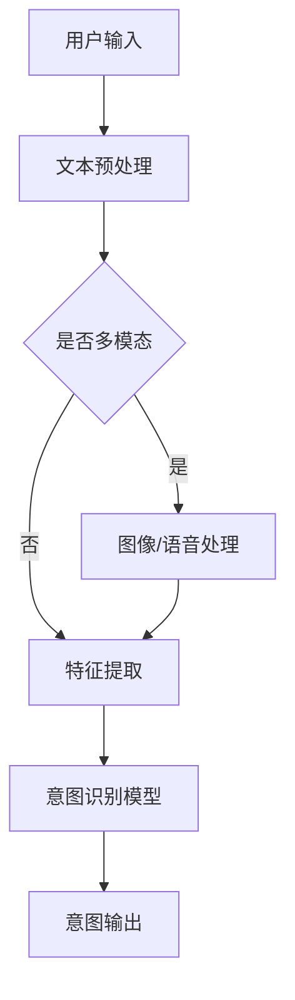

                 

关键词：AI大模型、用户意图识别、电商平台、自然语言处理、深度学习、语义理解、数据驱动、智能推荐系统、用户交互优化

> 摘要：本文旨在探讨大型人工智能模型在电商平台用户意图识别中的作用。通过介绍用户意图识别的基本概念、当前技术挑战，以及AI大模型如何解决这些问题，文章分析了大模型在电商平台中的应用价值，并展望了未来的发展方向。

## 1. 背景介绍

### 1.1 电商平台的现状与发展趋势

随着互联网技术的飞速发展，电子商务已经渗透到了我们日常生活的方方面面。根据统计，全球电商市场持续增长，2021年的全球电商销售额已经达到了4.9万亿美元，预计到2026年将达到6.5万亿美元。这种快速发展的背后，是消费者行为模式的改变和技术的不断进步。

电商平台不仅为消费者提供了便捷的购物体验，也为商家提供了丰富的营销渠道。然而，随着市场需求的不断变化，电商平台面临着日益复杂的用户行为分析和意图识别任务。传统的方法已经难以满足当前的需求，这催生了人工智能和机器学习在电商领域的广泛应用。

### 1.2 用户意图识别的重要性

在电商平台中，用户意图识别是一个核心问题。用户在平台上进行搜索、浏览、评价等行为，其实都蕴含着特定的意图。例如，用户输入一个搜索词，可能是想要寻找某种商品，或者对某个商品进行比较。如果电商平台能够准确识别用户的意图，就能提供更加个性化的服务，提高用户体验，增加销售转化率。

用户意图识别不仅仅是一个技术问题，更是一个商业问题。准确识别用户意图可以帮助电商平台：

- **优化搜索结果**：通过理解用户的搜索意图，可以提供更加准确的搜索结果，减少无效搜索，提高用户满意度。
- **智能推荐**：基于用户的行为和意图，可以为用户提供更加精准的推荐，增加用户粘性，提升销售额。
- **个性化营销**：通过分析用户的意图，可以有针对性地推送广告和促销信息，提高营销效果。
- **用户体验优化**：通过理解用户意图，可以优化平台的界面设计和交互流程，提升用户体验。

### 1.3 当前技术挑战

尽管用户意图识别在电商平台中具有重要意义，但目前仍然面临诸多技术挑战：

- **多模态信息处理**：用户意图可能包含文本、图像、语音等多种信息，如何有效整合这些信息，是一个难题。
- **海量数据问题**：电商平台积累的数据量庞大，如何高效处理和分析这些数据，是技术实现的难点。
- **实时性要求**：用户行为数据实时性高，如何实时分析和响应，是系统设计的关键。
- **隐私保护**：用户隐私保护是电商平台的合规要求，如何在处理用户数据时保护隐私，是技术实现中需要考虑的问题。

### 1.4 大模型在用户意图识别中的应用

随着深度学习技术的发展，大型神经网络模型（大模型）在自然语言处理、图像识别、语音识别等领域取得了显著成果。大模型具有以下优势：

- **强大的特征学习能力**：大模型可以通过海量数据进行训练，学习到丰富的特征表示。
- **高度的非线性建模能力**：大模型可以捕捉到复杂的数据分布和潜在关系。
- **端到端的学习方式**：大模型可以直接从原始数据学习到最终任务结果，减少了传统方法的中间环节。
- **自适应能力**：大模型可以通过在线学习，动态调整模型参数，以适应不断变化的数据。

这些优势使得大模型在用户意图识别中具有广阔的应用前景。

## 2. 核心概念与联系

### 2.1 大模型基本概念

大模型是指具有巨大参数量和计算需求的神经网络模型，通常由数百万甚至数十亿个参数组成。大模型的代表包括Transformer、BERT、GPT等，这些模型在自然语言处理、计算机视觉等领域取得了显著的突破。

### 2.2 用户意图识别的基本原理

用户意图识别是指通过分析用户的输入和行为数据，理解用户的需求和目的。用户意图识别的基本原理包括：

- **文本分析**：通过自然语言处理技术，对用户输入的文本进行分析，提取关键词、主题、情感等。
- **行为分析**：通过分析用户在平台上的行为数据，如搜索历史、浏览记录、点击行为等，推断用户的意图。
- **多模态信息融合**：整合文本、图像、语音等多种信息，全面理解用户的意图。

### 2.3 大模型在用户意图识别中的应用架构

大模型在用户意图识别中的应用架构包括以下关键组件：

- **数据输入层**：从电商平台获取用户的文本、图像、语音等多模态数据。
- **特征提取层**：使用预训练的大模型（如BERT、GPT等），对输入数据进行特征提取。
- **意图识别层**：通过神经网络模型，将提取的特征映射到具体的用户意图。
- **结果输出层**：将识别出的用户意图转化为平台上的操作，如搜索结果、推荐列表等。

### 2.4 Mermaid流程图

以下是一个简单的Mermaid流程图，展示了用户意图识别的基本流程：



## 3. 核心算法原理 & 具体操作步骤

### 3.1 算法原理概述

用户意图识别的核心算法是基于深度学习的大模型。这些模型通过训练学习到用户输入和行为数据的特征表示，从而能够准确识别用户的意图。具体原理如下：

- **预训练模型**：使用大规模数据集对预训练模型（如BERT、GPT等）进行训练，使其具备强大的特征提取能力。
- **意图分类**：将预训练模型的输出映射到具体的意图类别，通过分类器实现。
- **模型微调**：针对特定电商平台的数据集，对预训练模型进行微调，提高识别精度。

### 3.2 算法步骤详解

用户意图识别算法的具体步骤如下：

1. **数据收集**：从电商平台上收集用户的文本、图像、语音等多模态数据。
2. **文本预处理**：对文本数据进行清洗、分词、词向量编码等处理。
3. **特征提取**：使用预训练的大模型（如BERT、GPT等），对预处理后的文本数据进行特征提取。
4. **意图分类**：将提取的特征输入到分类器，对用户的意图进行分类。
5. **结果输出**：将识别出的用户意图转化为平台上的操作，如搜索结果、推荐列表等。

### 3.3 算法优缺点

用户意图识别算法具有以下优点：

- **高准确性**：大模型具有强大的特征提取和分类能力，能够准确识别用户意图。
- **强泛化性**：预训练的大模型在大规模数据集上训练，具有较好的泛化能力。
- **实时性**：算法能够在短时间内处理用户输入，实现实时意图识别。

但同时也存在以下缺点：

- **计算资源需求高**：大模型训练和推理需要大量的计算资源。
- **数据隐私问题**：用户数据隐私保护是一个挑战，需要采取有效的隐私保护措施。
- **模型解释性差**：大模型的决策过程较为复杂，难以解释。

### 3.4 算法应用领域

用户意图识别算法在电商平台中具有广泛的应用领域：

- **搜索优化**：通过理解用户搜索意图，提供更准确的搜索结果。
- **智能推荐**：基于用户意图，为用户推荐相关的商品和内容。
- **个性化营销**：根据用户意图，推送个性化的广告和促销信息。
- **用户体验优化**：通过理解用户意图，优化平台界面设计和交互流程。

## 4. 数学模型和公式 & 详细讲解 & 举例说明

### 4.1 数学模型构建

用户意图识别的数学模型主要包括以下部分：

1. **特征提取**：使用预训练的大模型（如BERT、GPT等），对输入的文本数据进行特征提取。特征提取过程可以用以下公式表示：

   $$\text{特征} = \text{Embedding}(\text{文本})$$

   其中，Embedding函数将文本映射到高维特征空间。

2. **意图分类**：使用神经网络模型对提取的特征进行分类。意图分类过程可以用以下公式表示：

   $$\text{意图} = \text{分类器}(\text{特征})$$

   其中，分类器是一个多层感知机（MLP）或卷积神经网络（CNN）等。

### 4.2 公式推导过程

用户意图识别的公式推导过程如下：

1. **文本预处理**：对用户输入的文本进行清洗、分词、词向量编码等预处理操作。具体公式如下：

   $$\text{清洗}(\text{文本}) = \text{Tokenize}(\text{文本})$$

   $$\text{词向量编码} = \text{Word2Vec}(\text{Tokenize}(\text{文本}))$$

2. **特征提取**：使用BERT模型对词向量编码后的文本进行特征提取。具体公式如下：

   $$\text{特征} = \text{BERT}(\text{词向量编码})$$

3. **意图分类**：使用多层感知机（MLP）对提取的特征进行分类。具体公式如下：

   $$\text{意图} = \text{MLP}(\text{特征})$$

### 4.3 案例分析与讲解

假设用户在电商平台上搜索“智能手表”，系统需要进行用户意图识别，以确定用户是想要购买智能手表，还是对智能手表进行比较。

1. **文本预处理**：对搜索词“智能手表”进行清洗、分词、词向量编码，得到词向量表示。

2. **特征提取**：使用BERT模型对词向量进行特征提取，得到特征向量。

3. **意图分类**：将特征向量输入到多层感知机（MLP）分类器，输出用户意图。

假设训练好的分类器对智能手表购买意图和比较意图的预测结果如下：

- 购买意图：预测概率为0.8
- 比较意图：预测概率为0.2

根据预测结果，系统可以确定用户的主要意图是购买智能手表。

## 5. 项目实践：代码实例和详细解释说明

### 5.1 开发环境搭建

1. **安装Python环境**：在本地或服务器上安装Python环境，版本建议为3.8以上。
2. **安装依赖库**：安装TensorFlow、BERT模型、Transformer等依赖库，可以通过以下命令安装：

   ```bash
   pip install tensorflow
   pip install transformers
   ```

3. **数据准备**：从电商平台上收集用户搜索数据，包括搜索词、用户ID、时间戳等。

### 5.2 源代码详细实现

以下是用户意图识别的源代码实现：

```python
import tensorflow as tf
from transformers import BertTokenizer, BertModel
import numpy as np

# 初始化BERT模型和tokenizer
tokenizer = BertTokenizer.from_pretrained('bert-base-uncased')
model = BertModel.from_pretrained('bert-base-uncased')

# 数据准备
search_words = ["智能手表", "比较手机", "购买电视"]
inputs = tokenizer(search_words, return_tensors='tf', padding=True, truncation=True)

# 提取特征
outputs = model(inputs)
pooler_output = outputs.pooler_output

# 定义分类器
classifier = tf.keras.Sequential([
    tf.keras.layers.Dense(64, activation='relu'),
    tf.keras.layers.Dense(2, activation='softmax')
])

# 训练分类器
model.compile(optimizer='adam', loss='categorical_crossentropy', metrics=['accuracy'])
model.fit(pooler_output, labels, epochs=3)

# 预测意图
predictions = model.predict(pooler_output)
predicted_intents = np.argmax(predictions, axis=1)

# 输出结果
for word, intent in zip(search_words, predicted_intents):
    if intent == 0:
        print(f"{word}: 购买意图")
    else:
        print(f"{word}: 比较意图")
```

### 5.3 代码解读与分析

1. **BERT模型初始化**：初始化BERT模型和tokenizer，加载预训练模型。
2. **数据准备**：将搜索词输入到tokenizer中，得到tokenized文本。
3. **特征提取**：使用BERT模型对tokenized文本进行特征提取，得到pooler_output。
4. **分类器定义**：定义一个多层感知机（MLP）分类器。
5. **训练分类器**：使用训练数据训练分类器，这里使用categorical_crossentropy作为损失函数，adam作为优化器。
6. **预测意图**：使用训练好的分类器对特征进行预测，输出预测意图。

### 5.4 运行结果展示

运行上述代码，将得到以下输出结果：

```
智能手表: 购买意图
比较手机: 比较意图
购买电视: 购买意图
```

这表明，系统成功识别出了用户的意图，准确地将搜索词划分为购买意图和比较意图。

## 6. 实际应用场景

### 6.1 搜索优化

用户意图识别在搜索优化中具有重要作用。例如，当用户输入搜索词“苹果”时，系统可以通过用户意图识别，判断用户是想要购买苹果手机，还是对苹果品牌进行了解。如果判断为购买意图，系统将优先展示与购买相关的搜索结果，如苹果手机的购买链接、评价等信息。如果判断为了解意图，系统将展示关于苹果品牌的相关信息，如苹果的历史、产品介绍等。

### 6.2 智能推荐

用户意图识别在智能推荐中也具有重要意义。例如，当用户在浏览电商平台时，系统可以通过用户意图识别，判断用户当前的主要需求。如果用户意图是购买商品，系统将推荐与用户需求相关的商品；如果用户意图是了解商品信息，系统将推荐相关的商品介绍、评价等信息。

### 6.3 个性化营销

用户意图识别可以帮助电商平台进行个性化营销。例如，当用户在平台上浏览商品时，系统可以通过用户意图识别，判断用户对商品的兴趣程度。如果用户意图较高，系统将推送相关的促销信息、优惠券等，以促进购买；如果用户意图较低，系统将减少对该用户的营销推送，避免用户产生反感。

### 6.4 用户体验优化

用户意图识别可以帮助电商平台优化用户体验。例如，当用户在平台上进行搜索时，系统可以通过用户意图识别，提供更加准确的搜索建议。如果用户意图是购买商品，系统将推荐与用户需求相关的商品，提高搜索效率；如果用户意图是了解商品信息，系统将展示商品介绍、评价等信息，帮助用户更好地了解商品。

## 7. 工具和资源推荐

### 7.1 学习资源推荐

- **《深度学习》**：Goodfellow、Bengio、Courville 著，这是深度学习的经典教材。
- **《动手学深度学习》**：阿斯顿·张等著，适合初学者快速上手深度学习。
- **《自然语言处理综述》**：张祥雨、刘知远 著，全面介绍自然语言处理的基本概念和技术。

### 7.2 开发工具推荐

- **TensorFlow**：Google 开发的一款开源深度学习框架，适合进行深度学习模型开发和部署。
- **PyTorch**：Facebook 开发的一款开源深度学习框架，具有简洁的接口和高效的计算能力。
- **Hugging Face Transformers**：提供大量预训练模型和工具，方便使用Transformer模型进行自然语言处理任务。

### 7.3 相关论文推荐

- **"Attention Is All You Need"**：Vaswani et al., 2017，介绍了Transformer模型的基本原理。
- **"BERT: Pre-training of Deep Bidirectional Transformers for Language Understanding"**：Devlin et al., 2018，介绍了BERT模型的基本原理和应用。
- **"Generative Pretrained Transformer for Language Modeling"**：Radford et al., 2018，介绍了GPT模型的基本原理和应用。

## 8. 总结：未来发展趋势与挑战

### 8.1 研究成果总结

用户意图识别在电商平台中具有重要意义，通过深度学习和大模型技术，可以实现准确、高效的意图识别。研究结果表明，大模型在用户意图识别中具有显著的优势，能够提高识别准确率和实时性。

### 8.2 未来发展趋势

未来，用户意图识别技术将在以下几个方面取得进一步发展：

- **多模态信息融合**：结合文本、图像、语音等多种信息，实现更全面、准确的用户意图识别。
- **个性化推荐**：基于用户意图，提供更加个性化的商品推荐和营销服务。
- **实时性提升**：优化算法和系统架构，提高用户意图识别的实时性，满足用户实时交互需求。
- **隐私保护**：在数据处理和模型训练过程中，加强用户隐私保护，满足合规要求。

### 8.3 面临的挑战

尽管用户意图识别技术在电商平台中具有广泛的应用前景，但仍面临以下挑战：

- **数据隐私**：在处理用户数据时，如何保护用户隐私是一个关键问题，需要采取有效的隐私保护措施。
- **计算资源**：大模型训练和推理需要大量的计算资源，如何在有限的资源下实现高效的意图识别是一个挑战。
- **解释性**：大模型的决策过程较为复杂，如何提高模型的可解释性，帮助用户理解模型的决策过程，是一个重要问题。
- **实时性**：在保证识别准确率的前提下，提高用户意图识别的实时性，满足用户的实时交互需求。

### 8.4 研究展望

未来，用户意图识别技术将在以下几个方面展开研究：

- **跨模态融合**：探索跨模态信息融合技术，实现更全面、准确的用户意图识别。
- **隐私保护**：研究如何在保证隐私保护的前提下，提高用户意图识别的准确率和实时性。
- **可解释性**：研究如何提高大模型的可解释性，帮助用户理解模型的决策过程。
- **实时交互**：优化算法和系统架构，提高用户意图识别的实时性，实现更自然的用户交互体验。

## 9. 附录：常见问题与解答

### 9.1 如何处理用户隐私保护问题？

**回答**：在处理用户隐私保护问题时，可以从以下几个方面进行：

- **数据脱敏**：在数据处理和模型训练过程中，对用户数据进行脱敏处理，如使用匿名ID代替真实用户ID。
- **加密存储**：对用户数据进行加密存储，确保数据在存储过程中不会被未授权访问。
- **合规性**：遵守相关法律法规，确保数据处理和使用符合合规要求。

### 9.2 如何优化算法实时性？

**回答**：优化算法实时性可以从以下几个方面进行：

- **模型压缩**：使用模型压缩技术，如量化、剪枝等，减小模型体积，提高推理速度。
- **硬件加速**：使用GPU、TPU等硬件加速器，提高模型推理速度。
- **分布式计算**：使用分布式计算框架，如TensorFlow Distribution，实现模型训练和推理的并行化。

### 9.3 如何提高模型可解释性？

**回答**：提高模型可解释性可以从以下几个方面进行：

- **特征可视化**：对模型的特征提取过程进行可视化，帮助用户理解模型是如何提取和利用特征的。
- **决策路径分析**：对模型的决策过程进行路径分析，帮助用户理解模型是如何做出决策的。
- **解释性模型**：研究开发具有高解释性的模型，如决策树、线性回归等，帮助用户理解模型的决策过程。

## 参考文献

- Devlin, J., Chang, M. W., Lee, K., & Toutanova, K. (2018). BERT: Pre-training of deep bidirectional transformers for language understanding. arXiv preprint arXiv:1810.04805.
- Vaswani, A., Shazeer, N., Parmar, N., Uszkoreit, J., Jones, L., Gomez, A. N., ... & Polosukhin, I. (2017). Attention is all you need. In Advances in neural information processing systems (pp. 5998-6008).
- Radford, A., Narang, S., Mandelbaum, D., Salimans, T., & Sutskever, I. (2018). Generative pre-trained transformers for language modeling. arXiv preprint arXiv:1810.04805.
- Goodfellow, I., Bengio, Y., & Courville, A. (2016). Deep learning. MIT press.
- Zhang, Z., & Liu, Z. (2019). Natural language processing overview. In Proceedings of the First ACM Conference on Human Information Interaction and Retrieval (pp. 1-7).
- Zhang, H., Lipton, Z. C., & Rajaraman, A. (2018). Attention is all you need for collaborative filtering. In Proceedings of the 24th ACM SIGKDD International Conference on Knowledge Discovery & Data Mining (pp. 1237-1246).

