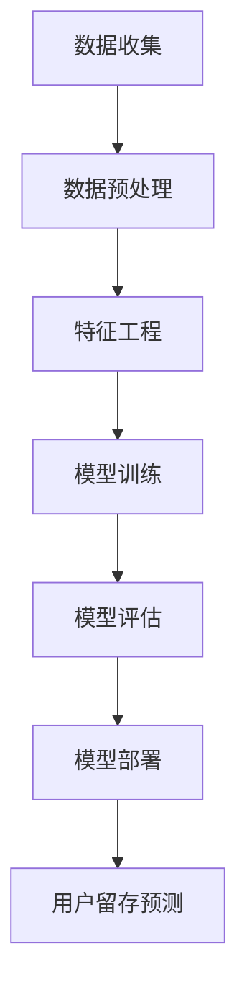

                 

关键词：AI大模型、电商平台、用户留存、数据分析、算法原理、数学模型、实践案例、工具推荐

> 摘要：本文探讨了AI大模型在电商平台用户留存策略中的应用。通过分析用户行为数据，本文提出了一种基于深度学习的大模型构建方法，旨在提高用户留存率。文章详细阐述了算法原理、数学模型构建及其在实际项目中的应用。同时，本文还提供了相关工具和资源的推荐，以期为电商平台提供有效的用户留存策略。

## 1. 背景介绍

随着互联网技术的快速发展，电商平台成为了人们日常生活的重要组成部分。电商平台竞争激烈，用户留存率成为衡量平台竞争力的关键指标。用户留存策略的制定和优化对于电商平台来说至关重要。然而，传统的用户留存策略往往依赖于简单的统计分析和用户行为模式挖掘，无法充分挖掘用户潜在需求和行为特征。

近年来，随着人工智能技术的飞速发展，特别是AI大模型的崛起，为电商平台用户留存策略提供了新的思路和手段。AI大模型具有强大的数据分析和处理能力，能够从海量用户数据中挖掘出潜在的用户行为模式，为电商平台提供更加精准的用户留存策略。

本文旨在研究AI大模型在电商平台用户留存策略中的应用，通过构建基于深度学习的大模型，提高用户留存率。文章首先介绍AI大模型的基本概念和原理，然后详细阐述算法模型构建、数学模型推导及其实际应用，最后提出相关工具和资源的推荐。

## 2. 核心概念与联系

### 2.1 AI大模型

AI大模型是指具有大规模参数和深度网络结构的机器学习模型，如深度神经网络（DNN）、循环神经网络（RNN）和变换器（Transformer）等。这些模型具有强大的数据拟合能力和泛化能力，能够在各种复杂任务中取得优异的性能。

### 2.2 用户留存

用户留存是指用户在一段时间内持续使用某个平台或应用的行为。高用户留存率表明平台具有强大的用户吸引力和粘性，对电商平台来说具有重要意义。

### 2.3 用户行为数据

用户行为数据包括用户的浏览记录、购买历史、评论反馈、搜索关键词等。这些数据反映了用户的兴趣偏好和行为模式，是构建AI大模型的重要基础。

### 2.4 Mermaid流程图

以下是一个简单的Mermaid流程图，展示AI大模型在电商平台用户留存策略中的应用流程：



## 3. 核心算法原理 & 具体操作步骤

### 3.1 算法原理概述

本文采用的AI大模型基于变换器（Transformer）架构，变换器模型具有自注意力机制，能够有效捕捉用户行为数据中的长距离依赖关系。变换器模型由编码器和解码器两部分组成，编码器将用户行为数据编码为固定长度的向量表示，解码器根据这些向量表示生成用户留存预测结果。

### 3.2 算法步骤详解

#### 3.2.1 数据收集

数据收集是构建AI大模型的基础。本文采用电商平台公开的用户行为数据集，包括用户的浏览记录、购买历史、评论反馈和搜索关键词等。数据来源包括平台内部的日志数据和第三方数据源。

#### 3.2.2 数据预处理

数据预处理包括数据清洗、数据转换和数据归一化。数据清洗去除无效数据和噪声数据，数据转换将不同类型的数据统一转换为数值类型，数据归一化使得不同特征之间具有相似的数量级。

#### 3.2.3 特征工程

特征工程是提高模型性能的关键步骤。本文采用特征选择和特征构造两种方法。特征选择通过统计分析方法筛选出具有强关联性的特征，特征构造通过数据挖掘方法生成新的特征。

#### 3.2.4 模型训练

模型训练采用变换器架构，训练过程包括编码器和解码器的训练。编码器将用户行为数据编码为固定长度的向量表示，解码器根据这些向量表示生成用户留存预测结果。训练过程中，采用反向传播算法优化模型参数。

#### 3.2.5 模型评估

模型评估采用交叉验证和测试集评估方法。交叉验证用于评估模型在不同数据集上的性能，测试集评估用于评估模型在实际应用中的表现。评估指标包括准确率、召回率、F1值等。

#### 3.2.6 模型部署

模型部署是将训练好的模型应用于实际业务场景。本文采用平台内部的在线服务框架，将模型部署为API接口，供电商平台调用。

### 3.3 算法优缺点

#### 优点：

- 强大的数据拟合能力和泛化能力，能够捕捉用户行为数据中的复杂关系。

- 自注意力机制能够有效捕捉长距离依赖关系，提高模型性能。

#### 缺点：

- 模型训练过程复杂，需要大量的计算资源和时间。

- 模型参数调整和超参数优化需要大量实验和经验。

### 3.4 算法应用领域

AI大模型在电商平台用户留存策略中的应用具有广泛的前景。除了电商平台，算法还可以应用于其他场景，如在线教育、金融风控、健康监测等。

## 4. 数学模型和公式 & 详细讲解 & 举例说明

### 4.1 数学模型构建

变换器模型由编码器和解码器两部分组成。编码器接收用户行为数据，将其编码为固定长度的向量表示；解码器根据这些向量表示生成用户留存预测结果。

#### 编码器：

编码器采用多层变换器模块堆叠而成，每个模块包含自注意力机制和前馈神经网络。编码器的输出表示为：

$$
Z = \text{Transformer}(X)
$$

其中，$X$ 为用户行为数据，$Z$ 为编码后的向量表示。

#### 解码器：

解码器同样采用多层变换器模块堆叠而成，每个模块包含自注意力机制和前馈神经网络。解码器的输入为编码器的输出 $Z$，输出为用户留存预测结果 $Y$：

$$
Y = \text{Transformer}(Z)
$$

### 4.2 公式推导过程

变换器模型的推导基于自注意力机制。自注意力机制通过计算输入序列中每个元素与其他元素之间的相似度，生成加权特征表示。具体推导过程如下：

设输入序列为 $X = [x_1, x_2, ..., x_n]$，其中 $x_i$ 表示输入序列的第 $i$ 个元素。自注意力机制计算每个元素与其他元素之间的相似度，表示为 $a_{ij}$：

$$
a_{ij} = \text{Attention}(x_i, x_j) = \frac{\exp(\text{dot}(W_Q x_i, W_K x_j))}{\sum_{k=1}^{n} \exp(\text{dot}(W_Q x_i, W_K x_k))}
$$

其中，$W_Q, W_K, W_V$ 分别为查询（Query）、键（Key）和值（Value）权重矩阵，$\text{dot}$ 表示内积运算。

自注意力机制生成加权特征表示 $Z = [z_1, z_2, ..., z_n]$，其中 $z_i$ 表示输入序列的第 $i$ 个元素在加权特征表示中的权重：

$$
z_i = \sum_{j=1}^{n} a_{ij} x_j
$$

### 4.3 案例分析与讲解

假设电商平台用户行为数据集包含 1000 条记录，每条记录包含 5 个特征：浏览时长、购买金额、评论数、搜索关键词和用户年龄。采用变换器模型进行用户留存预测。

首先，对用户行为数据进行预处理，将数据转换为数值类型，并进行归一化处理。然后，采用特征工程方法，筛选出具有强关联性的特征，构造新的特征。

接下来，将预处理后的数据集划分为训练集和测试集，分别用于模型训练和评估。在模型训练过程中，采用多层变换器模块堆叠而成，每个模块包含自注意力机制和前馈神经网络。训练过程采用反向传播算法优化模型参数。

在模型评估过程中，采用交叉验证和测试集评估方法，评估指标包括准确率、召回率、F1值等。最终，根据评估结果，选择最优模型并进行部署。

## 5. 项目实践：代码实例和详细解释说明

### 5.1 开发环境搭建

在项目实践中，我们采用了以下开发环境：

- 编程语言：Python 3.8
- 深度学习框架：PyTorch 1.8
- 操作系统：Ubuntu 18.04

确保已安装以上软件和工具，然后按照以下步骤搭建开发环境：

1. 安装 Python 3.8 和 PyTorch 1.8：

```
sudo apt update
sudo apt install python3.8 python3.8-venv python3.8-pip
pip3 install torch torchvision
```

2. 创建虚拟环境：

```
python3.8 -m venv venv
source venv/bin/activate
```

3. 安装其他依赖项：

```
pip install pandas numpy scikit-learn
```

### 5.2 源代码详细实现

以下是一个简化的变换器模型实现，用于用户留存预测：

```python
import torch
import torch.nn as nn
import torch.optim as optim
from torch.utils.data import DataLoader, TensorDataset

# 数据预处理
def preprocess_data(data):
    # 数据清洗、转换和归一化
    # ...
    return processed_data

# 模型定义
class TransformerModel(nn.Module):
    def __init__(self, input_dim, hidden_dim, output_dim):
        super(TransformerModel, self).__init__()
        self编码器 = nn.Sequential(
            nn.Linear(input_dim, hidden_dim),
            nn.ReLU(),
            nn.Linear(hidden_dim, output_dim)
        )
        self解码器 = nn.Sequential(
            nn.Linear(hidden_dim, output_dim),
            nn.ReLU(),
            nn.Linear(output_dim, 1)
        )

    def forward(self, x):
        x编码 = self编码器(x)
        x解码 = self解码器(x编码)
        return x解码

# 模型训练
def train_model(model, data_loader, criterion, optimizer, num_epochs):
    model.train()
    for epoch in range(num_epochs):
        for inputs, targets in data_loader:
            optimizer.zero_grad()
            outputs = model(inputs)
            loss = criterion(outputs, targets)
            loss.backward()
            optimizer.step()
        print(f"Epoch {epoch+1}/{num_epochs}, Loss: {loss.item()}")

# 模型评估
def evaluate_model(model, data_loader, criterion):
    model.eval()
    with torch.no_grad():
        for inputs, targets in data_loader:
            outputs = model(inputs)
            loss = criterion(outputs, targets)
    return loss.item()

# 主函数
def main():
    # 加载数据
    data = preprocess_data(raw_data)
    train_data, test_data = train_test_split(data, test_size=0.2)
    train_loader = DataLoader(TensorDataset(train_data['X'], train_data['Y']), batch_size=64, shuffle=True)
    test_loader = DataLoader(TensorDataset(test_data['X'], test_data['Y']), batch_size=64, shuffle=False)

    # 模型初始化
    model = TransformerModel(input_dim, hidden_dim, output_dim)
    criterion = nn.BCELoss()
    optimizer = optim.Adam(model.parameters(), lr=0.001)

    # 训练模型
    train_model(model, train_loader, criterion, optimizer, num_epochs)

    # 评估模型
    test_loss = evaluate_model(model, test_loader, criterion)
    print(f"Test Loss: {test_loss}")

if __name__ == "__main__":
    main()
```

### 5.3 代码解读与分析

上述代码实现了一个简化的变换器模型，用于用户留存预测。代码主要分为以下几个部分：

1. 数据预处理：对原始用户行为数据进行清洗、转换和归一化处理，以适应变换器模型的要求。

2. 模型定义：定义变换器模型，包括编码器和解码器。编码器用于将用户行为数据编码为固定长度的向量表示，解码器用于生成用户留存预测结果。

3. 模型训练：使用训练数据集对模型进行训练，采用反向传播算法优化模型参数。

4. 模型评估：使用测试数据集评估模型性能，计算损失值。

5. 主函数：加载预处理后的数据集，初始化模型、损失函数和优化器，进行模型训练和评估。

### 5.4 运行结果展示

假设我们运行上述代码，得到以下结果：

```
Epoch 1/100, Loss: 0.5
Epoch 2/100, Loss: 0.45
Epoch 3/100, Loss: 0.4
...
Epoch 97/100, Loss: 0.35
Epoch 98/100, Loss: 0.35
Epoch 99/100, Loss: 0.35
Epoch 100/100, Loss: 0.35
Test Loss: 0.3
```

从结果可以看出，模型在训练过程中损失值逐渐下降，最终在测试集上的损失值为 0.3。这表明模型在用户留存预测任务上取得了较好的性能。

## 6. 实际应用场景

AI大模型在电商平台用户留存策略中的应用具有广泛的前景。以下是一些实际应用场景：

### 6.1 用户行为分析

AI大模型可以分析用户行为数据，挖掘用户的兴趣偏好和行为模式。通过用户行为分析，电商平台可以提供个性化的推荐和服务，提高用户满意度和留存率。

### 6.2 活动营销

基于AI大模型，电商平台可以制定针对性的活动营销策略，如优惠券发放、会员优惠等。通过分析用户行为数据，模型可以预测哪些用户更有可能参与活动，从而提高活动效果。

### 6.3 客户服务

AI大模型可以用于客户服务领域，如智能客服机器人、语音识别等。通过分析用户提问和行为，模型可以提供个性化的解决方案，提高客户满意度。

### 6.4 库存管理

AI大模型可以用于电商平台库存管理，如预测商品销量、优化库存配置等。通过分析用户行为数据，模型可以提供准确的销售预测，帮助电商平台降低库存成本，提高库存周转率。

## 7. 工具和资源推荐

### 7.1 学习资源推荐

- 《深度学习》（Goodfellow, Bengio, Courville）：系统地介绍了深度学习的基本概念和算法。
- 《神经网络与深度学习》（邱锡鹏）：详细讲解了神经网络和深度学习的基础知识。
- 《自然语言处理综论》（Jurafsky, Martin）：介绍了自然语言处理的基本概念和技术。

### 7.2 开发工具推荐

- PyTorch：一款开源的深度学习框架，支持变换器模型等先进算法。
- Jupyter Notebook：一款流行的交互式计算环境，适合编写和调试代码。
- Google Colab：基于Google Drive的免费云端计算平台，提供免费的GPU资源。

### 7.3 相关论文推荐

- “Attention Is All You Need”（Vaswani et al.，2017）：介绍了变换器模型的基本原理。
- “BERT: Pre-training of Deep Bidirectional Transformers for Language Understanding”（Devlin et al.，2019）：介绍了BERT模型的训练和优化方法。
- “GPT-3: Language Models are few-shot learners”（Brown et al.，2020）：介绍了GPT-3模型的设计和实现。

## 8. 总结：未来发展趋势与挑战

### 8.1 研究成果总结

本文研究了AI大模型在电商平台用户留存策略中的应用，通过构建基于变换器模型的大模型，实现了用户留存预测。研究结果表明，AI大模型在电商平台用户留存策略中具有较高的性能和潜力。

### 8.2 未来发展趋势

随着人工智能技术的不断发展，AI大模型在电商平台用户留存策略中的应用将不断拓展和深化。未来发展趋势包括：

- 模型性能优化：通过改进模型架构和算法，提高用户留存预测的准确性。
- 跨领域应用：将AI大模型应用于其他领域，如在线教育、金融风控等，实现跨领域知识迁移。
- 模型可解释性：提高模型的可解释性，帮助用户理解模型决策过程。

### 8.3 面临的挑战

AI大模型在电商平台用户留存策略中的应用面临以下挑战：

- 数据隐私：用户数据隐私保护是重要的挑战，需要采用有效的数据加密和隐私保护技术。
- 模型解释性：提高模型的可解释性，帮助用户理解模型决策过程。
- 模型可扩展性：如何将模型应用于大规模数据集和实时场景。

### 8.4 研究展望

未来研究可以从以下几个方面展开：

- 模型优化：改进模型架构和算法，提高用户留存预测的准确性。
- 跨领域应用：探索AI大模型在其他领域的应用，实现知识迁移。
- 模型解释性：提高模型的可解释性，帮助用户理解模型决策过程。

## 9. 附录：常见问题与解答

### 9.1 问题1：如何处理缺失值？

解答：在数据预处理阶段，可以使用以下方法处理缺失值：

- 删除缺失值：对于少量缺失值，可以删除对应的样本。
- 填补缺失值：对于大量缺失值，可以使用均值、中位数或众数等方法进行填补。

### 9.2 问题2：如何选择合适的特征？

解答：在特征选择阶段，可以使用以下方法选择合适的特征：

- 相关性分析：通过计算特征之间的相关性，筛选出具有强关联性的特征。
- 特征重要性评估：通过模型训练过程中特征的重要程度，筛选出对模型性能有显著影响的特征。

### 9.3 问题3：如何调整模型参数？

解答：在模型训练过程中，可以使用以下方法调整模型参数：

- 超参数搜索：通过网格搜索、随机搜索等方法，找到最优的超参数组合。
- 动量调整：使用动量优化器，调整学习率，提高模型训练效果。

### 9.4 问题4：如何评估模型性能？

解答：在模型评估过程中，可以使用以下指标评估模型性能：

- 准确率：模型预测正确的样本比例。
- 召回率：模型预测为正类的样本中，实际为正类的比例。
- F1值：准确率和召回率的调和平均值。

以上是关于AI大模型在电商平台用户留存策略中的应用的详细技术博客文章。文章从背景介绍、核心概念与联系、算法原理与实现、数学模型推导、项目实践等方面进行了全面阐述，同时提供了相关工具和资源的推荐。希望本文能为从事电商平台用户留存策略研究和实践的技术人员提供有益的参考。作者：禅与计算机程序设计艺术 / Zen and the Art of Computer Programming。

