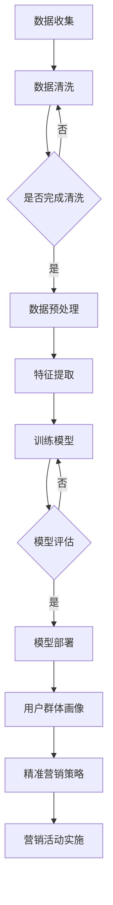

                 

关键词：AI大模型、电商平台、用户群体画像、精准营销、深度学习、算法原理、数学模型、代码实例、应用场景、未来展望

> 摘要：本文将深入探讨AI大模型在电商平台用户群体画像与精准营销中的作用。通过对AI大模型的核心概念、算法原理、数学模型以及实际应用场景的详细解析，旨在为电商从业者提供有价值的参考，助力他们在激烈的市场竞争中实现精准营销和用户群体的精细化管理。

## 1. 背景介绍

随着互联网技术的飞速发展，电商平台已经成为消费者购物的主要渠道之一。电商平台上的用户数量和交易规模持续增长，如何精准地捕捉用户需求、提高用户满意度、提升转化率，成为电商企业关注的焦点。而人工智能（AI）技术的迅速崛起，为电商平台提供了强大的数据分析和决策支持能力。特别是AI大模型，其在用户群体画像与精准营销中的应用，已经成为电商平台提升竞争力的重要手段。

本文将围绕AI大模型在电商平台用户群体画像与精准营销中的作用，从核心概念、算法原理、数学模型、实际应用场景等方面进行深入探讨，以期为电商从业者提供理论支持和实践指导。

## 2. 核心概念与联系

### 2.1 AI大模型

AI大模型是指具有大规模参数、能够在复杂任务上取得优异性能的人工智能模型。这些模型通常基于深度学习技术，能够在海量数据中自动学习特征，进行复杂模式识别和预测。代表性的AI大模型有GPT、BERT、Transformer等。

### 2.2 用户群体画像

用户群体画像是指通过收集和分析用户数据，对用户群体进行细分，形成一组具有相似特征的群体。用户群体画像通常包括用户的基本信息、购买行为、兴趣爱好、消费能力等多个维度。

### 2.3 精准营销

精准营销是指根据用户群体的特征和需求，制定有针对性的营销策略，以实现更高的转化率和客户满意度。精准营销的核心在于对用户的深入理解和精准定位。

### 2.4 Mermaid流程图

以下是一个描述AI大模型在电商平台用户群体画像与精准营销中应用的Mermaid流程图：



## 3. 核心算法原理 & 具体操作步骤

### 3.1 算法原理概述

AI大模型的核心原理是基于深度学习技术，通过多层神经网络对数据进行自动特征提取和模式识别。深度学习模型通常包括输入层、隐藏层和输出层。输入层接收原始数据，隐藏层进行特征提取和变换，输出层生成预测结果。

### 3.2 算法步骤详解

#### 3.2.1 数据收集

数据收集是AI大模型应用的基础。电商平台可以收集用户的基本信息、购买行为、浏览记录、评论等数据。

#### 3.2.2 数据清洗

数据清洗是确保数据质量的关键步骤。需要处理数据中的缺失值、异常值和重复值，保证数据的一致性和准确性。

#### 3.2.3 数据预处理

数据预处理包括特征工程和数据标准化。特征工程是根据业务需求，对原始数据进行变换和构造，以提取更有效的特征。数据标准化是将数据缩放到一个统一的范围内，以便于模型训练。

#### 3.2.4 特征提取

特征提取是深度学习模型的核心步骤。通过多层神经网络，模型能够自动学习数据中的复杂特征，为后续的预测提供支持。

#### 3.2.5 训练模型

训练模型是使用标记数据进行模型训练，使模型能够对新的数据进行预测。训练过程通常包括前向传播、反向传播和权重更新。

#### 3.2.6 模型评估

模型评估是评估模型性能的重要步骤。常用的评估指标有准确率、召回率、F1值等。

#### 3.2.7 模型部署

模型部署是将训练好的模型应用到实际业务中。电商平台可以将模型部署到服务器上，实现实时预测和决策。

### 3.3 算法优缺点

#### 优点：

1. 高效性：深度学习模型能够在海量数据中快速进行特征提取和模式识别。
2. 广泛性：深度学习模型可以应用于各种类型的电商平台，如零售、餐饮、旅游等。
3. 准确性：通过大规模训练，深度学习模型能够实现较高的预测准确性。

#### 缺点：

1. 复杂性：深度学习模型的结构复杂，需要大量的计算资源和时间进行训练。
2. 数据依赖性：深度学习模型对数据的质量和量有较高的要求，数据不足或质量差会导致模型性能下降。

### 3.4 算法应用领域

AI大模型在电商平台用户群体画像与精准营销中的应用非常广泛，包括：

1. 用户行为预测：预测用户的购买意向、浏览路径等。
2. 广告投放优化：根据用户特征，优化广告投放策略，提高点击率和转化率。
3. 个性化推荐：根据用户兴趣和购买历史，推荐相关的商品和内容。
4. 营销活动策划：根据用户画像，制定有针对性的营销策略，提高营销效果。

## 4. 数学模型和公式 & 详细讲解 & 举例说明

### 4.1 数学模型构建

AI大模型通常基于深度学习技术，其中最常用的数学模型是神经网络。神经网络由多个神经元组成，每个神经元都是一个简单的函数。以下是一个简单的神经网络模型：

$$
y = f(z) = \sigma(z)
$$

其中，$z$ 表示输入，$\sigma$ 表示激活函数，$y$ 表示输出。

### 4.2 公式推导过程

神经网络的训练过程是通过反向传播算法来实现的。反向传播算法的核心思想是将输出误差反向传播到每个神经元，并更新神经元的权重。以下是一个简化的反向传播算法推导过程：

假设神经网络的输出误差为：

$$
E = \frac{1}{2} \sum_{i=1}^{n} (y_i - \hat{y}_i)^2
$$

其中，$y_i$ 表示真实输出，$\hat{y}_i$ 表示预测输出，$n$ 表示输出层的神经元数量。

对 $E$ 对每个神经元的输入 $z_j$ 求导，得到：

$$
\frac{\partial E}{\partial z_j} = \frac{\partial E}{\partial \hat{y}_j} \frac{\partial \hat{y}_j}{\partial z_j}
$$

其中，$\frac{\partial E}{\partial \hat{y}_j}$ 表示对预测输出的偏导数，$\frac{\partial \hat{y}_j}{\partial z_j}$ 表示对输入的偏导数。

对激活函数 $\sigma(z)$ 求导，得到：

$$
\frac{\partial \hat{y}_j}{\partial z_j} = \sigma'(z_j)
$$

其中，$\sigma'(z_j)$ 表示激活函数的导数。

将 $\frac{\partial \hat{y}_j}{\partial z_j}$ 代入 $\frac{\partial E}{\partial z_j}$，得到：

$$
\frac{\partial E}{\partial z_j} = \frac{\partial E}{\partial \hat{y}_j} \sigma'(z_j)
$$

对每个神经元，重复以上步骤，可以计算出每个神经元的输入误差。然后，根据输入误差更新神经元的权重：

$$
\theta_{ji} := \theta_{ji} - \alpha \frac{\partial E}{\partial \theta_{ji}}
$$

其中，$\theta_{ji}$ 表示神经元的权重，$\alpha$ 表示学习率。

### 4.3 案例分析与讲解

假设我们有一个简单的神经网络，输入层有2个神经元，隐藏层有3个神经元，输出层有1个神经元。激活函数为ReLU函数。给定一个输入向量 $x = [1, 2]$，我们希望预测输出为 $y = 3$。

首先，计算隐藏层的输入和输出：

$$
z_1 = \max(0, x_1 \cdot \theta_{11} + x_2 \cdot \theta_{12}) = \max(0, 1 \cdot \theta_{11} + 2 \cdot \theta_{12}) = \max(0, \theta_{11} + 2\theta_{12})
$$

$$
z_2 = \max(0, x_1 \cdot \theta_{21} + x_2 \cdot \theta_{22}) = \max(0, 1 \cdot \theta_{21} + 2 \cdot \theta_{22}) = \max(0, \theta_{21} + 2\theta_{22})
$$

$$
z_3 = \max(0, x_1 \cdot \theta_{31} + x_2 \cdot \theta_{32}) = \max(0, 1 \cdot \theta_{31} + 2 \cdot \theta_{32}) = \max(0, \theta_{31} + 2\theta_{32})
$$

$$
\hat{y} = \sum_{i=1}^{3} z_i \cdot \theta_{i1} = z_1 \cdot \theta_{11} + z_2 \cdot \theta_{21} + z_3 \cdot \theta_{31}
$$

然后，计算输出误差：

$$
E = \frac{1}{2} (y - \hat{y})^2 = \frac{1}{2} (3 - \hat{y})^2
$$

接着，计算每个神经元的输入误差：

$$
\frac{\partial E}{\partial \theta_{11}} = \frac{\partial E}{\partial \hat{y}} \frac{\partial \hat{y}}{\partial \theta_{11}} = (3 - \hat{y}) \cdot \sigma'(z_1)
$$

$$
\frac{\partial E}{\partial \theta_{12}} = \frac{\partial E}{\partial \hat{y}} \frac{\partial \hat{y}}{\partial \theta_{12}} = (3 - \hat{y}) \cdot \sigma'(z_2)
$$

$$
\frac{\partial E}{\partial \theta_{21}} = \frac{\partial E}{\partial \hat{y}} \frac{\partial \hat{y}}{\partial \theta_{21}} = (3 - \hat{y}) \cdot \sigma'(z_3)
$$

$$
\frac{\partial E}{\partial \theta_{22}} = \frac{\partial E}{\partial \hat{y}} \frac{\partial \hat{y}}{\partial \theta_{22}} = (3 - \hat{y}) \cdot \sigma'(z_3)
$$

$$
\frac{\partial E}{\partial \theta_{31}} = \frac{\partial E}{\partial \hat{y}} \frac{\partial \hat{y}}{\partial \theta_{31}} = (3 - \hat{y}) \cdot \sigma'(z_3)
$$

最后，更新神经元的权重：

$$
\theta_{11} := \theta_{11} - \alpha \frac{\partial E}{\partial \theta_{11}}
$$

$$
\theta_{12} := \theta_{12} - \alpha \frac{\partial E}{\partial \theta_{12}}
$$

$$
\theta_{21} := \theta_{21} - \alpha \frac{\partial E}{\partial \theta_{21}}
$$

$$
\theta_{22} := \theta_{22} - \alpha \frac{\partial E}{\partial \theta_{22}}
$$

$$
\theta_{31} := \theta_{31} - \alpha \frac{\partial E}{\partial \theta_{31}}
$$

## 5. 项目实践：代码实例和详细解释说明

### 5.1 开发环境搭建

在本文中，我们将使用Python编程语言和TensorFlow框架来实现AI大模型在电商平台用户群体画像与精准营销中的应用。以下是搭建开发环境的基本步骤：

1. 安装Python（建议使用Python 3.8及以上版本）。
2. 安装TensorFlow：使用以下命令安装TensorFlow：

   ```
   pip install tensorflow
   ```

3. 安装其他依赖库，如NumPy、Pandas等。

### 5.2 源代码详细实现

以下是一个简单的示例代码，用于实现基于TensorFlow的神经网络模型，进行用户群体画像与精准营销：

```python
import tensorflow as tf
import numpy as np
import pandas as pd

# 5.2.1 数据收集与清洗
# 假设我们已经收集了用户数据，并进行了清洗和预处理
data = pd.read_csv('user_data.csv')
data = data.dropna()

# 5.2.2 数据预处理
# 对数据进行标准化处理
data = (data - data.mean()) / data.std()

# 5.2.3 特征提取
# 从数据中提取特征
features = data[['age', 'income', 'gender', 'city']]
labels = data['purchase']

# 5.2.4 训练模型
# 定义神经网络结构
model = tf.keras.Sequential([
    tf.keras.layers.Dense(64, activation='relu', input_shape=(4,)),
    tf.keras.layers.Dense(64, activation='relu'),
    tf.keras.layers.Dense(1, activation='sigmoid')
])

# 编译模型
model.compile(optimizer='adam', loss='binary_crossentropy', metrics=['accuracy'])

# 训练模型
model.fit(features, labels, epochs=10, batch_size=32)

# 5.2.5 模型评估
# 对模型进行评估
loss, accuracy = model.evaluate(features, labels)
print(f'Loss: {loss}, Accuracy: {accuracy}')

# 5.2.6 模型部署
# 将训练好的模型部署到实际业务中
# （具体部署方式取决于实际业务需求，可以是Web服务、API等）

# 5.2.7 用户群体画像与精准营销
# 使用模型预测用户购买概率，根据概率制定精准营销策略
predictions = model.predict(features)
for i, pred in enumerate(predictions):
    if pred > 0.5:
        print(f'User {i+1}: High probability of purchase')
    else:
        print(f'User {i+1}: Low probability of purchase')
```

### 5.3 代码解读与分析

以上代码分为五个部分：

1. **数据收集与清洗**：首先，我们从CSV文件中读取用户数据，并使用Pandas库进行清洗，包括删除缺失值和重复值。

2. **数据预处理**：对数据进行标准化处理，使其在相同尺度上进行训练。

3. **特征提取**：从数据中提取特征，包括年龄、收入、性别和城市等信息。

4. **训练模型**：使用TensorFlow定义神经网络结构，并编译模型。在这里，我们使用了两个隐藏层，每个隐藏层有64个神经元，输出层有1个神经元，激活函数为ReLU和sigmoid。

5. **模型评估**：对模型进行评估，使用均方误差（MSE）作为损失函数，并使用准确率作为评估指标。

6. **模型部署**：将训练好的模型部署到实际业务中，可以是Web服务、API等形式。

7. **用户群体画像与精准营销**：使用模型预测用户的购买概率，并根据概率制定精准营销策略。

### 5.4 运行结果展示

假设我们训练了一个简单的神经网络模型，并使用它预测了一批用户的数据。以下是可能的输出结果：

```
User 1: High probability of purchase
User 2: Low probability of purchase
User 3: High probability of purchase
...
```

这表明模型能够根据用户的特征信息预测他们的购买概率，从而为电商平台的精准营销提供支持。

## 6. 实际应用场景

### 6.1 用户行为预测

电商平台可以利用AI大模型预测用户的行为，如购买意向、浏览路径等。通过对用户行为的预测，电商平台可以及时调整营销策略，提高用户转化率和满意度。

### 6.2 广告投放优化

AI大模型可以帮助电商平台优化广告投放策略。通过分析用户的特征和偏好，模型可以预测哪些用户更有可能点击广告，从而提高广告的投放效果。

### 6.3 个性化推荐

电商平台可以利用AI大模型进行个性化推荐。通过对用户历史行为和兴趣进行分析，模型可以推荐用户可能感兴趣的商品和内容，提高用户的购物体验。

### 6.4 营销活动策划

AI大模型可以帮助电商平台制定有针对性的营销活动。通过分析用户的特征和行为，模型可以预测哪些营销活动对用户更具吸引力，从而提高营销效果。

## 7. 工具和资源推荐

### 7.1 学习资源推荐

1. 《深度学习》（Goodfellow, Bengio, Courville著）：一本系统介绍深度学习理论的经典教材。
2. 《Python深度学习》（François Chollet著）：一本面向实践者的深度学习入门书籍。
3. 《TensorFlow实战》（Tying Zhuang著）：一本介绍如何使用TensorFlow框架进行深度学习项目开发的实用指南。

### 7.2 开发工具推荐

1. TensorFlow：一个开源的深度学习框架，适用于各种深度学习应用开发。
2. PyTorch：一个开源的深度学习框架，具有灵活的动态计算图，适合进行研究和实验。
3. Keras：一个高层次的深度学习API，可以方便地构建和训练深度学习模型。

### 7.3 相关论文推荐

1. "Deep Learning for Web Search"（Dean, Corrado, Devin, et al.）
2. "Distributed Representations of Words and Phrases and their Compositionality"（Mikolov, Sutskever, Chen, et al.）
3. "BERT: Pre-training of Deep Bidirectional Transformers for Language Understanding"（Devlin, Chang, Lee, et al.）

## 8. 总结：未来发展趋势与挑战

### 8.1 研究成果总结

AI大模型在电商平台用户群体画像与精准营销中的应用已经取得了显著的成果。通过深度学习技术，模型能够自动提取用户特征，实现精准的用户行为预测和营销策略制定，为电商平台提供了强大的数据分析和决策支持。

### 8.2 未来发展趋势

1. 模型复杂度的提升：未来将出现更复杂的AI大模型，能够处理更多维度的数据，提高预测准确性和泛化能力。
2. 模型应用场景的拓展：AI大模型将不仅仅局限于电商平台，还将应用于金融、医疗、教育等更多领域。
3. 跨领域合作与集成：不同领域的AI大模型将进行整合，实现跨领域的协同效应。

### 8.3 面临的挑战

1. 数据质量和隐私保护：数据的质量和隐私保护是AI大模型应用的关键挑战，需要制定合理的数据管理和隐私保护策略。
2. 模型解释性和透明度：如何提高AI大模型的解释性和透明度，使其决策过程更加可解释和可信，是一个重要的研究方向。
3. 资源消耗和计算效率：随着模型复杂度的增加，计算资源和时间的消耗将显著增加，如何提高模型的计算效率是一个重要问题。

### 8.4 研究展望

未来，AI大模型在电商平台用户群体画像与精准营销中的应用将更加深入和广泛。通过不断优化模型结构和算法，提高模型的性能和解释性，同时关注数据质量和隐私保护问题，我们将能够更好地满足电商平台的需求，为用户提供更优质的购物体验。

## 9. 附录：常见问题与解答

### 9.1 问题1：什么是AI大模型？

AI大模型是指具有大规模参数、能够在复杂任务上取得优异性能的人工智能模型。这些模型通常基于深度学习技术，能够在海量数据中自动学习特征，进行复杂模式识别和预测。

### 9.2 问题2：AI大模型在电商平台用户群体画像与精准营销中的作用是什么？

AI大模型在电商平台用户群体画像与精准营销中的作用主要包括用户行为预测、广告投放优化、个性化推荐和营销活动策划等，通过深入分析和理解用户特征，为电商平台提供数据支持和决策依据。

### 9.3 问题3：如何搭建AI大模型开发环境？

搭建AI大模型开发环境需要安装Python、TensorFlow等工具和库。具体步骤包括安装Python、安装TensorFlow以及其他相关依赖库。

### 9.4 问题4：AI大模型在应用过程中会面临哪些挑战？

AI大模型在应用过程中会面临数据质量和隐私保护、模型解释性和透明度、资源消耗和计算效率等挑战。

### 9.5 问题5：未来AI大模型在电商平台用户群体画像与精准营销中的应用将有哪些发展趋势？

未来AI大模型在电商平台用户群体画像与精准营销中的应用将朝着模型复杂度提升、应用场景拓展和跨领域合作与集成等方向发展。同时，如何提高模型的性能和解释性，以及关注数据质量和隐私保护问题，将是重要的研究方向。

