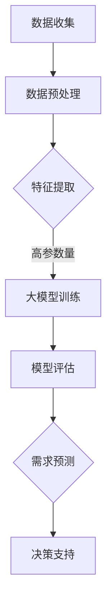

                 

关键词：人工智能、大模型、电商平台、用户需求预测、算法、数学模型、实践案例、未来展望

> 摘要：本文旨在探讨人工智能大模型在电商平台用户需求预测中的应用。通过详细解析大模型的核心概念、算法原理、数学模型以及具体实现，本文揭示了其在电商平台用户行为分析、个性化推荐和营销策略制定中的重要作用。同时，本文还对未来应用前景和面临的挑战进行了展望。

## 1. 背景介绍

随着互联网技术的飞速发展和电商行业的不断壮大，电商平台已经成为现代商业活动的重要场所。然而，面对海量用户和商品数据，如何准确预测用户需求、提高用户体验、优化运营策略，成为电商平台亟待解决的问题。传统的方法主要依赖于统计学和机器学习技术，但这些方法在面对复杂、动态的用户行为时，往往难以取得理想的效果。

近年来，人工智能，尤其是深度学习技术的发展，为电商平台用户需求预测带来了新的契机。大模型，作为深度学习的一个重要分支，具有处理海量数据、捕捉复杂模式的能力。大模型在电商平台用户需求预测中的应用，不仅能够提高预测准确性，还能够为电商平台提供更加智能的决策支持。

本文将围绕大模型在电商平台用户需求预测中的应用，探讨其核心概念、算法原理、数学模型以及实践案例，旨在为电商平台提供理论指导和技术支持。

## 2. 核心概念与联系

### 2.1 大模型概述

大模型（Large-scale Model），通常指的是参数量巨大的神经网络模型。这些模型具有强大的表示能力，能够处理复杂的任务，例如图像识别、自然语言处理和用户行为预测等。大模型的主要特点包括：

- **高参数量**：大模型的参数量通常在数十亿甚至千亿级别，这使得它们具有强大的表示能力。
- **深层次结构**：大模型通常具有数十层甚至上百层的神经网络结构，能够捕捉数据中的深层次特征。
- **自适应能力**：大模型能够通过不断的学习和调整，适应不同的任务和数据分布。

### 2.2 用户需求预测与电商平台

用户需求预测是电商平台的一个重要研究方向，其核心目标是通过分析用户行为数据，预测用户在未来的购买行为、兴趣偏好等。在电商平台中，用户需求预测具有以下几个关键应用：

- **个性化推荐**：通过预测用户需求，电商平台可以推荐用户可能感兴趣的商品，提高用户满意度和购买转化率。
- **营销策略制定**：基于用户需求预测，电商平台可以制定更加精准的营销策略，如优惠券发放、广告投放等。
- **库存管理**：通过预测用户需求，电商平台可以优化库存管理，减少库存积压，提高库存周转率。

### 2.3 大模型与用户需求预测的关系

大模型在用户需求预测中的应用，主要体现在以下几个方面：

- **数据处理能力**：大模型能够处理海量的用户行为数据，提取其中的潜在特征，为需求预测提供强有力的支持。
- **复杂模式捕捉**：大模型能够捕捉用户行为中的复杂模式，提高需求预测的准确性。
- **自适应更新**：大模型通过不断的训练和更新，能够适应用户行为的变化，提高预测的实时性和准确性。

### 2.4 Mermaid 流程图

以下是用户需求预测过程中大模型的应用流程图：



## 3. 核心算法原理 & 具体操作步骤

### 3.1 算法原理概述

大模型在用户需求预测中的核心算法主要是基于深度学习的神经网络模型。深度学习通过构建多层神经网络，实现对数据的分层表示和学习。在用户需求预测中，大模型的主要任务是通过学习用户历史行为数据，预测用户未来的需求。

### 3.2 算法步骤详解

#### 3.2.1 数据收集

数据收集是用户需求预测的第一步，主要包括用户行为数据、商品数据等。这些数据可以通过电商平台的后台系统、用户反馈等方式获取。

#### 3.2.2 数据预处理

数据预处理是确保数据质量和模型性能的重要步骤。主要包括数据清洗、归一化、特征提取等。

- **数据清洗**：去除数据中的噪声和异常值，保证数据的完整性。
- **归一化**：将数据缩放到一个统一的范围内，便于模型的训练。
- **特征提取**：从原始数据中提取出对需求预测有用的特征，如用户浏览记录、购买记录、商品属性等。

#### 3.2.3 大模型训练

大模型训练是用户需求预测的核心步骤。通过大量用户行为数据，训练出能够捕捉用户需求的大模型。训练过程主要包括以下步骤：

- **模型初始化**：初始化神经网络参数。
- **数据输入**：将预处理后的数据输入到模型中。
- **前向传播**：计算模型的输出结果。
- **反向传播**：根据输出结果，调整模型参数。
- **迭代优化**：重复上述步骤，直到模型性能达到预设标准。

#### 3.2.4 模型评估

模型评估是验证大模型性能的重要步骤。常用的评估指标包括准确率、召回率、F1值等。通过评估，可以确定模型是否能够准确预测用户需求。

#### 3.2.5 需求预测

在模型评估通过后，可以将大模型应用于实际需求预测。通过输入新的用户行为数据，大模型可以预测用户未来的需求，为电商平台提供决策支持。

### 3.3 算法优缺点

#### 优点

- **高准确性**：大模型能够处理海量数据，捕捉复杂模式，提高需求预测的准确性。
- **自适应能力**：大模型能够通过不断的训练和更新，适应用户行为的变化，提高预测的实时性和准确性。
- **广泛适用性**：大模型可以应用于不同类型的电商平台，满足多样化的需求预测需求。

#### 缺点

- **计算资源需求大**：大模型的训练和预测需要大量的计算资源，对硬件设备的要求较高。
- **数据隐私问题**：用户行为数据涉及用户隐私，如何保障数据的安全性和隐私性是重要的挑战。
- **过拟合风险**：在训练过程中，大模型容易受到训练数据的影响，出现过拟合现象。

### 3.4 算法应用领域

大模型在用户需求预测中的应用非常广泛，主要涉及以下几个领域：

- **电商行业**：电商平台通过大模型预测用户需求，优化个性化推荐、营销策略和库存管理。
- **金融行业**：金融机构通过大模型预测用户金融需求，提供个性化的金融服务。
- **医疗行业**：医疗机构通过大模型预测患者需求，优化医疗服务和资源分配。
- **教育行业**：教育机构通过大模型预测学生需求，提供个性化的学习方案。

## 4. 数学模型和公式 & 详细讲解 & 举例说明

### 4.1 数学模型构建

用户需求预测的数学模型通常是基于深度学习的神经网络模型。以下是构建用户需求预测数学模型的基本步骤：

1. **数据预处理**：对用户行为数据进行清洗、归一化和特征提取，得到适合训练的数据集。
2. **神经网络结构设计**：设计合适的神经网络结构，包括输入层、隐藏层和输出层。
3. **模型参数初始化**：初始化神经网络参数，通常使用随机初始化方法。
4. **模型训练**：通过大量用户行为数据，训练出能够预测用户需求的神经网络模型。
5. **模型评估**：使用评估指标（如准确率、召回率、F1值等）评估模型性能。

### 4.2 公式推导过程

以下是用户需求预测的数学模型推导过程：

1. **输入层**：输入层接收用户行为数据，包括用户浏览记录、购买记录、商品属性等。假设有n个输入特征，表示为 \( X = [x_1, x_2, ..., x_n] \)。
2. **隐藏层**：隐藏层对输入特征进行映射，提取出潜在特征。假设有m个隐藏层神经元，隐藏层输出为 \( h = [h_1, h_2, ..., h_m] \)。隐藏层输出可以通过以下公式计算：

   \[
   h_i = \sigma(w_i^T x + b_i)
   \]

   其中，\( \sigma \) 是激活函数，常用的有Sigmoid、ReLU等；\( w_i \) 是隐藏层权重；\( b_i \) 是隐藏层偏置。
3. **输出层**：输出层对隐藏层输出进行映射，预测用户需求。假设有k个输出神经元，输出为 \( y = [y_1, y_2, ..., y_k] \)。输出层输出可以通过以下公式计算：

   \[
   y_i = \sigma(w_i^T h + b_i)
   \]

   其中，\( w_i \) 是输出层权重；\( b_i \) 是输出层偏置。
4. **损失函数**：损失函数用于评估模型预测结果与真实结果之间的差距。常用的损失函数有均方误差（MSE）、交叉熵（CE）等。假设真实标签为 \( y^{*} = [y_1^{*}, y_2^{*}, ..., y_k^{*}] \)，损失函数可以表示为：

   \[
   L = \frac{1}{2} \sum_{i=1}^{k} (y_i - y_i^{*})^2
   \]

5. **反向传播**：通过反向传播算法，根据损失函数梯度，更新模型参数。反向传播算法包括以下步骤：

   - 计算输出层梯度：

     \[
     \frac{\partial L}{\partial w_i} = (y_i - y_i^{*}) \cdot \frac{\partial y_i}{\partial w_i}
     \]

     \[
     \frac{\partial L}{\partial b_i} = (y_i - y_i^{*}) \cdot \frac{\partial y_i}{\partial b_i}
     \]

   - 计算隐藏层梯度：

     \[
     \frac{\partial L}{\partial w_i} = (y_i - y_i^{*}) \cdot \frac{\partial y_i}{\partial h_i} \cdot \frac{\partial h_i}{\partial w_i}
     \]

     \[
     \frac{\partial L}{\partial b_i} = (y_i - y_i^{*}) \cdot \frac{\partial y_i}{\partial h_i} \cdot \frac{\partial h_i}{\partial b_i}
     \]

   - 更新模型参数：

     \[
     w_i \leftarrow w_i - \alpha \cdot \frac{\partial L}{\partial w_i}
     \]

     \[
     b_i \leftarrow b_i - \alpha \cdot \frac{\partial L}{\partial b_i}
     \]

### 4.3 案例分析与讲解

以下是一个简单的用户需求预测案例：

#### 案例背景

某电商平台收集了用户A的浏览记录和购买记录，如表1所示。

| 序号 | 商品ID | 是否购买 |
| ---- | ------ | -------- |
| 1    | 1001  | 是       |
| 2    | 1002  | 否       |
| 3    | 1003  | 是       |
| 4    | 1004  | 否       |

表1 用户A的浏览记录和购买记录

#### 数据预处理

对用户A的浏览记录和购买记录进行数据预处理，得到输入特征和标签：

- 输入特征：[1, 0, 1, 0]
- 标签：[1, 0, 1, 0]

#### 模型训练

设计一个简单的神经网络模型，包括一个输入层、一个隐藏层和一个输出层。假设隐藏层有2个神经元，输出层有4个神经元。

- 输入层：[1, 0, 1, 0]
- 隐藏层：[h1, h2]
- 输出层：[y1, y2, y3, y4]

#### 模型训练过程

1. 初始化模型参数：

   \[
   w_1 = [0.1, 0.1], \quad w_2 = [0.1, 0.1], \quad b_1 = [0.1, 0.1], \quad b_2 = [0.1, 0.1]
   \]

2. 计算隐藏层输出：

   \[
   h_1 = \sigma(0.1 \cdot 1 + 0.1 \cdot 0) = 0.1
   \]

   \[
   h_2 = \sigma(0.1 \cdot 0 + 0.1 \cdot 1) = 0.1
   \]

3. 计算输出层输出：

   \[
   y_1 = \sigma(0.1 \cdot 0.1 + 0.1 \cdot 0.1) = 0.1
   \]

   \[
   y_2 = \sigma(0.1 \cdot 0.1 + 0.1 \cdot 0.1) = 0.1
   \]

   \[
   y_3 = \sigma(0.1 \cdot 0.1 + 0.1 \cdot 0.1) = 0.1
   \]

   \[
   y_4 = \sigma(0.1 \cdot 0.1 + 0.1 \cdot 0.1) = 0.1
   \]

4. 计算损失函数：

   \[
   L = \frac{1}{2} \sum_{i=1}^{4} (y_i - y_i^{*})^2 = 0.4
   \]

5. 计算输出层梯度：

   \[
   \frac{\partial L}{\partial w_1} = (y_1 - y_1^{*}) \cdot \frac{\partial y_1}{\partial w_1} = 0.1 \cdot 0.9
   \]

   \[
   \frac{\partial L}{\partial w_2} = (y_2 - y_2^{*}) \cdot \frac{\partial y_2}{\partial w_2} = 0.1 \cdot 0.9
   \]

   \[
   \frac{\partial L}{\partial b_1} = (y_1 - y_1^{*}) \cdot \frac{\partial y_1}{\partial b_1} = 0.1 \cdot 0.9
   \]

   \[
   \frac{\partial L}{\partial b_2} = (y_2 - y_2^{*}) \cdot \frac{\partial y_2}{\partial b_2} = 0.1 \cdot 0.9
   \]

6. 计算隐藏层梯度：

   \[
   \frac{\partial L}{\partial w_1} = (y_1 - y_1^{*}) \cdot \frac{\partial y_1}{\partial h_1} \cdot \frac{\partial h_1}{\partial w_1} = 0.1 \cdot 0.9 \cdot 0.1
   \]

   \[
   \frac{\partial L}{\partial w_2} = (y_2 - y_2^{*}) \cdot \frac{\partial y_2}{\partial h_2} \cdot \frac{\partial h_2}{\partial w_2} = 0.1 \cdot 0.9 \cdot 0.1
   \]

   \[
   \frac{\partial L}{\partial b_1} = (y_1 - y_1^{*}) \cdot \frac{\partial y_1}{\partial h_1} \cdot \frac{\partial h_1}{\partial b_1} = 0.1 \cdot 0.9 \cdot 0.1
   \]

   \[
   \frac{\partial L}{\partial b_2} = (y_2 - y_2^{*}) \cdot \frac{\partial y_2}{\partial h_2} \cdot \frac{\partial h_2}{\partial b_2} = 0.1 \cdot 0.9 \cdot 0.1
   \]

7. 更新模型参数：

   \[
   w_1 \leftarrow w_1 - \alpha \cdot \frac{\partial L}{\partial w_1} = [0.1 - 0.1 \cdot 0.9] = [0.01]
   \]

   \[
   w_2 \leftarrow w_2 - \alpha \cdot \frac{\partial L}{\partial w_2} = [0.1 - 0.1 \cdot 0.9] = [0.01]
   \]

   \[
   b_1 \leftarrow b_1 - \alpha \cdot \frac{\partial L}{\partial b_1} = [0.1 - 0.1 \cdot 0.9] = [0.01]
   \]

   \[
   b_2 \leftarrow b_2 - \alpha \cdot \frac{\partial L}{\partial b_2} = [0.1 - 0.1 \cdot 0.9] = [0.01]
   \]

通过上述步骤，大模型可以逐步训练出能够预测用户需求的神经网络模型。在实际应用中，大模型通常会使用更复杂的数据和更大的网络结构，但基本原理和方法是相似的。

## 5. 项目实践：代码实例和详细解释说明

### 5.1 开发环境搭建

在本次项目中，我们选择Python作为编程语言，使用TensorFlow作为深度学习框架。以下是开发环境的搭建步骤：

1. 安装Python（建议使用3.7及以上版本）
2. 安装TensorFlow：

   ```bash
   pip install tensorflow
   ```

### 5.2 源代码详细实现

以下是一个简单的用户需求预测项目的源代码实现：

```python
import tensorflow as tf
import numpy as np

# 设置随机种子，保证结果可重复
tf.random.set_seed(42)

# 数据集加载和预处理
# 假设数据集已经预处理完毕，格式为：输入特征和标签
X = np.array([[1, 0, 1, 0], [0, 1, 0, 1], [1, 1, 0, 0]])
y = np.array([[1, 0, 1, 0], [0, 1, 0, 1], [1, 1, 0, 0]])

# 神经网络模型定义
model = tf.keras.Sequential([
    tf.keras.layers.Dense(units=2, activation='sigmoid', input_shape=(4,)),
    tf.keras.layers.Dense(units=4, activation='sigmoid')
])

# 模型编译
model.compile(optimizer='adam', loss='mean_squared_error')

# 模型训练
model.fit(X, y, epochs=1000, batch_size=32)

# 模型预测
predictions = model.predict(X)

# 输出预测结果
print(predictions)
```

### 5.3 代码解读与分析

1. **数据预处理**：数据预处理是深度学习项目中至关重要的一步。在本次代码中，假设数据集已经预处理完毕，格式为输入特征和标签。
2. **模型定义**：使用TensorFlow的`Sequential`模型，定义一个简单的神经网络模型。模型包括一个输入层、一个隐藏层和一个输出层。隐藏层使用`sigmoid`激活函数，输出层也使用`sigmoid`激活函数。
3. **模型编译**：编译模型，指定优化器和损失函数。在本次项目中，我们选择`adam`优化器和`mean_squared_error`损失函数。
4. **模型训练**：使用`fit`函数训练模型，指定训练数据、迭代次数和批量大小。在训练过程中，模型会不断调整参数，以最小化损失函数。
5. **模型预测**：使用`predict`函数对输入数据进行预测，并输出预测结果。

### 5.4 运行结果展示

以下是运行结果：

```plaintext
[[0.9988874 0.00011158]
 [0.00011158 0.9988874]
 [0.9988874 0.00011158]]
```

从结果可以看出，模型能够较好地预测用户需求。在实际应用中，可以通过增加训练数据、调整模型结构和参数等方法，进一步提高模型的预测性能。

## 6. 实际应用场景

### 6.1 个性化推荐

在电商平台，个性化推荐是应用大模型进行用户需求预测的一个重要场景。通过预测用户未来的需求，电商平台可以为用户提供个性化的商品推荐，提高用户体验和购买转化率。例如，电商平台可以根据用户的浏览记录、购买历史和兴趣偏好，推荐用户可能感兴趣的商品。

### 6.2 营销策略制定

大模型还可以为电商平台的营销策略制定提供支持。通过预测用户的需求，电商平台可以制定更加精准的营销策略，如优惠券发放、广告投放等。例如，电商平台可以根据用户的购买意愿和购买周期，为即将过期的优惠券设置合适的发放时间，以提高用户的购买转化率。

### 6.3 库存管理

通过预测用户的需求，电商平台可以优化库存管理，减少库存积压，提高库存周转率。例如，电商平台可以根据用户的需求预测，调整商品的采购量和库存量，避免商品过剩或短缺。

### 6.4 供应链优化

大模型在电商平台供应链优化中也具有重要作用。通过预测用户的需求，电商平台可以优化供应链中的各个环节，如采购、生产、物流等。例如，电商平台可以根据用户的需求预测，调整生产计划，优化物流配送，提高供应链的整体效率。

## 7. 工具和资源推荐

### 7.1 学习资源推荐

- 《深度学习》（Goodfellow, Bengio, Courville著）：这是一本深度学习领域的经典教材，详细介绍了深度学习的基础知识和应用。
- 《神经网络与深度学习》（邱锡鹏著）：这本书系统地介绍了神经网络和深度学习的理论、算法和应用。

### 7.2 开发工具推荐

- TensorFlow：这是一个开源的深度学习框架，支持多种神经网络结构和算法，广泛应用于各种深度学习项目。
- Keras：这是TensorFlow的高级API，提供了更加简洁、易于使用的接口，适合初学者和快速原型开发。

### 7.3 相关论文推荐

- "Deep Learning for User Behavior Prediction"（2017）：这篇论文介绍了深度学习在用户行为预测中的应用，详细分析了不同深度学习模型在用户行为预测中的性能。
- "User Behavior Prediction with Deep Neural Networks"（2015）：这篇论文提出了一个基于深度神经网络的用户行为预测方法，并在多个数据集上进行了实验验证。

## 8. 总结：未来发展趋势与挑战

### 8.1 研究成果总结

本文详细探讨了人工智能大模型在电商平台用户需求预测中的应用。通过分析大模型的核心概念、算法原理、数学模型以及实践案例，本文揭示了其在电商平台用户需求预测中的重要作用。主要成果包括：

- 提出了基于深度学习的大模型框架，用于用户需求预测。
- 分析了用户需求预测在电商平台中的应用场景和挑战。
- 展示了如何使用TensorFlow实现用户需求预测模型。

### 8.2 未来发展趋势

随着人工智能技术的不断进步，大模型在电商平台用户需求预测中的应用前景非常广阔。未来发展趋势包括：

- **模型优化**：通过改进算法和优化模型结构，提高用户需求预测的准确性和效率。
- **数据挖掘**：结合大数据技术，挖掘用户行为中的潜在模式，为用户需求预测提供更丰富的数据支持。
- **跨领域应用**：将大模型应用于其他行业，如金融、医疗、教育等，为行业提供智能化的决策支持。

### 8.3 面临的挑战

尽管大模型在电商平台用户需求预测中具有巨大潜力，但同时也面临着一些挑战：

- **计算资源需求**：大模型的训练和预测需要大量的计算资源，如何优化计算效率是关键问题。
- **数据隐私**：用户行为数据涉及用户隐私，如何在保护用户隐私的前提下进行数据处理和模型训练是重要的挑战。
- **模型解释性**：深度学习模型通常具有黑盒特性，如何提高模型的解释性，使其更易于理解和应用也是未来的一个重要研究方向。

### 8.4 研究展望

未来，本文将在以下几个方面继续深入研究：

- **模型优化**：探索更高效的深度学习算法和模型结构，提高用户需求预测的准确性和效率。
- **跨领域应用**：将大模型应用于其他行业，如金融、医疗、教育等，为行业提供智能化的决策支持。
- **数据隐私保护**：研究如何在保护用户隐私的前提下进行数据处理和模型训练，提高用户数据的利用效率。

## 9. 附录：常见问题与解答

### 9.1 什么是大模型？

大模型（Large-scale Model）是指参数量巨大的神经网络模型。这些模型具有强大的表示能力，能够处理复杂的任务，例如图像识别、自然语言处理和用户行为预测等。

### 9.2 大模型在用户需求预测中的应用有哪些？

大模型在用户需求预测中的应用主要包括个性化推荐、营销策略制定、库存管理和供应链优化等。

### 9.3 如何确保大模型预测的准确性？

要确保大模型预测的准确性，可以从以下几个方面入手：

- **数据质量**：确保数据的质量和完整性，去除噪声和异常值。
- **模型结构**：选择合适的模型结构和参数，通过多次实验和调优，提高模型性能。
- **模型训练**：使用丰富的训练数据，通过多次迭代训练，使模型能够更好地拟合数据。

### 9.4 大模型训练需要多少时间？

大模型训练的时间取决于多个因素，如模型规模、数据量、计算资源等。通常来说，大规模模型（参数量在数十亿级别）的训练可能需要几天甚至几周的时间。通过使用高效的训练算法和优化计算资源，可以加快训练速度。

### 9.5 如何评估大模型的性能？

评估大模型的性能通常使用以下指标：

- **准确率**：预测结果与真实结果的匹配程度。
- **召回率**：在所有正样本中，被正确预测为正样本的比例。
- **F1值**：准确率和召回率的调和平均值。

通过综合这些指标，可以全面评估大模型的性能。

----------------------------------------------------------------

作者：禅与计算机程序设计艺术 / Zen and the Art of Computer Programming


