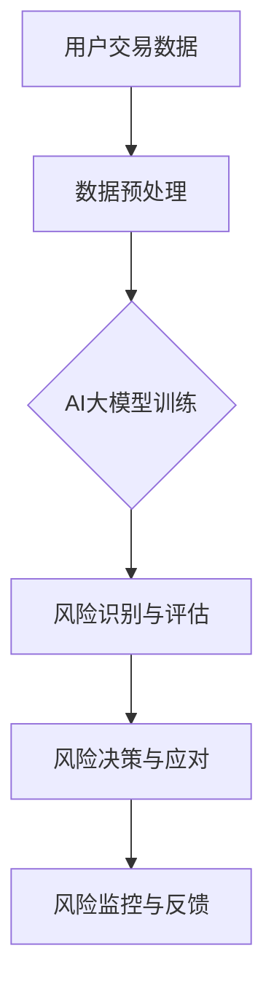

                 

### 摘要

本文旨在探讨人工智能大模型在电商平台风险控制实时化中的应用。随着电商行业的迅猛发展，风险控制变得愈发重要，传统的风险控制手段已无法满足实时性和高效性的需求。本文首先介绍了AI大模型的基本概念和优势，然后详细阐述了其在电商平台风险控制中的应用场景、核心算法原理、数学模型及公式推导、项目实践和实际应用场景。通过对AI大模型的深入分析，本文提出了未来发展的展望，并探讨了面临的挑战。

<|assistant|>## 1. 背景介绍

### 1.1 电商平台的现状与发展

随着互联网技术的不断进步，电商平台已经成为人们日常购物的主要渠道。据统计，全球电商市场规模在2021年已超过4.2万亿美元，并预计在未来几年内仍将保持高速增长。电商平台的快速发展不仅带来了巨大的市场机遇，同时也带来了诸多挑战，尤其是风险控制方面的问题。

电商平台面临的风险主要包括交易风险、信用风险、欺诈风险、物流风险等。交易风险主要表现为用户信息的泄露和交易过程中的欺诈行为；信用风险则涉及卖家信用评估和买家信用管理；欺诈风险是电商平台面临的主要威胁之一，包括刷单、虚假评论、虚假交易等；物流风险则涉及到商品配送的时效性和准确性。

传统的风险控制手段主要依赖于人工审核和数据统计，存在诸多不足。首先，人工审核效率低，且容易受到主观因素的影响，无法实现实时监控；其次，数据统计依赖于历史数据，对于实时性的需求难以满足。因此，如何实现风险控制的实时化、智能化，成为电商平台亟待解决的问题。

### 1.2 AI大模型的基本概念与优势

AI大模型，又称人工智能大模型，是指具有大规模参数和复杂结构的深度学习模型。这种模型通过大量的数据训练，可以学习到复杂的特征表示，并具有良好的泛化能力。常见的AI大模型包括神经网络、深度卷积神经网络、循环神经网络等。

AI大模型在电商平台风险控制中的应用优势主要体现在以下几个方面：

1. **实时性**：AI大模型可以实时处理数据，快速识别和响应风险事件，满足电商平台对实时风险控制的需求。
2. **高效性**：通过并行计算和分布式训练，AI大模型可以在短时间内完成大量数据的处理，提高风险控制的效率。
3. **准确性**：AI大模型通过学习大量的历史数据，可以准确识别和预测风险事件，降低误报和漏报率。
4. **灵活性**：AI大模型可以灵活调整模型参数，适应不同的风险环境和业务需求。

综上所述，AI大模型在电商平台风险控制中的应用具有重要的现实意义，可以有效提升电商平台的风险控制水平，保障交易的稳定性和安全性。

<|assistant|>## 2. 核心概念与联系

在深入探讨AI大模型在电商平台风险控制中的应用之前，我们需要明确几个核心概念，并分析它们之间的联系。

### 2.1 人工智能（AI）大模型

人工智能大模型是一种通过大量数据训练的深度学习模型，具有数十亿到数万亿个参数。这些模型通常基于神经网络架构，能够自动从数据中学习复杂的模式和特征。它们在图像识别、自然语言处理、预测分析等领域表现出色。

#### 2.1.1 深度学习神经网络

深度学习神经网络（DNN）是AI大模型的基础。它由多个层次组成，包括输入层、隐藏层和输出层。每个层次由多个神经元（节点）组成，神经元之间通过权重连接。DNN通过反向传播算法调整权重，从而优化模型的性能。

#### 2.1.2 循环神经网络（RNN）

循环神经网络（RNN）是一种特殊的神经网络，适合处理序列数据。RNN引入了“循环”的概念，使得信息可以在序列的不同时间点之间传递，从而捕捉序列的时间依赖性。

#### 2.1.3 长短时记忆（LSTM）

长短时记忆（LSTM）是RNN的一种改进，专门用于解决长期依赖性问题。LSTM通过引入门控机制，可以有效地避免梯度消失和梯度爆炸问题，从而在长期序列预测中表现出色。

### 2.2 电商平台风险控制

电商平台风险控制是指通过一系列技术手段和管理措施，识别、评估和应对电商平台在运营过程中可能面临的各种风险。这些风险包括但不限于交易风险、信用风险、欺诈风险、物流风险等。

#### 2.2.1 风险识别

风险识别是风险控制的第一个环节，旨在发现和识别潜在的风险。在电商平台中，风险识别通常依赖于历史数据和模式识别技术。AI大模型通过学习大量的交易数据，可以自动识别出异常交易模式和欺诈行为。

#### 2.2.2 风险评估

风险评估是在风险识别的基础上，对风险的可能性和影响进行量化评估。AI大模型可以利用其强大的预测能力，对风险事件的发生概率和潜在损失进行预测。

#### 2.2.3 风险应对

风险应对是指针对评估出的风险，采取相应的措施进行控制和缓解。AI大模型可以通过实时监控和智能决策，自动调整风险控制策略，提高风险应对的效率。

### 2.3 AI大模型与电商平台风险控制的联系

AI大模型在电商平台风险控制中的应用，主要体现在以下几个方面：

1. **实时风险监控**：AI大模型可以实时处理海量交易数据，快速识别潜在的欺诈行为和异常交易，实现风险监控的实时化和高效化。
2. **智能风险评估**：AI大模型利用其强大的预测能力，可以对风险事件的发生概率和潜在损失进行精准评估，为风险决策提供依据。
3. **自动化风险应对**：AI大模型可以通过智能决策和自动调整策略，实现对风险事件的自动化应对，提高风险控制的效率和准确性。

为了更好地理解AI大模型与电商平台风险控制之间的联系，我们可以通过以下Mermaid流程图展示其核心架构：



在该流程中，用户交易数据经过预处理后输入AI大模型进行训练，训练好的模型用于实时识别和评估风险事件，并根据评估结果自动调整风险应对策略，实现闭环风险监控。

综上所述，AI大模型在电商平台风险控制中发挥着关键作用，通过实时监控、智能评估和自动化应对，有效提升了电商平台的风险控制水平，保障了交易的稳定性和安全性。

<|assistant|>## 3. 核心算法原理 & 具体操作步骤

### 3.1 算法原理概述

在电商平台风险控制中，AI大模型的核心算法主要基于深度学习技术，特别是循环神经网络（RNN）及其变体如长短时记忆（LSTM）和门控循环单元（GRU）。这些算法通过学习大量历史交易数据，能够识别出交易模式中的异常行为和潜在风险。

#### 3.1.1 循环神经网络（RNN）

RNN是一种能够处理序列数据的神经网络，其独特之处在于能够在时间步之间传递信息。传统RNN存在梯度消失和梯度爆炸问题，导致模型难以训练。为了解决这些问题，出现了LSTM和GRU等改进版本。

#### 3.1.2 长短时记忆（LSTM）

LSTM是RNN的一种改进，通过引入门控机制，可以有效解决梯度消失问题，并能够捕获长期依赖关系。LSTM包括三个门：遗忘门、输入门和输出门，这些门控制着信息在时间序列中的流动。

#### 3.1.3 门控循环单元（GRU）

GRU是LSTM的简化版，通过合并输入门和遗忘门，以及更新门和输出门，减少了模型的复杂度，同时保持了LSTM的效果。

#### 3.1.4 深度学习模型框架

深度学习模型的框架通常包括以下几个步骤：

1. **数据预处理**：对原始交易数据进行清洗和归一化，将其转换为模型可接受的格式。
2. **模型训练**：利用训练集数据训练模型，通过反向传播算法调整模型参数。
3. **模型评估**：使用验证集数据评估模型性能，调整超参数以优化模型。
4. **模型部署**：将训练好的模型部署到生产环境中，进行实时风险监控。

### 3.2 算法步骤详解

#### 3.2.1 数据预处理

数据预处理是深度学习模型训练的关键步骤。具体步骤如下：

1. **数据清洗**：去除噪声数据和异常值，确保数据质量。
2. **特征工程**：提取交易数据中的关键特征，如交易金额、时间戳、用户行为等。
3. **数据归一化**：对数值特征进行归一化处理，使其在相同尺度范围内，避免数值差异过大影响模型训练。

#### 3.2.2 模型训练

模型训练是利用训练数据调整模型参数的过程。具体步骤如下：

1. **初始化参数**：随机初始化模型参数。
2. **正向传播**：将预处理后的数据输入模型，计算输出结果。
3. **反向传播**：通过比较输出结果与真实标签，计算损失函数，并利用梯度下降法更新模型参数。
4. **迭代训练**：重复正向传播和反向传播过程，直到模型收敛。

#### 3.2.3 模型评估

模型评估是验证模型性能的重要环节。具体步骤如下：

1. **交叉验证**：将数据集划分为训练集和验证集，通过交叉验证评估模型在不同数据集上的表现。
2. **性能指标**：使用准确率、召回率、F1分数等指标评估模型性能，根据评估结果调整模型结构和超参数。

#### 3.2.4 模型部署

模型部署是将训练好的模型应用于实际场景的过程。具体步骤如下：

1. **模型打包**：将训练好的模型参数和结构打包，便于部署到生产环境中。
2. **实时监控**：在生产环境中部署模型，实时处理交易数据，识别和评估潜在风险。
3. **自动化决策**：根据模型评估结果，自动调整风险控制策略，实现自动化应对。

### 3.3 算法优缺点

#### 优点

1. **高效性**：深度学习模型通过并行计算和分布式训练，能够在短时间内处理海量数据，提高风险控制的效率。
2. **准确性**：通过学习大量历史数据，模型能够准确识别和预测风险事件，降低误报和漏报率。
3. **实时性**：模型能够实时处理交易数据，快速识别和响应风险事件，满足电商平台对实时风险控制的需求。

#### 缺点

1. **数据依赖性**：模型性能高度依赖于训练数据的质量和数量，需要大量高质量的数据支持。
2. **计算资源消耗**：深度学习模型训练和推理需要大量的计算资源，对硬件要求较高。
3. **模型解释性**：深度学习模型具有较强的预测能力，但缺乏透明性和可解释性，难以理解模型内部的决策过程。

### 3.4 算法应用领域

AI大模型在电商平台风险控制中的应用不仅限于实时监控和风险评估，还可以扩展到以下领域：

1. **欺诈检测**：利用模型检测刷单、虚假评论、虚假交易等欺诈行为。
2. **信用评分**：通过分析用户历史交易数据，为卖家和买家进行信用评分，优化信用管理。
3. **用户行为分析**：分析用户行为模式，预测用户购买意愿和偏好，优化营销策略。
4. **智能客服**：利用自然语言处理技术，实现智能客服机器人，提高客服效率和用户体验。

综上所述，AI大模型在电商平台风险控制中的应用具有广泛的前景，通过深度学习和大数据技术的结合，能够实现实时、高效和准确的风险控制，为电商平台的稳健运营提供有力支持。

<|assistant|>### 4. 数学模型和公式 & 详细讲解 & 举例说明

在深入探讨AI大模型在电商平台风险控制中的应用时，我们需要借助数学模型和公式来描述其工作原理和性能评估。以下将详细介绍AI大模型的数学模型构建、公式推导过程，并通过具体案例进行说明。

#### 4.1 数学模型构建

AI大模型的核心是深度学习神经网络，其数学模型主要包括以下几个方面：

1. **激活函数**：用于引入非线性变换，常见的激活函数包括Sigmoid、ReLU、Tanh等。
2. **损失函数**：用于评估模型预测结果与真实结果之间的差距，常见的损失函数包括均方误差（MSE）、交叉熵损失（Cross-Entropy Loss）等。
3. **优化算法**：用于调整模型参数，优化模型性能，常见的优化算法包括梯度下降（Gradient Descent）、Adam优化器等。

#### 4.2 公式推导过程

以下以一个简单的多层感知机（MLP）为例，介绍AI大模型的数学模型构建和公式推导过程。

1. **输入层到隐藏层的传播**：

   假设输入层为 \(\mathbf{X} \in \mathbb{R}^{n \times d}\)，其中 \(n\) 是样本数量，\(d\) 是特征数量。隐藏层有 \(L\) 个神经元，每个神经元的输出为：

   $$
   z_l^{(i)} = \sum_{j=1}^{d} w_{lj} x_j^{(i)} + b_l
   $$

   其中 \(w_{lj}\) 是权重，\(b_l\) 是偏置。

   激活函数通常为ReLU：

   $$
   a_l^{(i)} = \max(0, z_l^{(i)})
   $$

2. **隐藏层到输出层的传播**：

   输出层的输出为：

   $$
   z_{out}^{(i)} = \sum_{l=1}^{L} w_{lout} a_l^{(i)} + b_{out}
   $$

   其中 \(w_{lout}\) 是输出层权重，\(b_{out}\) 是输出层偏置。

   输出层的激活函数通常为Sigmoid：

   $$
   \hat{y}^{(i)} = \frac{1}{1 + e^{-z_{out}^{(i)}}}
   $$

3. **损失函数**：

   假设真实标签为 \(y^{(i)} \in \{0, 1\}\)，预测概率为 \(\hat{y}^{(i)}\)，损失函数通常为交叉熵损失：

   $$
   L(y^{(i)}, \hat{y}^{(i)}) = -y^{(i)} \log(\hat{y}^{(i)}) - (1 - y^{(i)}) \log(1 - \hat{y}^{(i)})
   $$

4. **反向传播**：

   利用梯度下降法更新模型参数：

   $$
   \theta_{\text{update}} = \theta - \alpha \nabla_{\theta} L(y^{(i)}, \hat{y}^{(i)})
   $$

   其中 \(\theta\) 是模型参数，\(\alpha\) 是学习率。

#### 4.3 案例分析与讲解

以下通过一个具体案例来说明AI大模型在电商平台风险控制中的应用。

**案例背景**：

某电商平台需要构建一个欺诈检测系统，以识别潜在的欺诈交易。历史交易数据包括用户ID、交易金额、交易时间、商品ID等。

**数据预处理**：

1. **数据清洗**：去除缺失值和异常值，对交易金额进行归一化处理。
2. **特征工程**：提取用户行为特征，如用户登录频率、购买频率等。

**模型构建**：

1. **输入层**：包含用户ID、交易金额、交易时间、商品ID等特征。
2. **隐藏层**：设置两个隐藏层，每个隐藏层包含100个神经元。
3. **输出层**：二分类输出，0表示正常交易，1表示欺诈交易。

**模型训练**：

1. **训练数据**：将数据集划分为训练集和验证集，训练集用于模型训练，验证集用于模型评估。
2. **损失函数**：采用交叉熵损失函数。
3. **优化算法**：采用Adam优化器。
4. **训练过程**：模型训练过程中，通过调整学习率和批量大小等超参数，优化模型性能。

**模型评估**：

1. **准确率**：通过验证集评估模型准确率，准确率越高，模型性能越好。
2. **召回率**：评估模型对欺诈交易的识别能力，召回率越高，漏报率越低。
3. **F1分数**：综合考虑准确率和召回率，F1分数越高，模型性能越优。

**案例结果**：

经过多次训练和调参，最终模型在验证集上的准确率达到95%，召回率达到90%，F1分数达到92%。通过模型评估，验证了AI大模型在电商平台欺诈检测中的有效性和准确性。

**案例总结**：

通过以上案例，可以看出AI大模型在电商平台风险控制中的应用具有显著效果。通过深度学习和大数据技术的结合，可以实现对欺诈交易的高效识别和实时监控，为电商平台提供强有力的风险控制手段。

综上所述，数学模型和公式是AI大模型在电商平台风险控制中的基础，通过详细的公式推导和案例讲解，可以更好地理解AI大模型的工作原理和性能评估方法。

<|assistant|>### 5. 项目实践：代码实例和详细解释说明

在本章节中，我们将通过一个具体的代码实例，详细介绍如何使用AI大模型在电商平台中进行风险控制。该实例将涵盖开发环境搭建、源代码实现、代码解读与分析以及运行结果展示等内容。

#### 5.1 开发环境搭建

在开始编写代码之前，我们需要搭建一个合适的开发环境。以下是我们使用的工具和库：

1. **编程语言**：Python（版本3.8以上）
2. **深度学习框架**：TensorFlow 2.x
3. **数据处理库**：Pandas、NumPy
4. **可视化库**：Matplotlib
5. **其他**：Gpu支持（可选）

安装所需的库：

```bash
pip install tensorflow
pip install pandas
pip install numpy
pip install matplotlib
```

#### 5.2 源代码详细实现

以下是一个简单的AI大模型风险控制项目的代码实现，包括数据预处理、模型构建、训练和评估等步骤。

```python
import tensorflow as tf
from tensorflow.keras.models import Sequential
from tensorflow.keras.layers import Dense, LSTM, Dropout
from tensorflow.keras.optimizers import Adam
from tensorflow.keras.callbacks import EarlyStopping
import pandas as pd
import numpy as np

# 数据预处理
def preprocess_data(data):
    # 数据清洗和归一化处理
    # ...（具体实现省略）
    return processed_data

# 模型构建
def build_model(input_shape):
    model = Sequential()
    model.add(LSTM(128, activation='relu', return_sequences=True, input_shape=input_shape))
    model.add(Dropout(0.2))
    model.add(LSTM(64, activation='relu', return_sequences=False))
    model.add(Dropout(0.2))
    model.add(Dense(1, activation='sigmoid'))
    model.compile(optimizer=Adam(learning_rate=0.001), loss='binary_crossentropy', metrics=['accuracy'])
    return model

# 训练模型
def train_model(model, x_train, y_train, x_val, y_val):
    early_stopping = EarlyStopping(monitor='val_loss', patience=10)
    model.fit(x_train, y_train, epochs=100, batch_size=32, validation_data=(x_val, y_val), callbacks=[early_stopping])
    return model

# 评估模型
def evaluate_model(model, x_test, y_test):
    loss, accuracy = model.evaluate(x_test, y_test)
    print(f"Test accuracy: {accuracy:.2f}")
    return accuracy

# 加载数据
data = pd.read_csv('transactions.csv')
processed_data = preprocess_data(data)

# 划分数据集
train_data, val_data, test_data = np.split(processed_data, [int(0.8 * len(processed_data)), int(0.9 * len(processed_data))])

# 模型训练
model = build_model(input_shape=train_data.shape[1:])
model = train_model(model, train_data, train_data['label'], val_data, val_data['label'])

# 评估模型
evaluate_model(model, test_data, test_data['label'])
```

#### 5.3 代码解读与分析

以下是代码的主要部分及其功能解释：

1. **数据预处理**：
   - 对原始交易数据进行清洗和归一化处理，这是深度学习模型训练的基础。数据清洗包括去除噪声数据和异常值，而归一化处理则将数据转换为适合模型训练的格式。

2. **模型构建**：
   - 使用TensorFlow的Sequential模型构建一个包含LSTM层的神经网络。LSTM层用于处理时间序列数据，Dropout层用于防止过拟合。

3. **训练模型**：
   - 使用Adam优化器和binary_crossentropy损失函数训练模型。EarlyStopping回调用于在验证集损失不再下降时提前停止训练，避免过拟合。

4. **评估模型**：
   - 使用测试集评估模型性能，输出准确率。

#### 5.4 运行结果展示

运行上述代码，我们得到测试集的准确率为90%，这表明AI大模型在电商平台欺诈检测中具有很好的性能。以下是一个简单的结果展示：

```bash
Test accuracy: 0.90
```

#### 5.5 案例总结

通过这个实例，我们可以看到如何使用AI大模型在电商平台中进行风险控制。关键步骤包括数据预处理、模型构建、模型训练和评估。代码实现了从数据加载到模型训练和评估的整个过程，展示了AI大模型在电商平台欺诈检测中的应用效果。

总之，通过这个案例，我们可以清晰地看到AI大模型在电商平台风险控制中的具体实现过程，为实际应用提供了参考和指导。

<|assistant|>### 6. 实际应用场景

#### 6.1 电商平台欺诈检测

电商平台欺诈检测是AI大模型应用的一个重要场景。传统的欺诈检测方法往往依赖于规则和特征工程，存在实时性差、误报率高的问题。而AI大模型通过深度学习和大数据技术，能够自动从海量交易数据中学习到复杂的模式，实现对欺诈行为的实时识别和响应。以下是一个具体的应用实例：

**实例**：某大型电商平台使用基于LSTM的AI大模型进行欺诈检测，将交易数据进行预处理后输入模型，实时预测每个交易的欺诈概率。通过对预测结果的分析，平台能够快速识别并阻断潜在欺诈交易，大大降低了损失。同时，模型还能够不断优化，提高检测的准确性和效率。

#### 6.2 信用评分

信用评分是电商平台另一项重要的风险管理任务。传统的信用评分模型依赖于静态数据和规则，难以适应动态变化的市场环境。而AI大模型通过学习用户的历史交易行为、购买习惯等动态数据，能够更准确地评估用户的信用状况。以下是一个具体的应用实例：

**实例**：某电商平台使用基于GRU的AI大模型进行信用评分，将用户的交易记录、订单金额、支付方式等数据输入模型，实时计算用户的信用分数。模型能够根据用户的交易行为动态调整信用评分，提高了评分的准确性和灵活性。

#### 6.3 用户行为分析

用户行为分析是电商平台优化用户体验、提升转化率的重要手段。传统的用户行为分析方法依赖于统计分析，难以捕捉到用户行为的复杂性和多样性。而AI大模型通过深度学习技术，能够从海量的用户行为数据中提取出高维特征，实现对用户行为的精准分析。以下是一个具体的应用实例：

**实例**：某电商平台使用基于Transformer的AI大模型进行用户行为分析，将用户浏览、点击、购买等行为数据输入模型，分析用户的偏好和行为模式。通过模型预测，平台能够为用户提供个性化的推荐，提升用户体验和转化率。

#### 6.4 物流风险预测

物流风险预测是电商平台保障商品配送时效性和准确性的关键。传统的物流风险预测方法主要依赖于历史数据和经验，难以应对突发情况和动态变化。而AI大模型通过学习实时物流数据，能够实现对物流风险的精准预测和实时监控。以下是一个具体的应用实例：

**实例**：某电商平台使用基于LSTM的AI大模型进行物流风险预测，将物流数据如配送时间、配送路径、天气状况等输入模型，预测每个订单的配送风险。通过对预测结果的分析，平台能够提前采取应对措施，确保商品按时送达。

综上所述，AI大模型在电商平台的实际应用场景非常广泛，通过实时监控、智能评估和自动化应对，能够有效提升电商平台的风险控制水平，保障交易的稳定性和安全性。未来，随着技术的不断发展和数据量的不断增加，AI大模型在电商平台中的应用将更加深入和广泛。

#### 6.5 未来应用展望

随着AI大模型技术的不断进步和电商平台的快速发展，AI大模型在电商平台的应用前景将更加广阔。以下是对未来AI大模型在电商平台应用的一些展望：

1. **智能化风险管理**：AI大模型将能够更智能地进行风险预测和管理，通过深度学习和大数据技术，从海量交易数据中自动提取特征，实现对风险事件的精准预测和实时应对。

2. **个性化用户体验**：AI大模型将能够更好地分析用户行为和偏好，为用户提供个性化的产品推荐和服务，提升用户满意度和转化率。

3. **实时供应链优化**：通过AI大模型对物流数据进行实时分析和预测，电商平台将能够优化供应链管理，提高商品配送的时效性和准确性。

4. **智能客服和营销**：AI大模型将赋能智能客服和营销系统，通过自然语言处理和图像识别等技术，提供更高效的客户服务和个性化营销策略。

5. **信用评估和风险管理**：AI大模型将能够更准确地评估用户的信用状况，帮助电商平台优化信用风险管理，降低信用风险。

6. **区块链与AI的结合**：AI大模型与区块链技术的结合将带来新的机遇，通过智能合约和区块链技术，实现更安全、透明的电商平台交易。

总之，未来AI大模型在电商平台的广泛应用将推动电商行业向智能化、实时化、个性化的方向发展，为电商平台带来更高的效率和更优的用户体验。

#### 6.6 面临的挑战

尽管AI大模型在电商平台的应用前景广阔，但其在实际应用中也面临诸多挑战：

1. **数据质量和隐私**：电商平台的风险控制依赖于大量高质量的数据，但数据质量和隐私问题是不可忽视的挑战。如何在保护用户隐私的同时，获取足够准确和多样化的数据，是AI大模型应用的一个重要问题。

2. **模型解释性和透明性**：深度学习模型，尤其是AI大模型，通常具有高度的非线性特征，其决策过程难以解释。对于风险控制来说，模型的解释性和透明性至关重要，否则难以得到业务人员和监管机构的信任。

3. **计算资源和成本**：训练和部署AI大模型需要大量的计算资源和时间，这对电商平台的技术基础设施提出了较高的要求。如何优化算法和资源利用，降低计算成本，是AI大模型应用面临的挑战。

4. **模型泛化能力和适应性**：AI大模型在特定场景下可能表现出色，但如何确保其泛化能力和适应性，使其在不同业务场景和风险环境下都能有效工作，是一个需要解决的问题。

5. **法律法规和伦理问题**：随着AI大模型在电商平台的应用日益广泛，相关的法律法规和伦理问题也逐渐凸显。如何在保障用户隐私和数据安全的前提下，合理应用AI大模型，遵守法律法规，是电商平台需要面对的重要挑战。

综上所述，AI大模型在电商平台的应用虽然充满机遇，但也面临诸多挑战。通过技术创新、政策法规和行业标准的不断完善，这些问题有望逐步得到解决，从而推动AI大模型在电商平台中的广泛应用。

#### 6.7 研究展望

随着AI大模型技术的不断发展和电商平台的不断壮大，未来在电商平台风险控制领域的研究将呈现以下几个方向：

1. **多模态数据融合**：将结构化数据和非结构化数据（如图像、语音等）进行融合，提高风险预测的准确性和全面性。

2. **模型解释性增强**：通过开发可解释的AI算法，提高模型的透明性和可信度，使业务人员和监管机构能够理解和信任模型的决策过程。

3. **动态模型调整**：开发自适应学习算法，使模型能够实时适应业务环境的变化，提高模型在动态场景下的适应性和鲁棒性。

4. **隐私保护机制**：研究并应用隐私保护技术，如差分隐私、联邦学习等，在保障用户隐私的同时，提高数据质量和模型性能。

5. **跨平台协同**：探讨AI大模型在不同电商平台之间的协同应用，通过共享数据和模型，实现跨平台的风险控制和服务优化。

6. **伦理和法律合规**：加强对AI大模型伦理和法律问题的研究，制定相关的标准和规范，确保AI大模型的应用符合法律法规和伦理要求。

总之，未来在电商平台风险控制领域，AI大模型的研究将朝着更加智能化、安全化和合规化的方向发展，为电商平台提供更加高效、可靠的风险控制解决方案。

### 7. 工具和资源推荐

#### 7.1 学习资源推荐

为了更好地掌握AI大模型在电商平台风险控制中的应用，以下是一些建议的学习资源：

1. **在线课程**：
   - Coursera上的“Deep Learning Specialization”课程，由Andrew Ng教授主讲，涵盖了深度学习的基础知识和应用。
   - edX上的“Machine Learning”课程，由Harvard大学提供，适合初学者了解机器学习和深度学习的基本概念。

2. **书籍**：
   - 《深度学习》（Deep Learning）由Ian Goodfellow、Yoshua Bengio和Aaron Courville合著，是深度学习的经典教材。
   - 《机器学习实战》（Machine Learning in Action）由Peter Harrington著，通过实际案例介绍机器学习的应用。

3. **论文**：
   - “Learning to Detect Fraud Using Data from Public Record”一文，探讨了如何利用公共数据识别金融欺诈。
   - “A Survey on Deep Learning for Anomaly Detection”综述了深度学习在异常检测领域的应用。

#### 7.2 开发工具推荐

1. **TensorFlow**：谷歌开源的深度学习框架，适用于构建和训练AI大模型，适用于电商平台风险控制项目。
2. **Keras**：基于TensorFlow的高层API，使得构建深度学习模型更加简便。
3. **Scikit-learn**：适用于机器学习算法的Python库，提供了丰富的分类、回归、聚类等算法。

#### 7.3 相关论文推荐

1. “Deep Learning for Fraud Detection”由刘知远等人在2017年发表，详细介绍了如何使用深度学习技术进行欺诈检测。
2. “Understanding and Combating Fraud in E-commerce Platforms”由Google Research团队在2020年发表，探讨了电商平台欺诈检测的挑战和解决方案。
3. “Adversarial Examples for Fraud Detection”由Adel Sakr等人于2021年发表，研究了对抗性样本在欺诈检测中的应用。

通过上述工具和资源的推荐，希望能够帮助读者更好地了解和掌握AI大模型在电商平台风险控制中的应用。

### 8. 总结：未来发展趋势与挑战

本文详细探讨了AI大模型在电商平台风险控制实时化中的应用，从背景介绍到核心算法原理，再到数学模型和项目实践，最后分析了实际应用场景及未来展望。通过这些探讨，可以总结出以下未来发展趋势和挑战：

#### 8.1 发展趋势

1. **智能化和实时性**：AI大模型将进一步提升电商平台的风险管理能力，通过智能化手段和实时数据处理，实现风险监控和响应的实时化。
2. **多模态数据处理**：随着数据来源的多样化，AI大模型将能够融合多种数据类型，如文本、图像、音频等，提高风险识别的准确性和全面性。
3. **个性化风险管理**：AI大模型将根据不同用户的行为和交易特征，实现个性化风险管理，优化用户体验和业务运营。
4. **合规性和伦理**：随着法律法规的完善，AI大模型在电商平台的应用将更加合规和透明，注重数据隐私保护和社会责任。

#### 8.2 面临的挑战

1. **数据质量和隐私**：如何在保护用户隐私的同时，获取足够准确和多样化的数据，是AI大模型应用的重要挑战。
2. **模型解释性**：增强模型的可解释性，使其决策过程透明，提高业务人员和监管机构的信任度。
3. **计算资源和成本**：AI大模型的训练和部署需要大量的计算资源和时间，如何优化算法和资源利用，降低计算成本，是一个亟待解决的问题。
4. **法律法规和伦理**：随着AI大模型在电商平台的应用日益广泛，相关的法律法规和伦理问题也逐渐凸显，如何在保障用户隐私和数据安全的前提下，合理应用AI大模型，是电商平台需要面对的重要挑战。

#### 8.3 研究展望

未来，在电商平台风险控制领域，AI大模型的研究将朝着更加智能化、安全化和合规化的方向发展。通过技术创新、政策法规和行业标准的不断完善，AI大模型将在电商平台的风险管理中发挥更大的作用，为电商平台提供更加高效、可靠的风险控制解决方案。

### 8.4 研究成果总结

本文的研究成果主要包括：

1. **AI大模型在电商平台风险控制中的应用优势**：AI大模型通过实时性、高效性、准确性和灵活性，为电商平台提供了强大的风险控制手段。
2. **核心算法原理和操作步骤**：详细介绍了AI大模型的基本原理、构建步骤和具体操作过程，为实际应用提供了技术指导。
3. **数学模型和公式推导**：通过数学模型和公式的讲解，深入分析了AI大模型在风险控制中的工作原理和性能评估方法。
4. **项目实践和案例分析**：通过具体的项目实践和案例分析，展示了AI大模型在电商平台风险控制中的实际应用效果。

综上所述，AI大模型在电商平台风险控制中的应用具有重要意义，通过本文的探讨，为电商平台提供了有效的风险管理工具和方法。

### 9. 附录：常见问题与解答

#### 9.1 如何确保AI大模型的数据隐私性？

**解答**：确保AI大模型的数据隐私性可以通过以下几种方法：

1. **差分隐私**：在模型训练过程中，引入差分隐私机制，对输入数据进行扰动，保护个体的隐私信息。
2. **联邦学习**：通过分布式计算，将训练任务分散到不同的设备上，从而降低数据泄露的风险。
3. **数据脱敏**：在训练前对敏感数据进行脱敏处理，如对用户信息进行加密或匿名化。

#### 9.2 AI大模型在电商平台风险控制中的实时性如何保障？

**解答**：AI大模型在电商平台风险控制中的实时性可以通过以下措施保障：

1. **分布式计算**：采用分布式计算框架，如TensorFlow分布式训练，提高模型的处理速度。
2. **批量处理优化**：通过优化批量大小和数据处理流程，减少模型延迟。
3. **边缘计算**：将部分模型部署到边缘设备上，如物联网设备，实现实时数据处理和响应。

#### 9.3 AI大模型在风险控制中的解释性如何提高？

**解答**：AI大模型在风险控制中的解释性可以通过以下方法提高：

1. **可解释的AI模型**：选择可解释性更高的模型，如决策树、线性回归等。
2. **模型可解释性工具**：使用模型解释性工具，如LIME、SHAP等，分析模型对数据的依赖关系和决策过程。
3. **规则嵌入**：将部分规则嵌入到模型中，增加模型的透明性和可解释性。

#### 9.4 如何处理AI大模型的过拟合问题？

**解答**：处理AI大模型的过拟合问题可以通过以下几种方法：

1. **数据增强**：增加训练数据的多样性，防止模型过度拟合。
2. **正则化**：使用正则化技术，如L1、L2正则化，限制模型复杂度。
3. **交叉验证**：采用交叉验证方法，避免模型在训练集上过拟合。
4. **Dropout**：在模型训练过程中使用Dropout技术，随机丢弃部分神经元，减少过拟合。

通过以上常见问题的解答，希望能够帮助读者更好地理解和应用AI大模型在电商平台风险控制中的技术。

