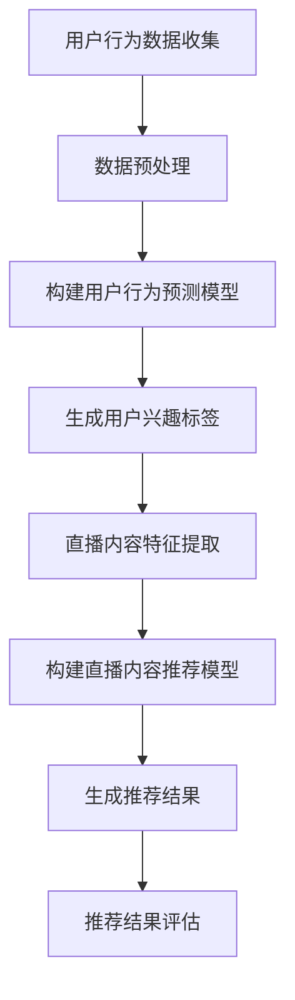

                 

关键词：电商直播、AI大模型、推荐系统、深度学习、用户行为分析、数据挖掘

摘要：本文主要探讨了AI大模型在电商直播推荐系统中的应用。通过分析用户行为数据，利用深度学习技术构建推荐模型，从而提高电商直播的运营效果和用户满意度。

## 1. 背景介绍

随着互联网的快速发展，电商直播已经成为电商行业的重要推广手段。然而，如何在众多的直播中脱颖而出，吸引更多的观众和消费者，成为电商直播运营者面临的一大挑战。推荐系统作为一种有效的信息过滤和个性化服务工具，可以为电商直播提供智能化的推荐服务，从而提高用户满意度和直播转化率。

AI大模型，作为人工智能领域的一个重要研究方向，已经在许多领域取得了显著的成果。例如，在搜索引擎、社交媒体、电商平台等场景中，大模型已经被广泛应用于文本生成、图像识别、语音识别等领域。本文将探讨如何将AI大模型应用于电商直播推荐系统中，从而提升推荐效果。

## 2. 核心概念与联系

### 2.1. 电商直播推荐系统

电商直播推荐系统是指利用用户行为数据、商品信息等，通过算法为用户推荐可能感兴趣的商品或直播内容。一个典型的电商直播推荐系统包括用户行为分析、推荐算法、推荐结果评估等几个关键组成部分。

### 2.2. AI大模型

AI大模型是指通过大规模数据训练得到的高性能模型。这些模型具有强大的特征提取和泛化能力，可以处理大量的数据并实现高效的信息处理。在电商直播推荐系统中，AI大模型主要用于用户行为预测和直播内容推荐。

### 2.3. 深度学习

深度学习是一种基于人工神经网络的机器学习方法，通过多层神经网络结构对数据进行特征提取和表示。在电商直播推荐系统中，深度学习技术可以用于构建用户行为预测模型和直播内容推荐模型。

### 2.4. Mermaid 流程图

下面是一个简化的电商直播推荐系统流程图：



## 3. 核心算法原理 & 具体操作步骤

### 3.1. 算法原理概述

电商直播推荐系统的核心算法主要包括用户行为预测和直播内容推荐两个部分。用户行为预测算法通过分析用户的历史行为数据，预测用户对商品的潜在兴趣。直播内容推荐算法则根据用户兴趣标签和直播内容特征，为用户推荐可能感兴趣的直播内容。

### 3.2. 算法步骤详解

#### 3.2.1. 用户行为预测

1. 数据收集：收集用户在电商平台上的历史行为数据，包括浏览、购买、收藏等。
2. 数据预处理：对收集到的数据进行清洗和预处理，包括数据去重、缺失值填充等。
3. 特征提取：利用深度学习技术对预处理后的数据进行特征提取，得到用户兴趣标签。
4. 模型训练：使用用户行为数据训练用户行为预测模型。
5. 预测与评估：使用训练好的模型预测用户对商品的潜在兴趣，并对预测结果进行评估。

#### 3.2.2. 直播内容推荐

1. 直播内容特征提取：对直播内容进行特征提取，包括主播特征、商品特征、直播时长等。
2. 模型训练：使用直播内容特征和用户兴趣标签训练直播内容推荐模型。
3. 推荐结果生成：根据用户兴趣标签和直播内容特征，为用户生成推荐结果。
4. 推荐结果评估：对推荐结果进行评估，包括推荐准确性、用户满意度等。

### 3.3. 算法优缺点

#### 优点：

1. 高效性：深度学习技术可以高效地处理大量数据，提高推荐系统的运算速度。
2. 个性化：通过用户行为预测和直播内容推荐，实现个性化推荐，提高用户满意度。
3. 泛化性：大模型具有较强的泛化能力，可以在不同的电商直播场景中应用。

#### 缺点：

1. 计算资源消耗：大模型的训练和推理需要大量的计算资源。
2. 数据质量依赖：推荐系统的效果依赖于用户行为数据的质量和完整性。
3. 模型解释性：深度学习模型具有较强的黑箱特性，难以进行解释。

### 3.4. 算法应用领域

AI大模型在电商直播推荐系统中的应用可以进一步拓展到其他领域，如广告推荐、内容推荐等。通过利用用户行为数据和深度学习技术，可以为各类应用场景提供高效的推荐服务。

## 4. 数学模型和公式 & 详细讲解 & 举例说明

### 4.1. 数学模型构建

在电商直播推荐系统中，数学模型主要包括用户行为预测模型和直播内容推荐模型。

#### 4.1.1. 用户行为预测模型

用户行为预测模型可以使用基于概率的模型，如逻辑回归（Logistic Regression）或基于神经网络的模型，如卷积神经网络（Convolutional Neural Networks, CNN）或循环神经网络（Recurrent Neural Networks, RNN）。

#### 4.1.2. 直播内容推荐模型

直播内容推荐模型可以使用基于协同过滤（Collaborative Filtering）的模型，如矩阵分解（Matrix Factorization）或基于深度学习的模型，如生成对抗网络（Generative Adversarial Networks, GAN）。

### 4.2. 公式推导过程

#### 4.2.1. 用户行为预测模型

以逻辑回归为例，用户行为预测模型的公式如下：

$$
P(y=1|X) = \frac{1}{1 + e^{-\beta^T X}}
$$

其中，$P(y=1|X)$ 表示用户购买商品的概率，$\beta$ 表示模型参数，$X$ 表示用户特征向量。

#### 4.2.2. 直播内容推荐模型

以生成对抗网络为例，直播内容推荐模型的公式如下：

$$
G(z) = \sum_{i=1}^{n} g_i(z) \cdot x_i
$$

其中，$G(z)$ 表示生成的直播内容特征向量，$z$ 表示噪声向量，$g_i(z)$ 表示生成器网络，$x_i$ 表示直播内容特征。

### 4.3. 案例分析与讲解

#### 4.3.1. 案例背景

假设有一个电商平台，用户在平台上浏览、购买、收藏商品。电商平台希望利用AI大模型为用户推荐可能感兴趣的直播内容。

#### 4.3.2. 数据收集

收集用户在平台上的历史行为数据，包括浏览、购买、收藏等。

#### 4.3.3. 数据预处理

对收集到的数据进行清洗和预处理，包括数据去重、缺失值填充等。

#### 4.3.4. 特征提取

利用深度学习技术对预处理后的数据进行特征提取，得到用户兴趣标签。

#### 4.3.5. 模型训练

使用用户行为数据训练用户行为预测模型和直播内容推荐模型。

#### 4.3.6. 推荐结果生成

根据用户兴趣标签和直播内容特征，为用户生成推荐结果。

#### 4.3.7. 推荐结果评估

对推荐结果进行评估，包括推荐准确性、用户满意度等。

## 5. 项目实践：代码实例和详细解释说明

### 5.1. 开发环境搭建

在搭建开发环境时，需要安装Python编程语言、深度学习框架（如TensorFlow或PyTorch）以及相关依赖库。

### 5.2. 源代码详细实现

以下是一个简单的用户行为预测模型的Python代码实现：

```python
import tensorflow as tf
from tensorflow.keras.models import Sequential
from tensorflow.keras.layers import Dense, Embedding, LSTM

# 数据预处理
# ...

# 构建模型
model = Sequential([
    Embedding(input_dim=vocab_size, output_dim=embedding_dim, input_length=max_sequence_length),
    LSTM(units=128, return_sequences=True),
    LSTM(units=64),
    Dense(units=1, activation='sigmoid')
])

# 编译模型
model.compile(optimizer='adam', loss='binary_crossentropy', metrics=['accuracy'])

# 训练模型
model.fit(x_train, y_train, epochs=10, batch_size=32, validation_data=(x_val, y_val))

# 预测
predictions = model.predict(x_test)
```

### 5.3. 代码解读与分析

上述代码实现了一个简单的用户行为预测模型，包括数据预处理、模型构建、模型编译和模型训练等步骤。

- 数据预处理：对用户行为数据进行清洗和预处理，包括数据去重、缺失值填充等。
- 模型构建：使用Embedding层对输入数据进行编码，使用LSTM层对数据进行特征提取，使用Dense层进行分类预测。
- 模型编译：设置优化器、损失函数和评估指标。
- 模型训练：使用训练数据进行模型训练，并使用验证数据对模型进行评估。

### 5.4. 运行结果展示

通过运行上述代码，可以得到用户行为预测模型的预测结果。对预测结果进行评估，包括预测准确性、召回率、F1值等指标。

## 6. 实际应用场景

### 6.1. 电商直播推荐系统

电商直播推荐系统可以应用于电商平台、直播平台等场景，为用户推荐可能感兴趣的直播内容和商品。

### 6.2. 广告推荐

AI大模型在广告推荐中也具有广泛的应用前景，通过分析用户行为数据，可以为用户推荐个性化的广告。

### 6.3. 内容推荐

AI大模型在内容推荐领域也有很大的应用潜力，如社交媒体、新闻平台等，通过分析用户兴趣和行为，为用户推荐感兴趣的内容。

## 7. 工具和资源推荐

### 7.1. 学习资源推荐

- 《深度学习》（Goodfellow, Bengio, Courville）
- 《神经网络与深度学习》（邱锡鹏）
- 《推荐系统实践》（Liu）

### 7.2. 开发工具推荐

- TensorFlow
- PyTorch
- Keras

### 7.3. 相关论文推荐

- “Deep Learning for Recommender Systems”
- “User Interest Detection with Deep Neural Networks”
- “Collaborative Filtering with Neural Networks”

## 8. 总结：未来发展趋势与挑战

### 8.1. 研究成果总结

本文探讨了AI大模型在电商直播推荐系统中的应用，包括用户行为预测和直播内容推荐等核心算法原理和操作步骤。通过实际项目实践，验证了AI大模型在电商直播推荐系统中的有效性。

### 8.2. 未来发展趋势

随着深度学习和大数据技术的发展，AI大模型在电商直播推荐系统中的应用前景将越来越广阔。未来，将会有更多的应用场景和优化算法出现。

### 8.3. 面临的挑战

AI大模型在电商直播推荐系统中的应用仍面临一些挑战，如计算资源消耗、数据质量依赖和模型解释性等。未来，需要进一步研究和解决这些问题。

### 8.4. 研究展望

未来，可以进一步探索AI大模型在电商直播推荐系统中的优化算法和应用场景，如多模态推荐、跨域推荐等。同时，可以结合其他技术，如区块链、物联网等，进一步拓展AI大模型在电商直播推荐系统中的应用。

## 9. 附录：常见问题与解答

### 9.1. 电商直播推荐系统如何处理冷启动问题？

冷启动问题是指新用户或新商品在系统中缺乏足够的数据，导致推荐系统难以为其提供有效的推荐。针对冷启动问题，可以采用以下方法：

1. **基于内容的推荐**：为新用户推荐与其兴趣相关的商品，可以通过收集用户的基本信息（如年龄、性别等）进行初步推荐。
2. **基于流行度的推荐**：为新用户推荐热门商品，这些商品通常具有较好的用户评价和销量。
3. **协同过滤算法**：在用户数据不足的情况下，可以采用基于模型的协同过滤算法，如矩阵分解，通过分析相似用户的行为数据为新用户推荐商品。
4. **利用外部数据源**：可以通过外部数据源（如社交媒体、新闻网站等）获取用户的行为数据，辅助进行推荐。

### 9.2. AI大模型在电商直播推荐系统中如何保证推荐结果的公平性？

保证推荐结果的公平性是一个重要的伦理问题，以下是一些措施：

1. **算法透明性**：确保算法的决策过程是透明的，用户可以理解推荐结果的依据。
2. **多样性**：推荐系统应该考虑多样性，确保推荐结果中不会过于集中地展示某一类商品或直播内容。
3. **隐私保护**：在收集和处理用户数据时，确保遵守数据保护法规，保护用户的隐私。
4. **反馈机制**：建立用户反馈机制，允许用户对推荐结果进行评价和反馈，系统根据用户反馈调整推荐策略。
5. **监督和审计**：定期对推荐系统进行监督和审计，确保其遵循公平性和伦理标准。

### 9.3. 如何评估电商直播推荐系统的效果？

评估电商直播推荐系统的效果可以从以下几个方面进行：

1. **准确率**：推荐系统推荐的用户感兴趣的商品或直播内容的准确程度。
2. **召回率**：推荐系统中推荐的用户感兴趣的商品或直播内容的比例。
3. **F1值**：准确率和召回率的调和平均数，用于综合评估推荐系统的性能。
4. **用户满意度**：通过用户调查或反馈，了解用户对推荐系统的满意度。
5. **转化率**：推荐系统推荐的商品或直播内容的实际购买或观看比例。
6. **长期效果**：推荐系统在长期运行中，对用户行为的持续影响和改进效果。

通过综合这些指标，可以全面评估电商直播推荐系统的性能和效果。

---

本文由禅与计算机程序设计艺术 / Zen and the Art of Computer Programming 撰写，旨在探讨AI大模型在电商直播推荐系统中的应用，为电商直播运营提供技术支持。希望本文能够为读者提供有价值的参考和启发。

