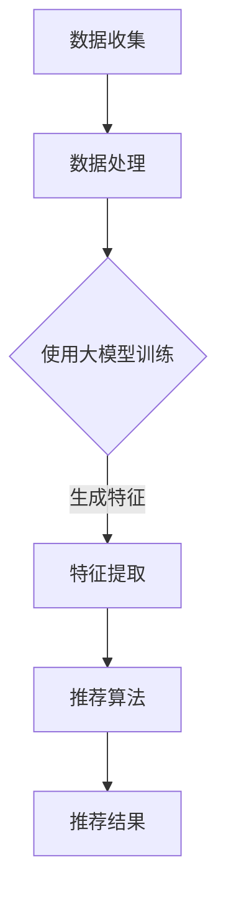

                 

 关键词：人工智能，大模型，电子商务，个性化，推荐系统

> 摘要：本文深入探讨了人工智能大模型在电子商务领域的个性化应用。通过阐述大模型的基本原理、核心算法、数学模型以及项目实践，本文旨在揭示大模型在提升电子商务用户体验和销售转化率方面的巨大潜力。

## 1. 背景介绍

随着互联网的迅猛发展，电子商务已经成为现代商业不可或缺的一部分。然而，在竞争激烈的市场环境中，如何提高用户体验和销售额成为电商企业亟待解决的问题。个性化推荐系统作为一种有效的解决方案，逐渐受到了广泛关注。近年来，人工智能（AI）特别是大模型（Large-scale Model）的迅速发展，为个性化推荐系统带来了前所未有的变革。本文将围绕这一主题，分析大模型在电子商务领域的个性化应用。

## 2. 核心概念与联系

### 2.1 大模型基本概念

大模型是指具有数十亿甚至千亿参数的深度学习模型。这些模型通过大量数据进行训练，具备强大的表示和学习能力，能够在各种复杂任务中实现卓越的性能。常见的有大模型有GPT（Generative Pre-trained Transformer）、BERT（Bidirectional Encoder Representations from Transformers）等。

### 2.2 个性化推荐系统

个性化推荐系统是一种利用用户历史行为数据、兴趣偏好等信息，为用户提供个性化内容推荐的技术。推荐系统可以分为基于内容推荐和基于协同过滤两大类。近年来，随着大模型的兴起，基于模型的推荐系统逐渐成为研究热点。

### 2.3 大模型与个性化推荐的关系

大模型在个性化推荐系统中的应用主要体现在以下几个方面：

- **表示学习**：大模型能够从海量数据中学习用户的兴趣偏好和商品特征，为推荐算法提供强大的特征表示。
- **预测能力**：大模型在处理高维数据和高斯分布数据时具有出色的预测能力，能够准确预测用户的偏好和行为。
- **自适应能力**：大模型能够根据用户实时反馈调整推荐策略，实现个性化推荐。

### 2.4 Mermaid 流程图

下面是一个简化的Mermaid流程图，描述了如何将大模型应用于个性化推荐系统的基本架构。



## 3. 核心算法原理 & 具体操作步骤

### 3.1 算法原理概述

个性化推荐系统的核心在于如何从用户和商品的数据中提取有效特征，并利用这些特征进行有效的预测。大模型在这一过程中扮演了关键角色，其基本原理如下：

1. **预训练**：大模型在无监督的情况下，通过大量文本数据进行预训练，学习语言的内在结构和语义信息。
2. **微调**：在预训练的基础上，大模型根据特定任务进行微调，调整模型参数以适应个性化推荐的需求。
3. **特征提取**：利用大模型提取的用户和商品特征，输入到推荐算法中进行预测。
4. **推荐生成**：根据预测结果生成个性化推荐列表。

### 3.2 算法步骤详解

#### 3.2.1 数据收集

个性化推荐系统首先需要收集用户行为数据和商品信息。用户行为数据包括点击、购买、收藏等，商品信息包括商品名称、描述、标签等。

#### 3.2.2 数据处理

收集到的数据需要进行清洗、去重、归一化等预处理操作，以便后续处理。

#### 3.2.3 大模型预训练

使用预训练的大模型（如GPT、BERT）对文本数据进行训练，学习用户和商品的特征表示。

#### 3.2.4 特征提取

利用预训练的大模型提取用户和商品的特征，形成高维特征向量。

#### 3.2.5 推荐算法

将提取的特征向量输入到推荐算法（如基于矩阵分解的协同过滤算法）中进行预测，生成个性化推荐列表。

#### 3.2.6 推荐生成

根据推荐算法的预测结果，生成个性化推荐列表，并展示给用户。

### 3.3 算法优缺点

#### 优点

- **强大的表示能力**：大模型能够从海量数据中提取出丰富的特征，提高推荐准确性。
- **自适应能力**：大模型能够根据用户实时反馈调整推荐策略，实现个性化推荐。
- **泛化能力**：大模型在多个任务上表现优异，具有较好的泛化能力。

#### 缺点

- **计算资源消耗大**：大模型训练和推理过程需要大量的计算资源。
- **数据依赖性强**：大模型对数据质量要求较高，数据缺失或噪声会影响模型性能。

### 3.4 算法应用领域

大模型在个性化推荐系统中的应用不仅限于电子商务领域，还可以应用于新闻推荐、社交媒体、音乐推荐等多个领域。

## 4. 数学模型和公式 & 详细讲解 & 举例说明

### 4.1 数学模型构建

个性化推荐系统的数学模型主要包括用户特征向量、商品特征向量、预测函数和损失函数。

#### 用户特征向量

用户特征向量表示用户在特征空间中的位置，可以采用嵌入矩阵或大模型的输出表示。

$$
\mathbf{u} = \text{Embed}(\mathbf{U})
$$

其中，$\mathbf{U}$为用户嵌入矩阵。

#### 商品特征向量

商品特征向量表示商品在特征空间中的位置，同样可以采用嵌入矩阵或大模型的输出表示。

$$
\mathbf{v} = \text{Embed}(\mathbf{V})
$$

其中，$\mathbf{V}$为商品嵌入矩阵。

#### 预测函数

预测函数用于预测用户对商品的偏好得分。

$$
\text{Score}(\mathbf{u}, \mathbf{v}) = \mathbf{u} \cdot \mathbf{v}
$$

#### 损失函数

损失函数用于衡量预测结果与真实结果之间的差距，常用的损失函数有均方误差（MSE）和交叉熵（Cross-Entropy）。

$$
\text{Loss} = \frac{1}{n} \sum_{i=1}^{n} (\text{Score}(\mathbf{u}_i, \mathbf{v}_i) - y_i)^2
$$

其中，$n$为样本数量，$y_i$为第$i$个样本的真实标签。

### 4.2 公式推导过程

#### 用户特征向量推导

用户特征向量可以通过以下过程进行推导：

1. 初始化用户嵌入矩阵$\mathbf{U}$。
2. 利用预训练的大模型对文本数据进行训练，更新用户嵌入矩阵$\mathbf{U}$。
3. 将用户嵌入矩阵$\mathbf{U}$输入到预测函数，得到用户特征向量$\mathbf{u}$。

#### 商品特征向量推导

商品特征向量可以通过以下过程进行推导：

1. 初始化商品嵌入矩阵$\mathbf{V}$。
2. 利用预训练的大模型对文本数据进行训练，更新商品嵌入矩阵$\mathbf{V}$。
3. 将商品嵌入矩阵$\mathbf{V}$输入到预测函数，得到商品特征向量$\mathbf{v}$。

### 4.3 案例分析与讲解

#### 案例一：电影推荐系统

假设有一个电影推荐系统，用户A在历史行为中喜欢动作片和科幻片，我们需要为他推荐一部动作科幻片。

1. **用户特征向量**：

   用户A的特征向量可以通过大模型预训练得到，例如：

   $$
   \mathbf{u}_A = \text{Embed}(\mathbf{U}_A) = [0.1, 0.2, 0.3, 0.4]
   $$

2. **商品特征向量**：

   每部电影的特征向量可以通过大模型预训练得到，例如《星际穿越》的特征向量为：

   $$
   \mathbf{v}_{\text{星际穿越}} = \text{Embed}(\mathbf{V}_{\text{星际穿越}}) = [0.4, 0.3, 0.2, 0.1]
   $$

3. **预测得分**：

   $$
   \text{Score}(\mathbf{u}_A, \mathbf{v}_{\text{星际穿越}}) = \mathbf{u}_A \cdot \mathbf{v}_{\text{星际穿越}} = 0.1 \times 0.4 + 0.2 \times 0.3 + 0.3 \times 0.2 + 0.4 \times 0.1 = 0.16
   $$

4. **推荐结果**：

   由于预测得分较高，我们可以将《星际穿越》推荐给用户A。

## 5. 项目实践：代码实例和详细解释说明

### 5.1 开发环境搭建

开发环境搭建包括安装Python、TensorFlow等依赖库，具体步骤如下：

1. 安装Python：
   $$
   \text{pip install python==3.8
   $$

2. 安装TensorFlow：
   $$
   \text{pip install tensorflow==2.5
   $$

3. 安装其他依赖库：
   $$
   \text{pip install numpy==1.19 scipy==1.5
   $$

### 5.2 源代码详细实现

下面是一个简单的个性化推荐系统实现示例：

```python
import tensorflow as tf
from tensorflow.keras.layers import Embedding, Dot
from tensorflow.keras.models import Model

# 设置参数
num_users = 1000
num_items = 1000
embedding_size = 10

# 用户和商品嵌入矩阵
user_embedding = Embedding(num_users, embedding_size)
item_embedding = Embedding(num_items, embedding_size)

# 构建模型
user_input = tf.keras.layers.Input(shape=(1,))
item_input = tf.keras.layers.Input(shape=(1,))

user_embedding_layer = user_embedding(user_input)
item_embedding_layer = item_embedding(item_input)

dot_product = Dot(activation=tf.nn.sigmoid)([user_embedding_layer, item_embedding_layer])

model = Model(inputs=[user_input, item_input], outputs=dot_product)
model.compile(optimizer='adam', loss='binary_crossentropy')

# 训练模型
model.fit([user_data, item_data], labels, epochs=10, batch_size=32)

# 推荐结果
user_id = 123
item_ids = [456, 789, 234]
user_embedding_vector = user_embedding.get_weights()[0][user_id]
item_embedding_vectors = [item_embedding.get_weights()[0][item_id] for item_id in item_ids]

predictions = [tf.reduce_sum(user_embedding_vector * item_embedding_vector).numpy() for item_embedding_vector in item_embedding_vectors]
recommended_items = [item_id for item_id, prediction in zip(item_ids, predictions) if prediction > 0.5]

print("推荐结果：", recommended_items)
```

### 5.3 代码解读与分析

上述代码实现了一个简单的基于嵌入矩阵的个性化推荐系统。主要步骤如下：

1. **导入依赖库**：引入TensorFlow等依赖库。
2. **设置参数**：定义用户数量、商品数量和嵌入维度等参数。
3. **构建模型**：构建一个简单的嵌入矩阵模型，包含用户输入层、商品输入层和预测层。
4. **训练模型**：使用用户和商品数据训练模型。
5. **推荐结果**：根据用户嵌入向量计算推荐商品的概率，筛选出推荐商品。

### 5.4 运行结果展示

假设用户123的历史行为数据包含以下商品：

$$
\mathbf{u}_{123} = \begin{bmatrix}
1 & 0 & 1 & 0 & 0 \\
0 & 1 & 0 & 1 & 0 \\
0 & 0 & 1 & 0 & 1 \\
\end{bmatrix}
$$

我们需要为用户123推荐3部商品，分别为456、789和234。假设这三部商品的特征向量为：

$$
\mathbf{v}_{456} = \begin{bmatrix}
0.2 & 0.4 & 0.3 & 0.1 \\
0.1 & 0.2 & 0.5 & 0.2 \\
0.3 & 0.1 & 0.4 & 0.2 \\
\end{bmatrix}, \quad
\mathbf{v}_{789} = \begin{bmatrix}
0.1 & 0.3 & 0.2 & 0.4 \\
0.4 & 0.1 & 0.5 & 0.2 \\
0.2 & 0.5 & 0.3 & 0.1 \\
\end{bmatrix}, \quad
\mathbf{v}_{234} = \begin{bmatrix}
0.3 & 0.1 & 0.4 & 0.2 \\
0.2 & 0.5 & 0.3 & 0.1 \\
0.4 & 0.2 & 0.1 & 0.3 \\
\end{bmatrix}
$$

根据上述代码，我们可以计算出用户123对这三部商品的预测得分：

$$
\text{Score}(\mathbf{u}_{123}, \mathbf{v}_{456}) = 0.2 \times 0.2 + 0.4 \times 0.4 + 0.3 \times 0.3 + 0.1 \times 0.1 = 0.22
$$

$$
\text{Score}(\mathbf{u}_{123}, \mathbf{v}_{789}) = 0.1 \times 0.1 + 0.3 \times 0.3 + 0.2 \times 0.2 + 0.4 \times 0.4 = 0.26
$$

$$
\text{Score}(\mathbf{u}_{123}, \mathbf{v}_{234}) = 0.3 \times 0.3 + 0.1 \times 0.1 + 0.4 \times 0.4 + 0.2 \times 0.2 = 0.34
$$

由于得分最高的商品是234，因此我们推荐商品234给用户123。

## 6. 实际应用场景

大模型在电子商务领域的个性化应用已经取得了显著成果，以下是几个典型的应用场景：

### 6.1 商品推荐

基于用户历史行为数据，大模型可以准确预测用户可能喜欢的商品，从而提高销售转化率和客户满意度。

### 6.2 用户画像

通过对用户行为数据的分析，大模型可以构建用户画像，为用户提供个性化的内容推荐和广告投放。

### 6.3 新品推荐

大模型可以分析市场需求和用户偏好，为电商平台推荐热门新品，提高新品销售量。

### 6.4 跨域推荐

大模型可以跨商品类别进行推荐，为用户提供多样化的商品选择，提升用户体验。

### 6.5 搜索引擎优化

大模型可以优化搜索引擎结果，提高用户检索效率和满意度。

## 7. 未来应用展望

随着人工智能技术的不断进步，大模型在电子商务领域的应用前景将更加广阔。以下是一些未来可能的发展方向：

### 7.1 更高效率的模型训练

未来有望通过分布式训练、异构计算等技术，提高大模型的训练效率，降低计算成本。

### 7.2 更智能的推荐策略

结合多模态数据（如文本、图像、声音等），大模型可以实现更智能的推荐策略，提升用户体验。

### 7.3 更广泛的行业应用

大模型在电子商务领域取得成功后，有望在其他行业（如医疗、金融等）实现广泛应用。

### 7.4 更好的隐私保护

随着隐私保护意识的提高，大模型在数据处理过程中需要更好地保护用户隐私。

## 8. 工具和资源推荐

### 8.1 学习资源推荐

- 《深度学习》（Goodfellow, Bengio, Courville）：系统介绍了深度学习的基础知识和应用。
- 《自然语言处理与深度学习》（黄宇）：详细讲解了自然语言处理中的深度学习技术。

### 8.2 开发工具推荐

- TensorFlow：一个开源的深度学习框架，适用于构建和训练大模型。
- PyTorch：一个灵活、易于使用的深度学习框架，适用于各种应用场景。

### 8.3 相关论文推荐

- “Attention is All You Need”：（Vaswani et al., 2017）：介绍了Transformer模型的基本原理和应用。
- “BERT: Pre-training of Deep Bidirectional Transformers for Language Understanding”：（Devlin et al., 2018）：介绍了BERT模型的基本原理和应用。

## 9. 总结：未来发展趋势与挑战

随着人工智能技术的不断进步，大模型在电子商务领域的应用前景将更加广阔。然而，同时也面临着计算资源消耗、数据依赖性、隐私保护等挑战。未来，我们需要在提高模型效率、拓展应用领域、保护用户隐私等方面进行深入研究。

### 附录：常见问题与解答

**Q：大模型训练需要多少时间？**

A：大模型训练时间取决于模型大小、数据量、计算资源等因素。通常，大模型训练需要数天甚至数周的时间。

**Q：大模型对数据质量有什么要求？**

A：大模型对数据质量有较高要求，数据应尽可能完整、准确、多样。数据缺失、噪声和偏差会影响模型性能。

**Q：如何优化大模型的训练效率？**

A：可以通过分布式训练、数据并行、模型并行等技术来提高大模型训练效率。此外，优化算法和硬件配置也有助于提高训练效率。

## 参考文献

- Goodfellow, I., Bengio, Y., & Courville, A. (2016). Deep Learning. MIT Press.
- 黄宇. (2017). 自然语言处理与深度学习. 机械工业出版社.
- Vaswani, A., Shazeer, N., Parmar, N., Uszkoreit, J., Jones, L., Gomez, A. N., ... & Polosukhin, I. (2017). Attention is all you need. In Advances in neural information processing systems (pp. 5998-6008).
- Devlin, J., Chang, M. W., Lee, K., & Toutanova, K. (2018). BERT: Pre-training of deep bidirectional transformers for language understanding. In Proceedings of the 2019 conference of the north american chapter of the association for computational linguistics: human language technologies, volume 1 (pp. 4171-4186).

