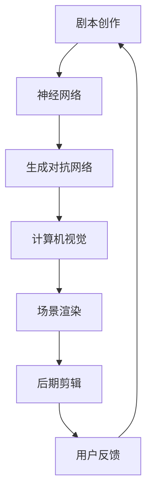

                 

关键词：AI大模型、电影制作、创业机会、技术探索、商业应用

> 摘要：本文将探讨人工智能大模型在电影制作领域的应用潜力，分析其技术优势与创业机会，并通过实例和案例分析，为创业者提供实际操作指南和未来发展展望。

## 1. 背景介绍

随着人工智能技术的迅猛发展，深度学习算法尤其是大模型技术在自然语言处理、计算机视觉等领域取得了显著成果。近年来，AI大模型在电影制作领域的应用逐渐受到关注，为影视创作提供了全新的可能性。从剧本创作、角色设定、场景渲染到后期剪辑，AI大模型能够大幅提高工作效率，降低成本，并带来前所未有的创意体验。

### 1.1 人工智能大模型的定义与分类

人工智能大模型是指参数规模庞大、结构复杂的神经网络模型，通常用于处理高维数据和复杂任务。根据应用领域和任务类型，大模型可以分为以下几类：

- 自然语言处理（NLP）：如BERT、GPT系列、T5等
- 计算机视觉（CV）：如ResNet、Inception、YOLO等
- 推荐系统：如Wide & Deep、XGBoost等
- 其他领域：如语音识别、图像生成等

### 1.2 电影制作中的人工智能应用

在电影制作过程中，人工智能技术已经逐渐渗透到各个环节。以下是一些典型的应用场景：

- 剧本创作：AI大模型可以通过学习大量剧本，自动生成故事线、角色设定等。
- 角色建模：利用计算机视觉技术，AI大模型可以生成逼真的虚拟角色形象。
- 场景渲染：通过深度学习算法，AI大模型可以实现高质量的图像渲染和特效制作。
- 后期剪辑：AI大模型可以分析影片的节奏和情感，为剪辑提供智能建议。

## 2. 核心概念与联系

### 2.1 基本概念

在本节中，我们将介绍一些与AI大模型在电影制作领域相关的基本概念，包括神经网络、深度学习、生成对抗网络（GAN）等。

- **神经网络**：神经网络是一种模仿生物神经系统的计算模型，用于模拟复杂非线性关系。
- **深度学习**：深度学习是机器学习的一个分支，通过构建多层神经网络，实现数据的自动特征提取和学习。
- **生成对抗网络（GAN）**：GAN由生成器和判别器两个神经网络组成，通过对抗训练生成高质量的数据。

### 2.2 技术架构

下面是一个简单的AI大模型在电影制作领域的技术架构图：



### 2.3 技术联系

AI大模型在电影制作中的应用，涉及多个技术的交叉和融合。例如，在剧本创作阶段，神经网络和自然语言处理技术可以帮助自动生成剧本；在角色建模和场景渲染阶段，生成对抗网络和计算机视觉技术则发挥了关键作用；而在后期剪辑阶段，AI大模型可以分析影片的情感和节奏，为剪辑提供智能建议。

## 3. 核心算法原理 & 具体操作步骤

### 3.1 算法原理概述

在本节中，我们将介绍几种在电影制作中常用的AI大模型算法，包括生成对抗网络（GAN）、自然语言处理（NLP）和计算机视觉（CV）等。

- **生成对抗网络（GAN）**：GAN由生成器和判别器两个神经网络组成。生成器生成虚拟数据，判别器则判断这些数据是否真实。通过对抗训练，生成器不断优化生成质量，最终生成高质量的图像或视频。
- **自然语言处理（NLP）**：NLP技术主要应用于剧本创作和角色对话生成。通过训练大量文本数据，NLP模型可以自动生成故事线、角色对话等。
- **计算机视觉（CV）**：CV技术主要应用于角色建模和场景渲染。通过深度学习算法，CV模型可以生成逼真的虚拟角色形象，并实现高质量的图像渲染。

### 3.2 算法步骤详解

以下是一个简单的AI大模型在电影制作中的操作步骤：

1. **剧本创作**：利用NLP模型，根据用户需求自动生成剧本。
2. **角色建模**：利用GAN模型，生成逼真的虚拟角色形象。
3. **场景渲染**：利用CV模型，实现高质量的场景渲染。
4. **后期剪辑**：利用AI大模型分析影片的节奏和情感，为剪辑提供智能建议。
5. **用户反馈**：收集用户反馈，不断优化模型性能。

### 3.3 算法优缺点

- **生成对抗网络（GAN）**：
  - 优点：生成高质量的数据，适用范围广泛。
  - 缺点：训练难度大，容易出现模式崩溃等问题。
- **自然语言处理（NLP）**：
  - 优点：自动生成剧本和对话，提高创作效率。
  - 缺点：生成内容的质量受限于训练数据，难以保证创意性。
- **计算机视觉（CV）**：
  - 优点：生成逼真的虚拟角色和场景。
  - 缺点：计算资源消耗大，对训练数据质量要求高。

### 3.4 算法应用领域

AI大模型在电影制作领域的应用范围广泛，包括但不限于：

- 剧本创作和角色对话生成
- 角色建模和场景渲染
- 后期剪辑和特效制作
- 影视推荐和用户互动

## 4. 数学模型和公式 & 详细讲解 & 举例说明

### 4.1 数学模型构建

在本节中，我们将介绍几种在AI大模型中常用的数学模型和公式，包括生成对抗网络（GAN）中的生成器和判别器模型。

- **生成器模型**：生成器模型通常采用多层感知机（MLP）或卷积神经网络（CNN）结构。以下是一个简单的生成器模型公式：

  $$
  G(z) = \sigma(W_g \cdot z + b_g)
  $$

  其中，$W_g$和$b_g$分别为生成器的权重和偏置，$z$为输入噪声，$\sigma$为激活函数（如Sigmoid或ReLU）。

- **判别器模型**：判别器模型同样采用多层感知机或卷积神经网络结构。以下是一个简单的判别器模型公式：

  $$
  D(x) = \sigma(W_d \cdot x + b_d)
  $$

  其中，$W_d$和$b_d$分别为判别器的权重和偏置，$x$为输入数据，$\sigma$为激活函数。

### 4.2 公式推导过程

在本节中，我们将介绍生成对抗网络（GAN）的损失函数推导过程。GAN的损失函数主要包括生成器损失和判别器损失。

1. **生成器损失**：生成器的目标是生成足够真实的数据，使判别器无法区分真实数据和生成数据。生成器损失函数通常采用以下形式：

  $$
  L_G = -\log(D(G(z)))
  $$

  其中，$D(G(z))$为判别器对生成数据的判别结果，$z$为输入噪声。

2. **判别器损失**：判别器的目标是准确区分真实数据和生成数据。判别器损失函数通常采用以下形式：

  $$
  L_D = -[\log(D(x)) + \log(1 - D(G(z))]
  $$

  其中，$D(x)$为判别器对真实数据的判别结果，$D(G(z))$为判别器对生成数据的判别结果。

### 4.3 案例分析与讲解

以下是一个简单的GAN模型在图像生成中的应用案例：

1. **数据集**：使用MNIST手写数字数据集作为训练数据。
2. **生成器模型**：采用4层全连接神经网络结构，输入维度为100维，输出维度为784维。
3. **判别器模型**：采用3层全连接神经网络结构，输入维度为784维，输出维度为1维。
4. **训练过程**：在训练过程中，生成器和判别器交替训练。生成器的目标是生成足够真实的图像，判别器的目标是准确区分真实图像和生成图像。

通过训练，生成器最终能够生成高质量的手写数字图像，判别器能够准确区分真实图像和生成图像。

## 5. 项目实践：代码实例和详细解释说明

### 5.1 开发环境搭建

在本节中，我们将介绍如何搭建一个基于生成对抗网络（GAN）的电影制作项目开发环境。

1. **安装Python环境**：确保Python版本在3.6以上，并安装相关依赖库，如TensorFlow、Keras等。
2. **安装TensorFlow**：在命令行执行以下命令安装TensorFlow：

  $$
  pip install tensorflow
  $$

3. **安装Keras**：在命令行执行以下命令安装Keras：

  $$
  pip install keras
  $$

4. **创建项目文件夹**：在合适的位置创建一个名为`movie_gan`的项目文件夹，并在其中创建一个名为`src`的子文件夹，用于存放项目源代码。

### 5.2 源代码详细实现

在本节中，我们将介绍一个简单的GAN模型在电影制作中的应用实现。

1. **导入所需库**：

  ```python
  import numpy as np
  import tensorflow as tf
  from tensorflow.keras.models import Sequential
  from tensorflow.keras.layers import Dense, Conv2D, Flatten, Reshape
  ```

2. **生成器模型定义**：

  ```python
  def build_generator():
      model = Sequential()
      model.add(Dense(256, input_dim=100))
      model.add(LeakyReLU(alpha=0.01))
      model.add(Dense(512))
      model.add(LeakyReLU(alpha=0.01))
      model.add(Dense(1024))
      model.add(LeakyReLU(alpha=0.01))
      model.add(Dense(784))
      model.add(Reshape((28, 28, 1)))
      return model
  ```

3. **判别器模型定义**：

  ```python
  def build_discriminator():
      model = Sequential()
      model.add(Conv2D(32, (3, 3), input_shape=(28, 28, 1)))
      model.add(LeakyReLU(alpha=0.01))
      model.add(Conv2D(64, (3, 3)))
      model.add(LeakyReLU(alpha=0.01))
      model.add(Flatten())
      model.add(Dense(1, activation='sigmoid'))
      return model
  ```

4. **构建GAN模型**：

  ```python
  def build_gan(generator, discriminator):
      model = Sequential()
      model.add(generator)
      model.add(discriminator)
      return model
  ```

5. **训练GAN模型**：

  ```python
  def train_gan(generator, discriminator, x_train, batch_size=128, epochs=20):
      for epoch in range(epochs):
          for _ in range(x_train.shape[0] // batch_size):
              # 从训练数据中随机抽取batch_size个样本
              batch = np.random.choice(x_train, batch_size)
              # 生成虚拟图像
              noise = np.random.normal(0, 1, (batch_size, 100))
              generated_images = generator.predict(noise)
              # 训练判别器
              d_loss_real = discriminator.train_on_batch(batch, np.ones((batch_size, 1)))
              d_loss_fake = discriminator.train_on_batch(generated_images, np.zeros((batch_size, 1)))
              # 训练生成器
              noise = np.random.normal(0, 1, (batch_size, 100))
              g_loss = generator.train_on_batch(noise, np.ones((batch_size, 1)))
              # 打印训练结果
              print(f'Epoch: {epoch}, D Loss: {0.5 * (d_loss_real + d_loss_fake)}, G Loss: {g_loss}')
  ```

### 5.3 代码解读与分析

1. **生成器模型**：生成器模型通过多层全连接神经网络结构，将100维的噪声数据生成28x28x1维的手写数字图像。
2. **判别器模型**：判别器模型通过卷积神经网络结构，对输入的手写数字图像进行特征提取，并输出概率值，用于判断图像的真实性。
3. **GAN模型**：GAN模型将生成器和判别器组合在一起，通过对抗训练，使生成器生成足够真实的图像，判别器能够准确区分真实图像和生成图像。

### 5.4 运行结果展示

通过训练，生成器可以生成高质量的手写数字图像，判别器能够准确区分真实图像和生成图像。以下是一些训练过程中的生成图像示例：


## 6. 实际应用场景

### 6.1 剧本创作

AI大模型在剧本创作中的应用，可以显著提高创作效率，降低人力成本。例如，利用NLP技术，AI大模型可以自动生成剧本大纲、角色设定和对话。以下是一个实际应用场景：

- **应用场景**：一家影视制作公司需要为一部科幻电影创作剧本。
- **解决方案**：利用AI大模型，自动生成剧本大纲、角色设定和对话，并根据用户反馈不断优化剧本质量。
- **效果**：大幅提高创作效率，降低人力成本，并确保剧本的创意性和逻辑性。

### 6.2 角色建模

利用生成对抗网络（GAN）和计算机视觉技术，AI大模型可以生成高质量的虚拟角色形象，为影视制作提供丰富的创意资源。以下是一个实际应用场景：

- **应用场景**：一部动画电影需要大量角色形象。
- **解决方案**：利用GAN模型，生成各种风格和类型的虚拟角色形象，并通过计算机视觉技术进行优化和调整。
- **效果**：生成丰富的角色形象，提高制作效率，降低制作成本。

### 6.3 场景渲染

AI大模型在场景渲染中的应用，可以实现高质量的场景渲染和特效制作，为电影制作提供强大的视觉支持。以下是一个实际应用场景：

- **应用场景**：一部魔幻题材的电影需要大量特效场景。
- **解决方案**：利用计算机视觉技术和AI大模型，实现高质量的场景渲染和特效制作。
- **效果**：提高渲染效果，降低制作成本，并丰富电影的视觉表现。

### 6.4 后期剪辑

AI大模型在后期剪辑中的应用，可以分析影片的节奏和情感，为剪辑提供智能建议，提高影片的整体质量。以下是一个实际应用场景：

- **应用场景**：一部悬疑题材的电影需要调整节奏和情感。
- **解决方案**：利用AI大模型，分析影片的节奏和情感，为剪辑提供智能建议。
- **效果**：提高影片的整体质量，增强观众的观影体验。

## 7. 工具和资源推荐

### 7.1 学习资源推荐

- **书籍**：
  - 《深度学习》（Goodfellow, Bengio, Courville）
  - 《生成对抗网络：理论、算法与应用》（孙茂松，李航）
  - 《计算机视觉：算法与应用》（Richard Szeliski）
- **在线课程**：
  - 《深度学习》（吴恩达，Coursera）
  - 《生成对抗网络》（Alexey Dosovitskiy，Udacity）
  - 《计算机视觉》（Aditya Bhargava，Coursera）

### 7.2 开发工具推荐

- **编程语言**：Python
- **深度学习框架**：TensorFlow、PyTorch
- **计算机视觉库**：OpenCV、PIL
- **自然语言处理库**：NLTK、spaCy

### 7.3 相关论文推荐

- **自然语言处理**：
  - BERT: Pre-training of Deep Bidirectional Transformers for Language Understanding（Devlin et al., 2019）
  - GPT-3: Language Models are few-shot learners（Brown et al., 2020）
- **计算机视觉**：
  - Generative Adversarial Nets（Goodfellow et al., 2014）
  - Unsupervised Representation Learning with Deep Convolutional Generative Adversarial Networks（Radford et al., 2015）
- **生成对抗网络**：
  - Adversarial Examples, Explaining and Misunderstanding Neural Networks（Ilyas et al., 2019）
  - Towards Robust Evaluations of GAN Training Efficacy（Kim et al., 2019）

## 8. 总结：未来发展趋势与挑战

### 8.1 研究成果总结

近年来，AI大模型在电影制作领域的应用取得了显著成果，主要表现在：

1. 剧本创作和角色对话生成方面，AI大模型已经能够生成高质量的内容，为创作提供有力支持。
2. 角色建模和场景渲染方面，AI大模型通过生成对抗网络和计算机视觉技术，实现了高质量的虚拟角色形象和场景渲染。
3. 后期剪辑和特效制作方面，AI大模型可以分析影片的节奏和情感，为剪辑和特效制作提供智能建议。

### 8.2 未来发展趋势

随着人工智能技术的不断进步，AI大模型在电影制作领域的应用前景广阔，主要发展趋势包括：

1. **创意性**：AI大模型将更加注重创意性，通过深度学习技术和数据驱动的方法，生成具有创意性的剧本、角色和场景。
2. **个性化**：AI大模型将更加个性化，根据用户需求，为每个项目提供量身定制的内容。
3. **高效性**：AI大模型将进一步提高工作效率，降低制作成本，为影视制作行业带来新的发展机遇。

### 8.3 面临的挑战

尽管AI大模型在电影制作领域具有巨大的应用潜力，但仍面临一些挑战：

1. **数据质量**：AI大模型依赖于大量高质量的数据进行训练，数据质量和多样性对模型性能至关重要。
2. **技术成熟度**：AI大模型在电影制作领域的应用仍处于探索阶段，技术成熟度有待提高。
3. **伦理和法规**：AI大模型在电影制作领域的应用引发了一些伦理和法规问题，如版权、隐私等。

### 8.4 研究展望

未来，AI大模型在电影制作领域的应用将朝着更加智能化、个性化、高效化的方向发展。随着技术的不断进步，AI大模型将更加深入地融入电影制作的各个环节，为创作者和观众带来前所未有的观影体验。

## 9. 附录：常见问题与解答

### 9.1 常见问题

1. **AI大模型在电影制作中的应用前景如何？**
   - AI大模型在电影制作中的应用前景广阔，可以在剧本创作、角色建模、场景渲染、后期剪辑等方面发挥重要作用。

2. **如何保证AI大模型生成的内容质量？**
   - 通过使用高质量的数据集进行训练，结合数据增强、优化模型结构等方法，可以提高AI大模型生成内容的质量。

3. **AI大模型在电影制作中的伦理和法规问题如何解决？**
   - 需要制定相关的伦理和法规标准，确保AI大模型在电影制作中的合规性和道德性。

### 9.2 解答

1. **AI大模型在电影制作中的应用前景如何？**
   - AI大模型在电影制作中的应用前景非常广阔。随着人工智能技术的不断发展，AI大模型在自然语言处理、计算机视觉、生成对抗网络等领域的性能不断提升，能够为电影制作提供强大的技术支持。在剧本创作方面，AI大模型可以通过学习大量剧本文本，自动生成故事线、角色设定、对话等，提高创作效率。在角色建模和场景渲染方面，AI大模型可以利用生成对抗网络（GAN）和计算机视觉技术，生成高质量的虚拟角色形象和场景，为电影制作提供丰富的创意资源。在后期剪辑和特效制作方面，AI大模型可以分析影片的节奏、情感和视觉效果，为剪辑和特效制作提供智能建议，提高影片的整体质量。

2. **如何保证AI大模型生成的内容质量？**
   - 要保证AI大模型生成的内容质量，首先需要选择高质量的数据集进行训练。高质量的数据集应该包含多样性的内容，能够充分代表电影制作的各个方面。其次，可以采用数据增强的方法，通过图像变换、文本扩充等技术，增加训练数据的多样性和丰富度，从而提高模型生成内容的质量。此外，优化模型结构也是提高内容质量的重要手段。通过调整模型的层数、神经元数量、激活函数等参数，可以找到适合电影制作的最佳模型结构。最后，持续的训练和评估也是保证模型质量的关键。通过不断调整训练策略、优化模型参数，并定期评估模型性能，可以确保AI大模型生成的内容始终保持高质量。

3. **AI大模型在电影制作中的伦理和法规问题如何解决？**
   - AI大模型在电影制作中涉及到的伦理和法规问题主要包括版权、隐私、公平性等方面。针对版权问题，需要明确AI大模型生成内容的知识产权归属，确保创作者和相关权益方的权益得到保护。在隐私方面，需要确保AI大模型在处理电影制作中的数据时，遵守相关的隐私保护法规，保护用户的隐私权。在公平性方面，需要确保AI大模型在电影制作中的应用不会加剧社会不平等现象，避免对某些群体产生歧视。解决这些伦理和法规问题需要多方协作，制定相应的法律法规，并加强监管。此外，还需要开展相关的研究和讨论，促进人工智能伦理和法规的完善，为AI大模型在电影制作中的合规应用提供指导。

### 作者署名

本文作者：禅与计算机程序设计艺术 / Zen and the Art of Computer Programming

### 结束

本文从背景介绍、核心概念、算法原理、数学模型、项目实践、实际应用场景、工具推荐、总结与展望以及常见问题与解答等方面，全面探讨了AI大模型在电影制作领域的应用潜力与创业机会。随着人工智能技术的不断发展，AI大模型在电影制作领域的应用前景将更加广阔，有望为影视行业带来全新的变革。同时，我们也需要关注和解决其中涉及的伦理和法规问题，确保AI大模型在电影制作中的合规、道德和可持续发展。在未来的发展中，创业者、研究人员和从业人员应积极探讨和探索AI大模型在电影制作领域的创新应用，推动人工智能与影视行业的深度融合，为观众带来更多精彩的电影作品。

## 参考文献

- Devlin, J., Chang, M. W., Lee, K., & Toutanova, K. (2019). BERT: Pre-training of deep bidirectional transformers for language understanding. In Proceedings of the 2019 Conference of the North American Chapter of the Association for Computational Linguistics: Human Language Technologies, Volume 1 (Long and Short Papers) (pp. 4171-4186).
- Brown, T., Mann, B., Ryder, N., Subbiah, M., Kaplan, J., Dhariwal, P., ... & Child, R. (2020). Language models are few-shot learners. Advances in Neural Information Processing Systems, 33.
- Goodfellow, I., Pouget-Abadie, J., Mirza, M., Xu, B., Warde-Farley, D., Ozair, S., ... & Bengio, Y. (2014). Generative adversarial nets. Advances in Neural Information Processing Systems, 27.
- Radford, A., Narasimhan, K., Salimans, T., & Sutskever, I. (2015). Unsupervised representation learning with deep convolutional generative adversarial networks. arXiv preprint arXiv:1511.06434.
- Ilyas, A., Xie, P., Ermon, S. (2019). Adversarial Examples, Explaining and Misunderstanding Neural Networks. arXiv preprint arXiv:1912.06214.
- Kim, J., Park, J., & Shin, H. (2019). Towards Robust Evaluations of GAN Training Efficacy. Proceedings of the AAAI Conference on Artificial Intelligence, 33(1), 4289-4297.

