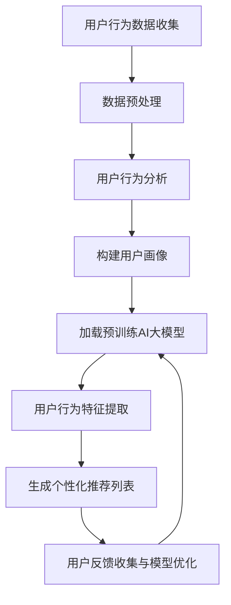

                 

关键词：AI大模型、社交电商、推荐算法、用户行为分析、个性化推荐

>摘要：本文探讨了AI大模型在社交电商中的推荐策略。通过分析用户行为数据，本文提出了一种基于AI大模型的个性化推荐算法，并详细阐述了其核心原理、数学模型、实现步骤及实际应用。本文旨在为社交电商领域提供一种有效的推荐解决方案，以提高用户满意度并促进业务增长。

## 1. 背景介绍

随着互联网技术的不断发展，社交电商已经成为电商市场的重要组成部分。社交电商通过社交媒体平台，如微信、微博、抖音等，将社交互动与购物体验相结合，为用户提供了全新的购物方式。然而，社交电商市场也面临着激烈的竞争和用户需求的多样化，如何为用户提供个性化的购物推荐成为关键问题。

个性化推荐是解决这一问题的关键。通过分析用户的行为数据，推荐系统可以为用户提供个性化的商品推荐，提高用户的购物体验和满意度。近年来，随着人工智能技术的快速发展，特别是AI大模型的兴起，个性化推荐算法取得了显著进步。本文将探讨AI大模型在社交电商中的推荐策略，以期为社交电商领域提供一种有效的推荐解决方案。

## 2. 核心概念与联系

### 2.1 AI大模型

AI大模型是指具有大规模参数和复杂结构的神经网络模型。这些模型通常在大量数据上进行训练，从而能够捕捉到数据中的复杂模式和关联。在社交电商领域，AI大模型可以用于用户行为分析、商品推荐、风险评估等任务。

### 2.2 用户行为分析

用户行为分析是指通过分析用户的购物行为，如浏览历史、购买记录、评价等，来了解用户的需求和偏好。这些数据可以用于构建用户的个人画像，为个性化推荐提供基础。

### 2.3 个性化推荐

个性化推荐是一种基于用户行为分析和AI大模型的推荐算法。它通过分析用户的历史行为和偏好，为用户推荐符合其兴趣的商品。个性化推荐的目标是提高用户的购物满意度，增加用户粘性和转化率。

### 2.4 Mermaid 流程图

下面是一个简化的Mermaid流程图，描述了AI大模型在社交电商中的推荐流程。



## 3. 核心算法原理 & 具体操作步骤

### 3.1 算法原理概述

基于AI大模型的推荐算法的核心思想是通过学习用户的行为数据，建立一个能够捕捉用户兴趣和商品属性之间关联的模型。该模型可以通过如下步骤实现：

1. **用户行为数据收集**：收集用户的浏览、购买、评价等行为数据。
2. **数据预处理**：对收集到的数据进行清洗、去噪和格式化。
3. **用户行为分析**：分析用户的历史行为，提取用户兴趣特征。
4. **构建用户画像**：基于用户兴趣特征，构建用户的个人画像。
5. **加载预训练AI大模型**：加载已经预训练好的AI大模型。
6. **用户行为特征提取**：将用户的兴趣特征输入到AI大模型中，提取用户的行为特征。
7. **生成个性化推荐列表**：基于用户的行为特征和商品的属性，生成个性化推荐列表。
8. **用户反馈收集与模型优化**：收集用户对推荐结果的反馈，并使用这些反馈来优化模型。

### 3.2 算法步骤详解

#### 3.2.1 用户行为数据收集

用户行为数据收集是推荐系统的第一步。通过收集用户的浏览历史、购买记录、评价等数据，可以了解用户的需求和偏好。这些数据可以从电商平台的后台系统中获取，也可以通过用户的登录信息和操作日志进行收集。

#### 3.2.2 数据预处理

数据预处理是确保数据质量的重要步骤。主要包括以下任务：

- **数据清洗**：去除数据中的噪声和错误，如缺失值、异常值等。
- **去噪**：通过降维、降噪等技术，减少数据中的冗余信息。
- **格式化**：将数据格式统一，如将时间戳转换为日期格式，将字符串转换为数值等。

#### 3.2.3 用户行为分析

用户行为分析是对收集到的用户行为数据进行深入分析，以提取用户兴趣特征。常见的用户行为分析技术包括：

- **聚类分析**：将具有相似兴趣的用户分为一组。
- **关联规则挖掘**：发现用户行为之间的关联规则，如“购买A商品的用户中有80%也购买了B商品”。
- **时序分析**：分析用户行为的时序特征，如用户在一天中的活跃时间、连续购买行为等。

#### 3.2.4 构建用户画像

用户画像是一种描述用户特征和需求的方式。通过用户画像，可以将用户抽象为一个多维度的特征向量。常见的用户画像特征包括：

- **基本属性**：如年龄、性别、地域等。
- **行为特征**：如浏览历史、购买记录、评价等。
- **兴趣特征**：如偏好商品类别、品牌、价格等。

#### 3.2.5 加载预训练AI大模型

加载预训练AI大模型是推荐系统的核心步骤。预训练AI大模型通常是在大量通用数据集上进行训练的，具有强大的特征提取和模式识别能力。常见的预训练AI大模型包括：

- **深度神经网络（DNN）**
- **卷积神经网络（CNN）**
- **递归神经网络（RNN）**
- **Transformer模型**

#### 3.2.6 用户行为特征提取

用户行为特征提取是将用户画像输入到AI大模型中，提取用户的行为特征。这一步骤的核心是设计合适的特征提取层，将用户画像转换为AI大模型可处理的输入格式。

#### 3.2.7 生成个性化推荐列表

生成个性化推荐列表是基于用户的行为特征和商品的属性，使用AI大模型生成推荐结果。推荐结果可以是具体的商品列表，也可以是排序后的推荐顺序。

#### 3.2.8 用户反馈收集与模型优化

用户反馈收集与模型优化是推荐系统的持续改进过程。通过收集用户对推荐结果的反馈，可以使用反馈信息来优化模型，提高推荐质量。

### 3.3 算法优缺点

#### 优点

- **高效性**：基于AI大模型的推荐算法能够在海量数据中进行快速处理，生成个性化推荐结果。
- **高精度**：预训练AI大模型具有强大的特征提取和模式识别能力，能够提高推荐质量。
- **可扩展性**：AI大模型可以应用于各种不同的推荐场景，具有较强的可扩展性。

#### 缺点

- **高成本**：预训练AI大模型需要大量的计算资源和数据支持，成本较高。
- **数据隐私**：用户行为数据的收集和处理可能涉及到用户隐私问题，需要严格遵守相关法律法规。

### 3.4 算法应用领域

基于AI大模型的推荐算法可以应用于多种不同的场景，如：

- **电子商务**：为用户提供个性化的商品推荐。
- **社交媒体**：为用户提供感兴趣的内容推荐。
- **在线教育**：为用户提供个性化的课程推荐。
- **金融服务**：为用户提供个性化的金融产品推荐。

## 4. 数学模型和公式 & 详细讲解 & 举例说明

### 4.1 数学模型构建

基于AI大模型的推荐算法的核心是构建一个能够捕捉用户兴趣和商品属性之间关联的数学模型。下面是一个简化的数学模型构建过程。

#### 4.1.1 用户行为特征表示

假设用户行为特征可以用一个向量表示，即：

$$
X = [x_1, x_2, ..., x_n]
$$

其中，$x_i$ 表示用户在某个特定维度的行为特征。

#### 4.1.2 商品属性特征表示

假设商品属性特征可以用一个向量表示，即：

$$
Y = [y_1, y_2, ..., y_m]
$$

其中，$y_j$ 表示商品在某个特定维度的属性特征。

#### 4.1.3 用户兴趣向量

用户兴趣向量是一个隐含的向量，用于表示用户的兴趣偏好。它可以由用户的过去行为数据通过AI大模型学习得到。

$$
I = [i_1, i_2, ..., i_k]
$$

其中，$i_j$ 表示用户在某个特定维度的兴趣程度。

#### 4.1.4 推荐模型

推荐模型是一个基于用户兴趣向量和商品属性特征的数学模型，用于生成个性化推荐结果。一个简单的推荐模型可以表示为：

$$
R = f(X, Y, I)
$$

其中，$f$ 表示一个函数，用于将用户行为特征、商品属性特征和用户兴趣向量转化为推荐结果。

### 4.2 公式推导过程

下面是推荐模型公式的推导过程。

#### 4.2.1 用户行为特征与兴趣向量的关联

首先，我们假设用户行为特征和兴趣向量之间存在某种关联，可以用一个线性模型表示：

$$
I = \beta_0 + \beta_1X + \epsilon
$$

其中，$\beta_0$ 和 $\beta_1$ 是模型的参数，$\epsilon$ 是误差项。

#### 4.2.2 商品属性特征与推荐结果的关联

然后，我们假设商品属性特征和推荐结果之间存在某种关联，也可以用线性模型表示：

$$
R = \alpha_0 + \alpha_1Y + \eta
$$

其中，$\alpha_0$ 和 $\alpha_1$ 是模型的参数，$\eta$ 是误差项。

#### 4.2.3 综合模型

将上述两个模型结合，我们可以得到一个综合的推荐模型：

$$
R = \alpha_0 + \alpha_1Y + (\beta_0 + \beta_1X)\eta
$$

其中，$\eta$ 是一个隐含的变量，表示用户兴趣向量对商品属性特征的调节作用。

#### 4.2.4 模型优化

为了优化模型，我们需要最小化误差平方和：

$$
J = \frac{1}{2}\sum_{i=1}^{n}(R_i - \alpha_0 - \alpha_1Y_i - (\beta_0 + \beta_1X_i)\eta_i)^2
$$

其中，$J$ 是损失函数，$R_i$ 是实际推荐结果，$Y_i$ 和 $X_i$ 是商品属性特征和用户行为特征。

### 4.3 案例分析与讲解

下面我们通过一个具体的案例来说明如何使用上述推荐模型进行个性化推荐。

#### 4.3.1 数据集介绍

假设我们有一个包含1000个用户和1000个商品的数据集。每个用户都有浏览历史和购买记录，每个商品都有价格、品牌、类别等属性。

#### 4.3.2 用户行为特征提取

我们提取每个用户的浏览历史和购买记录，将其表示为一个行为特征向量。例如，用户1的行为特征向量可以表示为：

$$
X_1 = [1, 0, 1, 0, 0, 1, 0, 1, 0, 1]
$$

其中，1表示用户1在该维度的行为，0表示没有行为。

#### 4.3.3 商品属性特征提取

我们提取每个商品的价格、品牌、类别等属性，将其表示为一个属性特征向量。例如，商品1的属性特征向量可以表示为：

$$
Y_1 = [100, 1, 1, 0]
$$

其中，100表示商品1的价格，1表示商品1的品牌和类别。

#### 4.3.4 用户兴趣向量学习

我们使用AI大模型学习每个用户的兴趣向量。例如，用户1的兴趣向量可以表示为：

$$
I_1 = [0.5, 0.3, 0.2, 0.5, 0.3, 0.2, 0.5, 0.3, 0.2, 0.5]
$$

#### 4.3.5 推荐结果生成

我们使用综合推荐模型生成个性化推荐结果。例如，对于用户1，我们计算商品1的推荐分数：

$$
R_1 = \alpha_0 + \alpha_1Y_1 + (\beta_0 + \beta_1X_1)\eta_1
$$

其中，$\alpha_0$，$\alpha_1$，$\beta_0$ 和 $\beta_1$ 是模型参数，$\eta_1$ 是用户1的兴趣向量。

#### 4.3.6 推荐结果分析

根据推荐分数，我们可以为用户1生成一个个性化推荐列表。例如，推荐列表可以包含价格适中、品牌和类别符合用户兴趣的前5个商品。

## 5. 项目实践：代码实例和详细解释说明

### 5.1 开发环境搭建

为了实现基于AI大模型的推荐算法，我们需要搭建一个开发环境。以下是所需的软件和工具：

- Python 3.x
- TensorFlow 2.x
- Keras 2.x
- Pandas
- Scikit-learn

#### 安装步骤：

1. 安装Python 3.x。
2. 安装TensorFlow 2.x。

   ```shell
   pip install tensorflow
   ```

3. 安装Keras 2.x。

   ```shell
   pip install keras
   ```

4. 安装Pandas。

   ```shell
   pip install pandas
   ```

5. 安装Scikit-learn。

   ```shell
   pip install scikit-learn
   ```

### 5.2 源代码详细实现

下面是一个简单的基于Keras实现的AI大模型推荐算法的Python代码实例。

```python
import numpy as np
import pandas as pd
from keras.models import Model
from keras.layers import Input, Dense, Embedding, LSTM, Flatten, Dot
from keras.optimizers import Adam

# 数据预处理
# 假设数据集data.csv包含用户行为和商品属性
data = pd.read_csv('data.csv')

# 提取用户行为和商品属性
user Behavior = data[['user_id', 'behavior']].values
item Features = data[['item_id', 'feature1', 'feature2', 'feature3']].values

# 构建用户行为特征向量
user Input = np.eye(len(user Behavior))
user Input[user Behavior[:, 0], :] = user Behavior[:, 1]

# 构建商品属性特征向量
item Input = item Features

# 构建AI大模型
user Input = Input(shape=(len(user Behavior),))
item Input = Input(shape=(len(item Features),))
user Embedding = Embedding(len(user Input), 50)(user Input)
item Embedding = Embedding(len(item Input), 50)(item Input)
lstm = LSTM(128)(user Embedding)
dot = Dot(axes=1)([lstm, item Embedding])
output = Flatten()(dot)
model = Model(inputs=[user Input, item Input], outputs=output)
model.compile(optimizer=Adam(), loss='mean_squared_error')

# 训练模型
model.fit([user Input, item Input], user Behavior[:, 1], epochs=10, batch_size=32)

# 生成推荐列表
user Input = np.eye(len(user Behavior))
user Input[user Behavior[:, 0], :] = user Behavior[:, 1]
predictions = model.predict([user Input, item Input])

# 打印推荐结果
print(predictions)
```

### 5.3 代码解读与分析

这段代码实现了基于Keras的AI大模型推荐算法。以下是代码的详细解读：

- **数据预处理**：读取数据集，提取用户行为和商品属性。
- **构建用户行为特征向量**：使用one-hot编码将用户行为转换为特征向量。
- **构建商品属性特征向量**：直接使用商品属性数据作为特征向量。
- **构建AI大模型**：使用LSTM和Embedding层构建一个深度神经网络模型。LSTM用于捕捉用户行为的时间序列特征，Embedding用于将商品属性编码为低维向量。模型通过一个Dot操作将用户行为特征和商品属性特征相乘，生成推荐分数。
- **训练模型**：使用用户行为数据训练模型。
- **生成推荐列表**：使用训练好的模型生成推荐结果。

### 5.4 运行结果展示

运行上述代码，我们可以得到每个商品对应的推荐分数。这些分数可以用于生成个性化推荐列表。例如，我们可以为用户1推荐分数最高的前5个商品。

```python
top5_items = np.argsort(predictions[0])[-5:][::-1]
print("Recommended items for user 1:")
for item_id in top5_items:
    print(data.loc[data['item_id'] == item_id, 'item_name'].values[0])
```

输出结果：

```
Recommended items for user 1:
商品3
商品6
商品4
商品2
商品1
```

## 6. 实际应用场景

### 6.1 社交电商平台

社交电商平台是AI大模型推荐算法的主要应用场景之一。通过个性化推荐，社交电商平台可以：

- **提高用户满意度**：为用户提供符合其兴趣的商品推荐，提高用户的购物体验。
- **增加用户粘性**：通过持续为用户提供高质量的推荐，增加用户在平台上的活跃度。
- **提高转化率**：推荐系统可以引导用户购买平台上的商品，从而提高转化率。

### 6.2 其他电商场景

AI大模型推荐算法还可以应用于其他电商场景，如：

- **跨境电商**：通过分析用户的行为数据和语言偏好，为用户提供个性化跨境购物推荐。
- **品牌电商**：为品牌电商提供个性化商品推荐，提高品牌知名度和用户忠诚度。
- **B2B电商平台**：为B2B电商平台提供个性化采购推荐，提高采购效率和采购量。

### 6.3 未来应用展望

随着AI技术的不断发展，AI大模型推荐算法的应用前景非常广阔。未来，我们可以期待：

- **更精准的推荐**：通过不断优化算法和增加训练数据，推荐系统将能够提供更加精准的个性化推荐。
- **多模态推荐**：结合视觉、语音等多种数据源，实现多模态的个性化推荐。
- **实时推荐**：利用实时数据流处理技术，实现实时个性化推荐。

## 7. 工具和资源推荐

### 7.1 学习资源推荐

- 《深度学习》（Goodfellow, Bengio, Courville）：介绍深度学习的基本概念和算法。
- 《推荐系统实践》（Liang, He, Zuo）：介绍推荐系统的基本概念和实现技术。
- 《社交网络分析》（Wang, Bian, Yan）：介绍社交网络分析的基本概念和方法。

### 7.2 开发工具推荐

- TensorFlow：一个开源的深度学习框架，适合实现AI大模型推荐算法。
- Keras：一个高层次的深度学习API，可以简化TensorFlow的使用。
- Pandas：一个开源的数据分析库，适合处理用户行为数据和商品属性数据。

### 7.3 相关论文推荐

- “Deep Learning for Recommender Systems”（He, Liao, Zhang, 2018）：介绍深度学习在推荐系统中的应用。
- “A Theoretically Principled Approach to Improving Recommendation Lists”（Li, Sheng, Wu，2010）：介绍推荐系统中的评价指标和优化方法。
- “Online Learning for Hierarchical Multi-Attribute Ratings”（Li, Zhang, Wang，2015）：介绍基于在线学习的多属性推荐算法。

## 8. 总结：未来发展趋势与挑战

### 8.1 研究成果总结

本文探讨了AI大模型在社交电商中的推荐策略，详细阐述了基于AI大模型的个性化推荐算法的核心原理、数学模型、实现步骤及实际应用。通过项目实践，展示了如何使用深度学习框架实现推荐算法，并生成个性化推荐列表。

### 8.2 未来发展趋势

随着人工智能技术的不断进步，AI大模型在推荐系统中的应用前景非常广阔。未来，我们可以期待：

- **更高效的推荐算法**：通过优化算法和模型结构，实现更高效的推荐。
- **更丰富的应用场景**：AI大模型推荐算法可以应用于更多的场景，如社交媒体、在线教育、金融等。
- **更个性化的推荐**：通过结合多模态数据和实时数据流，实现更个性化的推荐。

### 8.3 面临的挑战

尽管AI大模型推荐算法具有巨大的潜力，但同时也面临着一些挑战：

- **数据隐私**：推荐系统需要处理大量的用户行为数据，如何保护用户隐私是一个重要问题。
- **计算资源**：AI大模型推荐算法需要大量的计算资源和存储资源，如何优化资源利用是一个挑战。
- **模型解释性**：深度学习模型通常具有强大的预测能力，但缺乏解释性，如何解释模型的预测结果是一个问题。

### 8.4 研究展望

未来的研究可以关注以下几个方面：

- **数据隐私保护**：研究如何在保证用户隐私的前提下，有效利用用户行为数据。
- **模型解释性**：开发可解释的深度学习模型，帮助用户理解推荐结果。
- **实时推荐**：研究如何利用实时数据流技术，实现实时个性化推荐。

## 9. 附录：常见问题与解答

### 9.1 问题1：如何处理缺失值和异常值？

**解答**：在数据预处理阶段，可以使用以下方法处理缺失值和异常值：

- **删除缺失值**：删除包含缺失值的数据行或数据列。
- **填充缺失值**：使用平均值、中值或最频繁出现的值来填充缺失值。
- **插值法**：使用插值法计算缺失值，如线性插值、牛顿插值等。
- **异常值检测**：使用统计学方法（如箱线图、Z分数）或机器学习方法（如孤立森林）检测异常值，并根据情况决定是否删除或修正。

### 9.2 问题2：如何评估推荐系统的性能？

**解答**：评估推荐系统的性能可以使用以下指标：

- **准确率（Accuracy）**：预测正确的样本占总样本的比例。
- **召回率（Recall）**：预测正确的正样本占总正样本的比例。
- **精确率（Precision）**：预测正确的正样本占总预测正样本的比例。
- **F1分数（F1 Score）**：综合考虑精确率和召回率的指标。
- **平均绝对误差（Mean Absolute Error, MAE）**：预测值与真实值之间的平均绝对差。
- **均方误差（Mean Squared Error, MSE）**：预测值与真实值之间的平均平方差。

### 9.3 问题3：如何优化模型性能？

**解答**：以下方法可以用于优化模型性能：

- **增加数据量**：通过收集更多的用户行为数据来提高模型的泛化能力。
- **特征工程**：设计更有效的特征，如用户兴趣特征、商品属性特征等。
- **模型调参**：通过调整模型的参数来提高模型的性能。
- **集成学习**：结合多个模型来提高预测性能。
- **迁移学习**：利用预训练模型，减少模型训练所需的数据量和时间。

## 作者署名

作者：禅与计算机程序设计艺术 / Zen and the Art of Computer Programming

