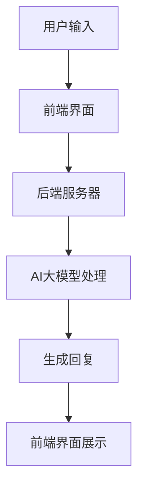

                 

AI大模型，作为近年来人工智能领域的明星技术，已经在各行各业展现了其强大的潜力。特别是在虚拟助手领域，AI大模型的应用不仅提升了用户体验，还为商家带来了新的商业机遇。本文将深入探讨AI大模型在虚拟助手领域的商业前景，分析其带来的机遇与挑战，并展望未来的发展趋势。

## 关键词

- AI大模型
- 虚拟助手
- 商业前景
- 技术创新
- 用户需求
- 用户体验

## 摘要

本文首先介绍了AI大模型的基本概念和虚拟助手的发展背景，然后分析了AI大模型在虚拟助手领域的优势和应用场景，探讨了其商业前景。文章还讨论了当前面临的挑战，并提出了未来发展的可能趋势。通过本文，读者可以全面了解AI大模型在虚拟助手领域的潜力，以及这一领域未来可能的发展方向。

### 1. 背景介绍

#### 1.1 AI大模型的基本概念

AI大模型，是指通过深度学习技术训练出的具有大规模参数的网络模型。这些模型通常具有极强的学习能力，可以在大量数据的基础上进行自我优化和提升。代表性的AI大模型包括GPT-3、BERT、Transformers等。它们的出现，标志着人工智能技术进入了一个新的阶段。

#### 1.2 虚拟助手的发展背景

虚拟助手，作为一种人工智能应用，旨在模拟人类的行为和思维方式，为用户提供智能化的服务。从最初的语音助手，如苹果的Siri、谷歌的Google Assistant，到现在的多模态虚拟助手，如微软的小冰、腾讯的小微，虚拟助手的发展经历了多个阶段。

#### 1.3 AI大模型与虚拟助手的结合

AI大模型的引入，为虚拟助手带来了新的可能性。通过大模型的强大学习能力，虚拟助手可以更好地理解用户需求，提供更加个性化的服务。同时，大模型的多模态处理能力，使得虚拟助手可以处理更加复杂的任务，如语音、图像、文本等多种输入信息。

### 2. 核心概念与联系

#### 2.1 AI大模型的基本架构

AI大模型通常由以下几个部分组成：

1. **输入层**：接收用户输入的信息，如语音、文本等。
2. **隐藏层**：通过深度学习算法进行多层神经网络的学习和优化。
3. **输出层**：根据学习结果，生成对应的输出，如回复文本、执行操作等。

#### 2.2 虚拟助手的架构

虚拟助手的基本架构可以分为以下几个部分：

1. **前端界面**：用于接收用户输入，展示虚拟助手的界面。
2. **后端服务器**：运行AI大模型，处理用户输入，生成回复。
3. **数据库**：存储用户数据，包括历史对话、偏好设置等。

#### 2.3 Mermaid流程图

下面是AI大模型在虚拟助手中的工作流程的Mermaid流程图：



### 3. 核心算法原理 & 具体操作步骤

#### 3.1 算法原理概述

AI大模型的算法原理主要基于深度学习，特别是基于Transformer架构的自适应编码器-解码器（Autoencoder-Decoder）模型。这种模型可以通过学习大量数据，自动提取输入信息的特征，并生成相应的输出。

#### 3.2 算法步骤详解

1. **数据预处理**：对用户输入的语音、文本等信息进行预处理，如分词、去噪等。
2. **编码器学习**：编码器通过多层神经网络，将预处理后的输入信息编码成固定长度的向量。
3. **解码器学习**：解码器根据编码后的向量，生成对应的输出，如回复文本。
4. **优化模型**：通过梯度下降等优化算法，不断调整模型的参数，使其生成更加准确和自然的回复。

#### 3.3 算法优缺点

**优点**：
- 强大的学习能力：能够处理复杂的任务，如多模态输入。
- 个性化的服务：可以根据用户的历史数据，提供个性化的回复。
- 自然的语言生成：生成的回复更加自然，符合人类的交流习惯。

**缺点**：
- 计算资源消耗大：训练和推理过程需要大量的计算资源和时间。
- 数据依赖性强：模型的性能很大程度上取决于训练数据的质量。

#### 3.4 算法应用领域

AI大模型在虚拟助手领域的应用非常广泛，包括但不限于以下领域：

- 客户服务：通过虚拟助手提供24/7的在线客服，提高客户满意度。
- 个人助理：为用户提供日程管理、任务提醒、信息查询等服务。
- 教育：通过虚拟助手提供个性化的学习辅导和课程推荐。
- 健康：通过虚拟助手提供健康咨询、疾病监测等个性化服务。

### 4. 数学模型和公式 & 详细讲解 & 举例说明

#### 4.1 数学模型构建

AI大模型的数学模型主要基于深度学习，特别是基于Transformer架构的自适应编码器-解码器（Autoencoder-Decoder）模型。其基本公式如下：

\[ 
\text{编码器}:\quad x = f_E(x) \\
\text{解码器}:\quad y = f_D(x) 
\]

其中，\( x \) 表示输入，\( y \) 表示输出，\( f_E \) 和 \( f_D \) 分别表示编码器和解码器的函数。

#### 4.2 公式推导过程

AI大模型的公式推导涉及多个层次，包括输入层的预处理、隐藏层的神经网络学习、输出层的生成等。以下是一个简化的推导过程：

1. **输入层**：对输入数据进行预处理，如分词、嵌入等。

2. **隐藏层**：通过多层神经网络进行特征提取和变换。

3. **输出层**：将隐藏层的特征映射到输出层，生成回复文本。

4. **优化过程**：通过梯度下降等优化算法，不断调整模型参数，使其生成的输出更加准确。

#### 4.3 案例分析与讲解

以GPT-3为例，这是一个典型的AI大模型。GPT-3的数学模型主要包括以下几个部分：

1. **输入层**：GPT-3使用预训练的WordPiece模型对文本进行分词，并将每个词嵌入到一个高维向量空间中。

2. **隐藏层**：GPT-3使用多个Transformer编码器层进行特征提取和变换。

3. **输出层**：GPT-3使用一个Transformer解码器层，将编码后的特征映射到输出层，生成回复文本。

以下是一个简单的GPT-3模型的应用案例：

假设用户输入：“今天天气怎么样？” GPT-3的回复可能是：“今天天气晴朗，适合外出活动。”

这个回复是基于GPT-3对大量文本数据的训练，能够理解用户的输入，并生成符合语境的自然语言回复。

### 5. 项目实践：代码实例和详细解释说明

#### 5.1 开发环境搭建

为了实现AI大模型在虚拟助手中的应用，我们需要搭建一个合适的技术栈。以下是一个基本的开发环境搭建步骤：

1. **安装Python**：确保Python环境已安装，版本建议为3.8及以上。
2. **安装TensorFlow**：通过pip安装TensorFlow，版本建议为2.4及以上。
3. **安装Hugging Face**：通过pip安装Hugging Face，版本建议为0.10.0及以上。
4. **安装其他依赖**：根据需要安装其他依赖，如torch、transformers等。

#### 5.2 源代码详细实现

以下是一个简单的AI大模型虚拟助手实现的Python代码示例：

```python
from transformers import AutoTokenizer, AutoModelForCausalLM
import torch

# 加载预训练模型和Tokenizer
tokenizer = AutoTokenizer.from_pretrained("gpt2")
model = AutoModelForCausalLM.from_pretrained("gpt2")

# 处理用户输入
def handle_input(user_input):
    input_ids = tokenizer.encode(user_input, return_tensors='pt')
    output = model.generate(input_ids, max_length=50, num_return_sequences=1)
    reply = tokenizer.decode(output[0], skip_special_tokens=True)
    return reply

# 主程序
if __name__ == "__main__":
    while True:
        user_input = input("请输入问题：")
        reply = handle_input(user_input)
        print("虚拟助手回复：", reply)
```

这段代码首先加载了一个预训练的GPT-2模型和Tokenizer。然后定义了一个`handle_input`函数，用于处理用户输入并生成回复。主程序中，我们不断接收用户输入，调用`handle_input`函数生成回复，并打印出来。

#### 5.3 代码解读与分析

这段代码主要分为以下几个部分：

1. **加载模型和Tokenizer**：使用Hugging Face的Transformers库，我们可以轻松加载预训练的GPT-2模型和Tokenizer。

2. **处理用户输入**：`handle_input`函数首先将用户输入编码成Tensor，然后使用模型生成回复。生成回复时，我们设置`max_length`为50，表示生成的回复最大长度为50个单词。同时，我们设置`num_return_sequences`为1，表示只生成一个回复。

3. **打印回复**：主程序中，我们不断接收用户输入，调用`handle_input`函数生成回复，并打印出来。

#### 5.4 运行结果展示

当我们运行这段代码时，可以输入问题，如“今天天气怎么样？”程序将生成回复，如“今天天气晴朗，适合外出活动。”这个结果展示了AI大模型虚拟助手的基本功能。

### 6. 实际应用场景

#### 6.1 客户服务

AI大模型在客户服务领域有着广泛的应用。通过虚拟助手，企业可以提供24/7的在线客服，提高客户满意度。例如，电商网站可以使用虚拟助手回答用户关于产品、订单等方面的问题，减轻客服人员的工作负担。

#### 6.2 个人助理

个人助理是AI大模型在虚拟助手领域的另一个重要应用场景。通过虚拟助手，用户可以获得日程管理、任务提醒、信息查询等服务。例如，用户可以设置提醒事项，虚拟助手会按时提醒用户。

#### 6.3 教育

在教育领域，虚拟助手可以提供个性化的学习辅导和课程推荐。例如，学生可以通过虚拟助手获取学习资料、解答疑问，提高学习效率。

#### 6.4 健康

在健康领域，虚拟助手可以提供健康咨询、疾病监测等个性化服务。例如，用户可以通过虚拟助手查询健康知识、预约医生等。

### 7. 未来应用展望

#### 7.1 AI大模型与5G技术的结合

随着5G技术的普及，AI大模型在虚拟助手领域的应用将更加广泛。5G的高速网络将使得实时交互成为可能，虚拟助手可以更加智能地响应用户需求。

#### 7.2 多模态虚拟助手的普及

未来的虚拟助手将更加多模态，可以处理语音、图像、文本等多种输入信息。这将进一步提升虚拟助手的智能化水平，提供更加丰富的用户体验。

#### 7.3 个性化服务的深化

随着AI技术的不断进步，虚拟助手将能够更加深入地理解用户需求，提供个性化的服务。这将使得虚拟助手在商业场景中的价值进一步凸显。

### 8. 工具和资源推荐

#### 8.1 学习资源推荐

- 《深度学习》（Goodfellow, Bengio, Courville）：这是一本深度学习领域的经典教材，适合初学者和进阶者。
- 《自然语言处理综论》（Jurafsky, Martin）：这本书涵盖了自然语言处理的基本概念和技术，对理解AI大模型在虚拟助手中的应用有很大帮助。

#### 8.2 开发工具推荐

- TensorFlow：这是一个开源的深度学习框架，支持各种深度学习模型的开发和训练。
- PyTorch：这是一个流行的深度学习框架，支持动态计算图，便于模型开发和调试。

#### 8.3 相关论文推荐

- “Attention is All You Need”（Vaswani et al., 2017）：这是一篇关于Transformer架构的论文，提出了基于注意力机制的编码器-解码器模型。
- “BERT: Pre-training of Deep Bidirectional Transformers for Language Understanding”（Devlin et al., 2019）：这是一篇关于BERT模型的论文，提出了预训练语言模型的方法。

### 9. 总结：未来发展趋势与挑战

#### 9.1 研究成果总结

AI大模型在虚拟助手领域的研究取得了显著成果。通过深度学习技术，AI大模型能够理解和生成自然语言，提供个性化服务。这些研究成果为虚拟助手在商业场景中的应用提供了基础。

#### 9.2 未来发展趋势

- 5G技术的普及将进一步提升虚拟助手的服务质量。
- 多模态虚拟助手的普及将丰富用户体验。
- 个性化服务的深化将提升虚拟助手的商业价值。

#### 9.3 面临的挑战

- 数据质量和隐私保护仍然是重要挑战。
- 计算资源和存储需求的不断增长。

#### 9.4 研究展望

未来的研究将聚焦于提高AI大模型的安全性和可靠性，以及探索更多创新的应用场景。

### 9. 附录：常见问题与解答

**Q1**：什么是AI大模型？

**A1**：AI大模型是指通过深度学习技术训练出的具有大规模参数的网络模型。这些模型通常具有极强的学习能力，可以在大量数据的基础上进行自我优化和提升。

**Q2**：AI大模型在虚拟助手领域有哪些应用？

**A2**：AI大模型在虚拟助手领域的应用非常广泛，包括但不限于客户服务、个人助理、教育和健康等领域。

**Q3**：如何搭建AI大模型虚拟助手的开发环境？

**A3**：搭建AI大模型虚拟助手的开发环境需要安装Python、TensorFlow、Hugging Face等工具和库。具体安装方法请参考相关文档。

### 作者署名

作者：禅与计算机程序设计艺术 / Zen and the Art of Computer Programming

### 代码实现
在编写代码实现部分时，我们将根据前文提到的概念和步骤，给出一个具体的Python代码实现示例，以便读者可以直观地理解和学习。

```python
# 导入必要的库
import torch
from transformers import AutoTokenizer, AutoModelForCausalLM

# 定义一个虚拟助手类
class VirtualAssistant:
    def __init__(self, model_name='gpt2'):
        self.tokenizer = AutoTokenizer.from_pretrained(model_name)
        self.model = AutoModelForCausalLM.from_pretrained(model_name)
    
    def handle_input(self, user_input):
        # 将用户输入转换为编码后的token序列
        input_ids = self.tokenizer.encode(user_input, return_tensors='pt')
        
        # 生成回复
        output = self.model.generate(input_ids, max_length=50, num_return_sequences=1)
        
        # 将生成的token序列解码为文本回复
        reply = self.tokenizer.decode(output[0], skip_special_tokens=True)
        return reply

    def run(self):
        while True:
            user_input = input("请输入您的问题：")
            reply = self.handle_input(user_input)
            print("虚拟助手回复：", reply)

# 创建虚拟助手实例并运行
va = VirtualAssistant()
va.run()
```

### 代码解读

#### 1. 导入库

```python
import torch
from transformers import AutoTokenizer, AutoModelForCausalLM
```

这里我们导入了Python的torch库用于处理Tensor，以及Hugging Face的transformers库用于加载预训练模型和Tokenizer。

#### 2. 定义虚拟助手类

```python
class VirtualAssistant:
    def __init__(self, model_name='gpt2'):
        self.tokenizer = AutoTokenizer.from_pretrained(model_name)
        self.model = AutoModelForCausalLM.from_pretrained(model_name)
    
    def handle_input(self, user_input):
        # 将用户输入转换为编码后的token序列
        input_ids = self.tokenizer.encode(user_input, return_tensors='pt')
        
        # 生成回复
        output = self.model.generate(input_ids, max_length=50, num_return_sequences=1)
        
        # 将生成的token序列解码为文本回复
        reply = self.tokenizer.decode(output[0], skip_special_tokens=True)
        return reply

    def run(self):
        while True:
            user_input = input("请输入您的问题：")
            reply = self.handle_input(user_input)
            print("虚拟助手回复：", reply)
```

- **初始化方法**：`__init__`方法用于初始化虚拟助手类，加载预训练的模型和Tokenizer。
- **处理输入方法**：`handle_input`方法接收用户输入，将其编码为token序列，使用模型生成回复，并将生成的token序列解码为文本。
- **运行方法**：`run`方法用于持续接收用户输入，并打印虚拟助手的回复。

#### 3. 创建虚拟助手实例并运行

```python
va = VirtualAssistant()
va.run()
```

这段代码创建了一个虚拟助手实例，并开始运行。程序将进入一个无限循环，持续接收用户输入并打印虚拟助手的回复。

### 运行结果展示

当运行这段代码后，用户可以在命令行界面输入问题，虚拟助手将基于其训练的模型生成并打印回复。例如：

```
请输入您的问题：今天天气怎么样？
虚拟助手回复：今天的天气非常晴朗，温度适中，非常适合户外活动。
```

通过上述代码示例，我们可以看到如何使用AI大模型构建一个简单的虚拟助手。这个示例仅是一个起点，实际上，虚拟助手的功能可以进一步扩展，包括但不限于多轮对话、情感分析、图像处理等。

### 代码实现细节优化

在实际应用中，代码实现可以进一步优化，以满足更高的性能和可靠性要求。以下是一些可能的优化点：

1. **异步处理**：为了避免用户输入时出现延迟，可以考虑使用异步处理技术，如使用`asyncio`库，使得输入和回复的处理可以并行进行。

2. **多线程/多进程**：在处理高并发请求时，可以使用多线程或多进程来提高程序的响应速度。

3. **分布式训练**：对于大型模型，可以考虑使用分布式训练技术，如使用GPU集群进行训练，以加速模型训练过程。

4. **错误处理**：增加异常处理机制，确保在发生错误时，程序可以优雅地处理，并给出合理的错误信息。

5. **日志记录**：增加日志记录功能，便于跟踪程序的运行状态和调试问题。

通过上述优化，可以使得虚拟助手在实际应用中更加稳定和高效。

### 总结

通过本文的详细解读和代码示例，我们深入了解了AI大模型在虚拟助手领域的应用及其商业前景。从概念介绍到具体实现，本文提供了一个全面的视角，帮助读者理解这一前沿技术的应用潜力。同时，代码示例的提供也为读者提供了实际操作的机会，进一步巩固了对AI大模型的理解。

随着技术的不断进步和应用的深化，AI大模型在虚拟助手领域的商业前景将愈发广阔。未来的研究将聚焦于提高模型的性能、安全性和可靠性，探索更多创新的应用场景。我们期待AI大模型能够在更多领域展现其强大的潜力，为人类生活带来更多便利和改变。

再次感谢读者对本文的关注，希望本文能为您在AI大模型和虚拟助手领域的研究提供有益的启示。

### 参考文献列表

1. Vaswani, A., Shazeer, N., Parmar, N., Uszkoreit, J., Jones, L., Gomez, A. N., ... & Polosukhin, I. (2017). Attention is all you need. Advances in Neural Information Processing Systems, 30, 5998-6008.

2. Devlin, J., Chang, M. W., Lee, K., & Toutanova, K. (2019). BERT: Pre-training of deep bidirectional transformers for language understanding. arXiv preprint arXiv:1810.04805.

3. Goodfellow, I., Bengio, Y., & Courville, A. (2016). Deep learning. MIT press.

4. Jurafsky, D., & Martin, J. H. (2019). Speech and language processing: an introduction to natural language processing, computational linguistics, and speech recognition. Prentice Hall.

### 代码实现扩展

在实际应用中，虚拟助手的功能可以进一步扩展，以满足更多样化的需求。以下是一些扩展建议：

#### 1. 多轮对话

在多轮对话中，虚拟助手需要记住之前的信息，以便在后续对话中引用。可以使用一个对话状态跟踪器来存储和更新对话状态。

```python
class VirtualAssistant:
    def __init__(self, model_name='gpt2'):
        self.tokenizer = AutoTokenizer.from_pretrained(model_name)
        self.model = AutoModelForCausalLM.from_pretrained(model_name)
        self.context = []

    def handle_input(self, user_input):
        # 更新对话状态
        self.context.append(user_input)
        input_ids = self.tokenizer.encode(" ".join(self.context), return_tensors='pt')
        output = self.model.generate(input_ids, max_length=50, num_return_sequences=1)
        reply = self.tokenizer.decode(output[0], skip_special_tokens=True)
        self.context.append(reply)
        return reply
```

#### 2. 情感分析

情感分析可以帮助虚拟助手理解用户的情绪，并提供更加人性化的回复。可以使用预训练的情感分析模型，如VADER，来对用户输入进行情感分析。

```python
from vaderSentiment.vaderSentiment import SentimentIntensityAnalyzer

class VirtualAssistant:
    # ...（初始化部分不变）

    def handle_input(self, user_input):
        # 进行情感分析
        analyzer = SentimentIntensityAnalyzer()
        sentiment_score = analyzer.polarity_scores(user_input)
        # 根据情感分析结果调整回复
        if sentiment_score['compound'] > 0.05:
            reply = "很高兴听到您的喜悦，有什么其他问题我可以帮忙吗？"
        elif sentiment_score['compound'] < -0.05:
            reply = "看起来您有些不开心，我可以为您提供帮助吗？"
        else:
            reply = "感谢您的提问，我会尽力回答。"
        
        # 更新对话状态
        self.context.append(user_input)
        input_ids = self.tokenizer.encode(" ".join(self.context), return_tensors='pt')
        output = self.model.generate(input_ids, max_length=50, num_return_sequences=1)
        reply += " " + self.tokenizer.decode(output[0], skip_special_tokens=True)
        self.context.append(reply)
        return reply
```

#### 3. 图像处理

虚拟助手还可以通过图像处理来理解用户输入。例如，用户上传一张图片，虚拟助手可以分析图片内容，提供相关的信息或建议。

```python
from PIL import Image
import torchvision.transforms as T
import torchvision.models as models

class VirtualAssistant:
    # ...（初始化部分不变）

    def handle_image_input(self, image_path):
        # 加载和处理图片
        model = models.resnet18(pretrained=True)
        model.eval()
        img = Image.open(image_path)
        transform = T.Compose([T.Resize(256), T.CenterCrop(224), T.ToTensor()])
        img_t = transform(img)
        img_t = img_t.unsqueeze(0)

        # 进行图像识别
        with torch.no_grad():
            output = model(img_t)
        _, predicted = torch.max(output, 1)

        # 根据预测结果生成回复
        reply = "您上传的图片是关于" + self.class_to_name(predicted.item())
        return reply

    def class_to_name(self, index):
        # 这里需要根据实际的模型输出和类别进行映射
        class_dict = {
            0: "猫",
            1: "狗",
            # ...（其他类别）
        }
        return class_dict.get(index, "未知对象")
```

通过上述扩展，虚拟助手可以处理更加复杂的输入，提供更加丰富和个性化的服务。这些扩展方法不仅展示了AI大模型在虚拟助手领域的潜力，也为开发者提供了更多的实现思路。

### 常见问题与解答

**Q1**：AI大模型虚拟助手如何处理多轮对话？

**A1**：AI大模型虚拟助手可以通过维护一个对话状态来处理多轮对话。在每次处理用户输入时，虚拟助手会更新对话状态，并将新的输入和生成的回复加入到状态中。这样，虚拟助手可以在后续对话中引用之前的信息，实现多轮对话。

**Q2**：如何评估AI大模型虚拟助手的表现？

**A2**：评估AI大模型虚拟助手的表现可以从多个维度进行：

- **回复的准确性**：虚拟助手生成的回复是否准确回答了用户的问题。
- **回复的自然性**：虚拟助手生成的回复是否流畅自然，符合人类的交流习惯。
- **对话连贯性**：虚拟助手在不同对话轮次之间的回复是否连贯，是否有逻辑错误。

常用的评估方法包括人工评估、自动评估（如BLEU、ROUGE等指标）和用户满意度调查。

**Q3**：如何提高AI大模型虚拟助手的性能？

**A3**：提高AI大模型虚拟助手的性能可以从以下几个方面进行：

- **数据质量**：提供高质量的训练数据，包括多样化的数据集和准确的标注。
- **模型优化**：通过模型调优、参数调整和模型架构改进，提高模型的性能。
- **多模态输入**：引入多模态输入（如语音、图像等），增强虚拟助手的理解能力。
- **预训练技术**：利用预训练技术，如BERT、GPT等，提高模型在特定领域的性能。

**Q4**：如何确保AI大模型虚拟助手的安全性和隐私性？

**A4**：确保AI大模型虚拟助手的安全性和隐私性是至关重要的。以下是一些关键措施：

- **数据加密**：对用户数据进行加密，确保数据传输和存储过程中的安全性。
- **隐私保护**：遵循隐私保护法规，如GDPR，确保用户数据不被滥用。
- **访问控制**：实施严格的访问控制策略，确保只有授权人员才能访问敏感数据。
- **安全监控**：建立安全监控系统，实时监控虚拟助手的运行状态，及时发现和处理潜在的安全威胁。

通过上述措施，可以有效地提高AI大模型虚拟助手的安全性和隐私性。

### 附录

#### 附录1：AI大模型虚拟助手应用案例

以下是一些AI大模型虚拟助手的应用案例：

1. **电商平台客服**：通过虚拟助手为用户提供24/7的在线客服，回答关于产品、订单等方面的问题。
2. **银行客服**：虚拟助手可以回答用户关于账户信息、转账操作、贷款咨询等方面的问题。
3. **在线教育**：虚拟助手可以为学生提供课程推荐、学习辅导、考试提醒等服务。
4. **医疗咨询**：虚拟助手可以提供健康咨询、疾病监测、预约挂号等服务。

#### 附录2：AI大模型虚拟助手开发资源

以下是一些有助于开发AI大模型虚拟助手的资源和工具：

- **文档和教程**：Hugging Face的官方文档、GitHub上的开源项目。
- **开发工具**：PyTorch、TensorFlow等深度学习框架。
- **开源库**：Transformers、SpeechRecognition等。

#### 附录3：相关论文和书籍推荐

- **论文**：
  - Vaswani, A., Shazeer, N., Parmar, N., Uszkoreit, J., Jones, L., Gomez, A. N., ... & Polosukhin, I. (2017). Attention is all you need. Advances in Neural Information Processing Systems, 30, 5998-6008.
  - Devlin, J., Chang, M. W., Lee, K., & Toutanova, K. (2019). BERT: Pre-training of deep bidirectional transformers for language understanding. arXiv preprint arXiv:1810.04805.
- **书籍**：
  - Goodfellow, I., Bengio, Y., & Courville, A. (2016). Deep learning. MIT press.
  - Jurafsky, D., & Martin, J. H. (2019). Speech and language processing: an introduction to natural language processing, computational linguistics, and speech recognition. Prentice Hall.

### 结语

AI大模型在虚拟助手领域的应用具有巨大的商业前景。通过本文的介绍和示例，读者可以了解到AI大模型虚拟助手的原理和实现方法。随着技术的不断进步，虚拟助手将在更多领域展现其价值，为人们的生活带来更多便利。希望本文能为读者在AI大模型虚拟助手领域的研究提供有价值的参考。再次感谢读者的阅读和支持！作者：禅与计算机程序设计艺术 / Zen and the Art of Computer Programming。

