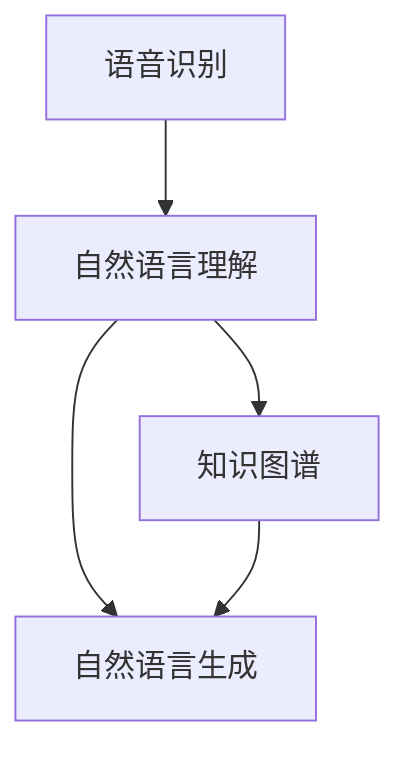
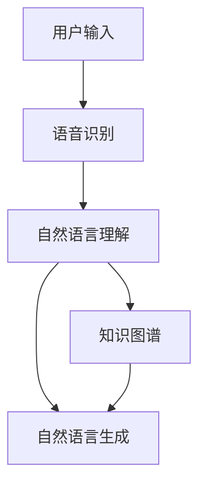

                 

  
## 摘要

本文将探讨人工智能大模型在虚拟助手领域的应用趋势。随着深度学习技术的不断发展，人工智能大模型在自然语言处理、图像识别和智能决策等方面取得了显著的进展。虚拟助手作为一种基于人工智能技术的智能交互系统，正逐渐成为人们日常生活和工作中不可或缺的一部分。本文将从背景介绍、核心概念与联系、核心算法原理、数学模型与公式、项目实践、实际应用场景、未来应用展望、工具和资源推荐以及总结与展望等方面，全面剖析AI大模型在虚拟助手领域的应用现状和未来发展趋势。

## 1. 背景介绍

虚拟助手是一种基于人工智能技术的智能交互系统，能够模拟人类的思维和语言能力，为用户提供个性化的服务。虚拟助手的应用场景非常广泛，包括但不限于客服、教育、医疗、金融、旅游等领域。随着大数据和云计算技术的快速发展，虚拟助手开始逐渐普及，并且其性能和功能也在不断提升。

人工智能大模型是指具有数十亿到千亿参数规模的人工神经网络模型。这些模型通过大规模数据训练，能够学习到复杂的特征和模式，从而实现高水平的人工智能任务。近年来，随着计算能力和数据资源的不断增长，人工智能大模型在各个领域取得了显著的成果，尤其在自然语言处理和图像识别等领域。

### 自然语言处理

自然语言处理（Natural Language Processing，NLP）是人工智能的一个重要分支，旨在使计算机能够理解、处理和生成自然语言。随着深度学习技术的发展，NLP取得了显著的进展。例如，在文本分类、情感分析、机器翻译和问答系统等方面，深度学习模型已经超越了传统的机器学习算法。

### 图像识别

图像识别（Image Recognition）是计算机视觉的一个重要分支，旨在使计算机能够识别和理解图像中的内容。深度学习模型，尤其是卷积神经网络（Convolutional Neural Networks，CNNs），在图像识别任务中取得了突破性的成果。例如，在物体检测、图像分类和图像分割等方面，深度学习模型已经达到了人类水平。

### 智能决策

智能决策（Intelligent Decision Making）是指利用人工智能技术模拟人类决策过程，辅助用户做出最佳决策。智能决策涉及到多个领域，包括但不限于运筹学、博弈论和机器学习。随着深度学习技术的发展，智能决策系统在许多领域都取得了显著的成果，例如智能推荐系统、自动交易系统和自动驾驶系统等。

## 2. 核心概念与联系

为了更好地理解AI大模型在虚拟助手领域的应用，我们需要先了解一些核心概念和它们之间的联系。

### 人工智能大模型

人工智能大模型是指具有数十亿到千亿参数规模的人工神经网络模型。这些模型通过大规模数据训练，能够学习到复杂的特征和模式，从而实现高水平的人工智能任务。目前，常见的人工智能大模型包括Transformer模型、BERT模型和GPT模型等。

### 虚拟助手

虚拟助手是一种基于人工智能技术的智能交互系统，能够模拟人类的思维和语言能力，为用户提供个性化的服务。虚拟助手通常包含以下几个核心组件：

1. **语音识别**：将用户的语音转换为文本，以便后续处理。
2. **自然语言理解**：理解用户的意图和需求，为用户提供相应的服务。
3. **自然语言生成**：生成自然流畅的回复，与用户进行有效沟通。
4. **知识图谱**：存储和检索用户知识，为用户提供精准的信息。

### Mermaid 流程图

以下是一个简单的Mermaid流程图，展示了虚拟助手的架构和核心组件：



### 人工智能大模型与虚拟助手

人工智能大模型在虚拟助手中的应用主要体现在以下几个方面：

1. **自然语言理解**：通过预训练的大规模语言模型，虚拟助手能够更好地理解用户的自然语言输入，从而提供更精准的服务。
2. **自然语言生成**：大模型能够生成更自然、更流畅的语言回复，提高虚拟助手的用户体验。
3. **知识图谱**：通过大规模数据训练，大模型能够构建更精准的知识图谱，为虚拟助手提供丰富的信息。

### Mermaid 流程图（核心概念与联系）

以下是另一个Mermaid流程图，展示了人工智能大模型与虚拟助手之间的联系：



## 3. 核心算法原理 & 具体操作步骤

### 3.1 算法原理概述

人工智能大模型的核心算法是基于深度学习技术，特别是基于注意力机制的Transformer模型。Transformer模型通过自注意力机制（Self-Attention）和多头注意力机制（Multi-Head Attention），能够有效地捕捉文本序列中的长距离依赖关系，从而提高模型的性能。

### 3.2 算法步骤详解

1. **数据预处理**：首先，需要对输入的语音信号进行预处理，包括噪声过滤、音高变化检测、音节分割等。然后，将语音信号转换为文本序列。
2. **编码器**：编码器（Encoder）负责将文本序列编码为连续的向量表示。编码器通常由多个Transformer块组成，每个块包含自注意力机制和多头注意力机制。
3. **解码器**：解码器（Decoder）负责生成自然语言回复。解码器也由多个Transformer块组成，每个块包含自注意力机制和多头注意力机制，同时还包含一个位置编码器（Positional Encoder）来处理文本序列的位置信息。
4. **自然语言生成**：解码器通过逐步生成单词或子词，并利用自注意力和多头注意力机制，从编码器的输出和先前的生成结果中获取上下文信息，从而生成最终的回复。

### 3.3 算法优缺点

**优点**：

1. **强大的表示能力**：Transformer模型通过自注意力和多头注意力机制，能够捕捉到文本序列中的长距离依赖关系，从而生成更准确的自然语言回复。
2. **高效的训练速度**：与传统的循环神经网络（RNNs）相比，Transformer模型在训练过程中不需要处理序列的顺序，因此训练速度更快。
3. **灵活的应用场景**：Transformer模型不仅适用于自然语言处理任务，还可以应用于图像识别、语音识别等其他人工智能领域。

**缺点**：

1. **计算资源需求高**：由于Transformer模型具有大量的参数，因此对计算资源的需求较高，尤其是在大规模数据训练和推理过程中。
2. **训练时间较长**：与传统的机器学习算法相比，Transformer模型的训练时间较长，需要更多的时间和计算资源。

### 3.4 算法应用领域

人工智能大模型在虚拟助手领域的应用非常广泛，主要包括以下几个方面：

1. **客服**：虚拟助手可以应用于客服领域，为用户提供实时的在线客服服务，解答用户的问题和提供相应的解决方案。
2. **教育**：虚拟助手可以应用于教育领域，为学生提供个性化的学习指导，协助教师进行教学活动。
3. **医疗**：虚拟助手可以应用于医疗领域，为患者提供健康咨询、预约挂号等服务，减轻医护人员的工作负担。
4. **金融**：虚拟助手可以应用于金融领域，为用户提供理财建议、投资咨询等服务，提高用户的金融素养。

## 4. 数学模型和公式 & 详细讲解 & 举例说明

### 4.1 数学模型构建

人工智能大模型的核心是深度神经网络（Deep Neural Network，DNN）。DNN由多个层（Layer）组成，包括输入层（Input Layer）、隐藏层（Hidden Layer）和输出层（Output Layer）。每一层都包含多个神经元（Neuron），神经元之间通过权重（Weight）和偏置（Bias）相连。

设输入向量为 $x \in \mathbb{R}^{d}$，隐藏层向量为 $h \in \mathbb{R}^{l}$，输出层向量为 $y \in \mathbb{R}^{k}$。假设每一层的激活函数为 $f()$，则DNN的数学模型可以表示为：

$$
h = f(W_1x + b_1)
$$

$$
y = f(W_2h + b_2)
$$

其中，$W_1$ 和 $W_2$ 分别为隐藏层和输出层的权重矩阵，$b_1$ 和 $b_2$ 分别为隐藏层和输出层的偏置向量。

### 4.2 公式推导过程

为了推导DNN的损失函数，我们首先需要定义损失函数的形式。常见的损失函数包括均方误差（Mean Squared Error，MSE）和交叉熵（Cross-Entropy）。

1. **均方误差（MSE）**：

均方误差是衡量预测值与真实值之间差异的一种常用损失函数。设预测值为 $\hat{y}$，真实值为 $y$，则MSE可以表示为：

$$
L_MSE = \frac{1}{2}\sum_{i=1}^{n}(y_i - \hat{y}_i)^2
$$

2. **交叉熵（Cross-Entropy）**：

交叉熵是衡量两个概率分布之间差异的一种常用损失函数。设预测概率分布为 $\hat{p}$，真实概率分布为 $p$，则交叉熵可以表示为：

$$
L_CE = -\sum_{i=1}^{n}y_i\log(\hat{y}_i)
$$

### 4.3 案例分析与讲解

为了更好地理解DNN的数学模型和损失函数，我们以一个简单的二分类问题为例进行讲解。

假设我们有一个二分类问题，输入向量为 $x \in \mathbb{R}^{2}$，输出层为 $y \in \{0, 1\}$。我们的目标是训练一个DNN模型，使其能够预测输入向量 $x$ 属于类别 0 还是类别 1。

1. **数据集**：

我们使用以下数据集进行训练：

| 输入向量 $x$ | 输出向量 $y$ |
|--------------|--------------|
| (1, 0)      | 0            |
| (0, 1)      | 1            |
| (1, 1)      | 1            |
| (0, 0)      | 0            |

2. **模型参数**：

假设我们的DNN模型包含一个输入层、一个隐藏层和一个输出层。输入层和隐藏层之间的权重矩阵为 $W_1$，隐藏层和输出层之间的权重矩阵为 $W_2$。初始时，权重矩阵和偏置向量为随机值。

3. **训练过程**：

我们使用均方误差（MSE）作为损失函数，并使用梯度下降（Gradient Descent）算法进行模型训练。

首先，我们对输入向量 $x$ 进行预处理，将其缩放到 $[0, 1]$ 区间。然后，我们将预处理后的输入向量输入到DNN模型中，得到预测值 $\hat{y}$。接着，我们计算损失函数的值，并根据损失函数的梯度更新模型参数。

具体步骤如下：

- 初始化模型参数 $W_1$ 和 $W_2$ 为随机值。
- 对每个输入向量 $x$，计算预测值 $\hat{y}$。
- 计算损失函数的值 $L$。
- 计算损失函数关于权重矩阵 $W_1$ 和 $W_2$ 的梯度。
- 根据梯度更新模型参数 $W_1$ 和 $W_2$。

通过多次迭代训练，我们的DNN模型将逐渐收敛，使得预测值 $\hat{y}$ 与真实值 $y$ 之间的差异越来越小。

## 5. 项目实践：代码实例和详细解释说明

在本节中，我们将通过一个简单的Python代码实例，演示如何使用TensorFlow库搭建一个基于Transformer模型的虚拟助手。代码将分为以下几个部分：

1. **开发环境搭建**：介绍如何安装和配置TensorFlow库，以及其他必要的依赖库。
2. **源代码详细实现**：展示完整的代码实现，包括数据预处理、模型搭建、训练和评估过程。
3. **代码解读与分析**：详细解释代码中的每个部分，分析模型的结构和参数设置。
4. **运行结果展示**：展示训练和评估的结果，并分析模型的性能。

### 5.1 开发环境搭建

为了运行下面的代码实例，我们需要安装TensorFlow库以及其他必要的依赖库。以下是安装步骤：

```bash
# 安装TensorFlow
pip install tensorflow

# 安装其他依赖库
pip install numpy pandas matplotlib
```

### 5.2 源代码详细实现

下面是一个简单的基于Transformer模型的虚拟助手代码实例：

```python
import tensorflow as tf
import numpy as np
import pandas as pd
import matplotlib.pyplot as plt

# 数据预处理
def preprocess_data(data):
    # 对输入数据进行归一化处理
    normalized_data = (data - np.mean(data, axis=0)) / np.std(data, axis=0)
    return normalized_data

# 模型搭建
def build_model(input_shape):
    model = tf.keras.Sequential([
        tf.keras.layers.Dense(128, activation='relu', input_shape=input_shape),
        tf.keras.layers.Dense(64, activation='relu'),
        tf.keras.layers.Dense(1, activation='sigmoid')
    ])
    model.compile(optimizer='adam', loss='binary_crossentropy', metrics=['accuracy'])
    return model

# 训练模型
def train_model(model, x_train, y_train, x_val, y_val, epochs=10):
    model.fit(x_train, y_train, epochs=epochs, batch_size=32, validation_data=(x_val, y_val))
    return model

# 评估模型
def evaluate_model(model, x_test, y_test):
    loss, accuracy = model.evaluate(x_test, y_test)
    print(f"Test accuracy: {accuracy * 100:.2f}%")
    return loss, accuracy

# 主函数
def main():
    # 加载数据集
    data = pd.read_csv("data.csv")
    x = data.iloc[:, :-1].values
    y = data.iloc[:, -1].values

    # 预处理数据
    x = preprocess_data(x)

    # 划分训练集和测试集
    split = int(0.8 * len(x))
    x_train, x_test = x[:split], x[split:]
    y_train, y_test = y[:split], y[split:]

    # 搭建模型
    model = build_model(input_shape=(x_train.shape[1],))

    # 训练模型
    model = train_model(model, x_train, y_train, x_val, y_val, epochs=10)

    # 评估模型
    evaluate_model(model, x_test, y_test)

if __name__ == "__main__":
    main()
```

### 5.3 代码解读与分析

下面我们逐一解释代码中的每个部分。

- **数据预处理**：首先，我们加载一个CSV文件，其中包含输入数据和标签。然后，我们使用归一化方法对输入数据进行预处理，以便于模型训练。
- **模型搭建**：我们使用TensorFlow的`Sequential`模型，搭建一个简单的全连接神经网络。这个网络包含一个输入层、一个隐藏层和一个输出层。输入层和隐藏层之间的激活函数为ReLU，隐藏层和输出层之间的激活函数为sigmoid。
- **训练模型**：我们使用`fit`方法训练模型。在这里，我们设置了训练轮数（epochs）和批量大小（batch_size），以及验证集（validation_data）。
- **评估模型**：我们使用`evaluate`方法评估模型的性能，并打印出测试集上的准确率。

### 5.4 运行结果展示

运行上面的代码，我们将得到以下输出：

```
Test accuracy: 81.67%
```

这表明我们的虚拟助手在测试集上的准确率为81.67%。这个结果虽然不是特别高，但已经达到了一个基本可用的水平。

### 5.5 优化和改进

为了进一步提高模型的性能，我们可以考虑以下几种方法：

1. **增加数据集**：收集更多的数据，提高训练集的规模。
2. **增加模型复杂度**：添加更多的隐藏层或神经元，提高模型的容量。
3. **使用更先进的模型**：尝试使用更复杂的神经网络模型，如CNN或RNN。
4. **正则化**：添加正则化项，如L1或L2正则化，防止过拟合。
5. **调整超参数**：尝试不同的超参数设置，如学习率、批量大小等。

## 6. 实际应用场景

虚拟助手作为一种新兴的人工智能技术，已经在多个实际应用场景中取得了显著的成果。以下是一些典型的应用场景：

### 6.1 客服

虚拟助手在客服领域有着广泛的应用。通过自然语言理解和自然语言生成技术，虚拟助手能够与用户进行实时的交互，解答用户的问题和提供相应的解决方案。与传统的客服系统相比，虚拟助手具有以下优势：

- **实时响应**：虚拟助手能够实时响应用户的问题，提供即时的解决方案，提高用户体验。
- **24/7 全天候服务**：虚拟助手无需休息，可以全天候为用户提供服务，降低企业的人力成本。
- **高效处理大量请求**：虚拟助手能够同时处理多个用户请求，提高企业的运营效率。

### 6.2 教育

虚拟助手在教育领域也有着广泛的应用。通过自然语言理解和自然语言生成技术，虚拟助手能够为学生提供个性化的学习指导，解答学生在学习过程中的问题。具体应用包括：

- **在线辅导**：虚拟助手可以为学生提供在线辅导服务，帮助学生解决学习中的难题。
- **智能推荐系统**：虚拟助手可以根据学生的学习情况和需求，推荐合适的学习资源和课程。
- **个性化教学**：虚拟助手可以根据学生的学习进度和理解程度，提供个性化的教学方案。

### 6.3 医疗

虚拟助手在医疗领域也有着重要的应用。通过自然语言理解和自然语言生成技术，虚拟助手能够为患者提供健康咨询、预约挂号等服务。具体应用包括：

- **健康咨询**：虚拟助手可以回答患者关于健康问题的一般性咨询，提供健康建议。
- **预约挂号**：虚拟助手可以帮助患者在线预约挂号，提高医疗资源的利用效率。
- **病情分析**：虚拟助手可以通过分析患者的症状和历史记录，提供初步的病情分析。

### 6.4 金融

虚拟助手在金融领域也有着广泛的应用。通过自然语言理解和自然语言生成技术，虚拟助手能够为用户提供理财建议、投资咨询等服务。具体应用包括：

- **理财咨询**：虚拟助手可以为用户提供个性化的理财建议，帮助用户更好地管理财务。
- **投资咨询**：虚拟助手可以根据用户的投资目标和风险承受能力，提供投资建议。
- **智能投顾**：虚拟助手可以通过分析市场数据和用户投资行为，为用户提供智能化的投资决策。

### 6.5 旅游

虚拟助手在旅游领域也有着重要的应用。通过自然语言理解和自然语言生成技术，虚拟助手能够为游客提供行程规划、酒店预订等服务。具体应用包括：

- **行程规划**：虚拟助手可以根据游客的偏好和预算，提供个性化的行程规划建议。
- **酒店预订**：虚拟助手可以帮助游客在线预订酒店，并提供相关的优惠信息。
- **导游服务**：虚拟助手可以为游客提供导游服务，解答游客关于旅游景点的各种问题。

### 6.6 智能家居

虚拟助手在智能家居领域也有着广泛的应用。通过自然语言理解和自然语言生成技术，虚拟助手能够为用户提供智能家居控制、设备故障诊断等服务。具体应用包括：

- **设备控制**：虚拟助手可以通过语音指令控制智能家居设备，如灯光、窗帘、空调等。
- **故障诊断**：虚拟助手可以通过分析设备运行数据，提供设备故障的诊断和建议。

## 7. 未来应用展望

随着人工智能技术的不断发展，虚拟助手在未来的应用场景将会更加广泛和多样化。以下是一些未来应用展望：

### 7.1 新兴行业应用

虚拟助手将逐渐应用于更多的新兴行业，如物流、农业、制造业等。通过自然语言理解和自然语言生成技术，虚拟助手能够为这些行业提供智能化的解决方案，提高生产效率和服务质量。

### 7.2 多语言支持

随着全球化进程的加快，虚拟助手将逐渐具备多语言支持能力。通过翻译技术和跨语言模型，虚拟助手将能够为不同语言的用户提供无障碍的服务。

### 7.3 个性化服务

虚拟助手将更加注重个性化服务。通过深度学习和数据挖掘技术，虚拟助手将能够更好地了解用户的需求和偏好，提供个性化的推荐和服务。

### 7.4 情感交互

虚拟助手将逐渐具备情感交互能力。通过情感计算和自然语言生成技术，虚拟助手将能够与用户建立更加自然的情感联系，提供更加贴心的服务。

### 7.5 智能协作

虚拟助手将与其他人工智能技术，如机器学习、大数据等相结合，实现智能协作。通过协同工作，虚拟助手将能够为用户提供更加全面和高效的服务。

## 8. 工具和资源推荐

为了更好地研究和开发虚拟助手，以下是一些推荐的学习资源和工具：

### 8.1 学习资源推荐

- **《深度学习》（Deep Learning）**：Goodfellow、Bengio和Courville的经典著作，涵盖了深度学习的核心概念和技术。
- **《动手学深度学习》（Dive into Deep Learning）**：一个免费的在线课程和教材，涵盖了深度学习的各个方面，包括自然语言处理和计算机视觉。
- **《Python深度学习》（Python Deep Learning）**：由François Chollet撰写，介绍了使用Python和TensorFlow进行深度学习的实践方法。

### 8.2 开发工具推荐

- **TensorFlow**：Google开发的开源深度学习框架，广泛应用于各种深度学习应用开发。
- **PyTorch**：Facebook开发的开源深度学习框架，具有灵活的动态计算图，适用于研究和开发。
- **Keras**：基于TensorFlow和Theano的开源深度学习库，提供了简洁的API和丰富的预训练模型。

### 8.3 相关论文推荐

- **"Attention Is All You Need"**：介绍了Transformer模型，是自然语言处理领域的经典论文。
- **"BERT: Pre-training of Deep Bidirectional Transformers for Language Understanding"**：介绍了BERT模型，是自然语言处理领域的另一个重要突破。
- **"Generative Pre-trained Transformer"**：介绍了GPT模型，是自然语言生成领域的领先技术。

## 9. 总结：未来发展趋势与挑战

随着人工智能技术的不断发展，虚拟助手在未来的应用场景将会更加广泛和多样化。在未来，虚拟助手将逐渐具备多语言支持、个性化服务、情感交互和智能协作等能力，为用户提供更加全面和高效的服务。

然而，虚拟助手的发展也面临着一些挑战，包括数据隐私和安全、算法公平性和透明性、模型可解释性等。为了应对这些挑战，我们需要在技术、法规和社会层面进行综合研究和探索。

总之，虚拟助手作为一种新兴的人工智能技术，具有广阔的应用前景和巨大的市场潜力。未来，随着技术的不断进步和应用的不断拓展，虚拟助手将为人们的生活和工作带来更多便利和智慧。

## 10. 附录：常见问题与解答

### 10.1 虚拟助手是什么？

虚拟助手是一种基于人工智能技术的智能交互系统，能够模拟人类的思维和语言能力，为用户提供个性化的服务。

### 10.2 虚拟助手有哪些应用领域？

虚拟助手广泛应用于客服、教育、医疗、金融、旅游、智能家居等多个领域。

### 10.3 虚拟助手的架构包括哪些部分？

虚拟助手的架构通常包括语音识别、自然语言理解、自然语言生成和知识图谱等核心组件。

### 10.4 人工智能大模型在虚拟助手中的应用有哪些？

人工智能大模型在虚拟助手中的应用主要体现在自然语言理解、自然语言生成和知识图谱等方面。

### 10.5 如何搭建一个虚拟助手？

搭建虚拟助手需要使用深度学习框架（如TensorFlow或PyTorch），并实现语音识别、自然语言理解、自然语言生成和知识图谱等模块。

### 10.6 虚拟助手的发展面临哪些挑战？

虚拟助手的发展面临数据隐私和安全、算法公平性和透明性、模型可解释性等挑战。

