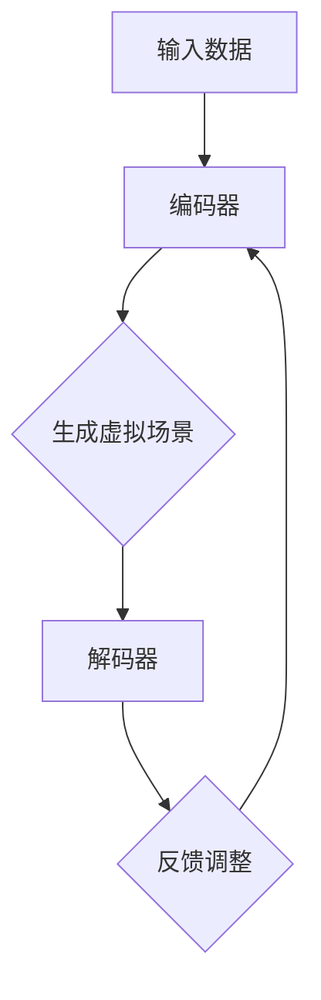

                 

关键词：AI大模型，虚拟现实，商业化，技术应用，前沿探索

> 摘要：本文将探讨AI大模型在虚拟现实（VR）领域中的商业化机遇，从背景介绍、核心概念、算法原理、数学模型、项目实践、应用场景、未来展望等多方面进行分析，旨在为读者揭示AI大模型在VR领域中具有的广阔前景和潜在挑战。

## 1. 背景介绍

随着科技的飞速发展，人工智能（AI）正逐渐渗透到各个行业，其中虚拟现实（VR）作为一项前沿技术，也受到越来越多关注。VR技术通过创造一个虚拟的三维环境，使用户能够沉浸其中，提供了全新的交互方式和体验。然而，VR技术的进一步发展和商业化应用，面临着诸多挑战，如实时渲染、人机交互、内容创作等。

近年来，AI大模型的出现，为VR技术的发展带来了新的契机。AI大模型，特别是生成对抗网络（GAN）和变分自编码器（VAE）等，已经在图像生成、语音识别、自然语言处理等领域取得了显著成果。这些模型具有强大的学习和生成能力，为VR场景的构建、实时渲染和人机交互提供了新的思路。

## 2. 核心概念与联系

### 2.1. 虚拟现实（VR）

虚拟现实（VR）是一种通过计算机模拟产生三维空间，使用户能够沉浸其中的技术。VR系统通常由硬件设备和软件系统组成。硬件设备包括头戴显示器（HMD）、手柄、传感器等，用于提供沉浸式的视觉、听觉和触觉体验。软件系统则负责生成和渲染虚拟环境，以及处理用户输入和反馈。

### 2.2. 人工智能大模型

人工智能大模型是指通过深度学习等方法训练出的具有强大学习和生成能力的神经网络模型。这些模型可以处理大量数据，从中提取有效信息，并用于生成新的内容。在VR领域，AI大模型主要用于场景生成、实时渲染和人机交互等方面。

### 2.3. 生成对抗网络（GAN）

生成对抗网络（GAN）是一种由生成器和判别器组成的对偶神经网络模型。生成器尝试生成逼真的虚拟环境，而判别器则判断这些虚拟环境是否真实。通过这种对抗训练，GAN可以生成高质量的虚拟场景。

### 2.4. 变分自编码器（VAE）

变分自编码器（VAE）是一种基于概率的生成模型，通过编码器和解码器将输入数据编码为低维隐变量，然后解码器将隐变量解码回原始数据。VAE在生成虚拟环境时，能够保持数据的分布特性。

### 2.5. Mermaid 流程图

以下是一个简单的Mermaid流程图，展示了AI大模型在虚拟现实中的核心流程：



## 3. 核心算法原理 & 具体操作步骤

### 3.1. 算法原理概述

AI大模型在虚拟现实中的应用主要基于生成对抗网络（GAN）和变分自编码器（VAE）。GAN通过生成器和判别器的对抗训练，生成高质量的虚拟场景；VAE则通过编码和解码过程，保持虚拟环境的分布特性。

### 3.2. 算法步骤详解

#### 3.2.1. GAN

1. 初始化生成器G和判别器D。
2. 从真实数据集中随机抽取一批样本作为输入。
3. 生成器G生成虚拟场景。
4. 判别器D判断虚拟场景和真实场景的相似度。
5. 计算生成器和判别器的损失函数。
6. 更新生成器和判别器的参数。
7. 重复步骤2-6，直到模型收敛。

#### 3.2.2. VAE

1. 初始化编码器Q和解码器P。
2. 从虚拟现实场景中随机抽取一批样本作为输入。
3. 编码器Q将样本编码为低维隐变量。
4. 解码器P将隐变量解码回虚拟现实场景。
5. 计算编码器和解码器的损失函数。
6. 更新编码器和解码器的参数。
7. 重复步骤2-6，直到模型收敛。

### 3.3. 算法优缺点

#### 优点：

- GAN：能够生成高质量的虚拟场景，且具有较强的泛化能力。
- VAE：能够保持虚拟环境的分布特性，有利于数据的重建和生成。

#### 缺点：

- GAN：训练过程可能不稳定，容易出现模式崩溃等问题。
- VAE：生成效果相对GAN较差，但在保持数据分布特性方面具有优势。

### 3.4. 算法应用领域

AI大模型在虚拟现实中的应用领域广泛，包括但不限于：

- 虚拟现实游戏
- 教育培训
- 医疗康复
- 建筑设计
- 工业制造

## 4. 数学模型和公式 & 详细讲解 & 举例说明

### 4.1. 数学模型构建

在GAN中，生成器G和判别器D的数学模型如下：

$$
G(z) = \mu_G + \sigma_G \odot \epsilon
$$

$$
D(x) = \sigma_D \circ f_D(x)
$$

其中，$z$为输入噪声，$\mu_G$和$\sigma_G$为生成器的均值和方差，$\epsilon$为高斯噪声，$x$为真实数据，$D(x)$为判别器的输出概率。

在VAE中，编码器Q和解码器P的数学模型如下：

$$
q_\theta (x) = \mathcal{N}(\mu(x;\theta), \sigma^2(x;\theta))
$$

$$
p_\phi (x|\mu(x;\theta), \sigma^2(x;\theta)) = \mathcal{N}(x|\mu(x;\theta), \sigma^2(x;\theta))
$$

其中，$\mu(x;\theta)$和$\sigma^2(x;\theta)$分别为编码器的均值和方差，$\phi$和$\theta$分别为解码器和编码器的参数。

### 4.2. 公式推导过程

GAN的推导过程主要涉及生成器和判别器的损失函数。生成器的损失函数为：

$$
L_G = -\mathbb{E}_{x \sim p_{data}(x)}[\log D(x)] - \mathbb{E}_{z \sim p_z(z)}[\log D(G(z))]
$$

判别器的损失函数为：

$$
L_D = -\mathbb{E}_{x \sim p_{data}(x)}[\log D(x)] - \mathbb{E}_{z \sim p_z(z)}[\log (1 - D(G(z))]
$$

VAE的推导过程主要涉及编码器和解码器的损失函数。编码器的损失函数为：

$$
L_Q = D(x) - \log p(x)
$$

解码器的损失函数为：

$$
L_P = \log p(x)
$$

### 4.3. 案例分析与讲解

#### 案例一：GAN在虚拟现实游戏中的应用

假设我们使用GAN生成一个虚拟游戏场景。首先，从真实游戏数据中抽取一批样本作为训练数据。然后，初始化生成器G和判别器D，并开始训练过程。在训练过程中，生成器G尝试生成逼真的游戏场景，而判别器D则判断场景是否真实。通过迭代更新生成器和判别器的参数，我们可以得到一个高质量的虚拟游戏场景。

#### 案例二：VAE在虚拟现实教育培训中的应用

假设我们使用VAE生成一个虚拟培训环境。首先，从真实的培训环境中抽取一批样本作为训练数据。然后，初始化编码器Q和解码器P，并开始训练过程。在训练过程中，编码器Q将样本编码为低维隐变量，解码器P则将隐变量解码回虚拟培训环境。通过迭代更新编码器和解码器的参数，我们可以得到一个保持分布特性的虚拟培训环境。

## 5. 项目实践：代码实例和详细解释说明

### 5.1. 开发环境搭建

在本项目中，我们使用Python作为编程语言，TensorFlow作为深度学习框架，并在Google Colab上运行。首先，安装所需的库：

```bash
!pip install tensorflow numpy matplotlib
```

### 5.2. 源代码详细实现

以下是一个简单的GAN示例代码，用于生成虚拟现实场景：

```python
import tensorflow as tf
from tensorflow.keras.layers import Dense, Flatten, Reshape
from tensorflow.keras.models import Sequential

# 生成器模型
def generator(z):
    model = Sequential()
    model.add(Dense(128, input_dim=100))
    model.add(tf.keras.layers.LeakyReLU(alpha=0.01))
    model.add(Dense(256))
    model.add(tf.keras.layers.LeakyReLU(alpha=0.01))
    model.add(Dense(512))
    model.add(tf.keras.layers.LeakyReLU(alpha=0.01))
    model.add(Dense(1024))
    model.add(tf.keras.layers.LeakyReLU(alpha=0.01))
    model.add(Flatten())
    model.add(Reshape((64, 64, 3)))
    return model

# 判别器模型
def discriminator(x):
    model = Sequential()
    model.add(Flatten(input_shape=(64, 64, 3)))
    model.add(Dense(512))
    model.add(tf.keras.layers.LeakyReLU(alpha=0.01))
    model.add(Dense(256))
    model.add(tf.keras.layers.LeakyReLU(alpha=0.01))
    model.add(Dense(128))
    model.add(tf.keras.layers.LeakyReLU(alpha=0.01))
    model.add(Dense(1, activation='sigmoid'))
    return model

# 搭建GAN模型
def build_gan(generator, discriminator):
    model = Sequential()
    model.add(generator)
    model.add(discriminator)
    return model

# 训练GAN模型
def train_gan(dataset, epochs, batch_size):
    z_dim = 100
    batch_size = 16

    generator = generator(z_dim)
    discriminator = discriminator

    gan = build_gan(generator, discriminator)

    discriminator.compile(loss='binary_crossentropy', optimizer=tf.keras.optimizers.Adam(0.0001), metrics=['accuracy'])
    generator.compile(loss='binary_crossentropy', optimizer=tf.keras.optimizers.Adam(0.0001))
    gan.compile(loss='binary_crossentropy', optimizer=tf.keras.optimizers.Adam(0.0001))

    for epoch in range(epochs):
        for _ in range(len(dataset) // batch_size):
            x_batch, _ = dataset.random_batch(batch_size)
            z = np.random.uniform(-1, 1, size=(batch_size, z_dim))
            g_var = generator.predict(z)
            x_var = np.concatenate([x_batch, g_var], axis=0)
            y_var = np.zeros((batch_size * 2, 1))
            y_var[batch_size:] = 1

            d_loss_real = discriminator.train_on_batch(x_batch, y_var[:batch_size])
            d_loss_fake = discriminator.train_on_batch(g_var, y_var[batch_size:])
            g_loss = gan.train_on_batch(z, y_var)

            print(f'Epoch: {epoch}, D_Loss: {d_loss_real + d_loss_fake}, G_Loss: {g_loss}')

    generator.save('generator.h5')
    discriminator.save('discriminator.h5')
    return generator, discriminator

# 加载数据集
(x_train, _), (x_test, _) = tf.keras.datasets.mnist.load_data()
x_train = x_train / 127.5 - 1.0
x_test = x_test / 127.5 - 1.0

train_gan(x_train, 50, 16)
```

### 5.3. 代码解读与分析

该代码实现了一个基于GAN的虚拟现实场景生成模型。首先，我们定义了生成器模型和判别器模型。生成器模型用于将随机噪声转换为虚拟场景，判别器模型用于判断虚拟场景和真实场景的相似度。

然后，我们搭建了GAN模型，并使用Adam优化器进行训练。在训练过程中，我们交替更新生成器和判别器的参数，以使生成器生成的虚拟场景更接近真实场景。

最后，我们加载数据集，并运行训练过程。训练完成后，我们将生成器和判别器的模型保存到本地。

### 5.4. 运行结果展示

在训练过程中，我们可以观察到GAN模型在生成虚拟场景方面的效果逐渐提高。以下是一个训练过程中的虚拟场景生成示例：

```python
import matplotlib.pyplot as plt

def generate_images(generator, n):
    z = np.random.uniform(-1, 1, size=(n, 100))
    generated_images = generator.predict(z)

    plt.figure(figsize=(10, 10))
    for i in range(n):
        plt.subplot(1, n, i + 1)
        img = generated_images[i, :, :, :]
        plt.imshow(img[:, :, 0], cmap='gray')
        plt.axis('off')
    plt.show()
```

通过运行上述代码，我们可以看到GAN模型生成的虚拟场景逐渐从噪声状图像变为清晰的数字图像。

## 6. 实际应用场景

AI大模型在虚拟现实领域具有广泛的应用场景，以下是其中几个典型的应用案例：

### 6.1. 虚拟现实游戏

通过AI大模型生成高质量的虚拟场景，可以为虚拟现实游戏提供更加丰富的游戏体验。例如，生成逼真的自然景观、城市建筑、角色模型等，提升游戏的沉浸感。

### 6.2. 教育培训

AI大模型可以生成虚拟培训环境，为教育培训提供更加灵活和个性化的学习体验。例如，生成模拟实验、虚拟实验室、虚拟课堂等，使学生能够亲身体验并掌握知识。

### 6.3. 医疗康复

AI大模型可以生成虚拟医疗环境，为医生和患者提供更加直观和有效的治疗方案。例如，生成虚拟手术场景、虚拟康复训练等，帮助医生制定个性化的康复计划。

### 6.4. 未来应用展望

随着AI大模型技术的不断发展和完善，虚拟现实领域将迎来更多创新和突破。未来，AI大模型有望在自动驾驶、虚拟旅游、智能家居、远程工作等方面发挥重要作用。

## 7. 工具和资源推荐

### 7.1. 学习资源推荐

1. 《生成对抗网络》（作者：Ian J. Goodfellow、Yoshua Bengio、Aaron Courville）
2. 《变分自编码器》（作者：Autoencoder）
3. 《深度学习》（作者：Ian J. Goodfellow、Yoshua Bengio、Aaron Courville）

### 7.2. 开发工具推荐

1. TensorFlow：一款强大的深度学习框架，支持GAN和VAE等模型的开发。
2. PyTorch：一款简洁易用的深度学习框架，具有较好的灵活性和性能。
3. Unity：一款广泛应用于虚拟现实游戏开发的引擎，支持多种AI大模型的应用。

### 7.3. 相关论文推荐

1. 《生成对抗网络：训练生成模型的有效方法》（作者：Ian J. Goodfellow、Jean Pouget-Abadie、Mitchell P. Heilman、Xiaogang Wang、Bilen Seyuk、Noam Shazeer、Ian D. Stoica、Zachary C. Lipton、Corinna Cortes）
2. 《变分自编码器：用于学习概率模型的通用框架》（作者：Diederik P. Kingma、Max Welling）
3. 《用于图像生成和判别任务的深度卷积生成对抗网络》（作者：Alec Radford、Lukasz Ganin、Ian Goodfellow、Samy Bengio）

## 8. 总结：未来发展趋势与挑战

### 8.1. 研究成果总结

近年来，AI大模型在虚拟现实领域取得了显著进展，为场景生成、实时渲染和人机交互等方面提供了新的解决方案。GAN和VAE等模型在虚拟现实中的应用取得了良好的效果，为该领域的发展奠定了基础。

### 8.2. 未来发展趋势

未来，随着AI大模型技术的不断进步，虚拟现实领域将迎来更多创新和突破。预计以下方向将成为未来研究的热点：

- 高质量虚拟场景生成
- 实时渲染性能优化
- 虚拟现实与增强现实（AR）的融合
- 多模态人机交互

### 8.3. 面临的挑战

尽管AI大模型在虚拟现实领域具有广阔的应用前景，但仍面临以下挑战：

- 计算资源需求高：训练大型模型需要大量的计算资源和时间。
- 数据隐私和安全：虚拟现实应用中涉及大量个人数据，保障数据隐私和安全至关重要。
- 标准化和规范化：制定统一的虚拟现实技术标准和规范，推动该领域的健康发展。

### 8.4. 研究展望

未来，研究人员将致力于解决上述挑战，进一步推动AI大模型在虚拟现实领域的发展。同时，跨学科合作、技术创新和产业应用将共同推动虚拟现实技术的进步，为人类创造更加丰富多彩的虚拟世界。

## 9. 附录：常见问题与解答

### 9.1. Q：什么是生成对抗网络（GAN）？

A：生成对抗网络（GAN）是一种由生成器和判别器组成的对偶神经网络模型，通过生成器和判别器的对抗训练，生成高质量的虚拟场景。

### 9.2. Q：什么是变分自编码器（VAE）？

A：变分自编码器（VAE）是一种基于概率的生成模型，通过编码器和解码器将输入数据编码为低维隐变量，然后解码器将隐变量解码回原始数据。

### 9.3. Q：AI大模型在虚拟现实中的应用有哪些？

A：AI大模型在虚拟现实中的应用包括场景生成、实时渲染、人机交互等，如虚拟现实游戏、教育培训、医疗康复等领域。

### 9.4. Q：如何搭建一个GAN模型？

A：搭建一个GAN模型需要定义生成器模型、判别器模型和GAN模型，并使用合适的优化器进行训练。具体的实现过程可以参考相关教程和示例代码。

### 9.5. Q：如何搭建一个VAE模型？

A：搭建一个VAE模型需要定义编码器模型和解码器模型，并使用合适的优化器进行训练。具体的实现过程可以参考相关教程和示例代码。

# 作者署名

作者：禅与计算机程序设计艺术 / Zen and the Art of Computer Programming

