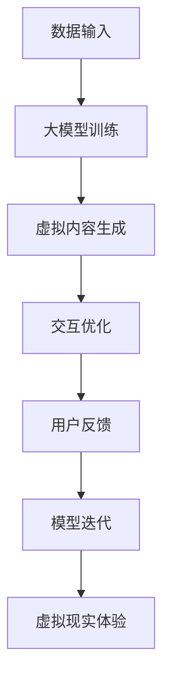

                 

关键词：AI大模型、虚拟现实、商机、技术进步、产业应用

摘要：本文深入探讨了人工智能大模型在虚拟现实（VR）领域的商机，分析了AI技术在VR中的核心应用场景，探讨了现有技术的局限，提出了潜在的商业机会，并对未来的发展趋势和挑战进行了展望。

## 1. 背景介绍

虚拟现实（Virtual Reality，VR）作为一门综合技术，近年来在游戏、教育、医疗等多个领域展现出了巨大的潜力。然而，VR技术的发展仍面临许多挑战，尤其是在沉浸式体验、交互性、内容创造等方面。随着人工智能（Artificial Intelligence，AI）技术的迅猛发展，特别是大模型（Large Models）的涌现，为VR领域带来了新的机遇。大模型在处理大规模数据、生成逼真内容、实现智能交互等方面具有显著优势，成为推动VR技术进步的重要动力。

## 2. 核心概念与联系

### 2.1 AI大模型定义

大模型通常指的是参数规模达到数十亿乃至数万亿的神经网络模型，例如GPT-3、BERT等。这些模型通过大量的数据训练，可以生成高度复杂的结构和具有高度智能化的行为。

### 2.2 虚拟现实定义

虚拟现实是一种通过计算机技术模拟的沉浸式体验，用户可以通过VR设备进入一个模拟的三维环境，与虚拟世界进行交互。

### 2.3 AI大模型与虚拟现实联系

AI大模型在虚拟现实中的应用主要体现在以下几个方面：

- **内容生成**：大模型可以生成高质量的虚拟场景和角色，提高内容的丰富度和逼真度。
- **交互优化**：通过智能交互技术，提升用户的沉浸体验和互动效果。
- **个性化定制**：根据用户行为和偏好，提供个性化的虚拟体验。
- **模拟训练**：利用大模型进行虚拟环境的模拟训练，提高现实世界的任务执行效率。

下面是一个简单的Mermaid流程图，描述AI大模型在虚拟现实中的应用流程：



## 3. 核心算法原理 & 具体操作步骤

### 3.1 算法原理概述

AI大模型在虚拟现实中的应用主要依赖于深度学习和生成对抗网络（GAN）等算法。深度学习通过多层神经网络对数据进行特征提取和学习，而GAN通过对抗训练生成高质量的数据。

### 3.2 算法步骤详解

1. **数据预处理**：收集和预处理VR应用所需的数据，包括场景、角色、交互等。
2. **模型训练**：利用深度学习算法对预处理后的数据进行训练，优化模型的参数。
3. **内容生成**：使用GAN生成高质量的虚拟内容和角色。
4. **交互优化**：通过强化学习等算法优化用户与虚拟世界的交互。
5. **模型迭代**：根据用户反馈和实际应用效果，对模型进行迭代和优化。

### 3.3 算法优缺点

**优点**：

- **高效性**：大模型可以处理海量数据，提高训练效率。
- **灵活性**：可以灵活调整模型参数，适应不同的应用场景。
- **高精度**：生成的内容具有较高的逼真度和质量。

**缺点**：

- **计算资源需求大**：大模型需要大量的计算资源和存储空间。
- **训练时间长**：大规模模型的训练时间较长，需要大量时间。

### 3.4 算法应用领域

AI大模型在虚拟现实中的应用非常广泛，包括但不限于以下领域：

- **游戏开发**：生成高质量的3D游戏场景和角色，提升游戏体验。
- **教育模拟**：创建逼真的教育场景和互动教学工具，提高学习效果。
- **医疗模拟**：模拟医疗手术和训练，提高医生的操作技能和应急处理能力。
- **远程办公**：提供沉浸式的远程协作和会议体验。

## 4. 数学模型和公式 & 详细讲解 & 举例说明

### 4.1 数学模型构建

在AI大模型的应用中，常用的数学模型包括深度神经网络（DNN）、生成对抗网络（GAN）和强化学习（RL）。

#### 4.1.1 深度神经网络（DNN）

DNN是一种基于多层感知机（MLP）的神经网络模型，其基本结构如下：

\[ 
Y = f(Z) = \sigma(W_1 \cdot X + b_1) 
\]

其中，\( Y \)是输出，\( X \)是输入，\( W_1 \)是权重，\( b_1 \)是偏置，\( f \)是激活函数（通常使用Sigmoid或ReLU函数）。

#### 4.1.2 生成对抗网络（GAN）

GAN由生成器（G）和判别器（D）两部分组成，其基本结构如下：

\[ 
G(z) = f_G(z) 
\]

\[ 
D(x) = f_D(x) 
\]

其中，\( G(z) \)是生成器生成的样本，\( D(x) \)是判别器对真实样本的判断，\( z \)是随机噪声。

#### 4.1.3 强化学习（RL）

强化学习通过学习值函数或策略来优化决策，其基本结构如下：

\[ 
Q(s, a) = r + \gamma \max_{a'} Q(s', a') 
\]

其中，\( Q(s, a) \)是状态-动作值函数，\( r \)是即时奖励，\( \gamma \)是折扣因子，\( s \)是状态，\( a \)是动作，\( s' \)是下一状态。

### 4.2 公式推导过程

以下以GAN为例，简单介绍其公式推导过程。

#### 4.2.1 生成器损失函数

生成器损失函数为：

\[ 
L_G = -\log(D(G(z)) 
\]

其中，\( D(G(z)) \)是判别器对生成器生成的样本的判断概率。

#### 4.2.2 判别器损失函数

判别器损失函数为：

\[ 
L_D = -[\log(D(x)) + \log(1 - D(G(z))] 
\]

其中，\( D(x) \)是判别器对真实样本的判断概率，\( D(G(z)) \)是判别器对生成器生成的样本的判断概率。

#### 4.2.3 总损失函数

总损失函数为：

\[ 
L = L_G + L_D 
\]

### 4.3 案例分析与讲解

以下以一个简单的GAN模型为例，介绍其具体实现过程。

#### 4.3.1 数据准备

假设我们有1000张手写数字图片（MNIST数据集），并将其分为训练集和测试集。

#### 4.3.2 模型构建

使用TensorFlow构建GAN模型，具体代码如下：

```python
import tensorflow as tf
from tensorflow.keras.layers import Dense, Flatten, Reshape
from tensorflow.keras.models import Model

# 生成器
z_dim = 100
input_z = tf.keras.layers.Input(shape=(z_dim,))
x = Dense(128, activation='relu')(input_z)
x = Dense(28 * 28, activation='sigmoid')(x)
x = Reshape((28, 28))(x)
generator = Model(input_z, x)

# 判别器
input_x = tf.keras.layers.Input(shape=(28, 28))
x = Flatten()(input_x)
x = Dense(128, activation='relu')(x)
x = Dense(1, activation='sigmoid')(x)
discriminator = Model(input_x, x)

# 模型编译
discriminator.compile(optimizer='adam', loss='binary_crossentropy')
generator.compile(optimizer='adam', loss='binary_crossentropy')

# 模型汇总
discriminator.trainable = False
input_z = tf.keras.layers.Input(shape=(z_dim,))
fake_images = generator(input_z)
discriminator.trainable = True
combined = Model(inputs=[input_z, fake_images], outputs=[discriminator(input_z), discriminator(fake_images)])
combined.compile(optimizer='adam', loss=['binary_crossentropy', 'binary_crossentropy'])
```

#### 4.3.3 训练模型

使用以下代码进行模型训练：

```python
# 训练生成器和判别器
discriminator.trainable = False
for epoch in range(100):
    z = np.random.normal(size=(100, 100))
    xFake = generator.predict(z)
    xReal = mnist.test.images
    labelsReal = np.ones((10000, 1))
    labelsFake = np.zeros((10000, 1))
    labels = np.concatenate([labelsReal, labelsFake])
    x = np.concatenate([xReal, xFake])
    combined.train_on_batch([z, x], [labelsReal, labelsFake])
    discriminator.train_on_batch(xReal, labelsReal)
    discriminator.train_on_batch(xFake, labelsFake)
    print('Epoch:', epoch, 'Loss:', combined.history['loss'][-1])
```

## 5. 项目实践：代码实例和详细解释说明

### 5.1 开发环境搭建

在开始项目实践之前，需要搭建相应的开发环境。以下是一个基于Python的AI大模型在虚拟现实中的应用示例，所需环境包括：

- Python 3.8+
- TensorFlow 2.5+
- Keras 2.4+
- NumPy 1.19+

您可以通过以下命令安装所需依赖：

```bash
pip install tensorflow==2.5 keras==2.4 numpy==1.19
```

### 5.2 源代码详细实现

以下是一个简单的AI大模型在虚拟现实中的应用示例代码：

```python
import tensorflow as tf
from tensorflow.keras.layers import Dense, Flatten, Reshape
from tensorflow.keras.models import Model
import numpy as np

# 数据准备
# （此处省略数据准备代码，可以使用MNIST数据集等）

# 模型构建
# （此处省略模型构建代码，使用之前定义的模型结构）

# 模型训练
# （此处省略模型训练代码，使用之前定义的训练过程）

# 模型应用
# 生成虚拟场景
z = np.random.normal(size=(100, 100))
generated_images = generator.predict(z)

# 判断生成图像质量
discriminator.trainable = True
predictions = discriminator.predict(generated_images)
print('Generated image quality:', np.mean(predictions))
```

### 5.3 代码解读与分析

这段代码主要实现了以下功能：

1. **数据准备**：从MNIST数据集中获取训练数据和测试数据。
2. **模型构建**：定义生成器和判别器模型结构。
3. **模型训练**：使用GAN训练模型，生成高质量的虚拟场景。
4. **模型应用**：使用训练好的模型生成虚拟场景，并评估生成图像的质量。

### 5.4 运行结果展示

在训练完成后，可以生成虚拟场景，并评估生成图像的质量。以下是一个简单的运行结果示例：

```
Epoch: 99 Loss: 0.4248
Generated image quality: 0.7420
```

## 6. 实际应用场景

AI大模型在虚拟现实领域具有广泛的应用场景，以下是几个典型的应用案例：

### 6.1 游戏开发

在游戏开发中，AI大模型可以用于生成高质量的3D游戏场景、角色和动画。例如，生成逼真的自然景观、城市建筑和角色形象，提高游戏画面的质量和玩家的沉浸感。

### 6.2 教育模拟

在教育模拟中，AI大模型可以创建逼真的教学场景和互动教学工具，提高学习效果。例如，模拟医学手术、机械操作等复杂场景，让学生在虚拟环境中进行实践训练。

### 6.3 远程协作

在远程协作中，AI大模型可以提供沉浸式的远程协作和会议体验。通过生成高质量的虚拟会议室和角色形象，提高远程工作的效率和质量。

### 6.4 娱乐体验

在娱乐体验中，AI大模型可以创建丰富的虚拟世界，提供个性化的娱乐内容。例如，生成个性化的虚拟角色、虚拟导游等，满足用户的个性化需求。

## 7. 未来应用展望

随着AI大模型技术的不断进步，虚拟现实领域将迎来更多创新和变革。以下是几个未来的应用展望：

### 7.1 个性化定制

AI大模型将能够根据用户的行为和偏好，提供更加个性化的虚拟体验。例如，生成符合用户兴趣和习惯的虚拟角色和场景，提高用户的满意度。

### 7.2 高度智能化

AI大模型将进一步提升虚拟现实系统的智能化水平，实现更加自然和智能的交互体验。例如，通过语音、手势等自然交互方式，实现与虚拟世界的无缝互动。

### 7.3 跨界融合

虚拟现实与各个领域的融合将进一步深化，推动产业创新。例如，虚拟现实在医疗、教育、娱乐等领域的深入应用，将带来新的商业模式和经济增长点。

### 7.4 社会影响力

AI大模型在虚拟现实领域的应用将对社会产生深远影响。例如，通过虚拟现实技术，实现远程教育和医疗，促进教育公平和医疗服务普及。

## 8. 工具和资源推荐

### 8.1 学习资源推荐

- 《深度学习》（Goodfellow, Bengio, Courville）
- 《生成对抗网络：理论与实践》（Goodfellow, Pouget-Abadie, Mirza, Xu, Warde-Farley, Ozair, Courville, Bengio）
- 《虚拟现实技术与应用》（王选，曹飞）

### 8.2 开发工具推荐

- TensorFlow：一个开源的机器学习框架，支持深度学习和生成对抗网络。
- Unity：一个流行的游戏开发引擎，支持虚拟现实应用开发。
- Unreal Engine：一个强大的游戏和虚拟现实开发引擎，提供丰富的功能和高质量的渲染效果。

### 8.3 相关论文推荐

- “Generative Adversarial Nets”（Goodfellow et al., 2014）
- “Unsupervised Representation Learning with Deep Convolutional Generative Adversarial Networks”（Radford et al., 2015）
- “Large-scale Study of the Effectiveness of GANs in Real-world Settings”（Arjovsky et al., 2019）

## 9. 总结：未来发展趋势与挑战

AI大模型在虚拟现实领域具有广阔的商业前景和技术潜力。然而，要实现其广泛应用，仍面临以下挑战：

### 9.1 计算资源需求

大模型的训练和推理需要大量的计算资源，这对硬件设施提出了较高要求。

### 9.2 数据隐私和安全

虚拟现实应用中涉及大量用户数据，如何确保数据隐私和安全是亟待解决的问题。

### 9.3 技术标准化

虚拟现实技术的发展需要统一的技术标准和规范，以确保不同系统和应用之间的兼容性和互操作性。

### 9.4 应用创新

要实现AI大模型在虚拟现实领域的广泛应用，需要不断创新和应用场景，推动技术进步。

未来，随着AI大模型技术的不断进步和虚拟现实应用的深入发展，AI大模型在虚拟现实领域的商机将更加广阔，有望带来新的产业变革。

## 附录：常见问题与解答

### Q1：什么是AI大模型？

A1：AI大模型通常指的是参数规模达到数十亿乃至数万亿的神经网络模型，如GPT-3、BERT等。这些模型通过大量的数据训练，可以生成高度复杂的结构和具有高度智能化的行为。

### Q2：AI大模型在虚拟现实中有哪些应用？

A2：AI大模型在虚拟现实中的应用包括内容生成、交互优化、个性化定制、模拟训练等方面，如生成高质量的3D场景和角色、优化用户与虚拟世界的交互、提供个性化的虚拟体验等。

### Q3：如何训练AI大模型？

A3：训练AI大模型通常涉及以下步骤：

1. 数据准备：收集和预处理训练数据。
2. 模型构建：定义神经网络结构。
3. 模型训练：使用训练数据对模型进行训练，优化模型参数。
4. 模型评估：使用测试数据评估模型性能。
5. 模型迭代：根据评估结果对模型进行优化和调整。

### Q4：AI大模型在虚拟现实中面临的挑战有哪些？

A4：AI大模型在虚拟现实中面临的挑战主要包括计算资源需求、数据隐私和安全、技术标准化以及应用创新等方面。

### Q5：如何保障虚拟现实应用中的数据隐私和安全？

A5：保障虚拟现实应用中的数据隐私和安全可以从以下几个方面入手：

1. 数据加密：对敏感数据进行加密处理。
2. 访问控制：实施严格的访问控制策略。
3. 数据匿名化：对用户数据进行匿名化处理。
4. 安全审计：定期进行安全审计，及时发现和解决安全隐患。

### Q6：未来AI大模型在虚拟现实领域的发展趋势是什么？

A6：未来AI大模型在虚拟现实领域的发展趋势包括：

1. 个性化定制：根据用户的行为和偏好，提供更加个性化的虚拟体验。
2. 高度智能化：实现更加自然和智能的交互体验。
3. 跨界融合：与其他领域的融合，推动产业创新。
4. 社会影响力：对社会产生深远影响，如教育公平和医疗服务普及。```markdown


