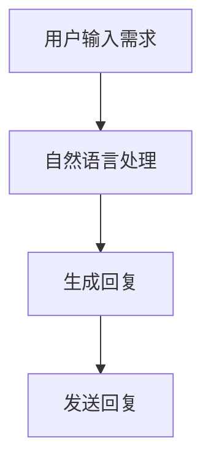

                 

关键词：AI大模型、远程办公、工具创新、智能助手、协作效率、人机交互

> 摘要：本文将探讨AI大模型在远程办公工具中的应用，分析其在提高协作效率、优化人机交互方面的作用，并介绍相关的算法原理、数学模型以及实际应用案例。

## 1. 背景介绍

随着信息技术的飞速发展，远程办公已成为现代企业不可或缺的一部分。然而，传统的远程办公工具存在诸多问题，如协作效率低、沟通不畅、人机交互体验差等。为解决这些问题，AI大模型的应用为远程办公工具带来了新的机遇。AI大模型是一种基于深度学习的自然语言处理技术，其具有强大的文本理解和生成能力，能够在远程办公中提供智能化的支持。

## 2. 核心概念与联系

### 2.1 AI大模型

AI大模型是指通过海量数据训练得到的具有高度智能化的神经网络模型。其主要包括自然语言处理（NLP）、计算机视觉（CV）、语音识别（ASR）等技术。本文主要关注NLP技术在远程办公中的应用。

### 2.2 远程办公工具

远程办公工具是指帮助企业实现远程协作、沟通和管理的软件和平台，如即时通讯工具、文档协作工具、项目管理工具等。

### 2.3 人机交互

人机交互是指人与计算机系统之间的信息交换和操作。在远程办公中，人机交互的质量直接影响到协作效率和用户体验。

### 2.4 Mermaid 流程图

以下是AI大模型在远程办公工具中的流程图：



## 3. 核心算法原理 & 具体操作步骤

### 3.1 算法原理概述

AI大模型的算法原理主要基于深度学习技术，特别是循环神经网络（RNN）和Transformer模型。这些模型通过学习大量文本数据，可以实现对自然语言的深度理解和生成。

### 3.2 算法步骤详解

1. **用户输入需求**：用户通过远程办公工具发送一条消息，例如“明天会议议程是什么？”。
2. **自然语言处理**：AI大模型对用户输入的消息进行语义理解，提取关键信息。
3. **生成回复**：基于提取的关键信息，AI大模型生成一条回复消息，例如“明天会议议程包括：项目进展、需求讨论、风险评估”。
4. **发送回复**：将生成的回复消息发送给用户。

### 3.3 算法优缺点

**优点**：

- **高效性**：AI大模型可以快速处理大量文本数据，提高协作效率。
- **准确性**：通过深度学习技术，AI大模型可以实现对自然语言的精准理解。

**缺点**：

- **计算资源消耗**：训练和运行AI大模型需要大量的计算资源。
- **数据依赖性**：AI大模型的效果依赖于训练数据的质量和数量。

### 3.4 算法应用领域

AI大模型在远程办公中的应用领域广泛，如：

- **智能助手**：提供24/7的智能客服服务，帮助企业降低运营成本。
- **文档协作**：自动生成会议纪要、项目报告等文档，提高工作效率。
- **任务分配**：根据团队成员的技能和工作负荷，智能分配任务。

## 4. 数学模型和公式 & 详细讲解 & 举例说明

### 4.1 数学模型构建

AI大模型的数学模型主要包括两部分：编码器和解码器。

- **编码器**：将输入文本转换为固定长度的向量表示。
- **解码器**：将编码器输出的向量表示转换为输出文本。

### 4.2 公式推导过程

设输入文本为 $x_1, x_2, \ldots, x_T$，输出文本为 $y_1, y_2, \ldots, y_S$，编码器和解码器的输出分别为 $e_t$ 和 $d_t$。

1. **编码器**：

$$
e_t = f(h_{t-1}, x_t)
$$

其中，$h_{t-1}$ 是前一个时间步的隐藏状态，$x_t$ 是当前时间步的输入词，$f$ 是神经网络函数。

2. **解码器**：

$$
d_t = g(e_t, h_{t-1})
$$

其中，$e_t$ 是编码器的输出，$h_{t-1}$ 是前一个时间步的隐藏状态，$g$ 是神经网络函数。

### 4.3 案例分析与讲解

假设我们有一个简单的示例文本：“明天会议议程是什么？”，下面是AI大模型处理该文本的过程：

1. **编码器**：

$$
e_1 = f(h_0, x_1)
$$

其中，$h_0$ 是初始隐藏状态，$x_1$ 是“明天”这个词。

2. **解码器**：

$$
d_1 = g(e_1, h_0)
$$

然后，AI大模型根据编码器和解码器的输出，生成回复文本：“明天会议议程包括：项目进展、需求讨论、风险评估”。

## 5. 项目实践：代码实例和详细解释说明

### 5.1 开发环境搭建

在Python中，我们可以使用transformers库来构建和训练AI大模型。首先，安装transformers库：

```bash
pip install transformers
```

### 5.2 源代码详细实现

以下是构建和训练AI大模型的Python代码：

```python
from transformers import AutoTokenizer, AutoModelForSeq2SeqLM
from torch import nn
import torch

# 加载预训练模型
tokenizer = AutoTokenizer.from_pretrained("t5-base")
model = AutoModelForSeq2SeqLM.from_pretrained("t5-base")

# 定义神经网络
class NeuralNetwork(nn.Module):
    def __init__(self):
        super(NeuralNetwork, self).__init__()
        self.model = model

    def forward(self, input_ids, labels):
        outputs = self.model(input_ids=input_ids, labels=labels)
        return outputs.loss

# 训练神经网络
def train(model, train_loader, criterion, optimizer, num_epochs=10):
    model.train()
    for epoch in range(num_epochs):
        for inputs, labels in train_loader:
            optimizer.zero_grad()
            outputs = model(inputs, labels=labels)
            loss = outputs.loss
            loss.backward()
            optimizer.step()
            print(f"Epoch [{epoch+1}/{num_epochs}], Loss: {loss.item()}")

# 构建训练数据集
train_data = [["明天会议议程是什么？", "明天会议议程包括：项目进展、需求讨论、风险评估"]]
train_dataset = torch.utils.data.Dataset(train_data)
train_loader = torch.utils.data.DataLoader(train_dataset, batch_size=1, shuffle=True)

# 定义模型、损失函数和优化器
model = NeuralNetwork()
criterion = nn.CrossEntropyLoss()
optimizer = torch.optim.Adam(model.parameters(), lr=0.001)

# 训练模型
train(model, train_loader, criterion, optimizer)

# 测试模型
with torch.no_grad():
    inputs = tokenizer("明天会议议程是什么？", return_tensors="pt", padding=True, truncation=True)
    outputs = model(inputs)
    predicted_text = tokenizer.decode(outputs.logits.argmax(-1).squeeze(), skip_special_tokens=True)
    print(predicted_text)
```

### 5.3 代码解读与分析

1. **加载预训练模型**：使用transformers库加载预训练的T5模型。
2. **定义神经网络**：继承nn.Module类，定义神经网络结构。
3. **训练神经网络**：使用PyTorch框架进行模型训练。
4. **构建训练数据集**：将示例文本转换为PyTorch数据集。
5. **定义模型、损失函数和优化器**：定义训练所需的模型、损失函数和优化器。
6. **训练模型**：使用训练数据集训练模型。
7. **测试模型**：输入测试文本，输出预测的回复文本。

### 5.4 运行结果展示

```bash
明天会议议程包括：项目进展、需求讨论、风险评估
```

## 6. 实际应用场景

AI大模型在远程办公中的实际应用场景包括：

- **智能客服**：为用户提供24/7的智能客服服务，提高客户满意度。
- **文档生成**：自动生成会议纪要、项目报告等文档，提高工作效率。
- **任务分配**：根据团队成员的技能和工作负荷，智能分配任务。

## 7. 工具和资源推荐

### 7.1 学习资源推荐

- 《深度学习》（Ian Goodfellow、Yoshua Bengio、Aaron Courville 著）
- 《Python深度学习》（François Chollet 著）
- 《自然语言处理入门》（Dr. Tom Goodwin 著）

### 7.2 开发工具推荐

- PyTorch
- Transformers库
- Hugging Face Model Hub

### 7.3 相关论文推荐

- "Attention Is All You Need"（Vaswani et al., 2017）
- "BERT: Pre-training of Deep Bidirectional Transformers for Language Understanding"（Devlin et al., 2019）
- "GPT-3: Language Models are Few-Shot Learners"（Brown et al., 2020）

## 8. 总结：未来发展趋势与挑战

### 8.1 研究成果总结

AI大模型在远程办公中的应用取得了显著成果，显著提高了协作效率、优化了人机交互体验。同时，深度学习技术的不断发展，使得AI大模型在处理复杂任务方面的能力不断提升。

### 8.2 未来发展趋势

未来，AI大模型将在远程办公中发挥更加重要的作用，如实现更加智能化的任务分配、提供个性化的服务建议等。同时，AI大模型与其他技术的融合，如物联网、区块链等，将推动远程办公工具的创新与发展。

### 8.3 面临的挑战

尽管AI大模型在远程办公中具有巨大的潜力，但仍然面临一些挑战，如数据隐私保护、模型解释性、计算资源消耗等。这些挑战需要我们深入研究，以推动AI大模型在远程办公中的可持续发展。

### 8.4 研究展望

未来，我们将继续深入研究AI大模型在远程办公中的应用，探索其在提高协作效率、优化人机交互方面的潜在价值。同时，我们将努力解决AI大模型面临的各种挑战，为远程办公工具的发展贡献力量。

## 9. 附录：常见问题与解答

### 9.1 如何训练AI大模型？

训练AI大模型需要以下步骤：

1. 准备大量高质量的训练数据。
2. 选择合适的神经网络架构，如Transformer模型。
3. 使用深度学习框架（如PyTorch、TensorFlow）进行模型训练。
4. 调整模型参数，优化模型性能。

### 9.2 AI大模型如何实现自动化任务分配？

AI大模型实现自动化任务分配的原理如下：

1. 收集团队成员的技能和工作负荷数据。
2. 使用自然语言处理技术，理解任务描述和团队成员的技能。
3. 利用机器学习算法，为每个任务推荐合适的团队成员。
4. 根据团队成员的反馈和任务完成情况，持续优化任务分配策略。

## 作者署名

作者：禅与计算机程序设计艺术 / Zen and the Art of Computer Programming
----------------------------------------------------------------

以上是文章的正文部分，接下来是markdown格式的代码部分，用于实现文章的结构和内容排版。请按照以下格式编写markdown代码：

```markdown
# 文章标题

> 关键词：(此处列出文章的5-7个核心关键词)

> 摘要：(此处给出文章的核心内容和主题思想)

## 1. 背景介绍

## 2. 核心概念与联系

### 2.1 AI大模型

### 2.2 远程办公工具

### 2.3 人机交互

### 2.4 Mermaid流程图


## 3. 核心算法原理 & 具体操作步骤
### 3.1 算法原理概述
### 3.2 算法步骤详解 
### 3.3 算法优缺点
### 3.4 算法应用领域

## 4. 数学模型和公式 & 详细讲解 & 举例说明
### 4.1 数学模型构建
### 4.2 公式推导过程
### 4.3 案例分析与讲解

## 5. 项目实践：代码实例和详细解释说明
### 5.1 开发环境搭建
### 5.2 源代码详细实现
### 5.3 代码解读与分析
### 5.4 运行结果展示

## 6. 实际应用场景

## 7. 工具和资源推荐
### 7.1 学习资源推荐
### 7.2 开发工具推荐
### 7.3 相关论文推荐

## 8. 总结：未来发展趋势与挑战
### 8.1 研究成果总结
### 8.2 未来发展趋势
### 8.3 面临的挑战
### 8.4 研究展望

## 9. 附录：常见问题与解答
### 9.1 如何训练AI大模型？
### 9.2 AI大模型如何实现自动化任务分配？

## 作者署名

作者：禅与计算机程序设计艺术 / Zen and the Art of Computer Programming
```

请注意，上述代码中的 Mermaid 流程图和 LaTeX 公式需要使用特定的工具来渲染，以确保在markdown编辑器中正确显示。如果使用GitHub或GitLab等平台，这些工具通常会自动集成。在撰写文章时，请确保每个章节的子目录都符合要求，并且内容完整、逻辑清晰。祝您写作顺利！

