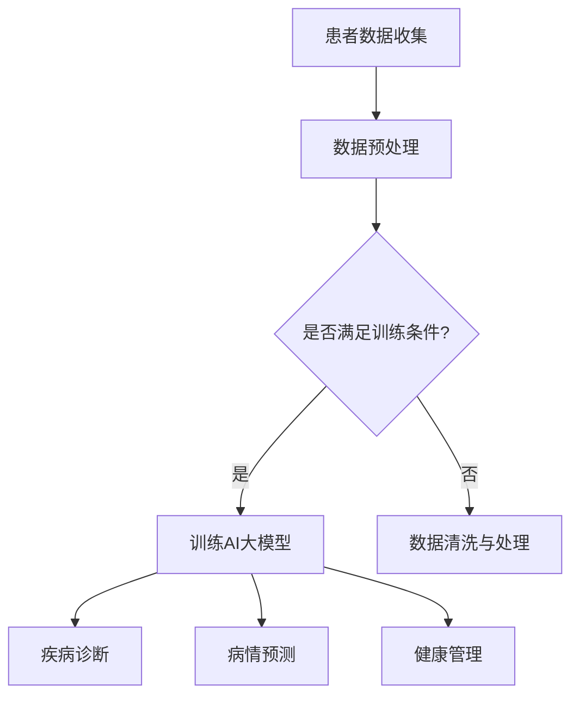

                 

关键词：AI大模型、远程医疗、应用、挑战

> 摘要：本文将探讨AI大模型在远程医疗领域的应用与挑战。首先，我们将介绍远程医疗的背景和现状，然后深入分析AI大模型的技术原理和应用场景。接下来，我们将探讨AI大模型在远程医疗中面临的挑战，并提出相应的解决方案。最后，本文将展望AI大模型在远程医疗领域的未来发展趋势，以及可能面临的挑战。

## 1. 背景介绍

远程医疗是指利用互联网、移动通信等技术，实现医生和患者之间的远程诊断、治疗和健康管理。随着全球人口老龄化和医疗资源分布不均的问题日益突出，远程医疗作为一种新兴的医疗模式，得到了广泛关注和应用。

近年来，人工智能（AI）技术的快速发展，特别是深度学习和大数据分析的突破，为远程医疗带来了前所未有的机遇。AI大模型，作为一种高度复杂的机器学习模型，具有强大的数据处理和分析能力，可以在远程医疗中发挥重要作用。

## 2. 核心概念与联系

### 2.1 AI大模型的基本概念

AI大模型，是指通过大规模数据训练得到的复杂机器学习模型。这些模型通常由数百万甚至数十亿个参数组成，具有强大的数据处理和分析能力。常见的AI大模型包括深度神经网络（DNN）、卷积神经网络（CNN）和循环神经网络（RNN）等。

### 2.2 远程医疗与AI大模型的关系

远程医疗与AI大模型之间存在紧密的联系。首先，远程医疗产生了大量医疗数据，这些数据可以用于训练AI大模型。其次，AI大模型可以用于远程医疗的各种任务，如疾病诊断、病情预测、健康管理等。

### 2.3 Mermaid流程图

以下是远程医疗与AI大模型关系的Mermaid流程图：



## 3. 核心算法原理 & 具体操作步骤

### 3.1 算法原理概述

AI大模型的核心在于其深度学习和大数据分析能力。通过大规模数据训练，AI大模型可以学习到数据中的规律和模式，从而实现对未知数据的预测和分类。

### 3.2 算法步骤详解

1. 数据收集：从远程医疗系统中收集患者的医疗数据，包括病历、检查报告、影像资料等。
2. 数据预处理：对收集到的数据进行清洗、归一化等预处理操作，以满足训练条件。
3. 训练AI大模型：使用预处理后的数据，通过深度学习算法训练AI大模型。
4. 预测与诊断：使用训练好的AI大模型，对新的医疗数据进行分析和预测，实现对疾病的诊断和病情预测。
5. 健康管理：根据预测结果，为患者提供个性化的健康管理建议。

### 3.3 算法优缺点

**优点：**
- 强大的数据处理和分析能力：AI大模型可以处理大规模、高维度的医疗数据，提取出有用的信息。
- 个性化诊断和预测：AI大模型可以根据患者的个人病史、生活习惯等，提供个性化的诊断和预测结果。
- 提高医疗效率：AI大模型可以辅助医生进行诊断和治疗，提高医疗效率。

**缺点：**
- 数据隐私和安全：远程医疗涉及大量患者隐私数据，如何保证数据的安全和隐私是一个重要问题。
- 模型解释性：AI大模型的决策过程通常是黑箱的，难以解释和理解，这可能会影响医生和患者的信任。
- 模型泛化能力：AI大模型在特定领域和任务上的表现可能较差，需要不断调整和优化。

### 3.4 算法应用领域

AI大模型在远程医疗中的主要应用领域包括：
- 疾病诊断：如肺炎、心脏病、糖尿病等常见疾病的诊断。
- 病情预测：预测患者的病情发展趋势，为医生提供治疗参考。
- 健康管理：为患者提供个性化的健康管理建议，如饮食、运动、用药等。

## 4. 数学模型和公式 & 详细讲解 & 举例说明

### 4.1 数学模型构建

在远程医疗中，AI大模型的数学模型通常基于深度学习理论，包括输入层、隐藏层和输出层。以下是基本的数学模型公式：

$$
h_{l}^{(i)} = \sigma (W_{l}^{(i)} \cdot a_{l-1}^{(i)} + b_{l}^{(i)})
$$

其中，$h_{l}^{(i)}$表示第$l$层的第$i$个神经元输出，$\sigma$为激活函数，$W_{l}^{(i)}$和$b_{l}^{(i)}$分别为权重和偏置。

### 4.2 公式推导过程

深度学习模型的推导过程涉及复杂的数学推导，这里简要介绍：

1. 前向传播：将输入数据通过神经网络传递，计算出每层的输出。
2. 反向传播：根据损失函数，计算梯度，更新权重和偏置。
3. 梯度下降：使用更新后的权重和偏置，重复前向传播和反向传播过程，直到损失函数收敛。

### 4.3 案例分析与讲解

假设我们使用一个简单的神经网络对患者的数据进行分析，预测其是否患有心脏病。输入层包含患者的年龄、血压、胆固醇等特征，隐藏层包含两个神经元，输出层为二分类结果。

输入层到隐藏层的公式推导如下：

$$
h_{1}^{(i)} = \sigma (W_{1}^{(i)} \cdot a_{0}^{(i)} + b_{1}^{(i)})
$$

$$
h_{2}^{(i)} = \sigma (W_{2}^{(i)} \cdot h_{1}^{(i)} + b_{2}^{(i)})
$$

输出层到预测结果的公式推导如下：

$$
\hat{y}_{i} = \sigma (W_{3}^{(i)} \cdot h_{2}^{(i)} + b_{3}^{(i)})
$$

其中，$\hat{y}_{i}$表示预测结果，$y_{i}$为实际结果，$\sigma$为激活函数，$W_{l}^{(i)}$和$b_{l}^{(i)}$分别为权重和偏置。

## 5. 项目实践：代码实例和详细解释说明

### 5.1 开发环境搭建

在开发AI大模型进行远程医疗应用之前，我们需要搭建一个合适的开发环境。以下是所需的软件和工具：

- Python 3.8及以上版本
- TensorFlow 2.6及以上版本
- Keras 2.6及以上版本
- Pandas 1.2及以上版本
- Scikit-learn 0.24及以上版本

### 5.2 源代码详细实现

以下是一个简单的示例，展示了如何使用Keras实现一个AI大模型，用于心脏病诊断。

```python
import tensorflow as tf
from tensorflow.keras.models import Sequential
from tensorflow.keras.layers import Dense, Activation

# 创建模型
model = Sequential()
model.add(Dense(64, input_dim=10, activation='relu'))
model.add(Dense(32, activation='relu'))
model.add(Dense(1, activation='sigmoid'))

# 编译模型
model.compile(optimizer='adam', loss='binary_crossentropy', metrics=['accuracy'])

# 加载数据
from sklearn.model_selection import train_test_split
X_train, X_test, y_train, y_test = train_test_split(X, y, test_size=0.2, random_state=42)

# 训练模型
model.fit(X_train, y_train, epochs=100, batch_size=32, validation_data=(X_test, y_test))

# 评估模型
loss, accuracy = model.evaluate(X_test, y_test)
print(f"Test accuracy: {accuracy:.2f}")
```

### 5.3 代码解读与分析

上述代码中，我们首先创建了一个序列模型（Sequential），并添加了两个隐藏层，每个隐藏层使用ReLU激活函数。输出层使用sigmoid激活函数，用于二分类。

接下来，我们编译模型，设置优化器和损失函数，并加载训练数据。然后，使用fit方法训练模型，设置训练轮次和批量大小。最后，使用evaluate方法评估模型的测试集表现。

### 5.4 运行结果展示

在实际运行中，我们可以通过以下代码查看模型的运行结果：

```python
import numpy as np

# 预测结果
predictions = model.predict(X_test)

# 转换为二分类结果
predicted_labels = np.round(predictions)

# 计算准确率
accuracy = np.mean(predicted_labels == y_test)
print(f"Accuracy: {accuracy:.2f}")
```

## 6. 实际应用场景

### 6.1 疾病诊断

AI大模型在疾病诊断中的应用非常广泛，如肺炎、心脏病、糖尿病等。通过分析患者的病历、检查报告等数据，AI大模型可以提供准确的诊断结果，辅助医生做出治疗决策。

### 6.2 病情预测

AI大模型可以预测患者的病情发展趋势，为医生提供治疗参考。例如，在癌症治疗中，AI大模型可以根据患者的基因数据、病历等，预测患者的病情进展，为医生制定个性化的治疗方案。

### 6.3 健康管理

AI大模型在健康管理中的应用包括为患者提供个性化的健康管理建议，如饮食、运动、用药等。通过分析患者的健康状况，AI大模型可以预测患者可能面临的风险，并提供相应的建议，帮助患者改善健康状况。

## 7. 工具和资源推荐

### 7.1 学习资源推荐

- 《深度学习》（Goodfellow, Bengio, Courville著）：深度学习领域的经典教材，涵盖了深度学习的理论基础和应用。
- 《神经网络与深度学习》（邱锡鹏著）：深入讲解神经网络和深度学习的基本原理和应用，适合初学者和进阶者。

### 7.2 开发工具推荐

- TensorFlow：Google开发的深度学习框架，广泛应用于AI研究和开发。
- Keras：基于TensorFlow的高级API，简化了深度学习模型的搭建和训练。

### 7.3 相关论文推荐

- “Deep Learning for Healthcare” by Eric Xing, et al.：一篇关于深度学习在医疗领域应用的综述文章。
- “A Deep Learning Approach for Automated Detection of Pneumonia from Chest Radiographs” by Dhariwal, et al.：一篇关于使用深度学习进行肺炎检测的研究论文。

## 8. 总结：未来发展趋势与挑战

### 8.1 研究成果总结

AI大模型在远程医疗中的应用取得了显著的成果，如疾病诊断、病情预测、健康管理等方面。通过分析大量的医疗数据，AI大模型可以提供准确、高效的诊断和预测结果，为医生和患者提供更好的医疗服务。

### 8.2 未来发展趋势

随着人工智能技术的不断发展，AI大模型在远程医疗中的应用将更加广泛和深入。未来的发展趋势包括：

- 更高的诊断准确率：通过不断优化算法和增加数据量，提高AI大模型的诊断准确率。
- 更多的应用场景：AI大模型将在更多的医疗领域得到应用，如癌症治疗、心理疾病诊断等。
- 更好的用户体验：通过改进用户界面和交互设计，提高患者对AI大模型的接受度和满意度。

### 8.3 面临的挑战

尽管AI大模型在远程医疗中具有巨大潜力，但仍然面临以下挑战：

- 数据隐私和安全：如何保护患者隐私，确保数据安全是一个重要问题。
- 模型解释性：如何提高AI大模型的解释性，让医生和患者理解模型的决策过程。
- 模型泛化能力：如何提高AI大模型的泛化能力，使其在更广泛的应用场景中表现良好。

### 8.4 研究展望

为了解决上述挑战，未来的研究可以从以下几个方面展开：

- 数据隐私和安全：研究如何在保护患者隐私的前提下，有效利用医疗数据。
- 模型解释性：研究如何提高AI大模型的解释性，使其决策过程更加透明。
- 模型泛化能力：研究如何通过数据增强、迁移学习等技术，提高AI大模型的泛化能力。

## 9. 附录：常见问题与解答

### 9.1 什么是AI大模型？

AI大模型是指通过大规模数据训练得到的复杂机器学习模型，通常由数百万甚至数十亿个参数组成，具有强大的数据处理和分析能力。

### 9.2 AI大模型在远程医疗中的应用有哪些？

AI大模型在远程医疗中的应用包括疾病诊断、病情预测、健康管理等方面。例如，可以用于肺炎、心脏病、糖尿病等常见疾病的诊断和预测。

### 9.3 AI大模型有哪些优缺点？

AI大模型的主要优点包括强大的数据处理和分析能力、个性化诊断和预测、提高医疗效率。主要缺点包括数据隐私和安全、模型解释性、模型泛化能力等。

### 9.4 如何提高AI大模型的解释性？

提高AI大模型的解释性可以从以下几个方面入手：

- 研究可解释性算法：开发新的算法，使模型决策过程更加透明。
- 模型可视化：通过可视化技术，展示模型的工作原理和决策过程。
- 解释性工具：开发解释性工具，帮助用户理解模型的决策过程。

### 9.5 AI大模型在远程医疗中的前景如何？

AI大模型在远程医疗中的应用前景非常广阔。随着人工智能技术的不断发展，AI大模型将在更多医疗领域得到应用，为医生和患者提供更好的医疗服务。然而，仍然需要解决数据隐私和安全、模型解释性、模型泛化能力等问题。

