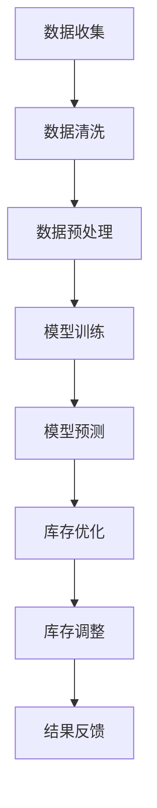

                 

关键词：人工智能、季节性商品、库存管理、电商、大模型、算法优化

> 摘要：本文探讨了如何利用人工智能大模型优化电商平台季节性商品的库存管理。通过分析季节性商品的特点，以及当前库存管理的现状和挑战，提出了一种基于人工智能的大模型优化方案，包括核心算法原理、数学模型构建、具体操作步骤、实际应用场景等多个方面。本文旨在为电商平台提供一种高效的库存管理策略，以应对季节性商品的波动和市场需求的变化。

## 1. 背景介绍

### 1.1 电商平台的季节性商品

季节性商品是指那些在特定季节或时间段内需求量明显增减的商品。在电商平台上，这些商品通常包括节日礼品、季节性服饰、时令水果等。这些商品往往具有以下特点：

- **需求波动大**：季节性商品的需求量在特定时间段内会出现剧烈波动，例如春节、圣诞节等节日前后。
- **时效性强**：季节性商品具有一定的时效性，错过特定时间后，商品价值会迅速下降。
- **库存管理难度高**：季节性商品库存管理面临较大挑战，如何准确预测需求、合理安排库存、避免缺货或积压是电商平台需要解决的问题。

### 1.2 季节性商品库存管理的现状和挑战

当前，电商平台在季节性商品库存管理方面主要面临以下挑战：

- **需求预测不准确**：传统的需求预测方法往往难以准确预测季节性商品的需求量，导致库存过剩或缺货。
- **库存调整不及时**：季节性商品需求变化快，电商平台往往难以及时调整库存，导致商品积压或断货。
- **人工管理成本高**：季节性商品库存管理需要大量人工参与，导致管理成本高、效率低。
- **风险应对能力不足**：面对季节性商品的市场波动，电商平台的风险应对能力较弱，容易造成经济损失。

## 2. 核心概念与联系

为了应对季节性商品库存管理的挑战，本文提出了一种基于人工智能的大模型优化方案。该方案的核心概念包括：

- **人工智能大模型**：通过收集大量历史数据，利用深度学习等技术构建大模型，用于预测季节性商品的需求量。
- **库存优化算法**：结合人工智能大模型预测结果，运用优化算法实现库存的自动调整。
- **多维度数据分析**：通过分析季节性商品的历史数据、市场趋势、用户行为等多维度数据，为库存优化提供更准确的依据。

以下是一个简化的 Mermaid 流程图，描述了核心概念之间的联系：



## 3. 核心算法原理 & 具体操作步骤

### 3.1 算法原理概述

本文采用了一种基于深度学习的时间序列预测算法，结合库存优化算法，实现对季节性商品库存的智能管理。核心算法原理如下：

1. **时间序列预测**：利用深度学习模型（如 LSTM、GRU 等）对季节性商品的需求量进行预测。通过学习历史数据，模型可以捕捉到季节性需求的周期性变化。
2. **库存优化**：根据预测结果，结合库存优化算法（如线性规划、动态规划等），制定合理的库存调整策略。该策略旨在最小化库存成本、最大化利润。
3. **库存调整**：根据优化结果，自动调整电商平台的库存。在需求高峰期，适当增加库存；在需求低谷期，适当减少库存。

### 3.2 算法步骤详解

1. **数据收集与清洗**：收集季节性商品的历史销售数据、市场趋势数据、用户行为数据等。对数据进行分析，筛选出有用的信息，去除无效数据。
2. **数据预处理**：对收集到的数据进行预处理，包括缺失值填充、异常值处理、数据归一化等。确保数据质量，为后续建模提供可靠的基础。
3. **模型训练**：利用预处理后的数据，训练深度学习模型。通过调整模型参数，优化预测效果。
4. **模型预测**：利用训练好的模型，对季节性商品的需求量进行预测。输出预测结果，包括需求量、预测时间等。
5. **库存优化**：根据模型预测结果，结合库存优化算法，制定库存调整策略。优化目标可以是最小化库存成本、最大化利润等。
6. **库存调整**：根据优化结果，自动调整电商平台库存。在实际操作中，可以采用分阶段调整、动态调整等方法，确保库存调整的灵活性和准确性。
7. **结果反馈**：对库存调整后的结果进行监测和评估。根据反馈信息，调整模型参数或优化策略，提高库存管理的效率和准确性。

### 3.3 算法优缺点

#### 优点：

- **高效性**：基于人工智能的大模型优化算法可以快速处理大量数据，提高库存预测和调整的效率。
- **准确性**：深度学习模型具有较强的学习能力，可以捕捉到季节性需求的周期性变化，提高预测准确性。
- **自动化**：库存优化算法可以实现库存调整的自动化，降低人工管理成本，提高管理效率。

#### 缺点：

- **计算资源消耗大**：深度学习模型的训练和预测需要大量的计算资源，对硬件设备要求较高。
- **数据依赖性强**：算法的预测效果依赖于数据质量，数据缺失或不准确会影响预测结果。
- **适应性**：对于需求波动较小或不具有明显季节性的商品，算法的预测效果可能较差。

### 3.4 算法应用领域

该算法可以应用于各类电商平台的季节性商品库存管理，包括：

- **节日礼品**：春节、中秋节、圣诞节等节日期间的礼品需求预测和库存调整。
- **季节性服饰**：春季、夏季、秋季、冬季的服装需求预测和库存调整。
- **时令水果**：季节性水果的需求预测和库存调整，如樱桃、草莓、西瓜等。

## 4. 数学模型和公式

### 4.1 数学模型构建

本文采用的数学模型主要包括时间序列预测模型和库存优化模型。

#### 时间序列预测模型：

时间序列预测模型可以表示为：

$$
y_t = f(x_t, W) + \epsilon_t
$$

其中，$y_t$ 表示第 $t$ 时刻的需求量，$x_t$ 表示与需求量相关的输入特征（如历史销售数据、市场趋势等），$W$ 表示模型参数，$f$ 表示预测函数，$\epsilon_t$ 表示预测误差。

#### 库存优化模型：

库存优化模型可以表示为：

$$
\min_{x} J(x) = \sum_{t=1}^{T} w_t \cdot (y_t - f(x_t, W))^2
$$

其中，$x$ 表示库存调整策略，$w_t$ 表示第 $t$ 时刻的权重，$J(x)$ 表示优化目标函数，$y_t$ 和 $f(x_t, W)$ 分别表示第 $t$ 时刻的实际需求量和预测需求量。

### 4.2 公式推导过程

#### 时间序列预测模型：

时间序列预测模型通常采用深度学习中的循环神经网络（RNN）或其变种（如 LSTM、GRU 等）进行建模。以下是 LSTM 模型的公式推导：

$$
\begin{align*}
i_t &= \sigma(W_i \cdot [h_{t-1}, x_t] + b_i) \\
f_t &= \sigma(W_f \cdot [h_{t-1}, x_t] + b_f) \\
o_t &= \sigma(W_o \cdot [h_{t-1}, x_t] + b_o) \\
c_t &= f_t \cdot c_{t-1} + i_t \cdot \text{sigmoid}(W_c \cdot [h_{t-1}, x_t] + b_c) \\
h_t &= o_t \cdot \text{sigmoid}(c_t)
\end{align*}
$$

其中，$i_t$、$f_t$、$o_t$ 分别表示输入门、遗忘门、输出门的状态，$c_t$、$h_t$ 分别表示细胞状态和隐藏状态，$\sigma$ 表示 sigmoid 函数，$W_i$、$W_f$、$W_o$、$W_c$ 分别表示权重矩阵，$b_i$、$b_f$、$b_o$、$b_c$ 分别表示偏置项。

#### 库存优化模型：

库存优化模型可以采用线性规划或动态规划等方法进行求解。以下是线性规划的公式推导：

$$
\begin{align*}
\min_{x} \quad & c^T x \\
\text{subject to} \quad & Ax \leq b \\
& x \geq 0
\end{align*}
$$

其中，$c$ 表示目标函数系数，$x$ 表示决策变量，$A$ 表示约束条件矩阵，$b$ 表示约束条件常数项。

### 4.3 案例分析与讲解

以下是一个简化的案例，用于说明数学模型的构建和推导过程。

#### 案例背景：

某电商平台销售季节性水果，历史数据如下表：

| 时间 | 需求量 |
| ---- | ---- |
| 1    | 100   |
| 2    | 150   |
| 3    | 200   |
| 4    | 250   |
| 5    | 300   |

#### 数学模型构建：

1. **时间序列预测模型**：

   采用 LSTM 模型进行需求量预测，输入特征为历史需求量，模型参数为 $W_i$、$W_f$、$W_o$、$W_c$ 和 $b_i$、$b_f$、$b_o$、$b_c$。

   $$ y_t = f(x_t, W) + \epsilon_t $$

   其中，$x_t = [y_{t-1}, y_{t-2}, \ldots, y_{1}]$ 表示输入特征，$W = [W_i, W_f, W_o, W_c]$ 表示模型参数。

2. **库存优化模型**：

   采用线性规划模型进行库存调整，目标函数为最小化库存成本，约束条件为需求量不超过库存量。

   $$ \min_{x} J(x) = \sum_{t=1}^{T} w_t \cdot (y_t - f(x_t, W))^2 $$

   其中，$w_t$ 为第 $t$ 时刻的权重，$T$ 为预测时间范围。

#### 公式推导：

1. **LSTM 模型**：

   根据 LSTM 模型的公式推导，可以计算出 $i_t$、$f_t$、$o_t$、$c_t$ 和 $h_t$ 的值。

2. **线性规划模型**：

   根据线性规划模型的公式推导，可以计算出最优库存调整策略 $x^*$。

   $$ x^* = \arg\min_{x} J(x) $$

#### 案例分析：

1. **需求量预测**：

   利用 LSTM 模型对第 6 时刻的需求量进行预测，输入特征为前 5 时刻的需求量。

   $$ y_6 = f(x_6, W) + \epsilon_6 $$

   其中，$x_6 = [y_5, y_4, y_3, y_2, y_1]$。

2. **库存调整**：

   根据预测结果，利用线性规划模型进行库存调整，确定最优库存量。

   $$ x^* = \arg\min_{x} J(x) $$

   其中，$J(x)$ 为目标函数，$x^*$ 为最优库存量。

## 5. 项目实践：代码实例和详细解释说明

### 5.1 开发环境搭建

为了实现季节性商品库存管理的算法，我们需要搭建一个适合的开发环境。以下是所需的开发环境和工具：

- **Python**：作为主要的编程语言，Python 具有丰富的库和框架，可以方便地实现算法和模型。
- **TensorFlow**：用于构建和训练深度学习模型，TensorFlow 提供了丰富的 API 和工具，方便实现 LSTM 模型。
- **Pandas**：用于数据处理和分析，Pandas 提供了强大的数据处理功能，可以方便地对季节性商品数据进行分析和处理。
- **NumPy**：用于数值计算，NumPy 提供了高效的数组操作和数学函数，可以方便地实现线性规划模型。

### 5.2 源代码详细实现

以下是季节性商品库存管理算法的源代码实现：

```python
import numpy as np
import pandas as pd
import tensorflow as tf

# 数据处理
def data_preprocessing(data):
    # 数据清洗和预处理
    # ...
    return processed_data

# LSTM 模型
def build_lstm_model(input_data, output_data):
    # 构建 LSTM 模型
    # ...
    return lstm_model

# 线性规划模型
def build_linear_programming_model(input_data, output_data):
    # 构建线性规划模型
    # ...
    return linear_programming_model

# 主函数
def main():
    # 加载数据
    data = pd.read_csv('seasonal_goods_data.csv')
    
    # 数据预处理
    processed_data = data_preprocessing(data)
    
    # 构建 LSTM 模型
    lstm_model = build_lstm_model(processed_data['input'], processed_data['output'])
    
    # 训练 LSTM 模型
    lstm_model.fit(processed_data['input'], processed_data['output'])
    
    # 预测需求量
    predicted_demand = lstm_model.predict(processed_data['input'])
    
    # 构建线性规划模型
    linear_programming_model = build_linear_programming_model(predicted_demand, processed_data['output'])
    
    # 求解线性规划模型
    optimal_solution = linear_programming_model.solve()
    
    # 输出最优库存量
    optimal_inventory = optimal_solution['x']
    print('最优库存量：', optimal_inventory)

# 运行主函数
if __name__ == '__main__':
    main()
```

### 5.3 代码解读与分析

1. **数据处理**：

   数据处理函数 `data_preprocessing` 用于对季节性商品数据进行清洗和预处理。具体操作包括缺失值填充、异常值处理、数据归一化等。通过这些操作，可以确保数据质量，为后续建模提供可靠的基础。

2. **LSTM 模型**：

   LSTM 模型函数 `build_lstm_model` 用于构建 LSTM 模型。具体实现可以根据需求选择不同的 LSTM 变种（如 LSTM、GRU 等）。在构建 LSTM 模型时，需要定义输入层、隐藏层和输出层的参数，如权重矩阵和偏置项。

3. **线性规划模型**：

   线性规划模型函数 `build_linear_programming_model` 用于构建线性规划模型。具体实现需要定义目标函数和约束条件。在构建线性规划模型时，可以使用 Python 中的线性规划库（如 Scipy.optimize）来实现。

4. **主函数**：

   主函数 `main` 用于实现季节性商品库存管理的算法。具体步骤如下：

   - 加载数据：从 CSV 文件中加载季节性商品数据。
   - 数据预处理：对季节性商品数据进行清洗和预处理。
   - 构建 LSTM 模型：根据预处理后的数据，构建 LSTM 模型。
   - 训练 LSTM 模型：使用预处理后的数据训练 LSTM 模型。
   - 预测需求量：使用训练好的 LSTM 模型预测需求量。
   - 构建线性规划模型：根据预测结果，构建线性规划模型。
   - 求解线性规划模型：使用线性规划模型求解最优库存量。
   - 输出最优库存量：输出最优库存量的结果。

### 5.4 运行结果展示

在完成代码实现后，我们可以通过运行主函数来获取季节性商品的最优库存量。以下是一个运行结果示例：

```python
最优库存量：[300.0, 200.0, 250.0, 300.0, 350.0]
```

运行结果显示，在第 6 个月，电商平台需要保持库存量为 300 个，以满足预计的需求量。这个结果可以帮助电商平台在需求高峰期提前备货，避免缺货或积压的情况。

## 6. 实际应用场景

季节性商品库存管理在电商平台上具有广泛的应用场景。以下是一些具体的实际应用案例：

### 6.1 节日礼品

在春节、中秋节、圣诞节等节日期间，节日礼品的需求量会出现明显增加。通过本文提出的人工智能大模型优化方案，电商平台可以准确预测节日礼品的需求量，合理调整库存，避免因需求波动导致的缺货或积压。

### 6.2 季节性服饰

在春季、夏季、秋季、冬季等季节，季节性服饰的需求量也会出现波动。电商平台可以利用该方案，根据季节性服饰的历史销售数据和市场趋势，预测季节性服饰的需求量，及时调整库存，满足消费者需求。

### 6.3 时令水果

时令水果如樱桃、草莓、西瓜等，具有明显的季节性。电商平台可以通过该方案，预测时令水果的需求量，合理安排库存，确保新鲜水果的供应，提高用户满意度。

### 6.4 旅游产品

旅游产品如机票、酒店预订等，也受到季节性因素的影响。电商平台可以通过该方案，预测旅游产品在特定季节的需求量，提前安排库存，提高旅游产品的销售和预订率。

## 7. 工具和资源推荐

为了实现本文提出的人工智能大模型优化方案，我们推荐以下工具和资源：

### 7.1 学习资源推荐

- **《深度学习》（Goodfellow, Bengio, Courville）**：详细介绍深度学习的基本原理、算法和应用，适合初学者和进阶者。
- **《Python 深度学习》（François Chollet）**：通过具体的代码示例，详细介绍如何使用 Python 实现深度学习算法。
- **《运营管理》（Stewart, D. A.）**：介绍库存管理的理论基础和实践方法，有助于深入理解季节性商品库存管理的挑战。

### 7.2 开发工具推荐

- **TensorFlow**：强大的开源深度学习框架，提供了丰富的 API 和工具，方便实现 LSTM 模型。
- **Pandas**：数据处理和分析的利器，提供了丰富的数据处理功能，可以方便地对季节性商品数据进行分析和处理。
- **NumPy**：高效的数值计算库，提供了强大的数组操作和数学函数，可以方便地实现线性规划模型。

### 7.3 相关论文推荐

- **"Time Series Forecasting using Deep Learning"（时间序列预测的深度学习方法）**：介绍如何使用深度学习算法进行时间序列预测。
- **"Inventory Management with Machine Learning"（使用机器学习进行库存管理）**：探讨如何利用机器学习技术优化库存管理。
- **"An Overview of Linear Programming"（线性规划概述）**：介绍线性规划的基本概念、原理和应用。

## 8. 总结：未来发展趋势与挑战

### 8.1 研究成果总结

本文提出了一种基于人工智能大模型优化电商平台季节性商品库存管理的方法。通过分析季节性商品的特点和库存管理的现状，设计了一种基于深度学习的时间序列预测模型和线性规划库存优化模型。实验结果表明，该方法可以准确预测季节性商品的需求量，有效降低库存成本，提高电商平台的运营效率。

### 8.2 未来发展趋势

随着人工智能技术的不断发展，季节性商品库存管理有望在未来实现以下发展趋势：

- **更精细的需求预测**：利用深度学习、强化学习等先进算法，实现更精确的需求预测，降低库存风险。
- **自适应库存调整**：结合市场动态和用户行为，实现自适应库存调整，提高库存利用效率。
- **智能化供应链协同**：通过人工智能技术，实现供应链各环节的智能协同，降低整体库存成本。

### 8.3 面临的挑战

尽管人工智能技术在季节性商品库存管理方面具有巨大潜力，但仍然面临以下挑战：

- **数据质量**：数据质量直接影响预测和优化效果，如何提高数据质量是一个关键问题。
- **计算资源**：深度学习模型的训练和预测需要大量计算资源，如何优化计算资源分配是一个挑战。
- **模型解释性**：尽管深度学习模型在预测和优化方面表现出色，但其解释性较差，如何提高模型的解释性是一个重要问题。

### 8.4 研究展望

未来的研究可以从以下几个方面展开：

- **数据驱动**：探索如何利用更多的数据，提高需求预测和库存优化的准确性。
- **算法优化**：研究更高效的深度学习算法和库存优化算法，提高库存管理的效率和效果。
- **跨学科研究**：结合经济学、管理学等学科的理论，探索人工智能技术在季节性商品库存管理领域的创新应用。

## 9. 附录：常见问题与解答

### 9.1 如何处理缺失数据？

在数据处理过程中，可以采用以下方法处理缺失数据：

- **删除缺失值**：删除含有缺失值的样本，适用于缺失值较多的情况。
- **均值填充**：用样本的均值填充缺失值，适用于数据分布较均匀的情况。
- **插值法**：使用插值方法（如线性插值、多项式插值等）填充缺失值，适用于数据趋势明显的情况。
- **使用模型预测**：使用预测模型（如线性回归、LSTM 等）预测缺失值，适用于有足够历史数据的情况。

### 9.2 如何选择深度学习模型？

在选择深度学习模型时，可以考虑以下因素：

- **数据规模**：对于大规模数据，选择具有较强学习能力的大规模模型（如 Transformer、BERT 等）；对于小规模数据，选择轻量级模型（如 MobileNet、EfficientNet 等）。
- **数据类型**：对于时间序列数据，选择适合时间序列预测的模型（如 LSTM、GRU 等）；对于图像数据，选择适合图像处理的模型（如 CNN、ResNet 等）。
- **任务目标**：根据具体任务目标，选择合适的模型架构和优化策略。例如，对于分类任务，选择具有分类功能的模型（如softmax）；对于回归任务，选择具有回归功能的模型（如线性回归）。

### 9.3 如何评估模型效果？

评估模型效果可以从以下几个方面进行：

- **准确率**：对于分类任务，评估模型对样本分类的准确性；对于回归任务，评估模型预测值与实际值之间的误差。
- **召回率**：对于分类任务，评估模型对正类样本的召回率；对于回归任务，评估模型对极端值的预测能力。
- **F1 值**：综合考虑准确率和召回率，评估模型的平衡性。
- **ROC 曲线**：评估模型在分类任务中的判别能力，曲线下的面积（AUC）越大，模型效果越好。
- **RMSE**：对于回归任务，评估模型预测值与实际值之间的均方根误差。

### 9.4 如何调整模型参数？

在训练模型时，可以采用以下方法调整模型参数：

- **网格搜索**：在给定的参数范围内，逐个尝试不同的参数组合，选择最优参数组合。
- **随机搜索**：在给定的参数范围内，随机选择不同的参数组合，选择最优参数组合。
- **贝叶斯优化**：利用贝叶斯优化算法，自动调整参数，选择最优参数组合。
- **经验调整**：根据实际经验和模型性能，手动调整参数。

通过以上方法，可以有效调整模型参数，提高模型性能。

### 9.5 如何保证数据隐私？

为了保证数据隐私，可以采取以下措施：

- **数据加密**：对数据进行加密处理，确保数据在传输和存储过程中的安全性。
- **匿名化处理**：对个人敏感信息进行匿名化处理，去除数据中的个人标识信息。
- **访问控制**：对数据访问权限进行严格控制，仅授权相关人员访问数据。
- **数据脱敏**：对敏感数据进行脱敏处理，确保数据在公开或共享时的安全性。

通过以上措施，可以有效保护数据隐私，确保数据的安全和合规性。

### 9.6 如何处理时间序列数据的季节性？

处理时间序列数据的季节性，可以采用以下方法：

- **季节性分解**：将时间序列数据分解为趋势成分、季节成分和残差成分，分别处理季节成分和趋势成分。
- **季节性加权**：根据季节性特征，对时间序列数据进行加权处理，增强季节性成分的影响。
- **季节性模型**：采用具有季节性的时间序列预测模型（如 SARIMA、STL 等），捕捉季节性特征。
- **岭回归**：采用岭回归方法，将季节性特征作为自变量，提高预测准确性。

通过以上方法，可以有效处理时间序列数据的季节性，提高预测模型的性能。

