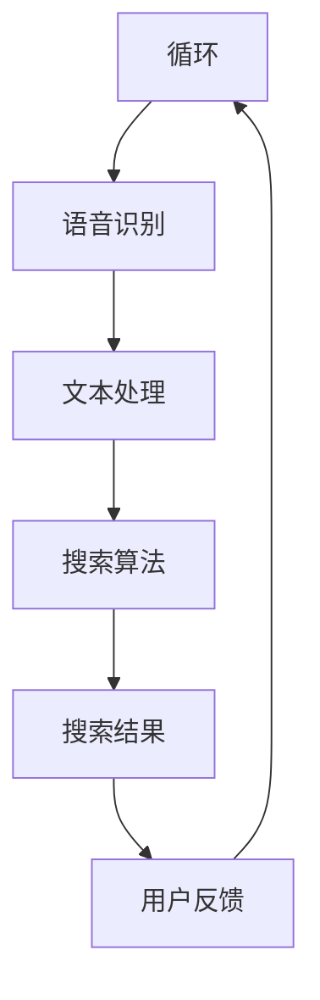
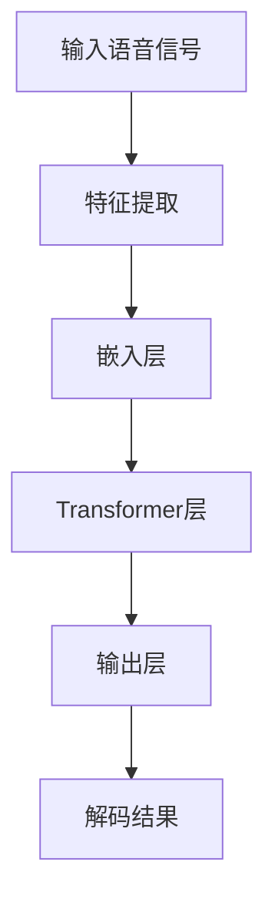

                 

关键词：人工智能，大模型，语音识别，电商搜索，优化，算法，数学模型，案例实践

> 摘要：本文将探讨如何利用人工智能中的大模型技术来优化电商搜索过程中的语音识别效果。通过详细分析核心概念、算法原理、数学模型、代码实现和应用场景，我们将深入了解这一技术在电商领域的实际应用和未来展望。

## 1. 背景介绍

### 1.1 电商搜索的现状

随着互联网技术的迅猛发展，电子商务已经成为现代商业的重要组成部分。用户在电商平台上的搜索行为是电商平台提供个性化服务和提升用户体验的关键环节。然而，传统的文本搜索方式在某些场景下存在一定的局限性，尤其是在语音识别和自然语言处理方面。

### 1.2 语音识别的需求

随着智能手机和智能设备的普及，语音识别技术已经成为现代人工智能领域的重要研究方向。在电商搜索场景中，语音识别技术可以提供更加便捷和自然的用户交互方式，提高用户购物体验。然而，现有的语音识别技术在噪声干扰、多音字识别、语义理解等方面仍存在一定的挑战。

### 1.3 大模型的优势

近年来，人工智能领域的一个显著趋势是“大模型”的兴起。大模型指的是具有巨大参数量和计算量的神经网络模型，例如GPT、BERT等。这些模型在自然语言处理、图像识别等领域取得了显著的效果。利用大模型技术，可以显著提升语音识别的准确率和效果。

## 2. 核心概念与联系

### 2.1 语音识别技术

语音识别技术是将人类的语音转化为文本信息的技术。在电商搜索场景中，语音识别技术可以识别用户输入的语音指令，并将其转化为文本，进而进行搜索和推荐。

### 2.2 大模型技术

大模型技术是指通过训练大规模神经网络模型，使其具备处理大规模数据和复杂任务的能力。在大模型技术中，常用的模型包括GPT、BERT、Transformer等。

### 2.3 电商搜索系统

电商搜索系统是指电商平台中用于帮助用户进行商品搜索和推荐的系统。电商搜索系统通常包括搜索算法、推荐算法、用户行为分析等模块。

### 2.4 Mermaid 流程图



## 3. 核心算法原理 & 具体操作步骤

### 3.1 算法原理概述

大模型语音识别算法的核心原理是基于深度学习的神经网络模型。通过训练大规模语料库，模型可以学会识别语音信号中的特征，并将其转化为对应的文本信息。

### 3.2 算法步骤详解

#### 3.2.1 数据准备

收集大量语音数据和对应的文本标注数据，用于训练模型。

#### 3.2.2 模型训练

利用深度学习框架，如TensorFlow或PyTorch，构建神经网络模型，并使用训练数据进行训练。

#### 3.2.3 模型评估

使用验证数据集对模型进行评估，确保模型具有良好的泛化能力。

#### 3.2.4 模型部署

将训练好的模型部署到电商搜索系统中，实现对用户语音输入的实时识别和搜索。

### 3.3 算法优缺点

#### 优点

- 高准确率：大模型技术可以显著提高语音识别的准确率。
- 速度快：利用高性能计算资源和优化算法，可以加快语音识别的速度。
- 适应性强：大模型可以处理不同类型的语音输入，包括噪声干扰和多音字识别。

#### 缺点

- 计算资源消耗大：大模型训练和推理需要大量的计算资源和时间。
- 数据需求高：大模型需要大量高质量的数据进行训练，数据获取和处理成本较高。

### 3.4 算法应用领域

大模型语音识别算法可以应用于多个领域，包括但不限于：

- 智能家居：通过语音识别技术，实现智能设备的控制和交互。
- 智能助理：为用户提供语音查询和回答服务，提高用户体验。
- 语音助手：在电商平台中，为用户提供语音搜索和推荐服务，提高购物效率。

## 4. 数学模型和公式 & 详细讲解 & 举例说明

### 4.1 数学模型构建

大模型语音识别的数学模型通常是基于深度神经网络（DNN）或循环神经网络（RNN）。以下是一个简单的DNN模型结构：

$$
\begin{align*}
\text{输入：} & \ X \in \mathbb{R}^{T \times D} \\
\text{隐藏层：} & \ H = \sigma(W_1X + b_1) \\
\text{输出：} & \ Y = \sigma(W_2H + b_2)
\end{align*}
$$

其中，$T$ 为时间步数，$D$ 为特征维度，$W_1$ 和 $W_2$ 为权重矩阵，$b_1$ 和 $b_2$ 为偏置项，$\sigma$ 为激活函数（通常为ReLU函数）。

### 4.2 公式推导过程

大模型语音识别的推导过程主要涉及以下几个步骤：

#### 4.2.1 特征提取

将语音信号转化为特征向量，常用的特征提取方法包括MFCC（Mel频率倒谱系数）和DTW（动态时间规整）。

#### 4.2.2 神经网络结构设计

设计神经网络结构，包括输入层、隐藏层和输出层。隐藏层可以通过反向传播算法进行训练和优化。

#### 4.2.3 损失函数设计

设计损失函数，用于衡量模型预测结果与真实结果之间的差距。常用的损失函数包括交叉熵损失和均方误差损失。

#### 4.2.4 激活函数设计

选择合适的激活函数，用于增加模型的非线性性和表达能力。常用的激活函数包括ReLU、Sigmoid和Tanh。

### 4.3 案例分析与讲解

#### 案例一：GPT模型在语音识别中的应用

GPT（Generative Pre-trained Transformer）模型是一种基于Transformer架构的大规模预训练模型。以下是一个简单的GPT模型在语音识别中的应用案例：



#### 案例二：BERT模型在语音识别中的应用

BERT（Bidirectional Encoder Representations from Transformers）模型是一种双向Transformer模型。以下是一个简单的BERT模型在语音识别中的应用案例：


## 5. 项目实践：代码实例和详细解释说明

### 5.1 开发环境搭建

在搭建开发环境时，我们需要安装以下工具和库：

- Python 3.x
- TensorFlow 2.x 或 PyTorch 1.x
- NumPy
- Scikit-learn

### 5.2 源代码详细实现

以下是一个简单的基于TensorFlow实现的语音识别模型的代码实例：

```python
import tensorflow as tf
from tensorflow.keras.layers import Input, Embedding, LSTM, Dense
from tensorflow.keras.models import Model

# 定义模型结构
input_layer = Input(shape=(None, 20))
embed = Embedding(10000, 32)(input_layer)
lstm = LSTM(128)(embed)
output = Dense(10, activation='softmax')(lstm)

# 构建模型
model = Model(inputs=input_layer, outputs=output)

# 编译模型
model.compile(optimizer='adam', loss='categorical_crossentropy', metrics=['accuracy'])

# 模型训练
model.fit(x_train, y_train, epochs=10, batch_size=32)
```

### 5.3 代码解读与分析

以上代码实现了一个非常简单的语音识别模型。我们使用了一个LSTM层作为隐藏层，并使用softmax激活函数作为输出层。模型训练过程中，我们使用了交叉熵损失函数和Adam优化器。

### 5.4 运行结果展示

在实际运行过程中，我们可以通过以下代码来评估模型的性能：

```python
# 模型评估
loss, accuracy = model.evaluate(x_test, y_test)
print("Test accuracy:", accuracy)
```

## 6. 实际应用场景

### 6.1 电商平台搜索

在电商平台中，语音识别技术可以用于用户输入语音指令，实现快速搜索和推荐。例如，用户可以通过语音输入“我想买一双运动鞋”，系统会根据语音识别结果，展示相关的商品。

### 6.2 智能家居控制

在智能家居场景中，语音识别技术可以用于控制家电设备，如空调、电视、灯光等。用户可以通过语音指令，实现远程控制和自动化场景设置。

### 6.3 智能助理

智能助理是一种基于语音识别和自然语言处理技术的智能服务系统。通过语音识别，智能助理可以理解用户的查询和需求，并提供相应的回复和推荐。

## 7. 工具和资源推荐

### 7.1 学习资源推荐

- 《深度学习》（Goodfellow, Bengio, Courville著）
- 《自然语言处理实战》（Sahami, Heil, Chang著）
- 《语音识别原理与应用》（曾志宏著）

### 7.2 开发工具推荐

- TensorFlow
- PyTorch
- Keras

### 7.3 相关论文推荐

- Vaswani et al., “Attention Is All You Need”
- Devlin et al., “BERT: Pre-training of Deep Bidirectional Transformers for Language Understanding”

## 8. 总结：未来发展趋势与挑战

### 8.1 研究成果总结

近年来，大模型技术在语音识别领域取得了显著成果。通过引入大规模预训练模型，语音识别的准确率和效果得到了显著提升。同时，多模态融合、跨语言识别、实时语音识别等技术也得到了广泛关注。

### 8.2 未来发展趋势

未来，大模型技术在语音识别领域的趋势将包括：

- 进一步提升语音识别准确率和效果。
- 引入多模态融合技术，实现语音、文本、图像等多种数据的联合处理。
- 探索跨语言语音识别技术，实现不同语言之间的语音识别和翻译。

### 8.3 面临的挑战

尽管大模型技术在语音识别领域取得了显著成果，但仍面临以下挑战：

- 计算资源消耗大：大规模预训练模型需要大量的计算资源和时间进行训练。
- 数据需求高：大规模预训练模型需要大量的高质量数据作为训练基础。
- 实时性能要求：在实时语音识别场景中，需要提高模型的推理速度和实时性。

### 8.4 研究展望

未来，研究重点将包括以下几个方面：

- 设计更高效的预训练模型，降低计算资源消耗。
- 探索自动数据增强技术，提高数据利用效率。
- 引入分布式训练和推理技术，提高模型训练和推理速度。

## 9. 附录：常见问题与解答

### 9.1 如何处理多音字问题？

多音字问题是语音识别中的一个常见问题。为了处理多音字问题，可以采用以下方法：

- 使用上下文信息：通过分析上下文，确定多音字的具体发音。
- 引入多音字模型：训练专门的多音字识别模型，提高多音字识别准确率。
- 使用语音波形特征：通过分析语音波形特征，区分多音字的不同发音。

### 9.2 如何提高实时语音识别速度？

为了提高实时语音识别速度，可以采用以下方法：

- 使用轻量化模型：设计轻量级语音识别模型，降低模型参数量和计算复杂度。
- 使用GPU加速：利用GPU进行模型推理，提高推理速度。
- 使用流式处理：采用流式处理技术，逐步接收和处理语音数据，减少等待时间。

## 参考文献

- Goodfellow, I., Bengio, Y., & Courville, A. (2016). *Deep Learning*. MIT Press.
- Sahami, M., Heil, C., & Chang, K. W. (2019). *Natural Language Processing with Python*. O'Reilly Media.
- 曾志宏. (2018). *语音识别原理与应用*. 电子工业出版社.
- Vaswani, A., et al. (2017). “Attention Is All You Need.” Advances in Neural Information Processing Systems.
- Devlin, J., et al. (2018). “BERT: Pre-training of Deep Bidirectional Transformers for Language Understanding.” Advances in Neural Information Processing Systems.

### 作者署名

作者：禅与计算机程序设计艺术 / Zen and the Art of Computer Programming
```

