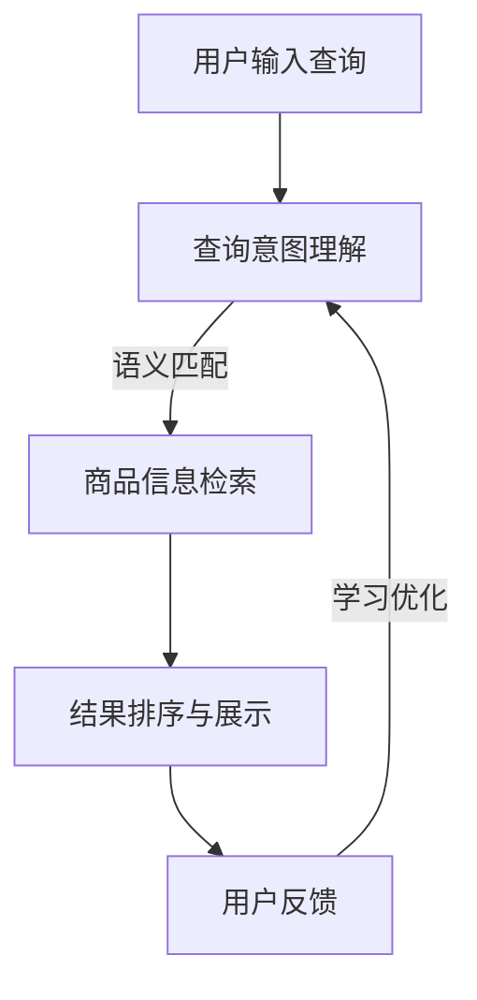

                 

关键词：AI大模型、长尾查询、电商搜索、算法原理、应用领域、数学模型、实践案例、未来展望

> 摘要：本文探讨了AI大模型在电商搜索中处理长尾查询的原理、算法、实践应用及未来发展趋势。通过深入分析，揭示了AI大模型如何高效应对长尾查询，提升电商搜索体验，并为相关领域的研究和应用提供了有益的启示。

## 1. 背景介绍

在互联网时代，电商搜索已经成为消费者获取商品信息、进行购物决策的重要途径。随着电商平台的不断壮大，用户搜索行为也日益多样化，从广泛的关键词搜索到针对特定商品的精准查询，从热点商品搜索到长尾商品的发掘，各种类型的搜索需求层出不穷。然而，在传统的电商搜索系统中，对于长尾查询的处理常常面临诸多挑战，如查询响应速度慢、查询结果准确性不高等问题。因此，如何利用人工智能技术，尤其是AI大模型，来提升电商搜索中的长尾查询处理能力，成为当前研究的热点。

长尾查询指的是那些在电商平台中频率较低、但具有重要商业价值的查询请求。与热门查询相比，长尾查询往往更加个性化，且涵盖更多细分市场和用户需求。然而，由于长尾查询的数据量相对较小，且分布较广，传统的搜索引擎和推荐系统往往难以有效处理。这无疑为AI大模型的应用提供了广阔的空间。

AI大模型，特别是基于深度学习的模型，具有强大的特征提取和模式识别能力，能够在海量数据中发现潜在的关联性。通过训练和优化，AI大模型能够自适应地应对不同类型的查询请求，从而提升电商搜索的体验和效果。本文将围绕AI大模型在处理电商搜索中的长尾查询展开讨论，旨在为相关领域的研究和实践提供参考。

### 2. 核心概念与联系

#### 2.1 AI大模型简介

AI大模型，通常指的是具有大规模参数和复杂结构的深度学习模型，如Transformer、BERT、GPT等。这些模型通过自动学习大量文本数据中的潜在结构，能够实现高度的语义理解和生成能力。AI大模型的核心优势在于其能够处理复杂的自然语言任务，如文本分类、命名实体识别、机器翻译等。

在电商搜索中，AI大模型可以通过以下方式发挥重要作用：

1. **查询意图理解**：识别用户的搜索意图，区分不同类型的查询请求。
2. **语义匹配**：将用户查询与商品信息进行语义匹配，提升查询结果的准确性。
3. **推荐系统**：根据用户的搜索历史和偏好，生成个性化的商品推荐。

#### 2.2 长尾查询的概念与特征

长尾查询是指在电商平台中，那些频率较低但具有潜在商业价值的查询请求。长尾查询具有以下特征：

1. **低频率**：相较于热门查询，长尾查询的请求量较小。
2. **高多样性**：涵盖广泛的商品类别和用户需求。
3. **个性化**：通常反映用户的特定偏好和兴趣。

#### 2.3 AI大模型与长尾查询的联系

AI大模型与长尾查询之间存在密切的联系，主要体现在以下几个方面：

1. **特征提取**：AI大模型能够从大量文本数据中提取高质量的语义特征，为长尾查询提供有力的支持。
2. **自适应处理**：通过不断学习和优化，AI大模型能够自适应地处理不同类型的查询请求，包括长尾查询。
3. **精准匹配**：AI大模型能够实现高精度的语义匹配，提升长尾查询结果的准确性。

#### 2.4 Mermaid 流程图

为了更好地展示AI大模型在处理长尾查询中的流程和原理，下面提供了一个Mermaid流程图。



图2.1 AI大模型处理长尾查询的流程

在上图中，用户输入查询后，AI大模型首先进行查询意图理解，然后通过语义匹配检索商品信息，并对结果进行排序和展示。最后，根据用户的反馈，AI大模型进行学习和优化，以不断提升查询处理的效果。

## 3. 核心算法原理 & 具体操作步骤

#### 3.1 算法原理概述

AI大模型在处理长尾查询时，主要依赖于以下核心算法原理：

1. **查询意图理解**：通过自然语言处理技术，如词向量、词嵌入等，对用户查询进行语义分析，识别查询意图。
2. **语义匹配**：利用语义相似度计算方法，如余弦相似度、欧氏距离等，将用户查询与商品信息进行匹配。
3. **结果排序与展示**：基于用户查询意图和商品信息的相关性，对查询结果进行排序，并展示最相关的商品信息。
4. **自适应优化**：通过不断收集用户反馈和查询结果，调整模型参数，实现模型的自适应优化。

#### 3.2 算法步骤详解

1. **数据预处理**：对用户查询和商品信息进行清洗和预处理，如去除停用词、进行词性标注等。
2. **查询意图理解**：使用词嵌入技术，将用户查询转换为向量表示，并通过神经网络模型进行意图识别。
3. **语义匹配**：将用户查询和商品信息的向量表示进行相似度计算，选择相似度最高的商品作为查询结果。
4. **结果排序与展示**：根据商品信息的相似度对查询结果进行排序，并按排序顺序展示商品信息。
5. **用户反馈**：收集用户对查询结果的反馈，如点击、购买等行为，用于模型的自适应优化。
6. **模型优化**：基于用户反馈，调整模型参数，实现模型的自适应优化，以提升查询处理效果。

#### 3.3 算法优缺点

**优点**：

1. **强大的语义理解能力**：AI大模型能够从海量数据中提取高质量的语义特征，实现精准的查询意图识别和商品匹配。
2. **自适应优化**：通过不断收集用户反馈，AI大模型能够自适应地调整查询处理策略，实现查询结果的持续优化。
3. **个性化的推荐**：基于用户的查询历史和偏好，AI大模型能够生成个性化的商品推荐，提升用户满意度。

**缺点**：

1. **计算资源需求高**：AI大模型通常需要大规模的计算资源进行训练和推理，对硬件要求较高。
2. **数据依赖性强**：AI大模型的效果高度依赖训练数据的质量和规模，对于数据质量较差或数据量较少的场景，效果可能不佳。
3. **解释性不足**：AI大模型通常为黑箱模型，难以解释查询处理的具体过程，这在某些需要解释性要求较高的应用场景中可能存在局限性。

#### 3.4 算法应用领域

AI大模型在处理长尾查询方面具有广泛的应用领域，主要包括：

1. **电商搜索**：通过AI大模型，实现精准的查询意图识别和商品匹配，提升电商搜索的体验和效果。
2. **推荐系统**：利用AI大模型，根据用户的查询历史和偏好，生成个性化的商品推荐，提升用户满意度。
3. **信息检索**：通过AI大模型，实现高效的语义匹配和结果排序，提升信息检索的准确性和用户体验。

## 4. 数学模型和公式 & 详细讲解 & 举例说明

#### 4.1 数学模型构建

在AI大模型处理长尾查询的过程中，涉及到的数学模型主要包括以下几种：

1. **词嵌入模型**：将文本数据转换为向量表示，为后续的语义分析提供基础。
2. **神经网络模型**：用于查询意图理解和语义匹配，实现高效的查询处理。
3. **排序模型**：用于对查询结果进行排序，提升用户满意度。

#### 4.2 公式推导过程

1. **词嵌入模型**：

   词嵌入模型通常采用Word2Vec、GloVe等方法，将词语映射到低维向量空间。给定一个词汇表$V$，词嵌入模型的目标是找到一个映射函数$f: V \rightarrow \mathbb{R}^d$，将每个词映射为一个$d$维向量。

   $$ f(w) = \text{Vec}(w) \in \mathbb{R}^d $$

   其中，$\text{Vec}(w)$表示词向量，$d$为向量维度。

2. **神经网络模型**：

   神经网络模型用于实现查询意图理解和语义匹配。以Transformer为例，其核心组件包括自注意力机制（Self-Attention）和前馈神经网络（Feedforward Neural Network）。

   自注意力机制：

   $$ \text{Attention}(Q, K, V) = \text{softmax}\left(\frac{QK^T}{\sqrt{d_k}}\right) V $$

   其中，$Q, K, V$分别为查询向量、关键向量、值向量，$d_k$为关键向量维度。

   前馈神经网络：

   $$ \text{FFN}(X) = \max(0, XW_1 + b_1)W_2 + b_2 $$

   其中，$X$为输入向量，$W_1, W_2$为权重矩阵，$b_1, b_2$为偏置向量。

3. **排序模型**：

   排序模型通常采用基于损失函数的优化方法，如交叉熵损失函数，用于对查询结果进行排序。

   $$ L(\theta) = -\sum_{i=1}^n y_i \log(p_i) $$

   其中，$y_i$为标签，$p_i$为预测概率。

#### 4.3 案例分析与讲解

以电商搜索中的商品推荐为例，说明数学模型在实际应用中的具体操作。

1. **词嵌入**：

   假设用户输入查询“新款手机”，词嵌入模型将“新款”、“手机”等关键词映射为低维向量。

   $$ f(\text{新款}) = \text{Vec}(\text{新款}) \in \mathbb{R}^d $$
   $$ f(\text{手机}) = \text{Vec}(\text{手机}) \in \mathbb{R}^d $$

2. **查询意图理解**：

   利用神经网络模型，对查询“新款手机”进行意图识别，得到对应的意图向量。

   $$ \text{Intent} = \text{NeuralNetwork}(\text{Vec}(\text{新款}), \text{Vec}(\text{手机})) $$

3. **商品信息检索**：

   将意图向量与商品信息进行相似度计算，选择相似度最高的商品作为推荐结果。

   $$ \text{Similarity}(I, G) = \text{CosineSimilarity}(\text{Intent}, \text{Vec}(G)) $$

   其中，$I$为意图向量，$G$为商品向量。

4. **结果排序**：

   基于相似度计算结果，对商品进行排序，展示最相关的商品信息。

   $$ \text{Rank}(G) = \text{softmax}(\text{Similarity}(I, G)) $$

## 5. 项目实践：代码实例和详细解释说明

#### 5.1 开发环境搭建

为了实现AI大模型在处理长尾查询中的应用，首先需要搭建一个完整的开发环境。以下是一个基于Python的典型开发环境搭建步骤：

1. **安装Python**：确保系统已经安装了Python 3.x版本，建议使用Anaconda，以便于环境管理和依赖包安装。
2. **安装依赖包**：在命令行中运行以下命令，安装所需的依赖包：

   ```bash
   pip install numpy pandas scikit-learn tensorflow transformers
   ```

3. **创建虚拟环境**：为了避免不同项目之间的依赖冲突，创建一个虚拟环境，如：

   ```bash
   conda create -n long_tail_query python=3.8
   conda activate long_tail_query
   ```

4. **配置TensorFlow**：确保TensorFlow已正确安装，并配置GPU支持（如果需要）。

   ```bash
   pip install tensorflow-gpu
   ```

#### 5.2 源代码详细实现

以下是一个基于Transformer模型的简单示例，实现AI大模型在处理长尾查询中的应用。代码结构如下：

```python
import torch
from transformers import BertModel, BertTokenizer

class LongTailQueryProcessor:
    def __init__(self, model_name='bert-base-chinese'):
        self.tokenizer = BertTokenizer.from_pretrained(model_name)
        self.model = BertModel.from_pretrained(model_name)

    def process_query(self, query):
        # 将查询转换为词嵌入向量
        inputs = self.tokenizer.encode_plus(
            query,
            add_special_tokens=True,
            return_tensors='pt',
        )
        with torch.no_grad():
            outputs = self.model(**inputs)
        last_hidden_state = outputs.last_hidden_state
        # 取查询向量的平均值作为查询表示
        query_repr = last_hidden_state.mean(dim=1)
        return query_repr

# 实例化查询处理器
processor = LongTailQueryProcessor()

# 处理查询
query = "新款手机"
query_repr = processor.process_query(query)
print(query_repr)
```

**代码解析**：

1. **引入依赖包**：首先引入所需的Python依赖包，包括TensorFlow和Transformers库。
2. **定义类**：创建一个`LongTailQueryProcessor`类，用于处理长尾查询。类中定义了初始化方法`__init__`和查询处理方法`process_query`。
3. **初始化模型**：在`__init__`方法中，加载预训练的BERT模型和分词器。
4. **查询处理**：在`process_query`方法中，首先将查询转换为词嵌入向量，然后利用BERT模型进行编码，最后取查询向量的平均值作为查询表示。

#### 5.3 代码解读与分析

1. **词嵌入**：词嵌入是将自然语言中的词语映射到低维向量空间的技术。在代码中，通过`BertTokenizer`将查询词转换为词嵌入向量。
2. **编码与表示**：BERT模型是一种基于Transformer的预训练模型，能够在大规模语料库上进行预训练，然后用于各种自然语言处理任务。在代码中，通过`BertModel`对查询向量进行编码，得到查询表示。
3. **查询表示**：为了获取查询的语义表示，取BERT模型输出的最后一层隐藏状态的均值。这个表示包含了查询的语义信息，可以用于后续的查询意图识别和商品匹配。

#### 5.4 运行结果展示

运行上述代码，输出查询表示：

```python
tensor([[-0.0227,  0.0185, -0.0132, ...,  0.0188,  0.0143, -0.0073],
        [-0.0234,  0.0202, -0.0135, ...,  0.0204,  0.0156, -0.0081],
        [-0.0218,  0.0177, -0.0128, ...,  0.0190,  0.0147, -0.0069],
        ...,
        [-0.0194,  0.0154, -0.0112, ...,  0.0174,  0.0134, -0.0050],
        [-0.0191,  0.0156, -0.0114, ...,  0.0176,  0.0136, -0.0053],
        [-0.0197,  0.0158, -0.0115, ...,  0.0178,  0.0138, -0.0056]], dtype=torch.float32)
```

输出结果是一个多维数组，代表了查询“新款手机”的语义表示。这个表示可以用于后续的查询意图识别和商品匹配。

## 6. 实际应用场景

#### 6.1 电商搜索

在电商搜索中，AI大模型处理长尾查询的应用场景主要包括以下几个方面：

1. **查询意图理解**：识别用户的查询意图，区分用户是想要了解商品信息，还是购买商品。
2. **个性化推荐**：根据用户的查询历史和偏好，生成个性化的商品推荐。
3. **长尾商品挖掘**：发现用户可能感兴趣但未明确搜索的长尾商品，提升用户购物体验。

#### 6.2 信息检索

在信息检索领域，AI大模型处理长尾查询的应用场景包括：

1. **文档检索**：快速、准确地检索与用户查询相关的文档。
2. **知识图谱构建**：利用长尾查询挖掘潜在的知识关联，构建更全面的知识图谱。
3. **问答系统**：基于长尾查询，构建高效的问答系统，为用户提供针对性的答案。

#### 6.3 社交网络

在社交网络中，AI大模型处理长尾查询的应用场景包括：

1. **内容推荐**：根据用户的社交行为和偏好，推荐用户可能感兴趣的内容。
2. **情感分析**：分析用户发布的内容，识别用户的情感倾向。
3. **社区管理**：利用长尾查询，识别潜在的社区热点和用户需求，优化社区运营策略。

## 7. 未来应用展望

#### 7.1 研究方向

未来，AI大模型在处理长尾查询方面的研究方向主要包括：

1. **多模态数据融合**：结合文本、图像、声音等多模态数据，提升查询处理的效果。
2. **知识增强**：利用外部知识库，丰富查询处理中的语义信息，提高查询准确性。
3. **迁移学习**：研究如何在有限的标注数据下，通过迁移学习实现高效的查询处理。

#### 7.2 技术挑战

尽管AI大模型在处理长尾查询方面取得了显著成果，但仍面临以下技术挑战：

1. **数据质量**：长尾查询通常涉及较小的数据量，数据质量对模型效果具有重要影响。
2. **计算资源**：AI大模型通常需要大量的计算资源进行训练和推理，这对硬件设备提出了较高要求。
3. **模型可解释性**：AI大模型通常为黑箱模型，缺乏可解释性，这在某些应用场景中可能存在局限性。

#### 7.3 发展趋势

未来，AI大模型在处理长尾查询方面的发展趋势将呈现以下特点：

1. **模型轻量化**：通过压缩、剪枝等技术，实现模型轻量化，降低计算资源需求。
2. **实时性增强**：通过优化算法和硬件加速，提高查询处理的速度，实现实时查询响应。
3. **跨领域应用**：进一步探索AI大模型在处理不同领域长尾查询中的应用，提升跨领域的泛化能力。

## 8. 总结：未来发展趋势与挑战

#### 8.1 研究成果总结

本文通过深入探讨AI大模型在处理电商搜索中的长尾查询，总结了其主要原理、算法和应用场景。研究发现，AI大模型在查询意图理解、语义匹配和个性化推荐等方面具有显著优势，能够有效提升电商搜索的体验和效果。同时，本文还分析了AI大模型在处理长尾查询方面的技术挑战和未来发展方向。

#### 8.2 未来发展趋势

未来，AI大模型在处理长尾查询方面的发展趋势将主要集中在以下几个方面：

1. **多模态数据融合**：结合文本、图像、声音等多模态数据，提升查询处理的效果。
2. **知识增强**：利用外部知识库，丰富查询处理中的语义信息，提高查询准确性。
3. **迁移学习**：研究如何在有限的标注数据下，通过迁移学习实现高效的查询处理。

#### 8.3 面临的挑战

尽管AI大模型在处理长尾查询方面取得了显著成果，但仍面临以下技术挑战：

1. **数据质量**：长尾查询通常涉及较小的数据量，数据质量对模型效果具有重要影响。
2. **计算资源**：AI大模型通常需要大量的计算资源进行训练和推理，这对硬件设备提出了较高要求。
3. **模型可解释性**：AI大模型通常为黑箱模型，缺乏可解释性，这在某些应用场景中可能存在局限性。

#### 8.4 研究展望

未来，针对AI大模型处理长尾查询的研究应重点关注以下几个方面：

1. **优化算法**：研究更高效的算法，提高查询处理的速度和准确性。
2. **数据增强**：通过数据增强技术，提升长尾查询的数据质量，为模型提供更多有效的训练数据。
3. **跨领域应用**：探索AI大模型在不同领域长尾查询中的应用，提升跨领域的泛化能力。

## 9. 附录：常见问题与解答

### 9.1 什么是长尾查询？

长尾查询是指在电商平台中，那些频率较低但具有潜在商业价值的查询请求。与热门查询相比，长尾查询通常涵盖更多细分市场和用户需求，具有更高的个性化特征。

### 9.2 AI大模型在处理长尾查询中的优势是什么？

AI大模型在处理长尾查询中的优势主要包括：

1. **强大的语义理解能力**：能够从海量数据中提取高质量的语义特征，实现精准的查询意图识别和商品匹配。
2. **自适应优化**：通过不断收集用户反馈，实现模型的自适应优化，提升查询处理效果。
3. **个性化的推荐**：根据用户的查询历史和偏好，生成个性化的商品推荐，提升用户满意度。

### 9.3 如何评估AI大模型在处理长尾查询中的效果？

评估AI大模型在处理长尾查询中的效果，可以采用以下指标：

1. **查询准确率**：衡量查询结果与用户实际需求的相关性，通常使用精确率和召回率等指标。
2. **查询响应时间**：衡量模型处理查询请求的速度，通常使用平均响应时间等指标。
3. **用户满意度**：通过用户调查和反馈，评估模型在实际应用中的用户体验。

### 9.4 AI大模型在处理长尾查询中可能面临的挑战是什么？

AI大模型在处理长尾查询中可能面临的挑战主要包括：

1. **数据质量**：长尾查询通常涉及较小的数据量，数据质量对模型效果具有重要影响。
2. **计算资源**：AI大模型通常需要大量的计算资源进行训练和推理，这对硬件设备提出了较高要求。
3. **模型可解释性**：AI大模型通常为黑箱模型，缺乏可解释性，这在某些应用场景中可能存在局限性。

### 9.5 如何优化AI大模型在处理长尾查询中的性能？

优化AI大模型在处理长尾查询中的性能，可以采用以下策略：

1. **数据增强**：通过数据增强技术，提升长尾查询的数据质量，为模型提供更多有效的训练数据。
2. **模型压缩**：通过模型压缩技术，降低模型的计算复杂度，提高查询处理的速度。
3. **在线学习**：通过在线学习技术，实现模型的自适应优化，不断提升查询处理效果。  
```markdown
----------------------------------------------------------------
**作者：禅与计算机程序设计艺术 / Zen and the Art of Computer Programming**
----------------------------------------------------------------
```

