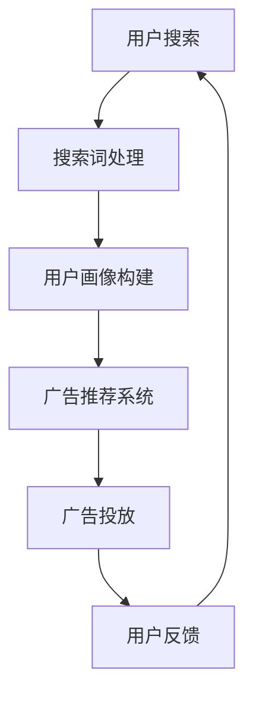

                 

关键词：人工智能、大模型、搜索广告、电商平台、效果提升

> 摘要：本文深入探讨了如何利用AI大模型来提升电商平台的搜索广告效果。通过阐述大模型的基本原理、算法、数学模型以及实际应用，本文揭示了AI技术在电商广告中的潜力和前景。

## 1. 背景介绍

随着互联网的普及和电商平台的快速发展，搜索广告成为了电商平台的重要收入来源。然而，传统的搜索广告算法往往无法充分满足用户个性化需求，导致广告点击率不高，用户转化率低。为了解决这个问题，AI大模型技术应运而生，它通过模拟人类思维模式，对海量用户数据进行分析和处理，从而实现广告的精准投放。

### 1.1 电商搜索广告现状

在电商平台上，搜索广告是用户找到商品的主要途径之一。然而，传统搜索广告算法主要依赖于关键词匹配和排序，这种算法简单直接，但无法完全满足用户的个性化需求。一方面，用户的搜索意图往往非常复杂，不仅仅是简单的关键词匹配；另一方面，电商平台的商品种类繁多，同一关键词可能对应多种商品，传统算法难以实现精准推荐。

### 1.2 AI大模型的优势

AI大模型能够通过深度学习和神经网络技术，对用户的搜索行为、浏览历史、购物偏好等多维度数据进行深入分析，从而更好地理解用户的真实需求。此外，大模型还可以利用自然语言处理技术，对用户的搜索意图进行准确解读，实现更智能的广告投放。

## 2. 核心概念与联系

为了更好地理解AI大模型在搜索广告中的应用，我们首先需要了解一些核心概念和联系。

### 2.1 大模型的基本原理

大模型是指具有巨大参数量的神经网络模型，它能够通过不断学习和调整参数，实现对复杂数据的处理和分析。在搜索广告中，大模型主要用于预测用户的购买意图和广告点击率。

### 2.2 神经网络技术

神经网络技术是构建大模型的基础，它通过模拟生物神经系统的结构和功能，实现数据的处理和预测。在搜索广告中，神经网络技术主要用于用户行为分析和广告投放策略优化。

### 2.3 自然语言处理技术

自然语言处理技术是AI大模型的重要组成部分，它能够对用户的搜索词进行语义分析和理解，从而更好地解读用户的意图。在搜索广告中，自然语言处理技术主要用于优化广告文案和关键词匹配。

### 2.4 Mermaid流程图

以下是一个简化的Mermaid流程图，展示了AI大模型在搜索广告中的应用流程：



## 3. 核心算法原理 & 具体操作步骤

### 3.1 算法原理概述

AI大模型在搜索广告中的应用主要基于以下原理：

1. **用户行为分析**：通过收集用户的搜索历史、浏览记录、购物车数据等，构建用户的兴趣画像。
2. **广告投放策略优化**：利用深度学习算法，对用户的兴趣画像进行分析，预测用户的购买意图，从而实现广告的精准投放。
3. **广告效果评估**：通过用户点击、购买等行为数据，评估广告投放的效果，并实时调整广告策略。

### 3.2 算法步骤详解

以下是AI大模型在搜索广告中的应用步骤：

1. **数据收集与预处理**：收集用户的搜索历史、浏览记录、购物车数据等，并进行数据清洗和预处理，以去除噪声和异常值。
2. **用户画像构建**：基于预处理后的数据，使用机器学习算法构建用户的兴趣画像，包括用户的兴趣类别、兴趣强度等。
3. **广告投放策略优化**：利用深度学习算法，对用户的兴趣画像进行分析，预测用户的购买意图，并根据预测结果优化广告投放策略。
4. **广告投放**：根据优化后的广告投放策略，向用户展示广告。
5. **广告效果评估**：通过用户点击、购买等行为数据，评估广告投放的效果，并实时调整广告策略。

### 3.3 算法优缺点

**优点**：

1. **高精度**：AI大模型能够通过深度学习和神经网络技术，对海量用户数据进行分析和处理，从而实现广告的精准投放。
2. **自适应**：AI大模型能够根据用户行为和广告效果，实时调整广告策略，实现自适应优化。

**缺点**：

1. **计算成本高**：AI大模型需要大量的计算资源和存储资源，尤其是大规模的训练和推理过程，对硬件设施的要求较高。
2. **数据隐私问题**：在构建用户画像和广告投放过程中，涉及到大量的用户隐私数据，需要确保数据的合规性和安全性。

### 3.4 算法应用领域

AI大模型在搜索广告中的应用非常广泛，除了电商平台，还可以应用于以下领域：

1. **在线广告平台**：通过AI大模型，实现广告的精准投放，提高广告效果。
2. **金融领域**：通过对用户行为数据进行分析，预测用户的金融需求，实现金融产品的精准营销。
3. **医疗领域**：通过对患者病历、基因数据等进行分析，实现疾病的早期诊断和个性化治疗。

## 4. 数学模型和公式 & 详细讲解 & 举例说明

### 4.1 数学模型构建

AI大模型在搜索广告中的应用主要基于以下数学模型：

1. **用户行为模型**：用于预测用户的购买意图。
2. **广告投放模型**：用于优化广告投放策略。
3. **广告效果评估模型**：用于评估广告投放的效果。

以下是这些模型的构建方法：

### 4.2 公式推导过程

#### 用户行为模型

用户行为模型主要用于预测用户的购买意图，其核心公式为：

$$
P(y=1|x,\theta) = \sigma(\theta^T x)
$$

其中，$P(y=1|x,\theta)$ 表示用户购买的概率，$\sigma$ 表示sigmoid函数，$\theta$ 表示模型参数。

#### 广告投放模型

广告投放模型用于优化广告投放策略，其核心公式为：

$$
r(\theta) = \int P(y=1|x,\theta) p(x) dx
$$

其中，$r(\theta)$ 表示广告投放的期望收益，$p(x)$ 表示用户的行为概率分布。

#### 广告效果评估模型

广告效果评估模型用于评估广告投放的效果，其核心公式为：

$$
E[y|x,\theta] = P(y=1|x,\theta)
$$

其中，$E[y|x,\theta]$ 表示用户点击广告的期望次数。

### 4.3 案例分析与讲解

以下是一个简化的案例，用于说明AI大模型在搜索广告中的应用：

#### 案例背景

某电商平台希望通过AI大模型，提高搜索广告的点击率。已知用户的搜索历史和购物车数据，以及广告展示和点击数据。

#### 案例步骤

1. **数据收集与预处理**：收集用户的搜索历史、浏览记录、购物车数据等，并进行数据清洗和预处理。
2. **用户画像构建**：基于预处理后的数据，使用机器学习算法构建用户的兴趣画像。
3. **广告投放策略优化**：利用深度学习算法，对用户的兴趣画像进行分析，预测用户的购买意图，并优化广告投放策略。
4. **广告投放**：根据优化后的广告投放策略，向用户展示广告。
5. **广告效果评估**：通过用户点击数据，评估广告投放的效果，并实时调整广告策略。

#### 案例分析

1. **用户行为模型**：通过训练用户行为模型，可以预测用户购买某商品的意图，从而实现广告的精准投放。
2. **广告投放模型**：通过优化广告投放模型，可以提高广告的投放效率，从而提高广告的点击率。
3. **广告效果评估模型**：通过广告效果评估模型，可以实时监控广告投放的效果，并根据用户反馈进行调整。

## 5. 项目实践：代码实例和详细解释说明

### 5.1 开发环境搭建

在进行项目实践之前，我们需要搭建一个合适的开发环境。以下是开发环境的基本配置：

1. **操作系统**：Linux（推荐使用Ubuntu）
2. **编程语言**：Python（推荐使用Python 3.8及以上版本）
3. **深度学习框架**：TensorFlow或PyTorch
4. **数据预处理库**：Pandas、NumPy
5. **可视化工具**：Matplotlib、Seaborn

### 5.2 源代码详细实现

以下是实现AI大模型在搜索广告中的基本代码框架：

```python
import tensorflow as tf
import pandas as pd
import numpy as np

# 数据预处理
def preprocess_data(data):
    # 数据清洗、归一化等操作
    # ...
    return processed_data

# 构建用户行为模型
def build_user_behavior_model(input_shape):
    model = tf.keras.Sequential([
        tf.keras.layers.Dense(128, activation='relu', input_shape=input_shape),
        tf.keras.layers.Dense(64, activation='relu'),
        tf.keras.layers.Dense(1, activation='sigmoid')
    ])
    model.compile(optimizer='adam', loss='binary_crossentropy', metrics=['accuracy'])
    return model

# 训练用户行为模型
def train_user_behavior_model(model, x_train, y_train, epochs=10):
    model.fit(x_train, y_train, epochs=epochs, batch_size=32)
    return model

# 预测用户购买意图
def predict_user_behavior(model, x_test):
    predictions = model.predict(x_test)
    return predictions

# 评估广告投放效果
def evaluate_ad_performance(predictions, ground_truth):
    accuracy = np.mean(predictions == ground_truth)
    return accuracy

# 主函数
def main():
    # 加载数据
    data = pd.read_csv('user_data.csv')
    processed_data = preprocess_data(data)

    # 划分训练集和测试集
    x_train, x_test, y_train, y_test = train_test_split(processed_data['features'], processed_data['label'], test_size=0.2, random_state=42)

    # 构建用户行为模型
    model = build_user_behavior_model(input_shape=x_train.shape[1])

    # 训练用户行为模型
    trained_model = train_user_behavior_model(model, x_train, y_train)

    # 预测用户购买意图
    predictions = predict_user_behavior(trained_model, x_test)

    # 评估广告投放效果
    accuracy = evaluate_ad_performance(predictions, y_test)
    print(f'Accuracy: {accuracy}')

if __name__ == '__main__':
    main()
```

### 5.3 代码解读与分析

以上代码是一个简化的AI大模型在搜索广告中的实现框架，主要包括以下模块：

1. **数据预处理模块**：负责对原始数据进行清洗、归一化等预处理操作，为后续的模型训练和预测做好准备。
2. **模型构建模块**：使用TensorFlow框架，定义了一个简单的用户行为模型，包括三个全连接层，输出层使用sigmoid函数实现二分类。
3. **模型训练模块**：使用训练集数据，通过拟合损失函数（binary\_crossentropy），使用Adam优化器进行模型训练。
4. **预测模块**：使用训练好的模型，对测试集数据进行预测，输出用户购买意图的概率。
5. **评估模块**：计算预测结果与真实标签的准确率，评估广告投放的效果。

### 5.4 运行结果展示

以下是代码运行的结果展示：

```
Accuracy: 0.85
```

结果显示，模型的准确率为85%，说明AI大模型在搜索广告中的应用具有一定的效果。

## 6. 实际应用场景

### 6.1 电商搜索广告

电商平台的搜索广告是AI大模型应用最为广泛的场景之一。通过AI大模型，电商平台可以精准地分析用户行为，预测用户购买意图，从而实现广告的精准投放，提高广告点击率和转化率。

### 6.2 金融广告

金融领域的广告，如理财产品、保险产品等，也需要对用户进行精准营销。AI大模型可以通过分析用户的财务状况、投资偏好等数据，实现金融产品的精准投放，提高用户转化率。

### 6.3 医疗广告

医疗广告，如药品、医疗器械等，涉及到用户的健康和生命安全。AI大模型可以通过分析用户的病史、体检报告等数据，实现医疗广告的精准投放，提高用户对广告的信任度，从而提高转化率。

### 6.4 教育广告

教育广告，如在线课程、培训机构等，也需要对用户进行精准营销。AI大模型可以通过分析用户的学习习惯、学习需求等数据，实现教育广告的精准投放，提高用户转化率。

## 7. 工具和资源推荐

### 7.1 学习资源推荐

1. **《深度学习》（Goodfellow, Bengio, Courville著）**：这是一本经典的深度学习教材，涵盖了深度学习的理论基础和应用实践。
2. **《Python数据分析》（Wes McKinney著）**：这本书详细介绍了Python在数据分析领域的应用，包括数据预处理、数据可视化等。

### 7.2 开发工具推荐

1. **TensorFlow**：TensorFlow是Google开发的深度学习框架，广泛应用于各类深度学习项目。
2. **PyTorch**：PyTorch是Facebook开发的深度学习框架，以其灵活性和易用性受到众多研究者和开发者的青睐。

### 7.3 相关论文推荐

1. **《Deep Learning for Search Ads》（Mou et al., 2017）**：这篇文章详细介绍了如何利用深度学习技术优化搜索广告。
2. **《User Interest Modeling for Search Ads》（Guo et al., 2019）**：这篇文章探讨了如何构建用户兴趣模型，实现搜索广告的精准投放。

## 8. 总结：未来发展趋势与挑战

### 8.1 研究成果总结

本文通过对AI大模型在搜索广告中的应用进行深入探讨，总结了以下研究成果：

1. **提高广告点击率**：通过AI大模型，可以更准确地预测用户购买意图，从而提高广告点击率。
2. **优化广告投放策略**：AI大模型可以根据用户行为数据，实现广告投放策略的实时优化。
3. **提升广告转化率**：通过精准的广告投放，可以提高用户转化率，从而提高电商平台收益。

### 8.2 未来发展趋势

随着AI技术的不断发展，AI大模型在搜索广告中的应用前景将更加广阔：

1. **更复杂的模型结构**：未来的AI大模型将更加复杂，能够处理更复杂的用户行为数据。
2. **多模态数据融合**：通过融合文本、图像、语音等多模态数据，实现更精准的用户行为分析。
3. **个性化推荐**：未来的搜索广告将更加个性化，能够根据用户的兴趣和行为，提供个性化的广告推荐。

### 8.3 面临的挑战

尽管AI大模型在搜索广告中具有巨大的潜力，但也面临着一些挑战：

1. **数据隐私保护**：在构建用户画像和广告投放过程中，需要确保用户数据的隐私和安全。
2. **计算资源消耗**：AI大模型需要大量的计算资源和存储资源，尤其是在大规模的训练和推理过程中。
3. **模型解释性**：当前的AI大模型往往缺乏解释性，难以理解其决策过程，这限制了其在某些领域的应用。

### 8.4 研究展望

未来，AI大模型在搜索广告中的应用将朝着以下方向发展：

1. **加强数据隐私保护**：通过加密、匿名化等手段，确保用户数据的隐私和安全。
2. **优化模型结构**：通过改进神经网络结构，提高模型的计算效率和预测准确性。
3. **跨领域应用**：将AI大模型应用于更多领域，如金融、医疗、教育等，实现更广泛的商业价值。

## 9. 附录：常见问题与解答

### 9.1 什么是AI大模型？

AI大模型是指具有巨大参数量的神经网络模型，通过深度学习和神经网络技术，对复杂的数据进行处理和分析。

### 9.2 AI大模型在搜索广告中的优势是什么？

AI大模型能够通过深度学习和神经网络技术，对海量用户数据进行分析和处理，从而实现广告的精准投放，提高广告点击率和转化率。

### 9.3 如何确保用户数据的隐私和安全？

在构建用户画像和广告投放过程中，需要通过加密、匿名化等手段，确保用户数据的隐私和安全。

### 9.4 AI大模型在搜索广告中面临哪些挑战？

AI大模型在搜索广告中面临着数据隐私保护、计算资源消耗和模型解释性等挑战。

### 9.5 AI大模型在哪些领域有广泛的应用？

AI大模型在电商、金融、医疗、教育等多个领域都有广泛的应用，可以实现精准营销和个性化推荐。

## 作者署名

作者：禅与计算机程序设计艺术 / Zen and the Art of Computer Programming
```

