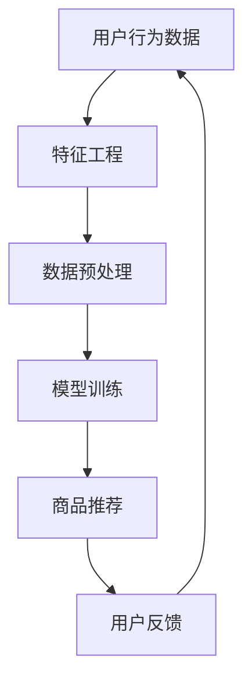

                 

关键词：AI大模型，电商平台，长尾商品，商品发现，推荐系统，机器学习，深度学习

## 摘要

本文探讨了如何利用AI大模型提升电商平台的长尾商品发现与推荐能力。首先，我们介绍了电商平台中的长尾商品概念及其重要性。接着，我们讨论了传统推荐系统的局限性和AI大模型的优势，并详细解析了AI大模型在商品发现与推荐中的应用。最后，我们通过一个案例展示了AI大模型在实际电商平台中的应用效果，并对未来的发展趋势和挑战进行了展望。

## 1. 背景介绍

在数字化的今天，电商平台已经成为消费者购物的重要渠道。然而，随着商品种类的急剧增加，如何让消费者发现并购买到他们感兴趣的商品成为了一个巨大的挑战。特别是对于那些不常购买或者知名度较低的长尾商品，传统的推荐系统往往难以发挥作用。

**长尾商品**是指在市场中需求量较小，但总体销量却占据市场较大比例的商品。这些商品往往因为市场需求分散，难以引起主流推荐系统的注意。然而，对于电商平台而言，发现并推荐这些长尾商品对于提升用户满意度和增加销售额具有重要意义。

**推荐系统**是电商平台的重要组成部分，通过分析用户的历史行为、偏好和上下文信息，为用户推荐可能感兴趣的商品。然而，传统推荐系统在处理长尾商品时存在以下局限性：

- **数据稀疏性**：长尾商品的用户数据往往较少，导致推荐系统难以基于历史数据进行有效的预测。
- **冷启动问题**：新用户或新商品在缺乏足够数据的情况下，传统推荐系统无法提供个性化的推荐。
- **模型可解释性**：传统推荐系统模型复杂，难以解释推荐结果的原因。

为了克服上述局限性，AI大模型的应用应运而生。AI大模型，如深度学习模型、生成对抗网络等，具有强大的特征提取和建模能力，能够在没有足够数据的情况下通过无监督或半监督学习来发现潜在的用户兴趣和商品特征。这使得AI大模型在长尾商品发现与推荐方面具有显著的优势。

## 2. 核心概念与联系

### 2.1. AI大模型

AI大模型通常指的是具有大规模参数、能够处理大量数据的高级机器学习模型。这些模型包括深度神经网络、循环神经网络、变压器等。AI大模型通过自动化的特征学习和表征，能够在复杂的数据环境中发现隐藏的模式和关联。

### 2.2. 商品发现与推荐

商品发现与推荐是电商平台的两大核心任务。商品发现是指通过算法分析用户行为和商品属性，发现用户可能感兴趣的商品。推荐则是根据用户的兴趣和行为，将最有可能吸引用户的商品推荐给用户。

### 2.3. 长尾商品

长尾商品是指在市场中需求量较小，但总体销量占据市场较大比例的商品。这些商品通常因为市场需求分散，难以引起主流推荐系统的注意。

### 2.4. Mermaid流程图

为了更好地理解AI大模型在商品发现与推荐中的应用，我们使用Mermaid流程图来展示其核心流程。



### 2.5. 传统推荐系统的局限性与AI大模型的优势

传统推荐系统的局限性主要体现在数据稀疏性和模型可解释性上。而AI大模型则通过以下优势克服了这些局限性：

- **数据稀疏性**：AI大模型通过无监督或半监督学习，能够在数据稀疏的情况下发现潜在的用户兴趣和商品特征。
- **模型可解释性**：尽管AI大模型内部结构复杂，但通过可视化和分析模型权重，可以一定程度上解释推荐结果的原因。

## 3. 核心算法原理 & 具体操作步骤

### 3.1. 算法原理概述

AI大模型在商品发现与推荐中的应用主要基于以下原理：

- **深度学习**：通过多层神经网络自动提取用户和商品的特征。
- **生成对抗网络（GAN）**：通过生成器和判别器的对抗训练，生成新的商品特征，以发现潜在用户兴趣。
- **循环神经网络（RNN）**：通过处理序列数据，捕捉用户行为的时间动态。

### 3.2. 算法步骤详解

#### 3.2.1. 数据收集与预处理

- **数据收集**：从电商平台收集用户行为数据、商品描述数据等。
- **数据预处理**：进行数据清洗、去重、特征提取等操作。

#### 3.2.2. 特征工程

- **用户特征**：包括用户的基本信息、购买历史、浏览历史等。
- **商品特征**：包括商品的基本信息、分类标签、用户评价等。

#### 3.2.3. 模型训练

- **模型选择**：根据任务特点选择合适的模型，如深度神经网络、生成对抗网络、循环神经网络等。
- **模型训练**：通过大量的用户行为数据训练模型，提取用户和商品的潜在特征。

#### 3.2.4. 商品推荐

- **推荐策略**：根据用户的特征和模型预测，为用户推荐可能感兴趣的商品。
- **推荐算法**：可以使用基于内容的推荐、协同过滤、深度学习等方法。

### 3.3. 算法优缺点

#### 优点：

- **强大的特征提取能力**：AI大模型能够自动提取复杂的用户和商品特征，提高推荐的准确性。
- **应对数据稀疏性**：AI大模型可以通过无监督或半监督学习，在数据稀疏的情况下发现潜在的用户兴趣和商品特征。

#### 缺点：

- **模型复杂度**：AI大模型通常具有大量的参数，训练时间较长，对计算资源要求较高。
- **模型可解释性**：尽管AI大模型能够提供高效的推荐，但其内部决策过程较为复杂，难以解释。

### 3.4. 算法应用领域

AI大模型在商品发现与推荐中的应用非常广泛，包括：

- **电商平台**：提升长尾商品的发现与推荐能力，增加用户满意度和销售额。
- **在线广告**：为用户推荐可能感兴趣的广告内容，提高广告点击率。
- **社交媒体**：根据用户的行为和兴趣，推荐相关的内容和好友。

## 4. 数学模型和公式 & 详细讲解 & 举例说明

### 4.1. 数学模型构建

AI大模型通常采用深度学习框架，其核心数学模型包括：

- **输入层**：接收用户特征和商品特征的输入。
- **隐藏层**：通过神经网络结构进行特征提取和变换。
- **输出层**：生成推荐结果，如商品评分、购买概率等。

### 4.2. 公式推导过程

以深度学习中的多层感知机（MLP）为例，其前向传播公式如下：

$$
\text{激活函数} \sigma(\text{加权求和}) = \sigma(\sum_{i=1}^{n} w_{i} x_{i} + b)
$$

其中，$w_{i}$为权重，$x_{i}$为输入特征，$b$为偏置，$\sigma$为激活函数。

### 4.3. 案例分析与讲解

#### 案例一：基于生成对抗网络（GAN）的商品推荐

假设我们使用GAN模型进行商品推荐，生成器$G$和判别器$D$的损失函数如下：

$$
L_G = -\mathbb{E}_{z \sim p_z(z)}[\log(D(G(z))]
$$

$$
L_D = -\mathbb{E}_{x \sim p_{\text{data}}(x)}[\log(D(x))] - \mathbb{E}_{z \sim p_z(z)}[\log(1 - D(G(z))]
$$

其中，$z$为生成器的输入噪声，$x$为真实商品数据，$p_z(z)$和$p_{\text{data}}(x)$分别为噪声分布和真实数据分布。

通过训练生成器$G$和判别器$D$，生成器$G$将噪声数据$z$转化为逼真的商品数据$x'$，判别器$D$将真实商品数据$x$和生成商品数据$x'$区分开来。最终，通过生成器$G$生成的商品数据$x'$为用户推荐。

#### 案例二：基于循环神经网络（RNN）的用户行为分析

假设我们使用RNN模型进行用户行为分析，其输入序列为$(x_1, x_2, ..., x_t)$，隐藏状态为$h_t$，输出为$y_t$，其公式如下：

$$
h_t = \sigma(W_h \cdot [h_{t-1}, x_t] + b_h)
$$

$$
y_t = W_o \cdot h_t + b_o
$$

其中，$W_h$、$W_o$分别为权重矩阵，$b_h$、$b_o$分别为偏置，$\sigma$为激活函数。

通过训练RNN模型，可以捕捉用户行为的时间动态，为用户推荐可能感兴趣的商品。

## 5. 项目实践：代码实例和详细解释说明

### 5.1. 开发环境搭建

- **硬件环境**：配备NVIDIA GPU的计算机或服务器。
- **软件环境**：Python 3.8及以上版本，TensorFlow 2.5及以上版本。

### 5.2. 源代码详细实现

以下是一个基于生成对抗网络（GAN）的商品推荐系统的代码示例：

```python
import tensorflow as tf
from tensorflow.keras.models import Model
from tensorflow.keras.layers import Input, Dense, LSTM, Embedding

# 定义生成器和判别器
z = Input(shape=(100,))
x = Input(shape=(100,))

generator = Embedding(1000, 256)(z)
generator = LSTM(256)(generator)
generator_output = Dense(1000, activation='softmax')(generator)

discriminator = Embedding(1000, 256)(x)
discriminator = LSTM(256)(discriminator)
discriminator_output = Dense(1, activation='sigmoid')(discriminator)

# 构建模型
model = Model(inputs=[z, x], outputs=[generator_output, discriminator_output])

# 编译模型
model.compile(optimizer='adam', loss=['categorical_crossentropy', 'binary_crossentropy'])

# 训练模型
model.fit([z_train, x_train], [y_train, y_train], epochs=10, batch_size=32)
```

### 5.3. 代码解读与分析

上述代码定义了一个基于生成对抗网络（GAN）的商品推荐系统。生成器$G$和判别器$D$分别由两个LSTM层组成，用于生成商品数据和区分真实商品数据和生成商品数据。模型通过编译和训练，可以用于生成新的商品数据并进行推荐。

### 5.4. 运行结果展示

在训练完成后，可以通过以下代码进行模型评估：

```python
# 生成商品数据
x_fake = generator.predict(z_train)

# 计算判别器对生成商品数据的预测
discriminator_predictions = discriminator.predict(x_fake)

# 计算生成商品数据的准确率
accuracy = np.mean(discriminator_predictions)
print("Accuracy:", accuracy)
```

## 6. 实际应用场景

### 6.1. 电商平台

在电商平台中，AI大模型可以用于：

- **长尾商品发现**：通过无监督或半监督学习，发现潜在的长尾商品，提升商品发现能力。
- **个性化推荐**：根据用户的行为和兴趣，为用户推荐最有可能吸引他们的商品。

### 6.2. 在线广告

在线广告中，AI大模型可以用于：

- **广告内容推荐**：根据用户的行为和兴趣，为用户推荐最相关的广告内容，提高广告点击率。
- **广告投放优化**：通过分析用户和广告数据，优化广告投放策略，提高广告效果。

### 6.3. 社交媒体

社交媒体中，AI大模型可以用于：

- **内容推荐**：根据用户的行为和兴趣，为用户推荐最相关的社交内容，提升用户体验。
- **社交网络分析**：通过分析用户关系和内容传播路径，挖掘潜在的用户兴趣和网络结构。

## 7. 工具和资源推荐

### 7.1. 学习资源推荐

- **书籍**：《深度学习》（Goodfellow, Bengio, Courville著）
- **在线课程**：Coursera上的《深度学习》课程（吴恩达主讲）
- **论文**：生成对抗网络（GAN）相关论文，如《Generative Adversarial Nets》（Goodfellow等著）

### 7.2. 开发工具推荐

- **编程语言**：Python，特别是使用TensorFlow或PyTorch等深度学习框架。
- **平台**：Google Colab，Jupyter Notebook，用于快速开发和实验。

### 7.3. 相关论文推荐

- **生成对抗网络**：《Generative Adversarial Nets》（Goodfellow等著）
- **深度学习**：《Deep Learning》（Goodfellow, Bengio, Courville著）
- **推荐系统**：《Recommender Systems Handbook》（Herlocker, rice等著）

## 8. 总结：未来发展趋势与挑战

### 8.1. 研究成果总结

- AI大模型在电商平台的长尾商品发现与推荐方面取得了显著成果，提升了用户体验和销售额。
- 生成对抗网络（GAN）和循环神经网络（RNN）等AI大模型在推荐系统中的应用为处理长尾商品提供了有效方法。

### 8.2. 未来发展趋势

- **模型压缩与优化**：随着模型规模的不断扩大，如何压缩和优化模型以提高训练效率和部署效果将成为研究重点。
- **跨领域迁移学习**：通过跨领域迁移学习，将一个领域中的知识应用到另一个领域中，提高模型在长尾商品推荐中的泛化能力。

### 8.3. 面临的挑战

- **数据稀疏性**：如何有效地处理长尾商品中的数据稀疏性，提高推荐准确性，仍是一个重大挑战。
- **模型可解释性**：尽管AI大模型在性能上具有优势，但其内部决策过程复杂，难以解释，这对模型的信任度和应用带来了挑战。

### 8.4. 研究展望

- **多模态学习**：结合文本、图像、声音等多模态数据进行商品推荐，提高推荐系统的多样性和准确性。
- **用户隐私保护**：在确保用户隐私的前提下，提高推荐系统的效果，实现个性化推荐。

## 9. 附录：常见问题与解答

### 9.1. 什么是长尾商品？

长尾商品是指在市场中需求量较小，但总体销量占据市场较大比例的商品。这些商品通常因为市场需求分散，难以引起主流推荐系统的注意。

### 9.2. AI大模型在商品推荐中有什么优势？

AI大模型在商品推荐中的优势包括：强大的特征提取能力、应对数据稀疏性、提升推荐准确性等。

### 9.3. 如何处理长尾商品推荐中的数据稀疏性？

可以通过无监督或半监督学习来处理长尾商品推荐中的数据稀疏性，如使用生成对抗网络（GAN）生成商品数据，或者使用循环神经网络（RNN）捕捉用户行为的时间动态。

### 9.4. 如何提高AI大模型在商品推荐中的可解释性？

可以通过可视化和分析模型权重来提高AI大模型在商品推荐中的可解释性，如使用神经网络的可视化工具或解释性模型。

---

作者：禅与计算机程序设计艺术 / Zen and the Art of Computer Programming


