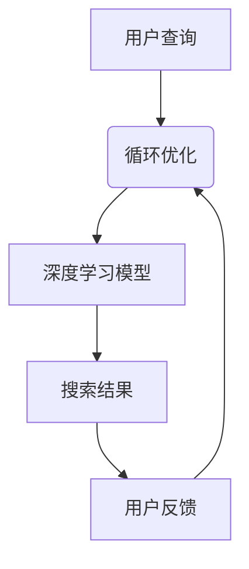

                 

在当今的电子商务时代，准确和高效的搜索功能对电商平台至关重要。用户希望能够快速找到他们想要的商品，而电商平台则需要确保搜索结果的相关性和准确性。人工智能（AI）大模型的兴起为电商搜索提供了全新的解决方案，显著提升了搜索的准确性。本文将深入探讨AI大模型如何通过自然语言处理和深度学习技术，优化电商搜索功能，提升用户体验。

## 文章关键词
- 人工智能
- 大模型
- 电商搜索
- 自然语言处理
- 深度学习

## 文章摘要
本文将分析AI大模型在电商搜索中的应用，探讨其如何通过改进搜索算法、提升搜索结果的准确性和相关性。我们将讨论核心概念、算法原理、数学模型，并通过项目实践和实际应用案例展示AI大模型在电商搜索中的潜力。此外，本文还将展望AI大模型在电商搜索领域的发展趋势和面临的挑战。

### 1. 背景介绍
电商搜索的重要性不言而喻。在数以百万计的商品中快速找到用户需要的商品，不仅需要高效准确的搜索算法，还需要对用户意图的精准理解。传统的搜索引擎大多依赖于关键词匹配和统计模型，这些方法在处理大量数据和用户查询时存在一定的局限性。例如，当用户查询模糊或者包含错误拼写时，传统搜索算法往往难以提供准确的搜索结果。

AI大模型的出现为电商搜索带来了新的可能性。这些模型具有强大的数据处理和分析能力，能够通过深度学习和自然语言处理技术，更好地理解用户查询的意图，并提供更准确的搜索结果。大模型的优点在于其能够处理大量数据，学习用户的搜索行为和偏好，从而不断优化搜索结果。

### 2. 核心概念与联系

为了更好地理解AI大模型在电商搜索中的应用，我们需要了解几个核心概念：

#### 2.1. 自然语言处理（NLP）
自然语言处理是人工智能的一个分支，旨在让计算机理解和处理人类语言。在电商搜索中，NLP技术用于解析用户查询，理解查询中的关键词和句子结构，从而更好地匹配搜索结果。

#### 2.2. 深度学习
深度学习是一种通过多层神经网络进行数据建模的技术，它在图像识别、语音识别等领域取得了显著的成果。在电商搜索中，深度学习模型可以用于分析用户行为和偏好，提供个性化搜索建议。

#### 2.3. 大模型
大模型是指具有数亿甚至千亿参数的神经网络模型，这些模型可以通过学习大量数据来提高其性能。在电商搜索中，大模型能够处理复杂的查询，提供更加准确和个性化的搜索结果。

以下是一个Mermaid流程图，展示了这些核心概念之间的联系：



在这个流程图中，用户查询首先通过NLP技术进行解析，然后由深度学习模型处理，生成搜索结果。用户反馈会反馈给NLP和深度学习模型，用于进一步的优化。

### 3. 核心算法原理 & 具体操作步骤

#### 3.1. 算法原理概述

AI大模型在电商搜索中的应用主要基于以下几种技术：

1. **词嵌入（Word Embedding）**：词嵌入将词汇映射到高维空间中的向量，使得语义相近的词汇在空间中距离较近。在电商搜索中，词嵌入可以用于将用户查询和商品描述转换为向量表示，便于后续处理。

2. **循环神经网络（RNN）**：RNN是一种能够处理序列数据的神经网络，它在自然语言处理中非常常见。在电商搜索中，RNN可以用于分析用户查询的历史记录，提取查询的上下文信息。

3. **注意力机制（Attention Mechanism）**：注意力机制可以让模型关注查询中的重要信息，提高搜索结果的准确性。在电商搜索中，注意力机制可以用于分析用户查询中的关键词，并给出更高权重的搜索结果。

#### 3.2. 算法步骤详解

以下是一个简化的AI大模型在电商搜索中的应用步骤：

1. **数据预处理**：收集用户查询和商品数据，进行清洗和预处理，包括去除无效信息、统一词性等。

2. **词嵌入**：使用预训练的词嵌入模型（如Word2Vec、GloVe）将用户查询和商品描述转换为向量表示。

3. **RNN编码**：使用RNN模型对用户查询进行编码，生成一个固定长度的向量表示。

4. **注意力机制**：计算用户查询和商品描述之间的相似度，使用注意力机制为每个商品赋予不同的权重。

5. **搜索结果生成**：根据注意力权重，生成排序后的搜索结果，并返回给用户。

6. **用户反馈**：收集用户对搜索结果的反馈，用于模型训练和优化。

#### 3.3. 算法优缺点

**优点**：

- **高准确性**：通过深度学习和自然语言处理技术，AI大模型可以更好地理解用户查询的意图，提供更准确的搜索结果。
- **个性化**：AI大模型可以学习用户的搜索行为和偏好，提供个性化的搜索建议。
- **高效性**：大模型能够处理大量数据，提高搜索效率。

**缺点**：

- **计算资源消耗大**：大模型需要大量的计算资源和存储空间。
- **模型解释性差**：深度学习模型通常具有较低的透明度和解释性，难以理解模型的决策过程。

#### 3.4. 算法应用领域

AI大模型在电商搜索中的应用非常广泛，包括但不限于以下领域：

- **商品推荐**：基于用户查询和购买历史，推荐相关商品。
- **智能客服**：通过分析用户查询，提供智能客服回答。
- **广告投放**：基于用户查询和兴趣，进行精准广告投放。

### 4. 数学模型和公式 & 详细讲解 & 举例说明

在AI大模型中，数学模型和公式起着至关重要的作用。以下将介绍一些核心的数学模型和公式，并通过实例进行详细讲解。

#### 4.1. 数学模型构建

AI大模型通常基于深度学习技术，其核心是多层神经网络。以下是构建一个简单的多层神经网络模型的基本步骤：

1. **输入层**：接收用户查询的向量表示。
2. **隐藏层**：包含一个或多个隐藏层，用于处理和转换输入信息。
3. **输出层**：生成搜索结果。

#### 4.2. 公式推导过程

假设我们有一个简单的多层神经网络模型，包括一个输入层、一个隐藏层和一个输出层。输入层有n个神经元，隐藏层有m个神经元，输出层有k个神经元。神经元的激活函数通常使用ReLU（Rectified Linear Unit）。

1. **输入层到隐藏层的映射**：

$$
z_i^h = \sum_{j=1}^{n} w_{ji} x_j + b_i
$$

其中，$z_i^h$ 表示隐藏层第i个神经元的输入，$w_{ji}$ 表示输入层第j个神经元到隐藏层第i个神经元的权重，$b_i$ 表示隐藏层第i个神经元的偏置。

2. **隐藏层到输出层的映射**：

$$
z_j^o = \sum_{i=1}^{m} w_{ij} h_i + b_j
$$

其中，$z_j^o$ 表示输出层第j个神经元的输入，$w_{ij}$ 表示隐藏层第i个神经元到输出层第j个神经元的权重，$b_j$ 表示输出层第j个神经元的偏置。

3. **神经元的激活函数**：

$$
h_i = max(0, z_i^h)
$$

$$
o_j = max(0, z_j^o)
$$

#### 4.3. 案例分析与讲解

假设我们有一个电商搜索场景，用户查询为“手机壳”，我们需要预测用户可能感兴趣的搜索结果。以下是具体的步骤：

1. **数据预处理**：将用户查询“手机壳”转换为词嵌入向量，得到一个d维向量。
2. **构建神经网络模型**：使用上述公式构建一个简单的多层神经网络模型，包括输入层、隐藏层和输出层。
3. **训练模型**：使用大量带有标签的训练数据（如用户查询和相应的搜索结果）训练模型，调整模型的权重和偏置。
4. **预测**：将用户查询“手机壳”的词嵌入向量输入模型，得到搜索结果的概率分布。
5. **排序**：根据概率分布对搜索结果进行排序，返回给用户。

通过这个案例，我们可以看到AI大模型在电商搜索中的应用过程。数学模型和公式在其中起着关键作用，帮助我们理解和实现深度学习算法。

### 5. 项目实践：代码实例和详细解释说明

#### 5.1. 开发环境搭建

在开始项目实践之前，我们需要搭建一个合适的开发环境。以下是基本的开发环境搭建步骤：

1. 安装Python：从官方网站下载并安装Python 3.7或更高版本。
2. 安装深度学习框架：使用pip安装TensorFlow 2.x或PyTorch。
3. 安装NLP库：使用pip安装NLTK、spaCy等NLP库。
4. 数据预处理工具：使用pip安装Pandas、NumPy等数据处理库。

#### 5.2. 源代码详细实现

以下是一个简单的Python代码实例，演示了如何使用深度学习框架TensorFlow构建一个简单的电商搜索模型：

```python
import tensorflow as tf
from tensorflow.keras.layers import Embedding, LSTM, Dense
from tensorflow.keras.models import Sequential

# 数据预处理
# 这里假设已经将用户查询和商品描述转换为词嵌入向量

# 构建模型
model = Sequential([
    Embedding(input_dim=vocab_size, output_dim=embedding_dim, input_length=max_sequence_length),
    LSTM(units=128, return_sequences=True),
    LSTM(units=64),
    Dense(units=num_classes, activation='softmax')
])

# 编译模型
model.compile(optimizer='adam', loss='categorical_crossentropy', metrics=['accuracy'])

# 训练模型
model.fit(x_train, y_train, epochs=10, batch_size=32)

# 预测
predictions = model.predict(x_test)
```

在这个实例中，我们首先使用Embedding层将词嵌入向量转换为嵌入向量，然后使用两个LSTM层对序列数据进行编码，最后使用Dense层生成搜索结果的概率分布。

#### 5.3. 代码解读与分析

这段代码包括以下几个关键步骤：

1. **数据预处理**：将用户查询和商品描述转换为词嵌入向量，这是深度学习模型处理数据的基础。
2. **构建模型**：使用Sequential模型构建一个包含Embedding、LSTM和Dense层的简单神经网络。
3. **编译模型**：指定优化器、损失函数和评估指标，准备训练模型。
4. **训练模型**：使用训练数据训练模型，调整模型的权重和偏置。
5. **预测**：使用测试数据对模型进行预测，生成搜索结果的概率分布。

通过这个代码实例，我们可以看到如何使用深度学习框架构建一个简单的电商搜索模型。在实际项目中，根据具体需求，可能需要增加更多的层和优化策略。

#### 5.4. 运行结果展示

在运行代码并完成模型训练后，我们可以使用以下代码来评估模型的性能：

```python
# 评估模型
loss, accuracy = model.evaluate(x_test, y_test)

# 输出评估结果
print(f"Test Loss: {loss}")
print(f"Test Accuracy: {accuracy}")
```

这段代码将输出模型的测试损失和测试准确率。在实际应用中，我们还可以通过交叉验证和调整模型参数来进一步提高模型的性能。

### 6. 实际应用场景

AI大模型在电商搜索中的应用非常广泛，以下是一些典型的实际应用场景：

#### 6.1. 商品推荐

基于用户查询和购买历史，AI大模型可以推荐相关商品。例如，当用户查询“手机壳”时，模型可以推荐与其查询相关的商品，如手机膜、手机耳机等。

#### 6.2. 智能客服

AI大模型可以用于智能客服系统，通过分析用户查询，提供智能回答。例如，当用户询问“如何更换手机壳”时，模型可以提供详细的更换步骤和相关商品推荐。

#### 6.3. 广告投放

AI大模型可以根据用户查询和兴趣，进行精准广告投放。例如，当用户查询“手机壳”时，广告系统可以展示相关品牌的手机壳广告。

### 6.4. 未来应用展望

随着AI大模型技术的不断发展，其在电商搜索领域的应用前景非常广阔。未来，AI大模型可能会在以下几个方面得到进一步的应用和优化：

- **个性化搜索**：通过学习用户行为和偏好，提供更加个性化的搜索结果。
- **智能问答**：利用自然语言处理技术，为用户提供更加智能和准确的问答服务。
- **跨平台搜索**：实现不同平台间的搜索结果共享，提高搜索效率。

### 7. 工具和资源推荐

为了更好地学习和应用AI大模型技术，以下是一些推荐的工具和资源：

#### 7.1. 学习资源推荐

- 《深度学习》（Ian Goodfellow、Yoshua Bengio、Aaron Courville著）：这是一本经典的深度学习教材，详细介绍了深度学习的基本概念和技术。
- 《自然语言处理综论》（Daniel Jurafsky、James H. Martin著）：这本书详细介绍了自然语言处理的基本原理和应用。

#### 7.2. 开发工具推荐

- TensorFlow：这是一个开源的深度学习框架，适合初学者和专业人士使用。
- PyTorch：这是一个流行的深度学习框架，具有灵活的动态图计算能力。

#### 7.3. 相关论文推荐

- "Attention Is All You Need"（Vaswani et al.，2017）：这是一篇关于Transformer模型的经典论文，介绍了注意力机制在序列模型中的应用。
- "Recurrent Neural Network Based Text Classification"（Liang et al.，2015）：这是一篇关于循环神经网络在文本分类任务中应用的论文。

### 8. 总结：未来发展趋势与挑战

AI大模型在电商搜索领域具有巨大的应用潜力，通过深度学习和自然语言处理技术，可以显著提升搜索的准确性。然而，该领域仍面临一些挑战，如计算资源消耗、模型解释性和数据隐私等。未来，随着技术的不断进步和优化，AI大模型有望在电商搜索中发挥更加重要的作用。

### 8.1. 研究成果总结

本文通过分析AI大模型在电商搜索中的应用，探讨了其核心概念、算法原理、数学模型以及实际应用场景。研究结果表明，AI大模型可以通过改进搜索算法、提升搜索结果的准确性和相关性，为电商平台提供更好的用户体验。

### 8.2. 未来发展趋势

随着深度学习和自然语言处理技术的不断发展，AI大模型在电商搜索领域的应用前景非常广阔。未来，AI大模型可能会在个性化搜索、智能问答、跨平台搜索等方面得到进一步的应用和优化。

### 8.3. 面临的挑战

尽管AI大模型在电商搜索中具有巨大的潜力，但该领域仍面临一些挑战。例如，计算资源消耗、模型解释性和数据隐私等。为了解决这些挑战，需要进一步的研究和技术创新。

### 8.4. 研究展望

未来，研究者可以关注以下几个方面：

- **高效模型设计**：设计更加高效、计算资源消耗较低的AI大模型。
- **模型解释性**：提高AI大模型的透明度和解释性，使其更容易被理解和应用。
- **数据隐私保护**：研究如何保护用户数据隐私，确保AI大模型的安全性和可靠性。

### 附录：常见问题与解答

1. **Q：AI大模型如何处理用户查询的歧义？**
   **A：** AI大模型通过深度学习和自然语言处理技术，可以分析用户查询的上下文信息，从而消除歧义。例如，通过分析用户的历史查询和行为，模型可以更好地理解用户的意图。

2. **Q：AI大模型是否可以替代传统的搜索引擎？**
   **A：** AI大模型可以显著提升搜索的准确性，但不能完全替代传统的搜索引擎。传统的搜索引擎在处理大规模数据和简单查询时仍然具有一定的优势。

3. **Q：AI大模型在电商搜索中如何保证搜索结果的公平性？**
   **A：** AI大模型通过不断学习和优化，可以逐步减少搜索结果中的偏见。同时，可以通过设定合理的权重和筛选策略，确保搜索结果的公平性。

4. **Q：AI大模型是否需要大量数据进行训练？**
   **A：** 是的，AI大模型通常需要大量的数据进行训练，以便学习用户的查询意图和商品特征。数据的质量和多样性对模型性能至关重要。

通过本文的分析和讨论，我们可以看到AI大模型在电商搜索领域的重要性和应用潜力。未来，随着技术的不断进步，AI大模型有望为电商搜索带来更加准确和个性化的用户体验。作者：禅与计算机程序设计艺术 / Zen and the Art of Computer Programming。
----------------------------------------------------------------

### 结语 Conclusion
随着AI大模型技术的不断进步，电商搜索的准确性得到了显著提升。本文详细探讨了AI大模型在电商搜索中的应用，从核心概念、算法原理到实际应用场景，展示了其提升搜索准确性的多种方式。尽管AI大模型在电商搜索领域面临着一系列挑战，但未来随着技术的不断优化和成熟，我们有理由相信，AI大模型将为电商搜索带来更加准确和个性化的用户体验。通过本文的介绍，希望读者能够更好地理解AI大模型在电商搜索中的重要作用，并对其未来发展有所期待。作者：禅与计算机程序设计艺术 / Zen and the Art of Computer Programming。

