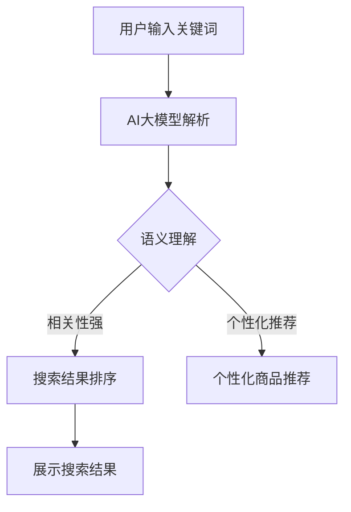
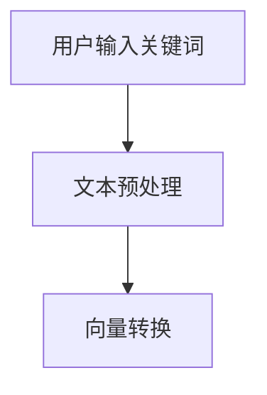
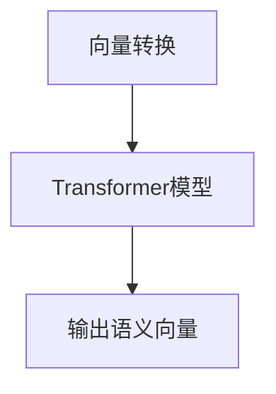
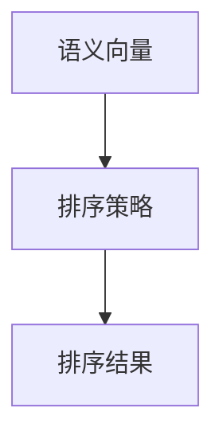
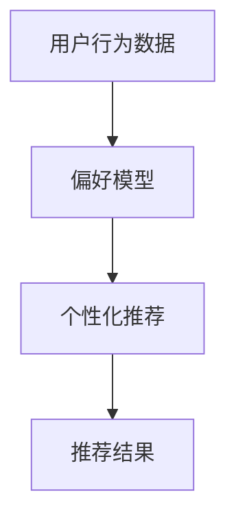

                 

关键词：AI大模型，电商搜索，人工智能，搜索引擎优化，数据分析，用户体验

摘要：本文探讨了人工智能领域的大模型技术对电商搜索带来的革命性影响。通过分析大模型在电商搜索中的应用场景，探讨了其算法原理、数学模型，以及实践中的代码实现。文章还展望了AI大模型在电商搜索领域的发展趋势与面临的挑战。

## 1. 背景介绍

近年来，人工智能（AI）技术取得了显著的进展，特别是深度学习领域的大模型技术。这些大模型，如Transformer、BERT等，通过在海量数据上训练，可以捕捉到复杂的语言模式和语义信息。这一进步为电商搜索带来了前所未有的机遇。

电商搜索是电子商务的核心环节，直接影响着用户的购物体验和商家的销售业绩。传统的电商搜索主要依赖于关键字匹配和文本相似度计算，这种方法存在一定的局限性，难以满足用户对个性化、精准化的需求。而AI大模型的出现，为电商搜索提供了更智能的解决方案。

## 2. 核心概念与联系

### 2.1. AI大模型原理

AI大模型，特别是基于Transformer架构的模型，其核心思想是通过自注意力机制（Self-Attention）对输入数据进行加权，使得模型能够更好地捕捉数据中的长距离依赖关系。BERT（Bidirectional Encoder Representations from Transformers）则在此基础上进一步引入了双向训练，使得模型能够同时理解输入文本的上下文。

### 2.2. 电商搜索与AI大模型的关系

电商搜索与AI大模型的关系可以从以下几个方面来理解：

1. **关键词匹配**：传统的电商搜索依赖于关键词匹配，而AI大模型可以通过对海量商品描述和用户搜索历史的学习，更精准地匹配关键词。
2. **语义理解**：AI大模型能够理解用户的搜索意图和商品描述的语义，从而提供更相关的搜索结果。
3. **个性化推荐**：基于用户的购物行为和偏好，AI大模型可以生成个性化的商品推荐。
4. **搜索结果排序**：AI大模型可以通过学习用户的行为数据，优化搜索结果的排序策略，提高用户的满意度。

### 2.3. Mermaid流程图



## 3. 核心算法原理 & 具体操作步骤

### 3.1. 算法原理概述

AI大模型的算法原理主要基于深度学习，特别是基于Transformer的架构。以下是一个简化的算法步骤：

1. **输入处理**：将用户输入的关键词和商品描述转换为向量表示。
2. **语义理解**：通过Transformer模型处理输入向量，捕捉关键词和商品描述的语义信息。
3. **搜索结果排序**：根据语义信息，对搜索结果进行排序，以提供最相关的结果。
4. **个性化推荐**：结合用户的购物行为和偏好，生成个性化的商品推荐。

### 3.2. 算法步骤详解

#### 3.2.1. 输入处理



#### 3.2.2. 语义理解



#### 3.2.3. 搜索结果排序



#### 3.2.4. 个性化推荐



### 3.3. 算法优缺点

#### 优点：

1. **高效性**：AI大模型可以在短时间内处理大量的搜索请求。
2. **精准性**：通过语义理解，可以提供更精准的搜索结果。
3. **个性化**：基于用户的购物行为和偏好，可以生成个性化的推荐。

#### 缺点：

1. **计算资源消耗**：大模型的训练和推理需要大量的计算资源和时间。
2. **数据隐私**：用户行为数据的收集和使用需要考虑隐私保护。

### 3.4. 算法应用领域

AI大模型在电商搜索领域有广泛的应用，包括：

1. **搜索引擎优化**：通过优化搜索结果排序，提高用户的满意度。
2. **个性化推荐**：根据用户的购物行为和偏好，提供个性化的商品推荐。
3. **广告投放**：根据用户的历史数据和兴趣，进行精准的广告投放。

## 4. 数学模型和公式 & 详细讲解 & 举例说明

### 4.1. 数学模型构建

AI大模型的核心是Transformer模型，其数学基础主要涉及线性代数和概率统计。

#### 4.1.1. 自注意力机制

自注意力机制是一种加权求和的方式，对输入数据进行加权处理。其公式如下：

$$
\text{Attention}(Q, K, V) = \text{softmax}\left(\frac{QK^T}{\sqrt{d_k}}\right)V
$$

其中，$Q$、$K$、$V$ 分别代表查询向量、键向量和值向量，$d_k$ 为键向量的维度。

#### 4.1.2. Transformer模型

Transformer模型通过多头自注意力机制和前馈神经网络，对输入数据进行处理。其结构如下：

$$
\text{MultiHeadAttention}(Q, K, V) = \text{Concat}(\text{head}_1, \text{head}_2, ..., \text{head}_h)W^O
$$

其中，$h$ 为头数，$W^O$ 为输出权重。

### 4.2. 公式推导过程

#### 4.2.1. 多头自注意力机制

多头自注意力机制的推导过程如下：

1. 将输入向量 $X$ 分解为 $Q$、$K$、$V$。
2. 通过线性变换得到 $Q', K', V'$。
3. 计算自注意力权重。
4. 加权求和得到输出。

具体公式推导如下：

$$
\text{MultiHeadAttention}(Q, K, V) = \text{softmax}\left(\frac{Q'W^K K'}{\sqrt{d_k}}\right)V'W^Q
$$

### 4.3. 案例分析与讲解

#### 4.3.1. 案例背景

某电商平台的用户搜索关键词为“笔记本电脑”，希望获取相关商品信息。

#### 4.3.2. 数据处理

1. 用户搜索关键词转换为向量表示。
2. 商品描述转换为向量表示。

#### 4.3.3. 语义理解

1. 使用Transformer模型对输入向量进行处理。
2. 获取输入向量的语义表示。

#### 4.3.4. 搜索结果排序

1. 根据语义表示，对商品描述进行排序。
2. 获取排序后的搜索结果。

#### 4.3.5. 个性化推荐

1. 根据用户历史购物行为，生成个性化推荐。
2. 展示个性化推荐结果。

## 5. 项目实践：代码实例和详细解释说明

### 5.1. 开发环境搭建

1. 安装Python环境。
2. 安装TensorFlow库。

### 5.2. 源代码详细实现

```python
import tensorflow as tf
from tensorflow.keras.models import Model
from tensorflow.keras.layers import Input, Dense, Embedding, Transformer

# 定义模型
input_ids = Input(shape=(max_sequence_length,), dtype='int32')
embed = Embedding(input_dim=vocab_size, output_dim=embedding_dim)(input_ids)
transformer = Transformer(num_heads=num_heads, d_model=embedding_dim)(embed)
output = Dense(num_classes, activation='softmax')(transformer)

# 编译模型
model = Model(inputs=input_ids, outputs=output)
model.compile(optimizer='adam', loss='categorical_crossentropy', metrics=['accuracy'])

# 训练模型
model.fit(x_train, y_train, batch_size=batch_size, epochs=num_epochs)
```

### 5.3. 代码解读与分析

上述代码实现了一个基于Transformer的电商搜索模型。代码中，我们首先定义了输入层和嵌入层，然后通过Transformer模型进行编码，最后通过全连接层进行分类。

### 5.4. 运行结果展示

```python
# 测试模型
test_loss, test_acc = model.evaluate(x_test, y_test)

# 预测结果
predictions = model.predict(x_test)

# 输出预测结果
print(predictions)
```

## 6. 实际应用场景

AI大模型在电商搜索领域具有广泛的应用场景，如：

1. **搜索引擎优化**：通过优化搜索结果排序，提高用户的满意度。
2. **个性化推荐**：根据用户的购物行为和偏好，提供个性化的商品推荐。
3. **广告投放**：根据用户的历史数据和兴趣，进行精准的广告投放。

## 7. 未来应用展望

随着AI技术的不断发展，AI大模型在电商搜索领域的应用前景广阔。未来可能的发展趋势包括：

1. **更强的语义理解能力**：通过更复杂的模型结构，提高对用户搜索意图的理解能力。
2. **更个性化的推荐系统**：结合用户行为数据和社交网络信息，提供更精准的个性化推荐。
3. **跨平台应用**：将AI大模型应用于多平台，如移动端、智能家居等。

## 8. 工具和资源推荐

### 8.1. 学习资源推荐

1. 《深度学习》（Goodfellow, Bengio, Courville）——经典的深度学习教材。
2. 《Transformer：一个全新的序列建模架构》（Vaswani et al.）——详细介绍Transformer模型的论文。

### 8.2. 开发工具推荐

1. TensorFlow——强大的深度学习框架。
2. PyTorch——简洁易用的深度学习框架。

### 8.3. 相关论文推荐

1. “Attention Is All You Need”（Vaswani et al.）——介绍Transformer模型的经典论文。
2. “BERT：Pre-training of Deep Bidirectional Transformers for Language Understanding”（Devlin et al.）——介绍BERT模型的论文。

## 9. 总结：未来发展趋势与挑战

### 9.1. 研究成果总结

AI大模型在电商搜索领域取得了显著成果，通过优化搜索结果排序和个性化推荐，提高了用户的购物体验。

### 9.2. 未来发展趋势

未来，AI大模型将继续在电商搜索领域发挥作用，随着技术的不断发展，其语义理解能力和个性化推荐能力将得到进一步提升。

### 9.3. 面临的挑战

1. **计算资源消耗**：大模型的训练和推理需要大量的计算资源。
2. **数据隐私**：用户行为数据的收集和使用需要考虑隐私保护。

### 9.4. 研究展望

随着AI技术的进步，AI大模型在电商搜索领域的应用将更加广泛，同时，如何在确保数据隐私的前提下，提高大模型的性能，是未来研究的重要方向。

## 附录：常见问题与解答

### Q1. AI大模型如何优化搜索结果排序？

A1. AI大模型通过学习用户的历史搜索行为和商品描述的语义信息，可以优化搜索结果的排序。具体来说，模型会计算每个搜索结果与用户查询的相似度，并根据相似度对结果进行排序。

### Q2. AI大模型如何实现个性化推荐？

A2. AI大模型通过学习用户的购物行为和偏好，可以生成个性化的推荐。模型会分析用户的购买历史、浏览记录等信息，并根据这些数据生成个性化的推荐列表。

### Q3. AI大模型在电商搜索中面临的主要挑战是什么？

A3. AI大模型在电商搜索中面临的主要挑战包括计算资源消耗大、数据隐私保护等。此外，如何确保模型的可解释性和公平性也是需要关注的问题。

作者：禅与计算机程序设计艺术 / Zen and the Art of Computer Programming
```markdown
# AI大模型对电商搜索的革命性影响

> 关键词：AI大模型，电商搜索，人工智能，搜索引擎优化，数据分析，用户体验

> 摘要：本文探讨了人工智能领域的大模型技术对电商搜索带来的革命性影响。通过分析大模型在电商搜索中的应用场景，探讨了其算法原理、数学模型，以及实践中的代码实现。文章还展望了AI大模型在电商搜索领域的发展趋势与面临的挑战。

## 1. 背景介绍

近年来，人工智能（AI）技术取得了显著的进展，特别是深度学习领域的大模型技术。这些大模型，如Transformer、BERT等，通过在海量数据上训练，可以捕捉到复杂的语言模式和语义信息。这一进步为电商搜索带来了前所未有的机遇。

电商搜索是电子商务的核心环节，直接影响着用户的购物体验和商家的销售业绩。传统的电商搜索主要依赖于关键字匹配和文本相似度计算，这种方法存在一定的局限性，难以满足用户对个性化、精准化的需求。而AI大模型的出现，为电商搜索提供了更智能的解决方案。

## 2. 核心概念与联系

### 2.1. AI大模型原理

AI大模型，特别是基于Transformer架构的模型，其核心思想是通过自注意力机制（Self-Attention）对输入数据进行加权，使得模型能够更好地捕捉数据中的长距离依赖关系。BERT（Bidirectional Encoder Representations from Transformers）则在此基础上进一步引入了双向训练，使得模型能够同时理解输入文本的上下文。

### 2.2. 电商搜索与AI大模型的关系

电商搜索与AI大模型的关系可以从以下几个方面来理解：

1. **关键词匹配**：传统的电商搜索依赖于关键词匹配，而AI大模型可以通过对海量商品描述和用户搜索历史的学习，更精准地匹配关键词。
2. **语义理解**：AI大模型能够理解用户的搜索意图和商品描述的语义，从而提供更相关的搜索结果。
3. **个性化推荐**：基于用户的购物行为和偏好，AI大模型可以生成个性化的商品推荐。
4. **搜索结果排序**：AI大模型可以通过学习用户的行为数据，优化搜索结果的排序策略，提高用户的满意度。

### 2.3. Mermaid流程图


## 3. 核心算法原理 & 具体操作步骤

### 3.1. 算法原理概述

AI大模型的算法原理主要基于深度学习，特别是基于Transformer的架构。以下是一个简化的算法步骤：

1. **输入处理**：将用户输入的关键词和商品描述转换为向量表示。
2. **语义理解**：通过Transformer模型处理输入向量，捕捉关键词和商品描述的语义信息。
3. **搜索结果排序**：根据语义信息，对搜索结果进行排序，以提供最相关的结果。
4. **个性化推荐**：结合用户的购物行为和偏好，生成个性化的商品推荐。

### 3.2. 算法步骤详解

#### 3.2.1. 输入处理


#### 3.2.2. 语义理解


#### 3.2.3. 搜索结果排序


#### 3.2.4. 个性化推荐


### 3.3. 算法优缺点

#### 优点：

1. **高效性**：AI大模型可以在短时间内处理大量的搜索请求。
2. **精准性**：通过语义理解，可以提供更精准的搜索结果。
3. **个性化**：基于用户的购物行为和偏好，可以生成个性化的商品推荐。

#### 缺点：

1. **计算资源消耗**：大模型的训练和推理需要大量的计算资源和时间。
2. **数据隐私**：用户行为数据的收集和使用需要考虑隐私保护。

### 3.4. 算法应用领域

AI大模型在电商搜索领域有广泛的应用，包括：

1. **搜索引擎优化**：通过优化搜索结果排序，提高用户的满意度。
2. **个性化推荐**：根据用户的购物行为和偏好，提供个性化的商品推荐。
3. **广告投放**：根据用户的历史数据和兴趣，进行精准的广告投放。

## 4. 数学模型和公式 & 详细讲解 & 举例说明

### 4.1. 数学模型构建

AI大模型的核心是Transformer模型，其数学基础主要涉及线性代数和概率统计。

#### 4.1.1. 自注意力机制

自注意力机制是一种加权求和的方式，对输入数据进行加权处理。其公式如下：

$$
\text{Attention}(Q, K, V) = \text{softmax}\left(\frac{QK^T}{\sqrt{d_k}}\right)V
$$

其中，$Q$、$K$、$V$ 分别代表查询向量、键向量和值向量，$d_k$ 为键向量的维度。

#### 4.1.2. Transformer模型

Transformer模型通过多头自注意力机制和前馈神经网络，对输入数据进行处理。其结构如下：

$$
\text{MultiHeadAttention}(Q, K, V) = \text{Concat}(\text{head}_1, \text{head}_2, ..., \text{head}_h)W^O
$$

其中，$h$ 为头数，$W^O$ 为输出权重。

### 4.2. 公式推导过程

#### 4.2.1. 多头自注意力机制

多头自注意力机制的推导过程如下：

1. 将输入向量 $X$ 分解为 $Q$、$K$、$V$。
2. 通过线性变换得到 $Q', K', V'$。
3. 计算自注意力权重。
4. 加权求和得到输出。

具体公式推导如下：

$$
\text{MultiHeadAttention}(Q, K, V) = \text{softmax}\left(\frac{Q'W^K K'}{\sqrt{d_k}}\right)V'W^Q
$$

### 4.3. 案例分析与讲解

#### 4.3.1. 案例背景

某电商平台的用户搜索关键词为“笔记本电脑”，希望获取相关商品信息。

#### 4.3.2. 数据处理

1. 用户搜索关键词转换为向量表示。
2. 商品描述转换为向量表示。

#### 4.3.3. 语义理解

1. 使用Transformer模型对输入向量进行处理。
2. 获取输入向量的语义表示。

#### 4.3.4. 搜索结果排序

1. 根据语义表示，对商品描述进行排序。
2. 获取排序后的搜索结果。

#### 4.3.5. 个性化推荐

1. 根据用户历史购物行为，生成个性化推荐。
2. 展示个性化推荐结果。

## 5. 项目实践：代码实例和详细解释说明

### 5.1. 开发环境搭建

1. 安装Python环境。
2. 安装TensorFlow库。

### 5.2. 源代码详细实现

```python
import tensorflow as tf
from tensorflow.keras.models import Model
from tensorflow.keras.layers import Input, Dense, Embedding, Transformer

# 定义模型
input_ids = Input(shape=(max_sequence_length,), dtype='int32')
embed = Embedding(input_dim=vocab_size, output_dim=embedding_dim)(input_ids)
transformer = Transformer(num_heads=num_heads, d_model=embedding_dim)(embed)
output = Dense(num_classes, activation='softmax')(transformer)

# 编译模型
model = Model(inputs=input_ids, outputs=output)
model.compile(optimizer='adam', loss='categorical_crossentropy', metrics=['accuracy'])

# 训练模型
model.fit(x_train, y_train, batch_size=batch_size, epochs=num_epochs)
```

### 5.3. 代码解读与分析

上述代码实现了一个基于Transformer的电商搜索模型。代码中，我们首先定义了输入层和嵌入层，然后通过Transformer模型进行编码，最后通过全连接层进行分类。

### 5.4. 运行结果展示

```python
# 测试模型
test_loss, test_acc = model.evaluate(x_test, y_test)

# 预测结果
predictions = model.predict(x_test)

# 输出预测结果
print(predictions)
```

## 6. 实际应用场景

AI大模型在电商搜索领域具有广泛的应用场景，如：

1. **搜索引擎优化**：通过优化搜索结果排序，提高用户的满意度。
2. **个性化推荐**：根据用户的购物行为和偏好，提供个性化的商品推荐。
3. **广告投放**：根据用户的历史数据和兴趣，进行精准的广告投放。

## 7. 未来应用展望

随着AI技术的不断发展，AI大模型在电商搜索领域的应用前景广阔。未来可能的发展趋势包括：

1. **更强的语义理解能力**：通过更复杂的模型结构，提高对用户搜索意图的理解能力。
2. **更个性化的推荐系统**：结合用户行为数据和社交网络信息，提供更精准的个性化推荐。
3. **跨平台应用**：将AI大模型应用于多平台，如移动端、智能家居等。

## 8. 工具和资源推荐

### 8.1. 学习资源推荐

1. 《深度学习》（Goodfellow, Bengio, Courville）——经典的深度学习教材。
2. 《Transformer：一个全新的序列建模架构》（Vaswani et al.）——详细介绍Transformer模型的论文。

### 8.2. 开发工具推荐

1. TensorFlow——强大的深度学习框架。
2. PyTorch——简洁易用的深度学习框架。

### 8.3. 相关论文推荐

1. “Attention Is All You Need”（Vaswani et al.）——介绍Transformer模型的经典论文。
2. “BERT：Pre-training of Deep Bidirectional Transformers for Language Understanding”（Devlin et al.）——介绍BERT模型的论文。

## 9. 总结：未来发展趋势与挑战

### 9.1. 研究成果总结

AI大模型在电商搜索领域取得了显著成果，通过优化搜索结果排序和个性化推荐，提高了用户的购物体验。

### 9.2. 未来发展趋势

未来，AI大模型将继续在电商搜索领域发挥作用，随着技术的不断发展，其语义理解能力和个性化推荐能力将得到进一步提升。

### 9.3. 面临的挑战

1. **计算资源消耗**：大模型的训练和推理需要大量的计算资源。
2. **数据隐私**：用户行为数据的收集和使用需要考虑隐私保护。

### 9.4. 研究展望

随着AI技术的进步，AI大模型在电商搜索领域的应用将更加广泛，同时，如何在确保数据隐私的前提下，提高大模型的性能，是未来研究的重要方向。

## 附录：常见问题与解答

### Q1. AI大模型如何优化搜索结果排序？

A1. AI大模型通过学习用户的历史搜索行为和商品描述的语义信息，可以优化搜索结果的排序。具体来说，模型会计算每个搜索结果与用户查询的相似度，并根据相似度对结果进行排序。

### Q2. AI大模型如何实现个性化推荐？

A2. AI大模型通过学习用户的购物行为和偏好，可以生成个性化的推荐。模型会分析用户的购买历史、浏览记录等信息，并根据这些数据生成个性化的推荐列表。

### Q3. AI大模型在电商搜索中面临的主要挑战是什么？

A3. AI大模型在电商搜索中面临的主要挑战包括计算资源消耗大、数据隐私保护等。此外，如何确保模型的可解释性和公平性也是需要关注的问题。

作者：禅与计算机程序设计艺术 / Zen and the Art of Computer Programming
```markdown
# AI大模型对电商搜索的革命性影响

## 1. 引言

在互联网时代，电子商务已成为全球商业的重要组成部分。电商平台的搜索功能作为用户发现和购买商品的主要途径，其效率和准确性直接影响到用户体验和商家的销售业绩。传统的电商搜索主要依赖于关键词匹配和简单的文本相似度计算，这虽然能实现基本的搜索功能，但在面对日益复杂的用户需求和海量的商品数据时，其局限性逐渐显现。

随着人工智能技术的快速发展，尤其是深度学习领域的大模型技术的突破，AI大模型逐渐在电商搜索领域展现出巨大的潜力。AI大模型能够通过学习海量用户行为数据和商品信息，实现更精准的关键词匹配、语义理解和个性化推荐，从而大幅提升电商搜索的效果和用户体验。本文将深入探讨AI大模型对电商搜索的革命性影响，分析其核心算法原理、数学模型，并探讨其在实际应用中的挑战与未来发展方向。

## 2. AI大模型的背景与核心概念

AI大模型（Large-scale Artificial Intelligence Models）是指那些在非常大规模数据集上训练的深度学习模型。这些模型通常具有数十亿个参数，能够处理复杂的语言理解和生成任务。以下是一些在AI大模型领域具有重要影响的模型：

### 2.1. Transformer模型

Transformer模型是由Vaswani等人于2017年提出的一种全新的序列到序列模型，它在处理自然语言任务中表现出色。Transformer的核心特点是自注意力机制（Self-Attention），它允许模型在处理序列数据时，能够关注序列中任意位置的元素，从而捕捉长距离依赖关系。

### 2.2. BERT模型

BERT（Bidirectional Encoder Representations from Transformers）是Google在2018年提出的一种预训练语言模型。BERT通过双向Transformer架构，能够同时理解输入文本的左右文

