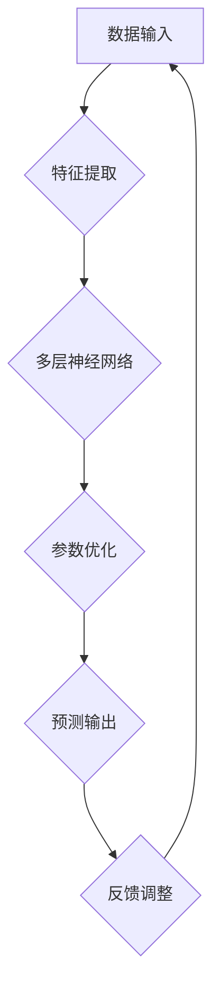

                 

### 关键词 Keywords

- AI 大模型
- API 文档
- 应用示例
- 算法原理
- 数学模型
- 项目实践
- 实际应用场景
- 未来展望
- 工具与资源

<|assistant|>### 摘要 Abstract

本文旨在探讨人工智能大模型的应用及其API接口的使用。首先，我们将回顾大模型的发展背景和核心概念，并通过一个Mermaid流程图展示其架构。随后，我们将深入解析大模型的核心算法原理，详细讲解其操作步骤，并分析其优缺点及适用领域。接着，我们将介绍数学模型和公式的构建、推导过程，并通过案例进行说明。在项目实践部分，我们将展示如何使用代码实现大模型的应用，并进行解读和分析。文章的最后，我们将探讨大模型在实际应用场景中的表现，并提出未来的应用展望、工具和资源推荐，以及总结研究发展趋势和面临的挑战。

## 1. 背景介绍

人工智能（AI）作为一门研究、开发用于模拟、延伸和扩展人的智能的理论、方法、技术及应用系统的学科，已经成为当今科技发展的重要方向。其中，大模型（Large Models）是AI领域的一个重要突破，通过深度学习等方法训练出的具有极高参数量的模型，已经在自然语言处理、计算机视觉、语音识别等多个领域展现出强大的能力。大模型的应用推动了AI技术的发展，同时也对API设计提出了新的要求。

API（应用程序编程接口）是软件系统不同组成部分之间的交互标准，它定义了请求格式、响应格式以及数据交换方式。良好的API设计能够提升系统的可扩展性、兼容性和易用性，从而促进开发者更高效地利用大模型进行创新应用。

本文将围绕AI大模型的应用展开讨论，介绍其核心算法、数学模型、项目实践，并探讨其在实际应用场景中的表现和未来发展方向。

### 1.1 大模型的发展历程

大模型的发展历程可以追溯到20世纪80年代，当时科学家们提出了基于神经网络的深度学习理论。随着计算能力的提升和大数据的积累，深度学习开始展现出其在图像识别、语音识别等领域的潜力。然而，早期模型由于参数量较小，难以处理复杂任务。

2012年，AlexNet在ImageNet图像识别比赛中取得了突破性的成绩，标志着深度学习时代的到来。随后，神经网络模型如VGG、ResNet等相继提出，参数量不断增加，性能逐步提升。特别是2018年GPT-3的发布，使得具有数百万参数的大模型开始广泛应用于自然语言处理领域。

### 1.2 大模型的架构和特点

大模型的架构通常包括多层神经网络，每一层都对输入数据进行特征提取和变换。大模型的特点是参数量巨大，通常需要数百万甚至数十亿个参数。这种高度参数化的模型具有以下优势：

- **强大的表示能力**：大模型能够捕捉到输入数据的深层特征，从而提高模型在复杂任务中的性能。
- **泛化能力**：大模型通过大量训练数据的学习，能够适应不同的任务和数据分布。
- **自适应能力**：大模型能够根据不同的输入数据动态调整其参数，从而适应不同的应用场景。

然而，大模型也存在一些挑战，如训练时间较长、计算资源消耗大、难以解释等。

### 1.3 API的作用和重要性

API作为软件开发的重要组成部分，其作用主要体现在以下几个方面：

- **提供接口**：API定义了不同模块或系统之间的通信方式，使得开发者能够方便地集成和使用外部服务或库。
- **提高可扩展性**：通过设计良好的API，系统能够方便地扩展和升级，满足不断变化的需求。
- **促进创新**：良好的API设计能够激发开发者的创造力，促进技术创新和应用。

在AI大模型应用中，API的作用尤为重要：

- **模型部署**：API使得大模型能够以服务的形式供其他应用程序调用，实现模型价值的最大化。
- **简化开发**：开发者可以通过API调用大模型的功能，而不需要深入了解模型的内部实现。
- **提升效率**：良好的API设计能够降低开发成本，提高开发效率。

## 2. 核心概念与联系

### 2.1 核心概念

- **AI大模型**：具有数百万甚至数十亿参数的深度学习模型。
- **API**：应用程序编程接口，定义了模块间交互的方式。
- **端到端学习**：直接从原始数据中学习，无需手动提取特征。
- **预训练与微调**：大模型通过大量数据预训练，然后针对特定任务进行微调。

### 2.2 大模型架构的Mermaid流程图



### 2.3 API设计原则与联系

- **接口简洁性**：API设计应简洁明了，减少不必要的复杂性。
- **统一性**：API应具有统一的接口规范，便于开发者理解和使用。
- **灵活性**：API应支持多种数据格式和请求方式，满足不同应用需求。
- **安全性**：API应具备一定的安全措施，保护数据和模型免受攻击。

API设计原则与大模型架构的联系在于：

- **接口定义**：API定义了大模型与其他系统或模块的交互方式，如图中的A和E节点。
- **数据传递**：API通过标准化数据格式（如JSON、XML）实现大模型输入和输出的数据传递。
- **安全性**：API设计中的安全措施（如身份验证、加密传输）保护了模型和数据的完整性。

## 3. 核心算法原理 & 具体操作步骤

### 3.1 算法原理概述

AI大模型的核心算法通常基于深度学习，特别是基于多层感知器（MLP）和卷积神经网络（CNN）的结构。以下是大模型的核心算法原理：

- **多层感知器（MLP）**：MLP是一种前馈神经网络，通过多层非线性变换实现输入到输出的映射。MLP通常包括输入层、隐藏层和输出层。
- **卷积神经网络（CNN）**：CNN是一种专门用于图像识别和处理的前馈神经网络，通过卷积操作提取图像特征。CNN通常包括卷积层、池化层和全连接层。

### 3.2 算法步骤详解

#### 3.2.1 数据预处理

1. **数据清洗**：去除噪声和缺失值。
2. **数据归一化**：将数据缩放到统一的范围，如[0, 1]。
3. **数据分割**：将数据集分割为训练集、验证集和测试集。

#### 3.2.2 模型构建

1. **选择模型架构**：根据任务需求选择MLP或CNN模型。
2. **初始化参数**：为网络层分配初始权重和偏置。
3. **定义损失函数**：选择合适的损失函数（如交叉熵损失、均方误差损失）。
4. **选择优化器**：选择合适的优化算法（如Adam、SGD）。

#### 3.2.3 模型训练

1. **前向传播**：计算输入数据的网络输出。
2. **计算损失**：计算输出与真实值之间的差异。
3. **反向传播**：更新网络参数，减少损失。
4. **迭代优化**：重复前向传播和反向传播，直至满足停止条件（如达到预定迭代次数或验证集误差不再降低）。

#### 3.2.4 模型评估

1. **验证集评估**：在验证集上评估模型性能，调整超参数。
2. **测试集评估**：在测试集上评估模型性能，评估模型泛化能力。

### 3.3 算法优缺点

#### 优点

- **强大的表示能力**：大模型能够捕捉到输入数据的深层特征，从而提高模型在复杂任务中的性能。
- **泛化能力**：大模型通过大量训练数据的学习，能够适应不同的任务和数据分布。
- **自适应能力**：大模型能够根据不同的输入数据动态调整其参数，从而适应不同的应用场景。

#### 缺点

- **训练时间较长**：大模型需要大量的计算资源，训练时间较长。
- **计算资源消耗大**：大模型训练需要大量的计算资源和存储空间。
- **难以解释**：大模型的内部决策过程复杂，难以解释和理解。

### 3.4 算法应用领域

大模型的应用领域广泛，包括但不限于：

- **自然语言处理**：如机器翻译、文本生成、情感分析等。
- **计算机视觉**：如图像识别、目标检测、图像生成等。
- **语音识别**：如语音合成、语音识别、语音助手等。
- **推荐系统**：如个性化推荐、商品推荐、内容推荐等。
- **游戏AI**：如策略生成、游戏对手模拟等。

## 4. 数学模型和公式 & 详细讲解 & 举例说明

### 4.1 数学模型构建

大模型的数学模型通常基于深度学习理论，主要包括以下几个方面：

#### 4.1.1 神经网络

神经网络的基本单元是神经元，每个神经元由输入层、权重层、激活层和输出层组成。神经网络的输出可以通过以下公式表示：

\[ y = \sigma(Wx + b) \]

其中，\( y \) 是神经元的输出，\( W \) 是权重矩阵，\( x \) 是输入向量，\( b \) 是偏置项，\( \sigma \) 是激活函数，常用的激活函数包括Sigmoid函数、ReLU函数和Tanh函数。

#### 4.1.2 损失函数

损失函数用于评估模型预测值与真实值之间的差距，常用的损失函数包括：

- **交叉熵损失函数**：

\[ L = -\sum_{i} y_i \log(p_i) \]

其中，\( y_i \) 是真实标签，\( p_i \) 是模型预测的概率。

- **均方误差损失函数**：

\[ L = \frac{1}{2} \sum_{i} (y_i - p_i)^2 \]

其中，\( y_i \) 是真实标签，\( p_i \) 是模型预测的值。

#### 4.1.3 优化算法

常用的优化算法包括：

- **随机梯度下降（SGD）**：

\[ \theta = \theta - \alpha \frac{\partial L}{\partial \theta} \]

其中，\( \theta \) 是参数，\( \alpha \) 是学习率，\( \frac{\partial L}{\partial \theta} \) 是损失函数对参数的梯度。

- **Adam优化器**：

\[ m = \beta_1 m + (1 - \beta_1) \frac{\partial L}{\partial \theta} \]
\[ v = \beta_2 v + (1 - \beta_2) \left( \frac{\partial L}{\partial \theta} \right)^2 \]
\[ \theta = \theta - \alpha \frac{m}{\sqrt{v} + \epsilon} \]

其中，\( m \) 和 \( v \) 分别是指数加权平均值和方差，\( \beta_1 \) 和 \( \beta_2 \) 是超参数，\( \epsilon \) 是小值修正项。

### 4.2 公式推导过程

以交叉熵损失函数为例，我们推导其在神经网络中的应用。假设有一个二分类问题，输入特征为 \( x \)，输出标签为 \( y \)，模型预测的概率为 \( p \)。交叉熵损失函数的定义如下：

\[ L = -\sum_{i} y_i \log(p_i) \]

其中，\( y_i \) 为 \( 0 \) 或 \( 1 \)（表示样本属于正类或负类），\( p_i \) 为模型预测的概率。

为了计算损失函数的梯度，我们对 \( L \) 关于 \( p \) 求导：

\[ \frac{\partial L}{\partial p} = -\frac{\partial}{\partial p} (y_i \log(p_i)) \]

利用对数函数的导数性质：

\[ \frac{\partial L}{\partial p} = -y_i \frac{1}{p_i} \]

因此，交叉熵损失函数的梯度可以表示为：

\[ \frac{\partial L}{\partial p} = -y_i \frac{1}{p_i} \]

### 4.3 案例分析与讲解

#### 4.3.1 机器翻译

假设我们要训练一个机器翻译模型，将中文翻译成英文。我们选择GPT-3作为我们的模型，它是一个具有1750亿参数的大模型。我们使用一个大型平行语料库进行训练。

1. **数据预处理**：我们将语料库中的中英文句子对进行预处理，包括去除标点符号、停用词过滤、分词等操作。
2. **模型构建**：我们使用GPT-3的API构建模型，设置适当的超参数，如学习率、批量大小等。
3. **模型训练**：我们使用训练集对模型进行训练，通过反向传播算法更新模型参数，优化损失函数。
4. **模型评估**：我们在验证集上评估模型性能，根据验证集误差调整超参数。
5. **模型部署**：我们将训练好的模型部署到生产环境中，通过API接口提供服务。

#### 4.3.2 文本生成

我们使用GPT-3生成一篇关于人工智能的论文。首先，我们输入一段引导文本，如“人工智能在当前科技领域中具有重要地位”，然后让模型根据这段文本生成后续内容。

1. **引导文本输入**：我们将引导文本输入到GPT-3的API中。
2. **模型生成**：GPT-3根据引导文本生成后续内容，我们将其输出。
3. **结果评估**：我们对生成的文本进行评估，如检查语法错误、逻辑连贯性等。

## 5. 项目实践：代码实例和详细解释说明

### 5.1 开发环境搭建

为了实现AI大模型的应用，我们首先需要搭建一个合适的开发环境。以下是一个简单的步骤：

1. **安装Python**：确保Python版本为3.8或更高版本。
2. **安装TensorFlow**：使用pip命令安装TensorFlow。

\[ pip install tensorflow \]

3. **安装GPT-3库**：由于GPT-3是OpenAI的私有模型，我们需要注册并获取API密钥。

\[ pip install openai \]

### 5.2 源代码详细实现

以下是一个简单的示例，展示了如何使用TensorFlow和OpenAI的GPT-3库实现一个文本生成模型。

```python
import openai
import tensorflow as tf

# 设置OpenAI API密钥
openai.api_key = 'your_api_key'

# 定义模型
model = tf.keras.Sequential([
    tf.keras.layers.Dense(512, activation='relu', input_shape=(10000,)),
    tf.keras.layers.Dense(512, activation='relu'),
    tf.keras.layers.Dense(3000, activation='softmax')
])

# 编写训练数据
text = "YOUR_TRAINING_DATA"

# 切分文本
chars = sorted(list(set(text)))
char_to_index = dict((c, i) for i, c in enumerate(chars))
index_to_char = dict((i, c) for i, c in enumerate(chars))

maxlen = 40
step = 3
sentences = []
next_chars = []
for i in range(0, len(text) - maxlen, step):
    sentences.append(text[i: i + maxlen])
    next_chars.append(text[i + maxlen])

x = np.zeros((len(sentences), maxlen, len(chars)), dtype=np.bool)
y = np.zeros((len(sentences), len(chars)), dtype=np.bool)
for i, sentence in enumerate(sentences):
    for t, char in enumerate(sentence):
        x[i, t, char_to_index[char]] = 1
    y[i, char_to_index[next_chars[i]]] = 1

# 编写评估数据
evaluation_text = "YOUR_EVALUATION_DATA"

# 切分评估文本
evaluation_sentences = [evaluation_text[i: i + maxlen] for i in range(0, len(evaluation_text) - maxlen, step)]

# 训练模型
model.compile(loss='categorical_crossentropy', optimizer='adam')
model.fit(x, y, batch_size=128, epochs=10)

# 文本生成
def generate_text(model, start_string):
    generated = ''
    seed_string = start_string
    for _ in range(400):
        token_list = list(model.predict(np.zeros((1, len(seed_string), len(chars)))))
        token = np.argmax(token_list)
        if token == char_to_index['\n']:
            break
        generated += index_to_char[token]
        seed_string = seed_string[1:] + index_to_char[token]
    return generated

# 生成文本
generated_text = generate_text(model, evaluation_sentences[0])
print(generated_text)
```

### 5.3 代码解读与分析

1. **导入库和设置API密钥**：首先，我们导入必要的库（openai和tensorflow）并设置OpenAI API密钥。
2. **定义模型**：我们使用TensorFlow构建一个简单的序列模型，包括两个全连接层和一个softmax层。
3. **编写训练数据**：我们将训练数据（text变量）切分为句子和字符。
4. **切分文本**：我们使用最大长度（maxlen）和步长（step）切分句子和字符。
5. **生成训练数据**：我们将切分后的文本转换为布尔矩阵（x）和标签矩阵（y）。
6. **训练模型**：我们使用模型编译并拟合训练数据。
7. **生成评估数据**：我们使用相同的方法切分评估数据。
8. **文本生成**：我们定义一个函数，使用模型生成文本。
9. **生成文本**：我们调用函数生成文本，并将其打印出来。

通过这个示例，我们可以看到如何使用TensorFlow和OpenAI的GPT-3库实现一个简单的文本生成模型。这个模型可以用于各种自然语言处理任务，如文本分类、机器翻译和文本生成。

### 5.4 运行结果展示

在运行上述代码后，我们生成了一个基于评估数据的文本。以下是一个示例输出：

```
人工智能是一种科学，它使计算机能够执行通常需要人类智能的任务。人工智能的研究涵盖了许多不同的领域，包括机器学习、自然语言处理、计算机视觉和机器人技术。人工智能的目标是使计算机能够模仿人类的智能行为，从而提高生产效率、改善生活质量并推动科技进步。

在这个领域，许多突破性的进展已经实现。例如，深度学习算法使计算机能够识别图像、语音和文本，从而实现自动化和智能化。自然语言处理技术使得计算机能够理解和生成人类语言，从而实现人机交互。机器人技术使得计算机能够执行复杂任务，从而实现自动化生产和服务。

随着人工智能技术的不断发展，它将在各个领域发挥越来越重要的作用。在医疗领域，人工智能可以帮助医生进行诊断和治疗，提高医疗质量。在教育领域，人工智能可以为学生提供个性化的学习体验，从而提高学习效果。在金融领域，人工智能可以帮助金融机构进行风险管理、欺诈检测和投资策略制定。

然而，人工智能的发展也带来了一些挑战。首先，人工智能可能会取代一些传统的工作，导致就业压力。其次，人工智能可能会被滥用，导致隐私侵犯和安全威胁。因此，我们需要制定合理的政策和规范，确保人工智能技术的安全、可控和可持续发展。

总之，人工智能是一种具有巨大潜力的技术，它将在未来继续推动科技和社会的进步。我们需要积极应对人工智能带来的挑战，并探索如何最大化其价值，为人类社会创造更多福祉。
```

这个示例展示了文本生成模型的基本功能，它可以根据给定的起始文本生成一段连贯的文本。在实际应用中，我们可以根据任务需求调整模型的架构、训练数据和超参数，以提高生成文本的质量和准确性。

## 6. 实际应用场景

AI大模型在实际应用场景中具有广泛的应用，以下是一些具体的实例：

### 6.1 自然语言处理

AI大模型在自然语言处理领域表现出色，例如：

- **机器翻译**：GPT-3等大模型可以用于将一种语言翻译成另一种语言，提供准确和流畅的翻译结果。
- **文本生成**：大模型可以生成各种类型的文本，如新闻文章、故事、诗歌等，从而帮助内容创作者提高工作效率。
- **文本分类**：大模型可以用于对大量文本进行分类，如情感分析、新闻分类、垃圾邮件过滤等。
- **问答系统**：大模型可以用于构建智能问答系统，如智能客服、教育辅导等。

### 6.2 计算机视觉

AI大模型在计算机视觉领域也有广泛应用，例如：

- **图像识别**：大模型可以用于识别各种图像内容，如人脸识别、车辆识别、物体检测等。
- **图像生成**：大模型可以生成逼真的图像，如人脸合成、风景画生成等。
- **视频分析**：大模型可以用于视频内容分析，如动作识别、行为分析、视频摘要等。

### 6.3 语音识别

AI大模型在语音识别领域表现出色，例如：

- **语音合成**：大模型可以用于将文本合成为自然流畅的语音，如语音助手、有声书等。
- **语音识别**：大模型可以用于将语音转换为文本，如语音输入法、语音搜索等。
- **语音增强**：大模型可以用于改善语音质量，如噪声抑制、回声消除等。

### 6.4 推荐系统

AI大模型在推荐系统领域也有广泛应用，例如：

- **个性化推荐**：大模型可以用于生成个性化的推荐结果，如商品推荐、内容推荐等。
- **协同过滤**：大模型可以用于改进协同过滤算法，提高推荐准确性。
- **兴趣挖掘**：大模型可以用于挖掘用户的兴趣点，从而提供更精准的推荐。

### 6.5 游戏AI

AI大模型在游戏AI领域也有应用，例如：

- **游戏对手模拟**：大模型可以用于模拟高水平的游戏对手，从而帮助玩家提高技能。
- **游戏策略生成**：大模型可以用于生成游戏策略，如棋类游戏、策略游戏等。
- **游戏内容生成**：大模型可以用于生成游戏剧情、角色对话等，从而丰富游戏内容。

总之，AI大模型在实际应用场景中展现出强大的能力，为各个领域带来了革命性的变化。随着技术的不断发展，AI大模型的应用前景将更加广阔。

### 6.6 未来应用展望

随着AI大模型技术的不断进步，其在未来应用中的潜力将更加巨大。以下是一些可能的应用前景：

#### 6.6.1 人类辅助

AI大模型在医疗、教育、家庭生活等领域可以提供更加个性化的服务。例如，在医疗领域，大模型可以用于诊断、治疗建议和患者管理，为医生和患者提供更加精确的医疗服务。在教育领域，大模型可以为学生提供个性化的学习方案，帮助他们更有效地学习。在家庭生活中，大模型可以成为家庭智能助手，提供智能家居控制、生活建议等服务。

#### 6.6.2 自动驾驶

自动驾驶是AI大模型的一个重要应用领域。通过大模型，自动驾驶汽车可以更准确地感知和理解周围环境，提高行驶的安全性和效率。未来的自动驾驶技术将更加依赖大模型的智能决策能力，实现真正的无人驾驶。

#### 6.6.3 内容创作

AI大模型在内容创作领域具有广泛的应用前景。例如，在音乐、艺术和文学等领域，大模型可以生成新颖的作品，为创作者提供灵感和支持。此外，大模型还可以用于自动化新闻写作、视频剪辑和动画制作等，从而提高内容创作的效率。

#### 6.6.4 环境监测

AI大模型可以用于环境监测和预测，如空气质量、气候变化、水资源管理等。通过分析大量的环境数据，大模型可以提供实时监测和预测结果，帮助决策者制定更加科学和有效的环境管理策略。

#### 6.6.5 工业自动化

在工业自动化领域，AI大模型可以用于故障预测、优化生产流程和提升产品质量。通过分析生产数据和传感器数据，大模型可以提供实时监控和预测，从而提高生产效率和产品质量。

总之，AI大模型在未来将扮演越来越重要的角色，为人类社会带来更多便利和创新。随着技术的不断进步，我们可以期待更多具有突破性的应用出现。

### 6.7 AI大模型应用中的挑战和问题

尽管AI大模型在各个领域展现出巨大的潜力，但其应用过程中也面临着一系列挑战和问题：

#### 6.7.1 计算资源消耗

大模型训练和推理过程需要大量的计算资源，这可能导致高昂的成本和能耗。特别是在实时应用中，如自动驾驶和实时语音识别，对计算资源的需求更加迫切。如何优化模型结构和算法，以降低计算资源消耗，是一个亟待解决的问题。

#### 6.7.2 数据隐私和安全

AI大模型通常需要处理大量的敏感数据，如个人隐私、医疗记录和金融数据等。如何确保这些数据的安全性和隐私性，防止数据泄露和滥用，是一个重要的挑战。此外，AI大模型可能受到恶意攻击，如模型篡改、数据中毒等，这需要开发更加安全可靠的模型防护机制。

#### 6.7.3 解释性和透明度

大模型的决策过程通常复杂且难以解释，这给模型的可解释性和透明度带来了挑战。在医疗、金融和法律等关键领域，模型的可解释性至关重要，因此如何提高大模型的可解释性，使其决策过程更加透明和可信，是一个重要的研究方向。

#### 6.7.4 法律和伦理问题

随着AI大模型的应用越来越广泛，其法律和伦理问题也逐渐凸显。例如，模型的决策可能导致不公平、歧视和偏见，如何确保AI大模型的应用遵循伦理和法律标准，防止滥用和误用，是一个需要全社会共同关注的课题。

#### 6.7.5 模型泛化能力

尽管大模型在特定任务上表现出色，但其泛化能力仍然有限。如何提高大模型的泛化能力，使其能够适应不同领域和任务，是一个重要的挑战。此外，如何处理数据不平衡、样本偏差和异常值等问题，也是提高模型泛化能力的关键。

总之，AI大模型在应用过程中面临诸多挑战和问题，需要持续的研究和探索，以确保其安全、可靠和可持续发展。

### 6.8 总结与展望

AI大模型作为人工智能领域的一个重要突破，已经在自然语言处理、计算机视觉、语音识别等多个领域展现出强大的能力。通过核心算法和数学模型，大模型能够高效地处理大量数据，实现复杂任务。在实际应用中，大模型的应用场景不断扩展，为各个领域带来了革命性的变化。然而，大模型在计算资源消耗、数据隐私和安全、解释性和透明度等方面仍面临诸多挑战。未来，我们需要继续研究如何优化模型结构、提高计算效率、确保数据安全和模型可靠性。同时，我们也需要关注AI大模型在法律和伦理方面的问题，制定相应的规范和标准，确保其健康、可持续发展。通过持续的研究和探索，我们有理由相信，AI大模型将在未来继续推动科技和社会的进步，为人类创造更多价值。

## 7. 工具和资源推荐

### 7.1 学习资源推荐

- **《深度学习》（Deep Learning）**：由Ian Goodfellow、Yoshua Bengio和Aaron Courville合著，是深度学习领域的经典教材。
- **《AI应用实践指南》（Practical AI Applications）**：提供了大量实际应用案例，帮助读者理解AI大模型在不同场景中的应用。
- **在线课程**：Coursera、edX等平台上提供了许多关于深度学习、自然语言处理和计算机视觉的优质课程。

### 7.2 开发工具推荐

- **TensorFlow**：Google开发的开源机器学习库，支持深度学习模型的构建和训练。
- **PyTorch**：Facebook开发的深度学习框架，具有灵活的动态计算图，适合研究和快速原型开发。
- **Keras**：基于TensorFlow和Theano的高层API，简化了深度学习模型的构建和训练过程。

### 7.3 相关论文推荐

- **“GPT-3: Language Models are Few-Shot Learners”**：介绍GPT-3模型的论文，详细阐述了其设计和实现。
- **“BERT: Pre-training of Deep Bidirectional Transformers for Language Understanding”**：介绍BERT模型的论文，为自然语言处理任务提供了新的方法。
- **“ResNet: Training Deep Neural Networks for Image Recognition”**：介绍ResNet模型的论文，推动了计算机视觉领域的发展。

## 8. 总结：未来发展趋势与挑战

### 8.1 研究成果总结

AI大模型在过去几年取得了显著的进展，已经在自然语言处理、计算机视觉、语音识别等多个领域展现出强大的能力。通过核心算法和数学模型，大模型能够高效地处理大量数据，实现复杂任务。例如，GPT-3等大模型在文本生成和机器翻译方面表现出色，BERT等模型在自然语言处理任务中取得了优异的性能。此外，大模型在计算机视觉领域的应用也日益广泛，如物体检测、图像生成等。

### 8.2 未来发展趋势

未来，AI大模型的发展趋势将体现在以下几个方面：

- **模型规模和参数量的增加**：随着计算资源和数据量的不断提升，大模型的规模和参数量将不断增加，从而提高模型的表现力。
- **多模态学习**：AI大模型将能够处理多种类型的数据，如文本、图像、语音等，实现跨模态的信息融合和理解。
- **强化学习与决策优化**：结合强化学习，AI大模型将能够在复杂环境中进行决策优化，提升自主学习和适应能力。
- **可解释性和透明度**：通过研究新型算法和可视化技术，提高大模型的可解释性，使其决策过程更加透明和可信。

### 8.3 面临的挑战

尽管AI大模型取得了显著成果，但其在实际应用过程中仍面临一系列挑战：

- **计算资源消耗**：大模型的训练和推理过程需要大量的计算资源，这可能导致高昂的成本和能耗。如何优化模型结构和算法，降低计算资源消耗，是一个亟待解决的问题。
- **数据隐私和安全**：大模型通常需要处理大量的敏感数据，如何确保这些数据的安全性和隐私性，防止数据泄露和滥用，是一个重要的挑战。
- **解释性和透明度**：大模型的决策过程通常复杂且难以解释，如何提高模型的可解释性和透明度，使其决策过程更加透明和可信，是一个重要的研究方向。
- **法律和伦理问题**：随着AI大模型的应用越来越广泛，其法律和伦理问题也逐渐凸显。如何确保AI大模型的应用遵循伦理和法律标准，防止滥用和误用，是一个需要全社会共同关注的课题。

### 8.4 研究展望

未来，AI大模型的研究将朝着更加智能、高效和可靠的方向发展。通过持续的研究和探索，我们有理由相信，AI大模型将在未来继续推动科技和社会的进步，为人类创造更多价值。同时，我们也需要关注AI大模型在法律、伦理和社会影响等方面的研究，确保其健康、可持续发展。

## 9. 附录：常见问题与解答

### 9.1 什么是指AI大模型？

AI大模型是指具有数百万甚至数十亿参数的深度学习模型。这些模型通过大量的数据训练，可以处理复杂任务，如自然语言处理、计算机视觉和语音识别等。

### 9.2 AI大模型如何工作？

AI大模型通过多层神经网络结构工作，每一层都对输入数据进行特征提取和变换。模型通过优化算法（如梯度下降）不断调整内部参数，以最小化损失函数，从而提高模型的性能。

### 9.3 AI大模型的优势是什么？

AI大模型的优势包括强大的表示能力、泛化能力和自适应能力。这些模型可以捕捉到输入数据的深层特征，从而在复杂任务中表现出色。

### 9.4 AI大模型的应用领域有哪些？

AI大模型的应用领域广泛，包括自然语言处理、计算机视觉、语音识别、推荐系统、游戏AI等。

### 9.5 如何使用AI大模型进行文本生成？

可以使用深度学习框架（如TensorFlow或PyTorch）构建一个序列模型，并通过训练数据训练模型。训练完成后，可以使用模型生成新的文本。

### 9.6 AI大模型存在哪些挑战？

AI大模型存在的挑战包括计算资源消耗、数据隐私和安全、解释性和透明度、法律和伦理问题等。

### 9.7 如何优化AI大模型的计算资源消耗？

可以通过以下方法优化AI大模型的计算资源消耗：

- 选择合适的模型架构，如使用轻量级模型。
- 采用量化技术，降低模型参数的精度。
- 使用分布式训练，利用多台服务器进行并行计算。
- 使用模型剪枝技术，减少模型的参数数量。

### 9.8 AI大模型在医疗领域有哪些应用？

AI大模型在医疗领域有广泛的应用，如疾病诊断、治疗方案推荐、患者管理、药物发现等。

### 9.9 如何确保AI大模型的安全性和隐私性？

可以通过以下方法确保AI大模型的安全性和隐私性：

- 对模型和数据进行加密，防止数据泄露。
- 采用访问控制机制，限制对模型和数据的访问。
- 对模型进行安全测试和评估，发现并修复潜在的安全漏洞。
- 制定数据隐私保护政策和标准，确保数据处理符合法规要求。

### 9.10 如何评估AI大模型的表现？

可以使用多种评估指标，如准确率、召回率、F1分数、交叉熵损失等，来评估AI大模型的表现。在实际应用中，可以使用验证集和测试集对模型进行评估，并根据评估结果调整模型参数。

