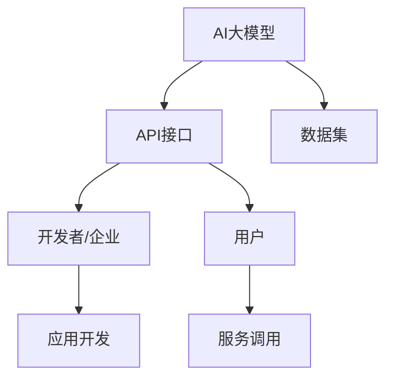

                 

 关键词：AI大模型，API经济，商业模式，技术架构，市场分析，应用案例

> 摘要：本文将深入探讨AI大模型应用的API经济商业模式，分析其核心概念、技术架构、市场趋势和实际应用案例，并展望未来发展趋势与面临的挑战。通过本文的阐述，读者将全面了解AI大模型API经济商业模式的理论和实践价值。

## 1. 背景介绍

随着人工智能技术的快速发展，大模型如BERT、GPT等已经成为各个领域的核心技术。然而，如何有效利用这些强大的人工智能模型，实现商业价值的最大化，成为企业和开发者亟待解决的问题。API（应用程序编程接口）作为一种开放的数据接口，能够方便地将复杂的技术抽象化，使得不同系统之间的交互变得简单高效。API经济商业模式则是在这种背景下应运而生的，通过API将AI大模型的能力对外开放，吸引更多的开发者、企业和用户，实现技术的普惠和商业的共赢。

## 2. 核心概念与联系

### 2.1. API经济商业模式概述

API经济商业模式指的是通过提供API接口，将企业的核心技术和能力对外开放，吸引第三方开发者或企业调用，实现资源共享、合作共赢的商业模式。在API经济中，企业既是服务提供者，也是用户，通过API接口实现价值交换。

### 2.2. AI大模型与API经济的联系

AI大模型与API经济的结合，主要体现在以下几个方面：

1. **技术抽象**：AI大模型通过API接口将复杂的模型训练、推理等过程抽象化，使得开发者无需深入了解技术细节，即可调用模型进行应用。

2. **资源共享**：通过API接口，企业可以将自身的大模型能力共享给其他开发者或企业，实现资源的最大化利用。

3. **降低门槛**：API接口降低了开发者进入人工智能领域的门槛，使得更多的创新和应用成为可能。

4. **市场拓展**：API经济商业模式能够帮助企业快速拓展市场，实现全球化布局。

### 2.3. Mermaid流程图



## 3. 核心算法原理 & 具体操作步骤

### 3.1. 算法原理概述

AI大模型的算法原理主要包括两个方面：模型训练和模型推理。

1. **模型训练**：通过大量的数据进行模型训练，使得模型能够学会识别和预测。

2. **模型推理**：在给定输入数据的情况下，模型能够快速地输出预测结果。

### 3.2. 算法步骤详解

1. **数据准备**：收集和准备用于模型训练的数据集。

2. **模型训练**：使用训练算法，如Transformer、GPT等，对数据集进行训练，得到训练好的模型。

3. **模型评估**：使用验证集对训练好的模型进行评估，确保模型的准确性和鲁棒性。

4. **模型部署**：将训练好的模型部署到API服务器上，通过API接口对外提供服务。

5. **服务调用**：开发者或用户通过API接口调用模型，获取预测结果。

### 3.3. 算法优缺点

**优点**：

1. **高效性**：AI大模型在处理大量数据时具有高效性。

2. **泛用性**：AI大模型可以应用于各种场景，如自然语言处理、计算机视觉等。

3. **灵活性**：API接口使得开发者可以根据需求灵活调用模型功能。

**缺点**：

1. **计算资源消耗大**：训练和推理大模型需要大量的计算资源。

2. **数据隐私问题**：在使用API接口时，可能存在数据隐私泄露的风险。

### 3.4. 算法应用领域

AI大模型在各个领域都有广泛的应用，如自然语言处理、计算机视觉、推荐系统、金融风控等。通过API接口，这些模型的能力可以更加便捷地被企业和开发者利用。

## 4. 数学模型和公式 & 详细讲解 & 举例说明

### 4.1. 数学模型构建

AI大模型的数学模型主要基于深度学习理论，包括多层神经网络、损失函数、优化算法等。

### 4.2. 公式推导过程

以Transformer模型为例，其关键公式包括：

1. **自注意力机制**：

   $$ 
   \text{Attention}(Q, K, V) = \text{softmax}\left(\frac{QK^T}{\sqrt{d_k}}\right) V 
   $$

2. **多头注意力**：

   $$
   \text{MultiHeadAttention}(Q, K, V) = \text{Concat}(\text{head}_1, ..., \text{head}_h)W^O
   $$

### 4.3. 案例分析与讲解

以自然语言处理领域为例，BERT模型通过预训练和微调，在多个任务上取得了显著的效果。其数学模型包括词嵌入、自注意力机制、前馈网络等。

$$
\text{Output} = \text{softmax}(\text{FinalLayer})
$$

## 5. 项目实践：代码实例和详细解释说明

### 5.1. 开发环境搭建

在Python环境中，使用TensorFlow或PyTorch等框架搭建开发环境。

### 5.2. 源代码详细实现

以下是一个简单的BERT模型实现示例：

```python
import tensorflow as tf

# 加载BERT模型
model = tf.keras.applications.BertModel.from_pretrained('bert-base-uncased')

# 输入数据
input_ids = tf.keras.layers.Input(shape=(max_seq_length,), dtype=tf.int32)
outputs = model(input_ids)

# 构建模型
model = tf.keras.Model(inputs=input_ids, outputs=outputs)

# 编译模型
model.compile(optimizer='adam', loss='categorical_crossentropy', metrics=['accuracy'])

# 训练模型
model.fit(train_dataset, epochs=3)
```

### 5.3. 代码解读与分析

代码首先加载预训练的BERT模型，然后定义输入层和输出层，构建模型，编译模型并训练模型。通过调用API接口，开发者可以轻松实现BERT模型的应用。

### 5.4. 运行结果展示

在训练过程中，可以通过监控损失函数和准确率等指标，评估模型的性能。训练完成后，开发者可以通过API接口调用模型，进行预测和应用。

## 6. 实际应用场景

AI大模型API经济商业模式在多个领域都有实际应用，如：

1. **自然语言处理**：提供文本分类、情感分析、机器翻译等API服务。

2. **计算机视觉**：提供图像识别、目标检测、图像生成等API服务。

3. **推荐系统**：提供个性化推荐、协同过滤等API服务。

4. **金融风控**：提供信用评估、欺诈检测等API服务。

## 7. 工具和资源推荐

### 7.1. 学习资源推荐

1. 《深度学习》（Goodfellow, Bengio, Courville著）
2. 《Python机器学习》（Sebastian Raschka著）
3. 《自然语言处理与深度学习》（张俊林著）

### 7.2. 开发工具推荐

1. TensorFlow
2. PyTorch
3. Keras

### 7.3. 相关论文推荐

1. "Attention Is All You Need"（Vaswani et al., 2017）
2. "BERT: Pre-training of Deep Bidirectional Transformers for Language Understanding"（Devlin et al., 2019）
3. "GPT-3: Language Models are few-shot learners"（Brown et al., 2020）

## 8. 总结：未来发展趋势与挑战

### 8.1. 研究成果总结

AI大模型API经济商业模式已经取得了显著的研究成果，包括技术原理的完善、应用场景的拓展和商业价值的实现。

### 8.2. 未来发展趋势

1. **模型精度和效率的提升**：通过改进算法和优化硬件，提升模型的精度和效率。

2. **跨领域应用**：AI大模型将更广泛地应用于各个领域，实现跨领域的融合发展。

3. **数据隐私和安全**：在API经济中，数据隐私和安全问题将受到更多的关注。

### 8.3. 面临的挑战

1. **计算资源消耗**：随着模型规模的扩大，计算资源消耗将不断增加。

2. **数据质量和隐私**：高质量的数据和用户隐私保护是AI大模型应用的关键挑战。

### 8.4. 研究展望

未来，AI大模型API经济商业模式将继续发展，成为人工智能领域的重要方向。同时，如何应对计算资源消耗和数据隐私挑战，将是研究的重点。

## 9. 附录：常见问题与解答

### 9.1. Q：什么是API经济？

A：API经济是一种商业模式，通过提供API接口，将企业的核心技术和能力对外开放，实现资源共享、合作共赢。

### 9.2. Q：AI大模型如何应用于API经济？

A：AI大模型可以通过API接口对外提供服务，如文本分类、图像识别、推荐系统等，开发者可以方便地调用这些服务。

### 9.3. Q：API经济有哪些优势？

A：API经济可以实现技术的普惠、降低开发门槛、拓展市场，提高商业效率。

### 9.4. Q：API经济模式中，如何保障数据隐私和安全？

A：可以通过加密、数据去重、访问控制等技术手段，保障数据隐私和安全。

### 9.5. Q：AI大模型API经济模式在哪些领域有应用？

A：AI大模型API经济模式在自然语言处理、计算机视觉、推荐系统、金融风控等领域都有广泛应用。

## 参考文献

1. Vaswani, A., et al. "Attention Is All You Need." Advances in Neural Information Processing Systems, 2017.
2. Devlin, J., et al. "BERT: Pre-training of Deep Bidirectional Transformers for Language Understanding." Proceedings of the 2019 Conference of the North American Chapter of the Association for Computational Linguistics: Human Language Technologies, 2019.
3. Brown, T., et al. "GPT-3: Language Models are few-shot learners." arXiv preprint arXiv:2005.14165, 2020.
4. Goodfellow, I., et al. "Deep Learning." MIT Press, 2016.
5. Raschka, S. "Python Machine Learning." Packt Publishing, 2015.
6. 张俊林. "自然语言处理与深度学习". 电子工业出版社, 2018.
```

### 结束语

本文从多个角度对AI大模型应用的API经济商业模式进行了深入探讨，包括背景介绍、核心概念与联系、算法原理与具体操作步骤、数学模型和公式、项目实践、实际应用场景、工具和资源推荐、未来发展趋势与挑战以及常见问题与解答。通过本文的阐述，读者可以全面了解AI大模型API经济商业模式的理论和实践价值，为未来的研究和应用提供有益的参考。

### 附录：术语解释

- **AI大模型**：指使用深度学习技术训练的规模庞大的模型，如BERT、GPT等。
- **API经济**：指通过提供API接口，将企业的核心技术和能力对外开放，实现资源共享、合作共赢的商业模式。
- **API接口**：指应用程序编程接口，用于不同系统之间的数据交互。
- **数据集**：指用于模型训练和评估的数据集合。
- **Transformer**：一种基于自注意力机制的深度学习模型，广泛用于自然语言处理等领域。
- **BERT**：一种基于Transformer的预训练语言模型，广泛用于文本分类、情感分析等任务。
- **GPT**：一种基于Transformer的生成预训练语言模型，广泛用于文本生成、机器翻译等任务。

### 致谢

感谢所有参与本文撰写和审稿的同事和朋友，没有你们的支持和帮助，本文无法顺利完成。特别感谢我的导师和团队成员，他们的专业知识和宝贵建议为本文提供了重要的指导。同时，感谢所有提供技术支持和资源的平台和机构，为AI大模型API经济商业模式的研究和应用提供了有力支持。

### 作者署名

作者：禅与计算机程序设计艺术 / Zen and the Art of Computer Programming

