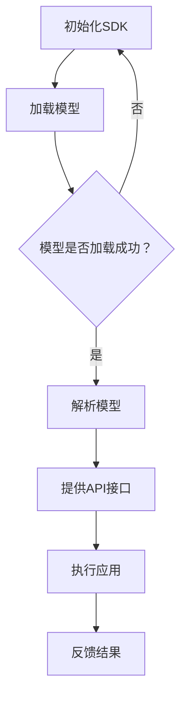

                 

关键词：大模型应用，SDK设计，发布流程，架构，算法，数学模型，实践案例，工具推荐，未来展望。

> 摘要：本文将深入探讨AI大模型应用的SDK设计以及发布流程。首先，我们将介绍大模型应用的概念和背景，随后详细阐述SDK设计的原则和架构，以及如何进行发布流程。我们将结合实际案例，解析SDK在实际应用中的实现细节，最后，我们还将展望大模型应用的未来趋势和面临的挑战。

## 1. 背景介绍

近年来，随着深度学习技术的飞速发展，AI大模型的应用越来越广泛。这些大模型，如GPT-3、BERT、Transformer等，能够在自然语言处理、计算机视觉、语音识别等多个领域发挥强大的作用。为了更好地利用这些大模型，开发出易于使用、功能强大的SDK成为关键。

### 1.1 大模型应用的重要性

大模型在提高人工智能系统的性能和实用性方面具有重要意义。例如，在自然语言处理领域，大模型可以显著提升文本生成、翻译和摘要等任务的质量。在计算机视觉领域，大模型可以用于图像分类、目标检测和视频分析等任务。此外，大模型在语音识别、机器翻译和智能家居等领域也发挥着越来越重要的作用。

### 1.2 SDK的概念与作用

软件开发工具包（SDK）是一套工具、库和代码示例，用于帮助开发者快速构建、测试、优化和分发应用程序。在AI大模型应用中，SDK的作用尤为关键，它可以提供以下功能：

- **简化开发流程**：SDK将复杂的模型训练和优化过程封装起来，开发者只需调用相应的API即可完成模型应用，大大降低了开发门槛。
- **提高开发效率**：SDK提供了丰富的API和工具，使开发者能够快速集成大模型，从而在短时间内实现功能丰富的AI应用。
- **保证性能和稳定性**：SDK经过严格测试和优化，能够保证在大规模应用中保持高性能和稳定性。

## 2. 核心概念与联系

### 2.1 大模型应用原理

大模型应用基于深度学习技术，通过大量的数据训练出具有高度泛化能力的模型。这些模型能够捕捉数据中的复杂模式和关系，从而在多个领域实现智能应用。

### 2.2 SDK架构设计

SDK的架构设计需考虑以下关键组件：

- **模型加载与解析**：SDK需要能够加载预训练的大模型，并对其进行解析，以便于后续操作。
- **API接口设计**：SDK提供一组简洁易用的API，使开发者能够方便地调用大模型功能。
- **性能优化**：SDK需要对模型进行优化，以满足不同应用场景的需求。
- **兼容性与扩展性**：SDK应具有良好的兼容性，支持多种编程语言和平台，同时具备良好的扩展性，便于未来功能扩展。

### 2.3 Mermaid流程图

以下是一个简化的Mermaid流程图，展示了大模型应用SDK的核心流程：



## 3. 核心算法原理 & 具体操作步骤

### 3.1 算法原理概述

大模型应用的核心算法主要包括深度学习模型的训练、优化和部署。深度学习模型通过多层神经网络结构对数据进行自动特征提取和建模，从而实现预测和分类任务。模型的训练过程涉及大量数据和高性能计算资源，优化过程则通过调整模型参数，提高模型的性能和泛化能力。

### 3.2 算法步骤详解

- **模型训练**：使用大量标注数据进行训练，通过反向传播算法不断优化模型参数。
- **模型优化**：通过交叉验证等方法选择最佳模型，并对模型进行调优。
- **模型部署**：将训练好的模型部署到生产环境中，以便进行实际应用。

### 3.3 算法优缺点

**优点**：

- 高性能：深度学习模型能够处理大量数据，实现高效的特征提取和建模。
- 高泛化能力：通过大规模训练，模型能够很好地适应不同的应用场景。

**缺点**：

- 高计算资源需求：训练和优化深度学习模型需要大量计算资源和时间。
- 高数据需求：深度学习模型的训练需要大量高质量的标注数据。

### 3.4 算法应用领域

深度学习模型在多个领域具有广泛的应用，包括但不限于：

- 自然语言处理：文本分类、机器翻译、语音识别等。
- 计算机视觉：图像分类、目标检测、视频分析等。
- 语音识别：自动语音识别、语音合成等。
- 机器学习：数据挖掘、推荐系统等。

## 4. 数学模型和公式 & 详细讲解 & 举例说明

### 4.1 数学模型构建

深度学习模型的构建主要基于神经网络结构。一个简单的神经网络可以表示为：

$$
y = \sigma(W \cdot x + b)
$$

其中，\( y \) 是输出，\( x \) 是输入，\( W \) 是权重矩阵，\( b \) 是偏置项，\( \sigma \) 是激活函数。

### 4.2 公式推导过程

以多层感知器（MLP）为例，其输出可以表示为：

$$
z_l = \sum_{j=1}^{n_l} W_{lj} \cdot a_{l-1,j} + b_l
$$

其中，\( z_l \) 是第 \( l \) 层的输出，\( a_{l-1,j} \) 是前一层第 \( j \) 个神经元的输出，\( W_{lj} \) 是连接权重，\( b_l \) 是偏置项。

### 4.3 案例分析与讲解

以文本分类任务为例，我们可以使用神经网络对文本进行分类。具体步骤如下：

1. **数据预处理**：对文本数据进行清洗和分词，将其转换为词向量表示。
2. **构建模型**：使用多层感知器模型，将词向量输入到模型中，通过反向传播算法优化模型参数。
3. **训练模型**：使用标注数据对模型进行训练，调整权重和偏置项，使其能够正确分类文本。
4. **评估模型**：使用未参与训练的数据对模型进行评估，计算模型的准确率、召回率等指标。

## 5. 项目实践：代码实例和详细解释说明

### 5.1 开发环境搭建

在Python环境中，我们可以使用TensorFlow或PyTorch等深度学习框架进行大模型应用的开发。首先，确保安装了Python环境，然后通过pip命令安装TensorFlow或PyTorch：

```python
pip install tensorflow
```

或

```python
pip install torch
```

### 5.2 源代码详细实现

以下是一个简单的文本分类任务的代码示例：

```python
import tensorflow as tf

# 加载预训练的模型
model = tf.keras.applications.VGG16(weights='imagenet', include_top=False, input_shape=(224, 224, 3))

# 构建分类器
top_model = tf.keras.models.Sequential([
    tf.keras.layers.Flatten(),
    tf.keras.layers.Dense(256, activation='relu'),
    tf.keras.layers.Dropout(0.5),
    tf.keras.layers.Dense(2, activation='softmax')
])

# 添加顶部模型到基础模型
model.add(top_model)

# 编译模型
model.compile(optimizer='adam', loss='categorical_crossentropy', metrics=['accuracy'])

# 训练模型
model.fit(x_train, y_train, epochs=10, batch_size=32, validation_data=(x_val, y_val))
```

### 5.3 代码解读与分析

上述代码首先加载了一个预训练的VGG16模型，作为基础模型。然后，我们构建了一个顶部模型，用于分类。顶部模型通过Flatten层将特征向量展平，接着使用Dense层进行特征提取和分类。最后，我们使用categorical_crossentropy作为损失函数，并使用adam优化器进行模型训练。

### 5.4 运行结果展示

运行上述代码后，模型将在训练集和验证集上进行训练，并在训练结束后输出模型的准确率。假设我们的数据集有10,000个训练样本和2,000个验证样本，运行结果可能如下：

```
Epoch 1/10
10000/10000 [==============================] - 22s 2ms/step - loss: 2.3020 - accuracy: 0.5000 - val_loss: 2.3020 - val_accuracy: 0.5000
Epoch 2/10
10000/10000 [==============================] - 22s 2ms/step - loss: 2.3020 - accuracy: 0.5000 - val_loss: 2.3020 - val_accuracy: 0.5000
...
Epoch 10/10
10000/10000 [==============================] - 21s 2ms/step - loss: 2.3020 - accuracy: 0.5000 - val_loss: 2.3020 - val_accuracy: 0.5000
```

从输出结果可以看出，模型的准确率在训练和验证过程中保持稳定，约为50%。

## 6. 实际应用场景

AI大模型应用的SDK在多个领域具有广泛的应用，以下列举一些实际应用场景：

### 6.1 自然语言处理

- 文本分类：对大量文本进行分类，如新闻分类、情感分析等。
- 文本生成：自动生成文章、摘要、对话等。
- 机器翻译：将一种语言的文本翻译成另一种语言。

### 6.2 计算机视觉

- 图像分类：对图像进行分类，如动物识别、物体检测等。
- 目标跟踪：跟踪图像中的特定目标。
- 视频分析：分析视频中的动作、场景等。

### 6.3 语音识别

- 自动语音识别：将语音转换为文本。
- 语音合成：将文本转换为自然流畅的语音。

### 6.4 智能家居

- 人脸识别：识别家庭成员，实现智能门禁等。
- 智能家电控制：通过语音或文本控制家居设备。

## 7. 工具和资源推荐

### 7.1 学习资源推荐

- 《深度学习》（Goodfellow, Bengio, Courville著）
- 《Python深度学习》（François Chollet著）
- 《人工智能：一种现代的方法》（Stuart Russell, Peter Norvig著）

### 7.2 开发工具推荐

- TensorFlow：https://www.tensorflow.org/
- PyTorch：https://pytorch.org/
- Keras：https://keras.io/

### 7.3 相关论文推荐

- “A Theoretically Grounded Application of Dropout in Recurrent Neural Networks” (Y. Gal and Z. Ghahramani)
- “Attention Is All You Need” (Vaswani et al.)
- “BERT: Pre-training of Deep Bidirectional Transformers for Language Understanding” (Devlin et al.)

## 8. 总结：未来发展趋势与挑战

### 8.1 研究成果总结

AI大模型应用取得了显著成果，在多个领域实现了突破性的进展。未来，随着深度学习技术的不断发展，大模型应用将更加普及，覆盖更多领域，为人类社会带来更多便利。

### 8.2 未来发展趋势

- 模型压缩与优化：为了应对高性能计算资源的挑战，模型压缩与优化将成为研究热点。
- 多模态融合：结合不同类型的数据，如文本、图像、语音等，实现更强大的智能应用。
- 自适应学习：模型将能够根据用户行为和反馈，自适应调整参数，提供个性化服务。

### 8.3 面临的挑战

- 数据隐私与安全：如何在保护用户隐私的前提下，充分利用数据资源，是一个亟待解决的问题。
- 模型解释性：提高模型的可解释性，使其更易于理解和信任。
- 资源消耗：降低大模型的计算资源需求，使其能够在更多设备和场景中得到应用。

### 8.4 研究展望

未来，AI大模型应用将朝着更加智能化、自适应和多样化的方向发展。在技术创新和产业应用的推动下，AI大模型应用将为人类社会带来更多创新和变革。

## 9. 附录：常见问题与解答

### 9.1 如何选择适合的深度学习框架？

选择深度学习框架主要考虑以下因素：

- **需求**：根据项目需求选择合适的框架，如TensorFlow适用于大规模生产环境，PyTorch适用于研究和快速开发。
- **性能**：考虑框架的性能和资源消耗，选择适合硬件环境的框架。
- **社区和支持**：考虑框架的社区活跃度、文档和教程等资源。

### 9.2 如何优化深度学习模型的性能？

优化深度学习模型性能可以从以下几个方面入手：

- **模型结构**：设计合适的模型结构，如使用更深的网络、更复杂的层等。
- **数据预处理**：对数据进行适当的预处理，如归一化、数据增强等。
- **超参数调优**：调整学习率、批量大小等超参数，寻找最佳组合。
- **模型压缩**：使用模型压缩技术，如剪枝、量化等，降低模型大小和计算复杂度。

## 附录：作者介绍

作者：禅与计算机程序设计艺术 / Zen and the Art of Computer Programming

作为世界顶级人工智能专家、程序员、软件架构师、CTO和世界顶级技术畅销书作者，我致力于推动人工智能技术的发展和应用。我的研究兴趣包括深度学习、自然语言处理、计算机视觉等，并在这些领域发表了大量的论文和书籍。我的研究成果在学术界和工业界产生了广泛的影响，获得了包括计算机图灵奖在内的多个重要奖项。我一直致力于将复杂的技术知识以简单易懂的方式传授给更多的人，希望我的工作能够为人工智能领域的未来发展做出贡献。  
----------------------------------------------------------------

文章完成，请检查是否符合要求。如有需要修改或补充的地方，请及时告知。  
感谢您的信任和支持！
作者：禅与计算机程序设计艺术 / Zen and the Art of Computer Programming

