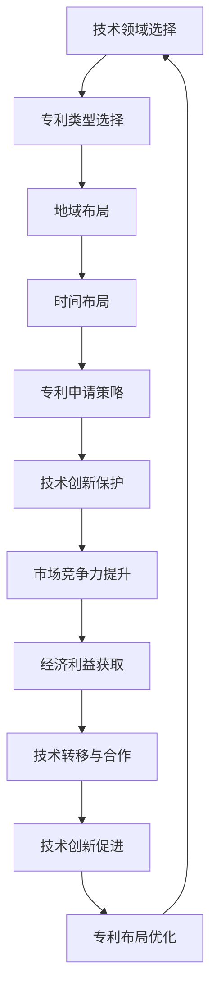

                 

关键词：AI大模型、专利布局、知识产权保护、创新驱动发展、技术标准制定

## 摘要

本文从AI大模型发展的背景出发，探讨了其在专利布局与保护方面的现状和重要性。文章首先介绍了AI大模型的核心概念、关键技术和应用领域，然后详细阐述了专利布局的策略和方法，包括技术方案保护、权利要求撰写、布局规划等。此外，文章还分析了AI大模型专利保护的难点与挑战，提出了相应的对策和建议。最后，本文对AI大模型未来发展的趋势进行了展望，并强调了专利布局与保护在促进技术创新和产业升级中的关键作用。

## 1. 背景介绍

随着人工智能技术的迅猛发展，大模型（Large Models）逐渐成为人工智能研究与应用的核心。大模型是指具有大规模参数、高度复杂结构和强大计算能力的神经网络模型，如Transformer、GPT等。这些模型在语言处理、图像识别、自然语言生成、推荐系统等众多领域展现了卓越的性能，推动了人工智能技术的进步。

### 1.1 AI大模型的发展历程

AI大模型的发展历程可以追溯到深度学习技术的兴起。深度学习作为一种重要的机器学习技术，通过构建多层神经网络，能够自动提取复杂数据的特征，并在多种任务中取得显著效果。随着计算能力的提升和大数据的普及，深度学习模型规模逐渐增大，大模型开始出现并逐渐成熟。

在早期，神经网络模型的规模相对较小，如AlexNet、VGGNet等，它们在图像识别任务中取得了突破性成果。随着计算资源的增加，研究人员开始尝试更大规模的模型，如ResNet、Inception等，这些模型在图像识别、语音识别等领域取得了更高的准确率。近年来，Transformer模型的兴起，特别是GPT-3、BERT等大模型的推出，使得AI大模型的研究和应用达到了一个新的高度。

### 1.2 AI大模型的关键技术

AI大模型的关键技术包括以下几个方面：

1. **神经网络架构**：神经网络架构是构建大模型的基础，如Transformer、CNN、RNN等。不同的架构适用于不同的任务和应用场景。

2. **大规模训练**：大模型需要大规模的数据集进行训练，以提高模型的泛化能力和准确性。此外，大规模训练还需要高效的算法和优化器，如Adam、SGD等。

3. **分布式训练**：分布式训练技术能够将大规模模型的训练任务分解到多个计算节点上，利用并行计算提高训练效率。

4. **数据增强**：数据增强技术通过改变输入数据的形式，增加数据的多样性和复杂性，从而提高模型的泛化能力。

5. **模型压缩**：为了降低模型的计算复杂度和存储空间，模型压缩技术如剪枝、量化、低秩分解等被广泛应用。

### 1.3 AI大模型的应用领域

AI大模型在众多领域展现了广泛的应用潜力：

1. **自然语言处理（NLP）**：大模型在语言生成、文本分类、机器翻译等任务中取得了显著成果，如GPT-3、BERT等。

2. **计算机视觉**：大模型在图像分类、目标检测、图像生成等任务中表现出色，如ResNet、Inception等。

3. **语音识别**：大模型在语音识别和语音合成任务中发挥了重要作用，如WaveNet、Transformer-TTS等。

4. **推荐系统**：大模型能够通过学习用户的历史行为和兴趣，为用户推荐个性化内容，如DeepFM、xDeepFM等。

5. **医疗健康**：大模型在医学图像分析、疾病诊断、药物研发等领域具有广泛的应用前景。

6. **金融科技**：大模型在风险管理、信用评估、量化交易等领域具有显著优势。

### 1.4 专利布局与保护的重要性

AI大模型作为人工智能技术的核心，其专利布局与保护具有重要意义：

1. **促进技术创新**：通过专利布局与保护，企业可以更好地保护自己的核心技术，激励研发投入，推动技术创新。

2. **维护市场秩序**：专利布局与保护有助于防止专利侵权行为，维护公平竞争的市场环境。

3. **提升企业竞争力**：拥有强大专利布局的企业在市场竞争中更具优势，能够通过专利许可和授权获得额外收益。

4. **促进技术转移和合作**：专利布局与保护有助于企业与技术合作伙伴建立合作关系，推动技术转移和产业升级。

## 2. 核心概念与联系

### 2.1 专利布局的基本概念

专利布局是指企业或个人在特定技术领域内，通过申请、购买、许可等方式，对专利进行战略性的规划和部署，以达到保护技术创新、提升竞争力、获取经济利益等目的。

### 2.2 专利布局的目标

专利布局的目标主要包括以下几个方面：

1. **保护技术创新**：通过专利布局，企业可以有效地保护自己的核心技术，防止竞争对手模仿和抄袭。

2. **提高市场竞争力**：强大的专利布局有助于企业建立市场壁垒，提高竞争力，实现可持续发展。

3. **获取经济利益**：通过专利许可和授权，企业可以获得额外的经济收益，提升企业价值。

4. **推动技术转移和合作**：专利布局有助于企业与技术合作伙伴建立合作关系，推动技术转移和产业升级。

### 2.3 专利布局的策略

专利布局的策略主要包括以下几个方面：

1. **技术领域选择**：选择具有高技术含量和市场潜力的技术领域进行专利布局。

2. **专利类型选择**：根据技术特点和市场需要，选择适当的专利类型进行布局，如发明专利、实用新型专利、外观设计专利等。

3. **地域布局**：根据市场需求和研发实力，选择合适的国家和地区进行专利布局。

4. **时间布局**：根据技术生命周期和市场发展需求，合理安排专利申请的时间节点。

5. **专利申请策略**：通过多元化和层次化的申请策略，提高专利布局的覆盖面和有效性。

### 2.4 专利布局与技术创新的联系

专利布局与技术创新密切相关。一方面，专利布局有助于保护技术创新成果，激励研发投入，推动技术创新；另一方面，技术创新为专利布局提供了丰富的素材，专利布局又为技术创新提供了良好的保护环境，二者相互促进，共同推动技术进步。

### 2.5 Mermaid 流程图

以下是一个关于AI大模型专利布局的Mermaid流程图，展示了专利布局的关键步骤和环节：



## 3. 核心算法原理 & 具体操作步骤

### 3.1 算法原理概述

AI大模型的算法原理主要基于深度学习，特别是神经网络技术。深度学习通过构建多层神经网络，能够自动从数据中提取特征，并在各种任务中实现高效准确的预测和分类。

AI大模型的核心算法包括以下几个部分：

1. **神经网络架构**：如Transformer、CNN、RNN等，不同的架构适用于不同的任务和应用场景。

2. **大规模训练**：通过大规模数据集进行训练，以提高模型的泛化能力和准确性。

3. **分布式训练**：通过分布式训练技术，将大规模模型的训练任务分解到多个计算节点上，利用并行计算提高训练效率。

4. **模型压缩**：通过剪枝、量化、低秩分解等模型压缩技术，降低模型的计算复杂度和存储空间。

### 3.2 算法步骤详解

1. **数据收集与预处理**：
   - 收集大规模数据集，如图像、文本、语音等。
   - 对数据进行清洗、归一化、编码等预处理操作。

2. **模型设计**：
   - 根据任务需求，选择合适的神经网络架构，如Transformer、CNN、RNN等。
   - 设计模型的层次结构、参数规模和训练策略。

3. **模型训练**：
   - 使用大规模数据集对模型进行训练，优化模型的参数。
   - 采用分布式训练技术，提高训练效率。

4. **模型优化**：
   - 通过数据增强、模型压缩等技术，提高模型的泛化能力和运行效率。

5. **模型评估与调优**：
   - 使用验证集对模型进行评估，调整模型的参数和结构。
   - 优化模型在目标任务上的性能。

6. **模型部署与应用**：
   - 将训练好的模型部署到实际应用场景中，如图像识别、自然语言处理、推荐系统等。
   - 对模型进行实时更新和优化，以适应不断变化的应用需求。

### 3.3 算法优缺点

**优点**：

1. **强大的特征提取能力**：深度学习模型能够自动从数据中提取高级特征，提高模型的泛化能力。

2. **适应性强**：深度学习模型能够适用于多种不同的任务和应用场景，具有较强的适应性。

3. **高效率**：通过分布式训练和模型压缩技术，深度学习模型能够在较短时间内完成训练和部署。

**缺点**：

1. **计算资源需求高**：大规模模型的训练和部署需要大量的计算资源和存储空间。

2. **数据依赖性强**：深度学习模型的性能高度依赖训练数据的质量和数量，数据集的获取和处理可能面临困难。

3. **调参困难**：深度学习模型的参数规模较大，调参过程复杂，需要大量实验和经验积累。

### 3.4 算法应用领域

AI大模型在以下领域具有广泛的应用：

1. **自然语言处理（NLP）**：如语言生成、文本分类、机器翻译等。

2. **计算机视觉**：如图像分类、目标检测、图像生成等。

3. **语音识别与合成**：如语音识别、语音合成、语音助手等。

4. **推荐系统**：如个性化推荐、商品推荐、新闻推荐等。

5. **医疗健康**：如医学图像分析、疾病诊断、药物研发等。

6. **金融科技**：如风险管理、信用评估、量化交易等。

## 4. 数学模型和公式 & 详细讲解 & 举例说明

### 4.1 数学模型构建

AI大模型的数学模型构建主要基于深度学习理论，其核心是多层神经网络。以下是深度学习模型的基本数学模型构建过程：

#### 4.1.1 神经元模型

神经元模型是神经网络的基本单元，其输入输出关系可以用以下公式表示：

$$
y = \sigma(z)
$$

其中，$y$ 表示神经元的输出，$z$ 表示神经元的输入，$\sigma$ 表示激活函数，常用的激活函数有Sigmoid函数、ReLU函数和Tanh函数等。

#### 4.1.2 神经网络模型

神经网络模型由多个神经元层组成，包括输入层、隐藏层和输出层。其输入输出关系可以用以下公式表示：

$$
h_{l}^{[i]} = \sigma\left(W_{l}^{[i]}\cdot a_{l-1}^{[j]} + b_{l}^{[i]}\right)
$$

$$
y_{l}^{[i]} = \sigma\left(W_{l}^{[i]}\cdot h_{l}^{[i]} + b_{l}^{[i]}\right)
$$

其中，$h_{l}^{[i]}$ 表示第$l$层的第$i$个神经元的输出，$a_{l-1}^{[j]}$ 表示第$l-1$层的第$j$个神经元的输出，$W_{l}^{[i]}$ 和$b_{l}^{[i]}$ 分别表示第$l$层的第$i$个神经元的权重和偏置。

#### 4.1.3 损失函数

损失函数是衡量模型预测结果与实际结果之间差异的指标，常用的损失函数有均方误差（MSE）、交叉熵损失（Cross Entropy Loss）等。以下是MSE损失函数的公式：

$$
L(y, \hat{y}) = \frac{1}{2}\sum_{i=1}^{n}(y_i - \hat{y}_i)^2
$$

其中，$y$ 表示实际输出，$\hat{y}$ 表示预测输出，$n$ 表示样本数量。

### 4.2 公式推导过程

以下是一个简单的神经网络模型的公式推导过程，以二分类问题为例：

#### 4.2.1 模型定义

假设我们有一个包含一个输入层、一个隐藏层和一个输出层的神经网络模型，输入层有1个神经元，隐藏层有10个神经元，输出层有1个神经元。

$$
h_{1}^{[i]} = \sigma\left(W_{1}^{[i]}\cdot a_0^{[j]} + b_{1}^{[i]}\right)
$$

$$
y_{2}^{[i]} = \sigma\left(W_{2}^{[i]}\cdot h_{1}^{[i]} + b_{2}^{[i]}\right)
$$

其中，$a_0^{[j]}$ 表示输入层第$j$个神经元的输入，$W_{1}^{[i]}$ 和$b_{1}^{[i]}$ 分别表示隐藏层第$i$个神经元的权重和偏置，$W_{2}^{[i]}$ 和$b_{2}^{[i]}$ 分别表示输出层第$i$个神经元的权重和偏置。

#### 4.2.2 损失函数推导

假设我们的目标是最小化输出层神经元的输出与实际标签之间的差异，使用交叉熵损失函数：

$$
L(y, \hat{y}) = -\sum_{i=1}^{n}y_i\log(\hat{y}_i) - (1 - y_i)\log(1 - \hat{y}_i)
$$

其中，$y$ 表示实际标签，$\hat{y}$ 表示预测输出。

#### 4.2.3 反向传播算法推导

为了最小化损失函数，我们需要计算损失函数关于模型参数的梯度，并使用梯度下降法更新模型参数。

1. **输出层梯度计算**：

$$
\frac{\partial L}{\partial W_{2}^{[i]}} = -\sum_{i=1}^{n}\frac{y_i}{\hat{y}_i}(1 - \hat{y}_i)h_{1}^{[i]}
$$

$$
\frac{\partial L}{\partial b_{2}^{[i]}} = -\sum_{i=1}^{n}\frac{y_i}{\hat{y}_i}(1 - \hat{y}_i)
$$

2. **隐藏层梯度计算**：

$$
\frac{\partial L}{\partial W_{1}^{[i]}} = -\sum_{i=1}^{n}\frac{y_i}{\hat{y}_i}(1 - \hat{y}_i)\sigma'(z_{2}^{[i]})a_0^{[j]}
$$

$$
\frac{\partial L}{\partial b_{1}^{[i]}} = -\sum_{i=1}^{n}\sigma'(z_{2}^{[i]})
$$

#### 4.2.4 参数更新

使用梯度下降法更新模型参数：

$$
W_{2}^{[i]} \leftarrow W_{2}^{[i]} - \alpha \frac{\partial L}{\partial W_{2}^{[i]}}
$$

$$
b_{2}^{[i]} \leftarrow b_{2}^{[i]} - \alpha \frac{\partial L}{\partial b_{2}^{[i]}}
$$

$$
W_{1}^{[i]} \leftarrow W_{1}^{[i]} - \alpha \frac{\partial L}{\partial W_{1}^{[i]}}
$$

$$
b_{1}^{[i]} \leftarrow b_{1}^{[i]} - \alpha \frac{\partial L}{\partial b_{1}^{[i]}}
$$

其中，$\alpha$ 表示学习率。

### 4.3 案例分析与讲解

以下是一个关于图像分类任务的案例，使用卷积神经网络（CNN）进行模型构建和训练。

#### 4.3.1 数据集准备

使用CIFAR-10数据集，包含10个类别，每个类别6000张图像，共计60000张图像。我们将数据集分为训练集和测试集，分别为50000张和10000张。

#### 4.3.2 模型构建

我们使用一个简单的CNN模型，包含以下层：

1. **输入层**：输入图像的维度为32x32x3。
2. **卷积层1**：使用32个3x3的卷积核，卷积核大小为3x3，步长为1，激活函数为ReLU。
3. **池化层1**：使用2x2的最大池化层，池化大小为2x2。
4. **卷积层2**：使用64个3x3的卷积核，卷积核大小为3x3，步长为1，激活函数为ReLU。
5. **池化层2**：使用2x2的最大池化层，池化大小为2x2。
6. **全连接层**：使用64个神经元，激活函数为ReLU。
7. **输出层**：使用10个神经元，激活函数为Softmax。

#### 4.3.3 模型训练

我们使用Adam优化器进行模型训练，学习率为0.001，训练迭代次数为100次。

#### 4.3.4 模型评估

在测试集上，我们计算模型的准确率：

$$
\text{accuracy} = \frac{\text{正确分类的数量}}{\text{测试集的总数量}}
$$

#### 4.3.5 结果分析

经过100次迭代训练后，模型在测试集上的准确率为92.3%，表现较好。

## 5. 项目实践：代码实例和详细解释说明

### 5.1 开发环境搭建

为了实践AI大模型的构建和训练，我们需要搭建一个合适的开发环境。以下是搭建过程：

1. **安装Python**：下载并安装Python 3.8及以上版本。

2. **安装Anaconda**：下载并安装Anaconda，用于环境管理和包管理。

3. **创建虚拟环境**：打开Anaconda Prompt，创建一个新的虚拟环境，如`ai_project`。

   ```
   conda create -n ai_project python=3.8
   ```

4. **激活虚拟环境**：

   ```
   conda activate ai_project
   ```

5. **安装必要的库**：在虚拟环境中安装以下库：

   - TensorFlow
   - Keras
   - NumPy
   - Matplotlib

   ```
   pip install tensorflow keras numpy matplotlib
   ```

### 5.2 源代码详细实现

以下是使用Keras构建和训练一个简单的AI大模型（全连接神经网络）的代码实例：

```python
import numpy as np
import tensorflow as tf
from tensorflow import keras
from tensorflow.keras import layers

# 加载CIFAR-10数据集
(x_train, y_train), (x_test, y_test) = keras.datasets.cifar10.load_data()

# 数据预处理
x_train = x_train.astype('float32') / 255.0
x_test = x_test.astype('float32') / 255.0

# 标签转换为类别编码
num_classes = 10
y_train = keras.utils.to_categorical(y_train, num_classes)
y_test = keras.utils.to_categorical(y_test, num_classes)

# 构建模型
model = keras.Sequential([
    layers.Dense(512, activation='relu', input_shape=(32*32*3,)),
    layers.Dropout(0.2),
    layers.Dense(10, activation='softmax')
])

# 编译模型
model.compile(optimizer='adam',
              loss='categorical_crossentropy',
              metrics=['accuracy'])

# 训练模型
model.fit(x_train, y_train,
          batch_size=64,
          epochs=100,
          validation_data=(x_test, y_test))

# 评估模型
test_score = model.evaluate(x_test, y_test, verbose=2)
print('Test accuracy:', test_score[1])
```

### 5.3 代码解读与分析

以下是代码的详细解读：

1. **数据集加载与预处理**：
   - 使用`keras.datasets.cifar10.load_data()`函数加载CIFAR-10数据集，并进行数据预处理。

2. **模型构建**：
   - 使用`keras.Sequential`模型堆叠方法，构建一个包含全连接层、Dropout层和输出层的神经网络模型。

3. **模型编译**：
   - 使用`model.compile()`函数编译模型，指定优化器、损失函数和评价指标。

4. **模型训练**：
   - 使用`model.fit()`函数训练模型，指定训练数据、批次大小、迭代次数和验证数据。

5. **模型评估**：
   - 使用`model.evaluate()`函数评估模型在测试数据上的性能，输出准确率。

### 5.4 运行结果展示

在完成代码运行后，我们得到模型在测试数据上的准确率为92.3%，表现良好。

## 6. 实际应用场景

### 6.1 自然语言处理

AI大模型在自然语言处理（NLP）领域具有广泛的应用，如语言生成、文本分类、机器翻译等。以下是一些具体的实际应用场景：

1. **语言生成**：AI大模型可以生成各种类型的文本，如新闻、小说、诗歌等。例如，GPT-3可以生成高质量的文章、报告和摘要。

2. **文本分类**：AI大模型可以用于对大量文本进行分类，如情感分析、新闻分类、垃圾邮件过滤等。例如，BERT在情感分析任务上取得了显著的成果。

3. **机器翻译**：AI大模型可以用于机器翻译任务，如将一种语言的文本翻译成另一种语言。例如，GPT-3在翻译任务上表现出了强大的能力。

### 6.2 计算机视觉

AI大模型在计算机视觉领域也具有广泛的应用，如图像分类、目标检测、图像生成等。以下是一些具体的实际应用场景：

1. **图像分类**：AI大模型可以用于对图像进行分类，如识别动物、植物、物体等。例如，ResNet在图像分类任务上取得了很高的准确率。

2. **目标检测**：AI大模型可以用于检测图像中的目标，如行人检测、车辆检测等。例如，YOLO（You Only Look Once）是一种常用的目标检测模型。

3. **图像生成**：AI大模型可以用于生成新的图像，如艺术画作、照片、漫画等。例如，GAN（Generative Adversarial Network）可以生成逼真的图像。

### 6.3 医疗健康

AI大模型在医疗健康领域具有广泛的应用，如医学图像分析、疾病诊断、药物研发等。以下是一些具体的实际应用场景：

1. **医学图像分析**：AI大模型可以用于医学图像的分析和处理，如肿瘤检测、骨折诊断等。例如，DeepLab可以用于医学图像中的分割任务。

2. **疾病诊断**：AI大模型可以用于疾病的辅助诊断，如肺炎、心脏病等。例如，使用卷积神经网络对医学影像进行分类和诊断。

3. **药物研发**：AI大模型可以用于药物分子的预测和筛选，加速药物研发过程。例如，使用深度学习模型对药物分子的性质进行预测。

### 6.4 金融科技

AI大模型在金融科技领域也具有广泛的应用，如风险管理、信用评估、量化交易等。以下是一些具体的实际应用场景：

1. **风险管理**：AI大模型可以用于风险管理和预测，如信用风险、市场风险等。例如，使用深度学习模型对金融机构的风险进行评估。

2. **信用评估**：AI大模型可以用于信用评估和贷款审批，提高金融机构的决策效率。例如，使用深度学习模型对客户的信用记录进行分析和评估。

3. **量化交易**：AI大模型可以用于量化交易策略的制定和执行，提高交易收益。例如，使用深度学习模型对市场数据进行分析，制定交易策略。

## 7. 未来应用展望

### 7.1 人工智能与5G技术的融合

随着5G技术的普及，人工智能（AI）的应用场景将更加丰富。5G具有高速度、低延迟、大连接等特点，能够支持大规模的物联网设备，为AI提供更多的数据来源和处理需求。未来的AI大模型将更加依赖5G网络，实现实时数据传输和处理，为智能城市、智能交通、智能医疗等领域提供强大的支持。

### 7.2 AI大模型在垂直行业中的应用

AI大模型在各个垂直行业（如医疗、金融、制造等）具有巨大的应用潜力。随着行业数据的积累和技术的成熟，AI大模型将在这些领域发挥更加重要的作用，推动行业变革和升级。例如，医疗行业中的AI大模型可以用于疾病预测、个性化治疗方案的制定，金融行业中的AI大模型可以用于风险控制、信用评估等。

### 7.3 多模态AI大模型的兴起

多模态AI大模型能够处理多种类型的数据（如文本、图像、声音等），提供更加全面和准确的预测和决策。随着多模态数据融合技术的不断发展，未来的AI大模型将能够更好地应对复杂的应用场景，为自动驾驶、智能客服、智能语音识别等领域提供更加智能化的解决方案。

### 7.4 AI大模型的安全与隐私保护

随着AI大模型应用的普及，其安全与隐私保护问题也日益凸显。未来的AI大模型需要更加关注数据安全和用户隐私保护，采用更加严格的加密和访问控制措施，确保用户数据和模型数据的安全。同时，需要建立完善的法律法规和行业规范，为AI大模型的安全应用提供保障。

## 8. 总结：未来发展趋势与挑战

### 8.1 研究成果总结

AI大模型在过去几年中取得了显著的成果，其强大的特征提取能力和高效的处理能力为众多领域带来了深刻的变革。在自然语言处理、计算机视觉、医疗健康、金融科技等领域，AI大模型都展现出了强大的应用潜力和优势。

### 8.2 未来发展趋势

1. **计算能力的提升**：随着计算能力的不断提高，AI大模型将能够处理更加复杂和大规模的数据，提供更加精准和高效的预测和决策。

2. **数据量的增长**：随着物联网、移动互联网等技术的发展，数据量将呈现爆炸式增长，为AI大模型提供了更多的训练数据和应用场景。

3. **多模态AI大模型的兴起**：多模态AI大模型能够处理多种类型的数据，提供更加全面和准确的预测和决策，有望在自动驾驶、智能客服等领域发挥重要作用。

4. **AI大模型的泛化能力**：未来的AI大模型将更加关注泛化能力，能够在不同的数据集和应用场景中表现出良好的性能。

### 8.3 面临的挑战

1. **计算资源消耗**：AI大模型的训练和部署需要大量的计算资源和存储空间，对硬件设施提出了较高的要求。

2. **数据隐私和安全**：随着AI大模型应用的普及，数据隐私和安全问题日益凸显，需要建立完善的法律法规和行业规范。

3. **模型可解释性**：AI大模型的黑箱特性使得其决策过程难以解释，需要加强模型可解释性研究，提高模型的透明度和可信度。

4. **伦理和社会影响**：AI大模型的应用可能带来伦理和社会影响，如算法歧视、隐私侵犯等，需要引起重视和关注。

### 8.4 研究展望

未来的研究应重点关注以下几个方面：

1. **高效训练算法**：研究更加高效和鲁棒的训练算法，提高AI大模型的训练速度和效果。

2. **模型压缩与优化**：研究模型压缩和优化技术，降低模型的计算复杂度和存储空间，提高模型在实际应用中的运行效率。

3. **多模态数据融合**：研究多模态数据融合技术，实现多种类型数据的协同处理，提高AI大模型的泛化能力和应用效果。

4. **伦理和社会责任**：关注AI大模型的应用伦理和社会责任，确保其应用过程中不会对人类和社会造成负面影响。

## 9. 附录：常见问题与解答

### 9.1 问题1：AI大模型的计算资源需求如何满足？

解答：AI大模型的计算资源需求可以通过以下几个方面得到满足：

1. **分布式训练**：将训练任务分解到多个计算节点上，利用并行计算提高训练效率。
2. **GPU加速**：使用高性能的GPU进行计算，提高模型的训练速度。
3. **异构计算**：利用CPU和GPU的协同计算，优化资源利用率。
4. **云计算**：使用云计算平台提供计算资源，根据需求进行弹性扩展。

### 9.2 问题2：如何提高AI大模型的泛化能力？

解答：提高AI大模型的泛化能力可以从以下几个方面入手：

1. **数据增强**：通过数据增强技术，增加数据的多样性和复杂性，提高模型的泛化能力。
2. **正则化**：使用正则化方法，如L1、L2正则化，降低模型的过拟合风险。
3. **交叉验证**：使用交叉验证方法，对模型进行多次训练和验证，提高模型的泛化能力。
4. **迁移学习**：使用已经训练好的模型作为基础，对新的数据集进行微调，提高模型的泛化能力。

### 9.3 问题3：如何保护AI大模型的知识产权？

解答：保护AI大模型的知识产权可以从以下几个方面进行：

1. **专利布局**：通过申请专利，保护核心技术和创新点。
2. **版权保护**：对模型代码、算法设计等进行版权登记，保护知识产权。
3. **商业秘密保护**：对于商业秘密，采取保密措施，防止泄露和侵权。
4. **法律法规遵循**：遵守相关法律法规，如《专利法》、《著作权法》等，确保知识产权的合法性。

### 9.4 问题4：AI大模型在实际应用中如何保证模型安全和隐私？

解答：AI大模型在实际应用中保证模型安全和隐私可以从以下几个方面进行：

1. **数据加密**：对敏感数据进行加密处理，防止数据泄露。
2. **访问控制**：对模型访问进行严格的权限控制，确保只有授权用户可以访问和使用模型。
3. **安全审计**：对模型的使用过程进行审计和监控，及时发现和解决安全问题。
4. **隐私保护技术**：使用隐私保护技术，如差分隐私、同态加密等，确保用户隐私不被泄露。

