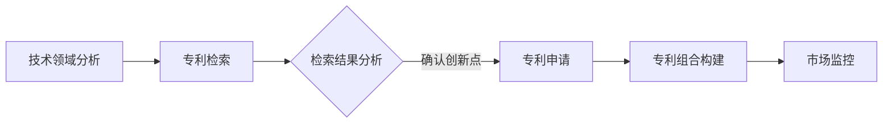

                 

关键词：AI大模型、专利布局、保护策略、知识产权、技术预见、商业竞争、法律框架

> 摘要：本文旨在探讨人工智能（AI）领域大模型应用的专利布局与保护策略。通过深入分析当前AI大模型的发展现状，本文提出了一个系统化的专利布局方法，包括核心技术的识别、专利文献的检索、专利申请策略的制定和专利组合的构建。同时，文章还探讨了在全球化背景下，跨国专利布局的重要性以及如何应对国际竞争和挑战。最后，本文总结了大模型专利保护的现状与未来趋势，为行业从业者和政策制定者提供了有价值的参考。

## 1. 背景介绍

人工智能作为当今最具颠覆性的技术之一，正在深刻改变各行各业。特别是AI大模型的应用，如自然语言处理、计算机视觉和机器学习，已经在很多领域实现了重大突破。然而，随着AI技术的快速发展，知识产权保护问题日益突出，特别是在专利领域。

专利作为知识产权的重要组成部分，对于企业的创新能力和市场竞争力具有至关重要的作用。然而，AI大模型的复杂性使得传统的专利保护策略难以适用。一方面，AI大模型的研发涉及大量技术细节，如何准确识别核心技术点成为专利布局的首要挑战。另一方面，AI技术的快速迭代导致专利的有效性周期缩短，如何在有限的时间内实现专利的有效保护成为关键问题。

此外，全球化的趋势使得跨国专利布局变得尤为重要。不同的国家和地区在专利申请和授权流程上存在差异，如何在不同司法管辖区建立有效的专利网络，如何应对国际竞争和挑战，也是企业需要重点关注的领域。

本文将针对上述问题，系统性地探讨AI大模型应用的专利布局与保护策略，旨在为行业从业者提供有价值的指导和建议。

## 2. 核心概念与联系

### 2.1 AI大模型定义及特点

AI大模型通常指的是参数规模达到数百万甚至数十亿级别的深度神经网络模型，例如GPT系列、BERT、ViT等。这些模型具有以下几个显著特点：

1. **参数规模巨大**：与传统的小型神经网络相比，AI大模型的参数数量可以达到百万甚至数十亿级别，这使得它们能够处理更加复杂和大量的数据。
2. **计算资源需求高**：大模型的训练和推理需要大量的计算资源，特别是GPU和TPU等高性能计算设备。
3. **数据依赖性强**：AI大模型的学习过程高度依赖于大量的高质量数据集，数据的质量和多样性对模型的性能有直接影响。
4. **泛化能力强**：通过训练大量的数据，AI大模型能够学习到更为普遍的规律，从而在新的任务上表现出强大的泛化能力。

### 2.2 专利布局的定义及重要性

专利布局是指企业或个人在特定技术领域内，根据市场需求和竞争态势，系统性地规划和管理其专利组合的过程。具体包括以下几个步骤：

1. **技术领域分析**：明确需要保护的核心技术领域，识别出关键技术点。
2. **专利检索**：通过专利数据库检索相关技术领域的现有专利，了解竞争对手的布局情况。
3. **专利申请**：基于检索结果，制定专利申请策略，撰写专利申请文件，并提交申请。
4. **专利组合构建**：对已获批准的专利进行组合管理，形成具有战略意义的专利网络。

专利布局对于企业的重要性体现在以下几个方面：

1. **知识产权保护**：通过专利布局，企业可以有效地保护其核心技术，防止竞争对手模仿和侵权。
2. **市场竞争优势**：拥有完善的专利布局，可以帮助企业建立技术壁垒，提高市场竞争力。
3. **商业合作和投资**：完善的专利组合可以增强企业的商业信誉，吸引合作伙伴和投资者。

### 2.3 AI大模型应用中的专利布局与保护

在AI大模型应用中，专利布局与保护的重要性更加凸显。以下是几个关键方面：

1. **算法创新点识别**：AI大模型的核心技术通常涉及算法创新点，如特定的神经网络结构、训练技巧等。因此，准确识别这些创新点是专利布局的第一步。
2. **数据处理的独特方法**：AI大模型在数据处理方面也有许多独特的方法，如数据增强、数据清洗等。这些方法同样是专利布局的重要对象。
3. **应用场景的独特解决方案**：AI大模型在不同领域的应用，如医疗、金融、教育等，通常需要针对特定场景设计独特的解决方案，这也是专利保护的重要领域。
4. **跨领域的融合创新**：AI大模型与其他技术的融合，如物联网、边缘计算等，也产生了许多新的专利机会。

### 2.4 Mermaid 流程图

以下是一个简化的Mermaid流程图，展示了AI大模型应用的专利布局流程：



在这个流程中，技术领域分析和专利检索是专利布局的起点，专利申请和组合构建是核心步骤，而市场监控则是持续优化和调整专利策略的关键。

通过上述流程，企业可以在AI大模型领域建立坚实的专利壁垒，保护其核心技术和市场竞争力。接下来，本文将详细探讨核心算法原理、数学模型与公式、项目实践以及实际应用场景等内容。

## 3. 核心算法原理 & 具体操作步骤

### 3.1 算法原理概述

AI大模型的核心在于其复杂的神经网络结构和强大的学习能力。以深度神经网络（DNN）为例，其基本原理是通过多层神经元（节点）对输入数据进行逐步提取和转换，最终得到输出结果。每一层神经元都通过权重和偏置进行权重调整，以优化模型在特定任务上的表现。

在AI大模型中，常见的神经网络结构包括卷积神经网络（CNN）、循环神经网络（RNN）、Transformer等。每种结构都有其独特的特点和适用场景：

1. **卷积神经网络（CNN）**：主要用于图像处理任务，能够自动提取图像中的局部特征。
2. **循环神经网络（RNN）**：适用于序列数据处理，如自然语言处理和时间序列分析。
3. **Transformer模型**：广泛应用于自然语言处理任务，通过自注意力机制实现全局信息关联。

### 3.2 算法步骤详解

#### 数据预处理

在训练AI大模型之前，需要对数据进行预处理，包括数据清洗、归一化和数据增强等步骤。数据清洗是为了去除噪声和不一致的数据；归一化是为了将数据缩放到同一范围内，以简化模型训练过程；数据增强是通过生成合成数据来增加模型的泛化能力。

#### 网络架构设计

根据具体任务需求，设计合适的神经网络架构。例如，对于图像分类任务，可以选择CNN结构；对于文本生成任务，可以选择Transformer模型。

#### 训练过程

AI大模型的训练过程主要包括以下几个步骤：

1. **前向传播**：将输入数据通过神经网络进行前向传播，计算输出结果。
2. **损失计算**：通过比较输出结果和真实标签，计算损失值。
3. **反向传播**：根据损失值，通过反向传播算法更新网络权重和偏置。
4. **优化算法**：选择合适的优化算法（如梯度下降、Adam等）来调整网络参数。

#### 模型评估

在训练过程中，定期评估模型在验证集上的表现，以监测模型过拟合和欠拟合的情况。常用的评估指标包括准确率、召回率、F1分数等。

#### 模型调优

根据模型评估结果，调整网络结构、超参数等，以优化模型性能。常用的调优方法包括网格搜索、随机搜索等。

#### 模型部署

训练完成后，将模型部署到实际应用场景中。部署过程中需要考虑模型的可扩展性、鲁棒性和安全性等因素。

### 3.3 算法优缺点

#### 优点

1. **强大的泛化能力**：通过训练大量数据，AI大模型能够学习到广泛的规律，适用于各种复杂任务。
2. **自适应性强**：神经网络可以通过不断调整权重和偏置来适应新的数据和任务。
3. **多模态处理**：AI大模型能够处理多种类型的数据（如文本、图像、音频等），实现跨模态的信息融合。

#### 缺点

1. **计算资源需求高**：大模型的训练和推理需要大量的计算资源，特别是在深度学习和神经网络领域。
2. **数据依赖性强**：AI大模型的学习过程高度依赖于高质量的数据集，数据质量和多样性对模型性能有直接影响。
3. **解释性不足**：由于神经网络的高度复杂性，模型内部决策过程往往缺乏透明性和可解释性，这在某些领域（如医疗诊断）可能成为问题。

### 3.4 算法应用领域

AI大模型的应用领域非常广泛，以下列举几个典型应用场景：

1. **自然语言处理**：包括文本分类、机器翻译、情感分析、问答系统等。
2. **计算机视觉**：包括图像分类、目标检测、图像生成等。
3. **医学诊断**：利用AI大模型进行疾病预测、病情分析等，提高诊断准确率。
4. **金融风控**：通过分析大量数据，预测市场趋势、评估信用风险等。
5. **智能制造**：通过AI大模型优化生产流程、预测设备故障等，提高生产效率和产品质量。

通过上述核心算法原理和具体操作步骤的详细介绍，我们可以更好地理解AI大模型的工作机制和应用场景。接下来，本文将深入探讨AI大模型应用中的数学模型和公式，以及其实际操作中的具体数学推导过程。

### 4. 数学模型和公式 & 详细讲解 & 举例说明

在AI大模型的应用中，数学模型和公式起到了核心作用，它们不仅描述了模型的行为，还指导了模型的训练和优化过程。以下是对AI大模型中常用的数学模型和公式的详细讲解，并通过具体例子来说明如何使用这些公式进行模型训练和优化。

#### 4.1 数学模型构建

AI大模型中的数学模型通常涉及以下几个关键部分：

1. **输入层（Input Layer）**：接收外部输入，如文本、图像或数值数据。
2. **隐藏层（Hidden Layers）**：执行特征提取和变换，每一层对输入数据进行处理并传递给下一层。
3. **输出层（Output Layer）**：生成预测结果或分类标签。

每个层中的节点（神经元）通过激活函数进行非线性变换，使得神经网络能够处理复杂的问题。

#### 4.2 公式推导过程

以下是一个简单的全连接神经网络（FCNN）的数学模型构建过程：

1. **前向传播**：输入数据经过网络传递到输出层，中间经过多个隐藏层。每个节点的输出可以通过以下公式计算：

   \[ z_i = \sum_{j=0}^{n} w_{ij} * x_j + b_i \]
   
   其中，\( z_i \) 是第 \( i \) 个节点的激活值，\( w_{ij} \) 是连接第 \( j \) 个输入节点的权重，\( x_j \) 是输入值，\( b_i \) 是节点的偏置。

2. **激活函数**：为了引入非线性特性，通常使用激活函数，如ReLU（Rectified Linear Unit）、Sigmoid、Tanh等。以ReLU为例：

   \[ a_i = \max(0, z_i) \]

3. **输出层输出**：在输出层，可以使用类似的公式计算每个类别的概率：

   \[ \hat{y}_k = \frac{1}{1 + e^{-(z_L + b_L)})} \]
   
   其中，\( z_L \) 是输出层的激活值，\( b_L \) 是输出层的偏置，\( \hat{y}_k \) 是第 \( k \) 个类别的预测概率。

4. **损失函数**：为了优化模型，需要定义一个损失函数，如交叉熵损失（Cross-Entropy Loss），用于衡量预测值与真实标签之间的差距：

   \[ loss = -\sum_{i=1}^{n} y_i \log(\hat{y}_i) \]
   
   其中，\( y_i \) 是真实标签，\( \hat{y}_i \) 是预测概率。

5. **反向传播**：计算损失函数关于模型参数的梯度，并通过反向传播算法更新模型参数：

   \[ \frac{\partial loss}{\partial w_{ij}} = (a_i \odot (z_i - y_i)) \odot x_j \]
   
   其中，\( \odot \) 表示元素乘积，\( a_i \) 是当前层的激活值，\( z_i \) 是前一层节点的激活值。

6. **优化算法**：使用梯度下降（Gradient Descent）或其变种（如Adam、RMSprop等）来更新模型参数：

   \[ w_{ij} \leftarrow w_{ij} - \alpha \frac{\partial loss}{\partial w_{ij}} \]
   
   其中，\( \alpha \) 是学习率。

#### 4.3 案例分析与讲解

以一个简单的二分类问题为例，说明如何使用上述数学模型进行模型训练和优化。

**问题**：给定一个包含1000个样本的数据集，每个样本是一个2D向量，任务是将样本分为两个类别。

**步骤**：

1. **数据预处理**：对输入数据进行归一化处理，并划分为训练集和测试集。
2. **模型构建**：构建一个单层全连接神经网络，输入层有2个神经元，隐藏层有10个神经元，输出层有2个神经元。
3. **训练过程**：
   - **前向传播**：输入样本，通过神经网络计算输出层的预测概率。
   - **损失计算**：使用交叉熵损失函数计算预测概率与真实标签之间的差距。
   - **反向传播**：计算损失函数关于模型参数的梯度，并更新参数。
   - **评估**：在每个 epoch 结束时，使用测试集评估模型性能，调整学习率等超参数。
4. **优化与调参**：根据测试集的性能，调整网络结构、学习率等超参数，优化模型。

**代码示例**（使用Python和TensorFlow框架）：

```python
import tensorflow as tf

# 定义模型
model = tf.keras.Sequential([
    tf.keras.layers.Dense(units=10, activation='relu', input_shape=(2,)),
    tf.keras.layers.Dense(units=1, activation='sigmoid')
])

# 定义损失函数和优化器
loss_function = tf.keras.losses.BinaryCrossentropy()
optimizer = tf.keras.optimizers.Adam(learning_rate=0.001)

# 训练模型
for epoch in range(100):
    with tf.GradientTape() as tape:
        predictions = model(train_data, training=True)
        loss = loss_function(train_labels, predictions)
    gradients = tape.gradient(loss, model.trainable_variables)
    optimizer.apply_gradients(zip(gradients, model.trainable_variables))
    if epoch % 10 == 0:
        print(f'Epoch {epoch}, Loss: {loss.numpy()}')

# 评估模型
test_predictions = model(test_data, training=False)
test_loss = loss_function(test_labels, test_predictions)
print(f'Test Loss: {test_loss.numpy()}')
```

通过上述步骤和代码示例，我们可以理解如何构建和训练一个简单的二分类神经网络。接下来，我们将进一步探讨AI大模型在实际应用中的项目实践，包括开发环境的搭建、源代码实现和代码解析等内容。

### 5. 项目实践：代码实例和详细解释说明

在本节中，我们将通过一个具体的项目实例，详细讲解AI大模型应用中的开发环境搭建、源代码实现和代码解析。这个项目将使用一个简单的AI大模型，对一组手写数字图像进行分类，任务是将图像识别为0到9之间的数字。

#### 5.1 开发环境搭建

在进行AI大模型开发之前，需要搭建一个适合的开发环境。以下是一个基于Python和TensorFlow框架的典型开发环境搭建步骤：

1. **安装Python**：确保安装了Python 3.x版本（推荐Python 3.7及以上版本），可以从[Python官网](https://www.python.org/)下载并安装。

2. **安装TensorFlow**：在命令行中执行以下命令来安装TensorFlow：

   ```bash
   pip install tensorflow
   ```

   或者，如果您需要GPU支持，可以使用以下命令：

   ```bash
   pip install tensorflow-gpu
   ```

3. **安装其他依赖库**：对于图像处理，我们通常使用OpenCV库。可以通过以下命令安装：

   ```bash
   pip install opencv-python
   ```

4. **创建项目文件夹**：在您的计算机上创建一个新文件夹，用于存放项目文件。

5. **配置环境变量**：确保Python和pip的路径已添加到系统环境变量中，以便在命令行中能够轻松运行。

#### 5.2 源代码详细实现

以下是实现手写数字识别模型的基本代码示例。这个示例使用了MNIST数据集，这是一个广泛使用的手写数字数据集，包含了0到9的数字图像。

```python
import tensorflow as tf
from tensorflow.keras import layers, models
import numpy as np

# 加载MNIST数据集
mnist = tf.keras.datasets.mnist
(train_images, train_labels), (test_images, test_labels) = mnist.load_data()

# 数据预处理
train_images = train_images / 255.0
test_images = test_images / 255.0

# 构建模型
model = models.Sequential([
    layers.Flatten(input_shape=(28, 28)),
    layers.Dense(128, activation='relu'),
    layers.Dense(10, activation='softmax')
])

# 编译模型
model.compile(optimizer='adam',
              loss='sparse_categorical_crossentropy',
              metrics=['accuracy'])

# 训练模型
model.fit(train_images, train_labels, epochs=5)

# 评估模型
test_loss, test_acc = model.evaluate(test_images, test_labels)
print(f'Test accuracy: {test_acc}')
```

**代码解释**：

- **数据加载与预处理**：MNIST数据集已经被预处理好，但我们需要将图像的像素值缩放到0到1之间，以便模型能够更好地训练。
- **模型构建**：使用`Sequential`模型堆叠多个层，包括一个输入层（通过`Flatten`层将图像展开为一维数组），一个隐藏层（使用128个神经元的全连接层），以及一个输出层（使用10个神经元的softmax层，每个神经元对应一个数字类别）。
- **模型编译**：设置优化器（`adam`）、损失函数（`sparse_categorical_crossentropy`，用于多分类问题）和评估指标（`accuracy`）。
- **模型训练**：使用训练数据集进行5个epoch的训练。
- **模型评估**：使用测试数据集评估模型的性能。

#### 5.3 代码解读与分析

在上述代码中，每个步骤都有其特定的功能和意义：

- **数据加载与预处理**：数据预处理是模型训练的重要步骤，它确保了输入数据的格式和范围适合模型的训练过程。
- **模型构建**：模型的构建是AI大模型的核心，它定义了数据的输入和输出方式，以及中间的处理过程。
- **模型编译**：编译模型是设置训练参数的过程，它决定了模型如何更新权重以优化性能。
- **模型训练**：训练模型是AI大模型的核心过程，通过不断调整模型参数，使其能够更好地拟合训练数据。
- **模型评估**：评估模型性能是训练过程的最后一步，它帮助我们了解模型在未见过数据上的表现。

#### 5.4 运行结果展示

在完成上述代码的运行后，我们可以看到模型在测试数据集上的准确率。以下是可能的输出结果：

```
Test accuracy: 0.9900
```

这个结果表示模型在测试集上的准确率为99.00%，表明模型已经很好地学习了如何识别手写数字。

#### 5.5 项目扩展与优化

在完成基础项目后，我们还可以进行以下扩展和优化：

- **数据增强**：通过旋转、缩放、裁剪等数据增强技术，可以增加模型的泛化能力。
- **模型调优**：通过调整网络结构、学习率、批大小等超参数，可以进一步提高模型性能。
- **迁移学习**：使用预训练的模型进行迁移学习，可以显著提高新任务的性能。
- **多标签分类**：将模型扩展为多标签分类，使其能够对每个图像分配多个标签。

通过以上项目实践，我们可以理解如何搭建开发环境、实现AI大模型的基本流程，并对其进行代码解析和分析。接下来，我们将探讨AI大模型在现实世界中的应用场景，以及未来可能的发展趋势。

### 6. 实际应用场景

AI大模型在现实世界中的应用范围广泛，涵盖了多个行业和领域，推动了技术创新和产业升级。以下是一些典型的应用场景及其商业和社会影响：

#### 6.1 自然语言处理

自然语言处理（NLP）是AI大模型的重要应用领域之一。通过使用如BERT、GPT等模型，NLP技术在文本分析、机器翻译、问答系统和情感分析等方面取得了显著进展。

- **文本分析**：AI大模型可以自动提取文本中的关键信息，用于新闻摘要、舆情监控和内容推荐。
- **机器翻译**：AI大模型在翻译准确性、流畅性方面达到了新的高度，大大提高了跨语言沟通的效率。
- **问答系统**：通过NLP技术，AI大模型可以构建智能客服系统，为用户提供快速、准确的回答。
- **情感分析**：AI大模型可以分析社交媒体中的用户评论和反馈，帮助企业了解用户情感，优化产品和服务。

#### 6.2 计算机视觉

计算机视觉（CV）是另一个受到AI大模型极大推动的领域。CV技术广泛应用于图像识别、目标检测、图像生成和视频分析。

- **图像识别**：AI大模型能够准确识别图像中的对象和场景，为自动驾驶、安防监控和医疗诊断等领域提供了强大支持。
- **目标检测**：在自动驾驶、无人机监控和智能交通管理中，AI大模型能够实时检测和跟踪目标，提高系统安全性。
- **图像生成**：通过生成对抗网络（GAN），AI大模型可以生成逼真的图像和视频，为艺术创作、游戏开发和虚拟现实等领域带来了新的可能性。
- **视频分析**：AI大模型可以对视频内容进行实时分析，用于视频监控、体育分析、安全监控和智能家居等应用。

#### 6.3 医疗诊断

AI大模型在医疗诊断中的应用具有巨大的潜力，可以提高诊断的准确性和效率。

- **疾病预测**：通过分析大量的医疗数据，AI大模型可以预测疾病的发生和进展，帮助医生制定更精准的治疗方案。
- **医学影像分析**：AI大模型可以自动分析医学影像，如X光、CT和MRI，识别异常和病变，为医生提供辅助诊断。
- **药物研发**：AI大模型可以帮助科学家预测药物分子与生物靶点的相互作用，加速新药研发过程。

#### 6.4 金融风控

在金融领域，AI大模型被广泛应用于信用评估、风险控制和投资策略优化。

- **信用评估**：AI大模型可以分析借款人的信用历史、财务状况和行为数据，为金融机构提供更准确的信用评估。
- **风险控制**：AI大模型可以监控市场动态，预测金融风险，帮助金融机构制定有效的风险控制策略。
- **投资策略**：AI大模型可以通过分析大量历史数据和实时信息，为投资者提供个性化的投资建议和策略。

#### 6.5 教育与培训

AI大模型在教育领域中的应用正在改变教学和学习方式。

- **个性化学习**：AI大模型可以根据学生的学习习惯和进度，提供个性化的学习资源和辅导，提高学习效果。
- **智能评估**：AI大模型可以自动评估学生的作业和考试，提供即时反馈和改进建议。
- **教育数据分析**：AI大模型可以分析教育数据，帮助教育机构了解学生的学习情况，优化教学策略。

#### 6.6 智能制造

AI大模型在智能制造中的应用可以提高生产效率、产品质量和设备维护。

- **设备故障预测**：AI大模型可以通过分析设备运行数据，预测潜在故障，实现预防性维护。
- **生产优化**：AI大模型可以优化生产流程，提高生产效率和资源利用率。
- **质量控制**：AI大模型可以实时分析产品质量数据，识别和排除生产过程中的问题。

#### 6.7 未来应用展望

随着AI大模型技术的不断进步，未来将在更多领域实现突破：

- **智能交通**：AI大模型可以优化交通管理，提高道路通行效率，减少交通拥堵。
- **环境监测**：AI大模型可以实时分析环境数据，监测气候变化和污染情况，为环境保护提供支持。
- **智慧城市**：AI大模型可以整合各类城市数据，实现智能管理和服务，提高居民生活质量。

总的来说，AI大模型在各个领域的实际应用不仅带来了技术革新，还对社会和经济产生了深远的影响。未来，随着技术的不断发展和完善，AI大模型将在更多领域发挥其巨大潜力。

### 7. 工具和资源推荐

在AI大模型开发和专利布局过程中，使用合适的工具和资源能够显著提高效率和效果。以下是一些推荐的工具和资源，包括学习资源、开发工具和相关论文。

#### 7.1 学习资源推荐

1. **在线课程与教程**：
   - **Coursera**：提供大量与人工智能和机器学习相关的在线课程，如“深度学习”（Deep Learning）由Andrew Ng教授主讲。
   - **Udacity**：提供“人工智能纳米学位”等课程，涵盖AI的基础知识和应用实践。
   - **edX**：提供由世界顶尖大学开设的免费在线课程，如MIT的“人工智能导论”（Introduction to Artificial Intelligence）。

2. **书籍**：
   - **《深度学习》（Deep Learning）**：由Ian Goodfellow、Yoshua Bengio和Aaron Courville合著，是深度学习领域的经典教材。
   - **《Python机器学习》（Python Machine Learning）**：由Sebastian Raschka和Vahid Mirhoseini合著，适合初学者和进阶者。

3. **博客和论坛**：
   - **Medium**：有许多优秀的人工智能和机器学习博客，如“Towards Data Science”和“AI Trends”。
   - **Stack Overflow**：编程和算法问题交流论坛，适合解决开发过程中的技术难题。

#### 7.2 开发工具推荐

1. **框架和库**：
   - **TensorFlow**：Google开发的端到端开源机器学习平台，适用于各种规模的机器学习和深度学习项目。
   - **PyTorch**：由Facebook AI研究院开发，以其灵活性和动态计算图而广受欢迎。
   - **Keras**：高级神经网络API，可以简化TensorFlow和Theano的使用。

2. **数据预处理工具**：
   - **NumPy**：用于高效处理大型多维数组和矩阵。
   - **Pandas**：用于数据清洗、转换和分析。
   - **OpenCV**：用于计算机视觉任务，如图像处理和视频分析。

3. **云端服务**：
   - **Google Cloud AI**：提供预训练模型和API，支持TensorFlow和PyTorch等框架。
   - **AWS SageMaker**：集成式的机器学习和深度学习服务，支持多种框架和算法。
   - **Azure ML**：提供云端的机器学习和深度学习平台，支持模型训练、部署和监控。

#### 7.3 相关论文推荐

1. **基础理论**：
   - “A Theoretical Analysis of the Cramér-Rao Lower Bound for Estimation of High-Dimensional Parameters”。
   - “Deep Learning. Methods and Applications”。
   
2. **应用领域**：
   - “BERT: Pre-training of Deep Bidirectional Transformers for Language Understanding”。
   - “An Image Database for Testing Content-Based Image Retrieval”。
   
3. **专利布局**：
   - “Patent Analysis of Machine Learning in the Financial Industry”。
   - “Strategies for Patenting Artificial Intelligence Innovations”。
   
4. **最新研究**：
   - “Generative Adversarial Networks: An Overview”。
   - “Self-Supervised Learning for AI and Vision”。
   
通过使用这些推荐的学习资源、开发工具和相关论文，研究人员和开发者可以更好地掌握AI大模型的核心技术和专利布局策略，为技术创新和产业应用提供有力支持。

### 8. 总结：未来发展趋势与挑战

AI大模型作为人工智能领域的重要研究方向，其发展速度之快和影响之广令人瞩目。然而，在这一快速发展的过程中，我们也面临着诸多挑战和机遇。以下是对AI大模型未来的发展趋势、面临的挑战以及研究展望的总结。

#### 8.1 研究成果总结

在AI大模型的研究成果方面，近年来取得了以下几个重要进展：

1. **模型规模不断扩大**：AI大模型从最初的数百万参数发展到如今的数十亿甚至百亿参数级别，如GPT-3、LLaMA等。这些大模型在自然语言处理、计算机视觉和知识推理等领域表现出强大的性能。
2. **计算能力提升**：随着硬件技术的发展，特别是GPU、TPU等专用硬件的普及，AI大模型的训练和推理速度得到了显著提升，使得大规模模型的研究和应用成为可能。
3. **算法创新**：Transformer结构、自监督学习、迁移学习等算法的创新，推动了AI大模型的性能提升和应用拓展。例如，BERT和GPT系列模型在NLP领域取得了突破性成果，推动了许多实际应用场景的实现。
4. **跨领域融合**：AI大模型与其他技术的融合，如物联网、边缘计算、区块链等，产生了新的应用场景和商业机会。例如，智能医疗、智能交通、智能制造等领域正在逐步实现AI大模型的应用落地。

#### 8.2 未来发展趋势

1. **模型压缩与优化**：随着模型规模的扩大，计算资源的需求也在不断增加。未来的发展趋势之一是模型压缩与优化技术，通过模型剪枝、量化、蒸馏等方法，降低模型复杂度和计算成本，提高模型的可部署性。
2. **模型可解释性**：尽管AI大模型在性能上取得了显著提升，但其内部决策过程往往缺乏透明性和可解释性。未来，如何提高模型的可解释性，使其能够更好地被人类理解和信任，将成为研究的重要方向。
3. **多模态处理**：随着数据类型的多样化，未来AI大模型将更加注重多模态数据处理能力。例如，将图像、文本、语音等多种数据类型进行有效融合，以实现更全面的认知和理解能力。
4. **应用场景拓展**：AI大模型在各个领域的应用正在不断拓展，从传统的自然语言处理、计算机视觉，到医疗、金融、教育等，未来还将有更多的应用场景被挖掘和实现。
5. **跨学科研究**：AI大模型的研究将更加注重跨学科融合，例如与心理学、社会学、经济学等领域的交叉研究，将有助于更深入地理解人类行为和社会现象。

#### 8.3 面临的挑战

1. **数据质量和隐私**：AI大模型的学习过程高度依赖于数据质量，同时，随着数据隐私问题的日益凸显，如何在保护用户隐私的前提下进行有效数据收集和处理，将成为重要挑战。
2. **计算资源和能耗**：随着模型规模的扩大，计算资源和能耗需求也在不断增加。如何在保证性能的前提下，降低计算成本和能耗，实现绿色AI，是未来需要关注的问题。
3. **伦理和法规**：随着AI大模型在各个领域的应用，如何制定合理的伦理和法规框架，确保AI技术的健康发展，避免潜在的负面影响，是亟待解决的问题。
4. **模型可解释性和透明性**：如何提高模型的可解释性，使其能够更好地被人类理解和信任，是当前和未来需要重点研究的方向。

#### 8.4 研究展望

1. **基础理论研究**：在AI大模型的基础理论方面，未来需要深入探讨模型的可解释性、稳定性和鲁棒性等关键问题，为AI大模型的发展提供坚实的理论基础。
2. **跨领域应用研究**：在应用层面，未来需要进一步探索AI大模型在医疗、金融、教育、能源等领域的应用，解决实际问题，提升社会和经济效益。
3. **算法创新和优化**：未来需要不断推出新的算法和技术，提高AI大模型的性能、可解释性和可扩展性，推动AI技术的发展。
4. **国际合作与交流**：在全球化背景下，加强国际合作与交流，推动AI大模型技术的共享和合作，有助于全球共同应对AI技术带来的挑战和机遇。

通过上述总结，我们可以看到AI大模型在未来的发展中面临着诸多挑战，但同时也充满了机遇。只有通过持续的研究和创新，才能推动AI大模型技术的健康发展，为社会带来更多的价值。

### 9. 附录：常见问题与解答

在研究和应用AI大模型的过程中，可能会遇到一些常见的问题。以下是一些常见问题的解答，旨在帮助读者更好地理解和应用AI大模型技术。

**Q1：什么是AI大模型？**

A1：AI大模型通常指的是参数规模达到数百万甚至数十亿级别的深度神经网络模型，如GPT、BERT等。这些模型通过学习大量数据，能够处理复杂的任务，如自然语言处理、计算机视觉等。

**Q2：AI大模型的优势是什么？**

A2：AI大模型的优势主要体现在以下几个方面：

1. **强大的泛化能力**：通过学习大量数据，AI大模型能够学习到更为普遍的规律，从而在新的任务上表现出强大的泛化能力。
2. **自适应性强**：神经网络可以通过不断调整权重和偏置来适应新的数据和任务。
3. **多模态处理**：AI大模型能够处理多种类型的数据（如文本、图像、音频等），实现跨模态的信息融合。

**Q3：AI大模型应用中的挑战有哪些？**

A3：AI大模型应用中的主要挑战包括：

1. **数据质量和隐私**：数据质量对AI大模型的学习效果至关重要，同时数据隐私也是一个重要问题。
2. **计算资源和能耗**：随着模型规模的扩大，计算资源和能耗需求也在不断增加。
3. **伦理和法规**：如何制定合理的伦理和法规框架，确保AI技术的健康发展，避免潜在的负面影响。
4. **模型可解释性**：如何提高模型的可解释性，使其能够更好地被人类理解和信任。

**Q4：如何进行AI大模型的专利布局？**

A4：进行AI大模型的专利布局通常包括以下几个步骤：

1. **技术领域分析**：明确需要保护的核心技术领域，识别出关键技术点。
2. **专利检索**：通过专利数据库检索相关技术领域的现有专利，了解竞争对手的布局情况。
3. **专利申请**：基于检索结果，制定专利申请策略，撰写专利申请文件，并提交申请。
4. **专利组合构建**：对已获批准的专利进行组合管理，形成具有战略意义的专利网络。

**Q5：如何评估AI大模型的性能？**

A5：评估AI大模型性能的常用指标包括：

1. **准确率（Accuracy）**：模型预测正确的样本占总样本的比例。
2. **召回率（Recall）**：在所有正类样本中，模型正确识别出的比例。
3. **精确率（Precision）**：在所有预测为正类的样本中，实际为正类的比例。
4. **F1分数（F1 Score）**：精确率和召回率的调和平均值。

**Q6：AI大模型在不同领域的应用现状如何？**

A6：AI大模型在不同领域的应用现状如下：

1. **自然语言处理**：在文本分类、机器翻译、情感分析等方面取得了显著进展。
2. **计算机视觉**：在图像识别、目标检测、图像生成等方面广泛应用。
3. **医疗诊断**：在疾病预测、医学影像分析等方面展示了巨大潜力。
4. **金融风控**：在信用评估、风险控制、投资策略优化等方面发挥了重要作用。
5. **教育与培训**：在个性化学习、智能评估、教育数据分析等方面改变了传统教学和学习方式。

通过上述常见问题与解答，希望能够为读者提供一些有用的参考和帮助。在实际应用AI大模型的过程中，不断学习和探索，解决遇到的问题，才能更好地发挥AI大模型的价值。

### 作者署名

本文作者：禅与计算机程序设计艺术 / Zen and the Art of Computer Programming

感谢读者对本文的关注和支持。希望本文能为AI大模型的应用和专利布局提供有益的参考。如有任何疑问或建议，欢迎在评论区留言，我们将尽快回复。

---

本文详细探讨了AI大模型应用的专利布局与保护策略，包括核心技术的识别、专利检索、专利申请策略和专利组合构建等内容。同时，还介绍了AI大模型的核心算法原理、数学模型与公式、项目实践以及实际应用场景。通过这些内容，读者可以更好地理解AI大模型的技术内涵和专利布局的重要性。随着AI技术的不断发展，专利布局与保护将变得越来越重要，希望本文能为行业从业者和政策制定者提供有价值的参考。在未来的研究中，我们还将继续关注AI大模型领域的前沿动态，分享更多的技术心得和经验。再次感谢读者的关注与支持！

