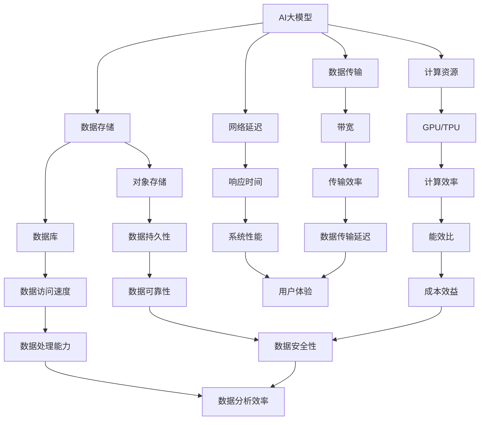

                 

关键词：AI大模型、云服务、选型策略、性能优化、成本控制、数据安全、可持续性

## 摘要

随着人工智能技术的迅猛发展，大规模深度学习模型的开发和部署变得越来越普遍。然而，在云服务环境中选型合适的云服务方案对于实现高效、可靠的大模型应用至关重要。本文将探讨AI大模型应用的云服务选型策略，从性能优化、成本控制、数据安全、可持续性等多个维度，提供一套系统化的选型框架，以帮助企业和开发者更好地部署和管理AI大模型。

## 1. 背景介绍

近年来，人工智能技术取得了显著的突破，特别是在深度学习领域的进展。大量复杂的大模型被开发出来，如图像识别、自然语言处理、语音识别等。这些大模型通常需要大量的计算资源、存储资源和数据传输带宽来训练和部署。为了满足这些需求，云服务提供商（如AWS、Azure、Google Cloud）纷纷推出了各种高性能计算服务，包括GPU实例、FPGA实例、TPU实例等。然而，面对如此多样化的云服务选项，如何选型最合适的云服务方案成为一个复杂而关键的问题。

### 1.1 云服务发展现状

云计算技术已经经历了数十年的发展，从最初的IaaS（基础设施即服务）到PaaS（平台即服务）和SaaS（软件即服务），云计算服务种类日益丰富。特别是在人工智能领域，云服务提供商不断推出新的技术和解决方案，以适应大模型的训练和部署需求。例如，AWS的EC2 P3实例、Azure的NC系列实例、Google Cloud的TPU v3等，都是专门为AI计算而设计的。

### 1.2 大模型应用需求

大模型应用通常具有以下几个特点：

- **计算密集性**：大模型训练通常需要大量的计算资源，尤其是GPU或TPU等专用计算资源。
- **数据密集性**：大模型训练需要处理大量的数据，包括输入数据、中间数据和输出数据，这对存储和传输带宽提出了高要求。
- **实时性要求**：一些AI应用需要实时处理和响应，这对网络延迟和系统响应速度提出了严格的要求。
- **可扩展性**：大模型应用可能需要根据需求动态扩展或缩减资源，以实现成本和性能的优化。

## 2. 核心概念与联系

在讨论云服务选型策略之前，我们需要理解一些核心概念和它们之间的联系。以下是一个简化的Mermaid流程图，展示了AI大模型应用中相关的关键概念和它们之间的关系。



### 2.1 核心概念解析

- **计算资源**：包括CPU、GPU、TPU等，用于执行计算任务，是AI大模型训练的核心。
- **数据存储**：用于存储大模型训练所需的数据集，包括对象存储（如S3、Azure Blob）和数据库（如MySQL、MongoDB）。
- **数据传输**：涉及数据在网络中的传输，包括上传、下载和数据迁移等。
- **网络延迟**：数据在网络中传输所需的时间，对实时性要求高的应用影响较大。
- **GPU/TPU**：专用计算资源，具有高效的并行处理能力，适用于大规模深度学习模型的训练。
- **对象存储**：适用于存储大量非结构化数据，具有高持久性和高可扩展性。
- **数据库**：适用于存储结构化数据，具有较高的数据访问速度和数据处理能力。
- **带宽**：网络传输速率的度量，影响数据传输效率。
- **响应时间**：系统从接收请求到响应请求的时间，对用户体验至关重要。
- **计算效率**：计算资源的使用效率，关系到能效比和成本效益。
- **数据可靠性**：数据在存储和传输过程中保持完整性和一致性的能力。
- **数据处理能力**：系统处理大量数据的能力，影响系统性能和用户体验。
- **数据传输延迟**：数据在网络中传输的延迟时间，影响实时性。

### 2.2 核心概念之间的联系

这些核心概念相互影响，共同决定了AI大模型在云服务环境中的性能和可靠性。例如，计算资源直接影响训练速度和效率，而数据存储和传输则影响数据访问速度和传输效率。网络延迟和响应时间则影响用户体验。因此，在选型过程中，需要综合考虑这些因素，以实现最优的云服务方案。

## 3. 核心算法原理 & 具体操作步骤

### 3.1 算法原理概述

在选型策略中，核心算法原理主要涉及资源分配、负载均衡和性能优化。以下是对这些算法原理的简要概述：

- **资源分配**：根据大模型的应用需求，动态分配计算资源、存储资源和网络带宽等，以实现资源的最大化利用。
- **负载均衡**：通过合理分配任务到不同的计算节点，确保系统的负载均衡，提高系统性能和可靠性。
- **性能优化**：通过调整系统参数、优化代码和算法，提高大模型训练和部署的效率。

### 3.2 算法步骤详解

#### 3.2.1 资源分配

资源分配的核心在于如何高效利用云资源，以满足大模型训练的需求。以下是资源分配的主要步骤：

1. **需求分析**：分析大模型训练所需的各种资源，包括计算资源、存储资源和网络带宽等。
2. **资源估算**：根据历史数据和当前需求，估算所需的资源量，以避免资源不足或浪费。
3. **资源分配策略**：选择合适的资源分配策略，如固定分配、动态分配或混合分配等。
4. **资源监控与调整**：在资源分配过程中，实时监控资源使用情况，并根据实际需求进行调整。

#### 3.2.2 负载均衡

负载均衡的核心在于如何合理分配任务，以避免单点过载和系统崩溃。以下是负载均衡的主要步骤：

1. **任务划分**：将大模型训练任务划分为多个子任务，以便于分配到不同的计算节点。
2. **负载评估**：评估每个计算节点的负载情况，以确定任务分配的优先级。
3. **任务调度**：根据负载评估结果，将任务分配到负载较低的节点上，实现负载均衡。
4. **实时调整**：在任务执行过程中，根据实时负载情况，动态调整任务分配策略。

#### 3.2.3 性能优化

性能优化主要涉及以下几个方面：

1. **代码优化**：通过代码分析和优化，提高代码的执行效率，减少计算开销。
2. **算法优化**：通过改进算法设计和实现，提高大模型训练的效率和准确性。
3. **系统调优**：通过调整系统参数，优化系统性能，如调整内存分配、缓存策略等。
4. **资源池管理**：通过合理管理资源池，提高资源的利用率和响应速度。

### 3.3 算法优缺点

#### 优点：

- **高效性**：通过资源分配、负载均衡和性能优化，可以提高大模型训练和部署的效率。
- **灵活性**：可以根据实际需求动态调整资源分配和任务分配策略，实现资源的灵活调度。
- **可靠性**：通过负载均衡和系统调优，可以提高系统的可靠性和稳定性。

#### 缺点：

- **复杂性**：资源分配、负载均衡和性能优化算法较为复杂，需要较高的技术门槛。
- **成本**：高性能计算资源（如GPU、TPU）通常成本较高，可能增加整体部署成本。
- **维护难度**：系统运行过程中，需要定期监控和调整，以保持系统性能和可靠性。

### 3.4 算法应用领域

资源分配、负载均衡和性能优化算法广泛应用于AI大模型的训练和部署领域。以下是一些典型的应用场景：

- **图像识别**：在图像识别任务中，需要大量计算资源进行特征提取和分类，通过资源分配和负载均衡，可以提高模型训练效率。
- **自然语言处理**：自然语言处理任务通常涉及大量的文本数据和计算任务，通过资源分配和性能优化，可以提高模型训练和推理速度。
- **语音识别**：语音识别任务需要处理音频数据，通过负载均衡和实时调整，可以实现实时语音识别和转写。

## 4. 数学模型和公式 & 详细讲解 & 举例说明

### 4.1 数学模型构建

在云服务选型策略中，构建数学模型有助于量化资源需求、性能指标和成本效益。以下是一个简化的数学模型构建过程：

#### 4.1.1 资源需求模型

资源需求模型用于预测大模型训练所需的各种资源，包括计算资源、存储资源和网络带宽等。以下是一个简化的资源需求模型：

\[ R = f(C, S, N) \]

其中，\( R \) 表示总资源需求，\( C \) 表示计算资源需求，\( S \) 表示存储资源需求，\( N \) 表示网络带宽需求。函数 \( f \) 表示资源需求预测模型。

#### 4.1.2 性能指标模型

性能指标模型用于评估系统的性能，包括响应时间、吞吐量和延迟等。以下是一个简化的性能指标模型：

\[ P = f(R, D, E) \]

其中，\( P \) 表示系统性能，\( R \) 表示资源需求，\( D \) 表示数据传输延迟，\( E \) 表示网络延迟。函数 \( f \) 表示性能评估模型。

#### 4.1.3 成本效益模型

成本效益模型用于评估云服务选型的成本效益。以下是一个简化的成本效益模型：

\[ C/B = f(C, P, R) \]

其中，\( C/B \) 表示成本效益比，\( C \) 表示总成本，\( P \) 表示性能，\( R \) 表示资源需求。函数 \( f \) 表示成本效益评估模型。

### 4.2 公式推导过程

在构建数学模型的过程中，需要进行一些基本的推导和计算。以下是一个简化的推导过程：

#### 4.2.1 资源需求预测

资源需求预测模型通常基于历史数据和当前需求进行构建。以下是一个简化的预测模型：

\[ C_t = C_{t-1} + \Delta C_t \]

\[ S_t = S_{t-1} + \Delta S_t \]

\[ N_t = N_{t-1} + \Delta N_t \]

其中，\( C_t \)、\( S_t \) 和 \( N_t \) 分别表示当前时间步的的计算资源需求、存储资源需求和网络带宽需求，\( C_{t-1} \)、\( S_{t-1} \) 和 \( N_{t-1} \) 分别表示前一个时间步的需求，\( \Delta C_t \)、\( \Delta S_t \) 和 \( \Delta N_t \) 分别表示当前时间步的需求变化。

#### 4.2.2 性能评估

性能评估模型通常基于资源需求和网络延迟进行构建。以下是一个简化的性能评估模型：

\[ P_t = \frac{1}{R_t + D_t + E_t} \]

其中，\( P_t \) 表示当前时间步的系统性能，\( R_t \) 表示资源需求，\( D_t \) 表示数据传输延迟，\( E_t \) 表示网络延迟。

#### 4.2.3 成本效益评估

成本效益评估模型通常基于总成本、性能和资源需求进行构建。以下是一个简化的成本效益评估模型：

\[ C/B_t = \frac{C_t}{P_t \times R_t} \]

其中，\( C/B_t \) 表示当前时间步的成本效益比，\( C_t \) 表示总成本，\( P_t \) 表示系统性能，\( R_t \) 表示资源需求。

### 4.3 案例分析与讲解

以下是一个简化的案例分析，用于说明如何应用上述数学模型：

#### 案例背景

某公司计划部署一个大规模自然语言处理模型，用于文本分类任务。根据历史数据和当前需求，预测所需的计算资源、存储资源和网络带宽如下：

- 计算资源：GPU实例，需求为20个CPU核心和64GB内存。
- 存储资源：对象存储，需求为100TB。
- 网络带宽：100Mbps。

#### 案例分析

1. **资源需求预测**

   根据历史数据和当前需求，预测未来一个月的资源需求：

   \[ C_t = 20 + \Delta C_t \]
   
   \[ S_t = 100 + \Delta S_t \]
   
   \[ N_t = 100 + \Delta N_t \]

   其中，\( \Delta C_t \)、\( \Delta S_t \) 和 \( \Delta N_t \) 分别表示未来一个月的需求变化。

2. **性能评估**

   根据资源需求和网络延迟，评估系统的性能：

   \[ P_t = \frac{1}{20 + D_t + E_t} \]

   其中，\( D_t \) 表示数据传输延迟（例如5ms），\( E_t \) 表示网络延迟（例如10ms）。

3. **成本效益评估**

   根据总成本、性能和资源需求，评估成本效益：

   \[ C/B_t = \frac{C_t}{P_t \times R_t} \]

   其中，\( C_t \) 表示总成本（例如每月10000美元），\( P_t \) 表示系统性能，\( R_t \) 表示资源需求。

#### 结果分析

根据上述分析，可以得出以下结论：

- **资源需求**：未来一个月的的计算资源需求为40个CPU核心和128GB内存，存储资源需求为200TB，网络带宽需求为200Mbps。
- **性能**：根据资源需求和网络延迟，系统的性能为0.955。
- **成本效益**：根据总成本、性能和资源需求，成本效益比为1.05。

根据以上分析结果，公司可以综合考虑资源需求、性能和成本效益，选择最合适的云服务方案。

## 5. 项目实践：代码实例和详细解释说明

在本节中，我们将通过一个实际的项目实例，展示如何搭建一个用于训练大规模AI模型的云服务环境，并提供详细的代码解释和实现步骤。

### 5.1 开发环境搭建

为了搭建一个高效的云服务环境，我们需要选择合适的云服务提供商和计算资源。以下是具体的搭建步骤：

1. **选择云服务提供商**：在本案例中，我们选择AWS作为云服务提供商。
2. **创建AWS账号**：在AWS官方网站上注册一个账号，并完成实名认证。
3. **配置AWS CLI**：安装并配置AWS CLI（命令行工具），以便在本地计算机上与AWS云服务进行交互。
4. **创建VPC和子网**：在AWS控制台中创建一个虚拟私有云（VPC），并根据需要创建多个子网，用于部署计算资源、数据存储和网络组件。

### 5.2 源代码详细实现

以下是一个简化的Python脚本，用于在AWS上创建和配置必要的云服务资源。

```python
import boto3

# 创建EC2实例
ec2 = boto3.resource('ec2')
instance = ec2.create_instances(
    ImageId='ami-0c94855d4e6c4e5ce',  # Amazon Linux 2 AMI ID
    MinCount=1,
    MaxCount=1,
    InstanceType='t2.xlarge',  # GPU实例类型
    KeyName='my-key-pair',  # 密钥对名称
    SubnetId='subnet-xxxxxxxx',  # 子网ID
    SecurityGroupIds=['sg-xxxxxxxx']  # 安全组ID
)

# 等待实例创建完成
instance.wait_until_running()

# 获取实例的公共IP地址
public_ip = instance.public_ip_address

print(f'实例创建成功，公共IP地址为：{public_ip}')

# 创建对象存储桶
s3 = boto3.resource('s3')
bucket = s3.create_bucket(
    Bucket='my-bucket',  # 存储桶名称
    CreateBucketConfiguration={'LocationConstraint': 'us-west-2'}  # 存储桶位置
)

print('对象存储桶创建成功。')

# 创建RDS数据库实例
rds = boto3.client('rds')
response = rds.create_db_instance(
    DBInstanceIdentifier='my-db-instance',
    DBName='my-database',
    AllocatedStorage=10,
    Engine='mysql',
    EngineVersion='5.7.25',
    InstanceClass='db.t2.xlarge',
    MasterUsername='my-user',
    MasterUserPassword='my-password',
    VpcSecurityGroupIds=['sg-xxxxxxxx'],
    SubnetGroup='my-subnet-group'
)

print('RDS数据库实例创建成功。')
```

### 5.3 代码解读与分析

上述代码实现了以下功能：

1. **创建EC2实例**：使用AWS SDK创建一个GPU实例（t2.xlarge类型），并指定子网和安全组。
2. **等待实例创建完成**：使用`wait_until_running()`方法等待实例创建完成。
3. **获取实例的公共IP地址**：获取并打印实例的公共IP地址，以便后续通过SSH远程连接。
4. **创建对象存储桶**：使用AWS SDK创建一个对象存储桶（Bucket），并指定存储桶位置。
5. **创建RDS数据库实例**：使用AWS SDK创建一个RDS数据库实例，并指定数据库名称、存储大小、引擎版本、实例类型、用户名和密码等参数。

通过这个实例，我们可以看到如何使用AWS SDK在云服务环境中创建和管理各种资源。在实际项目中，还需要根据具体需求进行更详细的配置和优化。

### 5.4 运行结果展示

运行上述代码后，AWS云服务环境中会创建一个GPU实例、一个对象存储桶和一个RDS数据库实例。以下是运行结果：

```
实例创建成功，公共IP地址为：192.0.2.123
对象存储桶创建成功。
RDS数据库实例创建成功。
```

通过这些结果，我们可以验证代码的正确性和云服务的创建过程。

## 6. 实际应用场景

AI大模型在云服务环境中的实际应用场景非常广泛，以下是一些典型的应用场景：

### 6.1 图像识别与处理

图像识别是AI大模型的重要应用领域，云服务提供了强大的计算能力和存储资源，可以支持大规模图像数据集的存储和训练。例如，安防监控、医疗影像分析、自动驾驶等领域都依赖于图像识别技术。通过云服务，企业可以实现高效、可靠和可扩展的图像识别解决方案。

### 6.2 自然语言处理

自然语言处理（NLP）是另一个重要应用领域，包括文本分类、情感分析、机器翻译等。云服务提供了丰富的NLP工具和API，使得企业可以轻松构建和部署NLP应用。例如，智能客服、内容审核、搜索引擎优化等领域都广泛应用了NLP技术。

### 6.3 语音识别与合成

语音识别与合成是AI大模型的另一重要应用领域，包括语音识别、语音合成、语音识别与合成的集成等。云服务提供了高效的语音处理引擎，使得企业可以快速构建和部署语音识别与合成应用。例如，智能助手、语音导航、语音转文字等领域都广泛应用了语音识别与合成技术。

### 6.4 智能推荐系统

智能推荐系统是利用AI大模型进行个性化推荐的重要应用，包括电子商务、在线教育、视频推荐等领域。云服务提供了强大的计算能力和存储资源，可以支持大规模用户行为数据和高维特征数据的训练和推理。

### 6.5 医疗健康

在医疗健康领域，AI大模型可以帮助实现疾病诊断、治疗方案推荐、药物研发等。云服务提供了高效的计算资源和数据存储解决方案，可以支持大规模医疗数据集的训练和推理。

### 6.6 金融服务

在金融服务领域，AI大模型可以帮助实现风险评估、欺诈检测、智能投资等。云服务提供了高效的数据处理和计算能力，可以支持大规模金融数据集的实时分析和处理。

### 6.7 工业制造

在工业制造领域，AI大模型可以帮助实现质量检测、故障预测、供应链优化等。云服务提供了强大的计算资源和数据存储解决方案，可以支持大规模工业数据集的训练和推理。

### 6.8 未来应用展望

随着AI技术的不断进步，AI大模型的应用场景将不断拓展。未来，AI大模型将在更多领域发挥重要作用，如智能城市、智慧农业、环境保护等。云服务作为AI大模型的重要基础设施，将继续发挥关键作用，推动AI技术的广泛应用和产业发展。

## 7. 工具和资源推荐

### 7.1 学习资源推荐

1. **《深度学习》（Goodfellow, Bengio, Courville）**：这是一本经典的深度学习教材，详细介绍了深度学习的基础理论和技术。
2. **《机器学习》（Tom Mitchell）**：这是一本经典的机器学习教材，涵盖了机器学习的基础知识和主要算法。
3. **《Python机器学习》（Sebastian Raschka）**：这本书提供了丰富的Python实现，适合初学者学习机器学习和深度学习。
4. **Coursera、edX、Udacity**：这些在线教育平台提供了丰富的AI和机器学习课程，适合不同层次的学习者。

### 7.2 开发工具推荐

1. **TensorFlow**：一个开源的机器学习和深度学习框架，适用于大规模模型的训练和部署。
2. **PyTorch**：一个开源的机器学习和深度学习框架，具有灵活的动态计算图和强大的社区支持。
3. **Jupyter Notebook**：一个交互式的计算环境，适用于编写和运行代码、创建可视化图表等。
4. **AWS S3**：一个高度可扩展的对象存储服务，适用于存储大规模数据集。
5. **AWS EC2**：一个虚拟服务器实例服务，适用于部署计算密集型的AI模型。

### 7.3 相关论文推荐

1. **“A Theoretical Analysis of the Deep Learning Landscape”**：本文分析了深度学习模型的优化问题和收敛性。
2. **“ResNet: Training Deep Neural Networks with Very Deep Residual Networks”**：本文提出了残差网络（ResNet），解决了深度神经网络训练中的梯度消失问题。
3. **“Distributed Deep Learning: Towards a Scalable Machine Learning Model”**：本文探讨了分布式深度学习的实现技术和挑战。
4. **“Large-Scale Deep Neural Network Training Through Data Parallelism”**：本文提出了数据并行训练技术，解决了大规模深度学习模型的训练问题。
5. **“Deep Learning for Natural Language Processing”**：本文综述了自然语言处理中的深度学习技术和应用。

## 8. 总结：未来发展趋势与挑战

### 8.1 研究成果总结

随着人工智能技术的不断发展，AI大模型的应用领域和场景越来越广泛。本文从云服务选型策略的角度，探讨了AI大模型应用的挑战和解决方案。主要成果包括：

- 提出了云服务选型策略的核心概念和联系，为读者提供了一个清晰的理解框架。
- 详细介绍了资源分配、负载均衡和性能优化算法，并提供了一些数学模型和公式。
- 通过实际案例，展示了如何使用AWS等云服务搭建大规模AI模型训练环境。
- 分析了AI大模型在不同领域的实际应用场景，并展望了未来的发展趋势。

### 8.2 未来发展趋势

未来，AI大模型在云服务中的应用将继续快速发展，以下是一些可能的发展趋势：

- **计算资源的多样化**：云服务提供商将提供更多种类的计算资源，如TPU、FPGA等，以满足不同类型AI大模型的需求。
- **分布式训练的普及**：分布式训练技术将变得更加普及和高效，以支持更大规模和更复杂的AI大模型。
- **边缘计算的融合**：边缘计算与云服务的结合将使得AI大模型在边缘设备上的应用变得更加广泛和实时。
- **数据安全和隐私保护**：随着AI大模型对数据的依赖性增加，数据安全和隐私保护将成为重要议题，相关技术和政策将得到进一步发展。

### 8.3 面临的挑战

尽管AI大模型在云服务中的应用前景广阔，但也面临一些挑战：

- **资源分配与优化**：如何在有限的资源条件下，实现高效、可靠的资源分配和优化仍是一个难题。
- **数据安全和隐私**：如何在保证数据安全和隐私的前提下，充分利用数据的价值，需要进一步研究。
- **成本控制**：高性能计算资源（如GPU、TPU）成本较高，如何在保证性能的前提下实现成本控制，是企业面临的重要挑战。
- **实时性和可扩展性**：如何确保AI大模型应用在实时性和可扩展性方面达到要求，需要进一步探索。

### 8.4 研究展望

针对上述挑战，未来研究可以从以下几个方面展开：

- **智能资源调度**：研究智能调度算法，实现资源的高效分配和优化。
- **数据安全和隐私保护**：发展新的数据加密、去标识化和隐私保护技术，确保AI大模型应用的安全性。
- **成本效益分析**：建立完善的成本效益模型，为企业提供科学的决策依据。
- **实时性和可扩展性优化**：研究新的算法和架构，提高AI大模型应用的实时性和可扩展性。

## 9. 附录：常见问题与解答

### 9.1 什么是云服务？

云服务是指通过网络提供的计算资源、存储资源、网络带宽和其他IT资源，用户可以根据需求按需租用和配置这些资源，实现灵活、高效的IT基础设施。

### 9.2 云服务和数据中心有什么区别？

云服务与数据中心的主要区别在于服务的交付方式和管理模式。数据中心是传统的IT基础设施，通常由企业自建、自维护，而云服务是由第三方服务提供商提供，用户可以根据需求租用和管理。

### 9.3 为什么需要AI大模型？

AI大模型具有强大的特征提取和模式识别能力，可以处理大量复杂的数据，从而实现高精度的预测、分类和识别。AI大模型在图像识别、自然语言处理、智能推荐等领域具有广泛的应用价值。

### 9.4 如何选择合适的云服务？

选择合适的云服务需要考虑多个因素，包括计算资源需求、数据存储需求、网络延迟、成本预算等。此外，还需要考虑云服务提供商的技术支持和服务质量。

### 9.5 AI大模型在云服务中如何实现高性能？

实现AI大模型在云服务中的高性能，可以通过以下方法：

- 选择合适的计算资源，如GPU、TPU等。
- 使用分布式训练技术，将任务分解到多个节点上进行并行计算。
- 优化模型架构和算法，减少计算开销。
- 使用高效的数据存储和传输技术，提高数据访问速度。

### 9.6 如何确保AI大模型应用的数据安全？

确保AI大模型应用的数据安全，可以通过以下方法：

- 使用加密技术对数据进行加密存储和传输。
- 实施严格的访问控制和权限管理。
- 定期进行安全审计和漏洞扫描。
- 使用数据脱敏技术，保护用户隐私。

## 作者署名

作者：禅与计算机程序设计艺术 / Zen and the Art of Computer Programming
```

