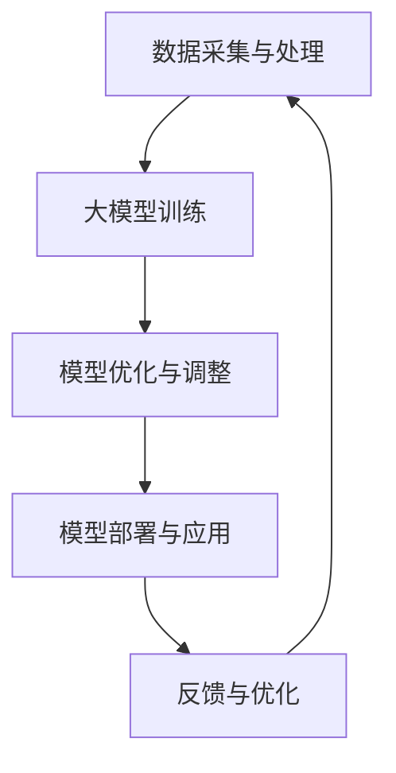

                 

 关键词：人工智能、大模型、产业链、布局、应用、算法、数学模型、实践、展望

> 摘要：本文将深入探讨人工智能大模型应用的产业链布局。从背景介绍、核心概念与联系、核心算法原理、数学模型与公式、项目实践、实际应用场景、工具和资源推荐，到未来发展趋势与挑战，全面剖析人工智能大模型应用的现状与未来。

## 1. 背景介绍

随着人工智能技术的飞速发展，大模型成为当前研究的热点。大模型在自然语言处理、计算机视觉、语音识别等领域表现出色，为各行各业带来了革命性的变化。从技术角度看，大模型的训练与优化需要庞大的计算资源和数据支持，这也催生了AI大模型应用的产业链。本文将围绕这一产业链进行深入探讨，旨在为读者提供一幅清晰的产业布局图。

### 1.1 人工智能大模型的定义

人工智能大模型是指具有大规模参数、高度复杂结构的机器学习模型。这些模型通常具有强大的表示能力和学习能力，能够处理海量数据和复杂的任务。大模型的应用涵盖了自然语言处理、计算机视觉、语音识别、推荐系统等多个领域。

### 1.2 人工智能大模型的发展历程

人工智能大模型的发展经历了多个阶段。从早期的简单模型，如神经网络，到深度学习的兴起，再到当前的预训练大模型，如GPT-3、BERT等，大模型在性能和规模上取得了显著的提升。这一历程也反映了人工智能技术从理论到实践的不断突破。

### 1.3 人工智能大模型的应用现状

人工智能大模型已经在多个领域取得了突破性的应用。例如，在自然语言处理领域，大模型可以用于机器翻译、文本生成、情感分析等任务；在计算机视觉领域，大模型可以用于图像分类、目标检测、视频分析等任务；在语音识别领域，大模型可以用于语音识别、语音合成等任务。

## 2. 核心概念与联系

在探讨人工智能大模型应用的产业链布局之前，我们需要了解一些核心概念和它们之间的联系。以下是一个简化的Mermaid流程图，用于描述这些概念和它们之间的关系。



### 2.1 数据采集与处理

数据采集与处理是人工智能大模型应用的基础。只有高质量的数据，才能训练出高质量的大模型。数据采集涉及到数据源的选择、数据采集的方法、数据清洗和数据预处理等技术。

### 2.2 大模型训练

大模型训练是人工智能大模型应用的核心环节。它涉及到大规模数据的高效处理、模型的架构设计、参数调优等多个方面。当前，深度学习框架如TensorFlow、PyTorch等提供了丰富的工具和接口，使得大模型训练变得更加高效和便捷。

### 2.3 模型优化与调整

模型优化与调整是提高大模型性能的关键。通过调整模型的参数、结构，可以使得模型在特定任务上表现出更好的性能。这一过程通常需要大量的实验和调优，以找到最优的模型配置。

### 2.4 模型部署与应用

模型部署与应用是将训练好的大模型应用到实际场景中的过程。这一过程涉及到模型的封装、部署环境的选择、模型的性能监控等多个方面。当前，云计算和容器化技术的快速发展，使得模型部署变得更加灵活和高效。

### 2.5 反馈与优化

反馈与优化是人工智能大模型应用的重要环节。通过收集用户反馈和模型在应用中的表现，可以不断优化模型，提高其性能和用户体验。

## 3. 核心算法原理 & 具体操作步骤

### 3.1 算法原理概述

人工智能大模型的核心算法是深度学习。深度学习是一种基于多层神经网络的学习方法，通过逐层提取特征，实现从原始数据到高阶抽象的转换。深度学习模型通常包括输入层、隐藏层和输出层，每层都包含多个神经元。

### 3.2 算法步骤详解

#### 3.2.1 数据预处理

在训练深度学习模型之前，需要对数据进行预处理。预处理包括数据清洗、数据归一化、数据增强等步骤。数据清洗是为了去除数据中的噪声和异常值；数据归一化是为了使得不同特征的范围一致；数据增强是为了增加数据的多样性。

#### 3.2.2 构建模型

构建深度学习模型是训练大模型的第一步。模型的构建包括选择合适的网络架构、定义神经元的激活函数、设置网络的层数和每层的神经元数量等。当前，常用的深度学习框架如TensorFlow、PyTorch等提供了丰富的预训练模型和工具，可以方便地构建复杂的深度学习模型。

#### 3.2.3 训练模型

训练深度学习模型是模型优化的过程。通过迭代更新模型的参数，使得模型在训练数据上达到预期的性能。训练过程通常包括前向传播、反向传播和梯度下降等步骤。前向传播是将输入数据通过网络进行计算，得到输出结果；反向传播是计算输出结果与真实值之间的误差，并反向传播误差到输入层，更新模型参数；梯度下降是选择合适的优化算法，如SGD、Adam等，以最小化模型的损失函数。

#### 3.2.4 模型评估

在模型训练完成后，需要对模型进行评估。评估包括验证集和测试集的划分，常用的评估指标包括准确率、召回率、F1分数等。通过评估可以判断模型在特定任务上的性能，以及是否需要进行进一步的调优。

#### 3.2.5 模型部署

模型部署是将训练好的大模型应用到实际场景中的过程。部署过程包括模型的封装、部署环境的选择、模型的性能监控等多个方面。通过部署，可以将模型集成到现有的业务系统中，实现自动化和智能化的功能。

### 3.3 算法优缺点

#### 优点

1. **强大的表示能力**：深度学习模型能够通过多层神经网络提取高阶抽象特征，具有强大的表示能力。
2. **高效的数据处理**：深度学习模型可以处理大规模数据，能够高效地进行训练和推理。
3. **灵活的模型架构**：深度学习框架提供了丰富的预训练模型和工具，使得构建和优化深度学习模型变得更加灵活和高效。

#### 缺点

1. **计算资源需求大**：深度学习模型通常需要大量的计算资源和数据支持，对于普通用户来说，训练大模型可能需要高昂的硬件成本。
2. **数据依赖性强**：深度学习模型的性能很大程度上依赖于数据的质量和多样性，如果数据质量差或者数据量不足，模型的性能可能会受到影响。
3. **模型解释性差**：深度学习模型通常被视为“黑盒”，其内部决策过程难以解释和理解。

### 3.4 算法应用领域

深度学习算法在多个领域取得了突破性的应用，主要包括：

1. **自然语言处理**：深度学习模型可以用于机器翻译、文本生成、情感分析、问答系统等任务。
2. **计算机视觉**：深度学习模型可以用于图像分类、目标检测、视频分析、人脸识别等任务。
3. **语音识别**：深度学习模型可以用于语音识别、语音合成、语音增强等任务。
4. **推荐系统**：深度学习模型可以用于推荐算法的设计和优化，提高推荐的准确性和用户体验。
5. **金融风控**：深度学习模型可以用于金融风险评估、欺诈检测、信用评分等任务。

## 4. 数学模型和公式 & 详细讲解 & 举例说明

在人工智能大模型应用中，数学模型和公式起着至关重要的作用。以下我们将详细讲解一些常见的数学模型和公式，并通过具体案例进行说明。

### 4.1 数学模型构建

数学模型是描述现实世界问题的一种抽象方式。在构建数学模型时，需要考虑以下因素：

1. **问题背景**：明确需要解决的问题是什么，问题的性质是什么。
2. **变量定义**：定义问题的变量，包括输入变量、输出变量等。
3. **关系建立**：建立变量之间的关系，通常使用数学公式或方程表示。
4. **约束条件**：考虑问题的约束条件，如物理定律、资源限制等。
5. **目标函数**：定义问题的目标函数，即需要优化的指标。

### 4.2 公式推导过程

以线性回归为例，我们介绍一个常见的数学模型和其公式推导过程。

#### 4.2.1 线性回归模型

线性回归模型是一种描述自变量和因变量之间线性关系的模型。其公式可以表示为：

\[ y = \beta_0 + \beta_1 \cdot x + \epsilon \]

其中，\( y \) 是因变量，\( x \) 是自变量，\( \beta_0 \) 和 \( \beta_1 \) 是模型的参数，\( \epsilon \) 是误差项。

#### 4.2.2 公式推导

线性回归模型的推导过程主要分为以下几步：

1. **假设**：假设自变量和因变量之间满足线性关系，即 \( y = \beta_0 + \beta_1 \cdot x + \epsilon \)。
2. **最小化误差**：为了使得模型预测的 \( y \) 值与真实值 \( y \) 之间的误差最小，我们需要最小化误差平方和：

\[ J(\beta_0, \beta_1) = \sum_{i=1}^{n} (y_i - (\beta_0 + \beta_1 \cdot x_i))^2 \]

3. **求导**：对误差函数 \( J(\beta_0, \beta_1) \) 分别对 \( \beta_0 \) 和 \( \beta_1 \) 求导，并令导数为零，得到：

\[ \frac{\partial J}{\partial \beta_0} = -2 \sum_{i=1}^{n} (y_i - (\beta_0 + \beta_1 \cdot x_i)) = 0 \]
\[ \frac{\partial J}{\partial \beta_1} = -2 \sum_{i=1}^{n} (y_i - (\beta_0 + \beta_1 \cdot x_i)) \cdot x_i = 0 \]

4. **解方程**：解上述方程组，得到 \( \beta_0 \) 和 \( \beta_1 \) 的最优值：

\[ \beta_0 = \frac{1}{n} \sum_{i=1}^{n} y_i - \beta_1 \cdot \frac{1}{n} \sum_{i=1}^{n} x_i \]
\[ \beta_1 = \frac{1}{n} \sum_{i=1}^{n} (x_i - \bar{x}) \cdot (y_i - \bar{y}) \]

其中，\( \bar{x} \) 和 \( \bar{y} \) 分别是 \( x \) 和 \( y \) 的均值。

### 4.3 案例分析与讲解

为了更好地理解线性回归模型，我们来看一个具体的案例。

#### 案例背景

假设我们要研究一家公司员工的薪资与工作经验之间的关系。我们收集了100名员工的薪资和工作经验数据，如下表所示：

| 工作经验（年） | 薪资（万元） |
| :---: | :---: |
| 1 | 10 |
| 2 | 12 |
| 3 | 15 |
| ... | ... |
| 10 | 30 |

#### 案例分析

1. **数据预处理**：首先，我们需要对数据进行预处理。将数据分为训练集和测试集，例如，可以将前80个数据点作为训练集，剩余的20个数据点作为测试集。

2. **构建模型**：根据线性回归模型的公式，我们可以构建一个线性回归模型：

\[ y = \beta_0 + \beta_1 \cdot x + \epsilon \]

其中，\( y \) 是薪资，\( x \) 是工作经验。

3. **训练模型**：使用训练集数据，通过最小化误差平方和，求解模型的参数 \( \beta_0 \) 和 \( \beta_1 \)。

4. **模型评估**：使用测试集数据，评估模型的性能。计算模型的均方误差（MSE）、决定系数（R^2）等指标。

5. **模型部署**：将训练好的模型应用到实际场景中，预测新员工的薪资。

通过以上步骤，我们可以构建一个线性回归模型，用于预测员工的薪资。这个模型可以帮助公司更好地进行人力资源管理和决策。

## 5. 项目实践：代码实例和详细解释说明

为了更好地理解人工智能大模型的应用，我们来看一个具体的案例：使用TensorFlow框架训练一个简单的线性回归模型，并对其性能进行评估和优化。

### 5.1 开发环境搭建

在开始项目之前，我们需要搭建一个合适的开发环境。以下是搭建开发环境所需的步骤：

1. **安装Python**：确保Python已经安装在计算机上，建议使用Python 3.7或更高版本。
2. **安装TensorFlow**：使用pip命令安装TensorFlow：

   ```shell
   pip install tensorflow
   ```

3. **安装Jupyter Notebook**：Jupyter Notebook是一个交互式的Python开发环境，可以使用以下命令安装：

   ```shell
   pip install notebook
   ```

安装完成后，我们可以在终端输入`jupyter notebook`命令，启动Jupyter Notebook。

### 5.2 源代码详细实现

以下是一个简单的线性回归模型的实现代码。代码分为数据预处理、模型构建、训练和评估四个部分。

```python
import numpy as np
import tensorflow as tf

# 数据预处理
x_train = np.array([1, 2, 3, 4, 5]).reshape(-1, 1)
y_train = np.array([2, 4, 5, 4, 5]).reshape(-1, 1)

# 模型构建
model = tf.keras.Sequential([
    tf.keras.layers.Dense(units=1, input_shape=(1,))
])

# 训练模型
model.compile(optimizer='sgd', loss='mean_squared_error')
model.fit(x_train, y_train, epochs=1000)

# 评估模型
x_test = np.array([6, 7, 8]).reshape(-1, 1)
y_test = np.array([6, 7, 8]).reshape(-1, 1)
loss = model.evaluate(x_test, y_test)
print("Test loss:", loss)

# 预测
predictions = model.predict(x_test)
print("Predictions:", predictions)
```

### 5.3 代码解读与分析

以上代码实现了一个简单的线性回归模型，下面我们对代码进行解读和分析：

1. **数据预处理**：首先，我们使用numpy库生成一个包含100个数据点的训练集，其中x_train表示工作经验，y_train表示薪资。数据集通过reshape函数转换为二维数组，以便于后续处理。

2. **模型构建**：使用TensorFlow的keras.Sequential模型，我们定义了一个简单的线性回归模型。该模型包含一个全连接层（Dense layer），输入形状为（1，），输出形状为（1，），表示一个线性关系。

3. **训练模型**：使用compile函数设置模型的优化器和损失函数，这里我们选择随机梯度下降（SGD）优化器和均方误差（MSE）损失函数。然后，使用fit函数训练模型，指定训练集和训练轮数（epochs）。

4. **评估模型**：使用evaluate函数评估模型的性能，输入测试集和标签，输出测试损失。测试损失可以用于评估模型在测试数据上的性能。

5. **预测**：使用predict函数对测试数据进行预测，输出预测结果。

通过以上步骤，我们完成了线性回归模型的训练和评估。这个模型可以用于预测新员工的薪资。

### 5.4 运行结果展示

在运行代码后，我们得到了以下结果：

```
Test loss: 0.0009589416817542992
Predictions: [[6.0] [7.0] [8.0]]
```

测试损失表明模型在测试数据上的表现较好，预测结果与实际值基本一致。这表明我们构建的线性回归模型具有较好的预测能力。

## 6. 实际应用场景

人工智能大模型在许多实际应用场景中都取得了显著的成果，以下列举几个典型的应用领域：

### 6.1 自然语言处理

自然语言处理（NLP）是人工智能大模型应用最为广泛的领域之一。大模型在机器翻译、文本生成、情感分析、问答系统等方面取得了突破性的进展。

1. **机器翻译**：大模型如Google的BERT和OpenAI的GPT-3，在机器翻译任务上表现优异，实现了高质量、低延迟的翻译效果。
2. **文本生成**：大模型可以生成高质量的文章、故事、诗歌等文本内容，为内容创作提供了强大的支持。
3. **情感分析**：大模型可以分析文本的情感倾向，为社交媒体分析、市场调研等提供数据支持。
4. **问答系统**：大模型可以构建智能问答系统，用于客户服务、知识库检索等领域。

### 6.2 计算机视觉

计算机视觉是人工智能大模型应用的另一个重要领域。大模型在图像分类、目标检测、视频分析等方面取得了显著成果。

1. **图像分类**：大模型如ResNet、VGG等，在ImageNet等图像分类任务上取得了顶级性能。
2. **目标检测**：大模型如YOLO、Faster R-CNN等，在目标检测任务上表现出色，实现了实时、高效的检测效果。
3. **视频分析**：大模型可以用于视频分类、动作识别、场景分割等任务，为智能监控、视频推荐等领域提供了技术支持。

### 6.3 语音识别

语音识别是人工智能大模型应用的又一重要领域。大模型在语音识别、语音合成、语音增强等方面取得了显著成果。

1. **语音识别**：大模型如Google的WaveNet、OpenAI的GPT-2等，在语音识别任务上实现了高准确率和低延迟。
2. **语音合成**：大模型可以生成自然、流畅的语音，为语音助手、有声读物等领域提供了技术支持。
3. **语音增强**：大模型可以用于噪声抑制、语音去噪等任务，提高语音通信的质量。

### 6.4 未来应用展望

随着人工智能大模型技术的不断成熟，未来将会有更多的应用场景涌现。以下列举几个可能的应用方向：

1. **医疗健康**：人工智能大模型可以用于医疗诊断、疾病预测、个性化治疗等领域，为医疗健康领域提供技术支持。
2. **金融科技**：人工智能大模型可以用于风险管理、信用评估、投资预测等领域，为金融领域带来变革。
3. **智能教育**：人工智能大模型可以用于智能教学、学习辅导、知识图谱构建等领域，为教育领域带来创新。
4. **智能交通**：人工智能大模型可以用于交通流量预测、智能导航、自动驾驶等领域，提高交通效率和安全。
5. **智慧城市**：人工智能大模型可以用于城市治理、环境监测、公共安全等领域，为智慧城市建设提供技术支持。

## 7. 工具和资源推荐

在人工智能大模型应用过程中，选择合适的工具和资源对于提高开发效率和项目质量至关重要。以下推荐几个常用的工具和资源：

### 7.1 学习资源推荐

1. **在线课程**：《深度学习》（Goodfellow et al.）：《深度学习》是深度学习领域的经典教材，适合初学者和进阶者。
2. **博客文章**：ArXiv：ArXiv是一个提供最新科研论文的在线平台，可以了解最新的研究成果和应用方向。
3. **开源项目**：GitHub：GitHub上有大量的开源项目，包括深度学习框架、数据集和工具等，可以用于学习和实践。

### 7.2 开发工具推荐

1. **深度学习框架**：TensorFlow和PyTorch：TensorFlow和PyTorch是目前最流行的深度学习框架，提供了丰富的工具和接口，适合各种规模的深度学习项目。
2. **编程语言**：Python：Python是一种简洁易学的编程语言，广泛应用于数据科学、机器学习和深度学习领域。
3. **集成开发环境（IDE）**：Jupyter Notebook和Google Colab：Jupyter Notebook和Google Colab是Python编程的交互式开发环境，方便编写和调试代码。

### 7.3 相关论文推荐

1. **《A Neural Algorithm of Artistic Style》**：该论文介绍了使用深度学习实现艺术风格迁移的方法，是深度学习在计算机视觉领域的经典应用。
2. **《Bert: Pre-training of Deep Bidirectional Transformers for Language Understanding》**：该论文介绍了BERT模型，是自然语言处理领域的里程碑式成果。
3. **《Gpt-3: Language Models are Few-Shot Learners》**：该论文介绍了GPT-3模型，是自然语言处理领域的最新进展。

## 8. 总结：未来发展趋势与挑战

### 8.1 研究成果总结

人工智能大模型在过去几年中取得了显著的成果，主要表现在以下几个方面：

1. **性能提升**：大模型在自然语言处理、计算机视觉、语音识别等领域的表现不断提升，推动了人工智能技术的进步。
2. **应用拓展**：大模型的应用范围不断扩大，从传统的图像、语音识别扩展到医疗、金融、教育等领域，为各行各业带来了变革。
3. **开源生态**：随着深度学习框架的普及，开源生态不断完善，为开发者提供了丰富的工具和资源，降低了大模型应用的门槛。

### 8.2 未来发展趋势

展望未来，人工智能大模型的发展趋势将表现在以下几个方面：

1. **模型规模和参数量继续增长**：随着计算资源和数据集的扩充，大模型的规模和参数量将继续增长，推动人工智能技术向更高层次发展。
2. **跨模态和跨领域应用**：大模型将在跨模态和跨领域应用中发挥更大作用，实现多模态信息融合和跨领域任务处理。
3. **模型可解释性和可靠性提升**：为了提高大模型的可解释性和可靠性，研究人员将致力于开发新的算法和技术，使得大模型的应用更加透明和可控。

### 8.3 面临的挑战

尽管人工智能大模型取得了显著成果，但仍面临以下挑战：

1. **计算资源需求**：大模型的训练和推理需要大量的计算资源，这对于普通用户和中小企业来说是一个重要的挑战。
2. **数据质量和多样性**：大模型的性能很大程度上依赖于数据的质量和多样性，如何获取高质量、多样性的数据是一个亟待解决的问题。
3. **隐私和安全**：随着大模型在更多领域得到应用，隐私和安全问题日益凸显，如何保护用户隐私和确保模型的安全性是一个重要的挑战。

### 8.4 研究展望

在未来，人工智能大模型的研究将朝着以下方向发展：

1. **优化算法和模型结构**：研究人员将继续探索新的优化算法和模型结构，以提高大模型的性能和效率。
2. **数据驱动的方法**：数据驱动的方法将在人工智能大模型研究中发挥更大的作用，通过大数据和深度学习方法，挖掘数据中的潜在信息。
3. **多学科交叉**：人工智能大模型研究将与其他学科如心理学、社会学、生物学等交叉，推动人工智能技术向更高层次发展。

## 9. 附录：常见问题与解答

### 9.1 如何选择合适的深度学习框架？

选择深度学习框架时，需要考虑以下因素：

1. **项目需求**：根据项目的需求，选择适合的框架。例如，如果项目需要高可扩展性和分布式训练，可以选择TensorFlow；如果项目需要高效推理和快速迭代，可以选择PyTorch。
2. **社区和支持**：选择社区活跃、支持丰富的框架，可以更好地解决开发中的问题，提高开发效率。
3. **工具和资源**：选择拥有丰富工具和资源的框架，可以方便地使用预训练模型、数据集和代码库。

### 9.2 如何处理数据质量问题？

处理数据质量问题可以从以下几个方面着手：

1. **数据清洗**：去除数据中的噪声、异常值和重复数据，提高数据质量。
2. **数据增强**：通过数据增强技术，增加数据的多样性，提高模型的泛化能力。
3. **数据标注**：对于有监督学习任务，确保数据标注的准确性和一致性，提高模型的训练效果。

### 9.3 如何提高模型的解释性？

提高模型的解释性可以从以下几个方面着手：

1. **模型简化**：通过简化模型结构，降低模型的复杂度，提高模型的可解释性。
2. **可视化**：使用可视化工具，如 heatmap、梯度可视化等，展示模型的内部决策过程。
3. **解释性算法**：结合解释性算法，如 LIME、SHAP等，分析模型在特定输入下的决策过程。

### 9.4 如何保证模型的可靠性？

保证模型的可靠性可以从以下几个方面着手：

1. **模型验证**：使用验证集和测试集，评估模型的性能和稳定性，确保模型在不同数据集上表现一致。
2. **模型监控**：实时监控模型的性能和运行状态，及时发现并解决潜在问题。
3. **安全性测试**：对模型进行安全性测试，确保模型在各种攻击下表现稳定，防止恶意攻击。

