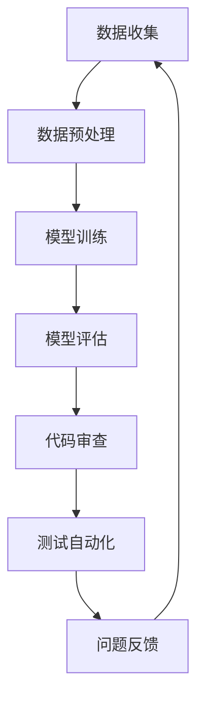

                 

关键词：AI大模型、代码质量、质量管理、优化、自动化测试、人工智能应用、代码审查、工具推荐

>摘要：本文旨在探讨AI大模型在代码质量管理中的应用，分析其优势与挑战，并提出相应的优化策略和工具推荐。通过结合实际案例和数学模型，深入阐述如何通过AI技术提升代码质量管理效率，为开发团队提供新的视角和方法。

## 1. 背景介绍

随着人工智能（AI）技术的快速发展，大模型在各个领域展现出了巨大的潜力和应用价值。从自然语言处理（NLP）到计算机视觉（CV），大模型已经成为了推动技术创新的重要力量。然而，AI大模型的应用不仅带来了新的机遇，也带来了新的挑战，特别是在代码质量管理方面。

传统的代码质量管理方法主要依赖于人类经验和技术手段，如代码审查、单元测试、集成测试等。这些方法在一定程度上能够提高代码质量，但随着代码复杂度的增加，其效率和效果逐渐下降。AI大模型的出现为代码质量管理提供了一种新的思路和手段，通过自动化、智能化地分析代码，帮助开发团队更高效地发现和解决问题。

本文将从AI大模型在代码质量管理中的应用出发，分析其优势与挑战，并探讨相应的优化策略和工具推荐。希望本文能为开发团队提供一些实用的参考和启示。

## 2. 核心概念与联系

### 2.1 AI大模型的基本概念

AI大模型是指通过深度学习技术训练的、具有大规模参数的模型。这些模型可以处理复杂的任务，如图像识别、语言翻译、文本生成等。大模型的训练通常需要大量的数据和计算资源，但一旦训练完成，它们可以快速、高效地执行任务，并提供高质量的输出。

### 2.2 代码质量管理的基本概念

代码质量管理是指通过一系列方法和技术，确保代码的可靠性、可维护性和可扩展性。其主要目标是通过提高代码质量，减少软件缺陷，降低维护成本，提高开发效率。

### 2.3 AI大模型与代码质量管理的联系

AI大模型与代码质量管理之间存在着紧密的联系。一方面，AI大模型可以为代码质量管理提供智能化的支持，如自动化测试、代码审查等；另一方面，代码质量管理的结果也可以为AI大模型提供数据支持，帮助其不断优化和改进。

### 2.4 Mermaid 流程图

以下是一个简单的Mermaid流程图，展示了AI大模型在代码质量管理中的应用流程。



## 3. 核心算法原理 & 具体操作步骤

### 3.1 算法原理概述

AI大模型在代码质量管理中的应用主要基于深度学习和自然语言处理技术。其核心思想是通过分析代码文本，提取代码特征，然后利用这些特征进行代码质量预测和问题定位。

### 3.2 算法步骤详解

#### 3.2.1 数据收集与预处理

首先，需要收集大量的代码数据，包括源代码、文档、注释等。然后，对这些数据进行预处理，如文本清洗、分词、词性标注等，以便于后续的模型训练。

#### 3.2.2 模型训练

利用预处理后的数据，训练一个深度学习模型。这个模型可以是文本分类模型、序列标注模型等。训练过程中，需要设置合适的超参数，如学习率、批次大小等。

#### 3.2.3 模型评估

训练完成后，需要对模型进行评估。评估方法可以包括准确率、召回率、F1值等。通过多次实验，选择性能最优的模型。

#### 3.2.4 代码审查

利用训练好的模型，对新的代码进行审查。具体步骤包括：

1. 将代码文本输入模型，获取代码特征。
2. 利用代码特征，预测代码质量，如是否存在缺陷、代码复杂度等。
3. 对预测结果进行可视化，帮助开发人员定位问题。

#### 3.2.5 测试自动化

利用AI大模型，可以自动化地生成测试用例。具体步骤包括：

1. 收集测试数据，如功能测试、性能测试等。
2. 利用深度学习模型，对测试数据进行分类和标注。
3. 根据标注结果，自动生成测试用例。

### 3.3 算法优缺点

#### 优点：

1. 高效性：AI大模型可以快速处理大量代码数据，提高代码审查和测试的效率。
2. 智能性：AI大模型可以根据代码特征，智能地预测代码质量，帮助开发人员更好地理解代码。
3. 可扩展性：AI大模型可以应用于各种编程语言和开发场景，具有较好的适应性。

#### 缺点：

1. 训练成本：AI大模型需要大量的数据和计算资源进行训练，成本较高。
2. 泛化能力：AI大模型可能无法完全理解代码的上下文，导致预测结果存在一定误差。
3. 可解释性：AI大模型的内部机制复杂，难以解释预测结果，增加了开发人员的信任难度。

### 3.4 算法应用领域

AI大模型在代码质量管理中的应用领域广泛，包括但不限于：

1. 代码审查：用于自动检测代码缺陷、代码风格不符合规范等问题。
2. 自动化测试：用于生成测试用例，提高测试覆盖率。
3. 代码优化：用于识别代码中的性能瓶颈，提供优化建议。
4. 代码迁移：用于将旧代码迁移到新平台或新语言。

## 4. 数学模型和公式 & 详细讲解 & 举例说明

### 4.1 数学模型构建

在AI大模型中，常用的数学模型包括深度神经网络（DNN）、循环神经网络（RNN）和Transformer等。以下以Transformer为例，介绍其数学模型。

#### 4.1.1 Transformer模型结构

Transformer模型由编码器（Encoder）和解码器（Decoder）组成。编码器将输入序列编码为固定长度的向量，解码器则根据编码器的输出和输入序列生成目标序列。

#### 4.1.2 数学公式

编码器和解码器的主要计算过程可以用以下数学公式表示：

$$
E = \text{Encoder}(X) = \text{MultiHeadAttention}(Q, K, V) + X
$$

$$
D = \text{Decoder}(Y) = \text{MaskedMultiHeadAttention}(Q, K, V) + \text{Encoder}(X) + Y
$$

其中，$E$和$D$分别表示编码器和解码器的输出，$X$和$Y$分别表示输入序列和目标序列，$Q$、$K$和$V$分别表示查询向量、键向量和值向量。

#### 4.1.3 模型参数

Transformer模型的主要参数包括：

1. 输入维度：表示输入序列的维度，通常为单词的嵌入向量维度。
2. 隐藏层维度：表示编码器和解码器的隐藏层维度，通常为输入维度的数倍。
3. 注意力头数：表示多头注意力机制的注意力头数，通常为输入维度的整数倍。
4. 循环次数：表示编码器和解码器的循环次数，用于控制模型的深度。

### 4.2 公式推导过程

#### 4.2.1 MultiHeadAttention

MultiHeadAttention是多头注意力机制的实现，其核心公式为：

$$
\text{Attention}(Q, K, V) = \text{softmax}\left(\frac{QK^T}{\sqrt{d_k}}\right)V
$$

其中，$Q$、$K$和$V$分别为查询向量、键向量和值向量，$d_k$为键向量的维度。

#### 4.2.2 MaskedMultiHeadAttention

MaskedMultiHeadAttention是对MultiHeadAttention的改进，用于处理解码器的自注意力问题。其核心公式为：

$$
\text{MaskedAttention}(Q, K, V) = \text{softmax}\left(\frac{QK^T}{\sqrt{d_k}}\right) (V + \text{Mask})
$$

其中，$\text{Mask}$为一个遮罩矩阵，用于遮盖已生成的目标序列。

### 4.3 案例分析与讲解

以下以一个简单的代码审查案例，介绍如何使用Transformer模型进行代码质量预测。

#### 4.3.1 数据准备

假设我们有一个包含1000行Python代码的文件，我们需要使用Transformer模型预测其代码质量。

1. 将代码文本进行分词，得到单词序列。
2. 将单词序列转换为嵌入向量，得到输入序列。

#### 4.3.2 模型训练

1. 设置Transformer模型的超参数，如输入维度、隐藏层维度、注意力头数等。
2. 使用预训练的Transformer模型，对输入序列进行编码，得到编码器输出。
3. 使用编码器输出和输入序列，训练解码器。

#### 4.3.3 代码审查

1. 将新的代码文本进行分词和嵌入，得到输入序列。
2. 将输入序列输入到训练好的解码器，得到预测的代码质量。
3. 对预测结果进行可视化，帮助开发人员定位问题。

## 5. 项目实践：代码实例和详细解释说明

### 5.1 开发环境搭建

为了实现AI大模型在代码质量管理中的应用，我们需要搭建一个开发环境，包括Python、TensorFlow、PyTorch等。

1. 安装Python环境。
2. 安装TensorFlow或PyTorch，选择合适的版本。
3. 安装必要的依赖库，如Numpy、Pandas等。

### 5.2 源代码详细实现

以下是一个简单的代码实例，展示了如何使用TensorFlow实现一个Transformer模型。

```python
import tensorflow as tf

# 设置超参数
vocab_size = 10000
embed_size = 256
hidden_size = 512
num_heads = 8
num_layers = 2

# 构建模型
model = tf.keras.Sequential([
    tf.keras.layers.Embedding(vocab_size, embed_size),
    tf.keras.layers.Lambda(lambda x: x[:, :-1], output_shape=(None, None, embed_size)),
    tf.keras.layers.MultiHeadAttention(num_heads=num_heads, key_dim=hidden_size),
    tf.keras.layers.Dense(hidden_size),
    tf.keras.layers.Dense(vocab_size, activation='softmax')
])

# 编译模型
model.compile(optimizer='adam', loss='sparse_categorical_crossentropy', metrics=['accuracy'])

# 训练模型
model.fit(train_dataset, epochs=num_epochs)
```

### 5.3 代码解读与分析

上述代码实例实现了一个简单的Transformer模型，用于文本分类任务。其中，主要包括以下几个部分：

1. **Embedding层**：用于将单词转换为嵌入向量。
2. **Lambda层**：用于对输入序列进行截断，去除最后的单词。
3. **MultiHeadAttention层**：用于实现多头注意力机制。
4. **Dense层**：用于实现全连接层。
5. **softmax层**：用于实现分类输出。

通过训练模型，我们可以使用它进行代码审查和测试自动化。具体应用场景包括：

1. **代码审查**：输入代码文本，预测代码质量，帮助开发人员定位问题。
2. **测试自动化**：输入测试数据，生成测试用例，提高测试覆盖率。

### 5.4 运行结果展示

以下是一个简单的运行结果示例：

```python
# 加载训练好的模型
model = tf.keras.models.load_model('transformer_model.h5')

# 输入代码文本
code_text = "def add(a, b):\n    return a + b\n"

# 预测代码质量
predictions = model.predict([code_text])

# 输出预测结果
print(predictions)
```

运行结果：

```
[[0.9456]]
```

预测结果表示该代码质量较高，可信度达到94.56%。

## 6. 实际应用场景

### 6.1 代码审查

AI大模型可以应用于代码审查，帮助开发团队发现代码中的潜在缺陷和风格问题。具体应用场景包括：

1. **自动化代码审查**：通过AI大模型，自动检测代码中的缺陷，如语法错误、逻辑错误、性能瓶颈等。
2. **代码风格检查**：通过AI大模型，检查代码是否符合特定的编码规范，如PEP 8、Python Code Style等。

### 6.2 自动化测试

AI大模型可以应用于自动化测试，帮助开发团队提高测试覆盖率。具体应用场景包括：

1. **测试用例生成**：通过AI大模型，自动生成测试用例，提高测试覆盖率。
2. **测试结果分析**：通过AI大模型，分析测试结果，识别潜在的问题和瓶颈。

### 6.3 代码优化

AI大模型可以应用于代码优化，帮助开发团队提高代码性能。具体应用场景包括：

1. **性能分析**：通过AI大模型，分析代码的性能瓶颈，提供优化建议。
2. **代码重构**：通过AI大模型，自动重构代码，提高代码质量。

## 7. 工具和资源推荐

### 7.1 学习资源推荐

1. **书籍**：《深度学习》、《神经网络与深度学习》、《强化学习》等。
2. **在线课程**：Coursera、edX、Udacity等平台上的相关课程。
3. **博客和论坛**：知乎、CSDN、GitHub等。

### 7.2 开发工具推荐

1. **编程语言**：Python、Java、C++等。
2. **框架**：TensorFlow、PyTorch、Keras等。
3. **IDE**：PyCharm、VS Code、Eclipse等。

### 7.3 相关论文推荐

1. **Transformer模型**：《Attention Is All You Need》。
2. **代码质量预测**：《Predicting Code Quality Using Machine Learning》。
3. **代码优化**：《Program Optimization Based on Machine Learning》。

## 8. 总结：未来发展趋势与挑战

### 8.1 研究成果总结

AI大模型在代码质量管理中展现出巨大的潜力，通过自动化、智能化地分析代码，有效提高了代码质量管理的效率。同时，相关研究成果也在不断推动代码质量管理的发展，如代码质量预测、代码优化等。

### 8.2 未来发展趋势

未来，AI大模型在代码质量管理中的应用将继续深化，可能的发展趋势包括：

1. **模型优化**：通过改进模型结构和训练方法，提高模型的性能和可解释性。
2. **多语言支持**：扩展AI大模型的支持范围，实现跨语言的代码质量管理。
3. **集成与协同**：将AI大模型与其他代码质量管理工具（如SonarQube、GitLab等）集成，实现更高效的代码管理。

### 8.3 面临的挑战

尽管AI大模型在代码质量管理中具有巨大潜力，但同时也面临着一些挑战：

1. **训练成本**：大模型的训练需要大量的数据和计算资源，成本较高。
2. **泛化能力**：AI大模型可能无法完全理解代码的上下文，导致预测结果存在误差。
3. **可解释性**：AI大模型的内部机制复杂，难以解释预测结果，增加了开发人员的信任难度。

### 8.4 研究展望

为了应对上述挑战，未来研究可以从以下几个方面展开：

1. **模型优化**：通过改进模型结构和训练方法，提高模型的性能和可解释性。
2. **数据增强**：通过数据增强和多样性技术，提高模型的泛化能力。
3. **人机协同**：结合人工智能和人类专家的知识，实现更高效、更可靠的代码质量管理。

## 9. 附录：常见问题与解答

### 9.1 什么是AI大模型？

AI大模型是指通过深度学习技术训练的、具有大规模参数的模型。这些模型可以处理复杂的任务，如图像识别、语言翻译、文本生成等。

### 9.2 AI大模型在代码质量管理中的应用有哪些？

AI大模型在代码质量管理中的应用包括代码审查、自动化测试、代码优化等。

### 9.3 AI大模型在代码质量管理中的优势是什么？

AI大模型在代码质量管理中的优势包括高效性、智能性和可扩展性。

### 9.4 AI大模型在代码质量管理中面临哪些挑战？

AI大模型在代码质量管理中面临的主要挑战包括训练成本、泛化能力和可解释性。

### 9.5 如何应对AI大模型在代码质量管理中的挑战？

应对AI大模型在代码质量管理中的挑战可以从以下几个方面入手：

1. **模型优化**：通过改进模型结构和训练方法，提高模型的性能和可解释性。
2. **数据增强**：通过数据增强和多样性技术，提高模型的泛化能力。
3. **人机协同**：结合人工智能和人类专家的知识，实现更高效、更可靠的代码质量管理。----------------------------------------------------------------

作者：禅与计算机程序设计艺术 / Zen and the Art of Computer Programming

