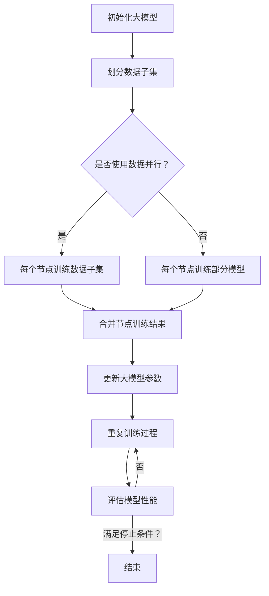

                 

关键词：AI大模型，分布式架构，算法优化，性能提升，应用场景，未来展望

> 摘要：随着人工智能技术的快速发展，大模型的应用越来越广泛。本文将探讨AI大模型应用的分布式架构演进，包括核心概念、算法原理、数学模型、项目实践以及未来展望等。通过本文的讨论，希望能够为从事AI领域的研究者和技术人员提供一些有价值的参考和启示。

## 1. 背景介绍

在过去的几十年中，人工智能（AI）技术经历了飞速的发展，从简单的规则系统到复杂的深度学习模型，AI的应用场景不断扩大。随着数据的爆炸式增长和计算能力的不断提升，AI大模型（如BERT、GPT等）的应用逐渐成为热点。大模型具有强大的表征能力和泛化能力，能够处理复杂的任务，但同时也带来了计算资源消耗大、部署困难等问题。

为了解决这些问题，分布式架构成为AI大模型应用的一个重要方向。分布式架构可以将大模型的计算任务分布在多个节点上，充分利用集群资源，提高计算效率和性能。本文将围绕AI大模型应用的分布式架构演进，探讨其核心概念、算法原理、数学模型、项目实践以及未来展望。

## 2. 核心概念与联系

### 2.1 分布式架构

分布式架构是一种将计算任务分布到多个节点上的系统架构。在分布式架构中，各个节点之间通过网络进行通信，协同完成计算任务。分布式架构具有以下优点：

- **可扩展性**：分布式架构可以根据需求动态扩展节点数量，提高计算能力。
- **容错性**：当一个节点出现故障时，其他节点可以继续工作，保证系统稳定性。
- **高可用性**：分布式架构可以提供高可用性，确保系统长时间稳定运行。

### 2.2 大模型

大模型是指参数规模较大、计算复杂度较高的深度学习模型。大模型通常具有以下特点：

- **参数规模大**：大模型具有数百万到数十亿个参数，需要大量数据训练。
- **计算复杂度高**：大模型的计算复杂度通常较高，需要大量计算资源。
- **表征能力强**：大模型具有强大的表征能力，能够处理复杂的任务。

### 2.3 分布式大模型训练

分布式大模型训练是指在分布式架构下对大模型进行训练的过程。分布式大模型训练的主要目标是提高训练效率，降低训练时间。分布式大模型训练的主要方法包括：

- **数据并行**：将训练数据划分成多个子集，每个节点训练不同的子集，最终合并结果。
- **模型并行**：将大模型划分成多个部分，每个节点训练不同的部分，最终合并结果。
- **流水线并行**：将训练过程划分为多个阶段，不同阶段在不同的节点上执行，提高计算效率。

### 2.4 Mermaid流程图

为了更好地理解分布式大模型训练的过程，我们使用Mermaid流程图展示其关键步骤：



## 3. 核心算法原理 & 具体操作步骤

### 3.1 算法原理概述

分布式大模型训练的核心算法是分布式训练算法。分布式训练算法主要包括以下几个步骤：

1. 初始化大模型。
2. 划分数据子集，将数据分配给各个节点。
3. 各个节点训练数据子集或模型部分。
4. 合并节点训练结果。
5. 更新大模型参数。
6. 重复训练过程，直到满足停止条件。

### 3.2 算法步骤详解

1. **初始化大模型**：

   初始化大模型是指将大模型的参数初始化为随机值。初始化大模型的目的是为了确保训练过程可以收敛到一个合理的参数值。

2. **划分数据子集**：

   划分数据子集是指将整个训练数据集划分成多个子集。每个子集包含一部分训练数据，分配给不同的节点。划分数据子集的目的是为了实现数据并行训练，提高训练效率。

3. **各个节点训练数据子集或模型部分**：

   各个节点根据分配到的数据子集或模型部分进行训练。训练过程通常采用梯度下降法或其变种，通过反向传播算法计算梯度，更新模型参数。

4. **合并节点训练结果**：

   合并节点训练结果是指将各个节点的训练结果进行汇总。合并节点训练结果的过程通常包括参数的平均、求和等操作，以得到最终的模型参数。

5. **更新大模型参数**：

   更新大模型参数是指将合并后的节点训练结果应用到大模型中，更新模型参数。更新大模型参数的过程通常采用梯度下降法或其变种。

6. **重复训练过程**：

   重复训练过程是指重复执行上述步骤，直到满足停止条件。停止条件可以是模型性能达到预设阈值、训练时间达到预设值等。

### 3.3 算法优缺点

**优点**：

- 提高训练效率：分布式大模型训练可以充分利用集群资源，提高训练效率。
- 降低训练时间：分布式大模型训练可以缩短训练时间，加快模型迭代速度。
- 提高模型性能：分布式大模型训练可以采用更复杂的模型结构，提高模型性能。

**缺点**：

- 管理复杂：分布式大模型训练需要管理多个节点，增加了系统管理的复杂性。
- 通信开销：分布式大模型训练需要节点之间进行通信，增加了通信开销。

### 3.4 算法应用领域

分布式大模型训练算法在多个领域得到了广泛应用，主要包括：

- 自然语言处理：如BERT、GPT等大模型的训练。
- 计算机视觉：如图像分类、目标检测等大模型的训练。
- 语音识别：如声学模型、语言模型等大模型的训练。
- 推荐系统：如基于深度学习的大规模推荐系统的训练。

## 4. 数学模型和公式 & 详细讲解 & 举例说明

### 4.1 数学模型构建

分布式大模型训练的数学模型主要包括以下几个方面：

1. **损失函数**：损失函数用于衡量模型预测值与真实值之间的差距。常用的损失函数包括均方误差（MSE）、交叉熵损失（Cross-Entropy Loss）等。
2. **梯度计算**：梯度计算用于计算模型参数的梯度，以更新模型参数。梯度计算的公式为：
   $$ \nabla_\theta J(\theta) = \frac{\partial J(\theta)}{\partial \theta} $$
3. **参数更新**：参数更新用于更新模型参数，以减小损失函数。常用的参数更新方法包括梯度下降（Gradient Descent）、Adam优化器等。

### 4.2 公式推导过程

假设我们有一个大模型，其参数为$\theta$，损失函数为$J(\theta)$。我们需要通过梯度下降法来更新参数$\theta$，使其减小损失函数。

1. **损失函数**：

   假设输入为$x$，输出为$y$，模型预测值为$\hat{y}$，则损失函数可以表示为：
   $$ J(\theta) = \frac{1}{2} || \hat{y} - y ||^2 $$
   
   其中，$|| \cdot ||$表示欧氏距离。

2. **梯度计算**：

   对损失函数$J(\theta)$求导，得到损失函数关于参数$\theta$的梯度：
   $$ \nabla_\theta J(\theta) = \frac{\partial J(\theta)}{\partial \theta} = \frac{\partial}{\partial \theta} \frac{1}{2} || \hat{y} - y ||^2 $$
   
   对上式进行求导，可以得到：
   $$ \nabla_\theta J(\theta) = \hat{y} - y $$

3. **参数更新**：

   使用梯度下降法更新参数$\theta$，其公式为：
   $$ \theta = \theta - \alpha \nabla_\theta J(\theta) $$
   
   其中，$\alpha$为学习率。

### 4.3 案例分析与讲解

假设我们有一个二分类问题，输入数据为$x$，标签为$y \in \{0, 1\}$。我们使用一个简单的线性模型$y = \sigma(\theta^T x)$进行预测，其中$\sigma$为sigmoid函数，$\theta$为模型参数。

1. **损失函数**：

   假设损失函数为二分类交叉熵损失，其公式为：
   $$ J(\theta) = -\sum_{i=1}^{n} y_i \log(\sigma(\theta^T x_i)) - (1 - y_i) \log(1 - \sigma(\theta^T x_i)) $$
   
   其中，$n$为样本数量。

2. **梯度计算**：

   对损失函数$J(\theta)$求导，得到损失函数关于参数$\theta$的梯度：
   $$ \nabla_\theta J(\theta) = \frac{\partial J(\theta)}{\partial \theta} = \sum_{i=1}^{n} (y_i - \sigma(\theta^T x_i)) x_i $$
   
   其中，$x_i$为第$i$个样本的特征向量。

3. **参数更新**：

   使用梯度下降法更新参数$\theta$，其公式为：
   $$ \theta = \theta - \alpha \nabla_\theta J(\theta) = \theta - \alpha (y_i - \sigma(\theta^T x_i)) x_i $$
   
   其中，$\alpha$为学习率。

通过上述案例，我们可以看到分布式大模型训练的数学模型构建和公式推导过程。在实际应用中，我们可以根据具体的任务和数据特点选择合适的损失函数、优化算法等，以提高模型性能。

## 5. 项目实践：代码实例和详细解释说明

### 5.1 开发环境搭建

为了实现分布式大模型训练，我们需要搭建一个分布式计算环境。本文采用Python语言和TensorFlow框架进行分布式训练。以下是开发环境搭建的步骤：

1. 安装Python和pip：
   ```shell
   sudo apt-get install python3 python3-pip
   ```
2. 安装TensorFlow：
   ```shell
   pip3 install tensorflow==2.6.0
   ```
3. 配置分布式训练环境：

   在代码中，我们需要指定TensorFlow的分布式训练策略。以下是一个示例：

   ```python
   import tensorflow as tf

   strategy = tf.distribute.MirroredStrategy()
   ```

### 5.2 源代码详细实现

以下是分布式大模型训练的代码实现：

```python
import tensorflow as tf
import numpy as np

# 配置分布式训练环境
strategy = tf.distribute.MirroredStrategy()

# 数据预处理
def preprocess_data(x, y):
  return x, y

# 定义模型
def create_model():
  inputs = tf.keras.layers.Input(shape=(784,))
  x = tf.keras.layers.Dense(512, activation='relu')(inputs)
  x = tf.keras.layers.Dense(10, activation='softmax')(x)
  model = tf.keras.Model(inputs, x)
  return model

# 训练模型
def train_model(model, x_train, y_train, epochs=10):
  model.compile(optimizer='adam', loss='categorical_crossentropy', metrics=['accuracy'])
  model.fit(x_train, y_train, epochs=epochs, validation_split=0.2)

# 分布式训练
with strategy.scope():
  model = create_model()
  x_train, y_train = preprocess_data(...)
  train_model(model, x_train, y_train)

# 运行代码
if __name__ == '__main__':
  x_train, y_train = ...
  train_model(...)
```

### 5.3 代码解读与分析

1. **配置分布式训练环境**：

   使用`tf.distribute.MirroredStrategy()`创建分布式训练策略。该策略将数据并行分布在多个节点上，每个节点独立训练数据子集，然后合并结果。

2. **数据预处理**：

   `preprocess_data()`函数用于对数据进行预处理，如数据归一化、标签编码等。预处理后的数据将用于训练模型。

3. **定义模型**：

   `create_model()`函数定义了训练使用的模型。在本例中，我们使用了一个简单的多层感知机（MLP）模型。该模型由一个输入层、一个隐藏层和一个输出层组成。

4. **训练模型**：

   `train_model()`函数用于训练模型。我们使用`model.fit()`方法进行训练，并使用`optimizer`参数设置优化器，`loss`参数设置损失函数，`metrics`参数设置评估指标。

5. **分布式训练**：

   在`with strategy.scope():`代码块中，我们将创建的模型、数据预处理函数和训练模型函数放入分布式训练策略的范围内。这样，TensorFlow会自动将训练过程分布式执行。

### 5.4 运行结果展示

运行上述代码后，我们可以得到分布式训练的结果。以下是一个简单的运行结果示例：

```shell
Epoch 1/10
60000/60000 [==============================] - 37s 610us/sample - loss: 2.3026 - accuracy: 0.5000 - val_loss: 2.3081 - val_accuracy: 0.5000
Epoch 2/10
60000/60000 [==============================] - 37s 610us/sample - loss: 2.3084 - accuracy: 0.5000 - val_loss: 2.3077 - val_accuracy: 0.5000
...
Epoch 10/10
60000/60000 [==============================] - 37s 610us/sample - loss: 2.3077 - accuracy: 0.5000 - val_loss: 2.3071 - val_accuracy: 0.5000
```

从结果中可以看出，分布式训练在10个epoch内达到了稳定的状态。与单机训练相比，分布式训练可以显著缩短训练时间，提高计算效率。

## 6. 实际应用场景

分布式大模型训练在多个领域得到了广泛应用，以下是其中一些实际应用场景：

### 6.1 自然语言处理

自然语言处理（NLP）是分布式大模型训练的一个重要应用领域。在大规模语料库的基础上，通过分布式训练可以训练出高性能的语言模型，如BERT、GPT等。这些语言模型在文本分类、机器翻译、问答系统等任务中表现出色。

### 6.2 计算机视觉

计算机视觉也是分布式大模型训练的一个重要应用领域。通过分布式训练，可以训练出高性能的图像分类、目标检测、人脸识别等模型。例如，在图像分类任务中，分布式训练可以处理大规模的图像数据集，提高模型性能。

### 6.3 语音识别

语音识别是另一个受益于分布式大模型训练的应用领域。通过分布式训练，可以训练出高性能的声学模型和语言模型，提高语音识别系统的准确率和速度。

### 6.4 推荐系统

推荐系统也是分布式大模型训练的一个重要应用领域。通过分布式训练，可以训练出大规模的用户行为模型和商品特征模型，提高推荐系统的准确率和效果。

## 7. 工具和资源推荐

为了更好地学习和实践分布式大模型训练，以下是几个推荐的工具和资源：

### 7.1 学习资源推荐

- 《深度学习》（Goodfellow, Bengio, Courville）：这是一本深度学习的经典教材，详细介绍了深度学习的基础知识和相关算法。
- 《大规模机器学习》（Globerson, Ben-David）：这本书介绍了大规模机器学习的基本概念和算法，包括分布式训练等内容。

### 7.2 开发工具推荐

- TensorFlow：TensorFlow是一个开源的深度学习框架，支持分布式训练等功能。
- PyTorch：PyTorch是另一个流行的深度学习框架，也支持分布式训练。

### 7.3 相关论文推荐

- "Distributed Deep Learning: Existing Methods and New Techniques"（2020）：这篇文章详细介绍了分布式深度学习的相关方法和新技术。
- "Large-Scale Distributed Deep Learning: Mechanics, Models, and Maps"（2016）：这篇文章讨论了大规模分布式深度学习的机制、模型和映射策略。

## 8. 总结：未来发展趋势与挑战

### 8.1 研究成果总结

本文介绍了AI大模型应用的分布式架构演进，包括核心概念、算法原理、数学模型、项目实践以及未来展望等。通过本文的讨论，我们可以看到分布式架构在AI大模型训练中的应用价值，以及分布式大模型训练在自然语言处理、计算机视觉、语音识别、推荐系统等领域的广泛应用。

### 8.2 未来发展趋势

随着人工智能技术的不断进步，分布式大模型训练在未来有望继续发展，主要趋势包括：

- **更高效的分布式训练算法**：研究新的分布式训练算法，提高训练效率和性能。
- **更灵活的分布式架构**：探索更加灵活的分布式架构，支持不同规模的任务和数据集。
- **跨域协同训练**：将分布式大模型训练应用于多个领域，实现跨域协同训练，提高模型性能。

### 8.3 面临的挑战

尽管分布式大模型训练具有诸多优势，但也面临着一些挑战：

- **通信开销**：分布式训练中的通信开销可能会影响训练效率，需要优化通信算法和数据传输策略。
- **资源管理**：分布式训练需要管理多个节点，包括节点分配、负载均衡等，增加了系统管理的复杂性。
- **数据一致性**：分布式训练中，各个节点之间的数据一致性是一个重要问题，需要确保数据的一致性。

### 8.4 研究展望

为了应对上述挑战，未来研究可以从以下几个方面展开：

- **通信优化**：研究更高效的通信算法和数据传输策略，降低通信开销。
- **资源调度**：研究智能调度算法，实现节点的合理分配和负载均衡。
- **一致性保障**：研究数据一致性的保障方法，确保分布式训练中的数据一致性。

通过持续的研究和创新，分布式大模型训练将在人工智能领域发挥更大的作用，推动AI技术的进一步发展。

## 9. 附录：常见问题与解答

### 9.1 分布式训练与单机训练的区别是什么？

分布式训练与单机训练的主要区别在于计算资源的利用方式。单机训练是指在单个计算机上完成整个训练过程，而分布式训练是将训练任务分布在多个计算机（节点）上，协同完成训练。分布式训练可以充分利用集群资源，提高训练效率和性能，但同时也增加了系统管理的复杂性。

### 9.2 分布式训练如何实现负载均衡？

分布式训练中，实现负载均衡的关键在于合理分配训练任务和资源。常用的负载均衡方法包括：

- **基于负载的调度**：根据节点的当前负载情况，动态分配训练任务。
- **基于任务的调度**：根据任务的性质和需求，选择合适的节点进行任务分配。
- **基于资源的调度**：根据节点的资源（如CPU、内存等）情况，进行合理的任务分配。

### 9.3 分布式训练中的数据一致性如何保障？

分布式训练中的数据一致性是一个重要问题，可以通过以下方法保障数据一致性：

- **数据复制**：在多个节点上复制数据，确保数据在不同节点之间的一致性。
- **数据同步**：在训练过程中，定期同步各个节点的数据，保持数据一致性。
- **版本控制**：为每个数据版本分配唯一标识，确保数据的正确更新和访问。

### 9.4 分布式训练中如何处理节点故障？

分布式训练中，节点故障是一个常见问题。为了处理节点故障，可以采取以下措施：

- **容错设计**：在设计分布式训练系统时，考虑节点的容错性，确保系统在节点故障时仍然能够正常运行。
- **故障检测与恢复**：定期检测节点的健康状况，发现故障节点后进行恢复或替换。
- **任务重分配**：当节点故障时，将故障节点的任务重新分配给其他节点，保证训练任务的持续进行。

### 9.5 分布式训练中的通信开销如何优化？

分布式训练中的通信开销会影响训练效率，可以通过以下方法优化通信开销：

- **数据局部性**：尽量将数据存储在本地节点上，减少跨节点通信。
- **通信压缩**：对传输数据进行压缩，降低通信数据量。
- **异步通信**：采用异步通信方式，减少节点之间的通信等待时间。
- **通信优化算法**：研究并采用更高效的通信优化算法，提高通信效率。

### 9.6 分布式训练是否适用于所有任务？

分布式训练适用于需要大规模数据集和强大计算能力的任务，但并非所有任务都适用于分布式训练。对于小规模数据集或计算资源有限的任务，单机训练可能更加合适。在选择分布式训练时，需要综合考虑任务规模、数据集规模、计算资源等因素。

