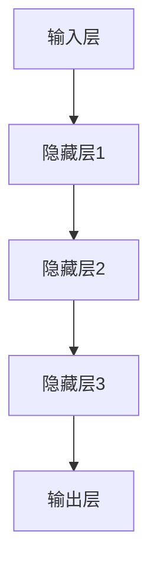

                 

关键词：AI大模型、创业机会、挑战、应用场景、技术趋势

> 摘要：本文将探讨AI大模型在现代科技发展中的重要性，分析其创业机会与挑战，并展望未来AI大模型在各个领域的应用前景。

## 1. 背景介绍

随着人工智能技术的迅猛发展，AI大模型（Large-scale AI Models）逐渐成为学术界和工业界关注的焦点。AI大模型是指那些具有数亿甚至数十亿参数的复杂神经网络模型，如GPT-3、BERT等。这些模型在自然语言处理、计算机视觉、语音识别等领域取得了显著成果，展现了巨大的潜力。

AI大模型的兴起不仅改变了传统的人工智能应用场景，也为创业者提供了丰富的机会。然而，与此同时，AI大模型的应用也面临诸多挑战，如计算资源需求、数据隐私、算法偏见等。因此，对于创业者来说，把握AI大模型的应用机遇，同时应对潜在挑战，显得尤为重要。

## 2. 核心概念与联系

### 2.1 AI大模型的概念

AI大模型是指具有大规模参数和复杂结构的神经网络模型，这些模型通常在大量数据上进行训练，以实现高性能的预测和决策能力。

### 2.2 AI大模型的工作原理

AI大模型通常采用深度学习技术，通过多层神经网络对数据进行处理，逐步提取特征，最终实现预测和分类任务。

### 2.3 AI大模型的结构架构

AI大模型的结构通常由输入层、隐藏层和输出层组成。输入层接收外部数据，隐藏层进行特征提取，输出层产生预测结果。

下面是一个Mermaid流程图，展示了AI大模型的基本架构：



## 3. 核心算法原理 & 具体操作步骤

### 3.1 算法原理概述

AI大模型的核心算法是深度学习。深度学习通过多层神经网络对数据进行处理，逐层提取特征，最终实现预测和分类任务。

### 3.2 算法步骤详解

1. 数据预处理：对输入数据进行标准化、归一化等处理，使其适合模型训练。
2. 模型构建：定义神经网络结构，包括输入层、隐藏层和输出层。
3. 模型训练：使用训练数据对模型进行训练，调整网络参数，使模型能够准确预测结果。
4. 模型评估：使用测试数据对模型进行评估，计算模型的准确率、召回率等指标。
5. 模型部署：将训练好的模型部署到实际应用环境中，进行预测和决策。

### 3.3 算法优缺点

优点：
- 强大的特征提取能力：能够自动提取复杂的数据特征，提高模型的预测性能。
- 自适应能力：可以根据不同领域的数据进行自适应调整，具有较强的泛化能力。

缺点：
- 计算资源需求大：训练大规模模型需要大量的计算资源，对硬件要求较高。
- 数据隐私问题：在训练过程中需要大量数据，可能涉及到数据隐私问题。

### 3.4 算法应用领域

AI大模型在自然语言处理、计算机视觉、语音识别等领域取得了显著成果，可以应用于以下场景：
- 自然语言处理：文本分类、情感分析、机器翻译等。
- 计算机视觉：图像分类、目标检测、图像生成等。
- 语音识别：语音合成、语音识别、语音增强等。

## 4. 数学模型和公式 & 详细讲解 & 举例说明

### 4.1 数学模型构建

AI大模型的核心是神经网络，其基本数学模型可以表示为：

$$
y = f(z)
$$

其中，$y$ 是输出，$z$ 是神经元的输入，$f$ 是激活函数。

### 4.2 公式推导过程

神经元的输入可以表示为：

$$
z = \sum_{i=1}^{n} w_i * x_i
$$

其中，$w_i$ 是权重，$x_i$ 是输入特征。

### 4.3 案例分析与讲解

以图像分类任务为例，假设输入图像为 $x$，网络共有三层，分别为输入层、隐藏层和输出层。隐藏层的激活函数为 $f_1$，输出层的激活函数为 $f_2$。则：

输入层：$z_1 = x$

隐藏层：$z_2 = f_1(\sum_{i=1}^{n} w_{21} * x_i)$

输出层：$z_3 = f_2(\sum_{i=1}^{m} w_{31} * z_2)$

其中，$w_{21}$ 和 $w_{31}$ 分别为隐藏层到输出层的权重。

## 5. 项目实践：代码实例和详细解释说明

### 5.1 开发环境搭建

首先，安装Python和TensorFlow库：

```bash
pip install python tensorflow
```

### 5.2 源代码详细实现

下面是一个简单的AI大模型图像分类项目，使用TensorFlow实现：

```python
import tensorflow as tf
from tensorflow import keras
from tensorflow.keras import layers

# 数据预处理
(x_train, y_train), (x_test, y_test) = keras.datasets.cifar10.load_data()
x_train, x_test = x_train / 255.0, x_test / 255.0

# 模型构建
model = keras.Sequential([
  layers.Conv2D(32, (3,3), activation='relu', input_shape=(32, 32, 3)),
  layers.MaxPooling2D(pool_size=(2, 2)),
  layers.Flatten(),
  layers.Dense(64, activation='relu'),
  layers.Dense(10, activation='softmax')
])

# 模型训练
model.compile(optimizer='adam',
              loss='sparse_categorical_crossentropy',
              metrics=['accuracy'])

model.fit(x_train, y_train, epochs=10)

# 模型评估
test_loss, test_acc = model.evaluate(x_test,  y_test, verbose=2)
print('\nTest accuracy:', test_acc)
```

### 5.3 代码解读与分析

1. 导入TensorFlow库和相关模块。
2. 加载CIFAR-10数据集并进行预处理。
3. 构建模型，包括卷积层、最大池化层、全连接层等。
4. 编译模型，设置优化器和损失函数。
5. 训练模型，使用训练数据。
6. 评估模型，使用测试数据。

## 6. 实际应用场景

AI大模型在多个领域具有广泛的应用，以下是一些实际应用场景：

- **自然语言处理**：文本分类、情感分析、机器翻译等。
- **计算机视觉**：图像分类、目标检测、图像生成等。
- **语音识别**：语音合成、语音识别、语音增强等。
- **医疗诊断**：疾病预测、诊断辅助等。
- **金融分析**：风险控制、投资决策等。

## 7. 工具和资源推荐

### 7.1 学习资源推荐

- 《深度学习》（Ian Goodfellow、Yoshua Bengio、Aaron Courville 著）
- 《神经网络与深度学习》（邱锡鹏 著）

### 7.2 开发工具推荐

- TensorFlow
- PyTorch

### 7.3 相关论文推荐

- "Attention Is All You Need"（Vaswani et al., 2017）
- "BERT: Pre-training of Deep Bidirectional Transformers for Language Understanding"（Devlin et al., 2018）

## 8. 总结：未来发展趋势与挑战

### 8.1 研究成果总结

AI大模型在多个领域取得了显著成果，展现了强大的能力。然而，其应用仍面临诸多挑战，如计算资源需求、数据隐私、算法偏见等。

### 8.2 未来发展趋势

- **模型压缩与优化**：降低计算资源需求，提高模型效率。
- **跨模态学习**：融合不同模态的数据，提高模型性能。
- **联邦学习**：保护数据隐私，实现分布式训练。

### 8.3 面临的挑战

- **计算资源需求**：大规模模型训练需要大量计算资源，对硬件要求较高。
- **数据隐私**：数据隐私保护是一个重要问题，需要更多研究和解决方案。
- **算法偏见**：模型可能存在算法偏见，需要更多研究和改进。

### 8.4 研究展望

AI大模型在未来的发展具有广阔的前景。随着技术的不断进步，AI大模型将在更多领域发挥重要作用，为人类社会带来更多价值。

## 9. 附录：常见问题与解答

### 9.1 什么是AI大模型？

AI大模型是指那些具有大规模参数和复杂结构的神经网络模型，如GPT-3、BERT等。这些模型在自然语言处理、计算机视觉、语音识别等领域取得了显著成果。

### 9.2 AI大模型有哪些优缺点？

优点：强大的特征提取能力、自适应能力等；缺点：计算资源需求大、数据隐私问题等。

### 9.3 AI大模型有哪些应用领域？

AI大模型在自然语言处理、计算机视觉、语音识别等领域取得了显著成果，可以应用于文本分类、图像分类、语音合成等任务。

### 9.4 如何构建一个AI大模型？

构建AI大模型需要以下步骤：

1. 数据预处理：对输入数据进行标准化、归一化等处理。
2. 模型构建：定义神经网络结构，包括输入层、隐藏层和输出层。
3. 模型训练：使用训练数据对模型进行训练，调整网络参数。
4. 模型评估：使用测试数据对模型进行评估，计算模型性能。
5. 模型部署：将训练好的模型部署到实际应用环境中。

### 9.5 如何优化AI大模型？

优化AI大模型可以从以下几个方面入手：

1. 模型压缩与优化：降低计算资源需求，提高模型效率。
2. 跨模态学习：融合不同模态的数据，提高模型性能。
3. 联邦学习：保护数据隐私，实现分布式训练。
4. 算法改进：研究新的神经网络结构、优化算法等。

----------------------------------------------------------------
作者：禅与计算机程序设计艺术 / Zen and the Art of Computer Programming

以上就是关于《AI大模型应用的创业机会与挑战》的完整文章。希望这篇文章能帮助读者深入了解AI大模型的应用场景、挑战与发展趋势。在未来的科技发展中，AI大模型将扮演越来越重要的角色，为人类创造更多价值。|

