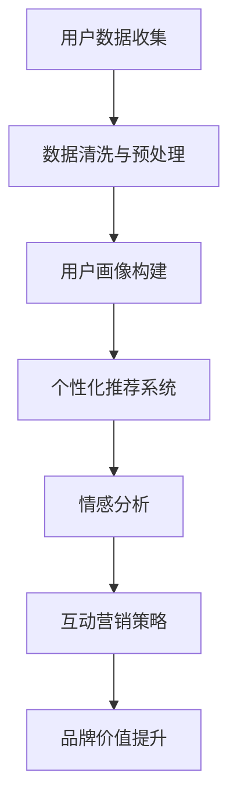

                 

作为人工智能领域的权威专家，我深感AI大模型在现代社会中的应用之广和影响力之深。近年来，AI大模型不仅在技术层面取得了显著进步，同时在品牌营销领域也展现出了前所未有的潜力。本文将深入探讨AI大模型在品牌营销中的应用新思路，旨在为企业和营销从业者提供创新的视角和实用的策略。

## 关键词

- AI大模型
- 品牌营销
- 个性化推荐
- 情感计算
- 用户画像
- 互动营销

## 摘要

本文将分析AI大模型在品牌营销中的核心价值和应用场景，介绍其核心技术原理，并通过实例展示如何利用AI大模型实现高效的品牌营销策略。此外，还将探讨AI大模型在品牌营销中面临的挑战和未来发展趋势。

## 1. 背景介绍

随着大数据和云计算技术的迅猛发展，AI大模型逐渐成为现代科技的前沿。这些大模型具有强大的数据处理和分析能力，能够从海量数据中提取有价值的信息，进行精准的预测和决策。在品牌营销领域，AI大模型的应用不仅能够提高营销效率，还能增强品牌与消费者之间的互动和情感连接。

### 1.1 品牌营销的现状与挑战

在数字化时代，品牌营销面临着前所未有的挑战。传统的营销策略往往难以满足个性化、互动性、实时性的要求。消费者对品牌的期望不断提高，他们希望在购买过程中获得独特的体验和个性化的服务。此外，品牌之间的竞争也日趋激烈，如何脱颖而出成为每个品牌关注的焦点。

### 1.2 AI大模型在品牌营销中的作用

AI大模型通过深度学习、自然语言处理、图像识别等技术，能够实现以下目标：

1. **个性化推荐**：根据用户的兴趣和行为，提供个性化的产品和服务推荐。
2. **情感计算**：分析消费者的情感状态，进行情感营销。
3. **用户画像**：构建详细的用户画像，了解用户需求和行为模式。
4. **互动营销**：通过智能对话系统与用户实时互动，提升用户体验。

## 2. 核心概念与联系

在品牌营销中，AI大模型的应用涉及多个核心概念和技术，下面通过一个Mermaid流程图来展示这些概念及其联系。



### 2.1 用户数据收集

用户数据是AI大模型应用的基础，包括用户的行为数据、兴趣偏好、社交媒体活动等。这些数据通过多种渠道收集，如网站分析、客户反馈、社交媒体等。

### 2.2 数据清洗与预处理

收集到的数据往往存在噪声和不一致性，需要通过数据清洗和预处理技术进行清洗和标准化，为后续分析做准备。

### 2.3 用户画像构建

用户画像是对用户多维度特征的描述，包括年龄、性别、地域、消费习惯等。通过用户画像，品牌可以更准确地了解用户需求和行为模式。

### 2.4 个性化推荐系统

个性化推荐系统根据用户画像和用户行为数据，为用户推荐个性化的产品和服务。推荐算法包括协同过滤、基于内容的推荐等。

### 2.5 情感分析

情感分析通过自然语言处理技术，分析用户的情感状态，如喜悦、愤怒、失望等。情感分析可以帮助品牌进行情感营销，提升用户体验。

### 2.6 互动营销策略

互动营销策略通过智能对话系统和社交媒体互动，与用户进行实时互动，提升用户参与度和忠诚度。

### 2.7 品牌价值提升

通过个性化推荐、情感分析和互动营销，AI大模型可以帮助品牌提升用户满意度、忠诚度和品牌价值。

## 3. 核心算法原理 & 具体操作步骤

### 3.1 算法原理概述

AI大模型在品牌营销中的应用主要基于以下算法原理：

1. **深度学习**：通过多层神经网络对大量数据进行训练，提取特征并建立预测模型。
2. **自然语言处理**：对文本数据进行语义分析和情感分析，提取关键信息。
3. **协同过滤**：通过分析用户行为数据，为用户推荐相似兴趣的产品和服务。
4. **强化学习**：通过互动反馈不断优化推荐策略，提升用户满意度。

### 3.2 算法步骤详解

1. **数据收集**：从各种渠道收集用户数据，如网站日志、社交媒体活动等。
2. **数据预处理**：清洗和标准化数据，为后续分析做准备。
3. **特征提取**：通过深度学习和自然语言处理技术，提取用户行为和文本数据的特征。
4. **用户画像构建**：根据特征数据，构建详细的用户画像。
5. **推荐算法训练**：使用协同过滤或强化学习算法，训练推荐模型。
6. **推荐系统部署**：将训练好的推荐模型部署到线上平台，为用户推荐个性化产品和服务。
7. **情感分析**：分析用户评论和反馈，提取情感信息。
8. **互动营销**：根据用户情感分析结果，制定互动营销策略。

### 3.3 算法优缺点

**优点**：

1. **个性化推荐**：提高用户满意度和转化率。
2. **情感分析**：提升品牌与消费者的情感连接。
3. **实时互动**：增强用户参与度和忠诚度。

**缺点**：

1. **数据隐私**：用户数据收集和处理可能引发隐私问题。
2. **算法偏差**：推荐结果可能存在偏见，影响用户体验。

### 3.4 算法应用领域

AI大模型在品牌营销中的应用非常广泛，包括电商、金融、旅游、餐饮等多个行业。以下是一些具体的应用领域：

1. **电商推荐**：为用户推荐个性化的商品，提升销售转化率。
2. **金融风控**：通过用户行为数据预测风险，降低金融风险。
3. **旅游推荐**：根据用户兴趣和偏好推荐旅游目的地和行程。
4. **餐饮推荐**：为用户提供个性化的菜品推荐，提升用户体验。

## 4. 数学模型和公式 & 详细讲解 & 举例说明

### 4.1 数学模型构建

AI大模型在品牌营销中的应用涉及多个数学模型，如线性回归、逻辑回归、协同过滤等。以下是一个简单的协同过滤模型的数学公式。

$$
R_{ui} = \sum_{j \in N(i)} \frac{q_{uj}}{\sum_{k \in N(i)} q_{uk}} \cdot r_{ij}
$$

其中，$R_{ui}$表示用户$i$对物品$j$的评分预测，$N(i)$表示用户$i$的邻居集合，$q_{uj}$表示用户$i$和邻居$j$的相似度，$r_{ij}$表示用户$i$对物品$j$的实际评分。

### 4.2 公式推导过程

协同过滤模型的推导过程可以分为以下几步：

1. **确定邻居集合**：根据用户$i$的行为数据，找到与其相似的用户集合$N(i)$。
2. **计算相似度**：使用余弦相似度、皮尔逊相关系数等方法计算用户$i$和邻居$j$的相似度$q_{uj}$。
3. **加权求和**：将邻居$j$对物品$j$的评分$r_{ij}$乘以相似度$q_{uj}$，对邻居集合$N(i)$进行加权求和。
4. **预测评分**：根据加权求和结果，预测用户$i$对物品$j$的评分$R_{ui}$。

### 4.3 案例分析与讲解

假设有一个电商平台的用户数据，包含用户的购物行为和评分信息。现有用户$i$和物品$j$的评分数据$r_{ij}$，我们需要预测用户$i$对物品$j$的评分$R_{ui}$。

1. **确定邻居集合**：根据用户$i$的行为数据，找到与其相似的用户集合$N(i)$。假设邻居集合为$N(i) = \{j_1, j_2, j_3\}$。
2. **计算相似度**：使用余弦相似度计算用户$i$和邻居集合$N(i)$中每个用户的相似度$q_{uj}$。例如，用户$i$和邻居$j_1$的相似度$q_{ui}$为0.8。
3. **加权求和**：将邻居$j_1, j_2, j_3$对物品$j$的评分$r_{ij}$乘以相似度$q_{uj}$，对邻居集合$N(i)$进行加权求和。例如，加权求和结果为$0.8 \cdot r_{i1} + 0.6 \cdot r_{i2} + 0.7 \cdot r_{i3}$。
4. **预测评分**：根据加权求和结果，预测用户$i$对物品$j$的评分$R_{ui}$。例如，预测评分$R_{ui}$为$0.8 \cdot r_{i1} + 0.6 \cdot r_{i2} + 0.7 \cdot r_{i3}$。

通过上述步骤，我们可以预测用户$i$对物品$j$的评分，从而为用户推荐个性化的商品。

## 5. 项目实践：代码实例和详细解释说明

### 5.1 开发环境搭建

在Python环境中，我们需要安装以下库：

- NumPy
- Pandas
- Scikit-learn
- Matplotlib

使用以下命令进行安装：

```bash
pip install numpy pandas scikit-learn matplotlib
```

### 5.2 源代码详细实现

以下是一个简单的协同过滤推荐系统的Python代码实例：

```python
import numpy as np
import pandas as pd
from sklearn.metrics.pairwise import cosine_similarity

# 加载用户数据
users = pd.DataFrame({
    'user_id': [1, 1, 2, 2, 3, 3],
    'item_id': [101, 102, 101, 102, 101, 103],
    'rating': [5, 3, 4, 2, 5, 5]
})

# 计算用户之间的相似度矩阵
similarity_matrix = cosine_similarity(users.groupby('user_id')['rating'].values)

# 预测用户对未知物品的评分
def predict_rating(user_id, item_id):
    neighbors = np.where(similarity_matrix[user_id-1] > 0)[1]
    neighbor_ratings = users[users['user_id'].isin(neighbors)]['rating']
    weighted_sum = np.sum(similarity_matrix[user_id-1][neighbors] * neighbor_ratings)
    return weighted_sum / np.sum(similarity_matrix[user_id-1][neighbors])

# 预测结果示例
print(predict_rating(1, 103))
```

### 5.3 代码解读与分析

1. **数据加载**：首先加载用户数据，包括用户ID、物品ID和评分。
2. **相似度计算**：使用余弦相似度计算用户之间的相似度矩阵。
3. **预测评分**：定义一个函数`predict_rating`，根据用户之间的相似度矩阵和邻居用户的评分，预测用户对未知物品的评分。
4. **预测结果**：调用`predict_rating`函数，预测用户1对物品103的评分。

通过上述步骤，我们可以实现一个简单的协同过滤推荐系统，为用户提供个性化的商品推荐。

## 6. 实际应用场景

AI大模型在品牌营销中的应用场景非常广泛，以下列举几个典型的应用案例：

### 6.1 电商推荐

电商平台通过AI大模型，根据用户的浏览历史、购买记录和喜好，为用户推荐个性化的商品。例如，淘宝、京东等电商巨头通过AI大模型实现了精准的商品推荐，显著提升了用户的购物体验和转化率。

### 6.2 金融风控

金融机构通过AI大模型，对用户的交易行为进行分析，识别潜在的风险用户。例如，银行和互联网金融平台通过AI大模型实现了智能风控，有效防范欺诈行为和信用风险。

### 6.3 旅游推荐

旅游平台通过AI大模型，根据用户的兴趣和偏好，推荐旅游目的地和行程。例如，携程、马蜂窝等旅游平台通过AI大模型实现了个性化的旅游推荐，提升了用户的旅游体验和满意度。

### 6.4 餐饮推荐

餐饮平台通过AI大模型，根据用户的口味和饮食习惯，推荐个性化的菜品。例如，美团、大众点评等餐饮平台通过AI大模型实现了个性化的菜品推荐，吸引了大量用户。

## 7. 未来应用展望

随着AI技术的不断进步，AI大模型在品牌营销中的应用将更加广泛和深入。以下是对未来应用前景的展望：

### 7.1 情感计算

情感计算技术将更加成熟，能够准确识别用户的情感状态，实现更精细的情感营销。例如，通过分析用户的情绪波动，品牌可以及时调整营销策略，提升用户体验。

### 7.2 自动化互动

AI大模型将实现更智能的自动化互动，通过智能对话系统和社交媒体互动，与用户进行实时互动，提供个性化的服务。例如，智能客服机器人将通过AI大模型实现更自然的用户交互，提升用户体验。

### 7.3 全场景覆盖

AI大模型将覆盖更多场景，从线上到线下，从购物到娱乐，为品牌提供全方位的营销解决方案。例如，线下购物中心将通过AI大模型实现智能导购和个性化推荐，提升购物体验。

### 7.4 可解释性提升

AI大模型的可解释性将得到显著提升，让品牌营销从业者能够更好地理解模型的工作原理和决策过程。例如，通过可解释的AI大模型，品牌可以更清晰地了解用户的喜好和需求，制定更精准的营销策略。

## 8. 工具和资源推荐

### 8.1 学习资源推荐

1. **《深度学习》**：由Ian Goodfellow、Yoshua Bengio和Aaron Courville所著，是深度学习的经典教材。
2. **《Python机器学习》**：由Sebastian Raschka和Vahid Mirjalili所著，介绍了Python在机器学习中的应用。
3. **《自然语言处理综合教程》**：由Daniel Jurafsky和James H. Martin所著，涵盖了自然语言处理的各个方面。

### 8.2 开发工具推荐

1. **TensorFlow**：由Google开发的开源深度学习框架，适用于构建和训练AI大模型。
2. **PyTorch**：由Facebook开发的开源深度学习框架，具有灵活性和易于使用的特点。
3. **Jupyter Notebook**：是一款强大的交互式计算环境，适用于编写、运行和分享代码。

### 8.3 相关论文推荐

1. **"Deep Learning for Text Classification"**：介绍深度学习在文本分类中的应用。
2. **"Recommender Systems"**：综述推荐系统的研究进展和应用。
3. **"User Modeling and Personalization in Information Retrieval"**：讨论用户建模和个性化检索技术。

## 9. 总结：未来发展趋势与挑战

### 9.1 研究成果总结

AI大模型在品牌营销领域取得了显著的研究成果，包括个性化推荐、情感计算、用户画像构建等方面。这些技术为品牌营销提供了新的视角和工具，提升了营销效率和市场竞争力。

### 9.2 未来发展趋势

未来，AI大模型在品牌营销中的应用将更加深入和广泛。随着技术的不断进步，情感计算、自动化互动、全场景覆盖等新应用场景将不断涌现。

### 9.3 面临的挑战

AI大模型在品牌营销中面临以下挑战：

1. **数据隐私**：用户数据的收集和处理可能引发隐私问题。
2. **算法偏见**：推荐结果可能存在偏见，影响用户体验。
3. **技术落地**：如何将AI大模型的技术应用到实际业务中，实现商业价值。

### 9.4 研究展望

未来，AI大模型在品牌营销领域的的研究将朝着以下方向发展：

1. **增强可解释性**：提升模型的可解释性，让品牌营销从业者更好地理解模型的工作原理。
2. **融合多种技术**：将深度学习、自然语言处理、图像识别等多种技术融合，实现更智能的营销策略。
3. **跨领域应用**：探索AI大模型在其他领域的应用，如医疗、教育等。

## 附录：常见问题与解答

### Q1: AI大模型在品牌营销中如何实现个性化推荐？

A1: AI大模型通过深度学习和自然语言处理技术，对用户的历史行为和偏好进行分析，构建用户画像。根据用户画像，推荐算法为用户推荐个性化的产品和服务。

### Q2: AI大模型在品牌营销中如何实现情感计算？

A2: AI大模型通过自然语言处理技术，分析用户的评论和反馈，提取情感信息。根据情感分析结果，品牌可以制定相应的情感营销策略，提升用户体验。

### Q3: AI大模型在品牌营销中的优势和挑战分别是什么？

A3: 优势包括个性化推荐、情感计算、实时互动等；挑战包括数据隐私、算法偏见和技术落地等。

### Q4: 如何将AI大模型应用到实际业务中？

A4: 首先，收集并预处理用户数据；然后，使用深度学习和自然语言处理技术构建用户画像和推荐模型；最后，将模型部署到线上平台，为用户推荐个性化产品和服务。

### Q5: AI大模型在品牌营销中的未来发展趋势是什么？

A5: 未来，AI大模型将在品牌营销中实现更深入的应用，如情感计算、自动化互动、全场景覆盖等；同时，将增强可解释性，提升模型的透明度和可靠性。

---

## 作者署名

作者：禅与计算机程序设计艺术 / Zen and the Art of Computer Programming

### 总结

本文从背景介绍、核心概念、算法原理、数学模型、项目实践、实际应用、未来展望、工具推荐等多个角度，全面阐述了AI大模型在品牌营销中的应用新思路。随着技术的不断进步，AI大模型在品牌营销中将发挥越来越重要的作用，为企业提供创新的营销策略和解决方案。希望本文能为企业和营销从业者提供有价值的参考和启示。

