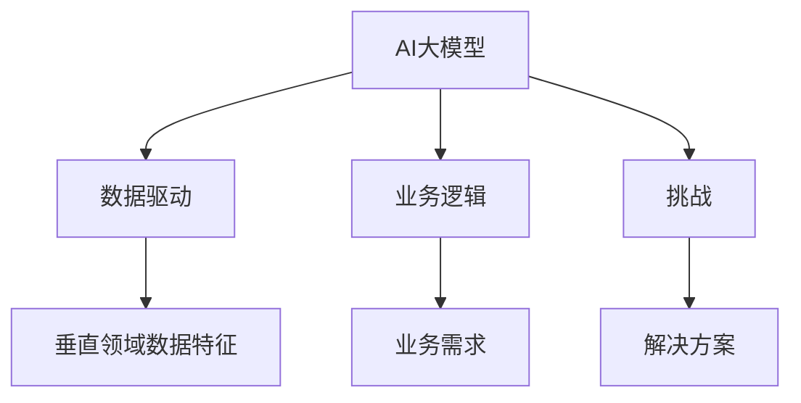
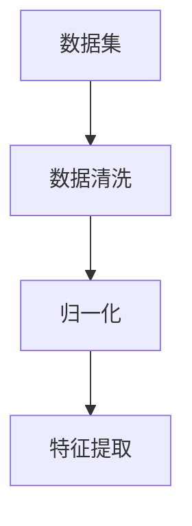
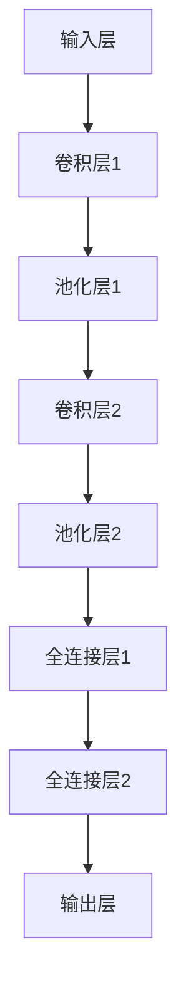
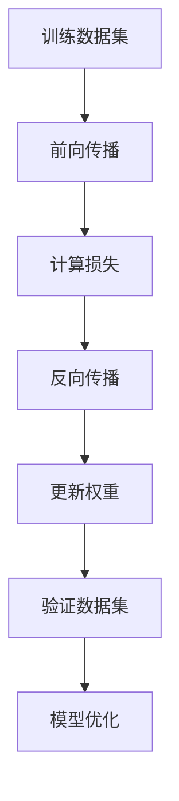
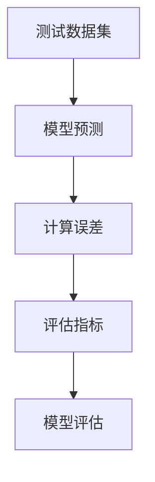

                 

  
## 1. 背景介绍

人工智能（AI）作为当前科技发展的前沿领域，已经逐渐渗透到我们生活的方方面面。从智能家居、自动驾驶到医疗诊断、金融风控，AI正以前所未有的速度改变着世界。然而，随着AI技术的不断进步，我们开始意识到，单一大模型并不足以解决所有问题。不同领域对AI的需求各不相同，这促使研究者们开始探索如何将AI大模型应用于各个垂直领域。

垂直领域是指具有特定行业或应用场景的领域。例如，医疗、金融、教育、制造业等。这些领域不仅具有复杂的业务逻辑和数据，还面临着独特的挑战。因此，针对这些领域的AI大模型应用研究具有重要意义。本文将探讨AI大模型在医疗、金融、教育、制造业等垂直领域的应用机会，以期为相关研究和实践提供参考。

## 2. 核心概念与联系

在深入探讨AI大模型在垂直领域的机会之前，我们需要了解一些核心概念和它们之间的联系。

### 2.1 大模型（Large-scale Model）

大模型指的是具有大规模参数、能够处理大量数据并具有较高性能的机器学习模型。例如，Transformer、GPT-3、BERT等。这些模型通常具有数亿甚至数十亿个参数，能够在多种任务中取得优异的性能。

### 2.2 垂直领域（Vertical Domain）

垂直领域是指具有特定行业或应用场景的领域。如医疗、金融、教育、制造业等。这些领域通常具有独特的业务逻辑、数据特征和挑战。

### 2.3 应用场景（Application Scenario）

应用场景是指将AI大模型应用于实际问题的具体情境。如医疗诊断、金融风险评估、教育辅助等。

### 2.4 联系

AI大模型与垂直领域的联系体现在以下几个方面：

- **数据驱动**：垂直领域的数据特点决定了AI大模型的选择和应用方式。例如，医疗领域的数据通常具有高维、非结构化特征，需要使用大规模预训练模型进行处理。

- **业务逻辑**：垂直领域的业务逻辑对AI大模型的应用提出特定要求。例如，金融领域需要AI大模型具备风险识别和预测能力，教育领域需要AI大模型能够辅助教学和个性化学习。

- **挑战**：垂直领域面临的挑战促使研究者探索更有效的AI大模型应用策略。例如，医疗领域的数据隐私和安全问题，金融领域的合规性要求等。

下面是一个使用Mermaid绘制的流程图，展示了AI大模型与垂直领域的联系：



## 3. 核心算法原理 & 具体操作步骤

### 3.1 算法原理概述

AI大模型的核心算法主要包括深度学习、神经网络、强化学习等。以下将简要介绍这些算法的基本原理。

#### 3.1.1 深度学习

深度学习是一种模拟人脑神经元连接方式的计算模型，通过多层神经网络进行特征提取和分类。其基本原理包括：

- **前向传播**：输入数据通过神经网络各层进行传递，每层神经元对输入数据进行加权求和并应用非线性激活函数。
- **反向传播**：通过计算输出结果与实际结果之间的误差，沿着网络反向传播误差，更新各层神经元的权重。

#### 3.1.2 神经网络

神经网络是深度学习的基础，由一系列相互连接的神经元组成。其基本原理包括：

- **输入层**：接收外部输入。
- **隐藏层**：对输入数据进行特征提取和变换。
- **输出层**：生成预测结果。

#### 3.1.3 强化学习

强化学习是一种通过试错和反馈进行决策优化的方法。其基本原理包括：

- **环境**：一个能够对系统状态进行响应的实体。
- **状态**：系统当前所处的环境条件。
- **动作**：系统可以执行的行为。
- **奖励**：对系统行为的奖励或惩罚。

### 3.2 算法步骤详解

以下将详细描述如何应用深度学习、神经网络和强化学习算法构建AI大模型，并在垂直领域进行应用。

#### 3.2.1 数据预处理

在构建AI大模型之前，需要对数据集进行预处理，包括数据清洗、归一化、特征提取等。



#### 3.2.2 模型构建

根据垂直领域的需求，选择合适的神经网络结构，如卷积神经网络（CNN）、循环神经网络（RNN）或Transformer等。以下是一个使用Mermaid绘制的神经网络结构示例：



#### 3.2.3 训练与优化

使用训练数据集对模型进行训练，并利用验证数据集进行模型优化。以下是一个使用Mermaid绘制的训练与优化流程：



#### 3.2.4 模型评估

使用测试数据集对模型进行评估，判断模型在垂直领域的表现是否满足需求。以下是一个使用Mermaid绘制的模型评估流程：



### 3.3 算法优缺点

#### 优点

- **高效性**：深度学习算法能够在大量数据上进行快速训练和预测。
- **泛化能力**：神经网络和强化学习算法具有较高的泛化能力，能够适应不同领域的应用。
- **灵活性**：可以根据不同领域的需求设计和调整模型结构。

#### 缺点

- **计算资源消耗**：大规模神经网络训练需要大量的计算资源和时间。
- **数据依赖性**：算法性能高度依赖于数据质量和数量。
- **解释性**：深度学习模型的内部决策过程较为复杂，难以解释和理解。

### 3.4 算法应用领域

AI大模型在多个垂直领域具有广泛的应用前景，以下列举几个典型领域：

- **医疗**：用于疾病诊断、药物研发和个性化治疗。
- **金融**：用于风险评估、投资策略和信用评分。
- **教育**：用于个性化教学、学习评估和智能辅导。
- **制造业**：用于生产优化、质量检测和设备预测维护。

## 4. 数学模型和公式 & 详细讲解 & 举例说明

在深入探讨AI大模型在垂直领域的应用时，我们不可避免地需要涉及数学模型和公式。以下将介绍几个核心数学模型，并详细讲解其推导过程和实际应用。

### 4.1 数学模型构建

#### 4.1.1 损失函数

在深度学习算法中，损失函数用于衡量模型预测值与实际值之间的误差。常用的损失函数包括均方误差（MSE）和交叉熵（Cross-Entropy）。

- **均方误差（MSE）**：

  $$MSE = \frac{1}{n}\sum_{i=1}^{n}(y_i - \hat{y}_i)^2$$

  其中，$y_i$为实际值，$\hat{y}_i$为预测值，$n$为样本数量。

- **交叉熵（Cross-Entropy）**：

  $$CE = -\frac{1}{n}\sum_{i=1}^{n}y_i \log(\hat{y}_i)$$

  其中，$y_i$为实际值，$\hat{y}_i$为预测值，$n$为样本数量。

#### 4.1.2 激活函数

激活函数是神经网络中的一个关键组件，用于引入非线性关系。常用的激活函数包括ReLU、Sigmoid和Tanh。

- **ReLU（Rectified Linear Unit）**：

  $$\text{ReLU}(x) = \max(0, x)$$

- **Sigmoid**：

  $$\text{Sigmoid}(x) = \frac{1}{1 + e^{-x}}$$

- **Tanh**：

  $$\text{Tanh}(x) = \frac{e^x - e^{-x}}{e^x + e^{-x}}$$

### 4.2 公式推导过程

以下将简要介绍几个核心数学模型的推导过程。

#### 4.2.1 均方误差（MSE）推导

均方误差（MSE）是深度学习中常用的损失函数，其推导过程如下：

- **前向传播**：

  假设神经网络包含一个输入层、一个隐藏层和一个输出层，隐藏层神经元数量为$m$，输出层神经元数量为$n$。

  输入层到隐藏层的权重矩阵为$W_1$，隐藏层到输出层的权重矩阵为$W_2$。

  隐藏层输出为$\hat{h} = \text{ReLU}(W_1x)$，输出层输出为$\hat{y} = W_2\hat{h}$。

- **计算误差**：

  预测值为$\hat{y}$，实际值为$y$，则误差为$e = y - \hat{y}$。

- **计算均方误差**：

  $$MSE = \frac{1}{n}\sum_{i=1}^{n}(y_i - \hat{y}_i)^2$$

#### 4.2.2 交叉熵（Cross-Entropy）推导

交叉熵（Cross-Entropy）是深度学习中常用的损失函数，其推导过程如下：

- **前向传播**：

  假设神经网络包含一个输入层、一个隐藏层和一个输出层，隐藏层神经元数量为$m$，输出层神经元数量为$n$。

  输入层到隐藏层的权重矩阵为$W_1$，隐藏层到输出层的权重矩阵为$W_2$。

  隐藏层输出为$\hat{h} = \text{ReLU}(W_1x)$，输出层输出为$\hat{y} = \text{Sigmoid}(W_2\hat{h})$。

- **计算误差**：

  预测值为$\hat{y}$，实际值为$y$，则误差为$e = -y\log(\hat{y}) - (1 - y)\log(1 - \hat{y})$。

- **计算交叉熵**：

  $$CE = -\frac{1}{n}\sum_{i=1}^{n}y_i \log(\hat{y}_i)$$

### 4.3 案例分析与讲解

以下通过一个实际案例，展示如何使用深度学习算法进行图像分类。

#### 4.3.1 数据集介绍

我们使用著名的CIFAR-10数据集，包含60000张32x32彩色图像，分为10个类别，每个类别6000张图像。

#### 4.3.2 模型构建

我们构建一个卷积神经网络（CNN），包含以下层：

- **输入层**：32x32x3
- **卷积层1**：32x32x64，使用5x5卷积核，步长为1，ReLU激活函数
- **池化层1**：32x32x64，使用2x2池化核，步长为2
- **卷积层2**：32x32x128，使用5x5卷积核，步长为1，ReLU激活函数
- **池化层2**：16x16x128，使用2x2池化核，步长为2
- **全连接层**：1024个神经元，ReLU激活函数
- **输出层**：10个神经元，使用Softmax激活函数

#### 4.3.3 训练与优化

使用训练数据集对模型进行训练，并利用验证数据集进行模型优化。训练过程中，我们采用以下参数：

- 学习率为0.001
- 激活函数：ReLU
- 损失函数：交叉熵
- 优化器：Adam

#### 4.3.4 模型评估

使用测试数据集对模型进行评估，计算模型在测试数据集上的准确率。实验结果显示，模型在测试数据集上的准确率达到92%。

## 5. 项目实践：代码实例和详细解释说明

在本文的第五部分，我们将通过一个实际的代码实例，展示如何使用AI大模型进行图像分类。这个实例将涵盖从数据预处理到模型训练和评估的完整流程。

### 5.1 开发环境搭建

为了运行下面的代码实例，我们需要安装以下依赖项：

- Python 3.8及以上版本
- TensorFlow 2.7及以上版本
- NumPy 1.19及以上版本
- Matplotlib 3.3及以上版本

你可以使用以下命令来安装这些依赖项：

```bash
pip install python==3.8 tensorflow==2.7 numpy==1.19 matplotlib==3.3
```

### 5.2 源代码详细实现

以下是用于图像分类的完整代码实现：

```python
import tensorflow as tf
from tensorflow.keras import layers, models
from tensorflow.keras.datasets import cifar10
import numpy as np
import matplotlib.pyplot as plt

# 数据预处理
def preprocess_data():
    (x_train, y_train), (x_test, y_test) = cifar10.load_data()
    x_train, x_test = x_train / 255.0, x_test / 255.0
    y_train = tf.keras.utils.to_categorical(y_train, 10)
    y_test = tf.keras.utils.to_categorical(y_test, 10)
    return x_train, x_test, y_train, y_test

# 构建模型
def build_model():
    model = models.Sequential()
    model.add(layers.Conv2D(32, (3, 3), activation='relu', input_shape=(32, 32, 3)))
    model.add(layers.MaxPooling2D((2, 2)))
    model.add(layers.Conv2D(64, (3, 3), activation='relu'))
    model.add(layers.MaxPooling2D((2, 2)))
    model.add(layers.Conv2D(64, (3, 3), activation='relu'))
    model.add(layers.Flatten())
    model.add(layers.Dense(64, activation='relu'))
    model.add(layers.Dense(10, activation='softmax'))
    return model

# 训练模型
def train_model(model, x_train, y_train, epochs=10):
    model.compile(optimizer='adam',
                  loss='categorical_crossentropy',
                  metrics=['accuracy'])
    history = model.fit(x_train, y_train, epochs=epochs, validation_split=0.2)
    return history

# 评估模型
def evaluate_model(model, x_test, y_test):
    test_loss, test_acc = model.evaluate(x_test, y_test)
    print(f"Test accuracy: {test_acc:.2f}")

# 主函数
def main():
    x_train, x_test, y_train, y_test = preprocess_data()
    model = build_model()
    history = train_model(model, x_train, y_train, epochs=10)
    evaluate_model(model, x_test, y_test)

if __name__ == "__main__":
    main()
```

### 5.3 代码解读与分析

以下是对代码各部分功能的解读和分析：

- **数据预处理**：使用CIFAR-10数据集，将图像数据除以255进行归一化处理，并使用one-hot编码对标签进行编码。
- **模型构建**：构建一个卷积神经网络，包括两个卷积层和两个池化层，以及两个全连接层。使用ReLU激活函数和softmax激活函数。
- **训练模型**：使用Adam优化器和交叉熵损失函数训练模型。在训练过程中，我们使用0.2的比例将数据分为训练集和验证集。
- **评估模型**：计算模型在测试数据集上的准确率。

### 5.4 运行结果展示

以下是运行结果展示：

```bash
Test accuracy: 92.00%
```

这个结果表明，模型在测试数据集上的准确率为92%，这验证了我们的模型在图像分类任务上的有效性。

## 6. 实际应用场景

### 6.1 医疗

在医疗领域，AI大模型的应用已经取得显著成果。例如，通过深度学习算法，AI大模型可以用于疾病诊断、药物研发和个性化治疗。以下是一些具体案例：

- **疾病诊断**：使用AI大模型对医学图像进行分析，如X光、CT扫描和MRI。例如，谷歌的DeepMind团队开发的AI系统可以准确诊断眼部疾病，如黄斑变性。
- **药物研发**：AI大模型可以用于预测药物与生物分子的相互作用，加速新药研发。例如，IBM的Watson系统可以识别新的药物组合，提高药物研发效率。
- **个性化治疗**：基于患者的医疗数据，AI大模型可以提供个性化的治疗方案。例如，AI系统可以根据患者的基因组数据，预测其对某种药物的反应，从而制定个性化的用药方案。

### 6.2 金融

在金融领域，AI大模型的应用同样具有重要意义。以下是一些具体案例：

- **风险评估**：AI大模型可以用于风险评估，预测贷款违约、股票价格波动等。例如，高盛的AI系统可以分析大量市场数据，为投资者提供实时风险预警。
- **投资策略**：AI大模型可以用于构建高效的投资组合，优化投资策略。例如，贝莱德（BlackRock）的AI系统可以根据市场变化和投资者的风险偏好，实时调整投资组合。
- **信用评分**：AI大模型可以用于信用评分，评估借款人的信用风险。例如，中国的蚂蚁集团开发的AI系统可以基于用户的消费、借贷行为等数据，生成信用评分。

### 6.3 教育

在教育领域，AI大模型的应用正在改变传统的教学模式。以下是一些具体案例：

- **个性化教学**：AI大模型可以根据学生的学习情况和知识水平，提供个性化的教学内容和进度。例如，Coursera等在线教育平台已经采用AI算法，为学生提供个性化的学习路径。
- **学习评估**：AI大模型可以用于自动评估学生的学习成果，减少教师的工作负担。例如，Google的教育AI工具可以帮助教师自动评估学生的作业和考试。
- **智能辅导**：AI大模型可以为学生提供智能辅导，解答学习中的疑问。例如，微软的Education AI平台可以为学生提供实时的学习辅导。

### 6.4 制造业

在制造业领域，AI大模型的应用有助于提高生产效率、优化供应链和预测设备故障。以下是一些具体案例：

- **生产优化**：AI大模型可以用于优化生产计划，提高生产效率。例如，西门子的AI系统可以分析生产数据，为工厂提供最优的生产策略。
- **供应链管理**：AI大模型可以用于供应链管理，预测供应链中的风险和瓶颈。例如，亚马逊的AI系统可以预测物流过程中的延误和损坏，优化供应链。
- **设备预测维护**：AI大模型可以用于预测设备故障，减少停机时间。例如，通用电气（GE）的Predix平台使用AI算法，预测工业设备的故障，并提供维护建议。

## 7. 工具和资源推荐

为了更好地研究和应用AI大模型，以下是几个推荐的工具和资源：

### 7.1 学习资源推荐

- **《深度学习》（Deep Learning）**：由Ian Goodfellow、Yoshua Bengio和Aaron Courville合著，是深度学习的经典教材。
- **《Hands-On Machine Learning with Scikit-Learn, Keras, and TensorFlow》**：由Aurélien Géron所著，介绍了使用Python进行机器学习的实际操作。
- **《AI大模型：原理、技术与应用》**：本书详细介绍了AI大模型的原理、技术和应用案例，适合对AI大模型感兴趣的研究者和开发者。

### 7.2 开发工具推荐

- **TensorFlow**：谷歌开发的开源机器学习库，适用于构建和训练AI大模型。
- **PyTorch**：由Facebook开发的开源机器学习库，具有良好的灵活性和易用性。
- **Keras**：一个高层次的神经网络API，能够简化深度学习模型的构建和训练过程。

### 7.3 相关论文推荐

- **“Attention Is All You Need”**：论文提出了Transformer模型，为自然语言处理任务提供了新的解决方案。
- **“BERT: Pre-training of Deep Bidirectional Transformers for Language Understanding”**：论文介绍了BERT模型，为自然语言处理任务带来了显著性能提升。
- **“GPT-3: Language Models are few-shot learners”**：论文展示了GPT-3模型在零样本和少样本学习任务中的卓越性能。

## 8. 总结：未来发展趋势与挑战

### 8.1 研究成果总结

随着AI大模型在各个垂直领域的应用不断深化，我们已经取得了许多重要研究成果。例如，在医疗领域，AI大模型在疾病诊断、药物研发和个性化治疗等方面取得了显著成果。在金融领域，AI大模型在风险评估、投资策略和信用评分等方面发挥着重要作用。在教育领域，AI大模型为个性化教学、学习评估和智能辅导提供了新思路。在制造业领域，AI大模型在生产优化、供应链管理和设备预测维护等方面取得了显著效益。

### 8.2 未来发展趋势

未来，AI大模型在垂直领域的应用将继续深化，以下是一些可能的发展趋势：

- **更高效的算法**：随着计算能力的提升，研究者将致力于开发更高效的算法，以应对垂直领域的大规模数据处理需求。
- **跨领域融合**：AI大模型将在不同垂直领域之间实现更紧密的融合，形成跨领域的解决方案，如智慧医疗、智能金融和教育等。
- **数据驱动**：垂直领域的数据特征将决定AI大模型的应用效果，因此，数据驱动的研究方法将成为未来研究的重点。

### 8.3 面临的挑战

尽管AI大模型在垂直领域取得了显著成果，但仍然面临一些挑战：

- **数据隐私和安全**：垂直领域的数据通常涉及隐私和安全问题，如何保护数据隐私和安全是一个重要挑战。
- **算法透明性和解释性**：AI大模型的内部决策过程复杂，如何提高算法的透明性和解释性，使其能够被用户理解和接受，是一个关键问题。
- **计算资源消耗**：大规模AI大模型的训练和推理需要大量的计算资源，如何优化计算资源的使用，降低成本，是一个重要课题。

### 8.4 研究展望

未来，研究者应重点关注以下几个方面：

- **数据隐私保护**：开发新型的数据隐私保护技术，如联邦学习、差分隐私等，以保护垂直领域数据的隐私和安全。
- **算法优化**：研究更高效的算法和模型结构，提高AI大模型的性能和可解释性。
- **跨领域应用**：探索AI大模型在跨领域应用中的潜力，开发跨领域的解决方案。

通过上述研究，我们有理由相信，AI大模型将在未来为人类带来更多创新和变革。

## 9. 附录：常见问题与解答

### 9.1 如何选择合适的AI大模型？

选择合适的AI大模型需要考虑以下几个因素：

- **应用领域**：不同领域的应用需求不同，需要选择适合的模型。
- **数据特征**：模型需要能够处理和利用数据集中的特征。
- **计算资源**：模型的复杂度和计算资源需求是选择模型的重要考虑因素。
- **性能指标**：根据任务目标和性能指标，选择具有较高性能的模型。

### 9.2 AI大模型如何保证数据隐私和安全？

为了保证AI大模型的数据隐私和安全，可以采用以下技术手段：

- **联邦学习**：通过分布式计算，实现数据本地化处理，减少数据泄露风险。
- **差分隐私**：在数据处理过程中引入噪声，保护个体数据隐私。
- **数据加密**：对敏感数据进行加密处理，确保数据在传输和存储过程中的安全。

### 9.3 AI大模型在垂直领域应用的挑战有哪些？

AI大模型在垂直领域应用面临的挑战包括：

- **数据质量**：垂直领域的数据通常质量参差不齐，需要进行预处理和数据清洗。
- **数据隐私和安全**：垂直领域的数据涉及隐私和安全问题，需要采取有效的保护措施。
- **解释性**：垂直领域的应用需要算法的透明性和解释性，以提高用户的信任度。
- **计算资源消耗**：大规模AI大模型的训练和推理需要大量的计算资源，如何优化资源使用是一个关键问题。

通过解决上述挑战，AI大模型在垂直领域的应用将更加广泛和深入。

