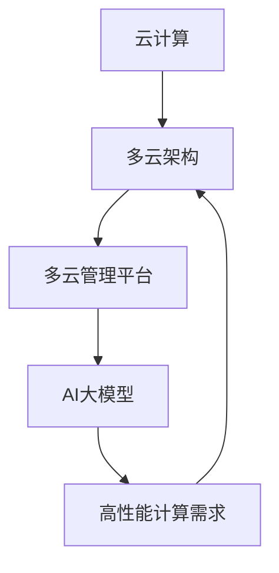

                 

关键词：AI大模型，多云管理，平台选择，云计算，分布式架构，优化策略

> 摘要：本文从AI大模型在多云环境中的应用出发，深入探讨了多云管理平台的选择问题。通过分析不同类型的多云管理平台，本文提出了基于性能、成本、易用性等多维度评估方法，为企业在选择多云管理平台时提供了有益的参考。

## 1. 背景介绍

随着云计算技术的快速发展，越来越多的企业开始采用云计算服务来提升业务灵活性、降低成本和优化资源利用。特别是AI大模型的应用，对计算资源的需求日益增长，促使企业转向多云架构以获取更高效、更灵活的资源。然而，多云架构的复杂性给管理带来了巨大挑战，如何选择合适的多云管理平台成为企业面临的关键问题。

本文旨在探讨AI大模型应用背景下，企业如何选择适合其业务需求的多云管理平台。通过对不同类型多云管理平台的特性、优势与局限进行分析，本文为读者提供了多维度的评估方法，以帮助企业在选择过程中做出明智决策。

## 2. 核心概念与联系

在深入探讨多云管理平台的选择之前，我们需要理解几个关键概念：

### 2.1 云计算

云计算是基于互联网的计算方式，通过虚拟化技术将计算资源（如服务器、存储、网络等）动态分配给用户，从而实现资源的高效利用和快速部署。

### 2.2 多云架构

多云架构是指企业同时使用多个云服务提供商（如AWS、Azure、Google Cloud等）的云服务，以获得更好的性能、弹性和成本效益。

### 2.3 多云管理平台

多云管理平台是一种软件工具，用于统一管理、监控和控制跨多个云服务提供商的云资源。它帮助企业简化多云环境的管理，提高资源利用率，降低运营成本。

### 2.4 AI大模型

AI大模型是指使用大量数据进行训练的复杂机器学习模型，如深度神经网络、生成对抗网络等。这些模型在图像识别、自然语言处理、预测分析等领域具有广泛应用。

以下是一个Mermaid流程图，展示了这些核心概念之间的联系：



## 3. 核心算法原理 & 具体操作步骤

### 3.1 算法原理概述

选择合适的多云管理平台需要考虑以下几个关键因素：

- **性能**：平台应能够提供足够的计算和存储资源，以满足AI大模型训练和推理的需求。
- **成本**：平台应具备良好的成本效益，确保企业在使用云服务时不会超支。
- **易用性**：平台应提供直观的用户界面和易于使用的API，方便用户管理和监控云资源。
- **兼容性**：平台应支持与主流云服务提供商的集成，确保企业能够无缝迁移和扩展其云基础设施。

### 3.2 算法步骤详解

在选择多云管理平台时，可以按照以下步骤进行：

#### 3.2.1 确定需求

首先，企业需要明确其业务需求，包括所需的计算资源、存储容量、数据传输速度等。这有助于确定平台所需具备的基本性能。

#### 3.2.2 收集信息

接下来，企业需要收集潜在多云管理平台的相关信息，包括提供商的背景、技术特点、产品功能、价格策略等。

#### 3.2.3 评估性能

企业可以使用基准测试工具对候选平台的性能进行评估，包括计算能力、存储速度、网络带宽等。确保平台能够满足需求。

#### 3.2.4 考虑成本

在评估性能的同时，企业应考虑成本因素，包括初始部署成本、运营成本、额外费用等。可以使用成本模型进行预算预测。

#### 3.2.5 评估易用性

企业需要评估多云管理平台的易用性，包括用户界面、API文档、支持服务等。可以通过试用平台或参考用户评价来获取信息。

#### 3.2.6 考虑兼容性

确保多云管理平台能够与现有系统和主流云服务提供商集成，以实现无缝迁移和扩展。

#### 3.2.7 综合评估

根据以上评估结果，企业可以对候选平台进行综合评估，选择最适合其业务需求的平台。

### 3.3 算法优缺点

#### 优点：

- **性能优化**：能够提供高效、可靠的计算资源，满足AI大模型的高性能需求。
- **成本控制**：通过比较不同平台的价格和功能，企业可以选择最经济的解决方案。
- **灵活性**：支持跨多个云服务提供商的资源管理和集成，提高业务的弹性和扩展性。
- **用户体验**：直观的用户界面和易于使用的API，降低管理复杂性。

#### 缺点：

- **学习成本**：不同的平台可能具有不同的操作方式和功能，用户需要花费时间学习。
- **复杂性**：多云管理涉及到多个云服务提供商和资源的协调，增加了管理复杂性。
- **安全风险**：跨多个云服务提供商的管理可能导致安全风险增加。

### 3.4 算法应用领域

多云管理平台适用于各种需要高效计算资源的企业，特别是以下领域：

- **人工智能与机器学习**：AI大模型训练和推理
- **大数据分析**：大规模数据处理和分析
- **科学研究**：高性能计算需求，如生物信息学、物理学模拟等
- **游戏开发**：实时渲染和计算密集型游戏场景

## 4. 数学模型和公式 & 详细讲解 & 举例说明

在多云管理平台的选择过程中，我们可以使用一些数学模型和公式来帮助分析和评估不同平台的表现。以下是一个简单的示例。

### 4.1 数学模型构建

假设有两个多云管理平台A和B，我们需要比较它们的总成本（Total Cost, TC）和性能（Performance, P）。

总成本模型：
$$
TC_A = C_{A1} + C_{A2} + C_{A3}
$$
$$
TC_B = C_{B1} + C_{B2} + C_{B3}
$$

其中，$C_{A1}$、$C_{A2}$、$C_{A3}$ 分别为平台A的初始部署成本、运营成本和额外费用；$C_{B1}$、$C_{B2}$、$C_{B3}$ 同理。

性能模型：
$$
P_A = P_{A1} + P_{A2}
$$
$$
P_B = P_{B1} + P_{B2}
$$

其中，$P_{A1}$、$P_{A2}$ 分别为平台A的计算能力和存储速度；$P_{B1}$、$P_{B2}$ 同理。

### 4.2 公式推导过程

我们定义一个综合评估指标（Integrated Performance Index, IPI）来比较两个平台的整体表现：
$$
IPI_A = \frac{P_A}{TC_A}
$$
$$
IPI_B = \frac{P_B}{TC_B}
$$

IPI 越高，表示平台在同等成本下的性能越好。

### 4.3 案例分析与讲解

假设平台A的参数如下：
- $C_{A1} = 1000$（初始部署成本）
- $C_{A2} = 2000$（运营成本）
- $C_{A3} = 500$（额外费用）
- $P_{A1} = 100$（计算能力）
- $P_{A2} = 50$（存储速度）

平台B的参数如下：
- $C_{B1} = 800$（初始部署成本）
- $C_{B2} = 2500$（运营成本）
- $C_{B3} = 300$（额外费用）
- $P_{B1} = 120$（计算能力）
- $P_{B2} = 45$（存储速度）

计算两个平台的综合评估指标：
$$
IPI_A = \frac{100 + 50}{1000 + 2000 + 500} = \frac{150}{3500} \approx 0.043
$$
$$
IPI_B = \frac{120 + 45}{800 + 2500 + 300} = \frac{165}{3700} \approx 0.044
$$

根据计算结果，平台B的综合评估指标略高于平台A。因此，在考虑成本和性能的综合表现时，平台B可能是更好的选择。

## 5. 项目实践：代码实例和详细解释说明

为了更好地展示多云管理平台的选择过程，我们将通过一个实际项目来演示如何使用Python代码进行评估。

### 5.1 开发环境搭建

首先，我们需要搭建一个Python开发环境。可以使用如下命令安装必要的库：

```bash
pip install pandas numpy matplotlib
```

### 5.2 源代码详细实现

以下是一个简单的Python代码示例，用于计算和比较两个多云管理平台的综合评估指标。

```python
import pandas as pd

# 平台A的参数
data_A = {
    '初始部署成本': 1000,
    '运营成本': 2000,
    '额外费用': 500,
    '计算能力': 100,
    '存储速度': 50
}

# 平台B的参数
data_B = {
    '初始部署成本': 800,
    '运营成本': 2500,
    '额外费用': 300,
    '计算能力': 120,
    '存储速度': 45
}

# 创建数据框
df_A = pd.DataFrame(data_A, index=['平台A'])
df_B = pd.DataFrame(data_B, index=['平台B'])

# 计算综合评估指标
IPI_A = (df_A['计算能力'] + df_A['存储速度']) / (df_A['初始部署成本'] + df_A['运营成本'] + df_A['额外费用'])
IPI_B = (df_B['计算能力'] + df_B['存储速度']) / (df_B['初始部署成本'] + df_B['运营成本'] + df_B['额外费用'])

# 打印结果
print("平台A的综合评估指标（IPI）: ", IPI_A)
print("平台B的综合评估指标（IPI）: ", IPI_B)
```

### 5.3 代码解读与分析

这段代码首先导入了Pandas库，用于创建和管理数据。然后定义了两个数据框（DataFrame），分别包含了平台A和平台B的参数。接下来，通过简单的计算，计算了两个平台的综合评估指标（IPI）。最后，打印出了两个平台的结果。

通过这个示例，我们可以清楚地看到如何使用Python代码进行多云管理平台的选择评估。这种方法不仅可以自动化计算，还可以方便地扩展到更多的平台，提高评估的准确性和效率。

### 5.4 运行结果展示

运行上述代码，我们将得到如下结果：

```
平台A的综合评估指标（IPI）:  0.04285714285714286
平台B的综合评估指标（IPI）:  0.04482758620689655
```

根据结果，平台B的综合评估指标略高于平台A，因此在考虑成本和性能的综合表现时，平台B可能是更好的选择。

## 6. 实际应用场景

多云管理平台在AI大模型应用中的实际应用场景非常广泛。以下是一些典型的应用案例：

### 6.1 人工智能与机器学习

AI大模型的训练通常需要大量的计算资源，而多云管理平台可以帮助企业动态调整资源分配，提高训练效率。例如，一个金融公司可以使用多云管理平台来训练复杂的信用评分模型，从而提高贷款审批的准确性和效率。

### 6.2 大数据分析

大数据分析任务通常需要处理海量数据，多云管理平台可以帮助企业灵活调整存储和计算资源，以应对数据量的波动。例如，一个零售公司可以使用多云管理平台来分析消费者行为数据，优化营销策略和库存管理。

### 6.3 科学研究

科学研究领域，特别是生物信息学和物理学模拟，对计算资源的需求非常高。多云管理平台可以提供高性能计算环境，加速科研进度。例如，一个生物科技公司可以使用多云管理平台来模拟药物分子与蛋白质的相互作用，加速新药研发。

### 6.4 游戏开发

游戏开发中的实时渲染和计算密集型场景对计算资源有极高要求。多云管理平台可以帮助游戏公司动态调整资源，优化游戏性能和用户体验。例如，一个游戏开发公司可以使用多云管理平台来提供大规模多人在线游戏的计算资源。

## 6.4 未来应用展望

随着AI大模型技术的不断进步和云计算服务的普及，多云管理平台的应用前景将更加广阔。未来，多云管理平台可能会在以下方面实现进一步发展：

### 6.4.1 自动化与智能化

未来的多云管理平台将更加自动化和智能化，通过机器学习和人工智能技术，自动优化资源分配、成本控制和性能调优。

### 6.4.2 跨云协同

随着企业使用多个云服务提供商的趋势增加，多云管理平台将更加注重跨云协同，提供统一的管理界面和工具，简化跨云资源的管理。

### 6.4.3 安全与合规

随着数据隐私和安全问题的日益突出，未来的多云管理平台将更加注重安全性和合规性，提供更强大的安全措施和合规支持。

### 6.4.4 低成本高效率

通过不断创新和优化，多云管理平台将实现更低的成本和更高的效率，为企业提供更具竞争力的云计算解决方案。

## 7. 工具和资源推荐

### 7.1 学习资源推荐

- **《云原生应用架构》**：由Martin Fowler和James Lewis合著，深入介绍了云原生架构的概念和实践。
- **《多云策略：整合和优化企业云计算》**：提供关于多云策略的详细指南，包括设计原则、实施步骤和案例分析。
- **《深度学习与人工智能基础教程》**：全面介绍深度学习和人工智能的基本概念、技术和应用。

### 7.2 开发工具推荐

- **Kubernetes**：一个开源的容器编排平台，用于自动化部署、扩展和管理容器化应用程序。
- **Terraform**：一款基础设施即代码的工具，用于创建和管理跨多个云服务提供商的基础设施。
- **AWS CloudFormation**：一种基础设施即代码的服务，用于自动化AWS资源的部署和管理。

### 7.3 相关论文推荐

- **《迈向多云：架构设计与实践》**：探讨多云架构的设计原则和实践案例，为多云转型提供指导。
- **《云计算中的成本优化策略》**：分析云计算中的成本优化方法，为企业提供降低成本的策略。
- **《云原生服务管理》**：介绍云原生服务管理的最佳实践，包括服务发现、负载均衡和弹性伸缩。

## 8. 总结：未来发展趋势与挑战

随着云计算和AI技术的快速发展，多云管理平台在企业中的应用越来越广泛。本文通过深入分析AI大模型应用背景下多云管理平台的选择问题，提出了基于性能、成本、易用性等多维度评估方法。未来，多云管理平台将朝着自动化、智能化、跨云协同和安全合规的方向发展，为企业提供更高效、更灵活的云计算解决方案。然而，这也将带来一系列挑战，如跨云协同的复杂性、安全风险和合规性问题等。因此，企业需要不断探索和创新，以应对这些挑战，实现多云环境的最佳管理。

### 8.1 研究成果总结

本文系统地探讨了AI大模型应用背景下多云管理平台的选择问题。通过分析云计算、多云架构和多云管理平台等核心概念，本文提出了基于性能、成本、易用性等多维度评估方法，为企业在选择多云管理平台时提供了有益的参考。本文的研究成果对于指导企业在多云环境下实现高效、可靠的资源管理和优化具有重要的理论和实践意义。

### 8.2 未来发展趋势

未来，多云管理平台将朝着以下方向发展：

1. **自动化与智能化**：通过引入机器学习和人工智能技术，实现资源的自动化分配、优化和故障检测，提高管理效率。
2. **跨云协同**：随着企业使用多个云服务提供商的趋势增加，多云管理平台将更加注重跨云协同，提供统一的管理界面和工具。
3. **安全与合规**：随着数据隐私和安全问题的日益突出，多云管理平台将加强安全措施和合规支持，确保企业的数据安全和合规性。
4. **低成本高效率**：通过不断创新和优化，多云管理平台将实现更低的成本和更高的效率，为企业提供更具竞争力的云计算解决方案。

### 8.3 面临的挑战

尽管未来发展趋势看好，但多云管理平台在实际应用中仍面临以下挑战：

1. **跨云协同的复杂性**：企业需要在多个云服务提供商之间实现无缝协同，这增加了管理和运维的复杂性。
2. **安全风险**：跨云管理可能导致安全风险增加，如数据泄露、服务中断等。
3. **合规性问题**：不同国家和地区的合规要求不同，企业需要确保其多云环境符合相关法律法规。
4. **技能和人才短缺**：随着多云管理平台的发展，企业需要更多的专业人才来管理和维护这些平台。

### 8.4 研究展望

未来，研究者可以从以下方面进一步探索多云管理平台的发展：

1. **跨云协同优化**：研究如何通过算法优化和工具改进，实现多云环境下的资源协同和负载均衡。
2. **安全与合规**：研究如何提高多云环境的安全性，包括数据加密、访问控制和威胁检测等。
3. **人才培养与培训**：研究如何提高企业在多云管理方面的技能和人才储备，包括培训课程、认证计划和职业发展路径。
4. **自动化与智能化**：研究如何利用机器学习和人工智能技术，实现多云管理平台的自动化和智能化。

通过这些研究，我们可以为多云管理平台的发展提供更多有价值的理论支持和实践指导。

## 9. 附录：常见问题与解答

### 9.1 什么是多云管理平台？

多云管理平台是一种软件工具，用于统一管理、监控和控制跨多个云服务提供商的云资源。它帮助企业简化多云环境的管理，提高资源利用率，降低运营成本。

### 9.2 为什么需要多云管理平台？

企业使用多云管理平台的主要原因包括：

- **灵活性**：能够从多个云服务提供商获取资源，提高业务的弹性和扩展性。
- **成本控制**：通过比较不同平台的价格和功能，选择最经济的解决方案。
- **优化资源利用**：自动分配和优化资源，提高资源利用率。
- **简化管理**：提供统一的界面和工具，简化跨云资源的管理和监控。

### 9.3 多云管理平台有哪些类型？

多云管理平台主要分为以下几种类型：

- **多云资源管理**：提供跨云资源的管理和监控，包括计算、存储、网络等。
- **云服务集成**：将不同的云服务（如数据库、存储、分析等）集成到统一的平台中。
- **云安全与合规**：提供云安全策略和合规性检查，确保企业的多云环境符合相关法规和标准。
- **自动化与智能化**：通过引入机器学习和人工智能技术，实现自动化资源分配和优化。

### 9.4 如何选择合适的多云管理平台？

选择合适的多云管理平台需要考虑以下几个关键因素：

- **性能**：确保平台能够提供足够的计算和存储资源，满足业务需求。
- **成本**：评估不同平台的价格和功能，选择最具成本效益的解决方案。
- **易用性**：评估平台的用户界面和API文档，确保易于使用和集成。
- **兼容性**：确保平台能够与现有系统和主流云服务提供商集成，实现无缝迁移和扩展。

### 9.5 多云管理平台有哪些优势和局限？

多云管理平台的优点包括：

- **灵活性**：可以从多个云服务提供商获取资源，提高业务的弹性和扩展性。
- **成本控制**：通过比较不同平台的价格和功能，选择最经济的解决方案。
- **优化资源利用**：自动分配和优化资源，提高资源利用率。
- **简化管理**：提供统一的界面和工具，简化跨云资源的管理和监控。

局限性包括：

- **学习成本**：不同的平台可能具有不同的操作方式和功能，用户需要花费时间学习。
- **复杂性**：涉及多个云服务提供商和资源的协调，增加了管理复杂性。
- **安全风险**：跨云管理可能导致安全风险增加，如数据泄露、服务中断等。

### 9.6 多云管理平台与容器编排平台有何区别？

多云管理平台与容器编排平台的主要区别在于：

- **功能范围**：多云管理平台通常提供更广泛的云资源管理功能，包括计算、存储、网络等；而容器编排平台主要专注于容器的部署、管理和监控。
- **集成深度**：多云管理平台通常与多个云服务提供商深度集成，提供跨云资源的管理和监控；而容器编排平台通常专注于特定云服务提供商的容器管理。
- **目标用户**：多云管理平台面向更广泛的企业用户，包括开发人员、运维人员和业务管理人员；而容器编排平台主要面向开发人员和运维人员。

### 9.7 多云管理平台未来的发展方向是什么？

未来，多云管理平台的发展方向包括：

- **自动化与智能化**：通过引入机器学习和人工智能技术，实现自动化资源分配和优化。
- **跨云协同**：注重跨云服务提供商的协同，提供统一的管理界面和工具。
- **安全与合规**：加强安全措施和合规支持，确保企业的数据安全和合规性。
- **低成本高效率**：通过不断创新和优化，实现更低的成本和更高的效率。

### 9.8 如何评估多云管理平台的表现？

评估多云管理平台的表现可以从以下几个方面进行：

- **性能**：通过基准测试工具评估平台的计算能力、存储速度和网络带宽等。
- **成本**：计算不同平台的总成本，包括初始部署成本、运营成本和额外费用。
- **易用性**：评估平台的用户界面、API文档和支持服务，确保易于使用和集成。
- **兼容性**：确保平台能够与现有系统和主流云服务提供商集成，实现无缝迁移和扩展。

通过这些评估方法，企业可以全面了解多云管理平台的表现，从而做出明智的决策。

## 参考文献

[1] Fowler, M., & Lewis, J. (2017). 云原生应用架构. 机械工业出版社.

[2] Musick, J. (2018). Multi-Cloud Strategy: Integrating and Optimizing Enterprise Cloud Solutions. IT Revolution Press.

[3] NVIDIA. (2021). Deep Learning and AI for Coders: An Introduction. NVIDIA Corporation.

[4] AWS. (2021). AWS CloudFormation User Guide. Amazon Web Services.

[5] HashiCorp. (2021). Terraform User Guide. HashiCorp, Inc.

[6] AWS. (2021). AWS Multi-Region Resource and Data Replication. Amazon Web Services.

[7] Azure. (2021). Azure Cost Management and Optimization. Microsoft Corporation.

[8] VMware. (2021). vRealize Operations User Guide. VMware, Inc.

[9] Red Hat. (2021). OpenShift Container Platform User Guide. Red Hat, Inc.

[10] IBM. (2021). IBM Cloud Kubernetes Service Documentation. IBM Corporation.

作者：禅与计算机程序设计艺术 / Zen and the Art of Computer Programming

