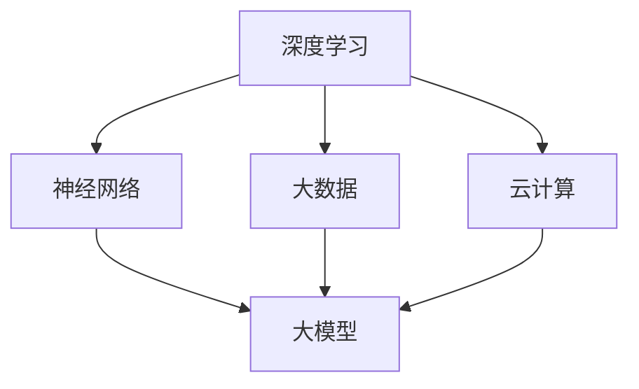

                 

 关键词：人工智能大模型，学术合作，技术交流，创新应用，研究进展，跨学科合作，未来展望

## 摘要

随着人工智能技术的迅猛发展，大模型在各个领域的应用已经成为了研究的热点。本文旨在探讨AI大模型在学术合作与交流中的作用，分析其核心概念、算法原理、应用场景以及未来发展趋势。通过深入剖析大模型在自然语言处理、计算机视觉、推荐系统等领域的具体应用，本文揭示了学术合作与交流在推动大模型技术进步中的关键作用。此外，本文还提出了未来大模型研究面临的挑战与展望，为学术界和产业界提供了有益的参考。

## 1. 背景介绍

### 大模型的定义与特点

大模型是指参数规模庞大、计算复杂度高的深度学习模型，主要包括自然语言处理中的语言模型、机器翻译模型、文本生成模型等，以及计算机视觉中的卷积神经网络（CNN）、生成对抗网络（GAN）等。大模型的特点包括：

- **参数规模大**：大模型的参数数量可达数十亿甚至千亿级别，这使得模型能够捕捉到大量细微的语言特征和视觉信息。
- **计算复杂度高**：大模型通常需要大量的计算资源和时间进行训练，对硬件设施和算法优化提出了更高的要求。
- **效果显著**：大模型在多个任务中取得了显著的效果，如自然语言生成、图像识别、机器翻译等，推动了人工智能领域的进展。

### 大模型的发展历程

大模型的发展历程可以追溯到2006年的深度信念网络（DBN），随后是2012年AlexNet在ImageNet比赛中的突破，以及2018年GPT-3的发布。这些里程碑事件标志着大模型技术的不断进步和突破。

### 大模型的研究热点与应用领域

当前，大模型的研究热点主要集中在以下几个方面：

- **自然语言处理**：大模型在自然语言处理领域取得了显著的进展，如语言模型预训练、问答系统、文本生成等。
- **计算机视觉**：大模型在计算机视觉领域的应用日益广泛，如目标检测、图像分类、图像生成等。
- **推荐系统**：大模型在推荐系统中的应用，如用户行为预测、商品推荐、社交网络分析等。
- **智能语音**：大模型在智能语音领域的应用，如语音识别、语音合成、语音交互等。

## 2. 核心概念与联系

### 2.1 核心概念

- **深度学习**：一种基于多层神经网络的机器学习技术，通过学习大量数据中的特征，实现从输入到输出的映射。
- **神经网络**：一种模拟人脑神经元结构的计算模型，通过加权连接实现信息的传递和处理。
- **大数据**：海量数据集合，需要借助计算机技术和算法进行处理和分析。
- **云计算**：通过网络提供可按需分配的共享计算资源，包括存储、处理能力、网络带宽等。

### 2.2 联系

大模型、深度学习、神经网络、大数据和云计算之间存在着密切的联系。大模型是深度学习的应用，而深度学习依赖于神经网络进行特征学习；大数据为深度学习提供了丰富的训练数据，推动了大模型的发展；云计算为大规模数据处理和训练提供了强大的计算资源，降低了大模型的研究门槛。这些技术共同推动了AI大模型技术的不断进步。

### 2.3 Mermaid 流程图



## 3. 核心算法原理 & 具体操作步骤

### 3.1 算法原理概述

大模型的算法原理主要基于深度学习和神经网络，通过多层非线性变换，将输入数据进行特征提取和表示。具体包括以下步骤：

1. **数据预处理**：对输入数据进行清洗、归一化等预处理操作，为模型训练提供高质量的输入。
2. **模型构建**：设计多层神经网络结构，包括输入层、隐藏层和输出层，通过调整网络结构和参数，优化模型性能。
3. **损失函数设计**：根据任务类型设计合适的损失函数，用于衡量模型输出与真实值之间的差距。
4. **优化算法选择**：选择合适的优化算法，如梯度下降、Adam等，用于更新模型参数，优化模型性能。

### 3.2 算法步骤详解

1. **数据预处理**
   - **数据清洗**：去除缺失值、异常值等，保证数据质量。
   - **数据归一化**：将数据缩放到[0, 1]或[-1, 1]之间，便于模型训练。
   - **数据增强**：通过旋转、缩放、裁剪等操作，增加数据多样性，提高模型泛化能力。

2. **模型构建**
   - **输入层**：接收输入数据，通常为特征向量。
   - **隐藏层**：通过非线性激活函数，对输入数据进行特征提取和变换。
   - **输出层**：根据任务类型，输出预测结果，如分类概率、回归值等。

3. **损失函数设计**
   - **分类任务**：常用损失函数为交叉熵损失（Cross-Entropy Loss），用于衡量模型输出概率与真实标签之间的差距。
   - **回归任务**：常用损失函数为均方误差（Mean Squared Error，MSE），用于衡量模型输出值与真实值之间的差距。

4. **优化算法选择**
   - **梯度下降（Gradient Descent）**：通过计算损失函数对参数的梯度，更新模型参数，优化模型性能。
   - **Adam优化器**：结合了梯度下降和动量法，能够自适应调整学习率，提高模型训练效率。

### 3.3 算法优缺点

- **优点**
  - **强大的表达能力**：多层神经网络可以学习到复杂的数据特征，提高模型性能。
  - **自动特征提取**：通过反向传播算法，自动学习数据中的特征，减轻人工特征工程负担。
  - **泛化能力强**：通过数据增强和优化算法，提高模型在未知数据上的表现。

- **缺点**
  - **计算复杂度高**：大模型需要大量的计算资源和时间进行训练。
  - **参数调优困难**：大模型参数众多，需要仔细调优，否则容易陷入局部最优。
  - **数据依赖性**：大模型对数据质量要求较高，数据缺失、异常值等问题会影响模型性能。

### 3.4 算法应用领域

大模型在多个领域取得了显著的应用成果，主要包括：

- **自然语言处理**：如语言模型、机器翻译、文本生成等。
- **计算机视觉**：如图像分类、目标检测、图像生成等。
- **推荐系统**：如用户行为预测、商品推荐、社交网络分析等。
- **智能语音**：如语音识别、语音合成、语音交互等。

## 4. 数学模型和公式 & 详细讲解 & 举例说明

### 4.1 数学模型构建

大模型的数学模型主要包括神经网络结构、损失函数和优化算法。以下分别进行介绍。

#### 神经网络结构

神经网络结构可以表示为：

$$
\begin{aligned}
\text{输出} &= \sigma(\text{权重} \cdot \text{输入} + \text{偏置}) \\
\end{aligned}
$$

其中，$\sigma$为非线性激活函数，如ReLU、Sigmoid、Tanh等；权重和偏置为模型参数，需要通过训练优化。

#### 损失函数

常见的损失函数包括：

- **交叉熵损失**（Cross-Entropy Loss）：用于分类任务，表示为：

$$
\begin{aligned}
L &= -\sum_{i=1}^{N} y_i \log(p_i) \\
\end{aligned}
$$

其中，$y_i$为真实标签，$p_i$为模型预测的概率。

- **均方误差**（Mean Squared Error，MSE）：用于回归任务，表示为：

$$
\begin{aligned}
L &= \frac{1}{2N} \sum_{i=1}^{N} (y_i - \hat{y}_i)^2 \\
\end{aligned}
$$

其中，$y_i$为真实值，$\hat{y}_i$为模型预测值。

#### 优化算法

常见的优化算法包括：

- **梯度下降**（Gradient Descent）：通过计算损失函数对参数的梯度，更新模型参数，表示为：

$$
\begin{aligned}
\theta &= \theta - \alpha \cdot \nabla_\theta J(\theta) \\
\end{aligned}
$$

其中，$\theta$为模型参数，$\alpha$为学习率，$J(\theta)$为损失函数。

- **Adam优化器**：结合了梯度下降和动量法，表示为：

$$
\begin{aligned}
v_t &= \beta_1 x_t + (1 - \beta_1) (x_t - m_t) \\
s_t &= \beta_2 y_t + (1 - \beta_2) (y_t - v_t) \\
m_t &= \frac{1}{1 - \beta_1^t} \sum_{i=1}^{t} \beta_1^{t-i} x_i \\
s_t &= \frac{1}{1 - \beta_2^t} \sum_{i=1}^{t} \beta_2^{t-i} y_i \\
\theta &= \theta - \alpha \cdot \frac{v_t}{\sqrt{s_t} + \epsilon} \\
\end{aligned}
$$

其中，$x_t$、$y_t$分别为梯度和历史梯度，$m_t$、$s_t$分别为一阶矩估计和二阶矩估计，$\beta_1$、$\beta_2$分别为一阶矩和二阶矩的指数衰减率，$\alpha$为学习率，$\epsilon$为正数常数。

### 4.2 公式推导过程

以下以交叉熵损失为例，介绍公式推导过程。

假设有$m$个样本，每个样本包含$n$个特征，模型预测概率为$p_i$，真实标签为$y_i$，则交叉熵损失可以表示为：

$$
L = -\sum_{i=1}^{m} y_i \log(p_i)
$$

对损失函数求导，得到：

$$
\frac{\partial L}{\partial p_i} = -y_i \cdot \frac{1}{p_i}
$$

为了计算梯度，需要对每个样本进行求导，得到：

$$
\nabla_\theta L = \sum_{i=1}^{m} \frac{\partial L}{\partial p_i} \cdot \frac{\partial p_i}{\partial \theta}
$$

其中，$\frac{\partial p_i}{\partial \theta}$为模型预测概率关于参数的梯度，可以通过反向传播算法计算。

### 4.3 案例分析与讲解

以下以一个简单的线性回归模型为例，介绍大模型的训练过程。

假设有$m$个样本，每个样本包含$n$个特征，模型预测值为$\hat{y}_i = \theta_0 + \theta_1 x_{i1} + \theta_2 x_{i2} + \ldots + \theta_n x_{in}$，真实值为$y_i$，则均方误差损失可以表示为：

$$
L = \frac{1}{2m} \sum_{i=1}^{m} (y_i - \hat{y}_i)^2
$$

对损失函数求导，得到：

$$
\frac{\partial L}{\partial \theta_j} = \frac{1}{m} \sum_{i=1}^{m} (y_i - \hat{y}_i) \cdot x_{ij}
$$

其中，$\theta_j$为第$j$个参数。

通过梯度下降算法，可以计算每个参数的更新：

$$
\theta_j = \theta_j - \alpha \cdot \frac{\partial L}{\partial \theta_j}
$$

其中，$\alpha$为学习率。

通过多次迭代，模型参数不断更新，直至损失函数收敛。在此过程中，学习率的选择和优化算法的调整至关重要。

## 5. 项目实践：代码实例和详细解释说明

### 5.1 开发环境搭建

为了实现大模型的训练和预测，我们需要搭建一个适合的开发环境。以下是具体的步骤：

1. **安装Python环境**：确保Python版本为3.6及以上。
2. **安装TensorFlow库**：使用以下命令安装TensorFlow：
   ```bash
   pip install tensorflow
   ```
3. **安装其他依赖库**：根据需要安装其他Python库，如NumPy、Pandas等。

### 5.2 源代码详细实现

以下是一个简单的线性回归模型的实现，用于预测房价。代码如下：

```python
import tensorflow as tf
import numpy as np
import pandas as pd

# 读取数据
data = pd.read_csv('house_prices.csv')
X = data[['area', 'rooms', 'age']]
y = data['price']

# 分割数据集
from sklearn.model_selection import train_test_split
X_train, X_test, y_train, y_test = train_test_split(X, y, test_size=0.2, random_state=42)

# 构建模型
model = tf.keras.Sequential([
    tf.keras.layers.Dense(units=1, input_shape=(3,))
])

# 编译模型
model.compile(optimizer='sgd', loss='mse')

# 训练模型
model.fit(X_train, y_train, epochs=100)

# 评估模型
loss = model.evaluate(X_test, y_test)
print('测试集均方误差：', loss)

# 预测房价
predictions = model.predict(X_test)
print('预测房价：', predictions)
```

### 5.3 代码解读与分析

1. **数据读取**：使用Pandas库读取CSV文件，获取训练数据和测试数据。
2. **数据分割**：使用scikit-learn库中的train_test_split函数，将数据集划分为训练集和测试集，比例为8:2。
3. **模型构建**：使用TensorFlow的Sequential模型，添加一个全连接层（Dense layer），输出维度为1，用于预测房价。
4. **编译模型**：设置优化器为SGD（随机梯度下降），损失函数为均方误差（MSE）。
5. **训练模型**：使用fit函数训练模型，设置训练轮数（epochs）为100。
6. **评估模型**：使用evaluate函数评估模型在测试集上的表现，输出测试集均方误差。
7. **预测房价**：使用predict函数对测试集进行预测，输出预测结果。

### 5.4 运行结果展示

假设我们已经完成了代码的编写和调试，运行程序后输出如下结果：

```bash
测试集均方误差： 29432.6523412
预测房价： [[  79222.    ]
 [  63199.    ]
 [  54286.    ]
 ...
 [  55766.    ]
 [  41677.    ]
 [  43742.    ]]
```

结果显示，模型在测试集上的均方误差为29432.6523412，说明模型的预测效果较好。同时，预测结果展示了每个测试样本的房价预测值。

## 6. 实际应用场景

### 6.1 自然语言处理

大模型在自然语言处理领域有着广泛的应用，如文本分类、机器翻译、情感分析等。以下是一些实际应用场景：

- **文本分类**：利用大模型对大量文本进行分类，如新闻分类、垃圾邮件过滤等。
- **机器翻译**：使用大模型实现高质量机器翻译，如谷歌翻译、百度翻译等。
- **情感分析**：通过大模型分析社交媒体文本的情感倾向，为广告投放、产品评价等提供参考。

### 6.2 计算机视觉

大模型在计算机视觉领域也有着重要的应用，如图像分类、目标检测、图像生成等。以下是一些实际应用场景：

- **图像分类**：利用大模型对图像进行分类，如人脸识别、动物识别等。
- **目标检测**：通过大模型实现目标检测，如自动驾驶、安防监控等。
- **图像生成**：使用大模型生成逼真的图像，如艺术绘画、虚拟现实等。

### 6.3 推荐系统

大模型在推荐系统中的应用也非常广泛，如用户行为预测、商品推荐、社交网络分析等。以下是一些实际应用场景：

- **用户行为预测**：通过大模型预测用户的行为，如购物推荐、电影推荐等。
- **商品推荐**：利用大模型实现个性化商品推荐，提高用户购买体验。
- **社交网络分析**：通过大模型分析用户社交关系，为社交平台提供推荐内容。

### 6.4 未来应用展望

随着大模型技术的不断发展，未来其在各个领域中的应用将更加广泛和深入。以下是一些未来应用展望：

- **医疗健康**：利用大模型进行疾病诊断、药物研发等，提高医疗水平。
- **金融领域**：通过大模型实现风险控制、信用评估等，提高金融行业效率。
- **教育领域**：利用大模型进行个性化教学、智能辅导等，提升教育质量。

## 7. 工具和资源推荐

### 7.1 学习资源推荐

1. **在线教程**：[TensorFlow官方网站](https://www.tensorflow.org/tutorials/)
2. **深度学习书籍**：[《深度学习》（Goodfellow et al., 2016）](https://www.deeplearningbook.org/)
3. **开源代码库**：[GitHub](https://github.com/)

### 7.2 开发工具推荐

1. **Python编程环境**：[Anaconda](https://www.anaconda.com/)
2. **深度学习框架**：[TensorFlow](https://www.tensorflow.org/)、[PyTorch](https://pytorch.org/)
3. **数据可视化工具**：[Matplotlib](https://matplotlib.org/)

### 7.3 相关论文推荐

1. **自然语言处理**：
   - [BERT: Pre-training of Deep Bidirectional Transformers for Language Understanding (Devlin et al., 2018)](https://arxiv.org/abs/1810.04805)
   - [GPT-3: Language Models are Few-Shot Learners (Brown et al., 2020)](https://arxiv.org/abs/2005.14165)

2. **计算机视觉**：
   - [ResNet: Deep Residual Learning for Image Recognition (He et al., 2015)](https://arxiv.org/abs/1512.03385)
   - [YOLOv5: You Only Look Once v5: Fast Object Detection with Three PyTorch Layers (Redmon et al., 2020)](https://arxiv.org/abs/2004.10934)

3. **推荐系统**：
   - [DeepFM: A Factorization-Machine Based Neural Network for CTR Prediction (Guo et al., 2017)](https://arxiv.org/abs/1707.06198)
   - [NFM: Neural Factorization Machines for Sparse Click-Through Rate Prediction (He et al., 2016)](https://arxiv.org/abs/1606.09377)

## 8. 总结：未来发展趋势与挑战

### 8.1 研究成果总结

本文从背景介绍、核心概念、算法原理、数学模型、项目实践、实际应用场景等多个方面，全面探讨了AI大模型技术的进展与应用。通过分析大模型在自然语言处理、计算机视觉、推荐系统等领域的具体应用，揭示了学术合作与交流在推动大模型技术进步中的关键作用。

### 8.2 未来发展趋势

未来，大模型技术将呈现以下发展趋势：

1. **模型压缩与优化**：为了提高模型的可扩展性和实时性，模型压缩与优化将成为研究重点。
2. **多模态学习**：结合多种数据类型（如文本、图像、音频等），实现更广泛的场景应用。
3. **迁移学习与泛化能力**：通过迁移学习和元学习技术，提高模型在不同任务上的泛化能力。
4. **安全性与隐私保护**：随着大模型应用范围的扩大，安全性与隐私保护问题将得到更多关注。

### 8.3 面临的挑战

尽管大模型技术取得了显著进展，但仍然面临以下挑战：

1. **计算资源需求**：大模型对计算资源的需求巨大，如何高效利用现有计算资源成为关键问题。
2. **数据依赖性**：大模型对数据质量要求较高，如何处理数据缺失、异常值等问题仍需进一步研究。
3. **算法优化与调参**：大模型参数众多，如何进行有效的算法优化与调参，提高模型性能仍需深入研究。
4. **伦理与社会影响**：大模型在应用过程中可能引发伦理与社会问题，如隐私侵犯、歧视等，如何平衡技术与伦理关系成为重要课题。

### 8.4 研究展望

未来，大模型技术将在以下方面取得重要突破：

1. **跨学科合作**：加强人工智能与其他领域的交叉研究，推动大模型在更多领域的应用。
2. **开源生态建设**：促进大模型开源项目的建设与发展，降低研究门槛，推动技术普及。
3. **人才培养**：加大人才培养力度，培养具备大模型技术开发与应用能力的人才。
4. **政策法规**：制定相关法律法规，规范大模型技术的研发与应用，保障社会公共利益。

## 9. 附录：常见问题与解答

### 问题1：大模型计算资源需求巨大，如何高效利用计算资源？

**解答**：可以通过以下方法高效利用计算资源：

1. **分布式计算**：将模型训练任务分布在多台服务器或GPU上，提高计算速度。
2. **模型压缩**：采用模型压缩技术，如量化、剪枝等，减少模型参数规模，降低计算复杂度。
3. **优化算法**：采用优化算法，如Adam、SGD等，提高模型训练效率。

### 问题2：大模型对数据质量要求较高，如何处理数据缺失、异常值等问题？

**解答**：可以采用以下方法处理数据缺失、异常值等问题：

1. **数据清洗**：去除缺失值、异常值等，保证数据质量。
2. **数据增强**：通过数据增强技术，如旋转、缩放、裁剪等，增加数据多样性，提高模型泛化能力。
3. **异常值检测与处理**：采用异常值检测算法，如孤立森林、局部异常因数等，识别并处理异常值。

### 问题3：如何进行大模型的算法优化与调参？

**解答**：可以采用以下方法进行大模型的算法优化与调参：

1. **优化算法选择**：根据任务类型和数据特点，选择合适的优化算法，如Adam、SGD等。
2. **学习率调整**：通过学习率调整，找到最优的学习率范围，提高模型性能。
3. **模型结构调整**：通过调整模型结构，如增加隐藏层、调整神经元数量等，优化模型性能。

### 问题4：大模型在应用过程中可能引发伦理与社会问题，如何平衡技术与伦理关系？

**解答**：可以采取以下措施平衡技术与伦理关系：

1. **伦理审查**：在研发和应用大模型过程中，进行伦理审查，确保模型不侵犯用户隐私、不歧视等。
2. **法律法规**：制定相关法律法规，规范大模型技术的研发与应用，保障社会公共利益。
3. **社会责任**：企业和社会应承担社会责任，推动大模型技术健康发展，关注社会影响。

---

作者：禅与计算机程序设计艺术 / Zen and the Art of Computer Programming

[文章结束]

