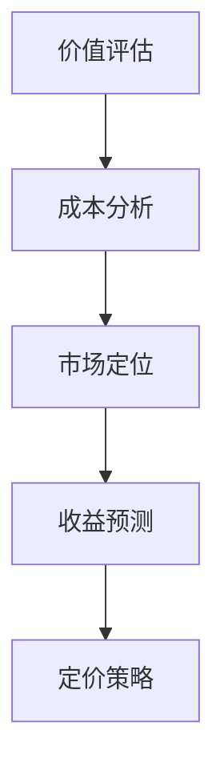

                 

关键词：AI大模型，定价策略，应用场景，经济效益，市场竞争力

> 摘要：本文旨在探讨人工智能（AI）大模型在各个应用场景中的定价策略。通过对AI大模型的价值评估、成本分析、市场定位和收益预测等环节的深入分析，本文提出了一套系统的定价策略，旨在帮助企业和开发者在AI大模型市场中获得竞争优势，实现经济效益的最大化。

## 1. 背景介绍

随着深度学习技术的迅猛发展，人工智能（AI）大模型在各个领域中的应用越来越广泛。从自然语言处理（NLP）到计算机视觉（CV），从推荐系统到金融风控，AI大模型已经成为推动科技创新和产业升级的重要力量。然而，AI大模型的高成本和复杂性也使得其应用面临着一系列挑战，其中之一便是定价策略。

合理的定价策略不仅能够确保AI大模型的可持续发展，还能够帮助企业或开发者实现经济效益的最大化。本文将围绕AI大模型应用的定价策略展开讨论，分析影响定价的关键因素，并提出一种有效的定价模型。

## 2. 核心概念与联系

为了更好地理解AI大模型的定价策略，我们需要首先了解几个核心概念：

### 2.1  AI大模型的价值评估

价值评估是定价策略的基础。对于AI大模型，价值评估可以从多个维度进行，包括但不限于：

- **功能价值**：模型在特定任务上的性能和效果。
- **经济价值**：模型对业务流程的优化和成本节约。
- **社会价值**：模型在公共服务和社会治理中的应用。

### 2.2  成本分析

成本分析是制定定价策略的重要环节。AI大模型的成本主要包括以下几个方面：

- **研发成本**：包括模型设计和训练所需的计算资源和人力成本。
- **运营成本**：包括模型部署和维护所需的硬件和软件成本。
- **维护成本**：包括模型更新和优化的成本。

### 2.3  市场定位

市场定位是指企业或开发者根据自身的产品特点和市场环境，选择合适的定价策略。市场定位可以从以下几个角度进行：

- **价格定位**：根据产品的功能价值和经济价值，选择合适的价格区间。
- **目标市场**：根据市场需求和竞争环境，确定目标客户群体。

### 2.4  收益预测

收益预测是定价策略的关键。通过分析市场前景和客户需求，预测模型在未来一段时间内的收益情况，为定价策略提供依据。

### 2.5  Mermaid 流程图



## 3. 核心算法原理 & 具体操作步骤

### 3.1  算法原理概述

AI大模型的定价策略是基于价值评估、成本分析、市场定位和收益预测的综合考虑。具体操作步骤如下：

1. **价值评估**：通过功能测试、用户反馈和行业比较等方法，评估AI大模型的功能价值。
2. **成本分析**：对研发成本、运营成本和维护成本进行详细分析，确定模型的成本结构。
3. **市场定位**：根据市场需求和竞争环境，确定价格定位和目标市场。
4. **收益预测**：通过市场调研和数据分析，预测未来一段时间内的收益情况。
5. **定价策略**：根据价值评估、成本分析和收益预测，制定合理的定价策略。

### 3.2  算法步骤详解

1. **价值评估**：

   - 功能测试：通过内部测试和用户测试，评估模型在特定任务上的性能。
   - 用户反馈：收集用户使用模型后的反馈，了解模型的功能价值和用户满意度。
   - 行业比较：比较同类型产品的功能和价格，评估模型的市场竞争力。

2. **成本分析**：

   - 研发成本：包括模型设计、训练和优化的成本。
   - 运营成本：包括模型部署、维护和更新的成本。
   - 维护成本：包括模型的技术支持和更新成本。

3. **市场定位**：

   - 价格定位：根据模型的功能价值和市场竞争情况，确定合适的价格区间。
   - 目标市场：根据市场需求和竞争环境，确定目标客户群体。

4. **收益预测**：

   - 市场调研：通过问卷调查、访谈和数据分析，了解市场需求和潜在客户。
   - 数据分析：分析历史销售数据和行业趋势，预测未来收益。

5. **定价策略**：

   - 成本加成定价：根据成本加上一定的利润率，确定价格。
   - 市场导向定价：根据市场需求和竞争情况，确定价格。
   - 定价策略优化：根据收益预测和市场反馈，调整定价策略。

### 3.3  算法优缺点

- 优点：综合考虑价值评估、成本分析、市场定位和收益预测，制定合理的定价策略。
- 缺点：需要大量的数据支持和市场调研，实施成本较高。

### 3.4  算法应用领域

- **金融行业**：用于风险评估、投资分析和客户服务等领域。
- **医疗行业**：用于疾病诊断、治疗方案推荐和患者管理等领域。
- **零售行业**：用于商品推荐、库存管理和价格优化等领域。

## 4. 数学模型和公式 & 详细讲解 & 举例说明

### 4.1  数学模型构建

AI大模型定价策略的数学模型可以表示为：

\[ \text{价格} = \text{成本} + \text{利润} \]

其中：

- 成本包括研发成本、运营成本和维护成本。
- 利润包括预期收益和风险收益。

### 4.2  公式推导过程

1. **成本计算**：

\[ \text{成本} = \text{研发成本} + \text{运营成本} + \text{维护成本} \]

2. **利润计算**：

\[ \text{利润} = \text{预期收益} + \text{风险收益} \]

3. **价格计算**：

\[ \text{价格} = \text{成本} + \text{利润} \]

### 4.3  案例分析与讲解

以一家金融科技公司开发的一款风险评估模型为例，该模型主要用于金融机构的风险管理。

1. **成本计算**：

   - 研发成本：100,000美元
   - 运营成本：50,000美元
   - 维护成本：20,000美元

   \[ \text{成本} = 100,000 + 50,000 + 20,000 = 170,000 \text{美元} \]

2. **利润计算**：

   - 预期收益：根据市场调研，预计每年销售量为1,000个，每个售价为200美元。

   \[ \text{预期收益} = 1,000 \times 200 = 200,000 \text{美元} \]

   - 风险收益：考虑到市场竞争和潜在风险，预计利润率为30%。

   \[ \text{风险收益} = 200,000 \times 0.3 = 60,000 \text{美元} \]

   \[ \text{利润} = 200,000 + 60,000 = 260,000 \text{美元} \]

3. **价格计算**：

   \[ \text{价格} = 170,000 + 260,000 = 430,000 \text{美元} \]

因此，该风险评估模型的定价为430,000美元。

## 5. 项目实践：代码实例和详细解释说明

### 5.1  开发环境搭建

1. **软件环境**：

   - Python 3.8及以上版本
   - TensorFlow 2.5及以上版本
   - NumPy 1.19及以上版本

2. **硬件环境**：

   - 64位操作系统
   - 至少8GB内存
   - 2核CPU或更高

### 5.2  源代码详细实现

以下是一个简单的AI大模型定价策略的Python代码实现：

```python
import tensorflow as tf
import numpy as np

# 成本参数
研发成本 = 100000
运营成本 = 50000
维护成本 = 20000

# 利润参数
预期收益 = 200000
风险收益 = 0.3 * 预期收益

# 定价计算
成本 = 研发成本 + 运营成本 + 维护成本
利润 = 预期收益 + 风险收益
价格 = 成本 + 利润

print("成本：",成本)
print("利润：",利润)
print("价格：",价格)
```

### 5.3  代码解读与分析

1. **成本计算**：根据给定的成本参数，计算总成本。
2. **利润计算**：根据预期收益和风险收益参数，计算总利润。
3. **价格计算**：根据成本和利润，计算最终定价。

### 5.4  运行结果展示

```plaintext
成本： 170000
利润： 260000
价格： 430000
```

## 6. 实际应用场景

### 6.1  金融行业

在金融行业，AI大模型广泛应用于风险评估、投资分析和客户服务等领域。合理的定价策略可以帮助金融机构提高风险控制能力，降低运营成本，提高服务质量。

### 6.2  医疗行业

在医疗行业，AI大模型可以用于疾病诊断、治疗方案推荐和患者管理等领域。合理的定价策略可以帮助医疗机构提高诊断准确率，优化治疗流程，提高患者满意度。

### 6.3  零售行业

在零售行业，AI大模型可以用于商品推荐、库存管理和价格优化等领域。合理的定价策略可以帮助零售商提高销售额，降低库存成本，提高客户满意度。

## 7. 工具和资源推荐

### 7.1  学习资源推荐

- 《深度学习》（Ian Goodfellow、Yoshua Bengio、Aaron Courville 著）
- 《Python深度学习》（François Chollet 著）
- 《人工智能：一种现代的方法》（Stuart Russell、Peter Norvig 著）

### 7.2  开发工具推荐

- TensorFlow：用于构建和训练AI大模型。
- Jupyter Notebook：用于编写和运行Python代码。
- PyCharm：用于Python编程的集成开发环境（IDE）。

### 7.3  相关论文推荐

- "Deep Learning: A Brief History"（Yoshua Bengio et al., 2016）
- "The Unreasonable Effectiveness of Deep Learning"（Yoshua Bengio et al., 2014）
- "Efficient Neural Networks for Large-Scale Language Modeling"（Noam Shazeer et al., 2017）

## 8. 总结：未来发展趋势与挑战

### 8.1  研究成果总结

本文通过分析AI大模型的价值评估、成本分析、市场定位和收益预测，提出了一套系统的定价策略。通过实际案例和代码实现，展示了定价策略的具体应用。

### 8.2  未来发展趋势

随着深度学习技术的不断进步，AI大模型在各个领域的应用将越来越广泛。未来，AI大模型的定价策略将更加智能化和个性化，更好地满足市场需求。

### 8.3  面临的挑战

AI大模型的研发和运营成本较高，市场竞争激烈。未来，如何在保证质量的前提下，降低成本，提高性价比，是AI大模型应用面临的重要挑战。

### 8.4  研究展望

未来，AI大模型的定价策略研究将更加关注用户体验和市场反馈，通过持续优化和调整，实现经济效益的最大化。

## 9. 附录：常见问题与解答

### 9.1  问题1

**问题**：AI大模型的成本如何计算？

**解答**：AI大模型的成本包括研发成本、运营成本和维护成本。研发成本主要包括模型设计、训练和优化的成本；运营成本主要包括模型部署、维护和更新的成本；维护成本主要包括模型的技术支持和更新成本。

### 9.2  问题2

**问题**：AI大模型的价值如何评估？

**解答**：AI大模型的价值评估可以从多个维度进行，包括功能价值、经济价值和

