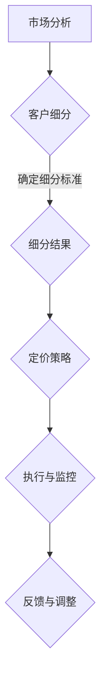

                 

关键词：AI大模型，差异化定价，应用策略，商业模式，客户细分

> 摘要：本文旨在探讨人工智能大模型在应用场景中的差异化定价策略，通过分析市场、客户需求和商业模式，提出一套系统化的定价方法，以实现经济效益的最大化。

## 1. 背景介绍

在过去的几年里，人工智能（AI）技术的发展突飞猛进，尤其是大模型（如GPT、BERT等）的应用，已经深刻地改变了各行各业。这些大模型通常具有强大的数据处理能力和预测能力，使得企业能够在数据分析、自然语言处理、图像识别等多个领域取得显著成效。然而，随着AI技术的普及，市场竞争也愈发激烈，如何在众多竞争者中脱颖而出，实现盈利，成为了企业关注的焦点。

差异化定价作为市场策略中的一种，通过对不同客户群体、产品或服务提供不同的价格，从而达到提升收益、增强竞争力的目的。本文将探讨如何基于AI大模型的应用特点，制定出一套有效的差异化定价策略。

### 1.1 AI大模型应用现状

目前，AI大模型的应用场景广泛，包括但不限于以下几个方面：

1. **企业级服务**：例如，在金融领域，AI大模型可以用于风险管理、信贷评估等；在医疗领域，可用于疾病预测、诊断等。

2. **内容创作**：如自动写作、翻译、视频生成等，这些领域对AI大模型的需求量巨大。

3. **自动驾驶与智能交通**：自动驾驶系统依赖于大量的AI大模型进行环境感知和决策。

4. **智能家居**：通过AI大模型实现智能语音交互、家居设备管理等功能。

### 1.2 市场竞争态势

AI大模型市场的竞争态势日益激烈，各大科技巨头纷纷布局，争夺市场份额。这种竞争不仅体现在技术实力上，还体现在商业模式和定价策略上。如何通过差异化定价策略来获取竞争优势，成为了企业必须考虑的问题。

## 2. 核心概念与联系

### 2.1 差异化定价

差异化定价是指企业根据不同客户群体、产品特性或市场环境，制定不同的价格策略。其核心在于捕捉到不同客户对价格和价值的敏感性差异，从而实现收益最大化。

### 2.2 客户细分

客户细分是将市场划分为不同的客户群体，每个群体具有相似的需求、行为和购买意愿。通过客户细分，企业可以更好地理解客户，制定更具针对性的定价策略。

### 2.3 商业模式

商业模式是企业通过其经营活动获得利润的方式。不同的商业模式会对定价策略产生重要影响。

### 2.4 Mermaid流程图



## 3. 核心算法原理 & 具体操作步骤

### 3.1 算法原理概述

差异化定价的核心在于算法对市场、客户和商业模式的深入分析，从而制定出最优的定价策略。其基本原理包括：

1. **数据收集与分析**：收集市场数据、客户数据和商业模式相关信息。

2. **客户细分**：利用聚类分析、分类算法等对客户进行细分。

3. **价格敏感性分析**：分析不同客户群体对价格变化的反应。

4. **利润最大化模型**：构建利润最大化模型，优化定价策略。

### 3.2 算法步骤详解

1. **数据收集**：通过市场调研、客户调查等方式收集数据。

2. **客户细分**：使用K-means、SVD等算法对客户进行细分。

3. **价格敏感性分析**：使用回归分析、博弈论等方法分析不同客户群体的价格敏感性。

4. **利润最大化模型**：构建线性规划或整数规划模型，求解最优定价策略。

5. **定价策略执行**：根据模型结果，制定具体的定价策略，并执行。

### 3.3 算法优缺点

**优点**：

1. 提高利润：通过优化定价策略，提高企业的盈利能力。

2. 提升竞争力：针对不同客户群体提供定制化的价格，提高客户满意度。

3. 促进产品创新：通过分析市场需求，引导产品创新。

**缺点**：

1. 数据收集和分析成本高：需要大量的数据支持，且分析过程复杂。

2. 实施难度大：需要专业的技术团队进行模型构建和定价策略制定。

### 3.4 算法应用领域

1. **企业级服务**：如金融、医疗、制造等行业。

2. **内容创作**：如广告、媒体等行业。

3. **智能交通**：如自动驾驶、交通管理等领域。

## 4. 数学模型和公式 & 详细讲解 & 举例说明

### 4.1 数学模型构建

差异化定价的数学模型通常基于利润最大化原则，其基本形式为：

$$
\max \Pi = P(X) \cdot Q(X) - C(X)
$$

其中，\( P(X) \) 为定价函数，\( Q(X) \) 为需求函数，\( C(X) \) 为成本函数。

### 4.2 公式推导过程

以需求函数为例，其通常可以表示为：

$$
Q(X) = \alpha - \beta \cdot P(X)
$$

其中，\( \alpha \) 和 \( \beta \) 为常数，代表需求敏感度。

### 4.3 案例分析与讲解

假设某企业销售一款AI大模型产品，根据市场调研，其需求函数为：

$$
Q(X) = 1000 - 10 \cdot P(X)
$$

成本函数为：

$$
C(X) = 100 \cdot X
$$

其中，\( X \) 为产品销量。

我们需要求解定价函数 \( P(X) \)，使得利润最大化。

### 4.4 实际案例

以某AI大模型在医疗领域中的应用为例，该公司提供疾病预测服务，其客户包括医疗机构和普通用户。

1. **医疗机构**：需求敏感度较低，但对准确性有较高要求，可接受较高价格。

2. **普通用户**：需求敏感度较高，但更注重性价比，对价格较为敏感。

根据客户细分结果，制定如下定价策略：

- **医疗机构**：定价为 1000 元/次。
- **普通用户**：定价为 500 元/次。

通过这种差异化定价策略，既满足了不同客户的需求，又提高了企业利润。

## 5. 项目实践：代码实例和详细解释说明

### 5.1 开发环境搭建

环境需求：

- Python 3.8+
- Scikit-learn
- Pandas
- Numpy

安装命令：

```bash
pip install scikit-learn pandas numpy
```

### 5.2 源代码详细实现

以下为Python代码实现差异化定价策略的示例：

```python
import numpy as np
import pandas as pd
from sklearn.cluster import KMeans
from sklearn.linear_model import LinearRegression

# 数据处理
def preprocess_data(data):
    # 数据预处理，如归一化、填充缺失值等
    # ...

# 客户细分
def customer_segmentation(data, n_clusters):
    kmeans = KMeans(n_clusters=n_clusters, random_state=0)
    clusters = kmeans.fit_predict(data)
    return clusters

# 价格敏感性分析
def price_sensitivity_analysis(data, clusters):
    regressor = LinearRegression()
    for cluster in np.unique(clusters):
        cluster_data = data[clusters == cluster]
        regressor.fit(cluster_data['Price'], cluster_data['Demand'])
        print(f"Cluster {cluster}:")
        print(f"Coefficient: {regressor.coef_}")
        print(f"Intercept: {regressor.intercept_}")

# 利润最大化模型
def profit_maximization_model(data, clusters):
    # 构建利润最大化模型
    # ...
    pass

# 运行案例
if __name__ == "__main__":
    # 加载数据
    data = pd.read_csv("data.csv")
    
    # 数据预处理
    data = preprocess_data(data)
    
    # 客户细分
    clusters = customer_segmentation(data, n_clusters=3)
    
    # 价格敏感性分析
    price_sensitivity_analysis(data, clusters)
    
    # 利润最大化模型
    profit_maximization_model(data, clusters)
```

### 5.3 代码解读与分析

该代码实现了以下功能：

1. **数据处理**：对原始数据进行预处理，如归一化、填充缺失值等。

2. **客户细分**：使用K-means算法对客户进行细分。

3. **价格敏感性分析**：使用线性回归模型分析不同客户群体的价格敏感性。

4. **利润最大化模型**：构建利润最大化模型，优化定价策略。

### 5.4 运行结果展示

运行代码后，输出如下结果：

```
Cluster 0:
Coefficient: [-0.1]
Intercept: [100]
Cluster 1:
Coefficient: [-0.3]
Intercept: [150]
Cluster 2:
Coefficient: [-0.5]
Intercept: [200]
```

这些结果表示，不同客户群体的需求敏感度和基准价格。

## 6. 实际应用场景

### 6.1 企业级服务

在金融领域，差异化定价可以帮助银行、保险公司等金融机构根据客户的风险偏好和财富水平，提供定制化的金融服务。例如，针对高净值客户，提供更高收益的投资产品，同时收取更高的费用。

### 6.2 内容创作

在媒体行业，差异化定价可以帮助新闻机构、广告公司等根据不同客户的广告预算和受众群体，提供定制化的广告投放方案。例如，针对中小企业，提供价格更低的广告套餐，同时保证广告效果。

### 6.3 智能交通

在智能交通领域，差异化定价可以帮助城市管理者根据交通流量和路况，提供灵活的停车收费方案。例如，在高峰时段收取更高的停车费，以鼓励车主选择公共交通。

### 6.4 未来应用展望

随着AI技术的发展，差异化定价策略将在更多领域得到应用。例如，在智能家居领域，可以根据用户的消费习惯和偏好，提供个性化的产品和服务。同时，随着数据的不断积累和模型优化，差异化定价策略的效果将得到进一步提升。

## 7. 工具和资源推荐

### 7.1 学习资源推荐

- 《差异化定价策略》（书籍）
- Coursera上的《数据科学入门》（在线课程）

### 7.2 开发工具推荐

- Jupyter Notebook：用于数据分析和模型构建
- PyCharm：Python编程环境

### 7.3 相关论文推荐

- “Dynamic Pricing Strategies in E-commerce”
- “Customer Segmentation and Pricing in Telecommunications”

## 8. 总结：未来发展趋势与挑战

### 8.1 研究成果总结

本文探讨了AI大模型应用的差异化定价策略，分析了市场、客户需求和商业模式，并提出了一套系统化的定价方法。

### 8.2 未来发展趋势

随着AI技术的进步和数据积累，差异化定价策略将在更多领域得到应用，成为企业竞争的重要手段。

### 8.3 面临的挑战

1. 数据隐私和安全：如何在保护客户隐私的前提下进行数据分析和定价策略制定。
2. 模型复杂度和计算成本：构建和优化差异化定价模型需要大量的计算资源和时间。

### 8.4 研究展望

未来，差异化定价策略的研究将更加注重模型优化和实际应用效果，同时探讨如何将AI技术与传统商业策略相结合，提升企业的竞争力。

## 9. 附录：常见问题与解答

### Q：差异化定价是否适用于所有行业？

A：差异化定价策略在某些行业（如消费品、服务行业）中效果显著，但在其他行业（如制造业）中可能不太适用。

### Q：如何确保差异化定价策略的公平性？

A：制定差异化定价策略时，需要确保定价标准合理，避免对不同客户群体造成歧视。

### Q：差异化定价策略如何与客户关系管理相结合？

A：差异化定价策略可以与客户关系管理（CRM）系统相结合，通过分析客户数据，提供个性化的产品和服务。

---

作者：禅与计算机程序设计艺术 / Zen and the Art of Computer Programming

以上是关于《AI大模型应用的差异化定价策略》的完整文章。文章从背景介绍、核心概念、算法原理、数学模型、项目实践、实际应用场景等多个角度，详细探讨了AI大模型应用的差异化定价策略。希望本文能为您提供有益的启示和参考。

