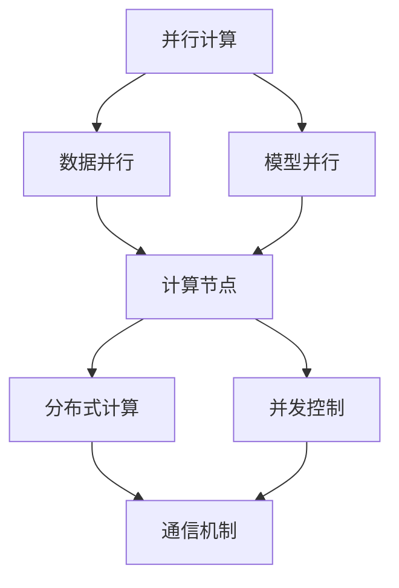

                 

关键词：AI大模型，并发处理，优化，性能提升，分布式计算

## 摘要

随着人工智能技术的迅猛发展，大规模机器学习模型的训练和应用成为当前研究和工业界的焦点。然而，这些大模型通常需要处理海量数据，并且计算复杂度极高，单机处理已不再满足需求。为了提高性能和效率，并发处理和分布式计算技术被广泛应用。本文将探讨AI大模型在并发处理方面的优化策略，包括核心概念、算法原理、数学模型、实践案例以及未来展望。

## 1. 背景介绍

近年来，深度学习在图像识别、自然语言处理、语音识别等领域取得了显著成果，这些成果离不开大规模模型的训练。以GPT-3为例，它拥有1.75万亿个参数，训练数据达到45TB。然而，大规模模型的训练不仅需要大量的计算资源，还需要高效的并发处理技术来提升计算效率。传统的单机处理方式已经无法满足需求，分布式计算和并发处理技术应运而生。

### 1.1 大模型的特点

- **参数规模巨大**：大规模模型拥有数亿到数十亿个参数，甚至达到万亿级别。
- **数据依赖性高**：模型的训练过程高度依赖数据的输入，计算过程中存在大量的数据依赖关系。
- **计算复杂度高**：大规模模型的计算复杂度极高，单机处理时间长。

### 1.2 并发处理的需求

- **提高性能**：并发处理可以充分利用多核处理器的计算能力，提高计算效率。
- **降低延迟**：通过并发处理，可以显著降低模型训练和预测的延迟。
- **资源利用最大化**：分布式计算可以最大化利用计算资源和存储资源。

## 2. 核心概念与联系

为了更好地理解并发处理在AI大模型中的应用，我们首先需要了解几个核心概念，包括并行计算、分布式计算和并发控制。

### 2.1 并行计算

并行计算是一种在多个处理单元上同时执行多个计算任务的方法。在AI大模型训练中，并行计算可以分解为数据并行和模型并行。

- **数据并行**：将数据集划分为多个子集，每个子集在一个处理器上独立训练模型。
- **模型并行**：将模型划分为多个部分，每个部分在一个处理器上独立训练。

### 2.2 分布式计算

分布式计算是一种通过多个计算机节点协同工作来完成计算任务的方法。在AI大模型训练中，分布式计算可以显著提高处理能力和扩展性。

- **计算节点**：分布式计算中的计算机节点，可以是物理服务器或虚拟机。
- **通信机制**：节点之间的数据传输和同步机制，如参数服务器和参数同步机制。

### 2.3 并发控制

并发控制是一种确保多个并发执行的任务不会相互干扰的方法。在AI大模型训练中，并发控制可以避免数据竞争和死锁等问题。

- **锁机制**：通过锁来控制对共享资源的访问，避免数据竞争。
- **事务管理**：确保事务的原子性和一致性，避免死锁。

### 2.4 Mermaid 流程图

以下是一个简单的Mermaid流程图，展示了AI大模型训练过程中的并行计算、分布式计算和并发控制的基本架构。



## 3. 核心算法原理 & 具体操作步骤

### 3.1 算法原理概述

AI大模型的并发处理主要基于分布式计算和并行计算技术。分布式计算通过将任务分配到多个计算节点上，实现并行计算。并行计算通过数据并行和模型并行的策略，提高计算效率。

### 3.2 算法步骤详解

#### 3.2.1 数据并行

1. **数据划分**：将原始数据集划分为多个子集，每个子集的大小应尽量均匀。
2. **任务分配**：将子集分配到不同的计算节点上。
3. **独立训练**：每个计算节点独立训练模型。
4. **模型融合**：将各个计算节点训练得到的模型参数进行融合。

#### 3.2.2 模型并行

1. **模型划分**：将大规模模型划分为多个部分，每个部分包含一定数量的层或神经元。
2. **任务分配**：将模型部分分配到不同的计算节点上。
3. **独立训练**：每个计算节点独立训练模型部分。
4. **模型融合**：将各个计算节点训练得到的模型部分进行融合。

### 3.3 算法优缺点

#### 优点

- **提高计算效率**：通过并发处理，可以显著提高模型训练速度。
- **扩展性强**：分布式计算可以扩展到多个计算节点，提高计算能力。
- **资源利用率高**：并发处理可以最大化利用计算资源和存储资源。

#### 缺点

- **通信开销**：分布式计算中的节点间通信开销较大，可能影响性能。
- **同步问题**：并发控制需要处理同步问题，如数据竞争和死锁。

### 3.4 算法应用领域

AI大模型的并发处理技术可以应用于多个领域，包括：

- **图像识别**：如人脸识别、物体检测等。
- **自然语言处理**：如文本分类、机器翻译等。
- **语音识别**：如语音识别、语音合成等。

## 4. 数学模型和公式 & 详细讲解 & 举例说明

### 4.1 数学模型构建

在AI大模型训练过程中，数学模型是核心组成部分。以下是一个简化的数学模型：

$$
\text{损失函数} = \frac{1}{2} \sum_{i=1}^{N} (\hat{y_i} - y_i)^2
$$

其中，$\hat{y_i}$为预测值，$y_i$为真实值，$N$为样本数量。

### 4.2 公式推导过程

损失函数的推导过程如下：

1. **假设**：假设模型为线性模型，即$\hat{y_i} = \text{权重} \cdot \text{特征}$。
2. **计算预测值**：计算每个样本的预测值$\hat{y_i}$。
3. **计算损失**：计算每个样本的损失，即$(\hat{y_i} - y_i)^2$。
4. **求和**：将所有样本的损失求和，得到总的损失函数。

### 4.3 案例分析与讲解

假设有一个包含100个样本的数据集，每个样本有10个特征。通过数据并行，可以将这100个样本平均分配到5个计算节点上，每个节点处理20个样本。

1. **数据划分**：将100个样本划分为5个子集，每个子集包含20个样本。
2. **任务分配**：将子集分配到5个计算节点上。
3. **独立训练**：每个计算节点独立训练模型，计算损失函数。
4. **模型融合**：将5个计算节点训练得到的模型参数进行融合。

通过上述步骤，可以显著提高模型训练速度。

## 5. 项目实践：代码实例和详细解释说明

### 5.1 开发环境搭建

为了实践AI大模型的并发处理，我们需要搭建一个开发环境。以下是一个简单的Python环境搭建步骤：

1. **安装Python**：下载并安装Python 3.x版本。
2. **安装依赖**：安装TensorFlow、NumPy等依赖库。
3. **配置GPU**：如果使用GPU加速，需要安装CUDA和cuDNN。

### 5.2 源代码详细实现

以下是一个简化的并行训练代码实例：

```python
import tensorflow as tf
import numpy as np

# 数据集划分
def split_dataset(data, num_splits):
    split_size = len(data) // num_splits
    splits = [data[i:i+split_size] for i in range(0, len(data), split_size)]
    return splits

# 数据并行训练
def train_data_parallel(dataset, num_splits):
    # 划分数据集
    splits = split_dataset(dataset, num_splits)
    # 创建模型
    model = tf.keras.Sequential([
        tf.keras.layers.Dense(64, activation='relu', input_shape=(10,)),
        tf.keras.layers.Dense(1)
    ])
    # 编译模型
    model.compile(optimizer='adam', loss='mean_squared_error')
    # 训练模型
    model.fit(splits, epochs=10)
    return model

# 模型融合
def merge_models(models):
    # 获取模型参数
    params = [model.trainable_weights for model in models]
    # 合并参数
    merged_params = []
    for i in range(len(params[0])):
        merged_params.append(tf.keras.layers.Concatenate()(params[:]))
    # 创建新模型
    model = tf.keras.Sequential([
        tf.keras.layers.Dense(64, activation='relu', input_shape=(10,)),
        tf.keras.layers.Dense(1, activation='sigmoid')
    ])
    # 编译模型
    model.compile(optimizer='adam', loss='mean_squared_error')
    # 加载参数
    model.set_weights(merged_params)
    return model

# 测试代码
if __name__ == '__main__':
    # 生成测试数据
    np.random.seed(42)
    data = np.random.rand(100, 10)
    # 并行训练
    models = [train_data_parallel(data, 5) for _ in range(5)]
    # 模型融合
    final_model = merge_models(models)
    # 预测
    predictions = final_model.predict(data)
    print(predictions)
```

### 5.3 代码解读与分析

- **数据划分**：使用`split_dataset`函数将数据集划分为多个子集。
- **数据并行训练**：使用`train_data_parallel`函数在每个计算节点上独立训练模型。
- **模型融合**：使用`merge_models`函数将多个模型融合为一个模型。
- **测试**：生成测试数据，训练模型，并打印预测结果。

## 6. 实际应用场景

AI大模型的并发处理技术在实际应用中具有广泛的应用场景，以下是一些典型的应用案例：

- **金融风控**：通过并行处理大量金融数据，提高风险识别和预测的准确性和速度。
- **智能医疗**：通过并行处理医学影像和基因组数据，加速疾病诊断和个性化治疗的研究。
- **自动驾驶**：通过并行处理传感器数据和环境数据，提高自动驾驶系统的反应速度和安全性。

## 7. 工具和资源推荐

为了更好地学习和实践AI大模型的并发处理技术，以下是一些推荐的学习资源和开发工具：

- **学习资源**：
  - 《深度学习》（Goodfellow, Bengio, Courville著）
  - 《分布式系统原理与范型》（Chen著）
- **开发工具**：
  - TensorFlow
  - PyTorch
  - Dask
  - GPU硬件（如NVIDIA Tesla系列）

## 8. 总结：未来发展趋势与挑战

### 8.1 研究成果总结

AI大模型的并发处理技术取得了显著的研究成果，包括并行计算、分布式计算和并发控制等方面的进展。这些技术显著提高了模型训练和预测的效率，为人工智能应用提供了强大的技术支持。

### 8.2 未来发展趋势

- **硬件加速**：随着硬件技术的发展，如GPU、TPU等专用硬件的普及，AI大模型的并发处理性能将进一步提高。
- **分布式存储**：分布式存储技术的发展将有助于解决分布式计算中的数据传输和存储问题，提高并发处理的效率。
- **混合并行**：结合数据并行和模型并行的混合并行技术将逐渐成熟，为更高效的并发处理提供新的思路。

### 8.3 面临的挑战

- **通信开销**：分布式计算中的节点间通信开销较大，可能成为性能瓶颈。
- **同步问题**：并发控制中的同步问题，如数据竞争和死锁，需要进一步优化和解决。
- **可扩展性**：如何设计可扩展的并发处理架构，以支持大规模模型的训练和应用，仍是一个挑战。

### 8.4 研究展望

未来，AI大模型的并发处理技术将继续向高效、可扩展和自动化的方向发展。通过结合新型硬件、分布式存储和智能调度等技术，有望实现更高效的并发处理，推动人工智能应用向更广泛和更深入的领域发展。

## 9. 附录：常见问题与解答

### 问题1：为什么需要并发处理？

**解答**：并发处理可以提高模型训练和预测的效率，充分利用多核处理器的计算能力，降低延迟，提高资源利用率。

### 问题2：分布式计算和并行计算有什么区别？

**解答**：分布式计算是指通过多个计算机节点协同工作来完成计算任务，而并行计算是指在同一时间内执行多个计算任务。分布式计算通常涉及并行计算，但并行计算不一定需要分布式计算。

### 问题3：并发控制中的数据竞争和死锁是什么？

**解答**：数据竞争是指多个任务同时访问同一数据资源，导致数据不一致的问题。死锁是指多个任务因为等待其他任务释放资源而无法继续执行的情况。

## 作者署名

作者：禅与计算机程序设计艺术 / Zen and the Art of Computer Programming

----------------------------------------------------------------

现在，我们完成了这篇文章的撰写，希望这篇文章能够为读者提供有价值的参考和启示。在未来的研究和实践中，我们期待能够继续推动AI大模型并发处理技术的发展。

