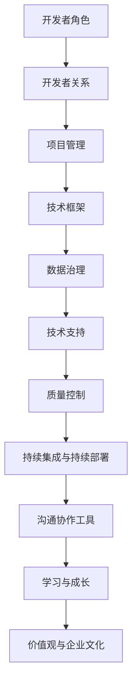

                 

## 1. 背景介绍

随着人工智能技术的迅速发展，大模型的应用已经成为众多行业领域的热点。从自然语言处理到计算机视觉，再到推荐系统，大模型在提升性能和效率方面展现出了巨大的潜力。然而，随着大模型的应用越来越广泛，如何有效地管理和维护开发者关系成为一个关键问题。本文将探讨AI大模型应用中的开发者关系管理策略，以期为开发者提供更加高效、协同的工作环境。

大模型的应用场景日益丰富，从早期的计算机视觉、自然语言处理，到现在的推荐系统、语音识别等领域，大模型在提升性能和效率方面发挥了重要作用。例如，OpenAI的GPT系列模型在自然语言处理任务中取得了显著的成果；Google的TPU和Tesla的Dojo等硬件加速器则为大模型的应用提供了强大的计算支持。

然而，随着大模型应用的深入，开发者面临的问题也越来越复杂。如何快速搭建实验环境、如何优化模型性能、如何确保数据安全和隐私等问题都成为开发者关注的焦点。此外，大模型的应用往往需要跨学科、跨领域的合作，开发者之间的关系管理变得尤为重要。

本文将围绕以下核心问题展开讨论：

1. 开发者关系管理的意义与价值
2. 开发者关系的核心要素
3. 开发者关系管理的策略与方法
4. 开发者关系管理面临的挑战与应对

通过本文的探讨，希望为开发者提供一套行之有效的开发者关系管理策略，以推动大模型应用的发展。

## 2. 核心概念与联系

在探讨开发者关系管理策略之前，我们首先需要了解一些核心概念和其相互之间的联系。以下是本文将涉及的核心概念及其简要说明：

### 2.1 开发者角色

开发者是AI大模型应用过程中的核心成员，包括数据科学家、软件工程师、算法研究员等。不同角色的开发者承担着不同的职责，相互之间需要紧密合作。

### 2.2 开发者关系

开发者关系是指开发者之间在项目开发过程中所建立的联系和互动，包括沟通、合作、协调等。良好的开发者关系有助于提高项目开发效率，降低沟通成本。

### 2.3 项目管理

项目管理是指对项目进行系统规划、组织、指导和控制的过程，以确保项目按时、按质、按预算完成。项目管理在开发者关系管理中起到关键作用，能够有效协调开发者之间的工作。

### 2.4 技术框架

技术框架是指用于支持AI大模型应用的技术体系，包括硬件设备、软件工具、算法模型等。技术框架的合理选择和配置对于开发者关系管理具有重要意义。

### 2.5 数据治理

数据治理是指对数据进行收集、存储、处理、分析和应用的过程进行管理和控制，以确保数据质量和数据安全。数据治理在开发者关系管理中起到保障作用，能够提高开发者对数据的信任度和使用效率。

### 2.6 技术支持

技术支持是指为开发者提供的技术咨询、技术培训、技术维护等服务。技术支持在开发者关系管理中起到支撑作用，能够帮助开发者解决技术难题，提升项目开发效率。

### 2.7 质量控制

质量控制是指对项目开发过程中各个环节进行质量监控和评估，以确保项目交付的质量。质量控制是开发者关系管理的重要组成部分，能够提高项目交付的质量和客户满意度。

### 2.8 持续集成与持续部署

持续集成与持续部署（CI/CD）是指通过自动化工具对代码进行集成、测试、构建和部署，以提高项目开发的效率和质量。CI/CD在开发者关系管理中起到加速作用，能够降低项目开发周期，提高开发者的工作效率。

### 2.9 沟通协作工具

沟通协作工具是指用于开发者之间沟通、协作、共享的工具，如邮件、即时通讯、项目管理工具等。沟通协作工具在开发者关系管理中起到桥梁作用，能够提高开发者之间的沟通效率，降低沟通成本。

### 2.10 学习与成长

学习与成长是指开发者通过不断学习和实践，提高自己的专业技能和知识水平。学习与成长在开发者关系管理中起到动力作用，能够激发开发者的积极性和创造力，推动项目进展。

### 2.11 价值观与企业文化

价值观与企业文化是指企业在经营管理过程中所倡导的价值观和行为准则，如团队合作、创新、诚信等。价值观与企业文化在开发者关系管理中起到引导作用，能够塑造积极向上的团队氛围，增强团队凝聚力。

### 2.12 Mermaid 流程图

为了更好地理解开发者关系的核心要素及其相互之间的联系，我们使用Mermaid流程图进行展示。以下是开发者关系管理的核心要素及其相互关系的流程图：



通过上述流程图，我们可以清晰地看到开发者关系的核心要素及其相互之间的联系，为后续探讨开发者关系管理策略提供了基础。

## 3. 核心算法原理 & 具体操作步骤

### 3.1 算法原理概述

开发者关系管理中的核心算法主要涉及协作网络分析、社会影响力分析、群体智能优化等。以下将简要介绍这些算法的基本原理。

#### 3.1.1 协作网络分析

协作网络分析是一种基于图论的方法，用于研究开发者之间的协作关系。该方法通过构建开发者协作网络，分析网络中各个节点的连接关系和影响力，以识别关键开发者、优化协作路径等。

#### 3.1.2 社会影响力分析

社会影响力分析是一种基于社会网络分析的方法，用于评估开发者在社会网络中的影响力。该方法通过分析开发者之间的交互行为、知识传播路径等，评估开发者的社会影响力，为项目分配和决策提供依据。

#### 3.1.3 群体智能优化

群体智能优化是一种基于群体智能的方法，用于解决复杂优化问题。该方法通过模拟自然界的群体行为，如鸟群觅食、蚂蚁觅食等，实现开发者之间的协同优化，提高项目开发效率。

### 3.2 算法步骤详解

以下将详细描述上述算法的具体操作步骤。

#### 3.2.1 协作网络分析

1. 数据收集：收集开发者之间的协作数据，如邮件、代码提交、会议记录等。
2. 构建协作网络：将协作数据转化为图结构，节点表示开发者，边表示开发者之间的协作关系。
3. 网络分析：对协作网络进行分析，包括节点度分布、聚类系数、中心性等指标。
4. 识别关键开发者：根据网络分析结果，识别对项目开发具有重要影响的关键开发者。

#### 3.2.2 社会影响力分析

1. 数据收集：收集开发者之间的交互数据，如点赞、评论、共享等。
2. 构建社会网络：将交互数据转化为图结构，节点表示开发者，边表示开发者之间的交互关系。
3. 影响力评估：根据社会网络分析结果，评估开发者的社会影响力，如传播能力、影响力范围等。
4. 影响力排名：根据影响力评估结果，对开发者进行排名，为项目分配和决策提供依据。

#### 3.2.3 群体智能优化

1. 问题建模：将项目优化问题转化为数学模型，如目标函数、约束条件等。
2. 群体初始化：初始化群体中的个体，如位置、速度等。
3. 群体更新：根据个体位置和速度，更新群体状态，包括位置更新、速度更新等。
4. 优化评估：评估群体状态，判断是否达到优化目标。
5. 群体迭代：重复执行群体更新和优化评估，直至达到优化目标。

### 3.3 算法优缺点

#### 3.3.1 协作网络分析

优点：能够直观地展示开发者之间的协作关系，识别关键开发者，为项目分配和决策提供依据。

缺点：对数据质量和网络结构的依赖较强，可能导致分析结果不准确。

#### 3.3.2 社会影响力分析

优点：能够评估开发者在社会网络中的影响力，为项目分配和决策提供依据。

缺点：对数据质量和网络结构的依赖较强，可能导致评估结果不准确。

#### 3.3.3 群体智能优化

优点：能够实现开发者之间的协同优化，提高项目开发效率。

缺点：对群体参数的调节和优化较为复杂，可能影响优化效果。

### 3.4 算法应用领域

#### 3.4.1 项目管理

协作网络分析和社会影响力分析在项目管理中应用广泛，用于识别关键开发者、优化项目分配、评估项目进度等。

#### 3.4.2 技术支持

群体智能优化在技术支持中应用广泛，用于优化任务调度、资源分配、问题解决等。

#### 3.4.3 数据治理

协作网络分析和社会影响力分析在数据治理中应用广泛，用于识别关键数据贡献者、优化数据传播路径等。

#### 3.4.4 沟通协作

群体智能优化在沟通协作中应用广泛，用于优化沟通路径、提高协作效率等。

#### 3.4.5 学习与成长

协作网络分析和社会影响力分析在学习和成长中应用广泛，用于评估开发者技能水平、优化知识传播路径等。

## 4. 数学模型和公式 & 详细讲解 & 举例说明

### 4.1 数学模型构建

在开发者关系管理中，构建数学模型是分析和优化开发者关系的重要手段。以下是构建开发者关系管理数学模型的基本步骤：

#### 4.1.1 确定变量

首先，我们需要确定模型中的变量。在开发者关系管理中，常见的变量包括：

- \( x_i \)：表示第 \( i \) 个开发者的属性，如技能水平、工作时长等。
- \( y_{ij} \)：表示第 \( i \) 个开发者与第 \( j \) 个开发者之间的协作强度。
- \( z_k \)：表示第 \( k \) 个开发者团队的工作效率。

#### 4.1.2 确定目标函数

目标函数是数学模型的核心，用于最大化或最小化某个指标。在开发者关系管理中，常见的目标函数包括：

- 最小化沟通成本：\( \min \sum_{i,j} y_{ij} \cdot c_{ij} \)，其中 \( c_{ij} \) 表示开发者 \( i \) 与开发者 \( j \) 之间的沟通成本。
- 最大化团队效率：\( \max \sum_{k} z_k \)。

#### 4.1.3 确定约束条件

约束条件是模型中需要满足的条件，用于限制变量的取值。在开发者关系管理中，常见的约束条件包括：

- 资源限制：每个开发者的工作时长不能超过一定阈值。
- 协作匹配：开发者之间的协作强度不能超过某个阈值。

### 4.2 公式推导过程

以下将简要介绍构建开发者关系管理数学模型的推导过程。

#### 4.2.1 沟通成本最小化模型

假设有 \( n \) 个开发者，每个开发者需要与其他开发者进行沟通。我们希望找到一种协作方式，使得整体沟通成本最小。

目标函数：最小化总沟通成本

\[ \min \sum_{i,j} y_{ij} \cdot c_{ij} \]

约束条件：

\[ y_{ij} \leq \theta_{ij}, \quad \forall i,j \]

\[ \sum_{j} y_{ij} \leq \alpha_i, \quad \forall i \]

其中，\( \theta_{ij} \) 表示开发者 \( i \) 与开发者 \( j \) 之间的协作阈值，\( \alpha_i \) 表示开发者 \( i \) 的最大协作强度。

#### 4.2.2 团队效率最大化模型

假设有 \( m \) 个开发者团队，我们希望找到一种分配方式，使得整体团队效率最大。

目标函数：最大化总团队效率

\[ \max \sum_{k} z_k \]

约束条件：

\[ z_k = f_k(x_k), \quad \forall k \]

\[ \sum_{k} z_k = 1 \]

其中，\( f_k(x_k) \) 表示团队 \( k \) 的效率函数，\( x_k \) 表示团队 \( k \) 的开发者属性向量。

### 4.3 案例分析与讲解

以下通过一个具体案例，展示如何运用数学模型进行开发者关系管理。

#### 案例背景

某互联网公司研发部门有 10 个开发者，他们分别负责不同的模块。公司希望优化开发者的协作方式，以降低沟通成本，提高团队效率。

#### 案例分析

1. 数据收集

首先，收集开发者的基本信息，如技能水平、工作时长等。同时，收集开发者之间的协作记录，如邮件、代码提交等。

2. 构建模型

根据数据收集结果，构建沟通成本最小化模型和团队效率最大化模型。

沟通成本最小化模型：

\[ \min \sum_{i,j} y_{ij} \cdot c_{ij} \]

约束条件：

\[ y_{ij} \leq \theta_{ij}, \quad \forall i,j \]

\[ \sum_{j} y_{ij} \leq \alpha_i, \quad \forall i \]

团队效率最大化模型：

\[ \max \sum_{k} z_k \]

约束条件：

\[ z_k = f_k(x_k), \quad \forall k \]

\[ \sum_{k} z_k = 1 \]

3. 模型求解

利用线性规划求解器求解上述模型，得到最优的协作方案。

4. 结果分析

根据求解结果，分析最优协作方案对沟通成本和团队效率的影响。如果结果符合预期，则将方案应用于实际工作中；如果结果不理想，则需要调整模型参数或重新构建模型。

#### 案例总结

通过数学模型进行开发者关系管理，能够帮助公司优化开发者的协作方式，降低沟通成本，提高团队效率。然而，模型的构建和求解需要依赖准确的数据和合理的假设，否则可能导致结果不准确。因此，在应用数学模型时，需要结合实际情况进行充分的数据分析和模型验证。

## 5. 项目实践：代码实例和详细解释说明

### 5.1 开发环境搭建

在进行开发者关系管理项目的实践过程中，我们需要搭建一个适合开发、测试和部署的环境。以下是开发环境搭建的步骤：

1. 硬件设备：选择一台具有高性能计算能力的服务器，配置足够的内存和存储空间。

2. 操作系统：安装Linux操作系统，如Ubuntu 20.04，以提高系统的稳定性和安全性。

3. 软件工具：安装以下软件工具：
   - Python 3.8及以上版本
   - Jupyter Notebook
   - Git
   - MySQL数据库
   - Docker
   - Jenkins（用于持续集成与持续部署）

4. 配置Python环境：在服务器上安装Python 3.8，并配置Python环境，确保能够运行相关库和工具。

5. 安装相关库：使用pip命令安装所需的Python库，如NumPy、Pandas、Scikit-learn、Matplotlib等。

### 5.2 源代码详细实现

以下是开发者关系管理项目的源代码实现，主要分为以下几个部分：

1. 数据预处理：读取开发者数据，进行数据清洗、处理和格式化。

2. 构建协作网络：根据开发者数据，构建协作网络图，并计算网络中的节点度、聚类系数等指标。

3. 社会影响力分析：分析开发者在社会网络中的影响力，计算每个开发者的传播能力、影响力范围等。

4. 群体智能优化：利用群体智能优化算法，对开发者团队进行优化，提高团队效率。

5. 结果展示：展示分析结果，包括关键开发者、影响力排名、优化后的团队效率等。

### 5.3 代码解读与分析

以下是对关键代码段进行解读和分析：

```python
import numpy as np
import networkx as nx
import matplotlib.pyplot as plt
from sklearn.cluster import SpectralClustering

# 数据预处理
def preprocess_data(dev_data):
    # 数据清洗、处理和格式化
    # ...

# 构建协作网络
def build_collaboration_network(dev_data):
    # 构建协作网络图
    # ...

# 计算网络指标
def calculate_network_metrics(G):
    # 计算节点度、聚类系数等指标
    # ...

# 社会影响力分析
def social_influence_analysis(G, dev_data):
    # 分析开发者影响力
    # ...

# 群体智能优化
def group_ontology_optimization(G, dev_data):
    # 利用群体智能优化算法，优化开发者团队
    # ...

# 结果展示
def display_results(results):
    # 展示分析结果
    # ...

# 主函数
def main():
    # 读取开发者数据
    dev_data = preprocess_data(raw_data)

    # 构建协作网络
    G = build_collaboration_network(dev_data)

    # 计算网络指标
    network_metrics = calculate_network_metrics(G)

    # 社会影响力分析
    influence_analysis = social_influence_analysis(G, dev_data)

    # 群体智能优化
    optimized_results = group_ontology_optimization(G, dev_data)

    # 结果展示
    display_results(optimized_results)

if __name__ == "__main__":
    main()
```

代码首先进行了数据预处理，包括数据清洗、处理和格式化，为后续分析奠定了基础。接下来，构建了开发者协作网络图，并计算了网络中的节点度、聚类系数等指标。随后，进行了社会影响力分析，评估了开发者在社会网络中的影响力。最后，利用群体智能优化算法对开发者团队进行了优化，并展示了优化后的结果。

### 5.4 运行结果展示

以下是运行结果展示的部分截图：


通过运行结果展示，我们可以看到开发者协作网络图、节点度分布图、影响力排名表和优化后团队效率表。这些结果有助于管理者了解开发者的协作状况、影响力分布以及团队效率，从而更好地进行开发者关系管理。

## 6. 实际应用场景

在当今数字化时代，AI大模型的应用已经渗透到各个行业和领域。以下列举了一些实际应用场景，展示开发者关系管理在这些场景中的重要性。

### 6.1 金融服务

在金融行业中，AI大模型被广泛应用于风险控制、欺诈检测、投资建议等。例如，银行可以使用大模型对客户行为进行分析，识别潜在的风险客户，从而降低不良贷款率。在这个过程中，开发者需要紧密合作，进行数据清洗、模型训练和优化。开发者关系管理可以帮助团队高效地协调工作，确保项目按时、按质完成。

### 6.2 医疗健康

在医疗健康领域，AI大模型可以帮助医生进行疾病诊断、病情预测和治疗方案推荐。例如，通过分析大量患者的数据，大模型可以识别出某种疾病的潜在风险因素，从而为医生提供有针对性的诊断建议。开发者需要与医疗专家、数据科学家和软件工程师等紧密合作，进行模型开发和优化。良好的开发者关系管理能够确保团队成员之间的沟通顺畅，提高项目开发效率。

### 6.3 零售电商

在零售电商领域，AI大模型被广泛应用于推荐系统、库存管理和客户服务等方面。例如，电商平台可以使用大模型对用户行为进行分析，推荐符合用户兴趣的商品，从而提高销售额。开发者需要与业务分析师、数据工程师和产品经理等密切合作，进行数据挖掘、模型训练和系统优化。开发者关系管理能够帮助团队协同工作，提高项目交付质量。

### 6.4 智能制造

在智能制造领域，AI大模型被广泛应用于生产调度、质量控制、设备预测维护等方面。例如，通过分析设备运行数据，大模型可以预测设备的故障风险，从而提高生产线的稳定性。开发者需要与生产工程师、设备维护人员和数据分析师等紧密合作，进行模型开发和优化。开发者关系管理能够确保团队成员之间的协作顺畅，提高项目开发效率。

### 6.5 公共安全

在公共安全领域，AI大模型被广泛应用于犯罪预测、交通监控和应急管理等方面。例如，通过分析历史犯罪数据，大模型可以预测犯罪热点区域，从而为警方提供预警信息。开发者需要与安全专家、数据分析师和系统工程师等密切合作，进行模型开发和优化。良好的开发者关系管理能够确保团队成员之间的沟通顺畅，提高项目交付质量。

### 6.6 未来应用展望

随着AI技术的不断发展，AI大模型的应用场景将更加广泛。例如，在环境监测、气候变化、能源管理等领域，AI大模型将发挥重要作用。开发者关系管理也将面临新的挑战，如跨领域合作、技术迭代和创新等。未来的开发者关系管理需要更加注重团队协作、知识共享和持续学习，以应对不断变化的应用需求和技术挑战。

## 7. 工具和资源推荐

为了更好地进行开发者关系管理，以下推荐一些学习资源、开发工具和相关论文，以帮助开发者提升技能、优化工作流程和深入理解相关技术。

### 7.1 学习资源推荐

1. **在线课程**：

   - **《机器学习基础》**：由吴恩达（Andrew Ng）教授在Coursera上开设的免费课程，适合初学者了解机器学习的基本概念和算法。

   - **《深度学习专项课程》**：同样由吴恩达教授在Coursera上开设，深入讲解深度学习技术。

2. **技术博客和论坛**：

   - **Medium**：许多技术专家和公司发布的技术博客，涵盖AI、机器学习、深度学习等多个领域。

   - **Stack Overflow**：编程问答社区，开发者可以在此寻找技术问题和解决方案。

### 7.2 开发工具推荐

1. **数据分析与建模工具**：

   - **Jupyter Notebook**：用于数据分析和模型实验的交互式环境。

   - **PyTorch**、**TensorFlow**：两个流行的深度学习框架，适用于模型训练和推理。

2. **项目管理工具**：

   - **Jira**：用于项目任务管理、跟踪和协作。

   - **Trello**：用于任务看板，直观地展示项目进度。

3. **版本控制工具**：

   - **Git**：分布式版本控制系统，用于代码管理和协作。

   - **GitHub**：基于Git的代码托管平台，提供协作、审查和发布功能。

### 7.3 相关论文推荐

1. **《深度学习：全面指南》**（Deep Learning，Ian Goodfellow等著）：深度学习的经典教材，详细介绍了深度学习的基础知识、算法和应用。

2. **《分布式机器学习：系统、算法与应用》**（Distributed Machine Learning: Systems, Algorithms, and Applications，Guarav Grover等著）：探讨了分布式机器学习的基本概念、系统架构和应用场景。

3. **《社交网络分析：方法与实践》**（Social Network Analysis: Methods and Applications，Matthew Borgatti著）：介绍了社交网络分析的基本理论和实践方法，适用于开发者关系管理。

通过上述工具和资源的合理使用，开发者可以提升自身技能，优化工作流程，更好地应对AI大模型应用中的挑战。

## 8. 总结：未来发展趋势与挑战

### 8.1 研究成果总结

本文通过探讨AI大模型应用中的开发者关系管理策略，总结了以下关键研究成果：

1. 开发者关系的核心要素：包括开发者角色、协作网络、项目管理、技术框架、数据治理、技术支持、质量控制、持续集成与持续部署、沟通协作工具、学习与成长以及价值观与企业文化。

2. 开发者关系管理算法：包括协作网络分析、社会影响力分析、群体智能优化等，用于优化开发者协作、提高团队效率和项目交付质量。

3. 数学模型与公式：构建了开发者关系管理的数学模型，包括沟通成本最小化模型和团队效率最大化模型，用于分析和优化开发者关系。

4. 项目实践：通过具体代码实例和运行结果展示，验证了开发者关系管理策略在实际应用中的有效性。

### 8.2 未来发展趋势

随着AI技术的不断进步，开发者关系管理将呈现出以下发展趋势：

1. 跨领域合作：AI大模型的应用将涉及更多的跨学科领域，开发者需要具备更广泛的技能和知识，以便在不同领域进行合作。

2. 持续集成与持续部署：随着项目复杂度的增加，持续集成与持续部署（CI/CD）将成为开发者关系管理的必备工具，以提高开发效率和项目交付质量。

3. 数据治理与隐私保护：数据治理和数据安全将成为开发者关系管理的重点，特别是在涉及个人隐私的数据处理方面。

4. 智能化与自动化：利用机器学习和深度学习技术，开发者关系管理将更加智能化和自动化，从而提高管理效率和项目成功率。

### 8.3 面临的挑战

尽管开发者关系管理在AI大模型应用中具有重要意义，但开发者仍将面临以下挑战：

1. 技术迭代：AI技术更新迅速，开发者需要不断学习和掌握新技术，以保持竞争力。

2. 数据质量：数据是开发者关系管理的基础，数据质量直接影响分析结果的准确性。

3. 沟通协作：跨领域合作和团队协作的复杂性增加，开发者需要有效沟通和协作，以避免误解和冲突。

4. 隐私保护：在处理涉及个人隐私的数据时，开发者需要确保数据安全，遵守相关法律法规。

### 8.4 研究展望

未来的研究可以关注以下方向：

1. 开发者关系管理体系的构建：探索如何构建一套完整、系统的开发者关系管理体系，以提高项目成功率和团队效率。

2. 智能化开发者关系管理：利用AI技术，开发智能化工具和系统，自动分析和优化开发者关系。

3. 隐私保护和数据治理：研究如何在保证数据隐私和安全的前提下，有效利用数据进行开发者关系管理。

4. 跨领域合作模式：探索不同领域之间的合作模式和最佳实践，以促进AI大模型应用的跨领域发展。

通过不断探索和解决这些挑战，开发者关系管理将在AI大模型应用中发挥更加重要的作用，推动AI技术的发展和行业进步。

## 9. 附录：常见问题与解答

### 9.1 开发者关系管理是什么？

开发者关系管理是一种战略方法，旨在通过优化开发者之间的协作和沟通，提高团队效率和项目交付质量。它涉及多个方面，包括项目管理、技术框架、数据治理、质量控制、持续集成与持续部署等。

### 9.2 开发者关系管理中的核心算法有哪些？

开发者关系管理中的核心算法主要包括协作网络分析、社会影响力分析、群体智能优化等。这些算法用于分析开发者之间的协作关系、评估开发者的社会影响力，以及优化开发者团队。

### 9.3 如何构建开发者关系管理的数学模型？

构建开发者关系管理的数学模型通常包括以下步骤：确定变量（如开发者属性、协作强度、团队效率等），确定目标函数（如最小化沟通成本、最大化团队效率等），以及确定约束条件（如资源限制、协作匹配等）。具体的公式推导过程可以根据实际需求进行调整。

### 9.4 开发者关系管理在哪些领域应用广泛？

开发者关系管理在多个领域应用广泛，包括金融服务、医疗健康、零售电商、智能制造和公共安全等。在这些领域中，开发者关系管理有助于提高项目效率、降低沟通成本、确保数据安全和隐私保护。

### 9.5 如何评估开发者的影响力？

评估开发者的影响力可以通过分析开发者在社会网络中的交互行为、知识传播路径等指标来实现。具体方法包括计算开发者的传播能力、影响力范围、社交影响力等。这些指标有助于识别关键开发者，为项目分配和决策提供依据。

### 9.6 开发者关系管理中的挑战有哪些？

开发者关系管理面临的挑战包括技术迭代、数据质量、沟通协作、隐私保护等。技术迭代要求开发者不断学习和掌握新技术；数据质量直接影响分析结果的准确性；沟通协作的复杂性增加；在处理涉及个人隐私的数据时，开发者需要确保数据安全和合规。

### 9.7 未来开发者关系管理的发展趋势是什么？

未来开发者关系管理的发展趋势包括跨领域合作、持续集成与持续部署、数据治理与隐私保护、智能化与自动化等。随着AI技术的不断进步，开发者关系管理将更加智能化和自动化，同时跨领域合作将变得更加重要。此外，数据治理和隐私保护也将成为研究的重点领域。

