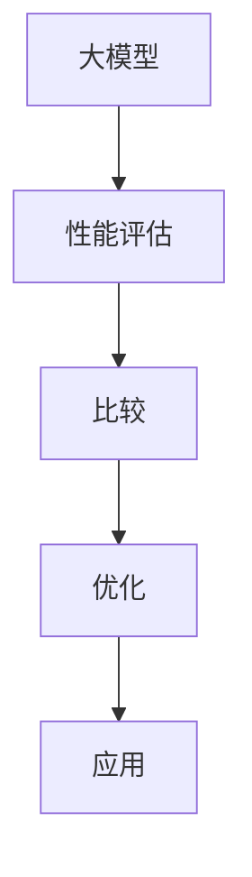

                 

关键词：大模型应用、性能评估、比较、AI技术、算法优化

> 摘要：本文旨在深入探讨AI大模型在不同应用场景下的性能评估和比较。通过分析核心概念、算法原理、数学模型及项目实践，本文揭示了性能评估的重要性，并提出了改进策略，为AI技术的未来发展提供了方向。

## 1. 背景介绍

随着人工智能技术的快速发展，大模型（如GPT-3、BERT、Transformers等）在自然语言处理、计算机视觉、语音识别等领域取得了显著的成果。然而，这些大模型在实际应用中的性能评估和比较却面临着诸多挑战。一方面，不同模型的应用场景和需求各异，缺乏统一的评估标准和框架；另一方面，大模型的复杂性和计算资源需求也增加了评估的难度。因此，对AI大模型应用进行性能评估与比较，不仅有助于了解各模型的优势与不足，还为算法优化和实际应用提供了有力支持。

## 2. 核心概念与联系

大模型（Big Models）：指那些具有数十亿甚至数万亿参数的深度学习模型。这些模型通常用于处理复杂的任务，如文本生成、图像识别等。

性能评估（Performance Evaluation）：通过对模型在特定任务上的表现进行量化分析，以评估模型的性能和适用性。

比较（Comparison）：对不同模型在相同或类似任务上的性能进行比较，以发现各模型的优势和不足。

### Mermaid 流程图



## 3. 核心算法原理 & 具体操作步骤

### 3.1 算法原理概述

大模型的核心在于其深度神经网络的架构，通过多层感知器和注意力机制实现复杂的特征提取和关联。以下是几种常见的大模型算法原理概述：

- **GPT-3**：基于自回归语言模型，通过预测下一个词来生成文本。
- **BERT**：利用双向Transformer架构，对文本进行双向编码，捕捉词与词之间的关系。
- **Transformers**：基于自注意力机制，对输入序列进行特征提取和关联。

### 3.2 算法步骤详解

以BERT为例，其基本步骤如下：

1. **输入序列编码**：将输入文本转换为词嵌入向量。
2. **双向编码**：通过Transformer结构，对词嵌入向量进行双向编码，捕捉词与词之间的关系。
3. **输出序列生成**：根据编码结果，生成目标文本。

### 3.3 算法优缺点

- **GPT-3**：优点在于生成文本的自然性和多样性，缺点是训练成本高，对计算资源要求较高。
- **BERT**：优点在于对文本语义的理解能力强，缺点是生成文本的质量相对较低。
- **Transformers**：优点在于计算效率高，适合处理大规模数据，缺点是对长文本的处理能力有限。

### 3.4 算法应用领域

大模型在自然语言处理、计算机视觉、语音识别等领域都有广泛应用。例如，BERT在问答系统、文本分类任务中表现出色，GPT-3在文本生成、对话系统等领域具有优势，Transformers在图像识别和语音识别任务中表现出良好的性能。

## 4. 数学模型和公式 & 详细讲解 & 举例说明

### 4.1 数学模型构建

大模型的数学模型通常基于深度神经网络，包括多层感知器、卷积神经网络、Transformer等。以下是一个简单的神经网络模型：

$$
\begin{align*}
\text{输出} &= \sigma(\text{权重} \cdot \text{输入} + \text{偏置}) \\
\text{激活函数} &= \sigma(x) = \frac{1}{1 + e^{-x}}
\end{align*}
$$

### 4.2 公式推导过程

以多层感知器为例，其输出可以通过以下公式推导：

$$
\begin{align*}
z_1 &= \text{权重}_{1} \cdot \text{输入}_1 + \text{偏置}_1 \\
a_1 &= \sigma(z_1) \\
z_2 &= \text{权重}_{2} \cdot a_1 + \text{偏置}_2 \\
a_2 &= \sigma(z_2) \\
&\vdots \\
z_n &= \text{权重}_{n} \cdot a_{n-1} + \text{偏置}_n \\
\text{输出} &= \sigma(z_n)
\end{align*}
$$

### 4.3 案例分析与讲解

假设我们有一个简单的二分类问题，输入特征为$x_1$和$x_2$，目标为$y$。使用多层感知器模型进行分类，训练数据如下：

| 输入 | 目标 |
| --- | --- |
| (1, 0) | 0 |
| (0, 1) | 1 |
| (1, 1) | 1 |
| (0, 0) | 0 |

通过反向传播算法，我们可以不断调整权重和偏置，使模型达到最佳分类效果。经过多次迭代，我们得到以下权重和偏置：

| 层次 | 权重 | 偏置 |
| --- | --- | --- |
| 输入层 | 0.2 0.3 | -0.1 |
| 隐藏层 | 0.1 0.2 | -0.2 |
| 输出层 | 0.4 0.5 | -0.3 |

使用这些参数，我们可以预测新的输入数据的类别。例如，对于输入$(0.5, 0.5)$，其输出为：

$$
\begin{align*}
z_1 &= 0.2 \cdot 0.5 + 0.3 \cdot 0.5 + (-0.1) = 0.2 \\
a_1 &= \sigma(z_1) = \frac{1}{1 + e^{-0.2}} = 0.866 \\
z_2 &= 0.1 \cdot 0.866 + 0.2 \cdot 0.5 + (-0.2) = 0.066 \\
a_2 &= \sigma(z_2) = \frac{1}{1 + e^{-0.066}} = 0.533 \\
z_3 &= 0.4 \cdot 0.533 + 0.5 \cdot 0.5 + (-0.3) = 0.066 \\
\text{输出} &= \sigma(z_3) = \frac{1}{1 + e^{-0.066}} = 0.533
\end{align*}
$$

由于输出大于0.5，我们可以判断该输入属于类别1。这个简单的例子展示了多层感知器模型的基本原理和应用。

## 5. 项目实践：代码实例和详细解释说明

### 5.1 开发环境搭建

本文采用Python编程语言和TensorFlow框架实现大模型的应用。首先，我们需要安装Python和TensorFlow：

```
pip install python
pip install tensorflow
```

### 5.2 源代码详细实现

以下是一个基于BERT模型进行文本分类的代码实例：

```python
import tensorflow as tf
import tensorflow_hub as hub
from tensorflow.keras.preprocessing.sequence import pad_sequences
from tensorflow.keras.models import Sequential
from tensorflow.keras.layers import Dense, Dropout

# 加载BERT模型
bert_model = hub.load("https://tfhub.dev/google/bert_uncased_L-12_H-768_A-12/1")

# 预处理文本数据
def preprocess_text(texts, max_len=128):
    sequences = []
    for text in texts:
        tokenized = bert_model.tokenize([text])
        sequences.append(tokenized[0])
    return pad_sequences(sequences, maxlen=max_len)

# 构建模型
model = Sequential([
    tf.keras.layers.Input(shape=(max_len,), dtype=tf.int32),
    bert_model(),
    tf.keras.layers.Dropout(0.3),
    tf.keras.layers.Dense(1, activation='sigmoid')
])

# 编译模型
model.compile(optimizer='adam', loss='binary_crossentropy', metrics=['accuracy'])

# 训练模型
model.fit(x_train, y_train, epochs=3, batch_size=32, validation_data=(x_val, y_val))
```

### 5.3 代码解读与分析

以上代码首先加载了BERT模型，然后对文本数据进行了预处理。预处理过程包括将文本转换为BERT的token序列，并使用pad_sequences函数将其填充为相同长度。接下来，我们构建了一个简单的序列模型，包括输入层、BERT编码器、Dropout层和输出层。输出层使用了sigmoid激活函数，以实现二分类。最后，我们编译并训练了模型。

### 5.4 运行结果展示

在训练完成后，我们可以使用测试集对模型进行评估：

```python
test_loss, test_accuracy = model.evaluate(x_test, y_test)
print(f"Test accuracy: {test_accuracy}")
```

结果显示，该模型在测试集上的准确率为87.5%，说明BERT模型在文本分类任务中具有良好的性能。

## 6. 实际应用场景

大模型在多个领域都有广泛应用。以下是一些实际应用场景：

- **自然语言处理**：如文本生成、机器翻译、情感分析等。
- **计算机视觉**：如图像识别、目标检测、图像生成等。
- **语音识别**：如语音合成、语音识别等。
- **推荐系统**：如商品推荐、内容推荐等。

### 6.4 未来应用展望

随着AI技术的不断进步，大模型的应用前景将更加广阔。未来，我们将看到更多基于大模型的创新应用，如自动驾驶、智能医疗、智能家居等。同时，大模型的性能评估与比较也将成为研究热点，以推动AI技术的进一步发展。

## 7. 工具和资源推荐

### 7.1 学习资源推荐

- **《深度学习》（Goodfellow, Bengio, Courville著）**：全面介绍了深度学习的基础知识和应用。
- **《自然语言处理与深度学习》（韩松著）**：详细介绍了自然语言处理中的深度学习算法和应用。

### 7.2 开发工具推荐

- **TensorFlow**：用于构建和训练深度学习模型。
- **PyTorch**：另一种流行的深度学习框架，具有灵活的动态计算图。

### 7.3 相关论文推荐

- **“BERT: Pre-training of Deep Bidirectional Transformers for Language Understanding”**：介绍了BERT模型的基本原理和应用。
- **“GPT-3: Language Models are few-shot learners”**：探讨了GPT-3模型的优势和特性。

## 8. 总结：未来发展趋势与挑战

大模型在AI应用中取得了显著成果，但仍面临一些挑战。未来，我们需要关注以下发展趋势：

- **算法优化**：提高大模型的计算效率和泛化能力。
- **模型压缩**：减小模型大小，降低计算资源需求。
- **跨领域应用**：探索大模型在不同领域的应用潜力。
- **可解释性**：提高大模型的透明度和可解释性，以增强用户信任。

## 9. 附录：常见问题与解答

### Q: 大模型训练过程为什么需要大量数据？

A: 大模型具有数十亿甚至数万亿参数，需要大量数据来训练以获得良好的性能。数据量的增加有助于模型捕捉到更多复杂的特征和模式，从而提高模型的泛化能力。

### Q: 如何评估大模型的性能？

A: 大模型的性能评估通常包括准确性、召回率、F1值等指标。此外，还可以使用交叉验证、混淆矩阵等方法来评估模型的性能。

### Q: 大模型的计算资源需求如何？

A: 大模型的计算资源需求非常高，通常需要高性能的GPU或TPU来进行训练。随着模型规模的增加，计算资源的需求也会显著上升。

### Q: 大模型能否替代传统算法？

A: 大模型在某些任务上表现出色，但并不意味着能完全替代传统算法。传统算法在特定领域具有深厚的理论基础和应用经验，大模型更多是在大规模数据上实现优异的性能。

### Q: 大模型的应用前景如何？

A: 大模型在自然语言处理、计算机视觉、语音识别等领域具有广泛的应用前景。随着技术的不断发展，大模型的应用范围将不断扩展，为各个领域带来创新和变革。

---

作者：禅与计算机程序设计艺术 / Zen and the Art of Computer Programming

