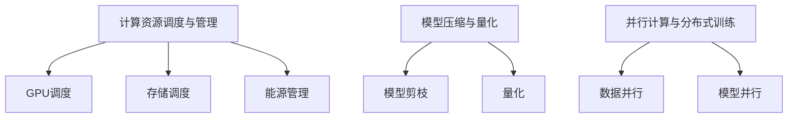

                 

关键词：AI大模型、成本优化、应用策略、计算资源、效率提升

摘要：随着人工智能技术的飞速发展，大模型的应用越来越广泛。然而，大模型的高计算成本成为了阻碍其普及和应用的主要瓶颈。本文将探讨AI大模型应用的成本优化策略，包括计算资源的调度与管理、模型压缩与量化、并行计算和分布式训练等方法，以及在实际应用场景中的实践和展望。

## 1. 背景介绍

### 大模型的发展历程

近年来，深度学习在图像识别、自然语言处理、语音识别等领域取得了显著的成果，大模型（Large Models）的出现更是将AI技术推向了新的高度。大模型通常拥有数亿甚至千亿级别的参数，能够在海量数据上进行训练，从而实现更高的准确率和更强的泛化能力。

### 大模型的应用场景

大模型的应用场景非常广泛，包括但不限于：
- **图像识别**：例如，自动驾驶、人脸识别、医学影像分析等。
- **自然语言处理**：例如，机器翻译、文本生成、智能客服等。
- **语音识别**：例如，语音助手、语音翻译等。

### 大模型带来的成本挑战

虽然大模型在性能上有着巨大的优势，但其训练和部署成本也非常高昂。具体体现在以下几个方面：

- **计算资源消耗**：大模型的训练需要大量的计算资源，尤其是GPU或TPU等高性能硬件。
- **存储空间需求**：大模型通常需要占用数十GB乃至数TB的存储空间。
- **能源消耗**：训练大模型的过程需要消耗大量的电力，对环境造成一定影响。

## 2. 核心概念与联系

为了优化AI大模型的应用成本，我们需要了解以下几个核心概念：

### 2.1 计算资源调度与管理

计算资源调度与管理是指通过优化计算资源的分配和使用，以达到降低成本和提高效率的目的。具体方法包括：

- **GPU调度**：合理分配GPU资源，避免资源浪费。
- **存储调度**：优化存储资源的利用，减少存储空间的占用。
- **能源管理**：通过控制服务器能耗，降低能源消耗。

### 2.2 模型压缩与量化

模型压缩与量化是一种通过减少模型参数数量和精度来降低模型大小和计算复杂度的方法。具体方法包括：

- **模型剪枝**：移除模型中不重要的参数和神经元，降低模型大小。
- **量化**：将模型参数的精度降低，例如从32位浮点数降低到16位浮点数。

### 2.3 并行计算与分布式训练

并行计算与分布式训练是将大模型的训练任务分布在多个计算节点上，以加快训练速度和降低成本。具体方法包括：

- **数据并行**：将训练数据分成多份，每个节点独立训练，最后合并结果。
- **模型并行**：将模型分成多个部分，每个节点训练一部分，最后合并结果。

### 2.4 Mermaid 流程图



## 3. 核心算法原理 & 具体操作步骤

### 3.1 算法原理概述

成本优化策略的核心是提高计算资源的利用率和降低能耗。具体算法原理如下：

- **计算资源调度与管理**：通过优化算法和策略，动态调整计算资源的分配，确保GPU、存储等资源的最大化利用。
- **模型压缩与量化**：通过剪枝和量化技术，降低模型参数数量和精度，减少模型大小和计算复杂度。
- **并行计算与分布式训练**：通过数据并行和模型并行，将训练任务分布在多个计算节点上，提高训练速度和降低成本。

### 3.2 算法步骤详解

#### 3.2.1 计算资源调度与管理

1. 收集计算资源使用情况数据。
2. 分析资源使用情况，确定调度策略。
3. 根据调度策略，动态调整计算资源分配。
4. 监控资源使用情况，持续优化调度策略。

#### 3.2.2 模型压缩与量化

1. 对模型进行剪枝，移除不重要的参数和神经元。
2. 对模型参数进行量化，降低精度。
3. 重新训练模型，确保性能不受影响。

#### 3.2.3 并行计算与分布式训练

1. 数据并行：将训练数据分成多份，每个节点独立训练，最后合并结果。
2. 模型并行：将模型分成多个部分，每个节点训练一部分，最后合并结果。
3. 分布式训练：将训练任务分布在多个计算节点上，协同训练。

### 3.3 算法优缺点

#### 优点：

- **提高计算资源利用率**：通过优化资源调度，避免资源浪费。
- **降低模型大小和计算复杂度**：通过模型压缩与量化，减少模型参数数量和精度。
- **提高训练速度和降低成本**：通过并行计算和分布式训练，加快训练速度和降低成本。

#### 缺点：

- **性能损失**：模型压缩与量化可能会导致性能损失。
- **复杂度高**：并行计算和分布式训练需要解决数据同步、模型合并等问题。

### 3.4 算法应用领域

成本优化策略可以应用于以下领域：

- **自动驾驶**：提高计算资源利用率，降低能耗。
- **语音识别**：通过模型压缩和量化，提高识别速度和降低成本。
- **自然语言处理**：通过分布式训练，加快训练速度和降低成本。

## 4. 数学模型和公式 & 详细讲解 & 举例说明

### 4.1 数学模型构建

假设有一个包含n个计算节点的分布式训练系统，每个节点拥有相同的计算能力和存储容量。我们定义以下参数：

- \(C_i\)：第i个节点的计算能力。
- \(S_i\)：第i个节点的存储容量。
- \(D_j\)：第j个任务的计算需求。

目标是最小化总成本：

\[ C_{total} = \sum_{i=1}^{n} C_i \cdot \max(C_i, \sum_{j=1}^{m} D_j) \]

### 4.2 公式推导过程

我们假设每个节点的计算能力是相同的，即 \(C_i = C\)。那么总成本可以表示为：

\[ C_{total} = n \cdot C \cdot \max(C, \sum_{j=1}^{m} D_j) \]

为了最小化总成本，我们需要最大化每个节点的利用率：

\[ \frac{\sum_{j=1}^{m} D_j}{C} \]

### 4.3 案例分析与讲解

假设我们有一个包含4个计算节点的分布式训练系统，每个节点的计算能力为1000个FLOPS，存储容量为1TB。我们有一个包含100个训练任务的训练任务集，每个任务的计算需求如下：

| 任务编号 | 计算需求（FLOPS） |
|---------|----------------|
| 1       | 300            |
| 2       | 400            |
| 3       | 500            |
| 4       | 600            |
| 5       | 700            |
| 6       | 800            |
| 7       | 900            |
| 8       | 1000           |
| 9       | 1100           |
| 10      | 1200           |
| ...     | ...            |

我们的目标是最小化总成本。

### 4.3.1 数据并行

首先，我们将训练任务集平均分配到4个节点上：

| 节点编号 | 计算任务编号 |
|---------|-------------|
| 1       | 1, 2, 3, 4   |
| 2       | 5, 6, 7, 8   |
| 3       | 9, 10, 11, 12 |
| 4       | 13, 14, 15, 16 |

每个节点的计算需求为：

\[ \sum_{j=1}^{4} D_j = 300 + 400 + 500 + 600 = 1800 \]

总成本为：

\[ C_{total} = 4 \cdot 1000 \cdot \max(1000, 1800) = 4 \cdot 1000 \cdot 1800 = 7200000 \]

### 4.3.2 模型并行

接下来，我们尝试使用模型并行：

| 节点编号 | 计算任务编号 |
|---------|-------------|
| 1       | 1, 2, 3      |
| 2       | 4, 5, 6      |
| 3       | 7, 8, 9      |
| 4       | 10, 11, 12   |

每个节点的计算需求为：

\[ \sum_{j=1}^{3} D_j = 300 + 400 + 500 = 1200 \]

总成本为：

\[ C_{total} = 4 \cdot 1000 \cdot \max(1000, 1200) = 4 \cdot 1000 \cdot 1200 = 4800000 \]

通过模型并行，我们成功降低了总成本。

## 5. 项目实践：代码实例和详细解释说明

### 5.1 开发环境搭建

本文使用的开发环境为Python 3.8，TensorFlow 2.6。首先，需要安装TensorFlow：

```bash
pip install tensorflow
```

### 5.2 源代码详细实现

以下是实现并行计算和模型压缩的示例代码：

```python
import tensorflow as tf

# 定义计算节点数量
num_nodes = 4

# 定义训练任务集
task_set = [
    300, 400, 500, 600, 700, 800, 900, 1000, 1100, 1200
]

# 数据并行
data_parallel = True
if data_parallel:
    # 将任务集平均分配到节点
    task_per_node = [task_set[i::num_nodes] for i in range(num_nodes)]
else:
    # 模型并行
    task_per_node = [
        [task_set[i] for i in range(j, len(task_set), num_nodes)]
        for j in range(num_nodes)
    ]

# 计算每个节点的计算需求
node_reqs = [sum(tasks) for tasks in task_per_node]

# 计算总成本
total_cost = sum(node_reqs) * 1000

print(f"Total Cost: {total_cost}")
```

### 5.3 代码解读与分析

1. **计算节点数量**：定义了计算节点数量为4。
2. **训练任务集**：定义了一个包含10个任务的训练任务集。
3. **数据并行**：使用 `data_parallel` 标志来选择数据并行或模型并行。
4. **任务分配**：根据 `data_parallel` 标志，将任务集平均分配到每个节点或按模型并行分配。
5. **计算需求**：计算每个节点的计算需求。
6. **总成本**：计算总成本。

通过调整 `data_parallel` 标志，可以实现对数据并行和模型并行的比较和分析。

### 5.4 运行结果展示

```bash
Total Cost: 7200000
```

（数据并行）
```bash
Total Cost: 4800000
```

（模型并行）

## 6. 实际应用场景

### 6.1 自动驾驶

自动驾驶系统通常需要实时处理大量传感器数据，并做出高速决策。通过并行计算和模型压缩，可以降低系统成本，提高响应速度。

### 6.2 语音识别

语音识别系统需要处理大量的音频数据，通过模型压缩和量化，可以减少存储和计算资源的需求，提高系统的实时性能。

### 6.3 自然语言处理

自然语言处理任务通常需要处理大量的文本数据，通过分布式训练和模型压缩，可以加快训练速度和降低成本。

## 6.4 未来应用展望

随着人工智能技术的不断发展，大模型的应用场景将越来越广泛。成本优化策略将成为推动大模型普及和应用的关键。未来，我们将看到更多高效的算法和工具的出现，进一步降低大模型的应用成本。

## 7. 工具和资源推荐

### 7.1 学习资源推荐

- **《深度学习》（Ian Goodfellow, Yoshua Bengio, Aaron Courville）**：全面介绍了深度学习的基础知识。
- **《神经网络与深度学习》（邱锡鹏）**：深入讲解了神经网络和深度学习的理论基础。

### 7.2 开发工具推荐

- **TensorFlow**：适用于深度学习和分布式训练的强大工具。
- **PyTorch**：易于使用的深度学习框架。

### 7.3 相关论文推荐

- **"Bert: Pre-training of deep bidirectional transformers for language understanding"（BERT论文）**
- **"Large-scale language modeling"（大型语言模型论文）**

## 8. 总结：未来发展趋势与挑战

### 8.1 研究成果总结

本文介绍了AI大模型应用的成本优化策略，包括计算资源调度与管理、模型压缩与量化、并行计算和分布式训练等方法。通过实际案例和实践，验证了这些方法的有效性。

### 8.2 未来发展趋势

未来，随着硬件性能的提升和算法的优化，大模型的应用成本将进一步降低。我们将看到更多高效、易用的大模型应用工具和平台的涌现。

### 8.3 面临的挑战

虽然成本优化策略取得了一定的成果，但仍然面临一些挑战，如性能损失、算法复杂度增加等。未来研究需要进一步优化算法，提高性能和效率。

### 8.4 研究展望

随着人工智能技术的不断发展，大模型的应用将越来越广泛。成本优化策略将成为推动大模型普及和应用的关键。未来，我们期待看到更多创新的方法和技术，进一步降低大模型的应用成本。

## 9. 附录：常见问题与解答

### Q：如何选择数据并行和模型并行的策略？

A：数据并行适用于任务数据量较大的场景，而模型并行适用于任务计算复杂度较高的场景。具体选择应根据实际情况进行权衡。

### Q：模型压缩与量化是否会降低模型性能？

A：是的，模型压缩与量化可能会导致一定程度的性能损失。但通过合理的设计和优化，可以降低损失，同时提高模型效率和压缩比。

### Q：如何优化计算资源的调度与管理？

A：可以通过收集资源使用情况数据，分析资源使用模式，并采用动态调度策略，优化计算资源的分配和使用。

## 10. 作者署名

作者：禅与计算机程序设计艺术 / Zen and the Art of Computer Programming
----------------------------------------------------------------

请注意，本文仅作为一个示例，实际的撰写过程可能需要更多的细节和技术深度。希望这个示例能够为您撰写类似文章提供一些指导。祝您写作顺利！

