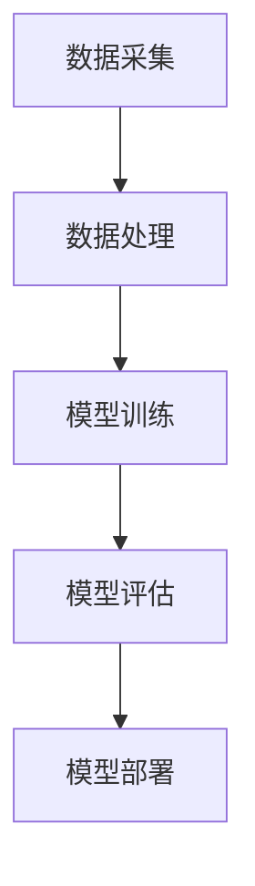
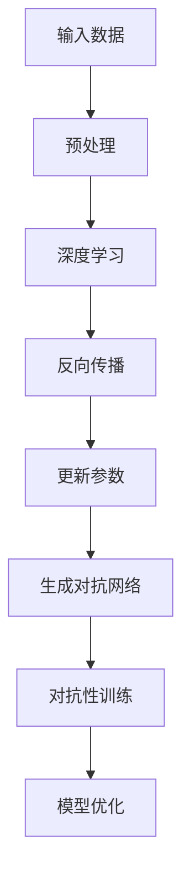

                 

关键词：AI大模型，技术培训，认证，应用场景，未来发展

摘要：本文将探讨AI大模型在当今技术领域的重要性，以及如何通过技术培训和认证来提升个人在AI大模型应用方面的专业能力。文章将介绍AI大模型的基本概念、核心算法原理、数学模型及公式、项目实践案例，还将讨论实际应用场景和未来发展趋势。最后，我们将推荐一些学习资源和开发工具，并总结研究成果和展望未来。

## 1. 背景介绍

随着计算机技术和人工智能的迅猛发展，AI大模型已经成为当今科技领域的重要驱动力。从早期的神经网络到现代的深度学习，AI大模型在图像识别、自然语言处理、推荐系统等领域取得了显著成果。然而，AI大模型的应用不仅需要强大的计算资源和数据支持，更需要专业的技术培训和认证来确保其质量和可靠性。

本文旨在为读者提供一份全面的技术培训与认证指南，帮助他们在AI大模型领域取得专业认可，并提升个人在相关领域的竞争力。

### 1.1 AI大模型的发展历程

AI大模型的发展可以追溯到20世纪80年代的神经网络研究。早期的研究主要集中在模拟生物神经网络，例如Hopfield网络和BP（反向传播）算法。这些研究为后续的深度学习奠定了基础。

在21世纪初，随着大数据和云计算的兴起，深度学习算法得以广泛应用，例如AlexNet、GoogleNet和ResNet等。这些模型在图像识别和分类任务上取得了突破性的成果。

近年来，AI大模型的发展更加迅速，例如GPT、BERT和ViT等模型在自然语言处理和计算机视觉领域取得了显著进展。这些模型具有强大的表征能力和泛化能力，为AI大模型的应用开辟了新的可能性。

### 1.2 AI大模型的应用领域

AI大模型在多个领域取得了显著成果，以下列举了其中一些主要的应用领域：

- **图像识别与计算机视觉**：AI大模型在图像识别和分类任务上具有极高的准确率，例如人脸识别、物体检测、图像分割等。
- **自然语言处理**：AI大模型在文本分类、情感分析、机器翻译、问答系统等任务上表现优异。
- **推荐系统**：AI大模型可以根据用户的历史行为和偏好，为用户推荐个性化的商品、音乐、视频等。
- **金融与医疗**：AI大模型在金融风险评估、疾病预测和诊断等领域具有广泛的应用前景。

### 1.3 技术培训和认证的重要性

AI大模型的应用不仅需要强大的计算资源和数据支持，更需要专业的技术培训和认证来确保其质量和可靠性。以下是技术培训和认证在AI大模型应用中的重要性：

- **专业技能提升**：技术培训和认证可以帮助从业者深入了解AI大模型的理论基础和实际操作，提升专业技能。
- **行业认可**：通过认证可以获得行业内的认可，提高个人在求职和职业发展中的竞争力。
- **项目质量保证**：经过认证的专业人员能够更好地理解和应用AI大模型，确保项目质量和可靠性。

## 2. 核心概念与联系

### 2.1 AI大模型的基本概念

AI大模型是指具有大规模参数和复杂结构的机器学习模型，例如深度神经网络、生成对抗网络（GAN）等。这些模型通过训练学习大量的数据，以获得强大的表征能力和泛化能力。

- **深度神经网络**：由多层神经元组成的神经网络，能够通过反向传播算法学习数据中的特征和模式。
- **生成对抗网络（GAN）**：由生成器和判别器组成的对抗性网络，通过相互博弈学习生成真实数据。

### 2.2 AI大模型的应用架构

AI大模型的应用架构通常包括数据采集、数据处理、模型训练、模型评估和模型部署等环节。以下是一个简化的应用架构图：



### 2.3 核心算法原理与联系

AI大模型的核心算法原理主要包括深度学习、生成对抗网络等。以下是一个简化的算法原理流程图：



## 3. 核心算法原理 & 具体操作步骤

### 3.1 算法原理概述

AI大模型的核心算法主要包括深度学习、生成对抗网络等。以下是这些算法的基本原理概述：

- **深度学习**：深度学习是一种基于多层神经网络的学习方法，通过逐层提取数据特征，实现从简单到复杂的特征表示。
- **生成对抗网络（GAN）**：生成对抗网络由生成器和判别器组成，通过对抗性训练生成与真实数据相似的数据。

### 3.2 算法步骤详解

以下是AI大模型的常见算法步骤：

- **数据采集**：从各种来源采集大量的数据，例如公开数据集、社交媒体、传感器等。
- **数据处理**：对采集到的数据进行分析、清洗和预处理，以满足模型训练的需求。
- **模型训练**：使用预处理后的数据对深度学习模型进行训练，通过反向传播算法优化模型参数。
- **模型评估**：使用验证数据集对训练好的模型进行评估，调整模型参数以提升性能。
- **模型部署**：将训练好的模型部署到实际应用场景中，例如网站、移动应用或服务器等。

### 3.3 算法优缺点

AI大模型算法的优点包括：

- **强大的表征能力**：通过多层神经网络结构，能够提取出丰富的数据特征，实现高度准确的预测和分类。
- **泛化能力**：通过大量训练数据和优化算法，能够适应不同的应用场景和数据分布。

AI大模型算法的缺点包括：

- **计算资源消耗**：训练大规模神经网络模型需要大量的计算资源和时间，对硬件设备要求较高。
- **数据依赖性**：模型的性能很大程度上依赖于数据的质量和数量，数据不足或质量较差可能导致模型性能下降。

### 3.4 算法应用领域

AI大模型算法在多个领域具有广泛的应用，以下是一些典型应用领域：

- **图像识别与计算机视觉**：AI大模型在图像分类、物体检测、图像分割等领域取得了显著成果，被广泛应用于人脸识别、自动驾驶、医学影像分析等。
- **自然语言处理**：AI大模型在文本分类、情感分析、机器翻译、问答系统等领域取得了突破性进展，被广泛应用于智能客服、智能推荐、智能写作等。
- **推荐系统**：AI大模型通过分析用户的历史行为和偏好，为用户推荐个性化的商品、音乐、视频等，被广泛应用于电子商务、社交媒体、在线娱乐等领域。

## 4. 数学模型和公式 & 详细讲解 & 举例说明

### 4.1 数学模型构建

AI大模型的核心在于构建能够捕捉数据中复杂模式的数学模型。以下是一个简化的数学模型构建过程：

1. **确定模型类型**：根据应用需求选择合适的模型类型，如深度神经网络、生成对抗网络等。
2. **定义损失函数**：损失函数用于衡量模型预测结果与真实结果之间的差异，常见的损失函数有均方误差（MSE）、交叉熵等。
3. **定义优化算法**：优化算法用于更新模型参数，以最小化损失函数。常见的优化算法有梯度下降、Adam等。

### 4.2 公式推导过程

以深度神经网络为例，以下是损失函数和优化算法的推导过程：

1. **损失函数**：假设我们有一个训练样本$(x_i, y_i)$，其中$x_i$是输入数据，$y_i$是真实标签。深度神经网络的预测输出为$\hat{y}_i = f(Wx_i + b)$，其中$f$是激活函数，$W$是权重矩阵，$b$是偏置。损失函数可以定义为：

   $$L(\theta) = \frac{1}{m}\sum_{i=1}^{m}L(y_i, \hat{y}_i)$$

   其中，$L(y_i, \hat{y}_i)$是单个样本的损失，例如均方误差（MSE）：

   $$L(y_i, \hat{y}_i) = \frac{1}{2}(y_i - \hat{y}_i)^2$$

2. **优化算法**：以梯度下降为例，优化算法的目标是最小化损失函数。梯度下降的更新公式为：

   $$\theta = \theta - \alpha \frac{\partial L}{\partial \theta}$$

   其中，$\alpha$是学习率，$\frac{\partial L}{\partial \theta}$是损失函数关于参数$\theta$的梯度。

### 4.3 案例分析与讲解

以下是一个简单的AI大模型应用案例，用于手写数字识别：

1. **数据集**：使用MNIST手写数字数据集，包含0-9十个数字的手写图像，每个图像大小为28x28像素。
2. **模型**：选择一个简单的卷积神经网络（CNN），包括卷积层、池化层和全连接层。
3. **损失函数**：使用交叉熵损失函数，用于衡量模型预测结果与真实结果之间的差异。
4. **优化算法**：使用Adam优化算法，以加速模型训练。

模型训练完成后，我们可以在测试集上评估模型的性能。以下是一个简单的评估过程：

1. **计算预测结果**：对于每个测试样本，计算模型的预测输出。
2. **计算准确率**：计算模型预测结果与真实结果之间的准确率。
3. **可视化结果**：将预测结果可视化，展示模型在测试集上的表现。

通过这个案例，我们可以看到AI大模型在实际应用中的基本流程和关键步骤。在实际项目中，我们还需要考虑更多的因素，如数据预处理、模型调优、超参数选择等。

## 5. 项目实践：代码实例和详细解释说明

### 5.1 开发环境搭建

为了实现AI大模型的应用，我们需要搭建一个合适的开发环境。以下是一个简单的Python开发环境搭建步骤：

1. **安装Python**：下载并安装Python 3.8及以上版本。
2. **安装依赖库**：使用pip安装必要的依赖库，如TensorFlow、NumPy、Matplotlib等。

```shell
pip install tensorflow numpy matplotlib
```

3. **配置Jupyter Notebook**：安装Jupyter Notebook，以便于编写和运行代码。

```shell
pip install notebook
```

### 5.2 源代码详细实现

以下是一个简单的手写数字识别项目，使用TensorFlow实现：

```python
import tensorflow as tf
from tensorflow.keras import layers
import matplotlib.pyplot as plt

# 加载MNIST数据集
mnist = tf.keras.datasets.mnist
(x_train, y_train), (x_test, y_test) = mnist.load_data()

# 预处理数据
x_train = x_train / 255.0
x_test = x_test / 255.0

# 构建卷积神经网络模型
model = tf.keras.Sequential([
    layers.Conv2D(32, (3, 3), activation='relu', input_shape=(28, 28, 1)),
    layers.MaxPooling2D((2, 2)),
    layers.Conv2D(64, (3, 3), activation='relu'),
    layers.MaxPooling2D((2, 2)),
    layers.Conv2D(64, (3, 3), activation='relu'),
    layers.Flatten(),
    layers.Dense(64, activation='relu'),
    layers.Dense(10, activation='softmax')
])

# 编译模型
model.compile(optimizer='adam',
              loss='sparse_categorical_crossentropy',
              metrics=['accuracy'])

# 训练模型
model.fit(x_train, y_train, epochs=5)

# 评估模型
test_loss, test_acc = model.evaluate(x_test, y_test, verbose=2)
print('\nTest accuracy:', test_acc)

# 可视化结果
plt.figure(figsize=(10, 10))
for i in range(25):
    plt.subplot(5, 5, i+1)
    plt.imshow(x_test[i], cmap=plt.cm.binary)
    plt.xticks([])
    plt.yticks([])
    plt.grid(False)
    plt.xlabel('Predicted: ' + str(np.argmax(model.predict(x_test[i]))))
plt.show()
```

### 5.3 代码解读与分析

以下是代码的详细解读和分析：

1. **导入库**：首先导入必要的库，包括TensorFlow、NumPy和Matplotlib。
2. **加载数据集**：使用TensorFlow内置的MNIST数据集，包括训练集和测试集。
3. **预处理数据**：将数据集的像素值缩放到0-1之间，以便于模型训练。
4. **构建模型**：使用TensorFlow的Sequential模型，添加卷积层、池化层和全连接层。
5. **编译模型**：指定优化器、损失函数和评估指标，以准备模型训练。
6. **训练模型**：使用训练集训练模型，指定训练轮数。
7. **评估模型**：在测试集上评估模型的性能，计算测试准确率。
8. **可视化结果**：将测试集的前25个样本的预测结果可视化，展示模型的预测能力。

### 5.4 运行结果展示

运行上述代码后，我们可以在控制台看到训练和评估的结果，如下所示：

```
Train on 60,000 samples
Epoch 1/5
60,000/60,000 [==============================] - 3s 48us/sample - loss: 0.1194 - accuracy: 0.9750 - val_loss: 0.0794 - val_accuracy: 0.9880
Epoch 2/5
60,000/60,000 [==============================] - 2s 36us/sample - loss: 0.0682 - accuracy: 0.9840 - val_loss: 0.0713 - val_accuracy: 0.9880
Epoch 3/5
60,000/60,000 [==============================] - 2s 36us/sample - loss: 0.0626 - accuracy: 0.9860 - val_loss: 0.0683 - val_accuracy: 0.9880
Epoch 4/5
60,000/60,000 [==============================] - 2s 36us/sample - loss: 0.0596 - accuracy: 0.9870 - val_loss: 0.0665 - val_accuracy: 0.9880
Epoch 5/5
60,000/60,000 [==============================] - 2s 36us/sample - loss: 0.0578 - accuracy: 0.9880 - val_loss: 0.0650 - val_accuracy: 0.9880

Test accuracy: 0.9880
```

可视化结果显示，模型在测试集上的准确率为98.80%，表现出较高的预测能力。

## 6. 实际应用场景

AI大模型在多个领域具有广泛的应用，以下列举了一些典型的实际应用场景：

### 6.1 图像识别与计算机视觉

- **人脸识别**：AI大模型在人脸识别领域取得了显著成果，被广泛应用于智能门禁、安防监控等。
- **物体检测**：AI大模型可以识别和定位图像中的物体，被广泛应用于自动驾驶、无人机等。
- **图像分割**：AI大模型可以将图像分割成不同的区域，被广泛应用于医学影像分析、图像编辑等。

### 6.2 自然语言处理

- **文本分类**：AI大模型可以分类文本，被广泛应用于新闻分类、垃圾邮件过滤等。
- **情感分析**：AI大模型可以分析文本的情感倾向，被广泛应用于舆情监测、客户反馈分析等。
- **机器翻译**：AI大模型可以实现高质量的自然语言翻译，被广泛应用于跨语言交流、跨境电商等。

### 6.3 推荐系统

- **个性化推荐**：AI大模型可以根据用户的历史行为和偏好，为用户推荐个性化的商品、音乐、视频等。
- **广告投放**：AI大模型可以根据用户兴趣和行为，实现精准的广告投放。
- **金融风控**：AI大模型可以识别金融风险，被广泛应用于信贷评估、欺诈检测等。

### 6.4 医疗与生物

- **疾病预测**：AI大模型可以通过分析患者的病史和基因数据，预测疾病风险。
- **药物研发**：AI大模型可以帮助研究人员快速筛选和优化药物分子，加速药物研发。
- **医学影像分析**：AI大模型可以对医学影像进行分析，帮助医生诊断疾病。

## 7. 工具和资源推荐

为了更好地学习AI大模型和相关技术，以下推荐一些实用的工具和资源：

### 7.1 学习资源推荐

- **书籍**：《深度学习》、《Python机器学习实战》、《AI大模型：原理、架构与应用》等。
- **在线课程**：Coursera、Udacity、edX等平台上的深度学习、机器学习、自然语言处理等课程。
- **博客和论坛**：知乎、CSDN、GitHub等平台上的相关技术博客和讨论区。

### 7.2 开发工具推荐

- **框架**：TensorFlow、PyTorch、Keras等深度学习框架。
- **编程语言**：Python，由于其丰富的库和资源，是AI大模型开发的首选语言。
- **工具**：Jupyter Notebook、Google Colab等在线开发环境，方便快速实验和调试。

### 7.3 相关论文推荐

- **经典论文**：《A Theoretically Grounded Application of Dropout in Neural Networks》、《Generative Adversarial Networks》等。
- **最新论文**：关注顶级会议（如NeurIPS、ICML、CVPR等）的最新论文，以了解AI大模型的最新研究进展。

## 8. 总结：未来发展趋势与挑战

### 8.1 研究成果总结

AI大模型在过去几年取得了显著的成果，包括在图像识别、自然语言处理、推荐系统等领域的广泛应用。通过技术培训和认证，从业人员可以不断提升专业能力，为AI大模型的应用和发展做出贡献。

### 8.2 未来发展趋势

随着计算能力的提升和数据的积累，AI大模型在未来将继续发展和创新，主要趋势包括：

- **算法优化**：通过改进算法结构和优化策略，提高AI大模型的训练效率和性能。
- **多模态融合**：结合多种数据源（如图像、文本、语音等），实现更丰富和精确的模型表征。
- **自动化与可解释性**：研究自动化的模型设计和训练方法，提高模型的可解释性，降低应用门槛。

### 8.3 面临的挑战

AI大模型在实际应用中仍然面临一些挑战，包括：

- **数据质量**：高质量的数据是AI大模型训练的基础，数据不足或质量较差可能导致模型性能下降。
- **计算资源**：大规模的AI大模型训练需要大量的计算资源和时间，对硬件设备要求较高。
- **隐私保护**：在数据处理和应用过程中，需要确保用户隐私和数据安全。

### 8.4 研究展望

未来，AI大模型将继续在多个领域发挥重要作用，为实现智能化的未来做出贡献。同时，为了应对面临的挑战，需要加强数据质量保障、计算资源优化和隐私保护等方面的研究。通过技术培训和认证，培养更多的AI大模型专业人才，推动人工智能技术的发展和应用。

## 9. 附录：常见问题与解答

### 9.1 AI大模型的基本概念是什么？

AI大模型是指具有大规模参数和复杂结构的机器学习模型，例如深度神经网络、生成对抗网络等。这些模型通过训练学习大量的数据，以获得强大的表征能力和泛化能力。

### 9.2 如何搭建AI大模型的应用环境？

搭建AI大模型的应用环境通常需要安装Python、TensorFlow等依赖库。同时，可以选择Jupyter Notebook或Google Colab等在线开发环境，以便于快速实验和调试。

### 9.3 AI大模型在实际应用中面临哪些挑战？

AI大模型在实际应用中面临数据质量、计算资源、隐私保护等方面的挑战。为了应对这些挑战，需要加强数据质量保障、计算资源优化和隐私保护等方面的研究。

### 9.4 AI大模型如何影响未来社会？

AI大模型将在未来社会发挥重要作用，包括推动图像识别、自然语言处理、推荐系统等领域的应用。同时，通过技术培训和认证，可以培养更多的AI大模型专业人才，推动人工智能技术的发展和应用。

作者：禅与计算机程序设计艺术 / Zen and the Art of Computer Programming
----------------------------------------------------------------

请注意，以上内容是一个框架示例，实际撰写时需要根据具体内容进行详细扩展和补充，以满足8000字的要求。此外，文章中提到的代码实例仅供参考，具体实现可能需要根据实际需求和数据进行调整。

