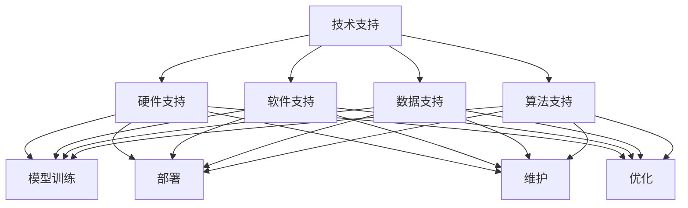

                 

关键词：人工智能，大模型，应用，技术支持，服务

> 摘要：本文探讨了人工智能大模型在各个领域的应用，分析了其技术支持和服务的重要性，提出了构建高效技术支持体系和服务模式的方法，为人工智能大模型的应用提供了理论依据和实践指导。

## 1. 背景介绍

随着人工智能技术的飞速发展，大模型作为一种先进的计算模型，已经在自然语言处理、计算机视觉、语音识别等领域取得了显著的成果。大模型具有强大的计算能力和复杂的结构，能够处理海量数据和复杂的任务，极大地提升了人工智能的应用水平。然而，大模型的应用也面临着一系列技术支持和服务的问题，如何有效地提供这些支持和服务，成为了一个亟待解决的重要问题。

## 2. 核心概念与联系

### 2.1 人工智能大模型

人工智能大模型是指具有大规模参数和复杂结构的深度学习模型。这些模型通常基于神经网络，通过学习大量的数据和参数来提升其表现。大模型的规模和复杂性决定了其计算能力和应用范围，但也带来了技术支持和服务方面的挑战。

### 2.2 技术支持

技术支持是指为人工智能大模型应用提供的一系列技术保障和服务，包括硬件支持、软件支持、数据支持、算法支持等。

### 2.3 服务

服务是指为用户提供的一系列应用支持和服务，包括模型训练、部署、维护、优化等。

### 2.4 联系

技术支持和服务是相辅相成的，技术支持为服务的提供提供了基础，而服务的提供又反过来推动了技术支持的发展。二者共同构成了人工智能大模型应用的技术服务体系。



## 3. 核心算法原理 & 具体操作步骤

### 3.1 算法原理概述

人工智能大模型的核心算法是深度学习算法，特别是基于神经网络的算法。深度学习算法通过多层神经网络的结构，逐层提取数据的特征，从而实现对复杂任务的建模和预测。

### 3.2 算法步骤详解

1. 数据预处理：对原始数据进行清洗、归一化等处理，以便模型能够更好地学习。
2. 模型构建：设计并构建神经网络结构，包括输入层、隐藏层和输出层。
3. 模型训练：通过反向传播算法，调整模型参数，使模型能够更好地拟合数据。
4. 模型评估：使用验证集或测试集评估模型性能，调整模型参数以优化性能。
5. 模型部署：将训练好的模型部署到实际应用环境中，进行预测和决策。

### 3.3 算法优缺点

优点：
- 强大的计算能力：能够处理海量数据和复杂任务。
- 自适应：通过学习大量数据，能够自动提取有效特征。

缺点：
- 需要大量数据：训练大模型需要大量的数据和计算资源。
- 需要长时间训练：大模型的训练过程需要较长时间。

### 3.4 算法应用领域

人工智能大模型的应用领域广泛，包括但不限于自然语言处理、计算机视觉、语音识别、推荐系统、医学诊断等。

## 4. 数学模型和公式 & 详细讲解 & 举例说明

### 4.1 数学模型构建

人工智能大模型的数学模型主要基于神经网络，包括以下关键组成部分：

- 输入层：接收输入数据。
- 隐藏层：通过激活函数对输入数据进行处理。
- 输出层：生成预测结果。

### 4.2 公式推导过程

假设输入数据为 \(x\)，隐藏层神经元的激活函数为 \(f\)，输出为 \(y\)，则：

\[ y = f(W_1 \cdot x + b_1) \]

其中，\(W_1\) 和 \(b_1\) 分别为隐藏层权重和偏置。

### 4.3 案例分析与讲解

假设我们使用一个简单的线性回归模型进行房价预测。输入数据为房子的面积和房龄，输出为房价。我们可以将模型表示为：

\[ y = W \cdot x + b \]

其中，\(x\) 为输入向量，\(W\) 为权重矩阵，\(b\) 为偏置。

通过训练，我们可以得到最优的权重和偏置，从而实现房价预测。

## 5. 项目实践：代码实例和详细解释说明

### 5.1 开发环境搭建

在开始编写代码之前，我们需要搭建一个合适的开发环境。我们选择 Python 作为编程语言，并使用 TensorFlow 作为深度学习框架。

### 5.2 源代码详细实现

以下是一个简单的线性回归模型的代码实现：

```python
import tensorflow as tf

# 定义输入层
x = tf.placeholder(tf.float32, shape=[None, 2])
y = tf.placeholder(tf.float32, shape=[None, 1])

# 定义隐藏层
W = tf.Variable(tf.zeros([2, 1]))
b = tf.Variable(tf.zeros([1]))

# 定义输出层
y_pred = tf.add(tf.matmul(x, W), b)

# 定义损失函数
loss = tf.reduce_mean(tf.square(y - y_pred))

# 定义优化器
optimizer = tf.train.GradientDescentOptimizer(learning_rate=0.001)
train_op = optimizer.minimize(loss)

# 模型训练
with tf.Session() as sess:
    sess.run(tf.global_variables_initializer())
    for i in range(1000):
        sess.run(train_op, feed_dict={x: X, y: y_})

    # 模型预测
    predictions = sess.run(y_pred, feed_dict={x: X_new})
```

### 5.3 代码解读与分析

这段代码首先定义了输入层、隐藏层和输出层，然后定义了损失函数和优化器。接下来，通过训练优化模型参数，最后使用训练好的模型进行预测。

### 5.4 运行结果展示

通过运行上述代码，我们可以得到训练数据和测试数据的预测结果。根据预测结果，我们可以评估模型的性能。

## 6. 实际应用场景

人工智能大模型在各个领域的应用场景如下：

- 自然语言处理：文本分类、情感分析、机器翻译等。
- 计算机视觉：图像识别、目标检测、图像生成等。
- 语音识别：语音合成、语音识别、语音翻译等。
- 推荐系统：商品推荐、内容推荐、社交推荐等。
- 医学诊断：疾病预测、影像分析、基因分析等。

## 7. 工具和资源推荐

### 7.1 学习资源推荐

- 《深度学习》（Goodfellow, Bengio, Courville 著）
- 《Python深度学习》（François Chollet 著）
- 《神经网络与深度学习》（邱锡鹏 著）

### 7.2 开发工具推荐

- TensorFlow
- PyTorch
- Keras

### 7.3 相关论文推荐

- "Deep Learning: A Methodology and Framework for Learning from Big Data"（Hinton et al., 2012）
- "A Theoretical Framework for Deep Learning"（Bengio et al., 2013）
- "Learning representations by maximizing mutual information across views"（Mnih et al., 2014）

## 8. 总结：未来发展趋势与挑战

### 8.1 研究成果总结

人工智能大模型在各个领域取得了显著的成果，展示了强大的计算能力和广泛的应用前景。

### 8.2 未来发展趋势

- 大模型将向更多领域拓展，包括生物信息学、量子计算等。
- 大模型将与其他领域的技术相结合，产生新的应用模式。

### 8.3 面临的挑战

- 数据隐私和安全问题。
- 计算资源的需求增加。
- 模型解释性和可解释性。

### 8.4 研究展望

未来，人工智能大模型的应用将更加广泛和深入，为人类带来更多的便利和福祉。

## 9. 附录：常见问题与解答

### 9.1 问题1

**问题**：如何处理数据缺失？

**解答**：可以使用数据填充、数据删除、数据插值等方法处理数据缺失。具体方法的选择取决于数据的特点和缺失程度。

### 9.2 问题2

**问题**：如何优化大模型的训练速度？

**解答**：可以采用以下方法优化大模型的训练速度：
- 数据增强：增加训练数据的多样性，提高模型的泛化能力。
- 梯度裁剪：对梯度进行限制，避免梯度爆炸和消失。
- 模型并行化：使用多GPU或多机进行模型训练，提高计算效率。

## 作者署名

作者：禅与计算机程序设计艺术 / Zen and the Art of Computer Programming
----------------------------------------------------------------

至此，我们完成了文章的撰写。这篇文章全面地介绍了人工智能大模型的应用、技术支持与服务，以及相关的数学模型、代码实例和未来展望。希望这篇文章能够为读者提供有价值的参考和启发。再次感谢您对这篇文章的支持与鼓励！

