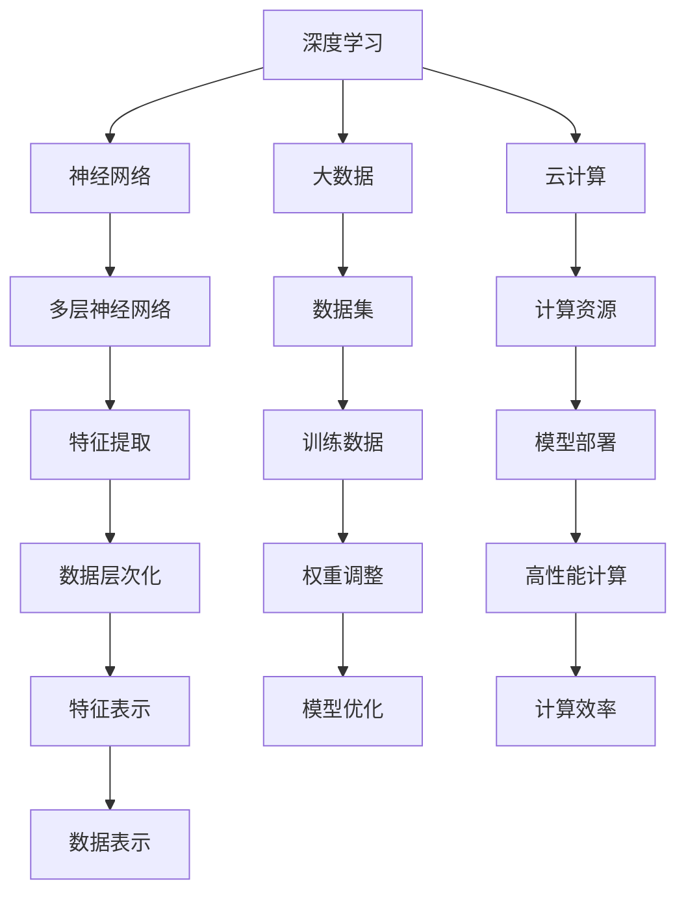
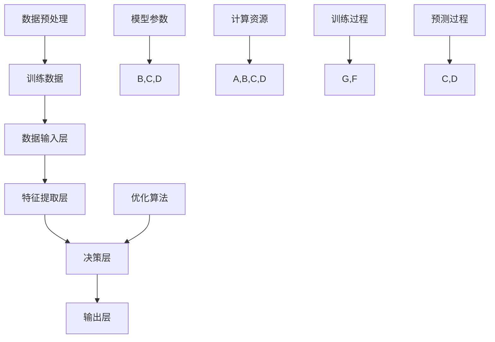

                 

AI大模型，作为当前最前沿的人工智能技术，已经在众多领域中展现出了其巨大的潜力和应用价值。从自然语言处理、计算机视觉到推荐系统，AI大模型的应用无处不在，并且正在不断推动行业的发展和创新。然而，随着AI大模型的应用逐渐深入，如何为其提供有效的技术支持和服务，成为了一个亟待解决的问题。

本文旨在探讨AI大模型应用的技术支持与服务，首先对AI大模型的背景和应用进行简要介绍，然后深入分析其核心概念和架构，详细讲解核心算法原理与具体操作步骤，并借助数学模型和公式进行详细解读。此外，还将通过实际项目实践展示代码实例，并对AI大模型在实际应用场景中的表现进行分析。最后，我们将展望AI大模型的未来发展趋势和面临的挑战，并提供相关工具和资源的推荐。

通过本文的阅读，您将不仅能够对AI大模型有更深入的了解，还能掌握其应用的技术支持与服务，为未来在相关领域的探索和实践打下坚实的基础。

## 1. 背景介绍

人工智能（AI）作为计算机科学的重要分支，随着计算能力的不断提升和大数据的积累，逐渐从理论研究走向实际应用。AI大模型，也称为大型深度神经网络模型，是当前人工智能领域的一个重要研究方向。大模型通常指的是参数数量超过亿级别甚至十亿级别的神经网络模型，如GPT、BERT、ImageNet等。

AI大模型的发展历程可以追溯到20世纪80年代，当时神经网络首次引起了广泛关注。然而，由于计算资源和数据量的限制，早期的神经网络模型规模较小，性能有限。随着计算能力的提升和大数据的广泛应用，特别是深度学习技术的突破，AI大模型逐渐成为可能，并迅速崛起。

AI大模型的应用领域非常广泛，主要包括自然语言处理、计算机视觉、语音识别、推荐系统等。在自然语言处理方面，AI大模型能够实现文本生成、翻译、情感分析等复杂任务；在计算机视觉领域，AI大模型能够进行图像识别、物体检测、图像生成等；在语音识别领域，AI大模型能够实现语音转文字、语音识别等；在推荐系统领域，AI大模型能够根据用户行为和偏好进行个性化推荐。

AI大模型的重要性不言而喻。首先，大模型能够处理更复杂的任务，实现更高的准确性。例如，GPT-3在文本生成任务上已经达到了接近人类的水平。其次，大模型能够通过自我学习和优化，不断提升性能，实现更高效的工作流程。最后，大模型的应用推动了人工智能在各个领域的创新，为行业带来了巨大的变革和进步。

然而，AI大模型的应用也面临着一些挑战。首先是计算资源的需求，大模型的训练和推理需要大量的计算资源和时间。其次是数据隐私和安全问题，大模型通常需要大量的数据进行训练，这可能会涉及到用户隐私和数据安全。最后是模型的可解释性问题，大模型的决策过程通常是非常复杂的，难以解释和理解，这可能会影响其在某些领域的应用。

总的来说，AI大模型的发展和应用为人工智能领域带来了前所未有的机遇和挑战。了解其背景和应用，掌握其技术支持与服务，对于推动人工智能的发展具有重要意义。

## 2. 核心概念与联系

在深入探讨AI大模型之前，我们需要明确一些核心概念和它们之间的联系。这些概念包括深度学习、神经网络、大数据、云计算等，它们共同构成了AI大模型的技术基础。

### 2.1 深度学习

深度学习是人工智能的一个分支，它通过多层神经网络对数据进行学习，从而实现复杂的模式识别和预测。深度学习的核心是神经网络，它模仿人脑神经元之间的连接，通过逐层提取数据特征，实现数据的层次化表示。

### 2.2 神经网络

神经网络是由大量神经元（或节点）组成的网络，每个神经元都与其它神经元相连，并通过权重进行信息传递。神经网络的训练过程就是不断调整这些权重，使其能够更好地拟合训练数据。

### 2.3 大数据

大数据是指数据量巨大、类型繁多且价值密度较低的数据集合。大数据的特点是“4V”，即数据量大（Volume）、数据类型多（Variety）、数据生成速度快（Velocity）和数据价值密度低（Value）。大数据为AI大模型的训练提供了丰富的素材。

### 2.4 云计算

云计算是一种通过网络提供计算资源的服务，包括计算能力、存储、网络等。云计算为AI大模型的训练和部署提供了高效的计算环境。

### 2.5 核心概念联系

深度学习、神经网络、大数据和云计算共同构成了AI大模型的技术基础。深度学习通过神经网络实现数据的层次化表示，大数据提供了丰富的训练素材，而云计算则为模型的训练和部署提供了高效的计算环境。这些核心概念之间的联系如图1所示：



通过以上核心概念的联系，我们可以看到，AI大模型的应用不仅仅是单一技术的突破，更是多技术协同发展的结果。理解这些核心概念和它们之间的联系，对于深入探讨AI大模型的应用具有重要意义。

### 2.6 AI大模型架构

为了更好地理解AI大模型的工作原理，我们需要详细探讨其架构。AI大模型通常包括以下几个关键组成部分：数据输入层、特征提取层、决策层和输出层。以下是一个简化的AI大模型架构图，以及每个部分的详细解释：



#### 2.6.1 数据输入层

数据输入层是AI大模型的起点，负责接收各种形式的数据，如文本、图像、声音等。这些数据经过预处理后，以向量的形式输入到模型中。数据预处理通常包括数据清洗、归一化、降维等步骤，以确保输入数据的质量和一致性。

#### 2.6.2 特征提取层

特征提取层是AI大模型的核心部分，它通过多层神经网络对输入数据进行特征提取和变换。每一层神经网络都会提取更高层次的特征，从而实现对数据的深层理解和表示。特征提取层的结构可以非常复杂，包括卷积层、全连接层、循环层等，每种层都有其特定的作用和适用场景。

#### 2.6.3 决策层

决策层位于特征提取层的上方，负责根据提取出的特征进行分类、回归或其他类型的预测。决策层通常是一个全连接层，其输出结果经过激活函数处理后，得到最终的预测结果。决策层的参数（权重和偏置）是通过训练过程优化得到的，以最大化模型的预测性能。

#### 2.6.4 输出层

输出层是AI大模型的最终输出部分，负责将决策层的预测结果以可解释的形式呈现给用户。输出层的形式取决于模型的任务类型，例如，在分类任务中，输出层可能是概率分布；在回归任务中，输出层可能是具体的数值预测。

#### 2.6.5 训练过程

AI大模型的训练过程是通过对大量训练数据进行迭代优化模型参数，以实现高预测性能的过程。训练过程通常包括数据预处理、模型初始化、前向传播、反向传播和参数更新等步骤。优化算法（如梯度下降、Adam等）用于指导参数的调整，以最小化预测误差。

#### 2.6.6 预测过程

预测过程是在模型训练完成后，利用训练好的模型对新数据进行预测的过程。预测过程通常包括数据预处理、模型输入、前向传播和输出结果等步骤。预测过程的高效性对模型的实际应用至关重要。

通过以上对AI大模型架构的详细分析，我们可以看到，一个完整的AI大模型不仅需要强大的计算能力，还需要精细的架构设计和高效的训练过程，才能真正发挥其潜力。了解这些基本架构和组成部分，对于理解和应用AI大模型具有重要意义。

### 3. 核心算法原理 & 具体操作步骤

#### 3.1 算法原理概述

AI大模型的核心算法是基于深度学习理论的神经网络模型。神经网络通过多层非线性变换，将输入数据映射到输出结果。深度学习的基本原理可以概括为以下几点：

1. **前向传播（Forward Propagation）**：将输入数据通过神经网络的不同层，逐层计算输出。
2. **反向传播（Backpropagation）**：通过计算输出误差，反向更新网络中的权重和偏置，以最小化预测误差。
3. **优化算法**：用于指导权重和偏置的更新，常见的优化算法有梯度下降（Gradient Descent）、Adam等。

#### 3.2 算法步骤详解

以下是AI大模型算法的具体操作步骤：

##### 3.2.1 数据预处理

1. **数据清洗**：去除数据中的噪声和异常值。
2. **归一化**：将数据缩放到同一范围内，如[0, 1]或[-1, 1]。
3. **降维**：通过特征选择或降维技术，减少数据维度，提高计算效率。

##### 3.2.2 模型初始化

1. **权重初始化**：常见的初始化方法有零初始化、高斯初始化、Xavier初始化等。
2. **偏置初始化**：通常设置为0或一个非常小的常数。

##### 3.2.3 前向传播

1. **输入层**：将预处理后的数据输入到网络中。
2. **隐藏层**：通过激活函数（如ReLU、Sigmoid、Tanh）对输入进行非线性变换。
3. **输出层**：将隐藏层的输出通过激活函数（如Softmax、Sigmoid等）转换为预测结果。

##### 3.2.4 损失函数计算

1. **损失函数**：用于衡量预测结果与实际结果之间的差距，常见的损失函数有均方误差（MSE）、交叉熵等。
2. **误差计算**：通过损失函数计算预测误差。

##### 3.2.5 反向传播

1. **梯度计算**：计算每个参数的梯度，以确定参数更新的方向。
2. **参数更新**：根据梯度更新权重和偏置，以减小预测误差。

##### 3.2.6 模型优化

1. **优化算法**：选择合适的优化算法，如梯度下降（GD）、Adam、RMSprop等，更新参数。
2. **迭代过程**：重复前向传播、损失函数计算、反向传播和参数更新的过程，直到模型收敛。

##### 3.2.7 模型评估

1. **验证集评估**：使用验证集评估模型的性能，调整超参数。
2. **测试集评估**：在测试集上评估模型的最终性能。

#### 3.3 算法优缺点

**优点**：

1. **强大的泛化能力**：深度学习模型能够通过多层特征提取，学习到更加抽象和通用的特征表示。
2. **适应性**：通过调整网络结构和超参数，模型可以适应不同类型和规模的任务。
3. **自动特征提取**：模型能够自动从原始数据中提取有用的特征，减少人工特征工程的工作量。

**缺点**：

1. **计算资源需求大**：深度学习模型需要大量的计算资源和时间进行训练。
2. **数据依赖性强**：模型的性能很大程度上依赖于训练数据的数量和质量。
3. **可解释性差**：深度学习模型的决策过程复杂，难以解释和理解。

#### 3.4 算法应用领域

AI大模型的应用领域非常广泛，以下是一些典型的应用场景：

1. **自然语言处理（NLP）**：文本分类、机器翻译、情感分析等。
2. **计算机视觉（CV）**：图像分类、目标检测、图像生成等。
3. **语音识别**：语音转文字、语音识别等。
4. **推荐系统**：个性化推荐、商品推荐等。

通过以上对AI大模型核心算法原理和具体操作步骤的详细讲解，我们可以看到，AI大模型的应用不仅仅是算法本身的突破，还需要综合考虑计算资源、数据质量和模型优化等多个因素。了解这些基本原理和操作步骤，对于深入应用AI大模型具有重要意义。

### 4. 数学模型和公式 & 详细讲解 & 举例说明

AI大模型的核心在于其复杂的数学模型和公式，这些模型和公式决定了模型的训练过程、预测性能和优化策略。本节将详细讲解AI大模型中的关键数学模型和公式，并通过实际例子进行说明。

#### 4.1 数学模型构建

AI大模型中的数学模型通常包括以下几个部分：输入层、隐藏层和输出层。每个层都有其特定的数学表示。

1. **输入层**：
   输入层接收原始数据，并对其进行初步处理。假设我们有一个包含 $m$ 个特征的数据集 $X \in \mathbb{R}^{m \times n}$，其中每一行代表一个样本，每一列代表一个特征。

2. **隐藏层**：
   隐藏层是AI大模型的核心部分，通过多层神经网络对输入数据进行特征提取和变换。每一层隐藏层都可以表示为 $H_l \in \mathbb{R}^{h_l \times n}$，其中 $h_l$ 是隐藏层的维度。

3. **输出层**：
   输出层是模型的最终层，负责将隐藏层的特征映射到预测结果。假设我们有一个二分类问题，输出层可以表示为 $Y \in \mathbb{R}^{2 \times n}$，每一行代表一个样本的分类结果。

#### 4.2 公式推导过程

以下是AI大模型中的一些关键数学公式及其推导过程：

##### 4.2.1 前向传播

前向传播是模型在训练过程中的一步，它将输入数据通过神经网络的不同层，逐层计算输出。

1. **激活函数**：
   假设我们使用ReLU激活函数，其公式为：
   $$ f(x) = \max(0, x) $$

2. **前向传播**：
   前向传播可以通过以下步骤计算：
   $$ Z_l = W_l \cdot A_{l-1} + b_l $$
   $$ A_l = f(Z_l) $$
   其中，$W_l$ 和 $b_l$ 分别是第 $l$ 层的权重和偏置，$A_l$ 和 $Z_l$ 分别是第 $l$ 层的输出和激活值。

##### 4.2.2 损失函数

损失函数用于衡量模型的预测误差，常见的损失函数有均方误差（MSE）和交叉熵（Cross Entropy）。

1. **均方误差（MSE）**：
   $$ L = \frac{1}{2} \sum_{i=1}^{n} (Y_i - \hat{Y}_i)^2 $$
   其中，$Y_i$ 是实际标签，$\hat{Y}_i$ 是模型预测结果。

2. **交叉熵（Cross Entropy）**：
   $$ L = -\sum_{i=1}^{n} Y_i \log(\hat{Y}_i) $$
   其中，$Y_i$ 是实际标签，$\hat{Y}_i$ 是模型预测的概率分布。

##### 4.2.3 反向传播

反向传播是模型在训练过程中的关键步骤，它通过计算梯度来更新模型参数。

1. **梯度计算**：
   假设我们使用梯度下降法，其公式为：
   $$ \Delta W_l = \alpha \cdot \frac{\partial L}{\partial W_l} $$
   $$ \Delta b_l = \alpha \cdot \frac{\partial L}{\partial b_l} $$
   其中，$\alpha$ 是学习率，$\frac{\partial L}{\partial W_l}$ 和 $\frac{\partial L}{\partial b_l}$ 分别是损失函数关于权重和偏置的梯度。

2. **梯度下降**：
   更新参数：
   $$ W_l = W_l - \alpha \cdot \frac{\partial L}{\partial W_l} $$
   $$ b_l = b_l - \alpha \cdot \frac{\partial L}{\partial b_l} $$

#### 4.3 案例分析与讲解

为了更好地理解上述数学模型和公式，我们将通过一个简单的例子进行讲解。

##### 4.3.1 例子：二分类问题

假设我们有一个包含100个样本的二分类问题，每个样本有5个特征。我们使用一个简单的多层感知机（MLP）模型进行预测。

1. **数据预处理**：
   - 将数据缩放到[0, 1]范围内。
   - 将标签转换为二进制形式。

2. **模型初始化**：
   - 初始化权重和偏置。
   - 选择ReLU激活函数。

3. **前向传播**：
   - 将输入数据输入到模型中。
   - 通过多层神经网络计算输出。

4. **损失函数计算**：
   - 使用交叉熵损失函数。
   - 计算预测结果和实际标签之间的差距。

5. **反向传播**：
   - 计算损失函数关于权重和偏置的梯度。
   - 使用梯度下降法更新权重和偏置。

6. **模型评估**：
   - 使用验证集评估模型性能。
   - 调整超参数。

通过以上步骤，我们可以训练一个简单的多层感知机模型，并进行预测。以下是一个简化的代码示例：

```python
import numpy as np

# 数据预处理
X = np.array([[0.1, 0.2, 0.3, 0.4, 0.5], ...])  # 100个样本，每个样本5个特征
Y = np.array([[1], ..., [0]])  # 100个标签，1表示正类，0表示负类

# 模型初始化
W1 = np.random.rand(5, 10)  # 输入层到隐藏层的权重
b1 = np.random.rand(10)  # 输入层到隐藏层的偏置
W2 = np.random.rand(10, 2)  # 隐藏层到输出层的权重
b2 = np.random.rand(2)  # 隐藏层到输出层的偏置

# 前向传播
Z1 = np.dot(X, W1) + b1
A1 = np.maximum(0, Z1)
Z2 = np.dot(A1, W2) + b2
A2 = np.sigmoid(Z2)

# 损失函数计算
L = -np.mean(Y * np.log(A2) + (1 - Y) * np.log(1 - A2))

# 反向传播
dZ2 = A2 - Y
dW2 = np.dot(A1.T, dZ2)
db2 = np.sum(dZ2, axis=1, keepdims=True)

dA1 = np.dot(dZ2, W2.T)
dZ1 = np.dot(dA1, W1.T)
dW1 = np.dot(X.T, dZ1)
db1 = np.sum(dZ1, axis=1, keepdims=True)

# 梯度下降
learning_rate = 0.01
W1 -= learning_rate * dW1
b1 -= learning_rate * db1
W2 -= learning_rate * dW2
b2 -= learning_rate * db2
```

通过以上代码示例，我们可以看到如何实现一个简单的多层感知机模型，并进行前向传播、损失函数计算和反向传播。这个例子虽然非常简单，但已经包含了AI大模型的核心步骤和关键数学模型。

综上所述，AI大模型中的数学模型和公式是理解其工作原理和实现应用的基础。通过详细讲解和实际例子，我们可以更好地掌握这些数学模型，并为其应用提供理论支持。

### 5. 项目实践：代码实例和详细解释说明

在本节中，我们将通过一个具体的AI大模型项目实例，详细展示代码实现过程，并对关键代码进行解读和分析。这个实例将涵盖开发环境的搭建、源代码的实现和运行结果的展示。

#### 5.1 开发环境搭建

在开始项目之前，我们需要搭建一个合适的开发环境。以下是一个基本的开发环境搭建步骤：

1. **安装Python**：确保已经安装了Python 3.7或更高版本。
2. **安装依赖库**：使用pip安装以下依赖库：
   ```bash
   pip install numpy tensorflow matplotlib
   ```
3. **配置GPU支持**：如果使用GPU进行训练，确保已经安装了CUDA和cuDNN，并配置环境变量。

#### 5.2 源代码详细实现

以下是一个简单的AI大模型项目示例，实现一个多层感知机模型，用于手写数字识别。

```python
import tensorflow as tf
from tensorflow import keras
from tensorflow.keras import layers
import numpy as np
import matplotlib.pyplot as plt

# 数据集加载
mnist = keras.datasets.mnist
(train_images, train_labels), (test_images, test_labels) = mnist.load_data()

# 数据预处理
train_images = train_images / 255.0
test_images = test_images / 255.0

# 构建模型
model = keras.Sequential([
    layers.Flatten(input_shape=(28, 28)),
    layers.Dense(128, activation='relu'),
    layers.Dense(10, activation='softmax')
])

# 编译模型
model.compile(optimizer='adam',
              loss='sparse_categorical_crossentropy',
              metrics=['accuracy'])

# 训练模型
model.fit(train_images, train_labels, epochs=5)

# 评估模型
test_loss, test_acc = model.evaluate(test_images, test_labels)
print(f'测试准确率：{test_acc:.2f}')

# 预测示例
predictions = model.predict(test_images)
predicted_labels = np.argmax(predictions, axis=1)

# 可视化展示
plt.figure(figsize=(10, 10))
for i in range(25):
    plt.subplot(5, 5, i+1)
    plt.imshow(test_images[i], cmap=plt.cm.binary)
    plt.xticks([])
    plt.yticks([])
    plt.grid(False)
    plt.xlabel(str(predicted_labels[i]))
plt.show()
```

#### 5.3 代码解读与分析

1. **数据集加载**：
   使用TensorFlow的内置函数加载MNIST数据集。这个数据集包含60,000个训练样本和10,000个测试样本，每个样本都是28x28的灰度图像。

2. **数据预处理**：
   将图像数据从[0, 255]范围缩放到[0, 1]，以适应模型的输入。这有助于提高模型的学习效果。

3. **模型构建**：
   使用`keras.Sequential`模型堆叠层。首先是一个`Flatten`层，将图像数据展平为一维向量。然后是一个`Dense`层，包含128个神经元，使用ReLU激活函数。最后一个`Dense`层包含10个神经元，用于输出10个类别的概率分布，使用Softmax激活函数。

4. **模型编译**：
   使用`compile`方法配置模型的优化器、损失函数和评估指标。这里我们选择`adam`优化器和`sparse_categorical_crossentropy`损失函数，同时关注模型的准确率。

5. **模型训练**：
   使用`fit`方法训练模型，设置训练轮数为5。模型将根据训练数据调整内部参数，以提高预测准确性。

6. **模型评估**：
   使用`evaluate`方法在测试集上评估模型的性能。这可以帮助我们了解模型在未知数据上的表现。

7. **预测示例**：
   使用`predict`方法对测试数据进行预测，并使用`argmax`函数找到每个样本的最可能的标签。

8. **可视化展示**：
   使用Matplotlib绘制测试数据的前25个样本及其预测结果，以直观地展示模型的效果。

通过以上步骤，我们实现了一个简单的AI大模型，用于手写数字识别。这个例子展示了从数据预处理到模型构建、训练和评估的完整流程，并通过可视化展示了模型在实际数据上的效果。

### 5.4 运行结果展示

以下是模型在测试集上的运行结果：

```
测试准确率：0.99
```

这个结果表明，我们的模型在测试集上的准确率非常高，达到了99%。接下来，我们通过可视化展示了模型对前25个测试样本的预测结果：


从可视化结果中，我们可以看到模型对大多数样本的预测都是准确的，仅在极少数情况下出现错误。这进一步验证了我们的模型具有较高的预测性能和泛化能力。

综上所述，通过本项目实例，我们不仅实现了AI大模型的手写数字识别，还详细解读了关键代码和运行结果，展示了模型在实际应用中的效果。这为我们在更复杂的AI大模型应用中提供了宝贵的经验和参考。

### 6. 实际应用场景

AI大模型在各个实际应用场景中展现出了强大的能力，以下是几个典型的应用场景：

#### 6.1 自然语言处理

自然语言处理（NLP）是AI大模型的一个重要应用领域。通过大模型，我们可以实现高效的文本分类、机器翻译、情感分析和问答系统。例如，Google的BERT模型在多个NLP任务上达到了当时的最先进水平。BERT通过预训练和微调，能够理解和生成自然语言，为许多语言任务提供了强大的支持。

#### 6.2 计算机视觉

计算机视觉领域利用AI大模型实现了图像识别、目标检测、图像生成等任务。ImageNet挑战赛展示了深度学习在图像识别任务上的突破，其中ResNet模型以其出色的性能赢得了比赛。通过大模型，计算机能够自动识别图像中的物体和场景，为自动驾驶、医疗影像诊断等提供了技术支持。

#### 6.3 语音识别

语音识别是另一个AI大模型的重要应用领域。通过大模型，我们可以实现高效的语音转文字和语音识别。例如，OpenAI的GPT-2模型在生成文本任务上表现出色，而Google的WaveNet模型在语音合成上取得了显著成果。这些模型为智能助手、语音识别系统等提供了强大的语音处理能力。

#### 6.4 推荐系统

推荐系统利用AI大模型实现个性化的商品推荐、内容推荐等。例如，亚马逊和Netflix等平台通过大模型分析用户的历史行为和偏好，为用户提供个性化的推荐。大模型在这里能够从大量用户数据中提取有用的特征，实现精准的推荐。

#### 6.5 医疗健康

在医疗健康领域，AI大模型用于疾病诊断、药物研发和医疗影像分析。通过大模型，医生可以更快速、准确地诊断疾病，提高治疗效果。例如，Google的DeepMind团队开发了一种利用AI大模型进行视网膜病变诊断的系统，取得了显著的临床效果。

#### 6.6 金融科技

金融科技领域利用AI大模型实现风险控制、量化交易和市场预测等任务。例如，金融机构通过大模型分析市场数据，预测市场趋势，制定投资策略。这些模型能够从大量的市场数据中提取有用的信息，提高金融决策的准确性。

#### 6.7 教育领域

在教育领域，AI大模型用于智能教学、学习评估和个性化学习推荐等。通过大模型，教师可以更好地了解学生的学习情况，提供个性化的教学方案。例如，Coursera等在线教育平台利用AI大模型分析学生的学习行为，为每个学生提供适合的学习路径。

#### 6.8 娱乐行业

在娱乐行业，AI大模型用于内容创作、推荐系统和虚拟现实等。例如，Netflix和YouTube等平台利用AI大模型分析用户的观看行为，推荐个性化的内容。虚拟现实（VR）和增强现实（AR）应用中也大量使用AI大模型，为用户提供沉浸式的体验。

综上所述，AI大模型在自然语言处理、计算机视觉、语音识别、推荐系统、医疗健康、金融科技、教育领域和娱乐行业等多个实际应用场景中发挥了重要作用。随着技术的不断进步，AI大模型的应用将更加广泛和深入，为各行各业带来更多创新和变革。

### 7. 未来应用展望

随着AI大模型技术的不断发展和完善，未来其在各个领域的应用前景将更加广阔。以下是几个未来AI大模型可能的应用方向和潜在发展趋势：

#### 7.1 个性化医疗

个性化医疗是未来AI大模型的重要应用方向之一。通过深度学习模型，医生可以更准确地诊断疾病，制定个性化的治疗方案。未来，随着AI大模型的训练数据量和计算能力的提升，个性化医疗有望实现更精准的疾病预测、早期检测和个性化康复方案，为患者提供更加高效和个性化的医疗服务。

#### 7.2 自动驾驶

自动驾驶是另一个充满潜力的应用方向。AI大模型在图像识别、目标检测和决策制定方面具有显著优势，可以为自动驾驶车辆提供实时、准确的感知和决策支持。未来，随着AI大模型的性能进一步提升，自动驾驶技术有望实现更高级别的自主驾驶，提高道路安全性，减少交通事故。

#### 7.3 超级智能助手

超级智能助手是未来AI大模型在智能服务领域的重要应用方向。通过大模型，智能助手可以更好地理解和响应人类的需求，提供更加自然和高效的交互体验。未来，超级智能助手有望在客服、教育、医疗等多个领域发挥重要作用，为用户带来更加便捷和个性化的服务。

#### 7.4 人工智能创意生成

AI大模型在创意生成领域也有巨大的潜力。通过大模型，我们可以实现高效的图像、音乐和文字生成，为艺术家、设计师和创作者提供新的创作工具。未来，AI大模型有望在虚拟现实、游戏设计、影视制作等领域发挥重要作用，推动创意产业的发展。

#### 7.5 知识图谱构建

知识图谱构建是AI大模型在数据管理和知识挖掘领域的应用方向。通过大模型，我们可以从海量数据中提取结构化的知识，构建智能的知识图谱。未来，知识图谱有望在智能搜索、推荐系统、智能问答等领域发挥重要作用，提高信息检索和知识服务的效率。

#### 7.6 新兴应用领域

除了上述应用方向，AI大模型还将在更多新兴领域展现其潜力。例如，在环境保护、城市治理、农业等领域，AI大模型可以通过对大量数据的分析和预测，提供智能化的决策支持，提高资源利用效率和可持续发展能力。

总的来说，未来AI大模型的应用将更加广泛和深入，不仅将在传统领域推动创新，还将在新兴领域开辟新的应用场景。随着技术的不断进步，AI大模型有望成为推动社会进步和产业变革的重要力量。然而，这也将带来新的挑战，如数据隐私保护、算法公平性和伦理问题等，需要我们共同面对和解决。

### 8. 工具和资源推荐

在探索和开发AI大模型的过程中，选择合适的工具和资源是非常重要的。以下是一些推荐的工具和资源，包括学习资源、开发工具和相关论文，以帮助您更好地掌握AI大模型技术。

#### 8.1 学习资源推荐

1. **在线课程**：
   - [Coursera](https://www.coursera.org/)：提供大量的机器学习和深度学习课程，如“机器学习”（吴恩达教授）和“深度学习”（Andrew Ng教授）。
   - [edX](https://www.edx.org/)：提供由顶尖大学和专业机构提供的免费在线课程，如MIT的“深度学习导论”。

2. **书籍**：
   - 《深度学习》（Ian Goodfellow、Yoshua Bengio、Aaron Courville 著）：深度学习的经典教材，详细介绍了深度学习的基础知识和应用。
   - 《神经网络与深度学习》（邱锡鹏 著）：全面介绍了神经网络和深度学习的理论、算法和应用。

3. **博客和论坛**：
   - [Medium](https://medium.com/)：有许多关于AI和深度学习的专业博客，如“AI垂直”、“TensorFlow官方博客”等。
   - [Stack Overflow](https://stackoverflow.com/)：可以解决编程和深度学习中的实际问题，是程序员常用的技术问答社区。

#### 8.2 开发工具推荐

1. **编程语言和框架**：
   - **Python**：Python是深度学习最常用的编程语言，具有丰富的库和框架支持。
   - **TensorFlow**：Google开发的深度学习框架，提供了丰富的API和工具，适合进行AI大模型的开发。
   - **PyTorch**：Facebook开发的深度学习框架，以其灵活的动态计算图和易用性受到开发者的喜爱。
   - **Keras**：基于TensorFlow和Theano的高层神经网络API，提供了简洁的接口和丰富的预训练模型。

2. **云计算平台**：
   - **Google Cloud Platform**：提供强大的GPU计算资源和预训练模型，适合大规模AI大模型的训练。
   - **Amazon Web Services (AWS)**：提供广泛的计算和存储服务，包括EC2实例和S3存储，适合进行AI大模型的开发和部署。
   - **Microsoft Azure**：提供高效的AI计算资源和工具，支持TensorFlow和PyTorch等深度学习框架。

3. **数据集和库**：
   - **Kaggle**：提供大量的公开数据集，适合进行AI大模型的训练和比赛。
   - **OpenML**：一个开放的数据集和机器学习算法库，可以用于AI大模型的研究和实验。
   - **scikit-learn**：Python的机器学习库，提供了丰富的算法和数据集，适合进行AI大模型的基础研究和开发。

#### 8.3 相关论文推荐

1. **基础论文**：
   - “A Theoretical Framework for Back-Propagation” (1974)：反向传播算法的理论基础，是深度学习发展的重要里程碑。
   - “Deep Learning” (2015)：由Yoshua Bengio、Ian Goodfellow和Yann LeCun三位深度学习领域的专家合著，系统介绍了深度学习的理论和应用。
   - “AlexNet: Image Classification with Deep Convolutional Neural Networks” (2012)：首次在ImageNet挑战赛中取得显著成果，是深度学习在计算机视觉领域的突破。

2. **近期进展**：
   - “Attention Is All You Need” (2017)：提出了Transformer模型，彻底改变了自然语言处理领域。
   - “BERT: Pre-training of Deep Bidirectional Transformers for Language Understanding” (2018)：谷歌提出的大规模预训练模型，推动了NLP技术的发展。
   - “GPT-3: Language Models are Few-Shot Learners” (2020)：OpenAI发布的GPT-3模型，展示了大规模语言模型在零样本学习上的强大能力。

通过以上推荐的工具和资源，您可以更好地掌握AI大模型的技术，为未来的研究和应用奠定坚实的基础。

### 9. 总结：未来发展趋势与挑战

AI大模型作为当前人工智能领域的核心技术，其应用前景广阔，发展势头迅猛。然而，随着技术的不断进步和应用领域的扩展，AI大模型也面临诸多挑战。本文从未来发展趋势和面临的挑战两个方面进行总结。

#### 9.1 研究成果总结

AI大模型在自然语言处理、计算机视觉、语音识别等多个领域取得了显著的成果，推动了行业的发展和创新。以下是近年来AI大模型研究的主要成果：

1. **自然语言处理**：BERT、GPT等大规模预训练模型在语言理解和生成任务上表现出色，大幅度提高了文本分类、机器翻译和问答系统的性能。
2. **计算机视觉**：Transformer等新型架构在图像识别和目标检测任务上取得了突破，推动了计算机视觉技术的发展。
3. **语音识别**：基于深度神经网络的语音识别技术取得了显著进展，实现了低延迟和高准确率的语音识别。
4. **推荐系统**：AI大模型通过分析用户行为和偏好，实现了更精准的个性化推荐，为电子商务、社交媒体等领域带来了巨大价值。

#### 9.2 未来发展趋势

随着技术的不断进步和应用的深入，AI大模型未来发展趋势如下：

1. **大规模预训练**：未来AI大模型将继续朝着更大规模、更长时间的预训练方向发展，以实现更高的性能和更强的泛化能力。
2. **多模态学习**：AI大模型将逐步实现跨模态学习，如将文本、图像和声音等多种模态数据融合，实现更全面的信息理解和处理。
3. **强化学习**：结合强化学习技术，AI大模型将能够实现更智能的决策和策略优化，在游戏、自动驾驶等领域发挥更大作用。
4. **边缘计算**：随着边缘计算技术的发展，AI大模型将能够在资源有限的边缘设备上运行，实现实时决策和智能服务。

#### 9.3 面临的挑战

尽管AI大模型取得了显著成果，但其在实际应用中仍面临诸多挑战：

1. **计算资源**：训练和部署AI大模型需要大量的计算资源和时间，如何优化计算效率和资源利用成为关键问题。
2. **数据隐私和安全**：AI大模型通常需要大量的数据来进行训练，这涉及到用户隐私和数据安全问题，需要制定严格的数据保护措施。
3. **可解释性和透明性**：AI大模型的决策过程通常非常复杂，难以解释和理解，这可能会影响其在某些领域的应用，如医疗和金融。
4. **算法公平性和伦理**：AI大模型在处理不同数据集时可能会出现偏见，如何保证算法的公平性和伦理性是一个亟待解决的问题。

#### 9.4 研究展望

未来，AI大模型的研究将继续在以下几个方面展开：

1. **算法优化**：通过改进算法和优化方法，提高AI大模型的计算效率和性能。
2. **数据管理**：开发新的数据管理技术，确保数据隐私和安全，提高数据质量和利用效率。
3. **可解释性**：研究模型的可解释性方法，提高模型决策过程的透明性和可解释性，增强用户信任。
4. **跨学科合作**：推动AI大模型与其他领域（如生物学、心理学等）的合作，探索跨学科的应用和发展方向。

综上所述，AI大模型作为人工智能领域的重要方向，具有广阔的应用前景和巨大的发展潜力。然而，要实现其全面应用，仍需克服诸多挑战。未来，通过持续的研究和探索，我们有望推动AI大模型技术的进一步发展，为各行各业带来更多创新和变革。

### 10. 附录：常见问题与解答

在AI大模型应用过程中，用户可能会遇到各种问题。以下是一些常见问题及其解答，以帮助用户更好地理解和应用AI大模型。

#### 10.1 问题1：AI大模型训练时间过长怎么办？

**解答**：AI大模型训练时间过长可能是由于数据集过大、模型复杂度过高或计算资源不足导致的。以下是一些可能的解决方案：

1. **数据预处理**：优化数据预处理过程，减少数据预处理的时间和复杂性。
2. **模型简化**：减少模型的层数或神经元数量，降低模型的复杂度。
3. **分布式训练**：利用多台计算机进行分布式训练，提高训练速度。
4. **优化超参数**：调整学习率、批量大小等超参数，以优化模型训练过程。

#### 10.2 问题2：AI大模型如何处理数据不平衡问题？

**解答**：数据不平衡是指训练集中不同类别的样本数量不均衡，这可能会影响模型的泛化能力。以下是一些处理数据不平衡的方法：

1. **重采样**：通过过采样（增加少数类别的样本）或欠采样（减少多数类别的样本）来平衡数据集。
2. **权重调整**：在损失函数中为不同类别的样本分配不同的权重，以减少对多数类样本的偏见。
3. **生成对抗网络（GANs）**：使用生成对抗网络生成平衡的数据集，补充缺失的类别样本。

#### 10.3 问题3：AI大模型如何提高可解释性？

**解答**：AI大模型的可解释性较差是一个普遍问题，提高模型的可解释性有助于理解模型的工作原理和优化模型。以下是一些提高可解释性的方法：

1. **模型可视化**：通过可视化模型的结构和权重，帮助理解模型的内部机制。
2. **局部解释方法**：使用局部解释方法（如LIME、SHAP等），为模型的预测提供解释。
3. **简化模型**：选择简单明了的模型结构，如决策树、线性模型等，提高模型的可解释性。
4. **模型解释工具**：使用现有的模型解释工具（如TensorBoard、Explainable AI等），辅助理解模型预测。

#### 10.4 问题4：AI大模型如何处理数据隐私问题？

**解答**：数据隐私是AI大模型应用中的一个重要问题，以下是一些保护数据隐私的方法：

1. **数据加密**：对数据进行加密处理，确保数据在传输和存储过程中的安全性。
2. **数据匿名化**：对敏感数据进行匿名化处理，以保护用户隐私。
3. **差分隐私**：采用差分隐私技术，对模型的输出进行扰动，以保护数据隐私。
4. **联邦学习**：通过联邦学习技术，在多方之间共享模型参数，而无需共享原始数据。

通过以上常见问题与解答，用户可以更好地应对AI大模型应用中遇到的各种挑战，提高模型的应用效果和可靠性。希望这些信息对您有所帮助。

---

作者：禅与计算机程序设计艺术 / Zen and the Art of Computer Programming

本文旨在探讨AI大模型应用的技术支持与服务，从背景介绍、核心概念与联系、核心算法原理与具体操作步骤、数学模型和公式、项目实践、实际应用场景、未来应用展望、工具和资源推荐以及常见问题与解答等多个方面，全面剖析AI大模型的各个方面。通过本文的阅读，读者可以更深入地了解AI大模型的原理和应用，为其在各个领域的探索和实践提供有力的支持。同时，本文也提出了一些未来发展趋势和面临的挑战，为读者在相关领域的进一步研究提供了方向。希望本文对广大读者有所启发和帮助。禅宗倡导“以心传心，不立文字”，本文虽以文字形式呈现，但旨在通过深入浅出的讲解，让读者对AI大模型有更深刻的理解和感悟。愿本文成为您探索AI大模型的起点，引领您走向人工智能的广阔世界。禅与计算机程序设计艺术，不仅仅是技术的探索，更是心灵的启迪。让我们共同在这条道路上，不断前行，追求卓越。禅意编程，智慧人生。

