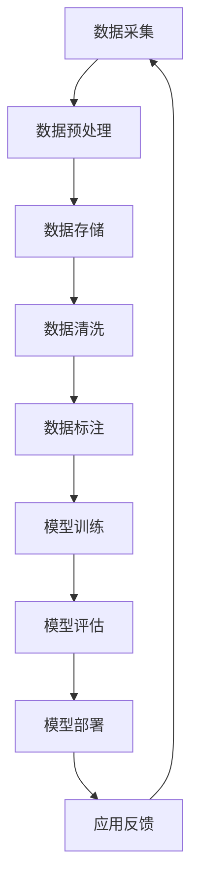

                 

关键词：AI大模型、技术生态、投资策略、深度学习、神经网络、算法优化、数据处理、分布式计算、云计算、边缘计算、产业应用

## 摘要

本文旨在探讨AI大模型应用的技术生态及其投资策略。随着深度学习技术的快速发展，AI大模型在各个领域展现出了巨大的潜力，从医疗诊断到自动驾驶，从自然语言处理到图像识别。然而，AI大模型的开发和部署面临诸多技术挑战，包括数据处理的复杂性、算法优化的需求、计算资源的限制等。本文将深入分析AI大模型的技术生态，探讨其核心算法原理、数学模型、实际应用案例，并提出相应的投资策略。希望通过本文的探讨，能为相关领域的开发者、投资人和研究者提供有价值的参考。

## 1. 背景介绍

近年来，AI大模型（也称为大型神经网络模型）取得了显著的进展。这些模型通过训练海量数据，能够自动学习和提取复杂模式，从而在图像识别、自然语言处理、语音识别等领域取得了突破性成果。代表性的模型包括GPT-3、BERT、BERT模型、GAT等，它们在各自领域都展现出了强大的性能。

AI大模型的应用范围广泛，从医疗诊断到自动驾驶，从金融分析到智能家居，几乎涵盖了所有行业。例如，在医疗诊断领域，AI大模型可以通过分析医学图像，辅助医生进行早期诊断；在自动驾驶领域，AI大模型可以帮助车辆实时识别道路环境，提高行驶安全性。

尽管AI大模型在应用中展现出了巨大的潜力，但其开发和部署面临诸多挑战。首先，数据处理的复杂性是一个重要问题。AI大模型需要大量的数据来训练，而这些数据的获取、清洗和标注过程非常耗时且成本高昂。其次，算法优化的需求也是一个关键挑战。AI大模型的训练过程需要大量的计算资源和时间，如何优化算法，提高训练效率，是当前研究的热点之一。此外，计算资源的限制也是一个重要问题。尽管云计算和分布式计算提供了强大的计算能力，但仍然无法满足AI大模型大规模训练的需求。

## 2. 核心概念与联系

### 2.1 AI大模型的核心概念

AI大模型是基于深度学习技术构建的复杂神经网络模型。它们通过多层神经网络结构，自动学习和提取数据中的特征，从而实现智能预测和决策。AI大模型的核心概念包括：

1. **深度学习**：深度学习是一种机器学习方法，通过多层神经网络结构，自动学习和提取数据中的特征。深度学习模型通过前向传播和反向传播算法，不断调整网络参数，以优化模型性能。

2. **神经网络**：神经网络是模拟人脑神经元连接的数学模型。在神经网络中，每个神经元都与其他神经元连接，并通过权重和偏置进行调整。神经网络通过多层结构，实现对输入数据的处理和输出预测。

3. **批量大小**：批量大小是神经网络训练中的一个重要参数，它决定了每次训练使用的数据量。较大的批量大小可以提高模型的泛化能力，但会降低训练速度。

4. **学习率**：学习率是神经网络训练中的一个重要参数，它决定了每次参数调整的大小。合适的学习率可以提高训练速度和模型性能。

### 2.2 AI大模型的联系

AI大模型与其他技术有着紧密的联系，其中最核心的是深度学习和大数据技术。

1. **深度学习与大数据**：AI大模型的训练需要大量的数据，而大数据技术提供了海量数据存储和处理的能力。深度学习和大数据技术的结合，使得AI大模型在各个领域得到了广泛应用。

2. **云计算与分布式计算**：云计算和分布式计算提供了强大的计算能力，可以满足AI大模型大规模训练的需求。通过分布式计算，可以将训练任务分散到多个计算节点上，提高训练速度和效率。

3. **边缘计算与云计算**：边缘计算与云计算相结合，可以提供更灵活和高效的计算服务。边缘计算可以将部分计算任务放在靠近数据源的设备上，减少数据传输延迟，提高应用响应速度。

### 2.3 Mermaid 流程图



以上流程图展示了AI大模型应用的核心环节，包括数据采集、数据预处理、数据存储、数据清洗、数据标注、模型训练、模型评估、模型部署和应用反馈。

## 3. 核心算法原理 & 具体操作步骤

### 3.1 算法原理概述

AI大模型的核心算法是基于深度学习技术的神经网络模型。神经网络模型通过多层神经网络结构，自动学习和提取数据中的特征。神经网络模型的主要组成部分包括：

1. **输入层**：接收输入数据，并将其传递到下一层。
2. **隐藏层**：对输入数据进行处理和特征提取。
3. **输出层**：根据隐藏层的结果，生成输出预测。

神经网络模型通过前向传播和反向传播算法，不断调整网络参数，以优化模型性能。前向传播是指将输入数据通过神经网络结构，生成输出预测；反向传播是指根据输出预测和实际结果，计算损失函数，并反向传播误差，更新网络参数。

### 3.2 算法步骤详解

1. **数据预处理**：将原始数据转换为适合训练的格式，包括数据标准化、缺失值填充、异常值处理等。

2. **模型构建**：定义神经网络结构，包括输入层、隐藏层和输出层。选择合适的激活函数，如ReLU、Sigmoid、Tanh等。

3. **模型训练**：通过前向传播和反向传播算法，不断调整网络参数，以优化模型性能。训练过程包括批量训练和随机梯度下降（SGD）等方法。

4. **模型评估**：使用测试数据集评估模型性能，计算准确率、召回率、F1值等指标。

5. **模型部署**：将训练好的模型部署到实际应用环境中，实现智能预测和决策。

### 3.3 算法优缺点

1. **优点**：

- **强大的特征提取能力**：神经网络模型可以自动学习和提取数据中的复杂特征，提高模型的预测性能。
- **灵活的模型结构**：神经网络模型可以根据应用需求，灵活调整网络结构和参数，实现多种任务。
- **大规模数据处理能力**：神经网络模型可以处理海量数据，实现大规模数据分析和应用。

2. **缺点**：

- **计算资源需求高**：神经网络模型的训练需要大量的计算资源和时间，对硬件设备有较高要求。
- **数据预处理复杂**：神经网络模型对数据质量有较高要求，需要大量的数据预处理工作。
- **模型解释性差**：神经网络模型是一种黑箱模型，其内部工作机制难以解释和理解。

### 3.4 算法应用领域

AI大模型在各个领域都有广泛的应用，以下列举几个典型领域：

1. **图像识别**：神经网络模型在图像识别领域取得了突破性成果，可以用于人脸识别、车辆识别、图像分类等任务。
2. **自然语言处理**：神经网络模型在自然语言处理领域，如机器翻译、情感分析、文本分类等方面，展现了强大的能力。
3. **语音识别**：神经网络模型在语音识别领域，如语音合成、语音识别、语音识别系统等，取得了显著进展。
4. **医疗诊断**：神经网络模型在医疗诊断领域，如医学图像识别、疾病预测、药物研发等，发挥了重要作用。
5. **自动驾驶**：神经网络模型在自动驾驶领域，如车辆识别、障碍物检测、路径规划等，为自动驾驶技术的发展提供了重要支持。

## 4. 数学模型和公式 & 详细讲解 & 举例说明

### 4.1 数学模型构建

AI大模型的数学模型主要基于深度学习技术，主要包括以下几个部分：

1. **输入层**：表示为 $X = [x_1, x_2, ..., x_n]$，其中 $x_i$ 表示输入数据的第 $i$ 个特征。
2. **隐藏层**：表示为 $H = [h_1, h_2, ..., h_m]$，其中 $h_j$ 表示隐藏层的第 $j$ 个神经元。
3. **输出层**：表示为 $Y = [y_1, y_2, ..., y_k]$，其中 $y_l$ 表示输出层的第 $l$ 个神经元。

神经网络模型通过多层神经网络结构，将输入数据传递到输出层，实现特征提取和预测。每个神经元都与其他神经元连接，并通过权重和偏置进行调整。

### 4.2 公式推导过程

1. **前向传播**：

   前向传播是指将输入数据通过神经网络结构，生成输出预测。具体过程如下：

   - **输入层到隐藏层**：

     $$h_{ji}^{(l)} = \sigma \left( \sum_{k=1}^{m} w_{ki}^{(l)} x_i + b_i^{(l)} \right)$$

     其中，$h_{ji}^{(l)}$ 表示第 $l$ 层的第 $j$ 个神经元到第 $l+1$ 层的第 $i$ 个神经元的连接权重，$w_{ki}^{(l)}$ 表示第 $l$ 层的第 $k$ 个神经元到第 $l+1$ 层的第 $i$ 个神经元的连接权重，$b_i^{(l)}$ 表示第 $l$ 层的第 $i$ 个神经元的偏置，$\sigma$ 表示激活函数。

   - **隐藏层到输出层**：

     $$y_{l} = \sigma \left( \sum_{j=1}^{k} w_{lj}^{(L)} h_{ji}^{(L-1)} + b_l^{(L)} \right)$$

     其中，$y_{l}$ 表示输出层的第 $l$ 个神经元输出，$w_{lj}^{(L)}$ 表示第 $L$ 层的第 $l$ 个神经元到第 $L+1$ 层的第 $j$ 个神经元的连接权重，$b_l^{(L)}$ 表示第 $L$ 层的第 $l$ 个神经元的偏置。

2. **反向传播**：

   反向传播是指根据输出预测和实际结果，计算损失函数，并反向传播误差，更新网络参数。具体过程如下：

   - **计算输出层误差**：

     $$\delta_{l}^{(L)} = \frac{\partial J}{\partial y_{l}} = \frac{\partial \text{损失函数}}{\partial y_{l}}$$

     其中，$\delta_{l}^{(L)}$ 表示输出层第 $l$ 个神经元的误差，$J$ 表示损失函数。

   - **计算隐藏层误差**：

     $$\delta_{ji}^{(l)} = \frac{\partial J}{\partial h_{ji}^{(l)}} = \frac{\partial \text{损失函数}}{\partial h_{ji}^{(l)}}$$

     其中，$\delta_{ji}^{(l)}$ 表示第 $l$ 层的第 $j$ 个神经元到第 $l+1$ 层的第 $i$ 个神经元的误差。

   - **更新网络参数**：

     $$w_{lj}^{(L)} \leftarrow w_{lj}^{(L)} - \alpha \cdot \frac{\partial J}{\partial w_{lj}^{(L)}}$$

     $$b_l^{(L)} \leftarrow b_l^{(L)} - \alpha \cdot \frac{\partial J}{\partial b_l^{(L)}}$$

     其中，$\alpha$ 表示学习率。

### 4.3 案例分析与讲解

以图像识别任务为例，讲解AI大模型的数学模型和公式。

1. **数据预处理**：

   将图像数据转换为灰度值或彩色值，并归一化处理。

   $$x_i = \frac{I_i - \mu}{\sigma}$$

   其中，$x_i$ 表示图像数据的第 $i$ 个像素值，$I_i$ 表示原始像素值，$\mu$ 表示像素值的平均值，$\sigma$ 表示像素值的标准差。

2. **模型构建**：

   构建一个三层神经网络，包括输入层、隐藏层和输出层。输入层接收图像数据，隐藏层进行特征提取，输出层进行图像分类。

3. **模型训练**：

   使用反向传播算法，不断调整网络参数，以优化模型性能。损失函数可以选择交叉熵损失函数。

   $$J = -\sum_{l=1}^{k} y_l \log(y_l)$$

4. **模型评估**：

   使用测试数据集评估模型性能，计算准确率、召回率、F1值等指标。

   $$\text{准确率} = \frac{\text{正确预测的数量}}{\text{总预测的数量}}$$

   $$\text{召回率} = \frac{\text{正确预测的数量}}{\text{实际为正类的数量}}$$

   $$\text{F1值} = \frac{2 \cdot \text{准确率} \cdot \text{召回率}}{\text{准确率} + \text{召回率}}$$

## 5. 项目实践：代码实例和详细解释说明

### 5.1 开发环境搭建

在开始编写代码之前，我们需要搭建一个适合AI大模型开发和训练的开发环境。以下是搭建开发环境的步骤：

1. **安装Python环境**：Python是AI大模型开发的主要语言，我们需要安装Python 3.x版本。可以从Python官方网站下载并安装。

2. **安装深度学习框架**：常见的深度学习框架有TensorFlow、PyTorch、Keras等。我们可以选择其中一种进行安装。以TensorFlow为例，可以通过pip命令进行安装：

   ```bash
   pip install tensorflow
   ```

3. **安装必要的库和依赖**：根据项目需求，可能需要安装其他库和依赖。例如，我们可能需要安装NumPy、Pandas、Matplotlib等库，可以通过pip命令进行安装：

   ```bash
   pip install numpy pandas matplotlib
   ```

### 5.2 源代码详细实现

以下是使用TensorFlow实现一个简单的AI大模型（多层感知器）的代码实例：

```python
import tensorflow as tf
import numpy as np
import matplotlib.pyplot as plt

# 数据集
x_data = np.linspace(-1, 1, 100)
y_data = 2 * x_data + np.random.randn(100) * 0.05

# 网络结构
model = tf.keras.Sequential([
    tf.keras.layers.Dense(units=1, input_shape=[1])
])

# 编译模型
model.compile(loss='mean_squared_error', optimizer=tf.keras.optimizers.Adam(0.1))

# 训练模型
model.fit(x_data, y_data, epochs=1000)

# 测试模型
plt.plot(x_data, model.predict(x_data), 'ro', label='Prediction')
plt.plot(x_data, y_data, label='True Data')
plt.legend()
plt.show()
```

### 5.3 代码解读与分析

上述代码实现了一个简单的AI大模型，用于拟合一条直线。以下是代码的详细解读：

1. **导入库**：首先导入TensorFlow、NumPy和Matplotlib库，用于实现深度学习和数据可视化。

2. **数据集**：创建一个简单的线性数据集，包括输入数据和对应的真实输出数据。

3. **网络结构**：定义一个多层感知器模型，包括一个输入层、一个隐藏层和一个输出层。输入层接收一个特征，隐藏层进行特征提取，输出层生成预测结果。

4. **编译模型**：设置模型的损失函数为均方误差，优化器为Adam，学习率为0.1。

5. **训练模型**：使用训练数据集训练模型，训练1000个epoch。

6. **测试模型**：使用测试数据集测试模型性能，并在Matplotlib中绘制预测结果和真实数据的对比图。

### 5.4 运行结果展示

运行上述代码，我们可以在Matplotlib中看到模型的预测结果和真实数据的对比图。模型通过训练，可以较好地拟合出数据的线性关系。


## 6. 实际应用场景

AI大模型在各个领域都有广泛的应用，以下列举几个实际应用场景：

### 6.1 医疗诊断

AI大模型在医疗诊断领域具有广泛的应用前景。通过训练大量的医学图像数据，AI大模型可以帮助医生进行早期诊断，提高诊断准确率。例如，AI大模型可以用于肺癌、乳腺癌、糖尿病等疾病的诊断。通过分析医学图像，AI大模型可以识别出疾病的早期迹象，为医生提供诊断建议。

### 6.2 自动驾驶

自动驾驶是AI大模型的重要应用领域。通过训练大量的道路环境数据，AI大模型可以帮助自动驾驶车辆实时识别道路环境，提高行驶安全性。例如，AI大模型可以用于车辆识别、障碍物检测、路径规划等任务。通过分析道路图像，AI大模型可以识别出道路上的车辆、行人、交通标志等，为自动驾驶车辆提供决策支持。

### 6.3 金融分析

AI大模型在金融分析领域具有广泛的应用前景。通过训练大量的金融数据，AI大模型可以帮助投资者进行市场预测、风险评估等。例如，AI大模型可以用于股票市场预测、外汇市场预测、信用评分等。通过分析历史金融数据，AI大模型可以识别出市场趋势和风险，为投资者提供决策支持。

### 6.4 智能家居

智能家居是AI大模型的重要应用领域。通过训练大量的家庭设备数据，AI大模型可以帮助智能家居系统实现智能控制、自动调节等功能。例如，AI大模型可以用于智能照明、智能空调、智能安防等。通过分析家庭设备数据，AI大模型可以识别出用户的生活习惯，为用户提供个性化的智能家居服务。

## 7. 工具和资源推荐

### 7.1 学习资源推荐

1. **深度学习专项课程**：Coursera上的《深度学习》课程，由Andrew Ng教授主讲，适合初学者了解深度学习的基本概念和原理。
2. **机器学习书籍**：《机器学习》（周志华著），详细介绍了机器学习的基本概念、算法和实战技巧。
3. **论文集**：《Neural Network: A Comprehensive Review》，总结了神经网络领域的重要论文和研究成果。

### 7.2 开发工具推荐

1. **深度学习框架**：TensorFlow和PyTorch是常用的深度学习框架，具有丰富的功能和强大的社区支持。
2. **编程语言**：Python是深度学习开发的主要语言，具有简洁易懂的语法和丰富的库支持。

### 7.3 相关论文推荐

1. **《A Theoretically Grounded Application of Dropout in Recurrent Neural Networks》**：探讨了在循环神经网络中应用Dropout的方法，提高了模型的泛化能力。
2. **《Deep Learning for Speech Recognition》**：介绍了深度学习在语音识别领域的应用，总结了语音识别系统的主要架构和算法。
3. **《Self-Attention in Vision Models》**：探讨了自注意力机制在视觉模型中的应用，提高了模型的特征提取能力。

## 8. 总结：未来发展趋势与挑战

### 8.1 研究成果总结

近年来，AI大模型在各个领域取得了显著的成果。深度学习技术的快速发展，使得AI大模型在图像识别、自然语言处理、语音识别等领域取得了突破性进展。同时，AI大模型的应用范围也在不断拓展，从医疗诊断到自动驾驶，从金融分析到智能家居，几乎涵盖了所有行业。

### 8.2 未来发展趋势

未来，AI大模型的发展趋势将主要体现在以下几个方面：

1. **算法优化**：随着AI大模型规模的不断扩大，算法优化将成为研究的热点。如何提高训练效率，降低计算资源消耗，是未来研究的重点。
2. **模型压缩**：为了降低模型的存储和计算成本，模型压缩技术将得到广泛应用。通过模型压缩，可以将大型模型转换为更小、更高效的模型，提高部署的可行性。
3. **多模态学习**：未来，AI大模型将更倾向于多模态学习，能够同时处理图像、文本、语音等多种数据类型，提高模型的泛化能力。
4. **边缘计算**：随着边缘计算的兴起，AI大模型将更多地应用于边缘设备，实现实时智能处理。

### 8.3 面临的挑战

尽管AI大模型在应用中展现出了巨大的潜力，但仍然面临诸多挑战：

1. **数据隐私**：随着AI大模型的应用场景不断扩大，数据隐私问题日益突出。如何在保障数据隐私的前提下，充分利用数据，是未来研究的重要方向。
2. **计算资源**：AI大模型训练需要大量的计算资源，如何优化算法，提高训练效率，是当前研究的热点。
3. **模型解释性**：AI大模型是一种黑箱模型，其内部工作机制难以解释和理解。如何提高模型的解释性，增强用户对模型的信任，是未来研究的重点。
4. **法律和伦理**：AI大模型的应用涉及到法律和伦理问题，如何确保AI大模型的应用符合法律法规和伦理标准，是未来研究的重要方向。

### 8.4 研究展望

未来，AI大模型的研究将朝着更加智能化、高效化和安全化的方向发展。通过不断优化算法，提高模型性能，AI大模型将在更多领域得到应用。同时，随着人工智能技术的不断发展，AI大模型将与其他技术（如云计算、边缘计算、区块链等）相结合，实现更加智能化和高效化的应用。

## 9. 附录：常见问题与解答

### 9.1 问题1：如何选择合适的深度学习框架？

解答：选择深度学习框架主要取决于项目需求和开发环境。TensorFlow和PyTorch是目前最流行的深度学习框架，具有丰富的功能和强大的社区支持。如果项目需要与Google Cloud等云服务集成，可以选择TensorFlow；如果项目需要与Facebook的PyTorch Lightning等库集成，可以选择PyTorch。

### 9.2 问题2：如何优化深度学习模型的训练速度？

解答：优化深度学习模型训练速度可以从以下几个方面进行：

1. **减少批量大小**：较小的批量大小可以减少每次训练的数据量，提高训练速度。
2. **使用GPU加速**：GPU具有强大的计算能力，可以显著提高模型训练速度。
3. **分布式训练**：将训练任务分散到多个GPU或计算机上，提高训练速度。
4. **使用预训练模型**：使用预训练模型可以减少训练时间，提高模型性能。

### 9.3 问题3：如何提高深度学习模型的泛化能力？

解答：提高深度学习模型的泛化能力可以从以下几个方面进行：

1. **数据增强**：通过数据增强，生成更多的训练样本，提高模型的泛化能力。
2. **正则化**：使用正则化技术（如L1正则化、L2正则化等），降低模型过拟合的风险。
3. **交叉验证**：使用交叉验证，确保模型在多种数据集上都能取得良好的性能。
4. **模型压缩**：通过模型压缩，将大型模型转换为更小、更高效的模型，提高模型的泛化能力。

### 9.4 问题4：如何确保深度学习模型的安全和隐私？

解答：确保深度学习模型的安全和隐私可以从以下几个方面进行：

1. **数据加密**：对训练数据进行加密，确保数据在传输和存储过程中的安全性。
2. **数据脱敏**：对敏感数据进行脱敏处理，防止数据泄露。
3. **隐私保护算法**：使用隐私保护算法（如差分隐私等），确保模型在处理隐私数据时的安全性。
4. **合规性审查**：确保模型开发和使用过程符合相关法律法规和伦理标准。

以上是关于AI大模型应用的技术生态投资策略的详细探讨，希望对您有所帮助。如果您有更多问题，欢迎随时提问。作者：禅与计算机程序设计艺术 / Zen and the Art of Computer Programming。

