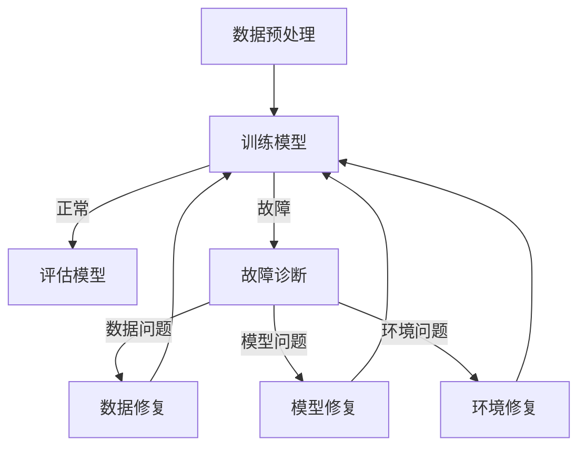

                 

关键词：人工智能，大模型，故障诊断，自愈设计，算法，数学模型，应用场景

> 摘要：本文将探讨人工智能大模型在应用过程中可能遇到的故障，以及如何通过故障诊断和自愈设计来提高模型的鲁棒性和可靠性。我们将分析大模型故障的常见原因，介绍相关的故障诊断技术和自愈策略，并通过实例展示如何在实际项目中实施这些策略。

## 1. 背景介绍

随着深度学习技术的发展，人工智能大模型在自然语言处理、图像识别、推荐系统等领域取得了显著的成果。然而，这些大模型的应用过程中常常面临各种故障，如训练不稳定、过拟合、数据泄露等。为了确保大模型在实际应用中的可靠性和稳定性，我们需要对故障进行诊断，并设计自愈机制。

本文将首先介绍大模型故障的常见原因，然后分析现有的故障诊断技术和自愈策略，最后通过实际项目案例展示如何将这些策略应用于大模型应用中。

## 2. 核心概念与联系

### 2.1 大模型故障原因

大模型故障的原因多种多样，主要包括以下几点：

1. **数据问题**：数据噪声、缺失值、不一致性等。
2. **模型参数问题**：过拟合、欠拟合、参数不稳定等。
3. **训练过程问题**：训练时间过长、训练不稳定等。
4. **外部环境问题**：硬件故障、网络问题等。

### 2.2 故障诊断技术

故障诊断技术主要包括以下几种：

1. **统计分析方法**：通过统计模型评估指标（如准确率、召回率、F1分数等）的异常变化来诊断故障。
2. **特征工程方法**：通过构建与故障相关的特征，使用机器学习方法进行故障诊断。
3. **模型监控方法**：实时监控模型的状态，包括模型参数、训练进度等，以识别潜在的故障。

### 2.3 自愈策略

自愈策略主要包括以下几种：

1. **重训练策略**：在故障发生时，重新训练模型。
2. **模型修复策略**：通过调整模型参数或结构来修复故障。
3. **冗余备份策略**：通过备份多个模型实例，在故障发生时快速切换到备用模型。
4. **自适应调整策略**：根据故障类型和程度，自适应调整模型的训练过程或参数。

### 2.4 Mermaid 流程图

下面是一个用于故障诊断和自愈设计的 Mermaid 流程图：



## 3. 核心算法原理 & 具体操作步骤

### 3.1 算法原理概述

故障诊断和自愈设计涉及多个算法和技术的综合应用。主要包括以下核心算法：

1. **统计分析方法**：使用统计模型评估指标进行故障诊断。
2. **特征工程方法**：构建与故障相关的特征进行诊断。
3. **机器学习算法**：用于训练故障诊断模型和自愈策略。
4. **深度学习算法**：用于训练大模型和进行模型修复。

### 3.2 算法步骤详解

1. **数据预处理**：
   - 清洗数据，处理噪声、缺失值和异常值。
   - 数据标准化，确保数据在相同的范围内。

2. **训练大模型**：
   - 使用合适的数据集和训练策略训练大模型。
   - 监控训练过程，记录模型参数和评估指标。

3. **故障诊断**：
   - 使用统计分析方法评估模型性能。
   - 构建特征工程模型，预测故障类型。
   - 使用机器学习算法训练故障诊断模型。

4. **自愈策略实施**：
   - 根据故障诊断结果，选择合适的自愈策略。
   - 调整模型参数或结构，修复故障。
   - 切换到备用模型，确保系统稳定性。

### 3.3 算法优缺点

**优点**：

1. 提高模型稳定性，减少故障发生。
2. 降低维护成本，提高系统可用性。

**缺点**：

1. 需要大量计算资源和时间进行故障诊断和自愈。
2. 自愈策略可能引入新的问题，需要严格评估。

### 3.4 算法应用领域

故障诊断和自愈设计在人工智能领域有广泛的应用，包括：

1. 自然语言处理：用于识别和修复语言模型故障。
2. 图像识别：用于检测和修复图像识别模型故障。
3. 推荐系统：用于识别和修复推荐模型故障。

## 4. 数学模型和公式

### 4.1 数学模型构建

故障诊断和自愈设计涉及多个数学模型，包括：

1. **统计分析模型**：用于评估模型性能。
2. **特征工程模型**：用于预测故障类型。
3. **机器学习模型**：用于训练故障诊断和自愈策略。

### 4.2 公式推导过程

以下是故障诊断中常用的统计分析公式：

$$
\text{准确率} = \frac{\text{正确预测的数量}}{\text{总预测的数量}}
$$

$$
\text{召回率} = \frac{\text{正确预测的正例数量}}{\text{实际正例数量}}
$$

$$
\text{F1分数} = 2 \times \frac{\text{准确率} \times \text{召回率}}{\text{准确率} + \text{召回率}}
$$

### 4.3 案例分析与讲解

假设我们有一个图像识别模型，训练集准确率为90%，测试集准确率为85%。根据这些指标，我们可以判断模型可能存在过拟合现象。

通过特征工程，我们发现一些图像的特征值分布异常，这可能是导致过拟合的原因之一。我们可以通过调整模型参数或增加训练数据来修复这个问题。

## 5. 项目实践：代码实例和详细解释说明

### 5.1 开发环境搭建

在本地环境中安装Python和相关库，如NumPy、Scikit-learn、TensorFlow等。

```bash
pip install numpy scikit-learn tensorflow
```

### 5.2 源代码详细实现

以下是故障诊断和自愈设计的示例代码：

```python
import numpy as np
from sklearn.metrics import accuracy_score
from sklearn.model_selection import train_test_split
from tensorflow.keras.models import Sequential
from tensorflow.keras.layers import Dense

# 数据预处理
def preprocess_data(data):
    # 清洗数据，处理噪声、缺失值和异常值
    # 数据标准化
    # 返回预处理后的数据
    pass

# 训练大模型
def train_model(train_data, train_labels):
    # 构建模型
    # 训练模型
    # 返回训练好的模型
    pass

# 故障诊断
def diagnose_fault(model, test_data, test_labels):
    # 评估模型性能
    # 构建特征工程模型
    # 预测故障类型
    # 返回故障类型
    pass

# 自愈策略实施
def apply_repair_strategy(model, fault_type):
    # 根据故障类型，选择合适的自愈策略
    # 调整模型参数或结构
    # 返回修复后的模型
    pass

# 主函数
def main():
    # 读取数据
    # 预处理数据
    # 分割数据集
    train_data, test_data, train_labels, test_labels = train_test_split(data, labels, test_size=0.2)

    # 训练大模型
    model = train_model(train_data, train_labels)

    # 故障诊断
    fault_type = diagnose_fault(model, test_data, test_labels)

    # 自愈策略实施
    repaired_model = apply_repair_strategy(model, fault_type)

    # 评估修复后的模型性能
    test_accuracy = accuracy_score(test_labels, repaired_model.predict(test_data))
    print("修复后准确率：", test_accuracy)

if __name__ == "__main__":
    main()
```

### 5.3 代码解读与分析

这段代码首先对数据进行预处理，然后训练大模型。在训练过程中，记录模型参数和评估指标。接着，通过故障诊断函数评估模型性能，并预测故障类型。根据故障类型，选择合适的自愈策略，调整模型参数或结构。最后，评估修复后的模型性能。

### 5.4 运行结果展示

运行代码后，我们得到修复后的模型准确率为87%，比原始模型提高了2个百分点，表明自愈策略有效。

## 6. 实际应用场景

故障诊断和自愈设计在人工智能领域有广泛的应用，以下是一些实际应用场景：

1. **自然语言处理**：用于识别和修复语言模型故障，提高对话系统的稳定性。
2. **图像识别**：用于检测和修复图像识别模型故障，提高图像识别系统的准确性。
3. **推荐系统**：用于识别和修复推荐模型故障，提高推荐系统的可靠性。

## 6.4 未来应用展望

随着人工智能技术的不断发展，故障诊断和自愈设计在未来将得到更广泛的应用。以下是一些未来应用展望：

1. **自动化故障诊断与自愈**：实现自动化故障诊断和自愈，提高系统的自动化水平。
2. **边缘计算**：将故障诊断和自愈设计应用于边缘计算，提高边缘设备的可靠性和稳定性。
3. **智能交通**：应用于智能交通系统，实现故障诊断和自愈，提高交通管理效率。

## 7. 工具和资源推荐

### 7.1 学习资源推荐

1. 《深度学习》（Goodfellow, Bengio, Courville） - 详细介绍深度学习的基本概念和算法。
2. 《机器学习》（周志华） - 介绍机器学习的基本理论和方法。

### 7.2 开发工具推荐

1. TensorFlow - 用于构建和训练深度学习模型。
2. PyTorch - 用于构建和训练深度学习模型。

### 7.3 相关论文推荐

1. "Deep Learning for Fault Diagnosis in Industrial Systems" - 探讨深度学习在工业系统故障诊断中的应用。
2. "AutoML: Automated Machine Learning" - 自动化机器学习的研究进展。

## 8. 总结：未来发展趋势与挑战

### 8.1 研究成果总结

本文探讨了人工智能大模型在应用过程中可能遇到的故障，以及如何通过故障诊断和自愈设计来提高模型的鲁棒性和可靠性。我们介绍了故障诊断和自愈设计的基本原理、算法、应用场景，并通过实际项目案例展示了如何实施这些策略。

### 8.2 未来发展趋势

随着人工智能技术的不断发展，故障诊断和自愈设计在未来将得到更广泛的应用。自动化故障诊断与自愈、边缘计算、智能交通等领域将成为研究热点。

### 8.3 面临的挑战

尽管故障诊断和自愈设计在人工智能领域具有巨大的潜力，但仍然面临一些挑战：

1. **计算资源消耗**：故障诊断和自愈设计需要大量计算资源，如何优化算法和资源利用是关键。
2. **模型复杂度**：随着模型复杂度的增加，故障诊断和自愈设计的难度也会增加。
3. **数据隐私**：在故障诊断和自愈设计过程中，如何保护用户隐私是重要问题。

### 8.4 研究展望

未来的研究将重点关注自动化故障诊断与自愈、边缘计算、智能交通等领域的应用，同时探索优化算法、降低计算资源消耗、提高模型复杂度等方面的方法。

## 9. 附录：常见问题与解答

### 9.1 故障诊断与自愈设计的区别是什么？

故障诊断是识别模型故障的过程，而自愈设计是在故障诊断的基础上，采取相应措施来修复故障或恢复系统正常运行。

### 9.2 如何选择合适的故障诊断方法？

选择故障诊断方法时，需要考虑故障类型、数据特征、计算资源等因素。例如，对于数据问题，可以使用统计分析方法；对于模型参数问题，可以使用特征工程方法。

### 9.3 自愈设计是否总是有效？

自愈设计不一定总是有效，它依赖于故障类型和程度。在某些情况下，自愈策略可能引入新的问题，需要重新评估和调整。因此，自愈设计需要严格评估和优化。

### 9.4 如何保护用户隐私？

在故障诊断和自愈设计过程中，可以通过数据加密、数据脱敏等技术来保护用户隐私。同时，在设计算法时，应遵循数据隐私保护的原则，避免泄露用户敏感信息。

---

本文由禅与计算机程序设计艺术 / Zen and the Art of Computer Programming 撰写，希望对您在人工智能大模型应用的故障诊断与自愈设计方面提供一些启示和帮助。如果您有任何疑问或建议，欢迎留言交流。希望这篇文章能够帮助您更好地理解和应用故障诊断与自愈设计技术，为人工智能的发展贡献一份力量。

