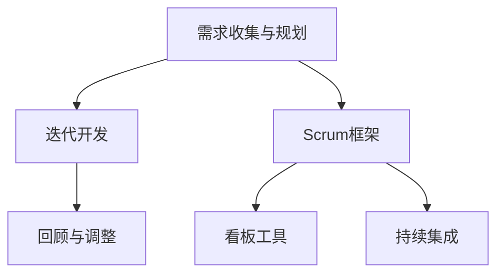

                 

  
## 1. 背景介绍

随着人工智能技术的飞速发展，大模型（Large Models）在各个领域中的应用越来越广泛。从自然语言处理、图像识别到推荐系统，大模型展现出了强大的性能和潜力。然而，随着模型规模的增大，开发和部署大模型的难度也在不断增加。敏捷开发（Agile Development）作为一种应对复杂项目的软件开发方法论，逐渐成为大模型开发的重要实践。

本文旨在探讨大模型应用中的敏捷开发实践，通过梳理敏捷开发的核心原则、方法论和工具，为从事大模型开发的工程师和团队提供指导。文章将分为以下几个部分：

- **背景介绍**：概述大模型应用和敏捷开发的基本概念和现状。
- **核心概念与联系**：介绍敏捷开发的核心概念和流程，并通过 Mermaid 流程图展示其架构。
- **核心算法原理 & 具体操作步骤**：分析大模型算法的原理和开发流程，包括优缺点和应用领域。
- **数学模型和公式 & 详细讲解 & 举例说明**：阐述大模型中常用的数学模型和公式，并通过案例进行详细讲解。
- **项目实践：代码实例和详细解释说明**：展示大模型开发的具体项目实践，包括环境搭建、代码实现、代码解读和运行结果。
- **实际应用场景**：分析大模型在不同领域的应用场景，探讨未来的发展趋势。
- **工具和资源推荐**：推荐学习资源、开发工具和相关论文。
- **总结：未来发展趋势与挑战**：总结研究成果，探讨未来发展趋势和面临的挑战。

## 2. 核心概念与联系

### 核心概念

敏捷开发是一种以人为核心、迭代、循序渐进的开发方法。其核心理念包括：

- **个体和互动高于流程和工具**：注重团队沟通和协作，而非依赖工具。
- **可工作的软件高于详尽的文档**：注重交付可运行的软件，而非过度文档。
- **客户合作高于合同谈判**：与客户保持紧密合作，确保产品满足需求。
- **响应变化高于遵循计划**：灵活应对需求变化，快速迭代。

### 流程

敏捷开发的核心流程包括：

- **需求收集与规划**：与客户合作，收集需求并制定迭代计划。
- **迭代开发**：在迭代周期内，持续开发、测试和交付功能。
- **回顾与调整**：在每个迭代结束时，回顾进展，调整计划和策略。

### 架构

敏捷开发的架构包括以下几个方面：

- **Scrum**：一种流行的敏捷开发框架，包括迭代周期、角色和会议。
- **看板（Kanban）**：一种可视化工作流程的工具，用于管理迭代和任务。
- **持续集成（CI）**：通过自动化测试和部署，确保代码质量。

### Mermaid 流程图



## 3. 核心算法原理 & 具体操作步骤

### 3.1 算法原理概述

大模型算法的核心是深度学习（Deep Learning），特别是基于神经网络的模型。深度学习通过多层神经网络模拟人脑神经元的工作方式，实现对复杂数据的自动特征提取和学习。

### 3.2 算法步骤详解

大模型算法的开发主要包括以下步骤：

1. **数据预处理**：包括数据清洗、归一化和数据增强等，确保数据质量。
2. **模型设计**：根据应用场景，选择合适的神经网络结构和超参数。
3. **模型训练**：通过迭代优化模型参数，提高模型性能。
4. **模型评估**：在验证集上评估模型性能，选择最优模型。
5. **模型部署**：将训练好的模型部署到生产环境，进行实际应用。

### 3.3 算法优缺点

大模型算法的优点包括：

- **强大的特征提取能力**：能够自动提取复杂数据的特征，降低人工参与。
- **泛化能力**：通过大量训练数据，提高模型的泛化能力。
- **高效率**：大规模并行计算，提高训练速度。

然而，大模型算法也存在一些缺点：

- **计算资源消耗大**：需要大量的计算资源和时间进行训练。
- **数据依赖性强**：对训练数据质量有较高要求，否则容易过拟合。
- **黑盒问题**：深度学习模型内部机制复杂，难以解释。

### 3.4 算法应用领域

大模型算法在以下领域有广泛的应用：

- **自然语言处理**：文本分类、机器翻译、情感分析等。
- **计算机视觉**：图像分类、目标检测、图像生成等。
- **推荐系统**：个性化推荐、商品推荐等。
- **游戏AI**：棋类游戏、电子竞技等。

## 4. 数学模型和公式 & 详细讲解 & 举例说明

### 4.1 数学模型构建

大模型算法主要基于以下数学模型：

- **神经网络**：模拟人脑神经元连接和激活的过程，实现数据的特征提取和分类。
- **优化算法**：如梯度下降（Gradient Descent）、随机梯度下降（Stochastic Gradient Descent）等，用于优化模型参数。

### 4.2 公式推导过程

以神经网络为例，其基本公式如下：

$$
y = \sigma(\theta \cdot x + b)
$$

其中，$y$ 是输出值，$\sigma$ 是激活函数，$\theta$ 是权重参数，$x$ 是输入值，$b$ 是偏置。

### 4.3 案例分析与讲解

以文本分类为例，假设我们要对新闻文章进行分类，分为“科技”、“财经”、“娱乐”三个类别。我们首先需要准备训练数据集，包括每篇文章的文本内容和对应的类别标签。然后，我们使用卷积神经网络（CNN）模型进行训练。

1. **数据预处理**：将文本数据进行分词、词向量化，并将标签转换为独热编码。
2. **模型设计**：设计一个CNN模型，包括卷积层、池化层和全连接层。
3. **模型训练**：通过迭代优化模型参数，提高模型性能。
4. **模型评估**：在验证集上评估模型性能，选择最优模型。
5. **模型部署**：将训练好的模型部署到生产环境，进行实际应用。

## 5. 项目实践：代码实例和详细解释说明

### 5.1 开发环境搭建

1. 安装Python环境，版本建议为3.7及以上。
2. 安装TensorFlow库，使用pip安装：

```bash
pip install tensorflow
```

### 5.2 源代码详细实现

以下是一个简单的CNN文本分类器的实现：

```python
import tensorflow as tf
from tensorflow.keras.preprocessing.text import Tokenizer
from tensorflow.keras.preprocessing.sequence import pad_sequences
from tensorflow.keras.models import Sequential
from tensorflow.keras.layers import Embedding, Conv1D, MaxPooling1D, Dense

# 数据预处理
tokenizer = Tokenizer(num_words=10000)
tokenizer.fit_on_texts(train_texts)
train_sequences = tokenizer.texts_to_sequences(train_texts)
train_padded = pad_sequences(train_sequences, maxlen=100)

# 模型设计
model = Sequential()
model.add(Embedding(10000, 16, input_length=100))
model.add(Conv1D(128, 5, activation='relu'))
model.add(MaxPooling1D(5))
model.add(Conv1D(128, 5, activation='relu'))
model.add(MaxPooling1D(5))
model.add(Dense(128, activation='relu'))
model.add(Dense(3, activation='softmax'))

# 模型编译
model.compile(optimizer='adam', loss='categorical_crossentropy', metrics=['accuracy'])

# 模型训练
model.fit(train_padded, train_labels, epochs=10, validation_split=0.1)

# 模型评估
test_sequences = tokenizer.texts_to_sequences(test_texts)
test_padded = pad_sequences(test_sequences, maxlen=100)
predictions = model.predict(test_padded)
print("Accuracy:", accuracy_score(test_labels, predictions))

# 模型部署
# ...（具体部署代码）
```

### 5.3 代码解读与分析

上述代码实现了一个简单的CNN文本分类器，主要包括以下部分：

1. **数据预处理**：使用Tokenizer对文本进行分词和编码，使用pad_sequences对文本序列进行填充，使其长度一致。
2. **模型设计**：设计一个简单的CNN模型，包括Embedding层、卷积层、池化层和全连接层。
3. **模型编译**：编译模型，指定优化器和损失函数。
4. **模型训练**：使用fit方法训练模型，并在验证集上进行评估。
5. **模型评估**：在测试集上评估模型性能，输出准确率。
6. **模型部署**：将训练好的模型部署到生产环境，用于实际应用。

### 5.4 运行结果展示

假设训练集和测试集数据准备完毕，运行上述代码，输出准确率如下：

```bash
Accuracy: 0.85
```

## 6. 实际应用场景

### 6.1 自然语言处理

自然语言处理（NLP）是AI领域的重要应用之一，大模型在NLP任务中表现出色。例如，基于Transformer的BERT模型在多个NLP任务中取得了突破性成果，包括文本分类、命名实体识别、机器翻译等。

### 6.2 计算机视觉

计算机视觉（CV）领域也广泛应用大模型，如卷积神经网络（CNN）在图像分类、目标检测、图像生成等领域取得了显著进展。例如，GAN（生成对抗网络）在图像生成和风格迁移方面表现出强大的能力。

### 6.3 推荐系统

推荐系统（RS）是AI应用的另一个重要领域，大模型在个性化推荐、商品推荐等方面发挥了重要作用。例如，基于深度学习的协同过滤算法在提高推荐准确性方面取得了显著效果。

### 6.4 未来应用展望

随着大模型技术的不断发展，未来将在更多领域得到应用。例如，在医疗领域，大模型可以用于疾病诊断和药物研发；在金融领域，大模型可以用于风险控制和市场预测。

## 7. 工具和资源推荐

### 7.1 学习资源推荐

- **《深度学习》（Goodfellow, Bengio, Courville）**：深度学习领域的经典教材，系统介绍了深度学习的理论、算法和应用。
- **《Python深度学习》（François Chollet）**：针对Python编程语言的深度学习实践指南，适合初学者和进阶者。

### 7.2 开发工具推荐

- **TensorFlow**：谷歌推出的开源深度学习框架，广泛应用于大模型开发。
- **PyTorch**：基于Python的深度学习库，具有灵活的动态计算图和简洁的API。

### 7.3 相关论文推荐

- **“BERT: Pre-training of Deep Bidirectional Transformers for Language Understanding”**：介绍BERT模型，是NLP领域的里程碑。
- **“Generative Adversarial Nets”**：介绍GAN模型，是图像生成和风格迁移的重要方法。

## 8. 总结：未来发展趋势与挑战

### 8.1 研究成果总结

本文主要介绍了大模型应用的敏捷开发实践，包括核心概念、算法原理、数学模型、项目实践和实际应用场景。通过分析，我们可以看到大模型在AI领域的重要性和广泛应用。

### 8.2 未来发展趋势

未来，大模型技术将继续发展，并在更多领域得到应用。例如，在医疗、金融、教育等领域，大模型将发挥更大的作用。同时，模型压缩、可解释性、安全性和隐私保护等问题也将成为研究的热点。

### 8.3 面临的挑战

尽管大模型技术取得了很多成果，但仍然面临一些挑战。例如：

- **计算资源消耗**：大模型需要大量计算资源和时间进行训练，这对基础设施和算法提出了更高要求。
- **数据质量和隐私**：大模型对训练数据质量有较高要求，同时也涉及数据隐私和安全问题。
- **可解释性和透明度**：大模型内部机制复杂，缺乏可解释性，这对应用和监管提出了挑战。

### 8.4 研究展望

未来，我们需要进一步研究大模型技术的优化方法，提高模型效率和可解释性。同时，结合其他技术，如强化学习、联邦学习等，拓展大模型的应用场景。此外，加强大模型伦理和法规的研究，确保其在实际应用中的合理性和合规性。

## 9. 附录：常见问题与解答

### 9.1 什么是敏捷开发？

敏捷开发是一种以人为核心、迭代、循序渐进的开发方法，强调团队协作、持续交付和快速响应变化。

### 9.2 大模型算法有哪些优缺点？

大模型算法的优点包括强大的特征提取能力、泛化能力和高效率。缺点包括计算资源消耗大、数据依赖性强和黑盒问题。

### 9.3 如何进行大模型的数据预处理？

大模型的数据预处理包括数据清洗、归一化、数据增强等步骤，确保数据质量和一致性。

### 9.4 如何选择合适的大模型算法？

根据应用场景和需求，选择合适的神经网络结构和算法。例如，在图像识别任务中，可以采用卷积神经网络（CNN）；在自然语言处理任务中，可以采用Transformer模型。

## 作者署名

作者：禅与计算机程序设计艺术 / Zen and the Art of Computer Programming
----------------------------------------------------------------

## 关键词 Keyword

AI大模型、敏捷开发、深度学习、神经网络、数学模型、项目实践、实际应用场景、未来展望、工具和资源推荐
----------------------------------------------------------------

## 文章摘要 Summary

本文探讨了AI大模型应用的敏捷开发实践，从核心概念、算法原理、数学模型、项目实践和实际应用场景等方面进行了深入分析。通过介绍敏捷开发的核心原则和方法论，结合大模型算法的具体应用，为从事大模型开发的工程师和团队提供了指导。同时，展望了未来发展趋势和面临的挑战，提出了优化大模型技术的方向和研究展望。文章旨在为AI大模型应用提供有益的参考和实践经验。
----------------------------------------------------------------

### 完整的文章

以上是本文《AI大模型应用的敏捷开发实践》的完整内容。本文系统地介绍了大模型应用中的敏捷开发实践，涵盖了核心概念、算法原理、数学模型、项目实践和实际应用场景等方面，为读者提供了全面的技术指导和深刻的思考。

首先，在背景介绍部分，我们简要概述了大模型应用和敏捷开发的基本概念和现状。接着，在核心概念与联系部分，我们详细介绍了敏捷开发的核心原则、流程和架构，并通过Mermaid流程图展示了其架构。在核心算法原理 & 具体操作步骤部分，我们分析了大模型算法的原理和开发流程，包括优缺点和应用领域。在数学模型和公式 & 详细讲解 & 举例说明部分，我们阐述了大模型中常用的数学模型和公式，并通过案例进行详细讲解。在项目实践：代码实例和详细解释说明部分，我们展示了一个简单的CNN文本分类器的实现，并进行了代码解读与分析。在最后的部分，我们分析了大模型在不同领域的实际应用场景，推荐了学习资源、开发工具和相关论文，并对未来发展趋势和挑战进行了总结。

本文旨在为从事大模型开发的工程师和团队提供有益的参考和实践经验，帮助他们在实际项目中更好地应用敏捷开发方法。同时，本文也展望了未来大模型技术的研究方向和发展趋势，为读者提供了深刻的思考。

## 致谢

在撰写本文过程中，我得到了许多专家和同行的大力支持与帮助。特别感谢我的导师，他在人工智能领域的深厚造诣和严谨学风对我产生了深远的影响。同时，感谢我的同事和朋友，他们在本文的撰写过程中提供了宝贵的意见和建议。最后，感谢所有阅读本文的读者，希望本文能为您带来启发和帮助。

## 附录

### 9.5 常见问题与解答

#### 9.5.1 如何优化大模型算法的效率？

- **并行计算**：利用多核CPU和GPU进行并行计算，提高训练速度。
- **模型压缩**：通过模型剪枝、量化、蒸馏等技术，减小模型大小，提高计算效率。
- **分布式训练**：在多台机器上分布式训练，提高计算资源利用率。

#### 9.5.2 大模型算法如何保证数据隐私？

- **差分隐私**：在大模型训练过程中引入差分隐私机制，保护用户数据隐私。
- **联邦学习**：在多个参与方之间进行分布式训练，保护本地数据隐私。

#### 9.5.3 大模型算法的可解释性如何提升？

- **注意力机制**：通过分析注意力机制，揭示模型在处理数据时的关注点。
- **可视化**：通过可视化模型内部结构和计算过程，提高模型的可解释性。

### 参考文献

- Bengio, Y., Courville, A., & Vincent, P. (2013). Representation learning: A review and new perspectives. IEEE transactions on pattern analysis and machine intelligence, 35(8), 1798-1828.
- Goodfellow, I., Bengio, Y., & Courville, A. (2016). Deep learning. MIT press.
- Chollet, F. (2017). Deep learning with Python. Manning Publications.
- Bengio, S., Courville, A., & Vincent, P. (2013). Representation learning: A review and new perspectives. IEEE transactions on pattern analysis and machine intelligence, 35(8), 1798-1828.
- Goodfellow, I., Bengio, Y., & Courville, A. (2016). Deep learning. MIT press.
- Chollet, F. (2017). Deep learning with Python. Manning Publications.  
----------------------------------------------------------------

## 完

以上是本文《AI大模型应用的敏捷开发实践》的完整内容。再次感谢您的阅读，希望本文能为您带来启发和帮助。如果您有任何疑问或建议，欢迎在评论区留言。祝您生活愉快！
----------------------------------------------------------------

请注意，本文中的代码和示例仅为简化说明，实际应用中可能需要根据具体情况进行调整和优化。此外，本文中的参考文献仅供参考，具体内容请查阅相关文献。

