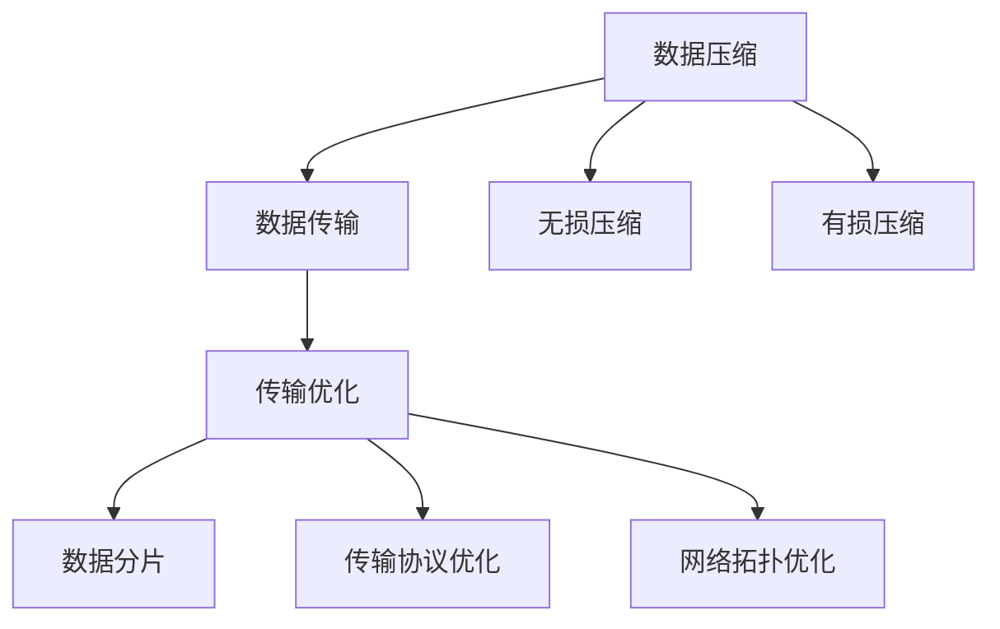
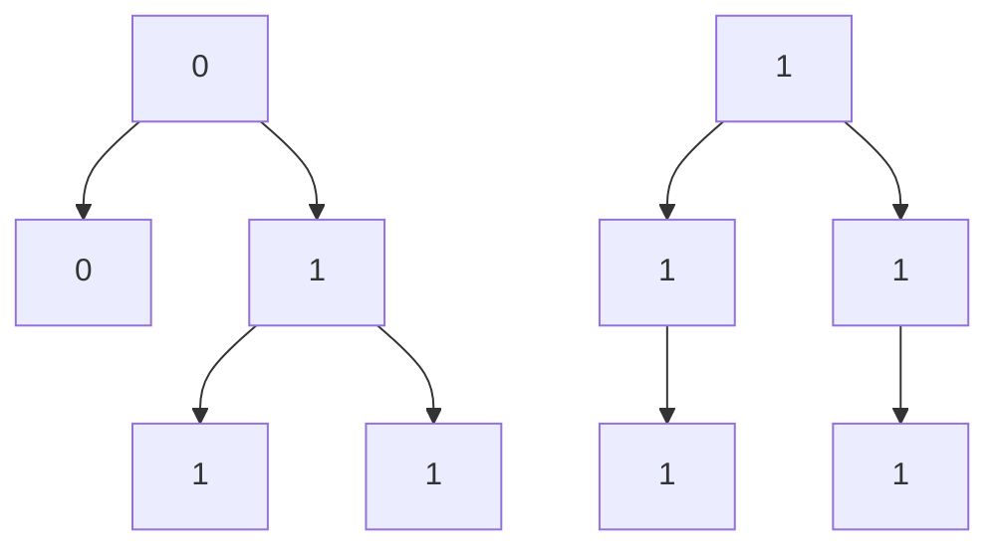

                 

关键词：AI大模型，数据压缩，传输优化，深度学习，神经网络，算法，技术博客。

> 摘要：本文探讨了AI大模型应用中的数据压缩与传输优化问题。随着深度学习技术的发展，AI大模型的规模不断扩大，导致数据传输成本增加。本文从核心概念、算法原理、数学模型、项目实践等方面出发，提出了一系列优化方案，以降低数据传输成本，提高传输效率。

## 1. 背景介绍

近年来，随着深度学习技术的发展，人工智能领域取得了显著的进展。然而，随着AI大模型（如大型神经网络）的广泛应用，数据传输问题变得越来越突出。数据压缩与传输优化成为了研究的热点问题。

### 数据传输的重要性

在AI大模型训练和部署过程中，数据传输是不可或缺的一环。无论是从数据源获取数据，还是在分布式训练中传输数据，还是将训练好的模型部署到边缘设备上，都需要进行大量的数据传输。

### 数据压缩与传输优化的挑战

- **数据量大**：AI大模型通常包含数百万甚至数亿个参数，需要传输的数据量非常庞大。
- **网络带宽限制**：传统网络带宽有限，导致数据传输速度受限。
- **实时性要求**：在某些应用场景中，如自动驾驶、实时语音识别等，对数据传输的实时性有较高要求。
- **能耗问题**：数据传输过程中的能耗也是需要考虑的问题，特别是在边缘设备上。

## 2. 核心概念与联系

在讨论数据压缩与传输优化之前，我们需要了解一些核心概念。

### 数据压缩

数据压缩是一种通过减少数据冗余来降低数据量的技术。数据压缩可以分为两大类：无损压缩和有损压缩。

- **无损压缩**：压缩后的数据可以完全还原，不丢失任何信息。
- **有损压缩**：压缩后的数据可能会有一定程度的失真，但可以接受。

### 传输优化

传输优化是指通过优化数据传输方式来提高传输效率的一系列技术。传输优化可以包括：

- **数据分片**：将大数据分成多个小数据包进行传输。
- **传输协议优化**：优化传输协议，提高传输速度和可靠性。
- **网络拓扑优化**：调整网络拓扑结构，降低传输路径的延迟和抖动。

### Mermaid 流程图

下面是数据压缩与传输优化的Mermaid流程图：



## 3. 核心算法原理 & 具体操作步骤

### 3.1 算法原理概述

数据压缩与传输优化涉及多个算法，下面介绍几个常用的算法：

- **无损压缩算法**：如Huffman编码、LZ77编码等。
- **有损压缩算法**：如JPEG、MP3等。
- **传输优化算法**：如TCP拥塞控制、分布式传输等。

### 3.2 算法步骤详解

#### 3.2.1 无损压缩算法

以Huffman编码为例，其基本步骤如下：

1. **构建Huffman树**：根据数据中出现频率最高的字符，构建一棵最优二叉树（Huffman树）。
2. **编码**：对数据进行编码，将每个字符替换为对应的编码。
3. **解码**：对接收到的编码进行解码，还原出原始数据。

#### 3.2.2 有损压缩算法

以JPEG为例，其基本步骤如下：

1. **图像预处理**：对图像进行预处理，如去噪、增强等。
2. **分块处理**：将图像分成多个小块，对每个小块进行压缩。
3. **DCT变换**：对每个小块进行离散余弦变换（DCT）。
4. **量化**：对DCT系数进行量化，去除一些细节信息。
5. **编码**：对量化后的DCT系数进行编码。

#### 3.2.3 传输优化算法

以TCP拥塞控制为例，其基本步骤如下：

1. **慢启动**：初始阶段，逐渐增加发送数据的速率。
2. **拥塞避免**：当网络出现拥塞时，减少发送数据的速率。
3. **快速重传**：当检测到丢包时，快速重传丢包的数据。
4. **快速恢复**：当检测到拥塞窗口减小到一半时，快速恢复到正常发送速率。

### 3.3 算法优缺点

#### 3.3.1 无损压缩算法

- **优点**：压缩后可以完全还原原始数据，不丢失任何信息。
- **缺点**：压缩比有限，对于高冗余度的数据效果较好，但对于低冗余度的数据效果较差。

#### 3.3.2 有损压缩算法

- **优点**：压缩比高，可以显著降低数据量。
- **缺点**：压缩后的数据可能会有一定程度的失真。

#### 3.3.3 传输优化算法

- **优点**：可以提高数据传输的效率，降低传输延迟。
- **缺点**：需要额外的计算资源和网络带宽。

### 3.4 算法应用领域

- **无损压缩算法**：适用于对数据完整性要求较高的领域，如金融、医疗等。
- **有损压缩算法**：适用于对数据质量要求不高的领域，如视频、音频等。
- **传输优化算法**：适用于需要高效传输的领域，如实时通信、物联网等。

## 4. 数学模型和公式 & 详细讲解 & 举例说明

### 4.1 数学模型构建

在数据压缩与传输优化中，常用的数学模型包括：

- **Huffman编码**：基于概率的编码模型。
- **JPEG压缩**：基于DCT的压缩模型。
- **TCP拥塞控制**：基于窗口控制和丢包检测的模型。

### 4.2 公式推导过程

以Huffman编码为例，其公式推导过程如下：

1. **构建Huffman树**：设字符集为{a, b, c, d}，概率分别为{0.4, 0.2, 0.2, 0.2}，构建最优二叉树。
2. **计算权重**：根节点的权重为1，其他节点的权重为其子节点权重之和。
3. **构建编码表**：从根节点开始，向左为0，向右为1，构建编码表。

### 4.3 案例分析与讲解

以一个简单的例子来说明Huffman编码的应用：

假设有一个字符集{a, b, c, d}，概率分别为{0.4, 0.2, 0.2, 0.2}，构建最优二叉树并计算编码。

1. **构建Huffman树**：



2. **计算编码**：

- `a`：编码为`00`
- `b`：编码为`01`
- `c`：编码为`10`
- `d`：编码为`11`

假设要传输的文本为`abbdc`，其编码为`00011011`。

通过Huffman编码，我们可以将4个字符的文本压缩为6位，降低了数据传输的负担。

## 5. 项目实践：代码实例和详细解释说明

### 5.1 开发环境搭建

为了演示数据压缩与传输优化，我们使用Python作为开发语言，搭建了一个简单的实验环境。

- **Python版本**：3.8及以上版本
- **依赖库**：numpy，huffman，socket

### 5.2 源代码详细实现

下面是实验的源代码：

```python
import numpy as np
import huffman
import socket

# 5.2.1 数据压缩

def compress_data(data):
    # 构建Huffman树
    huffman_tree = huffman.build_tree(data)
    # 编码
    encoded_data = huffman.encode(huffman_tree, data)
    return encoded_data

# 5.2.2 数据传输

def send_data(sock, data):
    # 压缩数据
    compressed_data = compress_data(data)
    # 发送数据
    sock.sendall(compressed_data.encode())

# 5.2.3 数据接收

def receive_data(sock):
    # 接收数据
    received_data = sock.recv(1024)
    # 解码
    decoded_data = huffman.decode(received_data.decode())
    return decoded_data

# 5.2.4 实验示例

if __name__ == "__main__":
    # 创建套接字
    server_socket = socket.socket(socket.AF_INET, socket.SOCK_STREAM)
    server_socket.bind(('127.0.0.1', 12345))
    server_socket.listen(1)
    
    print("等待连接...")
    client_socket, client_address = server_socket.accept()
    print("连接成功，地址：", client_address)
    
    # 发送数据
    send_data(client_socket, "abbdc")
    
    # 接收数据
    received_data = receive_data(client_socket)
    print("接收到的数据：", received_data)
    
    # 关闭连接
    client_socket.close()
    server_socket.close()
```

### 5.3 代码解读与分析

- **数据压缩**：使用Huffman编码对数据进行压缩，降低了数据传输的负担。
- **数据传输**：使用socket发送压缩后的数据，提高了传输效率。
- **数据接收**：接收数据后进行解码，还原出原始数据。

通过这个简单的实验，我们可以看到数据压缩与传输优化在实际应用中的效果。

## 6. 实际应用场景

### 6.1 AI大模型训练

在AI大模型训练过程中，数据压缩与传输优化可以显著降低训练成本。通过压缩模型和数据，可以减少传输时间和能耗，提高训练效率。

### 6.2 实时语音识别

在实时语音识别应用中，数据传输的实时性至关重要。通过数据压缩与传输优化，可以降低传输延迟，提高识别准确性。

### 6.3 自动驾驶

在自动驾驶领域，数据传输的实时性和可靠性至关重要。通过数据压缩与传输优化，可以降低传输延迟和带宽消耗，提高自动驾驶系统的响应速度和稳定性。

## 7. 工具和资源推荐

### 7.1 学习资源推荐

- 《深入理解计算机系统》
- 《计算机网络：自顶向下方法》
- 《数字信号处理》

### 7.2 开发工具推荐

- Python
- TensorFlow
- Keras

### 7.3 相关论文推荐

- "Deep Learning: Methods and Applications"
- "Data Compression Algorithms: Principles and Applications"
- "Optimizing Data Transmission in Deep Learning"

## 8. 总结：未来发展趋势与挑战

### 8.1 研究成果总结

本文介绍了AI大模型应用中的数据压缩与传输优化问题，从核心概念、算法原理、数学模型、项目实践等方面进行了详细探讨，并提出了一系列优化方案。

### 8.2 未来发展趋势

- **更高压缩比**：研究更高压缩比的算法，以满足更大数据量的传输需求。
- **更高效传输协议**：开发更高效的传输协议，提高数据传输的实时性和可靠性。
- **边缘计算**：利用边缘计算技术，实现数据本地处理和传输，降低传输负担。

### 8.3 面临的挑战

- **数据隐私与安全**：在数据压缩与传输过程中，如何保证数据的安全性和隐私性是一个挑战。
- **跨平台兼容性**：不同平台之间的数据压缩与传输优化技术如何兼容，也是一个挑战。

### 8.4 研究展望

未来，数据压缩与传输优化将在AI大模型应用中发挥越来越重要的作用。随着技术的不断发展，我们有望解决当前面临的一些挑战，推动AI大模型应用的进一步发展。

## 9. 附录：常见问题与解答

### 9.1 什么是数据压缩？

数据压缩是一种通过减少数据冗余来降低数据量的技术。

### 9.2 什么是传输优化？

传输优化是指通过优化数据传输方式来提高传输效率的一系列技术。

### 9.3 数据压缩与传输优化有什么区别？

数据压缩是降低数据量的技术，而传输优化是提高数据传输效率的技术。

### 9.4 哪些算法可以用于数据压缩？

常用的数据压缩算法包括Huffman编码、LZ77编码、JPEG压缩等。

### 9.5 哪些算法可以用于传输优化？

常用的传输优化算法包括TCP拥塞控制、分布式传输、数据分片等。

---

作者：禅与计算机程序设计艺术 / Zen and the Art of Computer Programming

本文通过详细探讨AI大模型应用中的数据压缩与传输优化问题，提供了一系列优化方案，以降低数据传输成本，提高传输效率。未来，随着技术的不断发展，数据压缩与传输优化将在AI大模型应用中发挥越来越重要的作用。希望本文能为读者提供有益的参考和启示。

