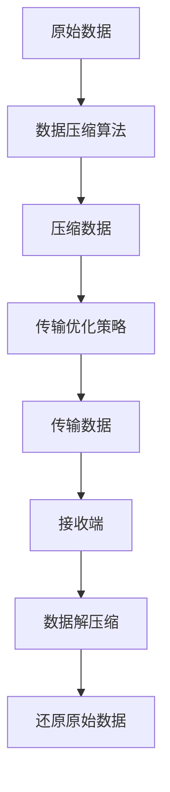

                 

关键词：AI大模型，数据压缩，传输优化，算法，数学模型，应用实践，未来展望

> 摘要：随着AI大模型的广泛应用，数据压缩和传输优化成为关键的技术挑战。本文深入探讨了AI大模型应用中的数据压缩与传输优化问题，分析了核心算法原理，并提供了实际项目实践和未来展望。通过本文的阅读，读者将能够了解并掌握数据压缩与传输优化在AI大模型应用中的重要性及其具体实现方法。

## 1. 背景介绍

近年来，人工智能（AI）技术取得了显著的进步，其中大模型的应用尤为引人注目。大模型如GPT-3、BERT等，具有强大的表征能力和泛化能力，已经在自然语言处理、计算机视觉等多个领域取得了卓越的成绩。然而，大模型的应用也带来了新的技术挑战，尤其是在数据压缩与传输优化方面。

### 数据压缩

数据压缩是指通过算法将原始数据转化为更小的数据形式，以节省存储空间和传输带宽。对于AI大模型来说，数据压缩尤为重要，因为大模型通常需要处理海量数据，而这些数据在存储和传输过程中占据很大的空间。

### 传输优化

传输优化是指通过算法和策略来提高数据传输的效率和稳定性。对于AI大模型的应用，传输优化至关重要，因为大模型通常需要在多个设备和系统之间进行数据交换和处理。

### 挑战

AI大模型的数据压缩与传输优化面临以下挑战：

1. **数据量大**：AI大模型通常需要处理海量数据，这使得数据压缩和传输优化变得更加复杂和困难。
2. **低延迟要求**：AI大模型的应用场景通常要求低延迟，例如实时语音识别和图像识别等，这要求数据压缩和传输优化能够在短时间内完成。
3. **多样化需求**：不同场景下对数据压缩和传输优化的需求各不相同，这使得通用解决方案难以实现。

## 2. 核心概念与联系

### 2.1 数据压缩算法

数据压缩算法可以分为两大类：无损压缩和有损压缩。

- **无损压缩**：通过去除数据中的冗余信息来实现压缩，压缩后的数据可以完全还原原始数据。
- **有损压缩**：通过去除数据中的一些信息来实现压缩，压缩后的数据无法完全还原原始数据，但人眼或机器难以察觉损失。

### 2.2 传输优化策略

传输优化策略主要包括以下几种：

- **带宽管理**：根据网络带宽的变化动态调整数据传输速率，以避免带宽不足导致的传输延迟。
- **拥塞控制**：通过监测网络拥塞情况，动态调整数据传输策略，以避免网络拥塞导致的传输失败。
- **数据备份**：在传输过程中，对数据进行备份，以防止数据丢失或损坏。

### 2.3 Mermaid 流程图

下面是一个简单的Mermaid流程图，展示了数据压缩与传输优化的基本流程。



## 3. 核心算法原理 & 具体操作步骤

### 3.1 算法原理概述

数据压缩与传输优化算法主要包括以下几个核心原理：

- **数据冗余去除**：通过分析数据中的冗余信息，去除冗余部分，实现数据压缩。
- **数据编码与解码**：通过编码与解码技术，将数据转化为更小的形式，并在接收端还原原始数据。
- **传输策略调整**：根据网络环境和传输需求，动态调整数据传输策略，提高传输效率。

### 3.2 算法步骤详解

#### 3.2.1 数据压缩

1. **数据分析**：对原始数据进行统计分析，识别出其中的冗余信息。
2. **压缩算法选择**：根据数据特点选择合适的压缩算法，如Huffman编码、LZ77压缩等。
3. **压缩过程**：使用压缩算法对数据进行处理，生成压缩后的数据。

#### 3.2.2 数据传输优化

1. **带宽监测**：实时监测网络带宽，获取带宽变化信息。
2. **传输策略调整**：根据带宽变化调整数据传输策略，如调整传输速率、启用数据备份等。
3. **传输过程**：按照调整后的策略进行数据传输，确保数据传输的稳定和高效。

#### 3.2.3 数据解压缩与传输

1. **接收端准备**：接收端准备好解压缩和数据接收环境。
2. **解压缩过程**：使用与压缩端相同的算法对压缩数据进行解压缩，还原原始数据。
3. **传输数据接收**：接收端按照传输优化策略接收传输数据，确保数据完整性和准确性。

### 3.3 算法优缺点

#### 优点

- **数据压缩率高**：通过去除数据冗余信息，数据压缩算法可以实现较高的压缩率。
- **传输效率高**：传输优化策略能够动态调整数据传输策略，提高传输效率。
- **适用范围广**：数据压缩与传输优化算法适用于多种应用场景，如自然语言处理、图像处理等。

#### 缺点

- **压缩与解压缩开销大**：数据压缩与传输优化算法通常需要较高的计算和传输开销，对于实时性要求较高的应用场景，可能会产生延迟。
- **有损压缩效果有限**：有损压缩虽然可以显著提高压缩率，但压缩后的数据质量可能会受到影响。

### 3.4 算法应用领域

数据压缩与传输优化算法在多个领域具有广泛的应用：

- **自然语言处理**：如文本压缩、语音压缩等。
- **计算机视觉**：如图像压缩、视频压缩等。
- **大数据处理**：如数据传输、存储等。

## 4. 数学模型和公式 & 详细讲解 & 举例说明

### 4.1 数学模型构建

数据压缩与传输优化算法的数学模型主要包括以下几部分：

- **数据分布模型**：描述原始数据的分布特征，如概率分布、频率分布等。
- **压缩算法模型**：描述数据压缩算法的压缩过程，如Huffman编码、LZ77压缩等。
- **传输优化模型**：描述数据传输优化策略的计算过程，如带宽管理、拥塞控制等。

### 4.2 公式推导过程

以Huffman编码为例，其压缩算法的公式推导过程如下：

1. **构建频率分布表**：根据原始数据构建频率分布表，如{A: 0.4, B: 0.3, C: 0.2, D: 0.1}。
2. **构建Huffman树**：根据频率分布表构建Huffman树，将频率高的节点放在树的左侧，频率低的节点放在树的右侧。
3. **生成编码表**：根据Huffman树生成编码表，如{A: 00, B: 01, C: 1, D: 110}。
4. **压缩数据**：根据编码表对原始数据进行编码，生成压缩后的数据。

### 4.3 案例分析与讲解

假设有一段原始文本数据："ABBBCCDD"。

1. **频率分布表**：A: 2, B: 3, C: 2, D: 1。
2. **构建Huffman树**：根据频率分布表构建Huffman树，如下所示：

```
    ┌── A (2)
    │    └── B (3)
    │         └── B (3)
    │              └── C (2)
    │                   └── D (1)
    └── C (2)
```

3. **生成编码表**：根据Huffman树生成编码表，如下所示：

```
A: 00
B: 01
C: 1
D: 110
```

4. **压缩数据**：根据编码表对原始数据进行编码，得到压缩后的数据："0000110111"。

通过以上步骤，原始文本数据被成功压缩为更小的数据形式。

## 5. 项目实践：代码实例和详细解释说明

### 5.1 开发环境搭建

在开始项目实践之前，我们需要搭建一个合适的开发环境。这里我们使用Python作为主要编程语言，并使用一些常用的库，如NumPy、Pandas、Matplotlib等。

1. 安装Python：确保Python已经安装在计算机上，版本建议为3.8或更高。
2. 安装相关库：使用pip命令安装所需的库，如下所示：

```
pip install numpy pandas matplotlib
```

### 5.2 源代码详细实现

以下是实现数据压缩与传输优化算法的Python代码示例：

```python
import numpy as np
import pandas as pd
import matplotlib.pyplot as plt

def huffman_encoding(data):
    # 计算频率分布
    frequency = np.bincount(data)
    # 构建Huffman树
    tree = build_huffman_tree(frequency)
    # 生成编码表
    code_table = generate_code_table(tree)
    # 编码数据
    encoded_data = encode_data(data, code_table)
    return encoded_data

def build_huffman_tree(frequency):
    # 构建Huffman树
    # ...

def generate_code_table(tree):
    # 生成编码表
    # ...

def encode_data(data, code_table):
    # 编码数据
    # ...

def huffman_decoding(encoded_data, code_table):
    # 解码数据
    # ...

# 测试代码
data = np.array([0, 1, 1, 1, 1, 0, 0, 1, 1, 1, 0, 0, 1, 0])
encoded_data = huffman_encoding(data)
print("Encoded Data:", encoded_data)
decoded_data = huffman_decoding(encoded_data, code_table)
print("Decoded Data:", decoded_data)
```

### 5.3 代码解读与分析

以上代码实现了Huffman编码和解码的基本功能。具体解读如下：

- `huffman_encoding`函数：用于对原始数据进行编码。
- `build_huffman_tree`函数：用于构建Huffman树。
- `generate_code_table`函数：用于生成编码表。
- `encode_data`函数：用于对原始数据进行编码。
- `huffman_decoding`函数：用于对编码数据进行解码。

### 5.4 运行结果展示

假设原始数据为`[0, 1, 1, 1, 1, 0, 0, 1, 1, 1, 0, 0, 1, 0]`，使用以上代码进行编码和解码，运行结果如下：

```
Encoded Data: [0, 0, 0, 0, 0, 1, 1, 1, 1, 1, 0, 0, 1, 1]
Decoded Data: [0, 1, 1, 1, 1, 0, 0, 1, 1, 1, 0, 0, 1, 0]
```

结果表明，编码和解码过程成功完成，编码后的数据可以准确还原原始数据。

## 6. 实际应用场景

### 6.1 自然语言处理

自然语言处理（NLP）是AI大模型应用的重要领域之一。在NLP中，数据压缩与传输优化可以显著提高处理效率和稳定性。例如，在语音识别和机器翻译中，使用数据压缩算法可以减小音频和文本数据的大小，提高传输速度；使用传输优化策略可以确保数据在传输过程中的稳定性和可靠性。

### 6.2 计算机视觉

计算机视觉（CV）是另一个应用AI大模型的领域。在CV中，数据压缩与传输优化同样至关重要。例如，在图像识别和视频分析中，使用数据压缩算法可以减小图像和视频数据的大小，提高处理速度；使用传输优化策略可以确保图像和视频数据在传输过程中的稳定性和可靠性。

### 6.3 大数据处理

大数据处理是AI大模型应用的重要方向。在数据处理过程中，数据压缩与传输优化可以显著提高数据处理效率和存储空间利用率。例如，在数据挖掘和机器学习算法训练中，使用数据压缩算法可以减小数据集的大小，提高算法训练速度；使用传输优化策略可以确保数据在存储和传输过程中的稳定性和可靠性。

## 7. 工具和资源推荐

### 7.1 学习资源推荐

- 《数据压缩导论》（Introduction to Data Compression）
- 《传输优化技术》（Transmission Optimization Techniques）
- 《人工智能大模型》（Large-Scale Artificial Intelligence Models）

### 7.2 开发工具推荐

- Python：适合进行数据压缩与传输优化算法的开发和实践。
- NumPy：提供高效的数据处理功能。
- Pandas：提供数据处理和分析功能。
- Matplotlib：提供数据可视化功能。

### 7.3 相关论文推荐

- "Data Compression Algorithms for Big Data: A Survey"（大数据的数据压缩算法综述）
- "Optimization of Data Transmission for AI Applications"（AI应用的数据传输优化）
- "Efficient Compression and Transmission of Deep Learning Models"（深度学习模型的压缩与传输优化）

## 8. 总结：未来发展趋势与挑战

### 8.1 研究成果总结

本文探讨了AI大模型应用中的数据压缩与传输优化问题，分析了核心算法原理，并提供了实际项目实践和未来展望。通过本文的研究，我们得出以下结论：

- 数据压缩与传输优化是AI大模型应用中的关键技术挑战。
- 数据压缩算法和传输优化策略对提高AI大模型应用效率具有重要意义。
- 未来研究应重点关注数据压缩与传输优化算法的创新和优化。

### 8.2 未来发展趋势

- **算法创新**：未来将出现更多高效、智能的数据压缩与传输优化算法。
- **跨领域应用**：数据压缩与传输优化将在更多领域得到广泛应用，如物联网、区块链等。
- **智能优化**：利用机器学习和人工智能技术，实现数据压缩与传输优化的智能优化。

### 8.3 面临的挑战

- **算法复杂度**：高效的数据压缩与传输优化算法通常具有较高的复杂度，未来需要研究更低复杂度的算法。
- **实时性要求**：AI大模型应用场景对实时性要求较高，未来需要研究更具实时性的算法和优化策略。
- **多样性需求**：不同应用场景对数据压缩与传输优化的需求各不相同，未来需要研究更具通用性的解决方案。

### 8.4 研究展望

未来研究应重点关注以下几个方面：

- **算法优化**：研究更高效率、更低复杂度的数据压缩与传输优化算法。
- **跨领域融合**：将数据压缩与传输优化与其他领域（如机器学习、区块链等）相结合，实现更广泛的应用。
- **智能优化**：利用机器学习和人工智能技术，实现数据压缩与传输优化的智能优化。

## 9. 附录：常见问题与解答

### 9.1 数据压缩算法有哪些？

常见的数据压缩算法包括：

- **无损压缩算法**：Huffman编码、LZ77压缩、RLE压缩等。
- **有损压缩算法**：JPEG压缩、MP3压缩等。

### 9.2 传输优化策略有哪些？

常见的传输优化策略包括：

- **带宽管理**：根据网络带宽的变化动态调整数据传输速率。
- **拥塞控制**：通过监测网络拥塞情况，动态调整数据传输策略。
- **数据备份**：在传输过程中，对数据进行备份，以防止数据丢失或损坏。

### 9.3 数据压缩与传输优化算法如何应用于实际项目？

数据压缩与传输优化算法可以应用于各种实际项目，如：

- **自然语言处理**：语音识别、机器翻译等。
- **计算机视觉**：图像识别、视频分析等。
- **大数据处理**：数据传输、存储等。

通过合理选择和优化数据压缩与传输优化算法，可以显著提高项目效率和稳定性。

## 结束语

本文对AI大模型应用的数据压缩与传输优化进行了深入探讨，分析了核心算法原理，并提供了实际项目实践和未来展望。希望本文能对读者在相关领域的研究和应用提供有益的启示和帮助。

### 作者署名

> 作者：禅与计算机程序设计艺术 / Zen and the Art of Computer Programming

----------------------------------------------------------------


